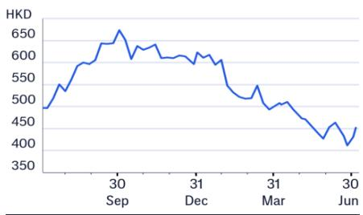
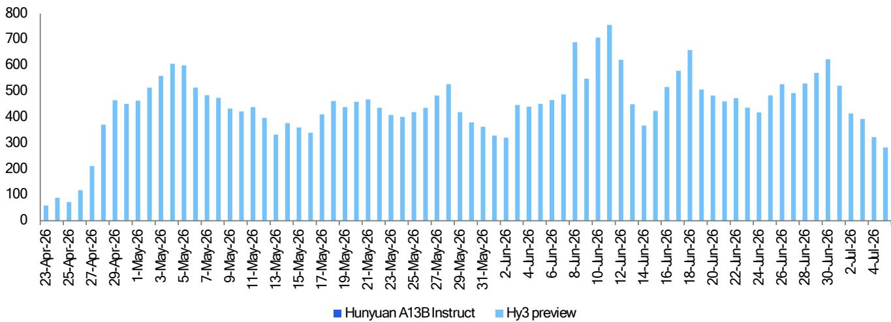

# Tencent Holdings (0700.HK)

## 2Q26E Preview: Gaming & Ads Solid with Continuing AI Investment

## CITI'S TAKE

Tencent will report 2Q26 results on Aug 12. While we expect solid revenue growth thanks to continued strength in gaming despite softer seasonality and steady growth of ad revenue, we are cautious on AI spend and profit as we have more conservative profit assumption than consensus. Into 2H26, we expect focus remains on Agentic AI testing within WeChat, integration of Mini Program with Hy3, release of next iteration/upgrade of Hy model and capex spend. Moreover, we believe Tencent will continue to evaluate its investment portfolio with rotation and rebalance between strategic AI-related investment vs maturing industry with limited future synergies. Opportunistic buyback and AI investment as well as strengthening core business growth empowering with AI enhancement will remain as key priorities, in our view. Our target price is adjusted to HK\$758 (from HK\$763) reflecting changes in investment portfolio value. Maintain positive view on AI play.

Official HY 3, WorkBuddy traction & AI Mini Program — Tencent Cloud is rapidly advancing its AI agent ecosystem, following the June 5th launch of its "Agent-Ready" data platform and a new "Productivity Agent Suite". The advanced and cost-effective Hy3 model was officially launched on July 6th following its preview on April 23 which has attracted a 20x increase in daily token consumption since its preview, signaling strong adoption across many industries. On July 7th, WeChat announced the upgrade of its AI Mini Program Growth Plan to boost the adoption of Hy3 within WeChat ecosystem.

2Q26 preview — We model 2Q26 total revenue to up 9.3% yoy to Rmb201.7bn and non-GAAP net profit to +5.1% yoy to Rmb66.25bn or 32.8% margin, vs. Bloomberg consensus of Rmb203.9bn (+10.5% yoy) and Rmb69.1bn (34% margin). We forecast total online games +8.3% yoy to Rmb64.1bn with domestic/international games +8%/+9% yoy to Rmb43.6bn/Rmb20.5bn. We model online ad revenue +19% yoy to Rmb42.5bn and FBS revenue up 9% yoy to Rmb60.5bn, of which cloud revenue +24% yoy to Rmb14bn and fintech revenue +5.2% yoy to Rmb46.5bn. We model GP/OP to +9.3%/+5.7% yoy to Rmb114.8bn/Rmb73.2bn. We expect result likely inline with potential small deviation on upside risk to our gaming forecast and downside to FBS.

New games pipeline— Into 3Q26E, Tencent has released Just Dance: Party/Rust on Jul 2/9 and Control Resonant to be released by Sep 24. Pipeline includes Monster Hunter Outlanders, Rainbow Six Siege and Animula Nook.

## Earnings Summary

<table><tr><td>Year to 31 Dec</td><td>Net Profit (RmbM)</td><td>Diluted EPS (Rmb)</td><td>EPS growth (%)</td><td>P/E (x)</td><td>P/B (x)</td><td>ROE (%)</td><td>Yield (%)</td></tr><tr><td>2024A</td><td>222,703</td><td>23.672</td><td>44.3</td><td>16.5</td><td>3.7</td><td>25.0</td><td>1.2</td></tr><tr><td>2025A</td><td>259,626</td><td>28.086</td><td>18.6</td><td>13.9</td><td>3.1</td><td>24.4</td><td>1.4</td></tr><tr><td>2026E</td><td>267,621</td><td>29.177</td><td>3.9</td><td>13.4</td><td>2.8</td><td>22.3</td><td>1.3</td></tr><tr><td>2027E</td><td>283,476</td><td>30.913</td><td>5.9</td><td>12.6</td><td>2.6</td><td>21.9</td><td>1.3</td></tr><tr><td>2028E</td><td>313,569</td><td>34.202</td><td>10.6</td><td>11.4</td><td>2.4</td><td>22.2</td><td>1.4</td></tr></table>

Source: Powered by dataCentral

## Positive View

Price (06 Jul 26 16:10) HK\$452.00

Target price HK\$758.00↓

Expected share price return 67.7%

Expected dividend yield 1.3%

Expected total return 69.0%

Market Cap HK\$4,109,752M

## Price Performance

Alicia Yap, CFA $^{AC}$ +852-2501-2773
alicia.yap@citi.com

Nelson Cheung
nelson.cheung@citi.com

Vicky Wei, CFA
vicky.wei@citi.com

Price: HK\$452.00; TP: HK\$758.00; Market Cap: HK\$4,109,752m; Recomm: Positive

<table><tr><td>Profit &amp; Loss (Rmbm)</td><td>2024</td><td>2025</td><td>2026E</td><td>2027E</td><td>2028E</td></tr><tr><td>Sales revenue</td><td>660,257</td><td>751,766</td><td>820,970</td><td>893,678</td><td>967,569</td></tr><tr><td>Cost of sales</td><td>-311,011</td><td>-329,173</td><td>-356,184</td><td>-385,010</td><td>-413,213</td></tr><tr><td>Gross profit</td><td>349,246</td><td>422,593</td><td>464,787</td><td>508,667</td><td>554,356</td></tr><tr><td>Gross Margin (%)</td><td>52.9</td><td>56.2</td><td>56.6</td><td>56.9</td><td>57.3</td></tr><tr><td>EBITDA (Adj)</td><td>287,736</td><td>339,449</td><td>363,114</td><td>434,475</td><td>480,483</td></tr><tr><td>EBITDA Margin (Adj) (%)</td><td>43.6</td><td>45.2</td><td>44.2</td><td>48.6</td><td>49.7</td></tr><tr><td>Depreciation</td><td>-27,332</td><td>-32,799</td><td>-44,332</td><td>-96,517</td><td>-109,200</td></tr><tr><td>Amortisation</td><td>-28,881</td><td>-33,229</td><td>-29,555</td><td>-32,172</td><td>-33,091</td></tr><tr><td>EBIT (Adj)</td><td>237,811</td><td>280,656</td><td>295,678</td><td>312,097</td><td>344,505</td></tr><tr><td>EBIT Margin (Adj) (%)</td><td>36.0</td><td>37.3</td><td>36.0</td><td>34.9</td><td>35.6</td></tr><tr><td>Net interest</td><td>4,023</td><td>1,779</td><td>4,770</td><td>6,701</td><td>11,027</td></tr><tr><td>Associates</td><td>29,363</td><td>33,908</td><td>22,002</td><td>22,298</td><td>22,570</td></tr><tr><td>Non-Op/Except/Other Adj</td><td>-29,712</td><td>-39,094</td><td>-35,443</td><td>-37,807</td><td>-38,998</td></tr><tr><td>Pre-tax profit</td><td>241,485</td><td>277,249</td><td>287,008</td><td>303,289</td><td>339,104</td></tr><tr><td>Tax</td><td>-45,018</td><td>-47,448</td><td>-57,185</td><td>-60,658</td><td>-67,821</td></tr><tr><td>Extraord./Min.Int./Pref.div.</td><td>-2,394</td><td>-4,959</td><td>-5,151</td><td>-5,011</td><td>-4,871</td></tr><tr><td>Reported net profit</td><td>194,073</td><td>224,842</td><td>224,672</td><td>237,621</td><td>266,412</td></tr><tr><td>Net Margin (%)</td><td>29.4</td><td>29.9</td><td>27.4</td><td>26.6</td><td>27.5</td></tr><tr><td>Core NPAT</td><td>222,703</td><td>259,626</td><td>267,621</td><td>283,476</td><td>313,569</td></tr></table>

<table><tr><td>Valuation ratios</td><td>2024</td><td>2025</td><td>2026E</td><td>2027E</td><td>2028E</td></tr><tr><td>PE (x)</td><td>16.5</td><td>13.9</td><td>13.4</td><td>12.6</td><td>11.4</td></tr><tr><td>PB (x)</td><td>3.7</td><td>3.1</td><td>2.8</td><td>2.6</td><td>2.4</td></tr><tr><td>EV/EBITDA (x)</td><td>10.2</td><td>8.4</td><td>7.7</td><td>6.3</td><td>5.5</td></tr><tr><td>FCF yield (%)</td><td>5.2</td><td>6.0</td><td>6.2</td><td>7.9</td><td>8.9</td></tr><tr><td>Dividend yield (%)</td><td>1.2</td><td>1.4</td><td>1.3</td><td>1.3</td><td>1.4</td></tr><tr><td>Payout ratio (%)</td><td>19</td><td>19</td><td>17</td><td>16</td><td>16</td></tr><tr><td>ROE (%)</td><td>21.8</td><td>21.1</td><td>18.8</td><td>18.3</td><td>18.9</td></tr></table>

<table><tr><td>Cashflow (Rmbm)</td><td>2024</td><td>2025</td><td>2026E</td><td>2027E</td><td>2028E</td></tr><tr><td>EBITDA</td><td>264,312</td><td>307,590</td><td>334,123</td><td>402,980</td><td>447,797</td></tr><tr><td>Working capital</td><td>21,881</td><td>16,484</td><td>13,630</td><td>16,194</td><td>17,688</td></tr><tr><td>Other</td><td>-27,672</td><td>-21,022</td><td>-25,739</td><td>-30,459</td><td>-37,630</td></tr><tr><td>Operating cashflow</td><td>258,521</td><td>303,052</td><td>322,014</td><td>388,714</td><td>427,856</td></tr><tr><td>Capex</td><td>-69,451</td><td>-87,324</td><td>-98,512</td><td>-107,237</td><td>-110,300</td></tr><tr><td>Net acq/disposals</td><td>-4,941</td><td>-34,717</td><td>-296</td><td>-126</td><td>62</td></tr><tr><td>Other</td><td>-47,795</td><td>-83,691</td><td>10,594</td><td>-96,352</td><td>-113,001</td></tr><tr><td>Investing cashflow</td><td>-122,187</td><td>-205,732</td><td>-88,214</td><td>-203,715</td><td>-223,239</td></tr><tr><td>Dividends paid</td><td>-28,859</td><td>-37,535</td><td>-48,151</td><td>-46,058</td><td>-45,148</td></tr><tr><td>Financing cashflow</td><td>-176,494</td><td>-87,155</td><td>-104,722</td><td>-101,808</td><td>-113,126</td></tr><tr><td>Net change in cash</td><td>-39,801</td><td>8,522</td><td>127,106</td><td>80,825</td><td>88,653</td></tr><tr><td>Free cashflow to s/holders</td><td>189,070</td><td>215,728</td><td>223,502</td><td>281,477</td><td>317,556</td></tr></table>

<table><tr><td>Per share data</td><td>2024</td><td>2025</td><td>2026E</td><td>2027E</td><td>2028E</td></tr><tr><td>Reported EPS (Rmb)</td><td>20.629</td><td>24.323</td><td>24.495</td><td>25.912</td><td>29.058</td></tr><tr><td>Core EPS (Rmb)</td><td>23.672</td><td>28.086</td><td>29.177</td><td>30.913</td><td>34.202</td></tr><tr><td>DPS (Rmb)</td><td>4.500</td><td>5.300</td><td>5.099</td><td>5.000</td><td>5.312</td></tr><tr><td>CFPS (Rmb)</td><td>27.479</td><td>32.784</td><td>35.107</td><td>42.389</td><td>46.667</td></tr><tr><td>FCFPS (Rmb)</td><td>20.097</td><td>23.337</td><td>24.367</td><td>30.695</td><td>34.637</td></tr><tr><td>BVPS (Rmb)</td><td>105.033</td><td>127.039</td><td>137.364</td><td>149.884</td><td>163.029</td></tr><tr><td>Wtd avg ord shares (m)</td><td>9,269</td><td>9,085</td><td>9,032</td><td>9,030</td><td>9,028</td></tr><tr><td>Wtd avg diluted shares (m)</td><td>9,408</td><td>9,244</td><td>9,172</td><td>9,170</td><td>9,168</td></tr></table>

<table><tr><td>Growth rates</td><td>2024</td><td>2025</td><td>2026E</td><td>2027E</td><td>2028E</td></tr><tr><td>Sales revenue (%)</td><td>8.4</td><td>13.9</td><td>9.2</td><td>8.9</td><td>8.3</td></tr><tr><td>EBIT (Adj) (%)</td><td>23.9</td><td>18.0</td><td>5.4</td><td>5.6</td><td>10.4</td></tr><tr><td>Core NPAT (%)</td><td>41.2</td><td>16.6</td><td>3.1</td><td>5.9</td><td>10.6</td></tr><tr><td>Core EPS (%)</td><td>44.3</td><td>18.6</td><td>3.9</td><td>5.9</td><td>10.6</td></tr></table>

<table><tr><td>Balance Sheet (Rmbm)</td><td>2024</td><td>2025</td><td>2026E</td><td>2027E</td><td>2028E</td></tr><tr><td>Cash &amp; cash equiv.</td><td>132,519</td><td>141,041</td><td>268,147</td><td>348,972</td><td>437,625</td></tr><tr><td>Accounts receivables</td><td>48,203</td><td>49,930</td><td>53,982</td><td>58,762</td><td>63,621</td></tr><tr><td>Inventory</td><td>440</td><td>530</td><td>657</td><td>715</td><td>774</td></tr><tr><td>Net fixed &amp; other tangibles</td><td>282,037</td><td>322,741</td><td>363,008</td><td>376,132</td><td>379,673</td></tr><tr><td>Goodwill &amp; intangibles</td><td>196,127</td><td>205,999</td><td>201,444</td><td>194,272</td><td>186,181</td></tr><tr><td>Financial &amp; other assets</td><td>1,121,669</td><td>1,318,745</td><td>1,276,460</td><td>1,339,877</td><td>1,414,490</td></tr><tr><td>Total assets</td><td>1,780,995</td><td>2,038,986</td><td>2,163,697</td><td>2,318,730</td><td>2,482,363</td></tr><tr><td>Accounts payable</td><td>118,712</td><td>121,127</td><td>129,787</td><td>139,237</td><td>147,172</td></tr><tr><td>Short-term debt</td><td>61,508</td><td>53,160</td><td>56,574</td><td>58,574</td><td>60,574</td></tr><tr><td>Long-term debt</td><td>146,521</td><td>208,369</td><td>209,881</td><td>211,881</td><td>213,881</td></tr><tr><td>Provisions &amp; other liab</td><td>400,358</td><td>415,265</td><td>434,681</td><td>458,475</td><td>486,924</td></tr><tr><td>Total liabilities</td><td>727,099</td><td>797,921</td><td>830,924</td><td>868,166</td><td>908,551</td></tr><tr><td>Shareholders' equity</td><td>973,548</td><td>1,154,152</td><td>1,240,709</td><td>1,353,488</td><td>1,471,866</td></tr><tr><td>Minority interests</td><td>80,348</td><td>86,913</td><td>92,064</td><td>97,075</td><td>101,946</td></tr><tr><td>Total equity</td><td>1,053,896</td><td>1,241,065</td><td>1,332,773</td><td>1,450,563</td><td>1,573,812</td></tr><tr><td>Net debt (Adj)</td><td>75,510</td><td>120,488</td><td>-1,692</td><td>-78,517</td><td>-163,170</td></tr><tr><td>Net debt to equity (Adj) (%)</td><td>7.2</td><td>9.7</td><td>-0.1</td><td>-5.4</td><td>-10.4</td></tr></table>

For definitions of the items in this table, please click here.

# Business Update & 2Q26E Preview

## Latest updates on Tencent Cloud and AI development

Tencent Cloud upgrades Data Platform for Agents

On June 5th Tencent Cloud announced a significant upgrade to its data platform, making it "Agent-Ready" to support AI Agents as a new class of user. The new three-tier architecture includes the production-grade data agent DataBuddy, the intelligent data platform WeData, and an AI-native data infrastructure. This system is designed to facilitate seamless collaboration between humans and AI, allowing Agents to execute complex data tasks such as modeling, ETL development, and report generation through natural language commands, thereby boosting R&D efficiency by five to ten times.

A core part of the upgrade is the WeData platform, which acts as a unified control plane with a new semantic layer, enabling Agents to better understand business context and achieve over 90% accuracy in converting natural language to SQL. The underlying AI-native infrastructure has been rebuilt for intelligence across storage, computing, data, and systems, featuring a multi-Agent collaboration system and autonomous operational capabilities. These enhancements, also available for on-premises deployment, aim to accelerate the large-scale adoption of Agents in enterprise environments.

## Productivity Agent Suite Debuts

On June 5th Tencent Cloud launched a comprehensive "Productivity Agent Suite" designed to integrate AI into various workflows for both individual and enterprise users. This new suite features a range of tools, including the upgraded WorkBuddy for personal productivity, CodeBuddy for software development, and the new WorkBuddy Enterprise AI Workspace, which integrates with Tencent Docs and Tencent LearnShare. The launch reflects Tencent's strategy of building practical, scalable AI solutions that solve real-world problems, with a focus on the co-design of models and products to enhance usability.

Supporting this initiative, Tencent Cloud also upgraded its core infrastructure with the Hy3 Preview model, the TokenHub platform for efficient model inference, and a new Agent Runtime for optimized performance and security. These tools have already proven effective within Tencent, with CodeBuddy reportedly reducing coding time by 40% for its engineers. The suite is now being deployed across more than 20 industries, including finance, retail, and healthcare, to foster large-scale human-AI collaboration.

## Workbuddy further gains traction

On July 6, news media Gelonghui cited Analysys that Tencent's WorkBuddy ranked as top office agent with 8.85mn monthly visits in Mar 2026 compared with over 20mn monthly visits among top office agent products. The article suggested that WorkBuddy has conducted 43 version upgrades 3 months after launch. Gelonghui suggested that Tencent internally has already positioned WorkBuddy as the third phenomenal product following QQ and WeChat leveraging its straightforward deployment, WeChat ecosystem authorization, full integration with tools within Tencent ecosystem and external applications.

Figure 1. Product pricing related to WorkBuddy

<table><tr><td colspan="5">Tencent Cloud Coding Plan</td></tr><tr><td>Package</td><td colspan="2">Lite</td><td colspan="2">Pro</td></tr><tr><td>Standard pricing</td><td colspan="2">Rmb40/ month</td><td colspan="2">Rmb200/ month</td></tr><tr><td>Usage limit</td><td colspan="2">1,200 requests per 5 hours, 9,000 requests per week, 18,000 requests per month</td><td colspan="2">6,000 requests per 5 hours, 45,000 requests per week, 90,000 requests per month</td></tr><tr><td colspan="5">Code Assistant (Joint Subscription for CodeBuddy and WorkBuddy)</td></tr><tr><td>Package</td><td>Experience</td><td>Standard</td><td>Premium</td><td>Flagship</td></tr><tr><td>Standard pricing</td><td>Free</td><td>Rmb99/ month</td><td>Rmb199/ month</td><td>Rmb999/ month</td></tr><tr><td>Consecutive monthly subscription</td><td>Free</td><td>Rmb70/ month</td><td>Rmb140/ month</td><td>Rmb700/ month</td></tr><tr><td>Model deployment</td><td>Automatic</td><td>All available</td><td>All available</td><td>All available</td></tr><tr><td>Scenario</td><td>Beginner</td><td>Daily light assistance</td><td>High-frequency, office</td><td>Complex</td></tr><tr><td colspan="5">Enterprise Solution (CodeBuddy and WorkBuddy Inclusive)</td></tr><tr><td>Package</td><td colspan="2">Enterprise SaaS</td><td colspan="2">Enterprise Private Cloud</td></tr><tr><td>Standard pricing</td><td colspan="2">Rmb198/ pp / month</td><td colspan="2">Rmb316/ pp / month</td></tr></table>

© 2026 Citi Inc. No redistribution without Citi's written permission.  
Source: Company Reports, Citi

## Hy3 is officially released on July 6th

On July 6th, Tencent announced it has officially launched Hy3, following its release of preview version on April 23. Tencent noted that the model demonstrates significantly enhanced performance relative to models of the same size, while achieving intelligence comparable to flagship models with two to five times its parameter scale. Compared with the preview version, it also delivers greater stability and cost efficiency. Hy3 has already been adopted across Tencent products and services, including WorkBuddy/CodeBuddy, Yuanbao, Marvis, ima and others. Its API is now available on Tencent Cloud TokenHub, with global third-party developer platforms set to integrate Hy3 progressively.

Compared to Hy3 preview, Hy3 takes another leap across a wide range of tasks through strengthened reinforcement learning and enhanced data quality and diversity, delivering performance comparable to larger-scale flagship models. Hy3 has made particularly notable progress in productivity tasks such as software development, office productivity, financial modeling, front-end design and game production, making it a reliable and cost-efficient choice. Tencent also noted that since the launch of Hy3 preview, its average daily token consumption has increased twenty-fold, reflecting growing market recognition of its positioning as a practical and cost-effective model.

Figure 2. Tencent Cloud Hunyuan major milestones and achievements in 2026

<table><tr><td>Date</td><td>Event</td><td>Milestones</td></tr><tr><td>28-Jan-26</td><td>Open source</td><td>Open-sourced Hunyuan-Image 3.0-Instruct</td></tr><tr><td>30-Jan-26</td><td>Product launch</td><td>Launch of CodeBuddy Code 2.0</td></tr><tr><td>9-Mar-26</td><td>Product launch</td><td>Launch of WorkBuddy as all-scenario AI agent</td></tr><tr><td>1-Apr-26</td><td>Product launch</td><td>Launch of ADP Agent Portal as cross-platform enterprise agent portal</td></tr><tr><td>2-Apr-26</td><td>Product launch</td><td>Launch of ClawPro as enterprise-level OpenClaw</td></tr><tr><td>3-Apr-26</td><td>Product launch</td><td>Launch of TencentDB Agent Memory as OpenClaw's long memory</td></tr><tr><td>8-Apr-26</td><td>Product launch</td><td>Launch of QBotClaw on QQ Browser</td></tr><tr><td>9-Apr-26</td><td>Product launch</td><td>Launch of QClaw V2</td></tr><tr><td>16-Apr-26</td><td>Product launch</td><td>Launch of HY-World 2.0</td></tr><tr><td>23-Apr-26</td><td>Product launch</td><td>Launch of HY3-Preview</td></tr><tr><td>18-May-26</td><td>Product launch</td><td>Launch of Ardot as AI design agent platform</td></tr><tr><td>19-May-26</td><td>Product launch</td><td>Launch of DataBuddy as big data agent platform</td></tr><tr><td>6-Jul-26</td><td>Product launch</td><td>Launch of HY3</td></tr></table>

© 2026 Citi Inc. No redistribution without Citi's written permission.  
Source: Company Reports, Citi

Figure 3. Tencent HY tokens processed on OpenRouter by products (bn)  
  
© 2026 Citi Inc. No redistribution without Citi's written permission.  
Source: OpenRouter, Citi

## Mobile games

## Tencent's top 3 titles dominate iOS grossing chart in 2Q26

During Apr-Jun 2026, there were 5/6/5 games published by Tencent ranked as top 10 mobile games in China by iOS grossing by month-end of Apr-Jun 2026, per data.ai tracking. For example, HoK continued to top iOS grossing chart by ranking #1 in month-end of Apr-Jun, while Peacekeeper Elite was ranked #2/2/4 by month-end of Apr-Jun and Delta Force was ranked #3/4/2 by month-end of Apr-Jun respectively.

Other notable titles include: 1) Valorant Mobile which was ranked #9/6/5 by month-end of Apr-Jun; 2) Fight of the Golden Spatula which was ranked #10/10/9 by month-end of Apr-Jun; 3) other top-ranking titles include DnF Mobile. As of Jul 6, 4 out of top 10 mobile games by iOS grossing were published by Tencent including HoK (#1), Peacekeeper Elite (#2), Delta Force (#3), Valorant Mobile (#8), per data.ai.

Figure 4. Top 10 mobile games in China by monthly iOS grossing (Apr 30, 2026)

<table><tr><td>Ranking</td><td>Game Title</td><td>Publisher</td></tr><tr><td>1</td><td>Honour of Kings</td><td>Tencent</td></tr><tr><td>2</td><td>Peacekeeper Elite</td><td>Tencent</td></tr><tr><td>3</td><td>Delta Force</td><td>Tencent</td></tr><tr><td>4</td><td>Whiteout Survival</td><td>Century Games</td></tr><tr><td>5</td><td>Fantasy Westward Journey</td><td>NetEase</td></tr><tr><td>6</td><td>Fishing Battle</td><td>Tuyoo</td></tr><tr><td>7</td><td>Tomb Busters</td><td>Giant Network</td></tr><tr><td>8</td><td>Genshin Impact</td><td>miHoYo</td></tr><tr><td>9</td><td>Valorant Mobile</td><td>Tencent</td></tr><tr><td>10</td><td>Fight of Golden Spatula</td><td>Tencent</td></tr><tr><td colspan="3">© 2025 Citi Inc. No redistribution without Citi's written permission. Source: data.ai, Citi</td></tr></table>

Figure 5. Top 10 mobile games in China by monthly iOS grossing (May 31, 2026)

<table><tr><td>Ranking</td><td>Game Title</td><td>Publisher</td></tr><tr><td>1</td><td>Honour of Kings</td><td>Tencent</td></tr><tr><td>2</td><td>Peacekeeper Elite</td><td>Tencent</td></tr><tr><td>3</td><td>Whiteout Survival</td><td>Century Games</td></tr><tr><td>4</td><td>Delta Force</td><td>Tencent</td></tr><tr><td>5</td><td>Fantasy Westward Journey</td><td>NetEase</td></tr><tr><td>6</td><td>Valorant Mobile</td><td>Tencent</td></tr><tr><td>7</td><td>Anipop</td><td>Happy Elements</td></tr><tr><td>8</td><td>DnF Mobile</td><td>Tencent</td></tr><tr><td>9</td><td>Eggy Party</td><td>NetEase</td></tr><tr><td>10</td><td>Fight of Golden Spatula</td><td>Tencent</td></tr></table>

Figure 6. Top 10 mobile games in China by monthly iOS grossing (Jun 30, 2026)

<table><tr><td>Ranking</td><td>Game Title</td><td>Publisher</td></tr><tr><td>1</td><td>Honour of Kings</td><td>Tencent</td></tr><tr><td
