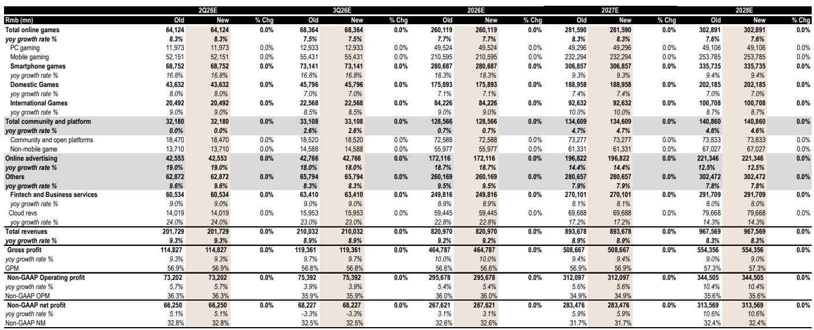
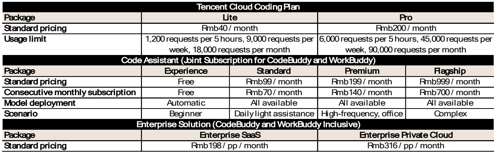
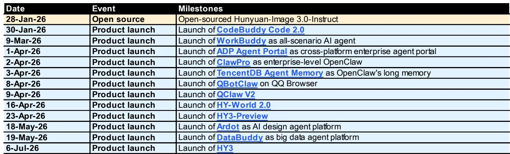

# 腾讯的AI商业化正在落地，但市场可能低估了短期建设成本

腾讯正进入多年来最具战略意义的时期。公司在游戏和广告领域实现核心业务复苏的同时，也在积极布局企业级AI。即将发布的2026年第二季度财报预计将显示稳健的收入增长：总收入预计同比增长9.3%至2017亿元人民币，其中游戏增长8.3%，广告增长19%。然而，在这一表面强劲之下，存在一个定义当前研究主题的关键矛盾。非GAAP净利润预计仅同比增长5.1%，显著落后于收入增长，AI基础设施投入带来的利润率变化将首次以持续的方式显现。

这并非一家公司走向衰退的故事。这是一个公司做出深思熟虑的选择，以今天的利润空间换取未来平台优势的故事。市场对腾讯的定价约为13.4倍远期收益，这一倍数反映了市场对AI投入周期能否带来相应回报的观望态度。乐观观点基于三个支柱：游戏的结构性复苏、广告市场份额的增长轨迹，以及以混元模型生态系统为依托的AI平台业务的兴起。谨慎观点则更简单：AI资本支出可能比预期更长时间地压缩回报，而中国AI市场的竞争格局依然激烈。

对于观察者而言，战略问题并非腾讯是否在做正确的事，而是市场是否正确评估了这一转变的时机、规模和风险。过去六个月的数据表明，答案比乐观或谨慎观点所承认的更为复杂。

## 游戏和广告提供基础，但增长构成正在变化

核心业务仍是引擎，且运行良好。在线游戏收入预计为641亿元人民币，其中国内游戏增长8%，国际游戏增长9%。这并非爆发式增长，但增长稳健且受到产品线的结构性支撑，包括《怪物猎人：荒野》《彩虹六号：围攻》和《控制：共鸣》等主要作品将在下半年进入市场。其意义不在于相对增长率，而在于可预测性。腾讯的游戏业务已成熟为现金流机器，可以为其他领域的积极投入提供资金。

广告业务是更有趣的故事。同比增长19%，腾讯的广告业务正在一个其微信生态系统货币化历史上未被充分利用的市场中获取份额。AI在广告定向和投放中的整合是一个实际因素，但更重要的结构性驱动因素是微信商业基础设施的持续扩展，包括小程序和视频号。广告业务现已达到一定规模，即使每用户货币化率的微小改善也能转化为显著的收入增量。

金融科技与企业服务（FBS）增长9%，但该板块内部存在显著差异。金融科技收入仅增长5.2%，反映了监管约束和更成熟的支付市场。然而，云收入同比增长24%至140亿元人民币。这是与AI主题最直接相关的板块。云增长由企业采用腾讯的AI服务驱动，包括混元模型和WorkBuddy智能助手平台。云业务相对于游戏或广告仍然较小，但其增长轨迹和战略重要性正在迅速加速。

这意味着：腾讯的短期财务表现仍由其传统优势主导，但估值倍数扩张的边际驱动因素将越来越依赖于其AI布局的成功。市场可以建模游戏和广告，但对AI基础设施投入的回报率可见度要低得多。

## 混元生态系统正从技术演示走向商业部署

过去一个季度最重要的进展并非财务指标，而是腾讯AI能力产品化为一个连贯的生态系统。7月6日混元3模型的正式发布，继4月预览之后，标志着从研究阶段的AI向可商业部署技术的转变。该模型旨在提供与参数数量为其两到五倍的旗舰模型相当的性能，这是直接针对更大、更昂贵的替代方案的竞争定位。

比模型本身更重要的是围绕它构建的平台。腾讯云于6月5日推出的“Agent-Ready”数据平台是一个三层架构，包括用于数据助手的DataBuddy、WeData智能数据平台和AI原生数据基础设施。这不是一个理论架构。它旨在使企业能够部署AI助手，通过自然语言命令执行复杂的数据任务，据称将自然语言转换为SQL的准确率超过90%。同日推出的生产力助手套件包括用于个人生产力的WorkBuddy、用于软件开发的CodeBuddy，以及与腾讯文档和腾讯乐享集成的企业工作空间。

采用指标尚处于早期，但方向积极。根据第三方数据，WorkBuddy在2026年3月录得885万月访问量，在中国办公助手产品中排名第一。自推出以来，它在三个月内经历了43次版本升级，反映了积极的迭代周期。CodeBuddy据称已将腾讯自身工程师的编码时间减少了40%。自预览发布以来，混元模型的每日令牌消耗量增长了二十倍，表明企业正在实际采用。

战略逻辑很清晰。腾讯并非试图赢得AI模型基准竞赛，而是试图赢得企业部署竞赛。通过构建直接集成到现有工作流程（尤其是在微信生态系统内）的工具，腾讯正在创造纯模型提供商无法复制的分发优势。问题在于这些早期采用指标能否转化为持续的规模化收入增长。

## 市场关注AI投入是正确的，但可能忽略了组合再平衡的动态

市场对腾讯的主要关注点是资本支出。预计2026年资本支出将达到985亿元人民币，高于2025年的873亿元人民币，并且轨迹表明2027年和2028年将进一步增加。这些投入对于构建支持混元生态系统的AI基础设施（包括数据中心、GPU集群和网络）是必要的。对利润率的影响在预测中可见：调整后EBIT利润率预计将从2025年的37.3%下降至2026年的36.0%，进一步下降至2027年的34.9%，然后在2028年恢复至35.6%。

市场对这一利润率变化的关注可以理解，但可能忽略了一个同样重要的二阶动态。腾讯正在积极调整其投资组合以资助其AI目标。公司正在将资金从未来协同效应有限的成熟行业转向战略性AI相关投入。这不是一个被动过程，而是一种有意识的资本重新配置，对资产负债表和利润表都有影响。

投资组合再平衡有两个效果。首先，通过资产剥离产生现金，这些现金可以重新部署到AI资本支出中，而无需额外债务或股权融资。其次，减少了历史上拖累报告收益的低效投入的影响。净效果是腾讯的AI支出部分自筹资金，这一动态并未在简单的资本支出与收入比率中体现。

对观察者的启示是，利润率变化的故事可能没有看起来那么令人担忧。如果腾讯能够在通过投资组合轮换为AI投入提供资金的同时保持核心业务增长，那么收益轨迹可能比市场共识预期的更具韧性。关键变量是投资组合货币化的速度以及腾讯退出非核心持股的估值。

## 报告尚未完全回答的问题：企业AI部署的单位经济性

当前研究中最重要的分析空白是腾讯AI业务的单位经济性。我们有采用指标、产品公告和定价层级。我们没有企业AI产品的客户获取成本、留存率或生命周期价值计算。可用的定价数据，例如WorkBuddy和CodeBuddy的定价层级从个人用户每月40元人民币到企业私有云部署每用户每月316元人民币不等，表明其高端定位。但如果没有关于有多少客户从免费试用转化为付费订阅，或者他们保持参与的时间长度的数据，就无法评估这项业务在规模化后是否真正盈利。

报告的财务预测显示，云收入从2026年第二季度的140亿元人民币增长到一条暗示到2028年达到显著规模的轨迹。但云收入包括基础设施即服务、平台即服务和软件即服务，这些细分市场之间的组合具有非常不同的利润率特征。AI助手业务可能比基础云计算的利润率更高，但也可能需要更高的客户支持成本和更多定制化。

还有一个关于竞争定位的未解决问题。腾讯正在与阿里云、百度智能云以及一系列国内外AI平台提供商竞争。中国的企业AI市场并非赢家通吃的市场，但可能是赢家通吃的市场，而当前数据不允许对腾讯的相对地位进行清晰评估。令牌消耗量增长二十倍令人印象深刻，但它是从低基数开始的，并且没有揭示相对于竞争对手的市场份额。

这些并非否定主题的理由，而是在对AI业务赋予溢价估值之前要求更多证据的理由。市场目前对腾讯AI努力的定价接近于零，这要么是那些相信采用轨迹将加速的人的重大机会，要么是对不确定性的公平评估。

## 评估腾讯AI转型的决策框架

对于试图形成对腾讯看法的观察者来说，分析挑战在于从一家拥有多个移动部件的公司中分离信号和噪声。一个结构化的决策框架可以帮助澄清关键变量及其相对重要性。

第一个变量是核心业务动能。游戏和广告收入增长需要分别保持在中高个位数和十几位数。如果任一板块显著减速，AI投入的资金将受到限制，利润率故事将变得更糟。需要关注的关键指标是季度游戏发布计划、广告收入增长率以及任何关于微信用户参与趋势的评论。广告增长持续减速至15%以下将是一个警示信号。

第二个变量是AI采用速度。相关指标不是模型基准分数，而是商业指标：WorkBuddy和CodeBuddy的企业客户数量、每客户平均收入以及从免费到付费层级的转化率。报告中关于月访问量和版本升级的数据有用但不充分。观察者应寻找证据表明这些早期采用者正在随时间扩展其使用，这将表明真正的价值创造而非试用。

第三个变量是资本配置纪律。腾讯的回购计划和股息政策为股东回报提供了底线，但关键问题是AI资本支出是否被有效部署。报告指出腾讯正在评估其投资组合以寻找轮换机会，这是一个积极信号。风险在于AI资本支出成为一个吸收现金而不产生相应回报的黑洞。这里的关键指标是AI板块的增量投入资本回报率，目前尚未披露，但可以从云收入增长相对于总资本支出的关系中进行近似估算。

第四个变量是中国AI市场的竞争动态。监管环境、先进半导体的可用性以及竞争对手的定价策略都会影响腾讯货币化其AI投入的能力。混元3的近期发布及其成本效益定位表明腾讯正在以价值而非原始性能进行竞争，这在一个价格敏感的企业市场中可能是一个可持续的策略。

该框架表明，腾讯最重要的催化剂并非2026年第二季度财报本身，而是接下来两个季度关于AI采用和货币化的证据。如果第四季度显示云收入增长加速且利润率稳定或改善，市场将开始将AI主题纳入定价。如果数据不明确，股价将保持区间波动，等待市场获得更清晰的信息。

## 完整报告包含检验这些假设的数据

上述分析基于研究报告的预测、产品公告和战略框架，但必然遗漏了允许观察者构建自己的模型并检验自己假设的细粒度数据。完整报告包括按板块划分的详细收入细分、到2028年的利润率预测、显示腾讯净债务头寸演变的资产负债表分析，以及揭示腾讯AI工具货币化策略的具体产品定价表。

更重要的是，完整报告包含可视化腾讯财务轨迹转折点的原始图表。这些图表显示了资本支出与收入增长之间的关系、板块利润率随时间的演变，以及市场目前正在折现的隐含投入资本回报率。对于希望超越标题叙事并形成自己对腾讯AI转型看法的观察者来说，这些图表至关重要。

加入社区阅读完整报告并查看原始图表。

*仅供参考。部分内容可能基于源材料通过AI辅助生成、翻译、总结或编辑，可能包含遗漏或错误。请独立核实。这不构成专业建议。*

仅供参考。部分内容可能基于源材料通过AI辅助生成、翻译、总结或编辑，可能包含遗漏或错误。请独立核实。这不构成专业建议。

