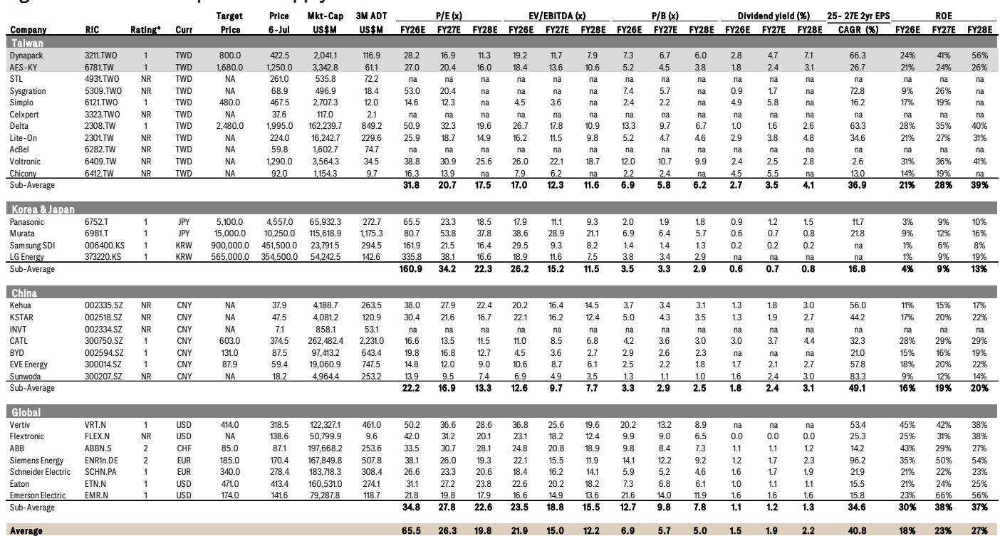
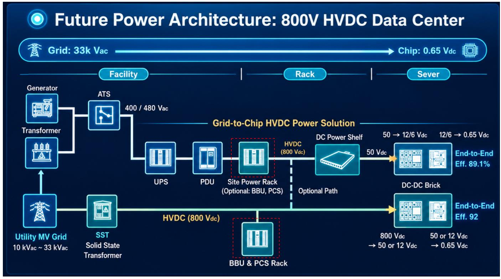
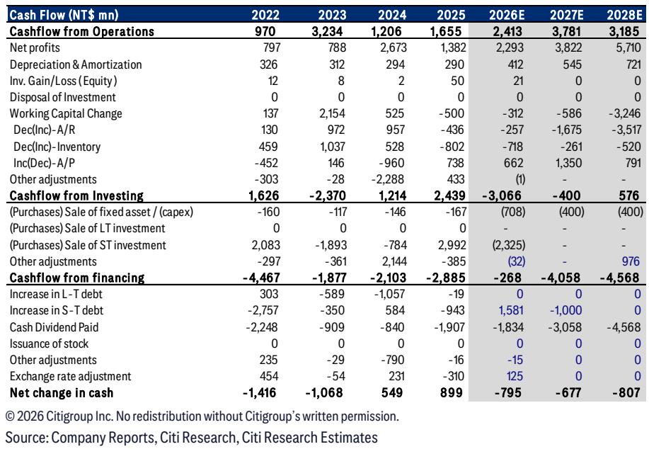

# The AI Data Center Power Architecture Is Shifting From Centralized UPS to Rack-Level Backup, Creating a Multi-Year Growth Cycle for BBU Suppliers

The market has focused intently on GPU compute density, interconnect bandwidth, and cooling solutions as the key bottlenecks in AI infrastructure scaling. But a less visible, equally critical constraint is emerging: power architecture. As AI rack power density rises from the current 40-70kW range toward 140kW and beyond, the centralized uninterruptible power supply (UPS) model that has served data centers for decades is reaching its structural limits. A global research report argues that this shift is not incremental but architectural, and it will drive a multi-year adoption cycle for battery backup units (BBUs) that remains underappreciated by most observers.

The thesis is straightforward but powerful. Rising rack power density creates a physics problem for centralized UPS systems: longer power distribution paths, higher conversion losses, and slower fault ride-through times. The solution is to move backup power from the facility level to the rack level, embedding BBUs directly into the power shelf. This is not a marginal improvement. It is a re-architecture of how AI data centers manage power reliability, and it carries profound implications for the entire power electronics supply chain.

This analysis unpacks the report's core argument, examines the specific beneficiary the report highlights, and extends the logic into second-order implications that the report leaves partially unexplored. The goal is not to summarize the report but to interpret its strategic meaning for those trying to position for the next phase of AI infrastructure buildout.

## The Transition From Centralized UPS to Distributed BBU Is a Structural Shift, Not a Cyclical One

The report's central insight is that BBU adoption is being driven by a fundamental physical constraint, not by a temporary preference shift. As rack power density increases, the distance between a centralized UPS and the rack it serves introduces latency that defeats the purpose of backup power. In high-density AI racks operating at 100kW or more, even milliseconds of power interruption can cause GPU training runs to fail, wasting hours of compute time and millions of dollars in electricity. Centralized UPS systems, no matter how well designed, cannot deliver the sub-millisecond ride-through capability that high-density AI workloads require.

This is where BBU becomes essential. By placing backup power at the rack level, BBU eliminates the distance problem. It provides instantaneous power failover, reduces conversion losses because the power path is shorter, and scales linearly with rack density rather than requiring massive facility-level overhauls. The report estimates that BBU penetration will rise from 40-45% in 2025 to over 85% by 2027. That is not a gradual adoption curve. It is an inflection.

The so-what here is that the market may be underestimating the speed and inevitability of this transition. Many observers still view BBU as an optional add-on for hyperscale data centers, a niche technology that serves only the most demanding AI clusters. The report's analysis suggests the opposite: BBU is becoming a standard component for any AI rack above a certain power threshold, and as GPU generations advance, that threshold will include an increasingly large portion of the total AI server market.

## BBU Content Value Per Rack Will More Than Double as Power Architectures Evolve to Higher Density Configurations

The report provides a bottom-up module-level analysis that quantifies the opportunity. For the current generation GB300 NVL72 architecture, BBU content value per rack is approximately USD 15,000 to 16,000. For the next-generation Rubin architecture, that figure rises to USD 17,000 to 18,000. For the Rubin Ultra configuration, the report estimates BBU content value could exceed USD 33,000 per rack.

This is not simply a function of more racks being deployed. The content value per rack is rising because higher-density architectures require higher-power BBU modules. A 140kW rack cannot use the same BBU modules as a 70kW rack. The modules themselves must be more capable, more expensive, and often more numerous. This creates a compounding effect: more racks times higher value per rack equals a total addressable market that is growing faster than the underlying AI infrastructure buildout.

The report also highlights that this content value expansion is being supported by the adoption of rack-scale architectures and HVDC power distribution. These are not independent trends. They are mutually reinforcing. Rack-scale architectures concentrate power demand at the rack level, which makes BBU more necessary. HVDC distribution reduces conversion losses, which makes BBU more efficient. Together, they create a favorable environment for BBU adoption that extends beyond any single GPU generation.

## Dynapack Offers a Compelling Risk-Reward Profile Because Its Earnings Are in the Early Phase of a Multi-Year Margin Expansion Story

The report initiates coverage of Dynapack at NT$422.50. The valuation basis is 32x 2027 estimated EPS of NT$25. This is not a cheap multiple, but the report argues it is justified by the growth trajectory: 34% sales CAGR and 60% earnings CAGR over 2025-2028.

The key driver of this earnings growth is not just revenue expansion but margin improvement. The report forecasts gross profit margin rising from 16.6% in 2025 to 28.4% in 2028. That is a dramatic improvement, and it is driven by product mix shift toward higher-margin BBU products. As non-IT sales (which include BBU) grow at a 74% CAGR, they will increasingly dominate the revenue mix, pulling overall margins higher.

This is where the report's argument becomes strategically interesting. Many observers view Dynapack primarily as a notebook battery pack assembler, a low-margin, high-volume business with limited pricing power. The report is arguing that this identity is about to change. As BBU becomes a larger share of revenue, Dynapack's business model shifts from component assembly to power architecture solution provider. The margin structure changes. The competitive dynamics change. The valuation multiple should change as well.

The report explicitly compares Dynapack to AES, which it describes as the dominant BBU supplier with scale, customer relationships, and technology leadership. Yet the report prefers Dynapack at this stage of the cycle because its earnings are in the early phase of growth and margin expansion, whereas AES's earnings are more mature. This is a classic growth cycle positioning argument, and it highlights a key analytical question that the report raises but does not fully resolve.

## What the Report Does Not Fully Answer: How Sustainable Is Dynapack's Competitive Advantage in BBU?

The report makes a convincing case that the BBU market is growing rapidly and that Dynapack is well-positioned to benefit. But it leaves several important questions unanswered, and these questions should matter to anyone considering the thesis.

First, the report does not provide a detailed analysis of Dynapack's technological differentiation in BBU. It mentions strong partnerships with PSU operators that provide access to a broader CSP base, but it does not explain what specific technical capabilities Dynapack brings to the table. Is its BBU module design superior to competitors? Does it have proprietary battery management system software? Or is its advantage primarily manufacturing scale and customer relationships? The answer matters for assessing the durability of its margin expansion.

Second, the report does not address the risk of commoditization. BBU modules are, at their core, battery packs with power management electronics. They are not as complex as GPU interconnects or cooling systems. If multiple suppliers can produce functionally equivalent BBU modules, pricing pressure could compress margins before Dynapack reaches the 28% gross margin target. The report assumes margin expansion, but it does not model the competitive dynamics that could limit it.

Third, the report does not explore the implications of vertical integration by hyperscalers. If major cloud service providers decide to design their own BBU modules internally, or to source them from their preferred battery cell partners, Dynapack's access to CSP customers could be constrained. The report mentions access to a broader CSP base through PSU partnerships, but it does not quantify how much of the addressable market this partnership model covers.

These are not fatal flaws in the thesis. They are analytical gaps that create both risk and opportunity. Those who can answer these questions more definitively than the report does will have an edge.

## A Decision Framework for Evaluating BBU Supply Chain Investments

For those looking to apply this report's insights to their own decisions, the following framework may be useful. It translates the report's analysis into a structured set of questions that should be asked before making a BBU supply chain evaluation.

**Step 1: Assess the power density trajectory of the end customer base.** Not all AI data centers are moving to high-density racks at the same pace. Hyperscalers with the largest GPU clusters are leading the transition, while enterprise and colocation data centers are lagging. The faster the end customer base moves to high-density architectures, the faster BBU penetration will rise. One should map which suppliers serve which customer segments and adjust exposure accordingly.

**Step 2: Evaluate the margin sensitivity to product mix.** The report's thesis for Dynapack depends heavily on margin expansion from mix shift. But mix shift is not automatic. It requires that BBU sales grow faster than legacy IT sales, and that BBU margins remain structurally higher than legacy margins. One should stress-test this assumption by modeling scenarios where BBU margins compress to legacy levels over time. If the margin expansion thesis breaks, the earnings CAGR drops significantly.

**Step 3: Analyze the partnership ecosystem.** BBU is not a standalone product. It integrates with PSUs, power shelves, and rack-level power distribution systems. Suppliers with strong partnerships across this ecosystem have a structural advantage in winning design wins. Suppliers without such partnerships may be limited to secondary or replacement markets. The report highlights Dynapack's PSU partnerships as a positive, but one should verify the depth and exclusivity of these relationships.

**Step 4: Consider the battery cell supply chain.** BBU modules require high-quality lithium-ion cells, and the cell supply chain is concentrated among a small number of large manufacturers. Any disruption in cell supply, or any shift in cell technology (such as a move to solid-state batteries), could reshape the competitive landscape. One should assess whether the target supplier has secured adequate cell supply agreements and whether it has the technical capability to adapt to new cell chemistries.

**Step 5: Compare valuation across the BBU supply chain.** The report provides a valuation comparison table that shows Dynapack trading at 28.2x FY26E P/E versus 27.0x for AES, 50.9x for Delta, and 38.8x for Voltronic. On an EV/EBITDA basis, Dynapack trades at 19.2x FY26E versus 18.4x for AES and 26.7x for Delta. These multiples are not cheap, but they are not extreme either, especially given the growth rates. The key question is whether the growth is priced in or whether there is still upside to estimates.

## The Unanswered Questions That Make the Full Report Worth Reading

This analysis has extracted the core strategic logic from the report, but the report itself contains substantially more detail on module-level content analysis, competitive positioning, and financial projections. For those who want to build a deeper understanding of the BBU theme, several questions remain that the report addresses more fully than can be summarized here.

How exactly does the report derive its BBU content value estimates per rack? What assumptions about module size, cell count, and power rating drive the USD 33,000 figure for Rubin Ultra? What is the sensitivity of these estimates to changes in GPU power consumption or rack architecture?

What is the specific timeline for BBU adoption across different customer segments? The report provides aggregate penetration estimates, but does it break them down by hyperscaler versus enterprise? By region? By GPU generation? The answers matter for timing entry and exit points.

How does the report's thesis for Dynapack compare to its view on AES? The report states a preference for Dynapack at this stage of the cycle, but what specific catalysts or milestones would cause that preference to shift? At what valuation or earnings trajectory would AES become the preferred exposure?

These are not gaps in the report. They are the natural depth that a full research document provides. For those who want to move beyond the strategic overview into the analytical details that support decisions, the full report is essential reading.

Join the community to read the full report and review the original charts.

*For informational purposes only. Portions may be generated, translated, summarized, or edited with AI assistance based on source materials and may contain omissions or errors. Please verify independently. This is not professional advice.*

For informational purposes only. Portions may be generated, translated, summarized, or edited with AI assistance based on source materials and may contain omissions or errors. Please verify independently. This is not professional advice.

