# 中国太阳能行业观察

## 太阳能玻璃：接近短期转折点

自2025年第四季度以来，经过约九个月的库存积累和价格调整，我们认为太阳能玻璃行业可能正接近一个周期性转折点。行业库存似乎在2026年6月中旬达到峰值，此后下降了约10%，且近几周去库存速度有所加快。这与我们的月度供需分析一致，该分析表明，在组件需求温和回升（环比增长10%）和玻璃供应减少的支撑下，行业可能在7月进入去库存阶段。由于终端需求仍处于较低基数，且有望在2026年第四季度季节性回升，同时行业盈利状况限制了产能重启，我们预计太阳能玻璃价格将在未来几个月内反弹。信义光能（0968.HK）的股价自2026年5月中旬以来已回调约38%，我们认为当前0.6倍市净率的估值提供了具有吸引力的风险回报特征。

图1：信义光能股价 vs. 太阳能玻璃行业库存

<table><tr><td colspan="3">主要变化</td></tr><tr><td>公司</td><td>目标价</td><td>评级</td></tr><tr><td>0968.HK</td><td>4.70 至 3.60</td><td>-</td></tr><tr><td>2865.HK</td><td>50.00 至 39.00</td><td>-</td></tr><tr><td>3800.HK</td><td>1.40 至 1.10</td><td>-</td></tr><tr><td colspan="3">来源：DB</td></tr></table>

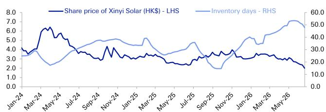  
图2：太阳能玻璃 - 月度供需分析（DBe）  
来源：彭博金融资讯，SCI99

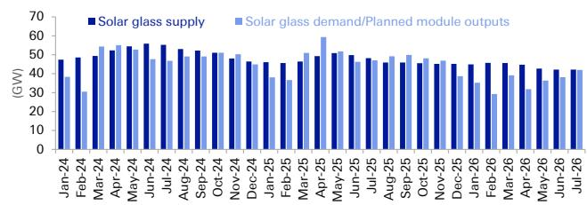  
来源：SCI99，DB估算

## 多晶硅：库存重新积累

另一方面，多晶硅环节约三个月的去库存（我们认为主要由通威推动）似乎已告一段落，期间生产商库存最多下降了约20%。随着水电资源丰富的中国西南地区进入夏季丰水期，闲置的多晶硅产能正逐步回归市场。据SMM数据，7月多晶硅产量预计环比增长6-7%。

## DB AG/香港

中国期待已久的多晶硅、硅片和组件能耗及能效标准现已最终确定，并将于2027年1月1日生效。如果有效执行，新标准可能淘汰现有近三分之一的多晶硅产能，使行业有效产能降至约240万吨/年。然而，我们认为仅凭这一点不足以恢复行业盈利能力，因为终端需求不足仍是主要挑战。我们预测2027年多晶硅需求为140万吨，这意味着即使在预期的产能优化之后，行业利用率仍可能低于60%。

图3：多晶硅行业库存（多晶硅生产商处）  
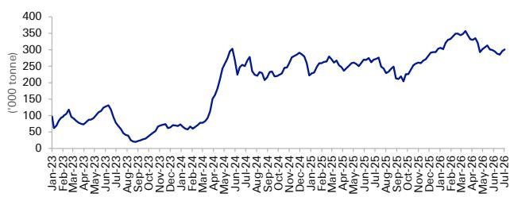  
来源：SMM

图4：多晶硅月度供需分析（DBe）  
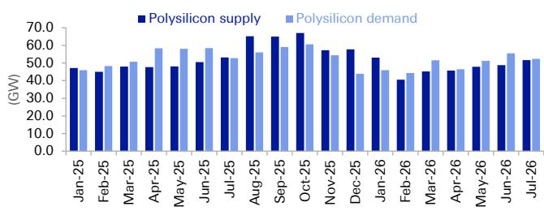  
来源：SMM，DB估算

## 估值与盈利预测调整

我们下调了信义光能、协鑫科技和海南钧达的盈利预测和目标价（详见下页），主要反映了2026年上半年太阳能定价低于预期以及行业整合前景不明朗。我们目前的偏好排序为：隆基绿能（BC技术）> 海南钧达（空间太阳能）> 信义光能（太阳能玻璃利润率接近底部）> 协鑫科技（电池材料上行空间，多晶硅仍面临压力）> 通威股份（受多晶硅供应过剩影响最大）。

DB中国太阳能月度供需监测历史版本：2025年1-2月、2025年3月、2025年4月、2025年5月、2025年6月、2025年7月、2025年8月、2025年9月、2025年10月、2025年11月、2025年12月、2026年1月、2026年2月、2026年3月、2026年4月、2026年5月、2026年6月

图5：中国太阳能行业估值比较

<table><tr><td rowspan="2">公司</td><td rowspan="2">彭博代码</td><td rowspan="2">市值（百万美元）</td><td rowspan="2">评级</td><td rowspan="2">目标价（本币）</td><td rowspan="2">价格（本币）</td><td rowspan="2">上行/下行</td><td colspan="3">市盈率（倍）</td><td colspan="3">市净率（倍）</td><td colspan="3">净资产回报表现（%）</td><td colspan="3">股息率（%）</td></tr><tr><td>2026E</td><td>2027E</td><td>2028E</td><td>2026E</td><td>2027E</td><td>2028E</td><td>2026E</td><td>2027E</td><td>2028E</td><td>2026E</td><td>2027E</td><td>2028E</td></tr><tr><td colspan="19">太阳能制造商</td></tr><tr><td>隆基绿能</td><td>601012 CH</td><td>13,611</td><td>买入</td><td>25.00</td><td>12.35</td><td>102%</td><td>n.m.</td><td>120.2</td><td>33.4</td><td>1.8</td><td>1.8</td><td>1.7</td><td>-5.0</td><td>1.5</td><td>5.2</td><td>0.0</td><td>0.1</td><td>0.4</td></tr><tr><td>海南钧达</td><td>2865 HK</td><td>1,996</td><td>买入</td><td>39.00</td><td>19.96</td><td>95%</td><td>n.m.</td><td>13.0</td><td>7.5</td><td>2.0</td><td>1.7</td><td>1.4</td><td>-18.5</td><td>14.4</td><td>20.9</td><td>0.0</td><td>0.0</td><td>0.0</td></tr><tr><td>信义光能</td><td>968 HK</td><td>2,344</td><td>买入</td><td>3.60</td><td>2.10</td><td>71%</td><td>n.m.</td><td>16.2</td><td>9.7</td><td>0.6</td><td>0.6</td><td>0.6</td><td>-0.8</td><td>4.0</td><td>6.4</td><td>0.0</td><td>3.5</td><td>5.9</td></tr><tr><td>协鑫科技</td><td>3800 HK</td><td>2,692</td><td>买入</td><td>1.10</td><td>0.67</td><td>64%</td><td>n.m.</td><td>24.2</td><td>8.4</td><td>0.5</td><td>0.5</td><td>0.5</td><td>-2.1</td><td>2.0</td><td>5.6</td><td>0.0</td><td>0.0</td><td>0.0</td></tr><tr><td>通威股份</td><td>600438 CH</td><td>7,583</td><td>卖出</td><td>10.00</td><td>11.64</td><td>-14%</td><td>n.m.</td><td>n.m.</td><td>180.1</td><td>1.6</td><td>1.8</td><td>1.8</td><td>-18.8</td><td>-9.8</td><td>1.0</td><td>0.0</td><td>0.0</td><td>0.0</td></tr></table>

来源：彭博金融资讯，DB估算（价格截至2026年7月6日）

## 主要盈利预测及目标价调整摘要

**信义光能（0968.HK）：** 由于2026年上半年太阳能玻璃价格低于预期（同比下降25%，环比下降19%），我们下调了信义光能的平均售价假设，预计公司将在2026财年出现亏损，并将2027-28财年每股盈利预测下调20-46%。相应地，我们将基于现金流折现法的目标价从4.7港元下调至3.6港元。我们的估值基于现金流折现法，假设加权平均资本成本为9%（股权成本10%，税后债务成本4%），终值增长率为1%。尽管如此，我们认为近期行业库存天数的转折可能预示着短期价格回升，因为当前太阳能玻璃价格处于历史低位，据我们估算，这意味着全行业现金亏损。在我们看来，当前0.6倍市净率的估值似乎过于悲观，而任何短期平均售价的回升都可能成为股价的短期催化剂。主要风险包括：1）中国太阳能需求低于预期；2）太阳能玻璃价格竞争超预期；3）信义光能海外扩张进展慢于预期。

**协鑫科技（3800.HK）：** 鉴于年初至今多晶硅价格持续承压且缺乏有意义的供给侧改革信号，我们现在预测2026年净亏损扩大至9亿元人民币，并将2027-28年每股盈利预测下调19-48%，将基于现金流折现法的目标价从1.4港元下调至1.1港元。我们的估值基于10%的加权平均资本成本（股权成本11%，税后债务成本4%）和1%的终值增长率（与其他太阳能制造公司的假设一致）。尽管短期盈利承压，我们仍认为协鑫科技是多晶硅生产商中长期布局较好的公司之一，其颗粒硅的成本优势以及磷酸铁锂材料等新业务的潜在贡献提供了支撑。主要风险包括：全球太阳能需求低于预期、与传统棒状硅的成本优势收窄幅度超预期，以及行业整合和供给侧改革持续存在不确定性。

**海南钧达（2865.HK）：** 虽然我们仍看好海南钧达在空间太阳能领域的领先地位，但短期盈利可能继续受到地面太阳能电池价格和利润率疲弱的影响。我们现在预测2026财年净亏损为6亿元人民币，并将2027-28年每股盈利预测下调38-53%，相应地将基于现金流折现法的目标价从50.0港元下调至39.0港元。我们预计空间太阳能相关盈利将逐步提升，并支持从2027年起恢复盈利增长。我们的现金流折现估值基于2.0%的无风险利率、5.0%的股权风险溢价、1.0贝塔系数、5.0%的税前债务成本、7.0%的加权平均资本成本和1.0%的终值增长率。主要下行风险包括：激烈竞争下太阳能电池价格低于预期、银浆成本高于预期，以及空间太阳能产品商业化进展慢于预期。

## 多晶硅：库存压力或将加大

■ 月度产量：据SMM数据，尽管当前价格承压，2026年7月多晶硅计划产量预计环比增长6%至98.2千吨。我们的计算显示，行业平均利用率将升至31%，环比上升2个百分点。

\- 库存：生产商库存已从6月中旬的低点反弹6%，推动总库存水平（多晶硅和硅片生产商合计）上升5%，相当于约6个月的产量。更重要的是，我们预计随着四川、云南等水电资源丰富地区的工厂在季节性电力成本下降期间提高利用率，7-8月产量将进一步增加，这可能会加剧本已高企的库存水平。

图6：多晶硅行业月度产量及平均产能利用率  
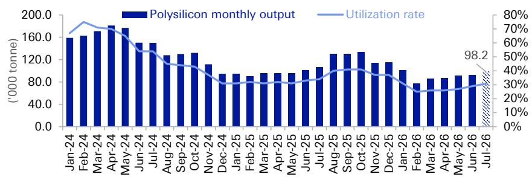  
来源：SMM

图7：多晶硅行业库存（多晶硅生产商处）  
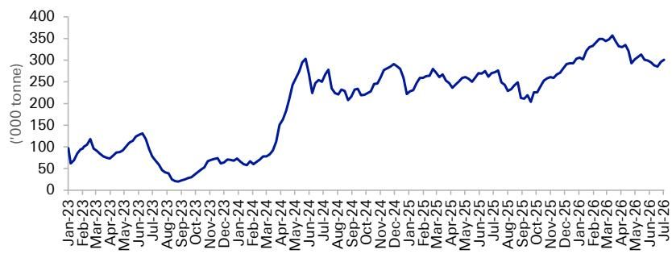  
来源：SMM

图8：多晶硅行业总库存（多晶硅生产商及硅片公司）  
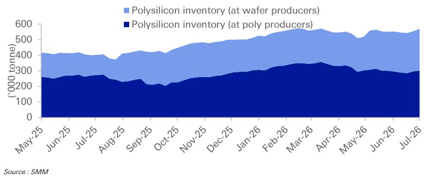

图9：多晶硅供需分析（DBe）  
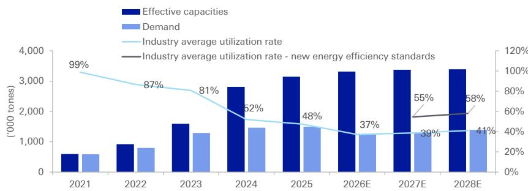

## 多晶硅：现货价格可能低于预期

\- 定价与利润率展望：进入2026年7月，现货价格仍面临压力，棒状硅和颗粒硅价格在6月下跌约4%后，本月至今再跌约1%。尽管能效新标准已发布，但我们认为近期下行风险仍大于上行风险，多晶硅价格在2026年第四季度季节性回升前，有可能在第三季度跌至30元/公斤以下。

中国期待已久的多晶硅、硅片和组件能耗及能效标准现已最终确定，并将于2027年1月1日生效。如果有效执行，新标准可能淘汰现有近三分之一的多晶硅产能，使行业有效产能降至约240万吨/年。然而，我们认为仅凭这一点不足以恢复行业盈利能力，因为终端需求不足仍是主要挑战。我们预测2027年多晶硅需求为140万吨，这意味着即使在预期的产能优化之后，行业利用率仍可能低于60%。

图10：多晶硅现货价格  
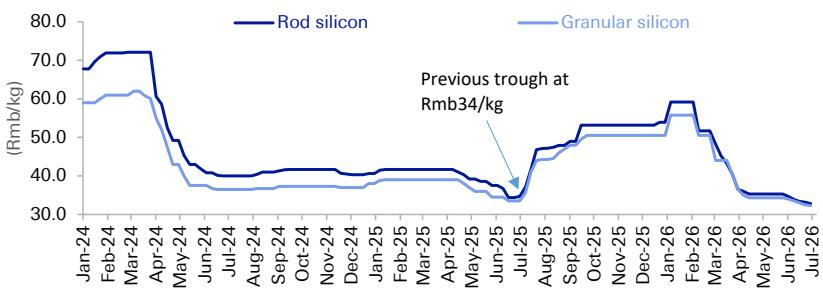  
来源：中国硅业协会，PV InfoLink

图11：多晶硅期货价格  
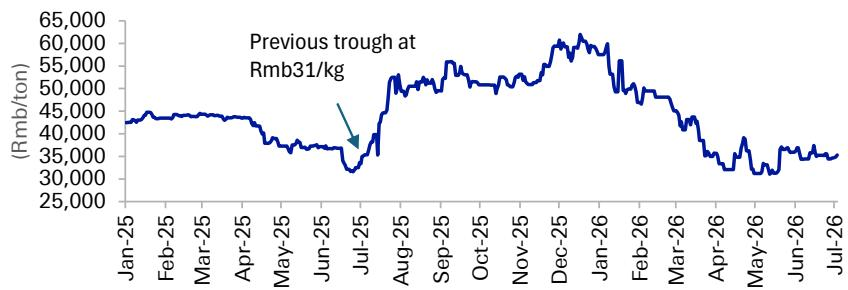  
来源：广州期货交易所，万得

图12：多晶硅单位全口径现金利润追踪  
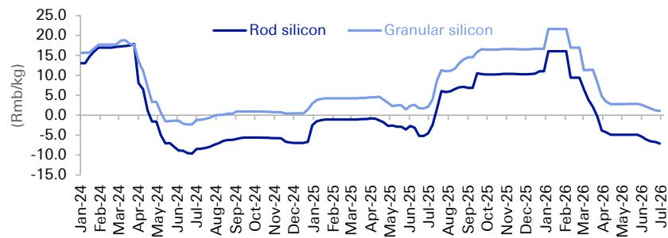

图13：多晶硅单位净利润追踪  
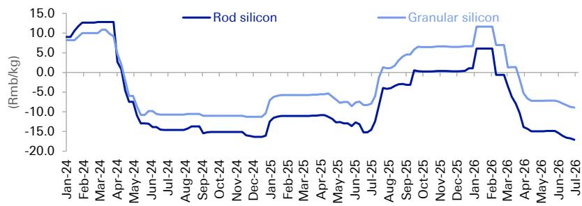

## 硅片：7月产量小幅下降

月度产量：据SMM数据，行业7月硅片计划产量预计环比下降6%至52GW。根据我们的计算，行业平均产能利用率约为52%。

月度库存：截至2026年6月底，硅片库存环比增长7%至28GW，而5月底为26GW。

图14：硅片月度产量及行业平均产能利用率  
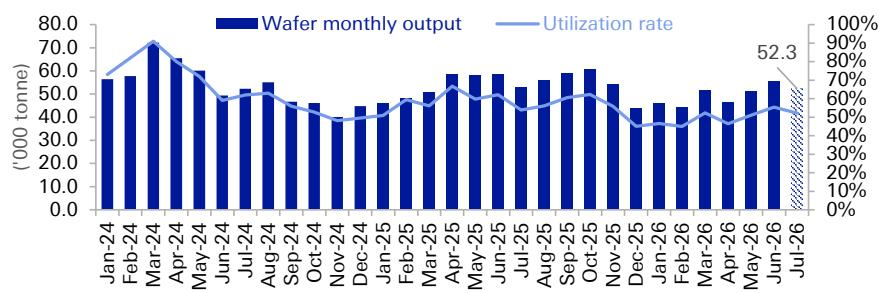  
来源：SMM

图15：硅片月度库存  
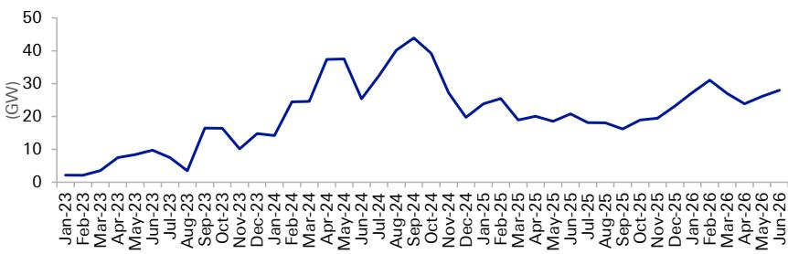  
来源：SMM

图16：硅片年度供需分析（DBe）  
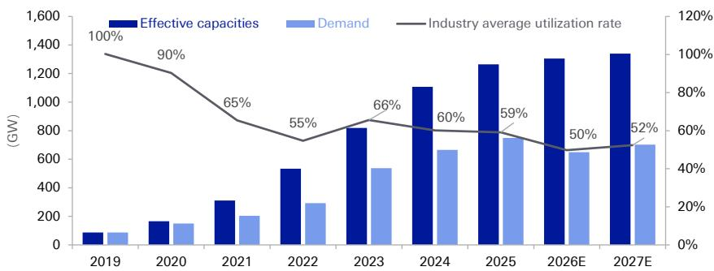  
来源：公司数据，DB估算

# 硅片：盈利能力徘徊在现金盈亏平衡水平

\- 定价与利润率展望：截至7月初，硅片价格较6月底下降0-2%，据我们估算，单位现金利润率大致在盈亏平衡附近徘徊。需求状况也相对平淡，限制了硅片定价和盈利能力的支撑。

图17：硅片现货价格  
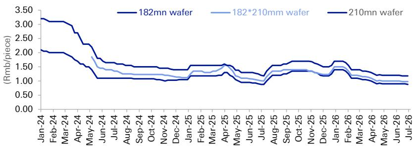  
来源：PV InfoLink

图18：硅片单位净利润追踪  
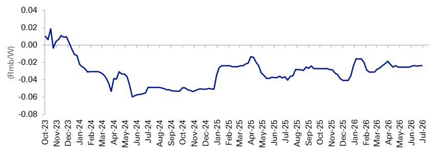  
来源：DB估算

图19：硅片单位全口径现金利润追踪  
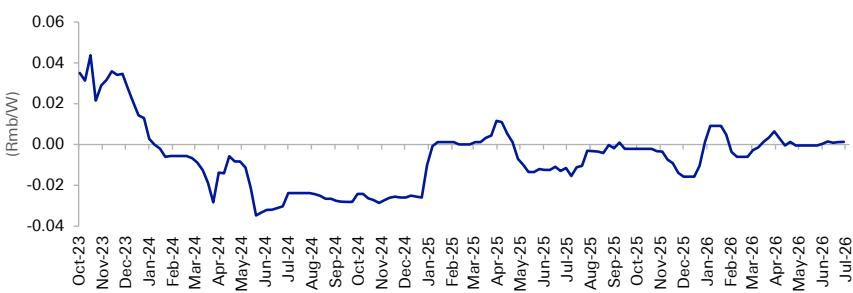  
来源：DB估算

## 电池片：产量和库存小幅上升

月度产量：据SMM数据，受一体化太阳能组件制造商产量增加推动，7月电池片计划产量预计环比增长8%至56GW。根据我们的计算，TOPCon电池片7月利用率可能达到约58%。

\- 库存：据SMM数据，截至6月底，电池片库存升至12.0GW，而5月底为11GW。

图20：电池片月度产量及行业平均产能利用率  
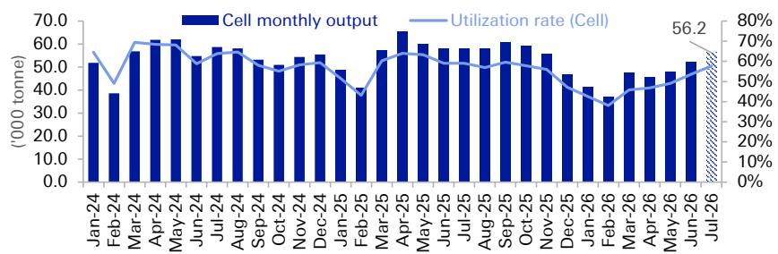

图21：电池片周度行业库存  
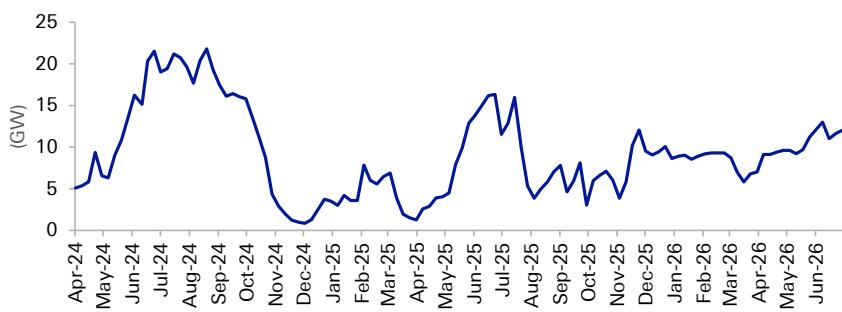  
来源：SMM  
来源：SMM

图22：TOPCon电池片年度供需分析（DBe）  
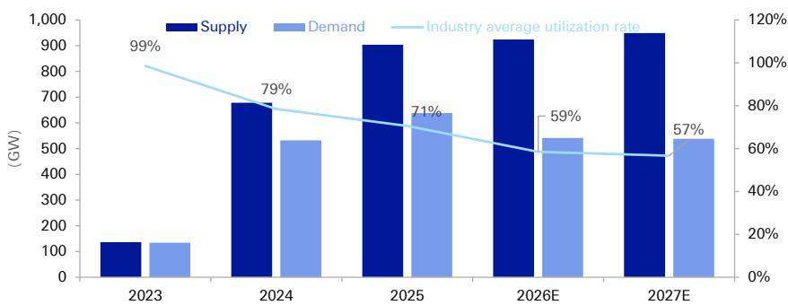  
来源：公司数据，DB估算

# 电池片：银浆成本缓解不足以抵消价格下跌

\- 定价与利润率展望：截至7月初，电池片价格大幅下跌15-17%，原因是库存压力和太阳能需求相对平淡。积极的一面是，随着近期银价回调（银浆价格环比下跌约20%），银浆成本已降至电池片生产成本的约35%（5月时超过40%）。电池片生产商的现金利润率在2026年7月初转为小幅负值。

图23：电池片现货价格  
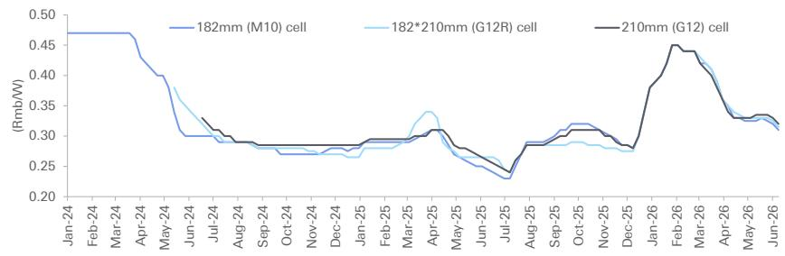  
来源：PV InfoLink

图24：电池片单位净利润追踪  
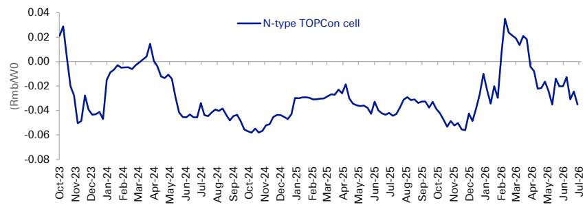  
来源：DB估算

图25：电池片单位全口径现金利润追踪  
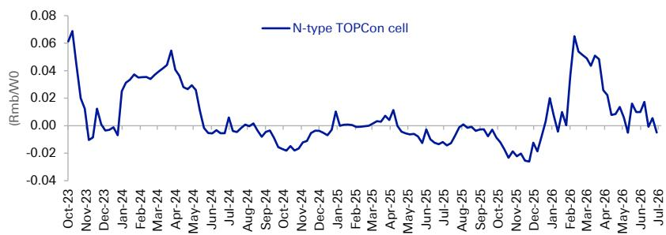  
来源：DB估算

## 组件：需求温和复苏

■ 月度产量：据SMM数据，行业7月组件计划产量为42GW，环比增长10%。根据我们的计算，行业平均产能利用率约为41%。

库存：据SMM数据，截至6月底，国内组件库存为29.9GW，与5月底的30.1GW基本持平。

图26：组件月度产量及行业平均产能利用率  
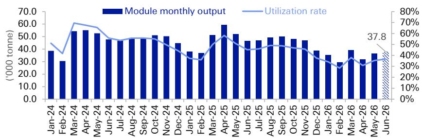  
来源：SMM  
图27：中国周度组件库存

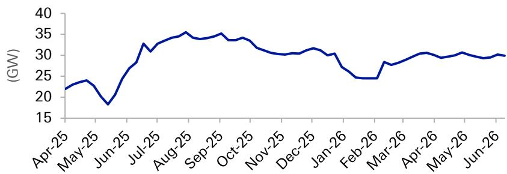  
来源：SMM

图28：组件年度供需分析（DBe）  
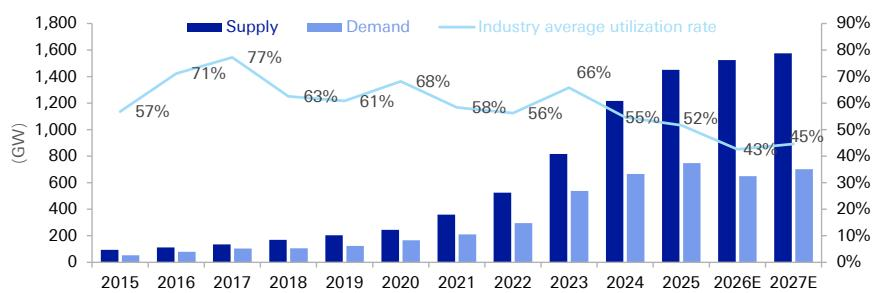  
来源：公司数据，DB估算

# 组件：利润率为正，但价格压力仍在

\- 定价与利润率展望：截至7月初，组件价格较6月初小幅下跌约1%。虽然组件价格在约0.71元/瓦的水平上相对坚挺，但近期SMM报告的国内招标价接近0.68元/瓦，表明价格存在进一步下行风险。据SMM称，价格压力可能来自低效组件的积极清库存。尽管如此，在较低上游成本的帮助下，组件利润率仍保持正值，我们认为组件生产商在短期内处于价值链中相对有利的位置。

图29：组件现货价格  
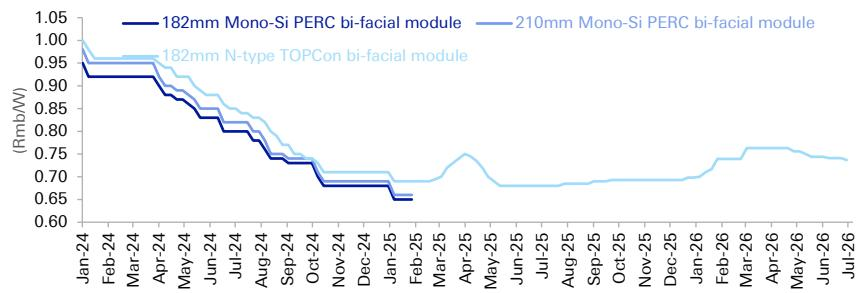  
来源：PV InfoLink

图30：公用事业规模和分布式太阳能组件价格  
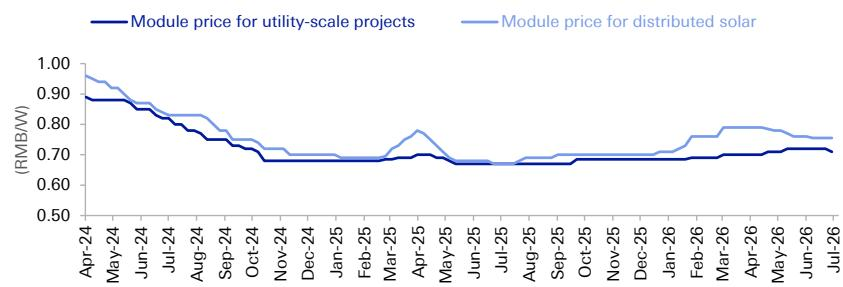  
来源：PV InfoLink

图31：一体化组件单位净利润/亏损  
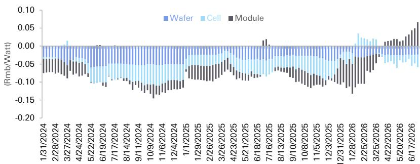

图32：海外组件现货价格  
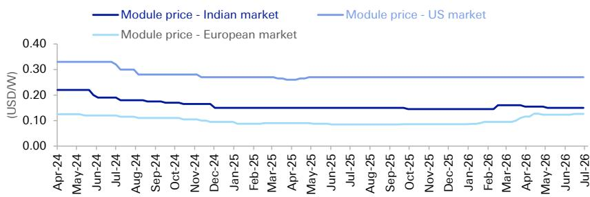

# 组件：新能效标准将淘汰落后产能

我们认为新的组件能效标准对下游电池片和组件环节可能是一个更有意义的催化剂，特别是对隆基绿能（BC电池/组件）和海南钧达（TOPCon电池）等技术领先者。根据TaiyangNews截至2026年6月的主流组件产品数据，20款市售TOPCon产品中仅有8款目前满足新要求。我们认为，这些标准将有利于高效率、大规模的生产商，同时可能加速行业整合。

图33：TOPCon – 最高效商用太阳能组件（2026年6月）  
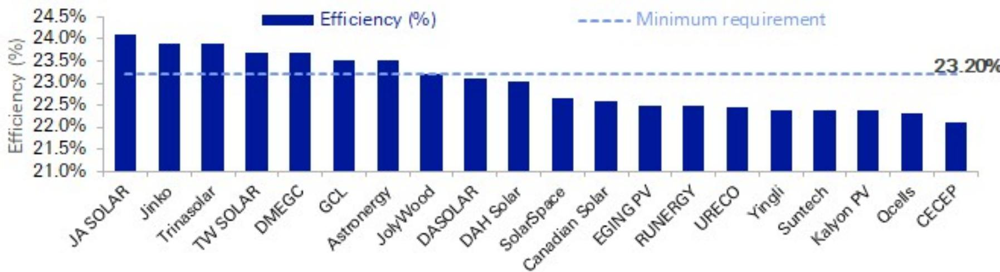  
来源：Taiyang News

## 太阳能玻璃：库存处于转折点

■ 周度产能：据SCI99数据，截至7月初，太阳能玻璃行业运行产能为8.1万吨/天，较6月初环比下降1%。根据我们的计算，检修和闲置产能合计5.3万吨，占国内总产能的40%。

\- 库存：据SCI99数据，截至7月初，行业库存为48天，较6月初环比下降约10%。

图34：太阳能玻璃 - 行业运行产能及库存天数  
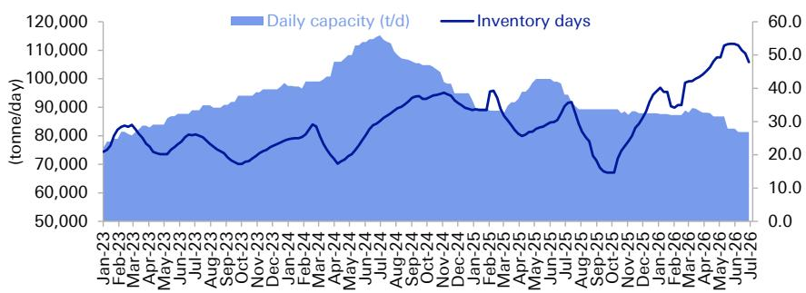  
来源：SCI99

图35：太阳能玻璃 - 月度供需分析（DBe）  
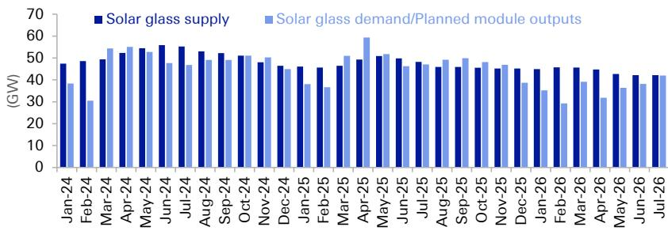  
来源：SCI99，DB估算

图36：太阳能玻璃 - 检修停产产能  
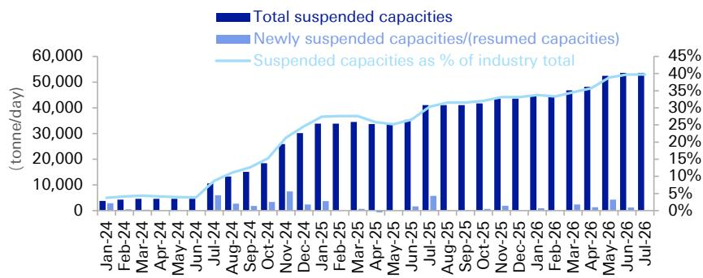  
来源：SCI99

图37：太阳能玻璃 - 年度产能及利用率趋势  
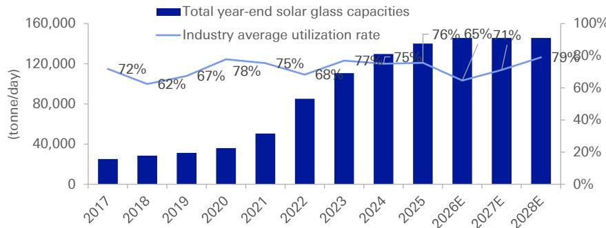  
来源：SCI99，DB估算

## 太阳能玻璃：价格和利润率可能正在触底

\- 定价与利润率展望：7月初，2.0mm/3.2mm产品的太阳能玻璃价格保持稳定。我们估计，一线和二线生产商的现金利润率仍为负值。据SCI99称，一些太阳能玻璃生产商正寻求将2.0mm太阳能玻璃价格提高至8.5-9.0元/平方米（约上涨6%），但下游组件制造商的阻力依然存在。

图38：太阳能玻璃现货价格  
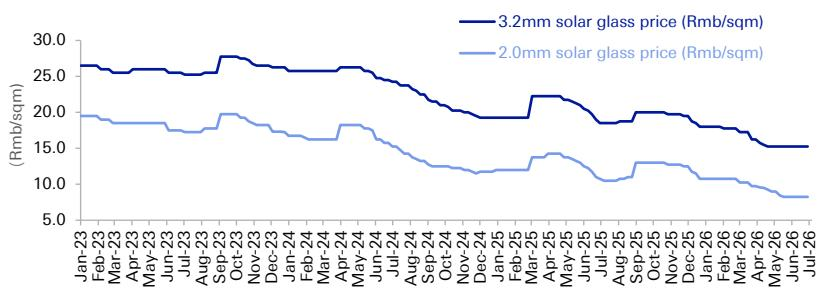  
来源：SCI99

图39：太阳能玻璃单位净利润追踪  
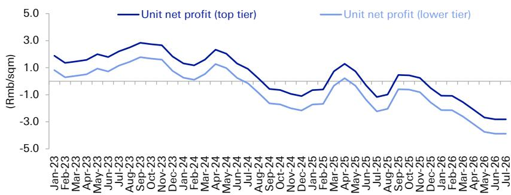  
来源：SCI99，DB估算

图40：太阳能玻璃单位全口径现金利润追踪  
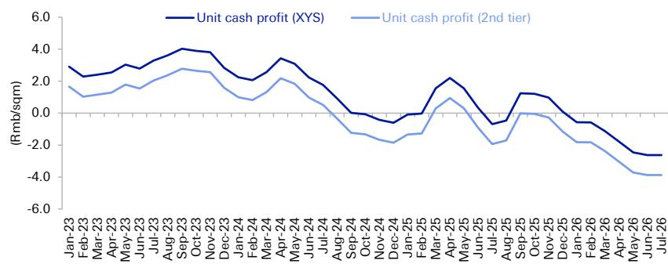  
来源：SCI99，DB估算

## 太阳能需求保持平淡

2026年5月，中国新增太阳能发电装机容量为8.7GW，同比下降91%。我们估计2026年中国需求为215GW，这意味着同比下降32%。中国光伏行业协会（CPIA）估计中国2026年太阳能装机需求为180-240GW。

图41：中国月度太阳能装机量  
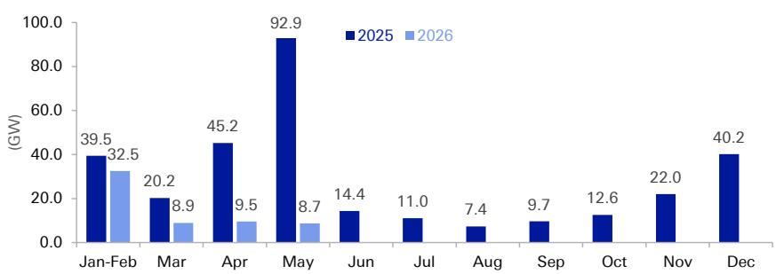  
来源：国家能源局

图42：中国月度太阳能装机量（同比）  
  
来源：国家能源局

图43：DB中国年度太阳能需求预测  
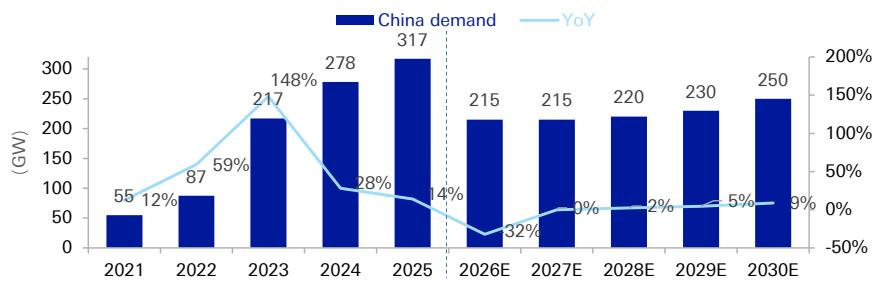  
来源：国家能源局，DB估算

## 估值

我们下调了信义光能、协鑫科技和海南钧达的盈利预测和目标价（详见下页），主要反映了2026年上半年太阳能定价低于预期以及行业整合前景不明朗。我们目前的偏好排序为：隆基绿能（BC技术）> 海南钧达（空间太阳能）> 信义光能（太阳能玻璃利润率接近底部）> 协鑫科技（电池材料上行空间，多晶硅仍面临压力）> 通威股份（受多晶硅供应过剩影响最大）。

图44：中国太阳能行业估值比较

<table><tr><td rowspan="2">公司</td><td rowspan="2">彭博代码</td><td rowspan="2">市值（百万美元）</td><td rowspan="2">评级</td><td rowspan="2">目标价（本币）</td><td rowspan="2">价格（本币）</td><td rowspan="2">上行/下行</td><td colspan="3">市盈率（倍）</td><td colspan="3">市净率（倍）</td><td colspan="3">净资产回报表现（%）</td><td colspan="3">股息率（%）</td></tr><tr><td>2026E</td><td>2027E</td><td>2028E</td><td>2026E</td><td>2027E</td><td>2028E</td><td>2026E</td><td>2027E</td><td>2028E</td><td>2026E</td><td>2027E</td><td>2028E</td></tr><tr><td colspan="19">太阳能制造商</td></tr><tr><td>隆基绿能</td><td>601012 CH</td><td>13,611</td><td>买入</td><td>25.00</td><td>12.35</td><td>102%</td><td>n.m.</td><td>120.2</td><td>33.4</td><td>1.8</td><td>1.8</td><td>1.7</td><td>-5.0</td><td>1.5</td><td>5.2</td><td>0.0</td><td>0.1</td><td>0.4</td></tr><tr><td>海南钧达</td><td>2865 HK</td><td>1,996</td><td>买入</td><td>39.00</td><td>19.96</td><td>95%</td><td>n.m.</td><td>13.0</td><td>7.5</td><td>2.0</td><td>1.7</td><td>1.4</td><td>-18.5</td><td>14.4</td><td>20.9</td><td>0.0</td><td>0.0</td><td>0.0</td></tr><tr><td>信义光能</td><td>968 HK</td><td>2,344</td><td>买入</td><td>3.60</td><td>2.10</td><td>71%</td><td>n.m.</td><td>16.2</td><td>9.7</td><td>0.6</td><td>0.6</td><td>0.6</td><td>-0.8</td><td>4.0</td><td>6.4</td><td>0.0</td><td>3.5</td><td>5.9</td></tr><tr><td>协鑫科技</td><td>3800 HK</td><td>2,692</td><td>买入</td><td>1.10</td><td>0.67</td><td>64%</td><td>n.m.</td><td>24.2</td><td>8.4</td><td>0.5</td><td>0.5</td><td>0.5</td><td>-2.1</td><td>2.0</td><td>5.6</td><td>0.0</td><td>0.0</td><td>0.0</td></tr><tr><td>通威股份</td><td>600438 CH</td><td>7,583</td><td>卖出</td><td>10.00</td><td>11.64</td><td>-14%</td><td>n.m.</td><td>n.m.</td><td>180.1</td><td>1.6</td><td>1.8</td><td>1.8</td><td>-18.8</td><td>-9.8</td><td>1.0</td><td>0.0</td><td>0.0</td><td>0.0</td></tr></table>

来源：彭博金融资讯，DB估算（价格截至2026年7月6日）

图45：协鑫科技 – 一年远期市净率区间  
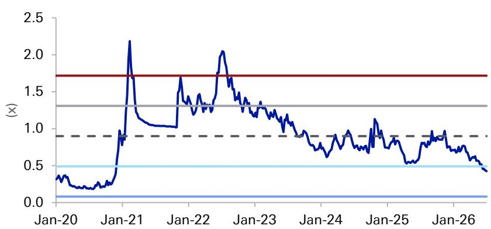  
来源：公司数据，DB估算

图46：信义光能 – 一年远期市净率区间  
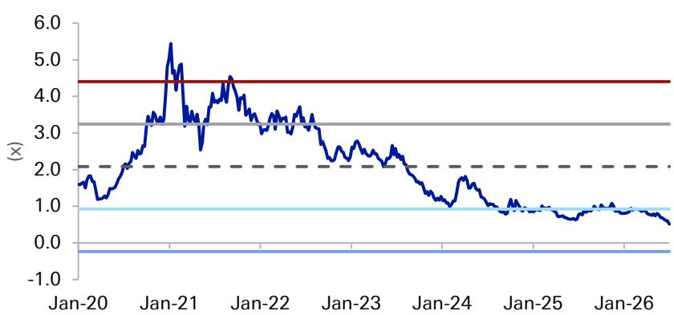  
来源：公司数据，DB估算

来源：公司数据，DB估算

<table><tr><td colspan="2">模型更新：2026年7月7日</td></tr><tr><td colspan="2">数据概览</td></tr><tr><td colspan="2">亚洲</td></tr><tr><td colspan="2">中国</td></tr><tr><td colspan="2">替代能源</td></tr><tr><td colspan="2">海南钧达</td></tr><tr><td>路透：2865.HK</td><td>彭博：2865 HK</td></tr></table>

<table><tr><td>财政年度截止12月31日</td><td>2023</td><td>2024</td><td>2025</td><td>2026E</td><td>2027E</td><td>2028E</td></tr><tr><td colspan="7">财务摘要</td></tr><tr><td>DB每股盈利（人民币）</td><td>3.71</td><td>-2.60</td><td>-5.27</td><td>-2.03</td><td>1.53</td><td>2.67</td></tr><tr><td>报告每股盈利（人民币）</td><td>3.71</td><td>-2.60</td><td>-5.27</td><td>-2.03</td><td>1.53</td><td>2.67</td></tr><tr><td>每股股息（人民币）</td><td>0.75</td><td>0.00</td><td>0.00</td><td>0.00</td><td>0.00</td><td>0.00</td></tr><tr><td>每股净资产（人民币）</td><td>20.8</td><td>17.1</td><td>13.6</td><td>10.0</td><td>11.4</td><td>14.1</td></tr><tr><td>加权平均股份（百万）</td><td>216</td><td>227</td><td>269</td><td>306</td><td>310</td><td>310</td></tr><tr><td>平均市值（百万人民币）</td><td>na</td><td>na</td><td>5,206</td><td>4,643</td><td>4,643</td><td>4,643</td></tr><tr><td>企业价值（百万人民币）</td><td>na</td><td>na</td><td>5,884</td><td>7,365</td><td>6,844</td><td>5,723</td></tr></table>

<table><tr><td colspan="2">买入</td></tr><tr><td>价格（2026年7月6日）</td><td>港币 19.96</td></tr><tr><td>目标价</td><td>港币 39.00</td></tr><tr><td>52周区间</td><td>港币 15.57
