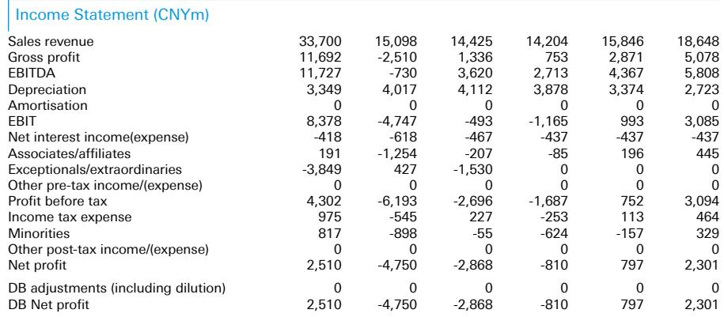

# DB：光伏玻璃正接近周期拐点，但多晶硅不确定性未减

这份来自DB的2026年7月中国光伏行业报告，在行业普遍谨慎时给出了一个分化判断：光伏玻璃可能在经历九个月库存积累和价格下跌后，接近一个短期周期拐点；而多晶硅的库存去化已经结束，新一轮不确定性正在形成。报告的核心不是全面看好或看淡，而是指出产业链各环节正在走向不同的供需节奏。

报告发布时，信义光能的报价已从5月中旬高点回调约38%，市净率降至0.6倍。DB认为这一估值已过度反映谨慎预期，并不意味着马上反转。

> **KC评论：** 光伏玻璃的库存拐点是这份报告最值得关注的信号。库存从6月中旬高点下降约10%，且去化速度在最近几周加快。但读者需要区分“短期价格反弹”和“行业盈利修复”是两回事。报告对2027年的需求预测仍然保守，这意味着反弹的幅度和持续性仍需验证。

## 1. 光伏玻璃的库存拐点已现，但盈利修复需要更长时间

报告的核心判断建立在供需两侧的同时改善上。需求端，7月组件排产环比增长10%，带动玻璃需求温和复苏。供给端，由于行业整体亏损，产能重启意愿极低。DB测算当前玻璃价格已低于行业现金成本，这意味着任何需求改善都可能触发价格反弹。

但报告没有回避一个关键问题：即便价格反弹，行业盈利能力的恢复仍取决于产能出清的速度。目前行业库存虽在下降，但相对水平仍然偏高。报告将信义光能2026年盈利预测从此前的盈利调整为亏损，这一调整本身就说明短期基本面并未根本好转。

## 2. 多晶硅：去库存只是插曲，雨季复产将加剧过剩

与光伏玻璃形成鲜明对比的是多晶硅。DB指出，此前约三个月的库存去化（主要由通威驱动）已经结束。随着西南水电丰富地区进入丰水期，闲置产能逐步复产，7月多晶硅产量预计环比增长6-7%。这意味着行业库存可能再次攀升。

报告特别提到，虽然新发布的能耗和能效标准（2027年1月生效）理论上可淘汰约三分之一的多晶硅产能，但这并不足以恢复行业盈利能力。DB预测2027年多晶硅需求约140万吨，即使产能出清后有效产能降至约240万吨，行业利用率仍将低于60%。

> **KC评论：** 多晶硅的困境在于：供给侧的行政干预（能效标准）和市场化出清（亏损停产）之间存在时间差。标准生效是2027年初，而当前复产已经开始。报告暗示3季度多晶硅价格可能下探至30元/公斤，这比当前水平还有约10%的节奏变化空间。完整报告中有详细的供需月度模型和现金成本曲线，值得仔细对比。

## 3. 能效标准是结构性利好，但短期效果有限

报告对2027年1月生效的能耗和能效标准给予了较大篇幅。这是中国光伏行业首个覆盖多晶硅、硅片和组件的强制性标准。从报告的分析看，这一标准对产业链各环节的影响并不相同。

对于组件环节，由于主流TOPCon产品中仅约40%满足新标准，这将加速低效产能淘汰，利好隆基（BC技术）和Drinda（太空光伏）等技术领先者。但对多晶硅而言，标准虽能淘汰约三分之一的产能，但剩余产能仍远超需求，行业盈利的根本问题——需求不足——并未解决。

报告对LONGi、Drinda、信义光能、协鑫科技和通威给出了明确的偏好排序，但这一排序更多是基于技术路线和细分市场的差异化，而非对行业整体反转的押注。

## 4. 报告尚未完全回答的三个问题

第一，光伏玻璃的价格反弹能否持续？报告的核心逻辑是“库存下降+需求季节性恢复”，但组件端仍面临招标价格节奏变化的不确定性（近期有0.68元/W的低价投标），这可能会限制玻璃价格的反弹空间。

第二，多晶硅的产能出清究竟需要多长时间？能效标准提供了一个时间锚点（2027年初），但在此之前，丰水期复产和新增产能释放可能使行业承受更长时间的亏损。报告没有给出一个明确的出清时间表。

第三，终端需求何时出现实质性改善？报告对7月组件排产的环比增长给出了积极解读，但同比来看，需求仍处于低位。如果4季度季节性旺季不及预期，整个行业的库存去化进程可能被中断。

对于产业决策者而言，这份报告最有价值的部分不是结论本身，而是它提供的月度供需监测框架。光伏玻璃的库存拐点和多晶硅的复产不确定性，构成了行业短期内最值得跟踪的两个变量。完整报告包含了各环节的月度供需模型、现金利润跟踪和产能利用率数据，这些才是判断拐点是否成立的工具。

For informational purposes only. Portions may be generated,translated,summarized,or edited with AI assistance based on source materials and may contain omissions or errors. Please verify independently. This is not investment,legal,tax,accounting,or other professional advice.

For informational purposes only. Portions may be generated,translated,summarized,or edited with AI assistance based on source materials and may contain omissions or errors. Please verify independently. This is not investment,legal,tax,accounting,or other professional advice.

