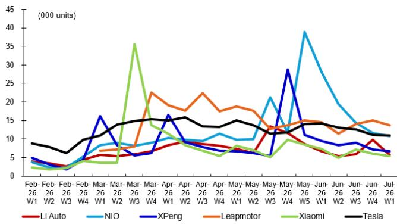
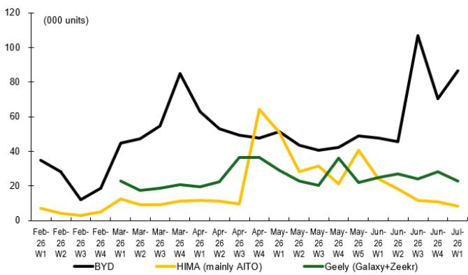
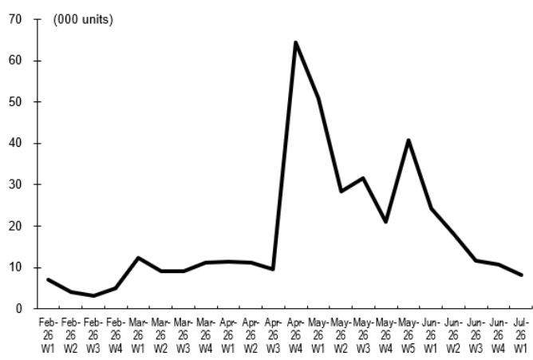
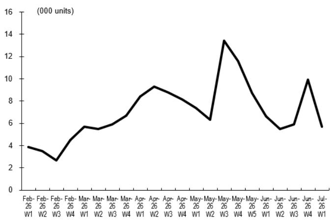
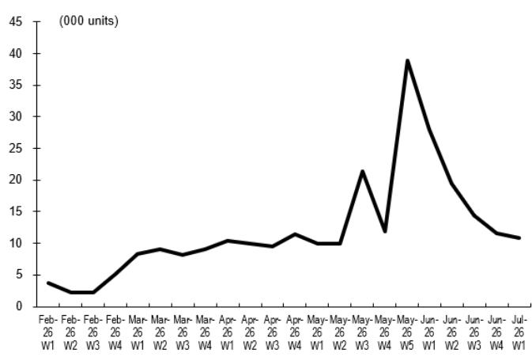
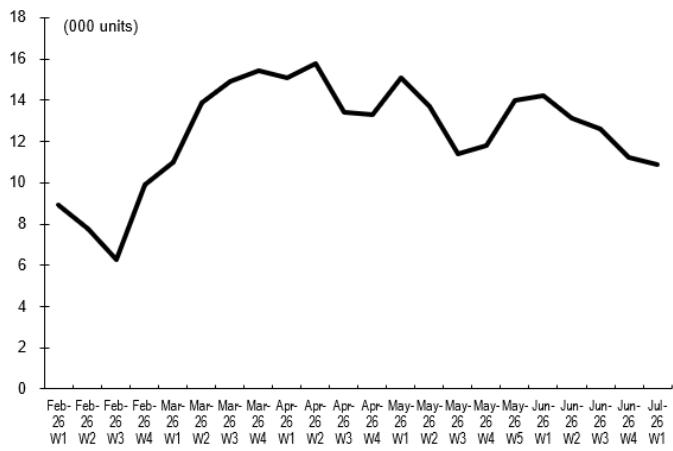

# 亚洲中国汽车与汽车技术行业：中国新能源汽车周度新订单监测

本图表追踪中国乘用车新订单的周度变化，详细展示主要中国新能源汽车制造商的新订单流动趋势。

**图1：主要车企周度新订单汇总**

日期：2026年7月7日

王斌
研究分析师
+852-220-35496

黄伟
研究助理
+852-2203-7057

| (单位) 周次 # 日历天数 | 2026年7月 第27周 29-5日 | 2026年6月 第26周 22-28日 | 2025年7月 第27周 30-6日 | 环比 | 同比 |
|---|---|---|---|---|---|
| **主要车企周度新订单** | | | | | |
| 1211 HK 比亚迪 | 86.5千 | 70.6千 | 78千 | 23% | 11% |
| 0175 HK 吉利（极氪和银河） | 22.7千 | 28.3千 | | -20% | |
| 9927 HK 鸿蒙智行（主要为问界） | 8.1千 | 10.8千 | 9.9千 | -25% | -18% |
| 9863 HK 零跑汽车 | 13.8千 | 15千 | | -8% | |
| TSLA US 特斯拉 | 10.9千 | 11.2千 | 17千 | -3% | -36% |
| 9866 HK 蔚来 | 10.8千 | 11.6千 | 5.5千 | -7% | 96% |
| 2015 HK 理想汽车 | 5.7千 | 9.9千 | 9.5千 | -42% | -40% |
| 1810 HK 小米 | 5.4千 | 6.1千 | 78.5千 | -11% | -93% |
| 9868 HK 小鹏汽车 | 6.8千 | 7.3千 | 28.6千 | -8% | -76% |

数据来源：Thinkercar

**图2：主要车企周度新订单趋势（理想、蔚来、小鹏、零跑、小米、特斯拉）**

数据来源：Thinkercar

**图3：比亚迪、吉利、鸿蒙智行（主要为问界）周度新订单趋势**

数据来源：Thinkercar

**图4：鸿蒙智行（主要为问界）周度新订单趋势**

数据来源：Thinkercar

**图5：理想汽车周度新订单趋势**

数据来源：Thinkercar

**图6：蔚来集团周度新订单趋势**

数据来源：Thinkercar

**图7：特斯拉周度新订单趋势**

数据来源：Thinkercar

## 附录1

## 重要披露

关于本研究报告主要标的之外其他证券的建议或估计的披露信息，请参阅最近发布的公司报告，或访问我们网站上的全球披露查询页面：https://research.db.com/Research/Disclosures/EquityResearchDisclosures。除本报告内容外，重要的风险与利益冲突披露也可在以下网址找到：https://research.db.com/Research/Disclosures/Disclaimer。建议参与者在做出决策前仔细阅读此信息。

## 分析师认证

本报告中表达的观点准确反映了以下签署首席分析师的个人观点。此外，以下签署首席分析师未曾且不会因在本报告中提供特定建议或观点而获得任何报酬。黄伟，王斌。

**公司评级分布与银行关系**

| DBSI 覆盖公司 | 买入 | 持有 | 卖出 |
|---|---|---|---|
| 覆盖 | 57% | 43% | 0% |
| 有银行关系 | 43% | 35% | 0% |
| 有MiFID服务 | 63% | 50% | 67% |

| 全球覆盖公司 | 买入 | 持有 | 卖出 |
|---|---|---|---|
| 覆盖 | 58% | 40% | 2% |
| 有银行关系 | 47% | 34% | 31% |
| 有MiFID服务 | 75% | 69% | 94% |

## 公司评级与分布说明

上表提供了DB公司研究评级在我们覆盖公司中的分布情况。我们还列出了过去12个月内DB提供投资银行服务和/或MIFID投资及辅助服务的公司百分比。请参阅以下评级说明和定义。

注：百分比已四舍五入，因此可能不等于100%。

覆盖：所有被评级覆盖公司的总体评级分布。

有银行关系：在"买入"、"持有"和"卖出"各评级类别中，过去12个月内DB曾提供投资银行服务的覆盖公司百分比。

有MiFID服务：在"买入"、"持有"和"卖出"各评级类别中，过去12个月内DB曾提供MIFID投资及辅助服务的覆盖公司百分比。

买入/持有/卖出百分比：这些百分比反映了基于我们对总股东回报的12个月展望，每个类别中被赋予相应评级的公司比例。

## 评级定义：

买入：基于当前12个月的总股东回报展望，建议参与者买入该股票。

卖出：基于当前12个月的总股东回报展望，建议参与者卖出该股票。

持有：我们对未来12个月的股票持中性看法，基于此时间范围，既不建议买入也不建议卖出。

总股东回报：从当前价格到预测目标价格的股价变动百分比加上预测股息回报表现。

新发布的研究建议和目标价格将取代此前发布的研究。

## 附加信息

本报告中的信息和意见由DB AG或其附属公司（统称"DB"）编制。尽管此处信息被认为是可靠的，且来自被认为可靠的公开来源，但DB不对其准确性或完整性作任何陈述。本报告中指向第三方网站的超链接仅为方便读者提供。DB既不认可其内容，也不对这些网站的安全性控制负责。

如果您使用DB的服务购买或出售本报告中讨论的证券，或包含在DB分析师的其他沟通（口头或书面）中，DB可能作为自营交易主体或作为他人的代理人行事。

DB可能考虑本报告来决定自营交易。它也可能以与本研究报告观点不一致的方式，为其自身账户或与客户进行交易。DB内部的其他人员，包括策略师、销售人员和其他分析师，可能持有与本研究报告不一致的观点。DB发布多种研究产品，包括基本面分析、股权挂钩分析、定量分析和交易思路。一种沟通方式中包含的建议可能与其他沟通方式中的建议不同，无论是由于不同的时间范围、方法论、视角或其他原因。DB和/或其附属公司也可能持有其所撰写发行人的债务或股权证券。分析师的薪酬部分基于DB AG及其附属公司的盈利能力，包括投资银行、交易和自营交易收入。

意见、估计和预测构成本报告作者截至报告日期的当前判断。它们不一定反映DB的意见，且可能随时变更，恕不另行通知。DB为其覆盖公司发行的证券的买卖双方提供流动性。DB分析师有时可能持有与DB现有长期评级不一致的短期交易思路。某些股票的交易思路在研究网站上列为催化剂电话，可在总体覆盖列表和覆盖公司页面上找到。催化剂电话代表分析师对某只股票将在不少于两周且不超过三个月的时间范围内跑赢或跑输市场和/或特定行业的高度确信观点。除催化剂电话外，分析师可能偶尔与客户、DB销售人员和交易员讨论交易策略或想法，这些策略或想法涉及可能对本报告中讨论的证券市场价格产生短期或中期影响的事件，其影响方向可能与分析师当前12个月的总回报或投资回报观点相反。DB没有义务更新、修改或修订本报告，或在意见、预测或估计发生变化或不准确时通知接收方。市场状况以及一般和公司特定经济前景的变化频率使得难以按固定间隔更新研究。更新由覆盖分析师或研究部门管理层自行决定，大多数报告以不定期方式发布。本报告仅供参考，并未考虑个别客户的特定投资目标、财务状况或需求。它不是购买或出售任何金融工具或参与任何特定交易策略的要约或要约邀请。目标价格本质上是不精确的，是分析师判断的产物。本报告中讨论的金融工具可能不适合所有参与者，参与者必须自行做出明智的参与决策。金融工具的价格和可用性可能随时变更，恕不另行通知，且交易可能导致因价格波动和其他因素而产生的损失。如果金融工具以参与者货币以外的货币计价，汇率变动可能对参与产生不利影响。过往表现不一定预示未来结果。除非另有说明，表现计算不包括交易成本。除非另有说明，价格截至前一交易时段结束时，来自当地交易所通过路透、彭博和其他供应商。数据也来自DB、标的公司和其他方。人工智能工具可能用于本材料的准备，包括但不限于协助事实查找、数据分析、模式识别、内容起草和与研究材料相关的编辑更正。

DB部门独立于银行的其他业务部门。关于我们为防止和避免研究利益冲突而设置的组织安排和信息壁垒的详细信息，请访问我们的网站（https://research.db.com/Research/）上的免责声明部分。

宏观经济波动通常构成与承诺支付固定或浮动利率的工具相关的风险的主要部分。对于持有固定利率工具（从而接收这些现金流）的参与者而言，利率上升自然会提高应用于预期现金流的贴现因子，从而导致损失。特定现金流的期限越长，贴现因子的变动越大，损失就越大。通胀、财政融资需求和外汇贬值率的意外上行是接收方最常见的负面宏观经济冲击。但交易对手风险、发行人信用状况、客户细分、监管（包括对不同类型参与者的资产持有限制的变化）、税收政策变化、货币可兑换性（可能限制货币兑换、利润汇回和/或头寸清算）以及当地清算所的结算问题也是重要的风险因素。固定收益工具对宏观经济冲击的敏感性可以通过将合同现金流与通胀、外汇贬值或特定利率挂钩来缓解——这些在新兴市场很常见。指数设定可能——按设计——滞后或错误衡量其旨在跟踪的标的变量的实际变动。适当的设定（或指标）选择在掉期市场中尤为重要，其中浮动票息率（即与通常为短期的利率参考指数挂钩的票息）与固定票息交换。以与票息计价货币不同的货币融资存在外汇风险。掉期期权具有期权的典型风险以及利率变动的相关风险。

衍生品交易涉及多种风险，包括市场风险、交易对手违约风险和流动性风险。这些产品对参与者的适用性取决于参与者自身的情况，包括其税务状况、监管环境以及其其他资产和负债的性质；因此，参与者在进行任何与本出版物内容类似或受其启发的交易之前，应寻求专业的法律和财务建议。期货和期权交易（无论是国内还是国外）的损失风险可能很大。由于期货和期权交易可获得的高杠杆率，可能产生超过初始存入资金金额的损失——理论上可能无限损失。期权交易涉及风险，并非适合所有参与者。在购买或出售期权之前，参与者必须审阅"标准化期权的特征和风险"，网址为https://www.theocc.com/company-information/documents-and-archives/options-disclosure-document。如果您无法访问该网站，请联系您的DB代表获取此重要文件的副本。

外汇交易的参与者可能面临多种因素产生的风险，包括：(i) 汇率可能波动且受大幅波动影响；(ii) 货币价值可能受到众多市场因素的影响，包括世界和国家经济、政治和监管事件、股权和债务市场事件以及利率变化；以及 (iii) 货币可能面临贬值或政府实施的汇率管制，这可能影响货币价值。参与其价值受标的证券货币影响的证券（如美国存托凭证）的参与者，实际上承担了货币风险。

除非适用法律另有规定，所有交易应通过参与者所在司法管辖区的DB实体执行。除本报告内容外，重要的利益冲突披露也可在https://research.db.com/Research/上每个公司的研究页面或"披露"选项卡下找到。强烈建议参与者在做出决策前审阅此信息。

DB（包括DB AG、其分支机构和关联公司）不就本报告中提供的任何信息担任您的财务顾问、顾问或受托人。DB不提供投资、法律、税务或会计建议，DB不作为您的公正顾问行事，且不就任何策略、产品或本材料中呈现的任何其他信息表达任何意见或建议。此处包含的信息仅基于接收方将独立评估任何参与决策的优劣而提供，并不构成对任何产品或服务或任何交易策略的建议或意见表达。

所呈现的信息具有一般性，不针对退休账户或任何特定个人或账户类型，因此明确基于非建议的基础提供给您，您不得依赖它做出决策。我们提供的信息仅针对我们认为具有财务成熟度、能够独立评估参与风险（无论是总体上还是针对特定交易和参与策略）且理解DB在其产品和服务提供中拥有财务利益的人士。如果情况并非如此，或者您是IRA或其他零售参与者直接收到此信息，请立即通知我们。

2018年7月，DB修订了其短期思路的评级系统，品牌名称从SOLAR思路改为催化剂电话；源自美洲地区的催化剂电话评级类别已与全球分析师使用的类别保持一致；催化剂电话的有效期已从最长180天缩短至90天。

美国：由DB Securities Incorporated批准和/或分发，该公司是FINRA和SIPC的成员。位于美国以外的分析师受雇于非美国附属公司，未注册/未具备FINRA研究分析师资格。

欧洲经济区（不包括英国）：由DB AG批准和/或分发，DB AG是一家在德意志联邦共和国注册的股份有限责任公司，主要办公地点位于法兰克福。DB AG受德国银行法授权，并受欧洲中央银行和德国联邦金融监管局（BaFin）的监管。

英国：由DB AG通过其伦敦分行（地址：21 Moorfields, London EC2Y 9DB）批准和/或分发。DB AG在英国由审慎监管局授权，并受审慎监管局和金融行为监管局的有限监管。关于我们授权和监管范围的详细信息可应要求提供。

香港特别行政区：由DB AG香港分行分发，但涉及《香港证券及期货条例》第571章含义内期货合约的研究内容除外。关于此类期货合约的研究报告不适用于位于、注册于、组成于或居住于香港的人士。研究报告的作者及其代表的实体和/或关联实体可能未获发牌在香港进行受规管活动，如果未获发牌，则不得声称能够这样做。上述"附加信息"部分中的规定应在当地法律法规允许的最大范围内适用，包括但不限于《证券及期货事务监察委员会持牌人或注册人行为准则》。本报告仅旨在分发给《证券及期货条例》附表1第1部分定义的"专业读者"。非专业读者不得依据或依赖本文件行事。本文件相关的任何参与或参与活动仅适用于专业读者，且仅与专业读者进行。

印度：由Deutsche Equities India Private Limited (DEIPL) 编制，公司识别号：U65990MH2002PTC137431，注册地址：14th Floor, The Capital, C-70, G Block, Bandra Kurla Complex, Mumbai (India) 400051。电话：+91 22 7180 4444。它在印度证券交易委员会注册为股票经纪人，注册号：INZ000252437；商人银行家，SEBI注册号：INM000010833；研究分析师，SEBI注册号：INH000001741。DEIPL的合规/申诉官是Rashmi Poddar女士（电话：+91 22 7180 4929，电子邮件：complaints.deipl@db.com）。SEBI授予的注册和NISM的认证绝不保证DEIPL的表现或向参与者提供任何回报保证。证券市场参与存在市场风险。在参与前请仔细阅读所有相关文件。DEIPL可能因违反印度法规而收到SEBI的行政警告。DB和/或其关联公司可能持有标的公司的债务头寸或头寸。关于关联公司的信息，请参阅年度报告中的"持股"部分：https://www.db.com/ir/en/annual-reports.htm。最新的印度研究审计报告，请参阅https://country.db.com/india/deutsche-equities-india/index?language\_id=1。

日本：由Deutsche Securities Inc.(DSI) 批准和/或分发。注册号 - 注册为关东地方财务局局长（金商）第117号金融工具交易商。协会成员：JSDA、第二类金融工具交易商协会和日本金融期货协会。股票交易的佣金和风险 - 对于股票交易，我们按与每位客户约定的佣金率乘以交易金额收取股票佣金和消费税。股票交易可能因股价波动和其他因素导致损失。外国股票交易可能因外汇波动导致额外损失。对于某些类别的研究交流、产品和服务，我们可能收取佣金和费用。推荐的投资策略、产品和服务存在因市场和/或经济趋势变化和/或市场价值波动导致本金和其他损失的风险。在决定购买金融产品和/或服务之前，客户应仔细阅读相关披露、招股说明书和其他文件。本报告中提到的"穆迪"、"标准普尔"和"惠誉"除非实体名称中特别指定日本或"日本"，否则不是日本的注册信用评级机构。关于日本上市公司、非DSI分析师撰写的报告，由DB集团的分析师撰写，覆盖公司由DSI指定。本报告中所述的一些外国证券未根据日本《金融工具和交易法》披露。DB股权分析师设定的目标价格基于12个月的预测期。

韩国：由Deutsche Securities Korea Co.分发。

南非：DB AG约翰内斯堡在德意志联邦共和国注册（南非分行注册号：1998/003298/10）。

新加坡：本报告由DB AG新加坡分行（地址：One Raffles Quay #18-00 South Tower Singapore 048583，电话：65 6423 8001）发布，可就本报告相关事宜联系该分行。如果DB在新加坡向非认可读者、专家读者或机构读者（定义见适用新加坡法律法规）发布或颁布本报告，DB对此人承担其内容的法律责任。

台湾：关于在台湾交易的证券/参与的信息仅供参考。读者应独立评估参与风险，并自行承担参与决策的全部责任。未经书面同意，DB不得向台湾公共媒体分发，或由台湾公共媒体引用或使用。关于不在台湾交易的证券/工具的信息仅供参考，不得解释为交易此类证券/工具的建议。

卡塔尔：DB AG在卡塔尔金融中心（注册号：00032）受卡塔尔金融中心监管局监管。DB AG - QFC分行仅可从事其现有QFCRA许可证范围内的金融服务活动。其在QFC的主要营业地点：Qatar Financial Centre, Tower, West Bay, Level 5, PO Box 14928, Doha, Qatar。此信息由DB AG分发。相关金融产品或服务仅适用于卡塔尔金融中心监管局定义的商业客户。

俄罗斯：此处提交的信息、解释和意见不属于任何需要在俄罗斯联邦获得许可的评估或评价活动的背景，也不构成此类活动。

沙特阿拉伯王国：Deutsche Securities Saudi Arabia (DSSA) 是一家封闭式股份公司，由沙特阿拉伯王国资本市场管理局授权，许可证号（第37-07073号），从事以下业务活动：交易、安排、咨询和托管活动。DSSA注册办公室位于Faisaliah Tower, 17th Floor, King Fahad Road - Al Olaya District Riyadh, Kingdom of Saudi Arabia P.O. Box 301806。

阿拉伯联合酋长国：DB AG在迪拜国际金融中心（注册号：00045）受迪拜金融服务管理局监管。DB AG - DIFC分行仅可从事其现有DFSA许可证范围内的金融服务活动。其在DIFC的主要营业地点：Dubai International Financial Centre, The Gate Village, Building 5, PO Box 504902, Dubai, U.A.E。此信息由DB AG分发。相关金融产品或服务仅适用于迪拜金融服务管理局定义的专业客户。

澳大利亚和新西兰：本研究仅适用于《澳大利亚公司法》和《新西兰金融顾问法》含义内的"批发客户"。请参阅澳大利亚特定的研究披露和相关信息，网址为https://www.dbresearch.com/PROD/RPS\_EN-PROD/PROD0000000000521304.xhtml。如果研究涉及任何特定金融产品，研究的接收方在做出是否获取该产品的任何决定之前，应考虑任何产品披露声明、招股说明书或其他适用的披露文件。在编制本报告时，首席分析师或协助编制本报告的个人可能已与作为本研究标的的公司联系，以确认/澄清数据、事实、声明，获得在报告中使用公司来源材料的许可，和/或进行实地考察。未经研究管理部门事先批准，分析师不得接受当前或潜在银行客户支付分析师参加实地考察、会议、社交活动等产生的差旅、住宿或其他费用。同样，未经研究管理部门和反腐败团队事先批准，分析师不得从其覆盖的发行人处接受个人使用的额外津贴或其他有价物品。

关于本报告中讨论的证券、其他金融产品或发行人的附加信息可应要求提供。未经DB事先书面同意，不得复制、分发或出版本报告。

回测、假设或模拟表现结果具有固有局限性。与基于实际客户投资组合交易的实际表现记录不同，模拟结果是通过追溯应用一个本身带有事后偏见设计的回测模型获得的。考虑到历史事件，表现的回测也与实际账户表现不同，因为实际参与策略可能随时因任何原因进行调整，包括对重大、经济或市场因素的响应。回测表现包括假设结果，这些结果不反映股息和其他收益的再投资，也不反映咨询费、经纪或其他佣金以及客户本应支付或实际支付的任何其他费用的扣除。未声明任何交易策略或账户将或可能实现与所示相似的利益或损失。替代建模技术或假设可能产生显著不同的结果，并可能被证明更为合适。过去的假设回测结果既不是未来回报的指标，也不是保证。实际结果将有所不同，可能与本分析存在重大差异。

此处阐述的计算单个E、S、G和综合ESG评分的方法是DB AG研究部门开发的一种新方法，使用系统方法计算，无需人工干预。不同的数据提供商、市场部门和地理区域采用不同的方式处理ESG分析并整合研究结果。因此，此处提及的ESG评分可能不同于市场上其他ESG数据提供商开发和实施的等效评级，也可能不同于DB集团内其他部门开发和实施的等效评级。此类ESG评分也不同于DB AG此前发布的研究报告中使用的其他评级和排名。此外，此类ESG评分不代表DB AG的正式或官方观点。

应注意，将ESG因素纳入任何参与策略的决定可能抑制参与某些原本符合您参与目标和其他主要参与策略的参与机会。主要由可持续参与组成的投资组合的回报可能低于或高于不考虑ESG因素、排除或其他可持续性问题的投资组合，且此类投资组合可获得的参与机会可能不同。公司可能不一定在ESG或可持续参与问题的所有方面都达到高绩效标准；也无法保证任何公司将在企业责任、可持续性和/或影响表现方面达到预期。

版权所有 © 2026 DB AG

David Folkerts-Landau
集团首席经济学家兼全球研究主管

| Pam Finelli
首席运营官兼固定收益研究主管 | Steve Pollard
全球公司研究与销售主管 | Jim Reid
全球宏观与主题研究主管 | Tim Rokossa
欧洲公司研究主管 |
| Matthew Barnard
美洲公司研究主管 | Debbie Jones
全球可持续发展与数据创新研究主管 | Robin Winkler
德国宏观研究主管 | Sameer Goel
全球新兴市场与亚太研究主管 |
| Francis Yared
全球利率研究主管 | George Saravelos
全球外汇研究主管 | Peter Hooper
研究副主席 | Nilendra de-Mel
亚太与中东产品开发主管 |

国际生产地点

| DB AG
DB Place
Level 16
Corner of Hunter & Phillip Streets
Sydney, NSW 2000 Australia
电话：(61) 2 8258 1234 | DB AG
Equity Research
Mainzer Landstrasse 11-17
60329 Frankfurt am Main Germany
电话：(49) 69 910 00 | DB AG
Filiale Hongkong
International Commerce Centre
1 Austin Road West, Kowloon,
Hong Kong
电话：(852) 2203 8888 | Deutsche Securities Inc.
1-3-1 Azabudai
Azabudai Hills Mori JP Tower
Minato-ku, Tokyo 106-0041
Japan
电话：(81) 3 6730 1000 |

DB AG
21 Moorfields
London EC2Y 9DB
United Kingdom
电话：(44) 20 7545 8000

DB Securities Inc.
The DB Center
1 Columbus Circle
New York, NY 10019
电话：(1) 212 250 2500

DB AG
Filiale Singapur
One Raffles Quay, South Tower
Singapore 048583
电话：(65) 6423 8001
