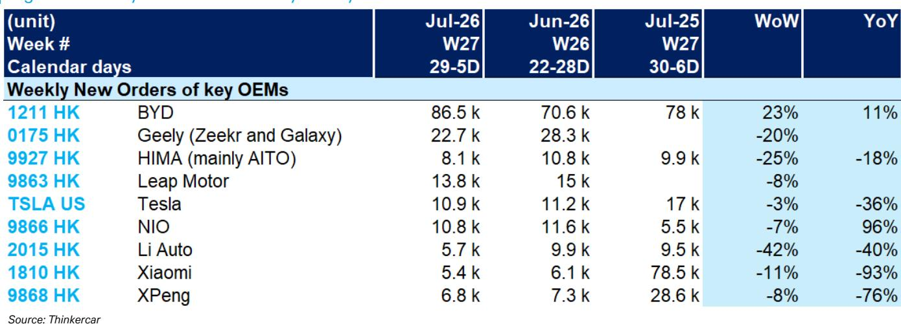

# DB：中国新能源车订单修复信号，比亚迪韧性凸显，蔚来修复而非反转

7月第一周的订单数据，可能比很多人预期的更能说明问题。DB最新发布的周度订单追踪显示，中国新能源汽车市场正在经历一轮明显的“K型分化”：头部企业的订单集中度在提升，而部分曾经的热门品牌开始显露调整迹象。

这份报告追踪的并非交付量，而是新订单——后者是更前置的需求指标。在7月1日当周（W27），比亚迪单周新订单达到8.65万辆，环比增长23%，同比增长11%。而同一周，理想汽车新订单仅5700辆，环比下降42%，同比下降40%。特斯拉中国的新订单也同比下降了36%。

这些数字叠加在一起，指向一个观察：中国新能源车市场的增长红利正在向少数几家拥有定价能力或产品定义能力的公司集中，其余玩家面临的是份额争夺战，而非增量蛋糕的分配。

## 1. 比亚迪的周订单跳升，背后是产品矩阵的“全价格带覆盖”

比亚迪8.65万辆的周订单并非偶然。从6月最后一周的7.06万辆跳升至8.65万辆，环比增幅达23%。这背后是比亚迪在7月初推出的新一轮限时优惠和权益调整，覆盖了从海鸥到汉、唐的多个主力车型。

关键在于，比亚迪的订单增长并非依赖单一产品，而是由其完整的产品矩阵支撑。从10万元以下到30万元以上的价格带，比亚迪在每个区间都有至少一款具备竞争力的车型。这种“全价格带覆盖”策略，使得它在面对友商的新品冲击时，有更大的腾挪空间。

> **KC评论：** 比亚迪的订单韧性，本质上是规模效应与产品矩阵深度带来的“抗波动能力”。对于其他车企而言，单点突破越来越难，因为对手在每个价格带都预留了反击弹药。完整报告中的图表清晰展示了比亚迪订单曲线的波动区间，值得细看。

## 2. 理想与特斯拉的订单下滑，暴露了“产品周期”的阶段性特征

理想汽车周订单环比下降42%，同比下降40%，是这份报告中波动最大的数据之一。理想目前正处于L系列改款前的“青黄不接”阶段，而纯电车型MEGA并未如期贡献增量。

特斯拉中国的周订单同比下降36%，同样值得关注。Model 3和Model Y的产品力正在被中国本土竞品快速追赶，而特斯拉在价格调整上的空间也在收窄。

这两家公司的订单波动，揭示了一个行业规律：在新能源车市场，单一产品线的“产品周期”正在缩短。过去一款车可以卖3-4年，现在可能18-24个月就需要一次重大更新。理想和特斯拉都面临“下一代产品何时到来”的考量。

## 3. 蔚来的同比增长96%，是“换电模式”的阶段性成果，还是短期现象？

蔚来是这份报告中为数不多的亮点：周订单1.08万辆，同比增长96%。这主要得益于BaaS电池租用服务价格下调以及新品牌乐道的预热效应。

但问题在于：蔚来的订单增长能否持续？96%的同比增速建立在去年同期的低基数之上（2025年7月首周仅5500辆）。环比来看，蔚来订单从6月最后一周的1.16万辆微降至1.08万辆，环比下降7%。这意味着增量可能正在边际递减。

> **KC评论：** 蔚来的订单数据改善是“修复”而非“反转”。换电模式在BaaS降价后确实拉动了需求，但长期看，蔚来仍需要证明其高端定位与规模化盈利之间的平衡能力。报告中的蔚来订单趋势图显示，其周订单波动区间仍然较大，尚未形成稳定的上升通道。

## 4. 报告尚未完全回答的关键问题：小米与蔚小理的“第二曲线”在哪里？

这份周度订单报告最值得追问的地方，在于它没有给出答案的部分。小米汽车在7月首周新订单仅5400辆，同比下降93%。这个数据需要谨慎解读：去年的同比基数包含了SU7上市初期的爆发性订单（7.85万辆），且目前小米正处于产能爬坡与交付节奏调整期。

但更重要的是，对于蔚来、小鹏、理想、小米这些新势力而言，它们都在寻找“第二增长曲线”。蔚来有乐道，小鹏有MONA，理想有纯电，小米有SUV。这些新品牌或新车型能否在2026年下半年接棒，才是决定行业格局走向的关键变量。

从研究观察的角度看，与其关注单周订单的涨跌，不如盯住三个指标：一是头部企业的市占率变化，二是新车型上市后的订单转化率，三是价格竞争对毛利率的实际影响程度。这些才是理解中国新能源车市场“K型分化”真正含义的观察框架。

---

For informational purposes only. Portions may be generated,translated,summarized,or edited with AI assistance based on source materials and may contain omissions or errors. Please verify independently. This is not investment,legal,tax,accounting,or other professional advice.

For informational purposes only. Portions may be generated,translated,summarized,or edited with AI assistance based on source materials and may contain omissions or errors. Please verify independently. This is not investment,legal,tax,accounting,or other professional advice.

