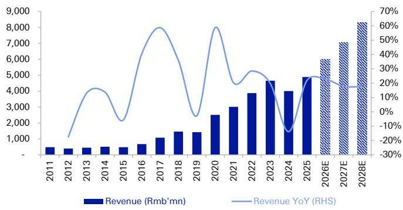
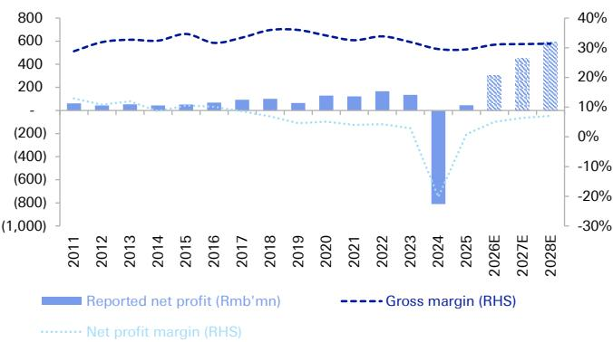
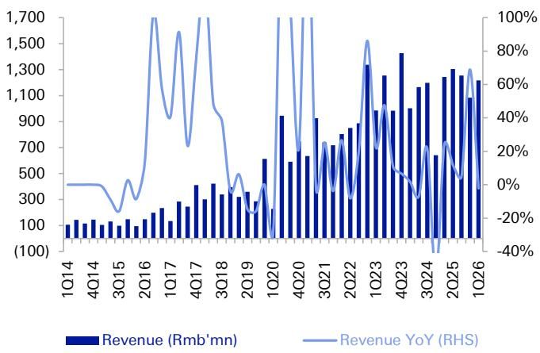
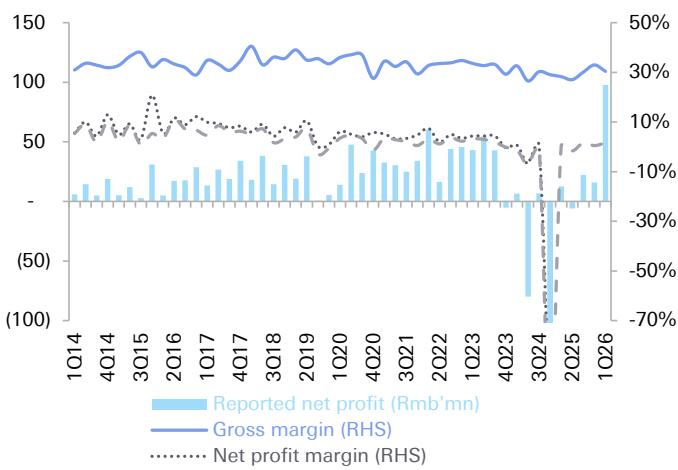
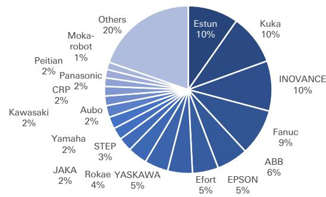
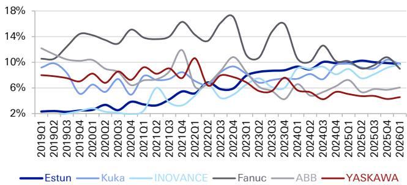
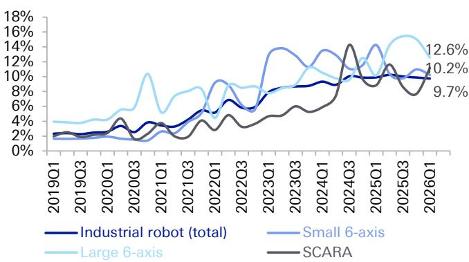
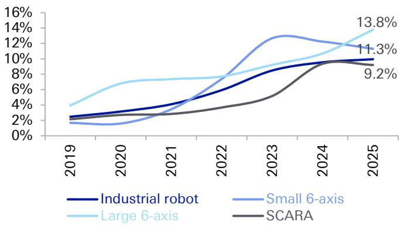
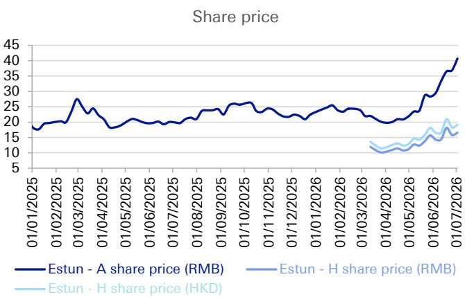
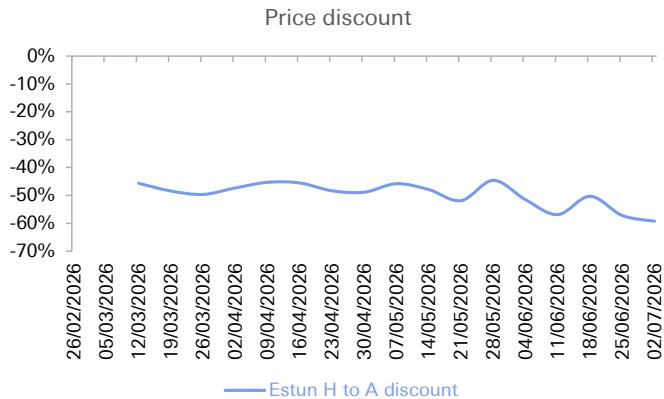

# 行业研究：埃斯顿（Estun Automation）

**亚洲 | 中国 | 香港**
**工业 | 制造业**

**日期：2026年7月7日**

**首次覆盖**

## 2026年第二季度业绩前瞻；潜在人形机器人业务收购；H股给予持有评级

埃斯顿预计将于8月21日晚间公布2026年上半年完整业绩。我们认为公司有可能在7月发布业绩预告。

我们预计埃斯顿2026年上半年净利润将在较低基数上实现同比增长，这为公司7月发布正面业绩预告提供了可能。对于2026年全年，我们预测营业收入为60亿元人民币，净利润为3.05亿元人民币（净利润率5%），与公司指引一致。对人形机器人业务Codroid的潜在收购预计对财务贡献有限，但对估值有正面影响。市场对此的乐观情绪已在埃斯顿的股价中有所体现，尤其是A股，读者对中国工业机器人市场排名第一的埃斯顿与人形机器人业务协同效应感到兴奋，且中国内地股票市场缺乏人形机器人OEM投资标的。短期内，我们认为对人形机器人的市场乐观情绪可能继续推动埃斯顿股价上行。以12个月维度看，我们维持A股报告评级，目标价31.4元人民币，因为我们认为2026年预期市销率7.4倍已较为充分，而人形机器人同行优必选为11倍（基于彭博预估），考虑到埃斯顿的人形机器人业务敞口小得多。我们给予H股持有评级，目标价23.6港元，我们认为H股2026年预期市销率3.3倍的估值指向风险回报平衡。

## 2026年上半年业绩前瞻：低基数上的强劲利润增长

对于2026年第二季度，我们预测埃斯顿实现营业收入15亿元人民币（同比增长15%），净利润4000万元人民币（优于2025年第二季度的-600万元人民币亏损；低于2026年第一季度的9800万元人民币），经常性净利润3800万元人民币（优于2025年第二季度的-2200万元人民币亏损和2026年第一季度的1900万元人民币）。

对于2026年上半年，我们预测埃斯顿实现营业收入27亿元人民币（同比增长7%），净利润1.38亿元人民币（较2025年上半年的700万元人民币增长1960%），经常性净利润5800万元人民币（2025年上半年为-1800万元人民币亏损）。

营业收入方面，我们预计2026年第二季度营收增速将从2026年第一季度的-2%提升至+15%，得益于：（1）电池和电子终端市场的稳健需求；（2）2026年第一季度实施的5-15%提价效果的显现；（3）较低的基数。

## DB AG/香港

**Iris Zheng, CFA**
**研究分析师**
**+852-2203-5884**

| 关键变化 | | | |
|---|---|---|---|
| 公司 | 目标价 | 评级 | |
| 002747.SZ | 20.00 至 31.40 | - | |

来源：DB

**涉及公司**

**埃斯顿 (002747.SZ)，人民币46.03元 | 卖出**

| | 2025A | 2026E | 2027E |
|---|---|---|---|
| 市盈率 (x) | 422.8 | 146.1 | 98.5 |
| 企业价值/EBITDA (x) | 61.7 | 71.3 | 55.1 |
| 市净率 (x) | 10.5 | 12.5 | 11.1 |

**埃斯顿 (2715.HK)，港币23.32元 | 持有**

| | 2025A | 2026E | 2027E |
|---|---|---|---|
| 市盈率 (x) | - | 64.1 | 43.2 |
| 企业价值/EBITDA (x) | - | 33.6 | 25.9 |
| 市净率 (x) | 0.0 | 5.5 | 4.9 |

来源：DB

盈利能力方面，我们预计2026年第二季度毛利率将提升至31%，得益于更高的营收和提价。我们预计埃斯顿将严格控制运营费用。然而，我们预计2026年第二季度净利润环比低于2026年第一季度，因为第一季度受益于8700万元人民币的非经常性收益。此外，我们预计资产减值将随营收增长和应收账款周期较长的汽车相关销售增加而环比上升。

对于2026年全年，我们预测营业收入60亿元人民币（同比增长23%），净利润3.05亿元人民币（净利润率5.1%；同比增长578%），经常性净利润2.05亿元人民币（净利润率3.4%；同比增长2714%）。这与公司60亿元人民币营收和5%净利润率的指引一致。

7月2日晚间，埃斯顿公告称公司正考虑以现金方式全资收购Codroid。我们认为此次潜在收购在一定程度上符合预期，因为Codroid与埃斯顿关系密切——埃斯顿已持有Codroid 13.9535%的股份，埃斯顿的母公司南京派雷斯特科技持有Codroid 39.0698%的股份。

Codroid成立于2022年，生产协作机器人、具身机器人及核心零部件。Codroid的主要终端市场包括汽车、家电、电子和食品物流。

2025年，Codroid实现营业收入5020万元人民币，净亏损5300万元人民币。因此，我们预计该收购短期内对埃斯顿的财务贡献有限。然而，我们认为Codroid在人形机器人业务方面的布局将提升/已提升市场对埃斯顿的情绪。

**图1：Codroid财务详情**

**Codroid财务表现**

| 人民币百万元 | 2024 | 2025 | 4M26 |
|---|---|---|---|
| 营业收入 | 11.0 | 50.2 | 14.9 |
| 净利润 | (36.1) | (53.0) | (12.7) |
| 净利润率 | -329% | -106% | -85% |
| 总资产 | 121.9 | 82.8 | 80.4 |
| 净资产 | 108.0 | 55.7 | 48.7 |

来源：公司数据

Codroid已推出三款具身机器人：

- **Codroid 02**：双足人形机器人，身高170厘米，体重70公斤。总自由度为29或31。单臂负载5公斤。
- **C05-U**：轮式人形机器人，身高138-168厘米，体重32公斤。
- **C05-L**：同样为轮式人形机器人，身高138-168厘米，体重32公斤。

**图2：Codroid的具身机器人：Codroid 02（左）和 C05-L（右）**

来源：公司数据

## A股：目标价上调至31.4元人民币；维持报告评级

我们调整2026/2027年净利润预估，分别上调8%/下调10%，以反映管理层对2026年的指引。我们引入2028年的新预估。

我们将贴现现金流模型得出的目标价从20元人民币上调至31.4元人民币，因为我们在中期假设中纳入了更高的增长预期，以反映具身AI机器人带来的机遇。我们的目标价基于三阶段贴现现金流估值。我们使用3.5%的终值增长率、1.8%的无风险利率、5%的股权风险溢价和1.61的贝塔系数，得出加权平均资本成本为9.3%。

埃斯顿A股2026/2027年预期市盈率为146倍/98倍，高于其长期一年远期市盈率67.5倍。公司2026年预期市销率为7.4倍。

上行风险包括：（1）中国和欧洲机器人市场需求的持续快速增长；（2）埃斯顿凭借新产品和强大的客户认可在中国及海外获得可观市场份额；（3）人形机器人在可预见的未来对集团营收和利润做出有意义的贡献。

## H股：首次覆盖给予持有评级，目标价23.6港元

我们首次覆盖H股，给予持有评级，目标价23.6港元。我们的目标价通过对A股目标价应用35%的折让得出——这一折让与我们追踪的A/H股折让追踪器的平均折让率一致，该追踪器追踪自2024年下半年以来约50家两地上市公司。A股目标价基于三阶段贴现现金流估值。2026-2028年，我们使用详细预测。中期（2029-2050年），我们使用中期假设，此后年份使用3.5%的终值增长率。我们使用1.8%的无风险利率、5%的股权风险溢价和1.61的贝塔系数，得出加权平均资本成本为9.3%。我们注意到，目前人形机器人相关公司如埃斯顿、兆威机电、三花智控和蓝思科技在港股市场的折让平均超过50%，表明香港市场读者对人形机器人机遇的态度相对更为保守。我们认为，考虑到较低的估值和增长机遇，H股的风险回报是平衡的。因此，我们给予H股持有评级。

## 埃斯顿H股2026/2027年预期市盈率为64倍/43倍，2026年预期市销率为3.3倍。

上行风险与A股相同。下行风险包括：（1）机器人市场需求恶化，定价压力重现；（2）人形机器人相关销售贡献极小，模型训练成本上升；（3）地缘政治风险加剧影响埃斯顿海外销售。

**图3：A股预估变化**

| (人民币百万元) | 2025 | DBe 2026E | DBe 旧预估 | 新旧变化 | BBG一致预期 | DBe vs BBG | DBe 2027E | DBe 旧预估 | 新旧变化 | BBG一致预期 | DBe vs BBG | DBe 2028E | BBG一致预期 | DBe vs BBG |
|---|---|---|---|---|---|---|---|---|---|---|---|---|---|---|
| 营业收入 | 4,888 | 6,001 | 6,443 | -6.9% | 5,785 | 3.7% | 7,069 | 7,884 | -10.3% | 6,675 | 5.9% | 8,309 | 7,580 | 9.6% |
| 营收同比 | 21.9% | 22.8% | 22.2% | | 18.4% | | 17.8% | 22.4% | | 15.4% | | 17.5% | 13.6% | |
| 营业成本 | (3,448) | (4,138) | (4,561) | | | | (4,860) | (5,566) | | | | (5,703) | | |
| 毛利润 | 1,440 | 1,863 | 1,882 | -1.0% | | | 2,209 | 2,317 | -4.7% | | | 2,606 | | |
| 毛利率 | 29.5% | 31.0% | 29.2% | | | | 31.3% | 29.4% | | | | 31.4% | | |
| 营业税金及附加 | (24) | (29) | (32) | | | | (34) | (39) | | | | (40) | | |
| 销售费用 | (449) | (480) | (515) | | | | (530) | (591) | | | | (623) | | |
| 管理费用 | (410) | (431) | (503) | | | | (465) | (528) | | | | (502) | | |
| 研发费用 | (419) | (468) | (515) | | | | (551) | (591) | | | | (648) | | |
| 财务费用 | (153) | (153) | (120) | | | | (153) | (120) | | | | (153) | | |
| 其他收益/损失 | 85 | 50 | 100 | | | | 50 | 100 | | | | 50 | | |
| 营业利润（报告） | 70 | 351 | 296 | 18.8% | | | 525 | 547 | -4.0% | | | 689 | | |
| 营业利润率 | 1.4% | 5.9% | 4.6% | | | | 7.4% | 6.9% | | | | 8.3% | | |
| 营业外收入 | 21 | 21 | 27 | | | | 21 | 27 | | | | 21 | | |
| 营业外支出 | (13) | (13) | (11) | | | | (13) | (11) | | | | (13) | | |
| 税前利润 | 77 | 359 | 312 | | | | 533 | 563 | | | | 697 | | |
| 所得税费用 | (32) | (54) | (37) | | | | (80) | (68) | | | | (104) | | |
| 税率 | 41.5% | 15.0% | 12.0% | | | | 15.0% | 12.0% | | | | 15.0% | | |
| 少数股东损益 | (0) | (0) | 8 | | | | (0) | 9 | | | | (1) | | |
| 少数股东占比 | 0.8% | 0.1% | -2.9% | | | | 0.1% | -1.8% | | | | 0.1% | | |
| 报告净利润 | 45 | 305 | 283 | 7.9% | 256 | 19.0% | 452 | 505 | -10.3% | 333 | 36.0% | 592 | 427 | 38.5% |
| 净利润率（报告） | 0.9% | 5.1% | 4.4% | | 4.4% | | 6.4% | 6.4% | | 5.0% | | 7.1% | 5.6% | |
| 净利润同比 | -105.5% | 578.0% | 360.9% | | | | 48.4% | 78.5% | | | | 30.8% | | |
| 非经常性项目 | 38 | 100 | - | | | | 100 | - | | | | 100 | | |
| 占报告净利润比例 | 83.8% | 0.0% | 0.0% | | | | 0.0% | 0.0% | | | | 0.0% | | |
| 经常性净利润 | 7 | 205 | 283 | -27.5% | | | 352 | 505 | -30.2% | | | 492 | | |
| 净利润率（经常性） | 0.1% | 3.4% | 4.4% | | | | 5.0% | 6.4% | | | | 5.9% | | |
| 每股收益（基本）（人民币） | 0.05 | 0.32 | 0.33 | -3.1% | 0.27 | 17.1% | 0.47 | 0.58 | -19.4% | 0.35 | 34.3% | 0.61 | 0.45 | 37.1% |
| 每股收益同比 | -105.5% | 510.2% | 360.9% | | | | 48.4% | 78.5% | | | | 30.8% | | |
| 期末股本 | 871 | 968 | 870 | | | | 968 | 870 | | | | 968 | | |
| 每股股息（人民币） | - | - | - | | 0.05 | | - | - | | 0.07 | | - | 0.09 | |
| 派息率 | 0.0% | 0.0% | 0.0% | | 18.6% | | 0.0% | 0.0% | | 19.8% | | 0.0% | 19.7% | |

来源：公司数据、DB预估、彭博财经LP一致预期

**图4：财务数据（年度）：埃斯顿营收在2024年下滑后于2025年恢复增长趋势**

来源：公司数据、DB预估

**图5：财务数据（季度）：净利润在2026年第一季度创历史新高，主要受股权投资非经常性公允价值变动推动**

来源：公司数据、DB

**图6：2026年第一季度埃斯顿是中国工业机器人市场最大的制造商（按台数计）**

来源：MIR、DB

**图7：以埃斯顿为首的中国机器人制造商在中国工业机器人市场的份额持续提升（市场份额随时间变化）**

来源：MIR、DB

**图8：埃斯顿在中国市场的份额——季度（左）和年度（右）——埃斯顿在大型六轴机器人领域份额更高**

来源：MIR、DB

**图9：贴现现金流假设与目标价**

| (人民币百万元) | | | |
|---|---|---|---|
| **估值** | | | |
| 总债务 | 3,609 | 终值增长率 | 3.5% |
| 市值 | 45,486 | | |
| 总资本 | 49,095 | 现值 | 12,753 |
| | | 终值 | 19,116 |
| | | 企业价值净现值 | 31,869 |
| 债务/资本 | 7% | | |
| 权益/资本 | 93% | | |
| 加权平均资本成本 | 9.3% | 净债务/（净现金） | 1,461 |
| | | 少数股东权益 | 58 |
| | | 股权价值 | 30,351 |
| **债务成本** | | | |
| 税前债务成本 | 4.3% | | |
| 税率 | 30.0% | 总股本（百万） | 968 |
| 税后债务成本 | 3.0% | A股目标价（人民币） | 31.4 |
| **股权成本** | | | |
| 贝塔系数 | 1.61 | 汇率：人民币兑港币 | 1.16 |
| 无风险利率 | 1.8% | H股相对A股折让 | 35% |
| 股权风险溢价 | 5.0% | H股目标价（港币） | 23.6 |
| 股权成本 | 9.9% | | |

来源：DB预估

**图10：A股贴现现金流模型**

| 财年（人民币百万元） | 2020 | 2021 | 2022 | 2023 | 2024 | 2025 | 2026E | 2027E | 2028E | 2029E | 2030E | 2031E | 2032E | 2033E | 2034E | 2035E | 2036E | 2037E | 2038E | 2039E | 2040E | 2041E | 2042E | 2043E | 2044E | 2045E | 2046E | 2047E | 2048E | 2049E | 2050E |
|---|---|---|---|---|---|---|---|---|---|---|---|---|---|---|---|---|---|---|---|---|---|---|---|---|---|---|---|---|---|---|---|
| 营收 | 2,610 | 3,020 | 3,881 | 4,862 | 4,009 | 4,888 | 6,001 | 7,069 | 8,309 | 9,736 | 11,372 | 13,241 | 15,389 | 17,782 | 20,608 | 23,677 | 27,018 | 30,983 | 35,141 | 39,883 | 46,119 | 60,876 | 67,180 | 64,065 | 71,621 | 79,696 | 88,297 | 97,804 | 107,546 | 118,104 | 129,284 |
| 营收同比 | 58.7% | 20.3% | 28.5% | 19.9% | -13.8% | 21.9% | 22.8% | 17.8% | 17.5% | 17.2% | 16.8% | 16.4% | 16.1% | 15.7% | 15.3% | 15.0% | 14.6% | 14.2% | 13.9% | 13.5% | 13.1% | 12.8% | 12.4% | 12.0% | 11.7% | 11.3% | 10.9% | 10.6% | 10.2% | 9.8% | 9.5% |
| 息税前利润 | 123 | 115 | 298 | 224 | (254) | 138 | 455 | 628 | 792 | 933 | 1,094 | 1,290 | 1,492 | 1,734 | 2,009 | 2,320 | 2,671 | 3,064 | 3,505 | 3,995 | 4,639 | 5,141 | 5,803 | 6,529 | 7,321 | 8,183 | 9,115 | 10,120 | 11,198 | 12,349 | 13,673 |
| 息税前利润率 | 4.9% | 3.8% | 7.7% | 4.8% | -6.3% | 2.8% | 7.6% | 8.9% | 9.5% | 9.6% | 9.6% | 9.7% | 9.7% | 9.8% | 9.8% | 9.8% | 9.9% | 9.9% | 10.0% | 10.0% | 10.1% | 10.1% | 10.2% | 10.2% | 10.3% | 10.3% | 10.4% | 10.4% | 10.5% | 10.5% | 10.5% |
| 税费 | (5) | (6) | (91) | (46) | (14) | (57) | (68) | (94) | (119) | (140) | (164) | (192) | (224) | (260) | (301) | (348) | (401) | (460) | (526) | (599) | (681) | (771) | (870) | (979) | (1,098) | (1,227) | (1,367) | (1,518) | (1,680) | (1,852) | (2,036) |
| 税率 | 4.4% | 5.5% | 30.4% | 20.4% | -5.4% | 41.5% | 15.0% | 15.0% | 15.0% | 15.0% | 15.0% | 15.0% | 15.0% | 15.0% | 15.0% | 15.0% | 15.0% | 15.0% | 15.0% | 15.0% | 15.0% | 15.0% | 15.0% | 10.0% | 15.0% | 15.0% | 15.0% | 15.0% | 15.0% | 15.0% | 15.0% |
| 折旧摊销 | 92 | 94 | 104 | 135 | 181 | 190 | 174 | 184 | 195 | 233 | 278 | 331 | 392 | 463 | 545 | 639 | 747 | 869 | 1,008 | 1,165 | 1,342 | 1,540 | 1,761 | 2,006 | 2,278 | 2,576 | 2,904 | 3,262 | 3,651 | 4,072 | 4,524 |
| 折旧摊销占营收比 | 3.7% | 3.1% | 2.7% | 2.9% | 4.5% | 3.9% | 2.9% | 2.6% | 2.3% | 2.4% | 2.4% | 2.5% | 2.6% | 2.6% | 2.7% | 2.7% | 2.8% | 2.8% | 2.9% | 2.9% | 3.0% | 3.0% | 3.1% | 3.1% | 3.2% | 3.2% | 3.3% | 3.3% | 3.4% | 3.4% | 3.5% |
| 资本支出 | (107) | (117) | (283) | (416) | (343) | (312) | (220) | (220) | (220) | (258) | (302) | (352) | (410) | (475) | (549) | (632) | (725) | (830) | (947) | (1,076) | (1,220) | (1,378) | (1,551) | (1,741) | (1,947) | (2,170) | (2,411) | (2,670) | (2,947) | (3,242) | (3,555) |
| 资本支出（净）占营收比 | 4.3% | 3.9% | 1.7% | 9.9% | 6.5% | 5.4% | 3.7% | 3.1% | 3.6% | 2.7% | 2.7% | 2.7% | 2.7% | 2.7% | 2.7% | 2.7% | 2.7% | 2.7% | 2.7% | 2.7% | 2.7% | 2.7% | 2.7% | 2.7% | 2.7% | 2.7% | 2.7% | 2.7% | 2.8% | 2.8% |
| 营运资本变动 | 84 | 91 | (387) | (356) | (73) | 97 | (397) | (387) | (436) | (504) | (578) | (664) | (758) | (863) | (979) | (1,107) | (1,475) | (1,400) | (1,566) | (1,745) | (1,938) | (2,145) | (2,365) | (2,599) | (2,845) | (3,103) | (3,371) | (3,649) | (3,936) | (4,228) | (4,524) |
| 营运资本变动占营收比 | -3.3% | -3.0% | 10.0% | 7.7% | 1.8% | -9.0% | 6.6% | 5.5% | 5.3% | 5.2% | 5.1% | 5.0% | 4.9% | 4.9% | 4.9% | 4.7% | 4.6% | 4.5% | 4.5% | 4.4% | 4.3% | 4.2% | 4.1% | 4.1% | 4.0% | 3.9% | 3.8% | 3.7% | 3.7% | 3.6% | 3.5% |
| 自由现金流 | 186 | 177 | (369) | (459) | (602) | 55 | (56) | 111 | 212 | 284 | 327 | 403 | 483 | 600 | 728 | 873 | 1,045 | 1,244 | 1,476 | 1,740 | 2,042 | 2,387 | 2,777 | 3,218 | 3,709 | 4,269 | 4,889 | 5,544 | 6,288 | 7,088 | 7,882 |
| 自由现金流/EBITDA (%) | 86.7% | 84.6% | -89.1% | -127.8% | 687.3% | 16.6% | -8.9% | 13.7% | 21.8% | 22.7% | 23.8% | 25.0% | 26.2% | 27.3% | 28.4% | 29.5% | 30.6% | 31.6% | 32.7% | 33.7% | 34.7% | 35.7% | 36.7% | 37.7% | 38.6% | 39.6% | 40.5% | 41.4% | 42.5% | 43.1% | 44.1% |

来源：DB预估、公司数据

**图11：埃斯顿H股相对A股的折让已扩大**

来源：DB、彭博财经LP

我们的A/H股折让追踪器（我们追踪近50家公司，详情请联系我们）显示，自2024年下半年以来两地上市的公司，H股相对A股的平均折让为-34%。然而，如下图所示，人形机器人相关公司的H股折让似乎更大，平均超过50%，表明香港市场读者对人形机器人机遇的态度相对更为保守。

**图12：人形机器人相关公司H股相对A股折让平均超过50%**

| 代码（彭博） | 英文名称 | 中文名称 | 市值（百万美元） | 上市日期 | 两地上市前一日 | | | | 两地上市后一日 | | | | 最新定价 | | | |
|---|---|---|---|---|---|---|---|---|---|---|---|---|---|---|---|---|
| | | | | H股发行价（港币） | H股发行价（人民币） | A股价格（人民币） | 相对A股溢价或折让（%） | H股价格（港币） | H股价格（人民币） | A股价格（人民币） | 相对A股溢价或折让（%） | H股价格（港币） | H股价格（人民币） | A股价格（人民币） | 相对A股溢价或折让（%） |
| 002747 CH | Estun | 埃斯顿 | 6,186 | 2015/3/20 | | | 22.23 | | | | 21.88 | | | | 46.03 | |
| 2715 HK | Estun | 埃斯顿 | 6,186 | 2026/3/9 | 15.36 | 13.56 | | -39% | 12.90 | 11.40 | | -48% | 22.90 | 19.83 | | -57% |
| 003021 CH | Zhaowei | 兆威机电 | 3,575 | 2020/12/4 | | | 117.72 | | | | 113.07 | | | | 95.38 | |
| 2692 HK | Zhaowei | 兆威机电 | 3,575 | 2026/3/9 | 71.28 | 62.92 | | -47% | 73.00 | 64.49 | | -43% | 56.70 | 49.11 | | -49% |
| 002050 CH | Sanhua | 三花智控 | 27,107 | 2005/6/7 | | | 24.95 | | | | 24.50 | | | | 46.15 | |
| 2050 HK | Sanhua | 三花智控 | 27,107 | 2025/6/23 | 22.53 | 20.61 | | -17% | 22.50 | 20.58 | | -16% | 28.84 | 24.98 | | -46% |
| 300433 CH | LENS | 蓝思科技 | 38,561 | 2015/3/18 | | | 23.33 | | | | 22.69 | | | | 51.31 | |
| 6613 HK | LENS | 蓝思科技 | 38,561 | 2025/7/9 | 18.18 | 16.62 | | -29% | 19.84 | 18.15 | | -20% | 25.00 | 21.65 | | -58% |
| **相对A股平均溢价或折让（%）** | | | | | | | **-33%** | | | | | **-32%** | | | | **-52%** |

来源：DB、彭博财经LP

**图13：上市同行比较表**

| 代码 | 公司名称 | 中文名称 | 评级 | DB分析师 | 货币 | 当前价格 | 市值（百万美元） | 价格变动 | | | 市销率 | | | 市盈率 | | | 市净率 | | | 每股收益增长 | | | 净资产回报表现 | | | 股息率 |
|---|---|---|---|---|---|---|---|---|---|---|---|---|---|---|---|---|---|---|---|---|---|---|---|---|---|---|---|
| | | | | | | | 1个月 | 3个月 | 年初至今 | FY26E | FY27E | FY28E | FY26E | FY27E | FY28E | FY26E | FY27E | FY28E | FY26E | FY27E | FY28E | FY26E | FY27E | FY28E | FY27E |
| 1SLA.OQ | Tesla | 特斯拉
