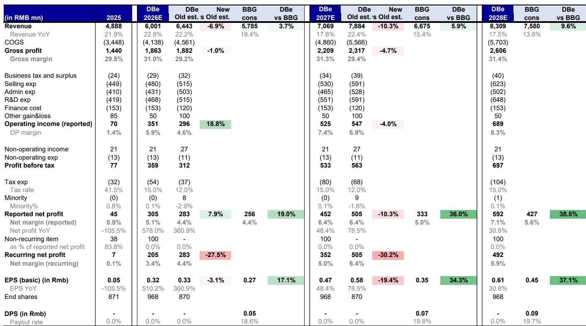
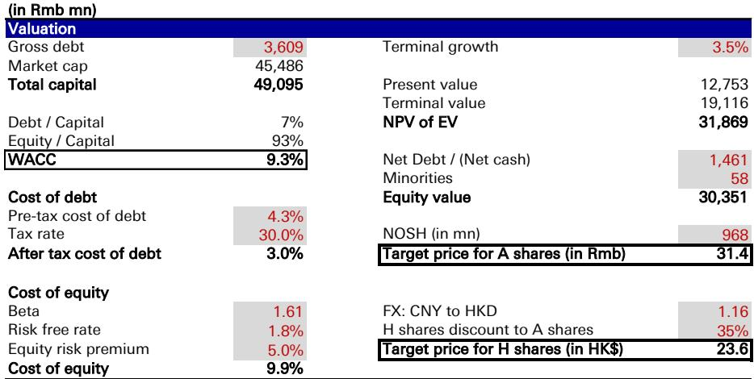
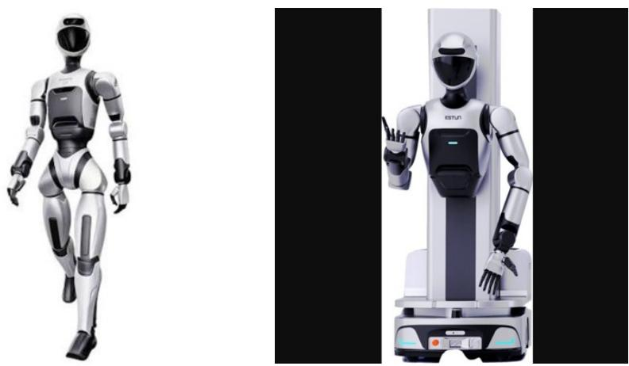

# DB：人形机器人收购情绪高涨，但埃斯顿利润修复可持续吗？

这份DB首次覆盖埃斯顿的研报，最值得关注的判断并非利润修复本身，而是它揭示了一个正在形成的市场结构：相关市场读者对人形机器人主题的定价热情，与H股读者的冷静形成了鲜明对比。报告对相关市场更新公司观点、对H股更新公司观点，这个评级差异本身，就是当前中国机器人行业估值分化的缩影。

埃斯顿预计在7月发布盈利预喜。1H26净利润预计同比增长近20倍，从700万人民币跃升至1.38亿。这个数字看起来很惊人，但基数极低——2025年上半年净利润仅700万。真正值得看的是收入端：2Q26收入预计同比增长15%，扭转1Q26的-2%下滑。电池和电子终端需求回暖、一季度5-15%的提价逐步兑现，是主要驱动力。

但利润修复的可持续性，报告没有完全回答。一季度净利润包含8700万的非经常性收益，2Q26环比将明显回落。资产减值损失也可能随汽车业务占比提升而增加。DB预计2026全年净利润3.05亿，净利率5.1%，这个水平在工业机器人行业里并不突出。

> **KC评论：** 利润修复是真实的，但市场对埃斯顿的定价早已脱离了当期利润。2026年P/E高达146倍，P/S 7.4倍。读者买的不是2026年的利润，而是人形机器人这个远期期权。完整报告里关于Codroid的财务数据值得细看——2025年收入仅5000万，净亏损5300万，收购对短期财报贡献几乎为零。

## 1. 人形机器人收购：情绪价值远大于财务价值

埃斯顿7月2日公告正考虑现金收购Codroid全部股权。Codroid成立于2022年，生产协作机器人、具身机器人和核心零部件，2025年收入5000万，净亏损5300万。埃斯顿已持有其13.95%股权，母公司南京派雷斯特科技持有39.07%。

DB认为，这笔收购“对财务贡献极小，但对估值情绪有正面拉动”。这个判断很克制。事实上，Codroid的人形机器人产品——170cm双足机器人Codroid 02、两款轮式机器人C05-U和C05-L——目前仍处于早期商业化阶段。报告没有给出Codroid的收入预测或盈利时间表。

这里有一个关键问题：埃斯顿在中国工业机器人市场的份额已是第一，但工业机器人和人形机器人在技术路线、客户结构、商业模式上差异显著。收购Codroid能带来多少协同效应，报告没有充分展开。

## 2. 相关市场与H股的分化：同一个公司，两个定价体系

报告最有趣的洞察出现在对H股的估值讨论中。DB注意到，当前A+H双重上市的人形机器人相关公司——埃斯顿、兆威、三花、绿的——H股相对相关市场的平均折价超过50%。这意味着香港市场的读者对人形机器人主题明显更谨慎。

埃斯顿H股2026年P/S仅3.3倍，相关市场则是7.4倍。更新；更新。这个评级差异，本质上是两个市场对人形机器人远期价值的预期差。

> **KC评论：** 50%以上的A-H折价率，在双重上市公司中属于极端水平。这不仅仅是流动性溢价的问题，更反映了香港读者对人形机器人商业化的时间表判断比相关市场读者更保守。完整报告里有一张A/H股折价追踪表，覆盖近50只双重上市公司，这个数据本身值得单独研究。

## 3. 报告未完全回答的关键问题：估值何时回归

DB对相关市场估值的主要担忧是：2026年P/S 7.4倍，对比人形机器人同业优必选的11倍，看起来有折价，但埃斯顿的人形机器人业务规模远小于优必选。这个估值支撑是否牢固？

报告列出的上行不确定性包括：中国和欧洲机器人市场持续高增长、埃斯顿凭借新产品获得更多份额、人形机器人业务在可预见的未来对集团收入产生实质性贡献。但节奏变化不确定性同样明确：机器人市场需求出现变化、人形机器人收入贡献极小且模型训练成本上升、地缘政治不确定性影响海外销售。

一个真正关键的问题，报告没有深入讨论：如果人形机器人商业化进展慢于预期，当前相关市场估值中的期权价值需要多久才能被消化？2026年P/E 146倍，意味着即使利润弹性较高，估值仍然极高。H股3.3倍P/S虽然相对合理，但也要看到H股目前几乎没有分析师覆盖，流动性有限。

## 4. 读者可以建立的观察框架

这份报告提供了一个清晰的跟踪框架。核心变量有三个：第一，Codroid收购的定价、整合进度和产品商业化节奏——这是情绪面的核心驱动；第二，埃斯顿在工业机器人市场的份额变化，尤其是大型六轴机器人领域的优势能否维持——这是基本面的锚；第三，A-H股折价率的变化——这是市场定价分歧的温度计。

报告本身没有给出这些问题的答案。但它把问题摆在了桌面上，而且用评级差异明确表达了立场：相关市场的人形机器人叙事已经充分定价，H股的不确定性回报比更平衡。对于关注中国机器人产业的读者，这份研报的价值不在于结论，而在于它揭示了同一个产业故事在两个市场中的不同定价逻辑。

For informational purposes only. Portions may be generated,translated,summarized,or edited with AI assistance based on source materials and may contain omissions or errors. Please verify independently. This is not investment,legal,tax,accounting,or other professional advice.

For informational purposes only. Portions may be generated,translated,summarized,or edited with AI assistance based on source materials and may contain omissions or errors. Please verify independently. This is not investment,legal,tax,accounting,or other professional advice.

