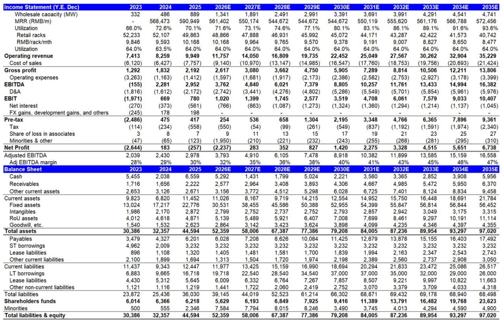
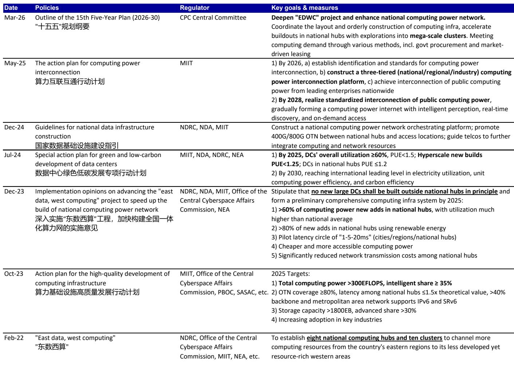
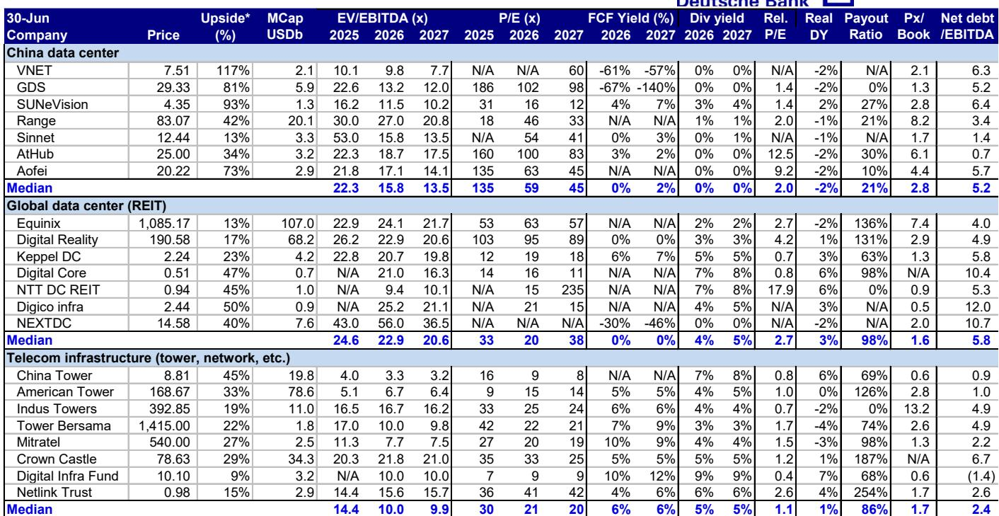

# VNET的转型不仅是增长故事——更是对中国AI基础设施领域资本纪律的一次检验

对于关注中国数据中心基础设施的观察者而言，最重要的问题已不再是需求是否存在，而是任何一家运营商能否在保持财务稳健的前提下，快速扩大规模以抓住这一需求。VNET集团，一家拥有超过7000家企业客户的数据中心运营商，目前正是这一命题下最值得关注的案例。该公司今年以来已获得517兆瓦的新增批发订单——远超其最接近的竞争对手——管理层正计划建设10吉瓦的规模。其雄心之大，与执行风险之高同样引人注目。

VNET的战略价值不仅在于其订单势头，更在于其背后的结构性转型。该公司正从以零售为主的托管模式，转向超大规模批发开发模式，这一转变将改变其利润率结构、资本需求以及竞争地位。这并非周期性的上升，而是商业模式的再造。问题在于，市场是否已合理评估这一转型所蕴含的选择权价值，还是仍停留在对杠杆、股东结构和执行力的传统担忧上。

一家全球性研究机构近期首次覆盖VNET，其分析基于三大支柱：由AI和云需求驱动的异常订单势头、由资产货币化支撑的自我强化资本模式，以及长期股东抛压的消除。每一项都值得审视，但报告中最具洞察力的结论并非关于单一因素，而是VNET的转型如何创造出一种市场尚未充分定价的新型风险回报特征。

## VNET的订单优势不仅是领先——更是市场地位的结构性转变

VNET今年以来已获得517兆瓦的新增批发订单，而同期GDS为334兆瓦。其中，510兆瓦来自单一客户：字节跳动，用于北京地区的两个数据中心园区。这并非边际优势，而是重新定义竞争格局的市场份额争夺。

这一订单规模之所以重要，有两个原因。首先，它表明在AI驱动下容量扩张加速之际，VNET已成为中国最大超大规模云服务商的首选合作伙伴。字节跳动的承诺，显示出对VNET在规模、按时交付以及满足超大规模工作负载所需的电力和连接能力方面的信心。其次，交付时间表——从2026年下半年到2028年上半年分三个阶段进行——提供了多年度的收入和EBITDA增长可见性，这是多数同行难以匹敌的。

这意味着VNET并非仅仅受益于行业上升趋势，而是在捕捉市场中最具价值的部分。批发超大规模合同相比零售托管，具有更高的利润率、更快的利用率提升速度和更长的合同期限。通过现在锁定这些承诺，VNET实际上是在预先构建一个随着利用率提升而复合增长的收入基础。报告预计，批发利用率将从当前水平提升至2028年的约75%，但考虑到在建容量的预承诺率为85.8%，这一估计可能偏保守。

## 从零售向批发的转变推动利润率扩张，改变盈利叙事

VNET的批发业务调整后EBITDA利润率为45%至50%，而零售业务为30%至35%，非IDC服务则为低两位数。2026年第一季度，批发收入首次超过零售，标志着公司双核心增长战略的一个里程碑。这一结构变化并非一次性事件，而是将定义公司未来数年盈利轨迹的结构性趋势。

其机制简单而有力。批发项目由超大规模云服务商的大规模预承诺支撑，通常在六至十二个月内实现90%以上的利用率。零售项目则需要三至四年才能达到70%的利用率。随着批发收入占比上升，投资组合的加权平均利润率自动提高，即使单位经济性没有改善。

报告预计，调整后EBITDA利润率将从2026年的32.3%上升至2028年的36.3%。如果实现，这一轨迹将代表公司盈利能力的实质性重估。但更重要的是，利润率扩张已内嵌于商业模式之中，并不依赖于对定价权或成本削减的激进假设。这是结构变化的结果，而这一变化正在不可逆转地进行。

## 自我强化的资本模式或可解决资金难题，但执行是关键

VNET每年100至120亿元人民币的资本支出计划，无论以何种标准衡量都相当激进。该公司正计划以中国数据中心运营商中少有的速度建设容量。显而易见的担忧是资金问题。一家净债务权益比为97%、营业利润率为8.7%的公司，如何为如此大规模的多年建设提供资金？

答案在于资产货币化。VNET已成功通过REIT上市出售了64亿元人民币资产中的70%，实现了13至14倍EV/EBITDA的估值。这形成了一个自我强化的循环：建设成熟资产，以有吸引力的倍数货币化，将资本循环投入新开发，然后重复。报告将此描述为潜在竞争优势的来源，其逻辑是合理的。如果VNET能够持续以两位数的EBITDA倍数退出成熟资产，同时以较低的资金成本为新建设融资，那么该模式产生的价值将超过各部分之和。

然而，这一模式并非没有风险。中国的REIT市场仍在发展，对数据中心资产的需求可能不会保持当前水平。如果货币化放缓或估值压缩，资金缺口将扩大。报告承认了这一风险，但并未充分压力测试下行情景。观察者应思考：如果REIT渠道关闭十二个月，会发生什么？VNET是否有足够的流动性或替代融资来维持其建设？报告并未给出明确答案，而这正是任何考虑长期布局的人需要关注的最重要问题。

## 报告未完全回答的问题：供应过剩风险与资本模式的脆弱性

中国的每一轮基础设施周期都遵循类似模式：需求激增，容量扩张，最终供应赶上。数据中心行业也不例外。报告将供应过剩和需求放缓列为关键风险，但未详细探讨这一情景。考虑到VNET的建设规模，即使需求出现温和放缓，也可能导致公司面临容量利用不足和资产负债表紧张的局面。

报告还留下了VNET与其新战略读者（一家CATL关联公司）关系将如何演变的问题。虽然电池和储能巨头的参与可能增强融资渠道并支持海外扩张，但协同效应仍属推测。报告未量化这些协同效应的潜在价值，审慎的做法是假设它们尚未被计入公司估值。

最后，报告的DCF估值仅假设管理层10吉瓦建设目标的一半。这是一个保守的假设，但也意味着上行情景——即VNET实现其全部目标——并未被建模。观察者需要自行决定，为1056兆瓦的未开发土地储备（其中大部分位于乌兰察布等低成本地区，经济性仍具吸引力）赋予多少选择权价值。报告提供了数据，但未给出明确结论。

## 观察者的决策框架：三个问题判断VNET是否符合你的研究范围

对于评估VNET的机构观察者而言，关键不在于预测公司是否会成功或失败，而在于理解其逻辑成立的条件以及失效的条件。以下是进行评估的框架。

首先，你对未来三年中国超大规模云服务商资本支出的看法是什么？VNET的订单集中在单一客户字节跳动。如果字节跳动的AI投入周期放缓——无论是因为监管、竞争动态还是宏观环境变化——VNET的收入可见性将下降。乐观情景取决于云和AI支出的持续加速。如果你认为这一周期仍有空间，VNET处于有利位置。如果你持谨慎态度，集中度风险是等待的理由。

其次，VNET能否保持其资本循环的纪律？自我强化模式只有在公司能够持续以有利倍数货币化资产时才有效。这不仅需要一个运作良好的REIT市场，还需要按时按预算将资产推向成熟的运营纪律。VNET已展示了这一能力，但将其规模扩大一个数量级会带来新的执行风险。过往记录很重要，但它并不能保证未来的表现。

第三，你如何权衡利润率扩张与杠杆？VNET的调整后EBITDA利润率预计将在三年内从20%多上升至30%多。这很有吸引力。但公司的净债务权益比接近100%，利息覆盖倍数仅为1.3倍。在利率上升或需求冲击的环境中，这一杠杆会放大下行风险。利润率扩张是真实的，但并非没有风险。

这三个问题不会得出单一答案。它们定义了结果的范围。对于看好中国AI基础设施并接受资产负债表风险的观察者，VNET提供了不对称的上行空间。对于那些更倾向于看到执行证据后再做判断的人，风险回报可能尚不具吸引力。

## 加入社区阅读完整报告并查看原始图表

以上分析基于一家全球研究机构的首次覆盖报告，但报告包含的细节远不止于此。它包括VNET按地区和期限划分的容量管道完整分解、批发利用率和收入增长的详细预测、DCF估值模型，以及包括“东数西算”框架下政策动态在内的行业趋势讨论。原始图表——显示收入趋势、容量交付时间表和利润率轨迹——对于任何进行独立研究的观察者来说都是必不可少的。

加入社区阅读完整报告并查看原始图表。

---

*仅供参考。部分内容可能基于源材料通过AI辅助生成、翻译、总结或编辑，可能存在遗漏或错误。请独立核实。这不构成任何专业建议。*

仅供参考。部分内容可能基于源材料通过AI辅助生成、翻译、总结或编辑，可能存在遗漏或错误。请独立核实。这不构成任何专业建议。

