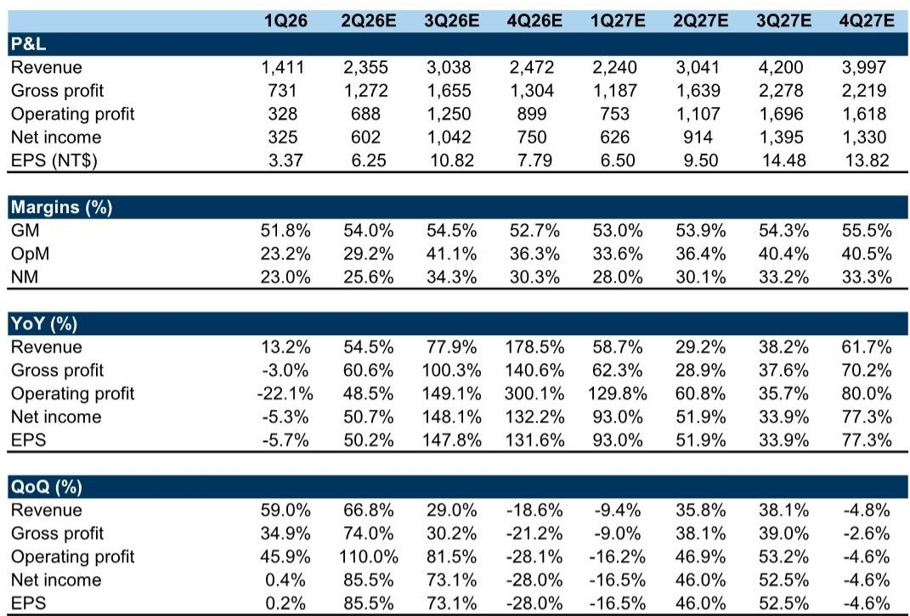
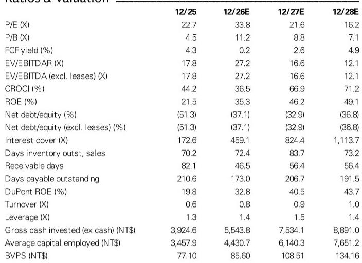
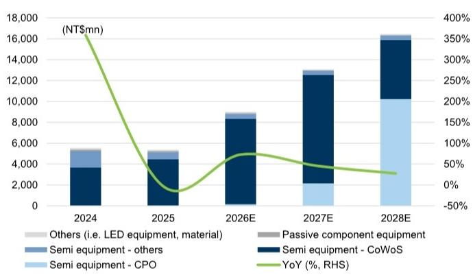

# The Market Has Priced in CPO Fears, but the Real Story Is a Structural Shift in Semiconductor Equipment Value

The most dangerous assumption in semiconductor investing is that a stock's recent decline reflects deteriorating fundamentals. All Ring Tech, a critical back-end equipment supplier for advanced packaging, has seen its shares fall 31% from an April peak, even as the broader Taiwan market rose 21%. The conventional narrative attributes this to concerns over a potential delay in Coherent Photonic Optics (CPO) adoption. But the data tells a different story: the company's June 2026 revenue came in 12.8% ahead of expectations, driven by a stronger-than-anticipated ramp in CoWoS demand. The market may have correctly identified a near-term concern, but it has incorrectly extrapolated that concern into a permanent re-rating.

What is unfolding at All Ring is not a cyclical pause but a structural transformation in how semiconductor equipment value is created. The company is navigating a transition where volume growth in CoWoS equipment is accelerating while CPO equipment is shifting toward fewer, higher-value units. The net effect, according to a recent global investment bank report, is a revenue trajectory that reaches NT$13.5 billion by 2027 and NT$17.2 billion by 2028, with gross margins expanding from 30% in 2025 to over 40% by 2028. The stock trades at 21.6x 2027 earnings. The question is whether the market is correctly interpreting the nature of that growth.

This matters now because the semiconductor industry is entering a period where the distinction between leading-edge logic and advanced packaging is blurring. CoWoS capacity is being built at an unprecedented pace. The same report that covers All Ring also raised its end-2027 CoWoS capacity estimate to 280,000 wafers per month, up from 250,000. As the sole or dominant supplier of critical back-end equipment for this process, All Ring is not just a beneficiary of this build-out -- it is a bottleneck. The strategic implications extend beyond one company. If All Ring's equipment throughput and pricing power are improving, it signals that the advanced packaging supply chain is tightening, not loosening. That has consequences for every AI accelerator and server CPU roadmap dependent on CoWoS.

The thesis is not without complexity. The CPO transition, while structurally powerful, introduces near-term uncertainty in shipment volumes and margin timing. But the risk-reward, after a 31% drawdown, is now skewed decisively to the upside for investors who can distinguish between temporary noise and secular direction.

## The CoWoS Capacity Acceleration Creates a Direct Revenue Bridge Through 2027

The most immediate driver of All Ring's near-term performance is the accelerating build-out of CoWoS capacity by its largest customer. The upward revision of end-2027 CoWoS capacity by 12% to 280,000 wpm is not an incremental adjustment. It reflects a fundamental reassessment of AI accelerator and server CPU demand that is forcing foundries to front-load equipment orders. For All Ring, this translates into a direct and measurable revenue uplift.

The report models All Ring's CoWoS-related revenue growing 27% year-over-year in 2027, up from a prior estimate of 16%. This is not speculative. It is a mechanical consequence of capacity targets that have already been communicated to suppliers. The company's June 2026 revenue of NT$1,012 million, bringing second-quarter revenue to NT$2,355 million, was 12.8% above the bank's estimate. The beat was attributed specifically to a stronger ramp of CoWoS demand. This is not a one-quarter phenomenon. The third-quarter estimate has been raised to NT$3,038 million, implying sequential growth of 29%.

The significance of this pattern is often misunderstood. Investors tend to view equipment suppliers as cyclical beneficiaries of a capex wave, with peak earnings occurring when capacity build-out peaks. But All Ring's revenue trajectory suggests something different. The company's CoWoS-related revenue is expected to account for 77% of total revenue in 2027, up from 60% in prior estimates. This concentration is not a risk; it is a signal that the company has become an integral part of the most critical infrastructure build in semiconductor history. The question is not whether demand will persist. It is whether All Ring can maintain its technological lead as capacity scales.

The margin implications are equally important. The report raises gross margin assumptions for the second and third quarters of 2026 to 54.0% and 54.5%, respectively, driven by a higher advanced packaging mix. This is not a temporary pricing anomaly. As CoWoS becomes a larger share of revenue, the overall margin structure of the company shifts upward. The structural improvement in gross margin from 30% in 2025 to over 40% by 2028 is driven by mix, not by one-time pricing gains. That is a durable competitive advantage.

## CPO Is Not a Delay Story; It Is a Value-Up Story That the Market Is Misreading

The market's primary concern has been that CPO adoption is slowing. The 31% decline from the April peak reflects this fear. But the report's analysis of CPO reveals a far more nuanced and ultimately more bullish dynamic. What is happening is not a delay in adoption. It is a shift in the nature of the equipment being shipped.

All Ring is working to increase the throughput of its CPO equipment to meet customer requests. Higher throughput per tool means that customers need fewer units to achieve the same production output. On the surface, this appears to reduce shipment volumes. But the report explicitly notes that the content value per equipment is increasing, and it now expects at least around 20% higher pricing for these next-generation systems. The net effect is a revenue contribution that is still substantial, though the timing of the ramp is different from earlier expectations.

The report models CPO revenue reaching NT$2.1 billion in 2027 and NT$10.2 billion in 2028, representing 16% and 60% of total revenue, respectively. The downward revision from prior estimates (29% and 69%) reflects lower unit volumes, not lower total addressable value. This is a critical distinction. If the market is pricing the stock based on unit volume fears, it is missing the value-per-tool expansion that is occurring simultaneously.

The strategic implication is that All Ring is becoming more, not less, important to the CPO ecosystem. Higher throughput tools mean that the company is solving the most difficult engineering challenge in the CPO supply chain: productivity. A supplier that can increase tool throughput while commanding higher pricing is demonstrating pricing power that is rare in semiconductor equipment. The near-term uncertainty in shipment timing creates a window for investors who understand that the long-term value creation is intact.

There is an unresolved question here that the report does not fully answer. If CPO equipment is shifting to fewer, higher-value units, what is the steady-state revenue run rate for this business? The report provides estimates through 2028, but the shape of the revenue curve beyond that depends on whether the throughput improvements are a one-time engineering achievement or a platform for ongoing productivity gains. This is the kind of question that separates a cyclical trade from a structural investment.

## The Earnings Revision Pattern Reveals a Company in the Middle of a Product Cycle Transition

The most revealing section of the report is the earnings revision table. The bank has raised 2026 EPS by 7.2% while cutting 2027 and 2028 EPS by 6.0% and 11.6%, respectively. On the surface, this looks like a classic "borrowing from the future" pattern. But the composition of the revisions tells a different story.

The 2026 upgrade is driven by stronger revenue and gross margins in the second and third quarters, reflecting the CoWoS acceleration. The 2027 and 2028 downgrades are driven entirely by lower CPO equipment unit assumptions, not by any deterioration in the CoWoS outlook. In fact, the CoWoS assumptions for 2027 and 2028 have been raised. The net effect is that the bank is pulling forward revenue from the CPO ramp into a higher-value, lower-volume profile.

This creates a fascinating dynamic for investors. The 2026 earnings beat provides immediate validation of the CoWoS thesis. The 2027 and 2028 estimates, while lower than before, still imply EPS growth of 57% and 33%, respectively. The stock at 21.6x 2027 earnings is pricing in significant skepticism about the sustainability of this growth. If the CPO ramp materializes even close to the revised estimates, the earnings power of the company in 2028 would justify a meaningfully higher multiple.

The report's valuation framework uses a 35x target P/E multiple applied to 2027 EPS. This is derived from the implied earnings growth uplift relative to the company's historical valuation. The question is not whether the company will grow. It is whether the market will re-rate the stock as the CPO narrative shifts from uncertainty to visibility.

## The Report Leaves a Critical Question Unanswered: What Is the Terminal Growth Rate for Advanced Packaging Equipment?

For all its analytical rigor, the report does not fully resolve the question of what happens after 2028. The revenue estimates show 27.6% growth in 2028, down from 45.3% in 2027 and 72.9% in 2026. This deceleration is natural as the base grows. But it also raises a question that is central to the long-term investment thesis.

CoWoS capacity build-out is not infinite. At 280,000 wpm by end-2027, the question becomes whether the pace of capacity additions will slow after that point. If it does, All Ring's CoWoS revenue growth will decelerate. The company's growth beyond 2028 would then depend almost entirely on the CPO ramp. The report models CPO as 60% of revenue by 2028, which would make the company's fortunes closely tied to the adoption rate of photonic interconnects in data centers.

This is not a flaw in the analysis. It is an honest acknowledgment that the investment case beyond 2028 depends on a technology transition that is still in its early stages. For investors with a two-to-three-year horizon, the CoWoS-driven earnings growth through 2027 provides a strong margin of safety. For those looking further out, the CPO thesis needs to be stress-tested against scenarios where adoption is slower or competition intensifies.

The report does not model these scenarios explicitly. That creates an opportunity for investors who can develop their own frameworks for assessing the probability distribution of outcomes. The base case is compelling. But the range of possible outcomes is wide, and the stock's current valuation does not fully reflect the asymmetry of the risk-reward.

## A Decision Framework for Investors Evaluating All Ring at Current Levels

The report provides the raw material for a structured investment decision. The following framework translates the analysis into actionable questions that each investor must answer based on their own time horizon and risk tolerance.

First, assess the CoWoS visibility. The report's CoWoS assumptions are based on a capacity target that has been publicly communicated by the company's largest customer. The probability that this capacity build-out occurs is high. The question is whether All Ring's share of the equipment spend remains constant or increases. The report assumes the former. If All Ring gains share, the upside is larger than modeled.

Second, evaluate the CPO margin profile. The report models gross margins improving from 52.7% in the fourth quarter of 2026 to 56.7% by 2028. This assumes that the higher pricing on next-generation CPO equipment offsets the initial margin drag from new product ramps. If the margin trajectory is better than modeled, the earnings power in 2028 could be significantly higher. If worse, the downside is contained by the CoWoS-driven earnings floor.

Third, consider the multiple re-rating potential. The stock trades at 21.6x 2027 earnings. The report's target multiple of 35x implies a re-rating that is justified by the earnings growth trajectory. But multiples are a function of perceived risk. As CPO uncertainty resolves, the multiple should expand. The question is whether the resolution comes through positive data points or through the passage of time. Investors with a longer horizon may not need to predict the timing of the re-rating.

Fourth, decide on the appropriate position sizing given the volatility. The stock has demonstrated that it can decline 31% in three months on narrative shifts, even as fundamentals improve. This is not a low-volatility compounder. It is a high-conviction, high-volatility position that requires the discipline to maintain exposure through drawdowns.

The report's analysis supports a constructive view for investors who can look through near-term noise. But it does not and cannot eliminate the uncertainty inherent in investing in a company that is at the center of two simultaneous technology transitions. The best investors will use this framework to size their position according to their conviction level, not to seek certainty where none exists.

## Join the Community to Read the Full Report and Review the Original Charts

The analysis presented here is based on a detailed global investment bank report that includes financial models, margin forecasts, and capacity estimates that cannot be fully reproduced in summary form. The original charts showing All Ring's revenue growth outlook and margin trends provide visual context for the inflection points discussed above. The full report also contains the complete earnings revision table and the valuation methodology.

For investors who want to make their own assessment of the CPO trajectory, the CoWoS capacity build, and the margin evolution, the original charts and data tables are essential. The community provides access to the full report, including the exhibits that illustrate the revenue composition shift from CoWoS to CPO over the next three years. This is the kind of granular analysis that separates informed investment decisions from headline-driven trading.

Join the community to read the full report and review the original charts.

*For informational purposes only. Portions may be generated, translated, summarized, or edited with AI assistance based on source materials and may contain omissions or errors. Please verify independently. This is not investment, legal, tax, accounting, or other professional advice.*

For informational purposes only. Portions may be generated, translated, summarized, or edited with AI assistance based on source materials and may contain omissions or errors. Please verify independently. This is not investment, legal, tax, accounting, or other professional advice.

