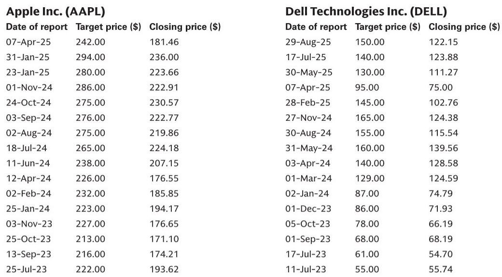
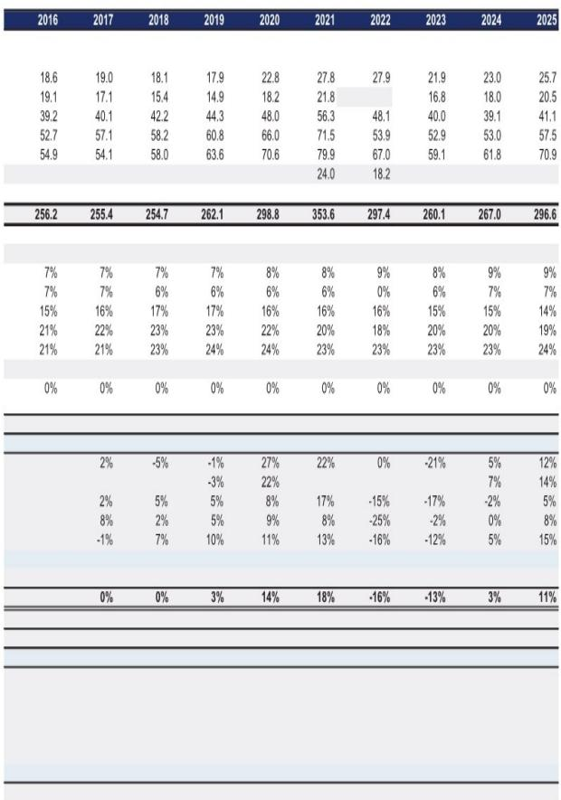
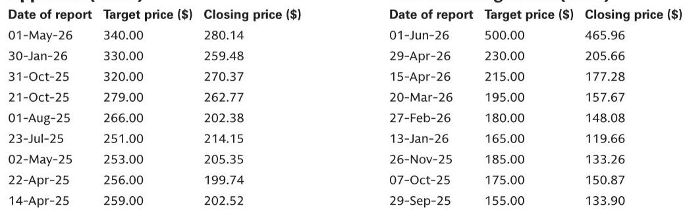

# GS：惠普出货量下滑9%，PC行业分化从供应链开始

连续九个季度的正增长之后，全球PC市场出现调整。IDC最新数据显示，2026年第二季度PC出货量（含工作站）约为6820万台，同比下降4.9%。这是自2024年初以来的首次季度同比下滑，标志着行业进入了一个新的调整阶段。

GS在最新发布的行业报告中指出，本轮调整并非需求端的全面变化，而是供给端的结构性收紧。内存、存储等关键元器件的持续短缺，叠加宏观环境的不确定性，构成了出货量下滑的主要因素。更关键的是，IDC预计这一局面要到2028年初才可能缓解，下半年出货量将因平均售价上升和供应受限而出现更明显的下降。

这意味着，行业竞争的逻辑正在发生根本性转变。当供给成为瓶颈，谁能拿到足够的元器件、谁能管理好复杂的供应链，谁就能在份额争夺中占据主动。GS判断，拥有多产品线和成熟供应链管理能力的大型厂商——苹果、戴尔、联想——将有机会在这一轮调整中进一步巩固市场地位，从小型竞争者手中获取份额。

> **KC观察：** 过去几年，PC行业讨论最多的是“需求何时恢复”。现在问题变成了“在供给受限的环境下，谁的供应链更强”。这份报告的核心信号是：规模不再是锦上添花，而是生存和扩张的必要条件。完整报告中的出货量数据表值得细看，它揭示了各厂商在不同季度的增长节奏差异，这些差异背后是供应链策略的体现。

## 1. 苹果和华硕逆势增长，惠普成为变化最明显的厂商

从市场份额变化来看，第二季度的赢家和输家非常清晰。

苹果出货量同比增长10%，市场份额达到9.9%，是Top5厂商中增速最快的。华硕出货量基本持平，微增0.2%，份额维持在7.4%。联想出货量同比下滑2%，但凭借24.4%的份额仍居行业首位。戴尔出货量下降5%，份额降至13.6%。惠普表现最弱，出货量同比下滑9%，份额降至19.1%。

这些数字背后反映的是不同厂商对供应链短缺的应对能力差异。苹果凭借其在芯片和关键元器件上的垂直整合能力，受到外部短缺的冲击相对较小。而惠普的下滑幅度最大，可能意味着其供应链管理在这一轮调整中面临更大的挑战。

> **KC观察：** 市场份额的变化本身是结果，原因在于各家厂商的供应链策略和供应商关系。报告没有详细展开各家厂商的供应链策略差异，但这是读者可以自己去深挖的方向——尤其是苹果和惠普之间的对比，可能揭示了垂直整合与外包策略在供给紧张环境下的不同表现。

## 2. 收入增长与出货量下滑并行，行业定价权正在转移

一个值得注意的现象是，尽管出货量在下降，但行业整体收入却在增长。IDC观察到，平均售价的上升正在推动行业收入走高。

这揭示了一个关键变化：在供给受限的环境下，PC厂商的定价能力正在增强。过去几年，价格竞争是行业常态，厂商为了抢份额不惜压低利润。但现在，短缺反而给了头部厂商提价的底气。对于大型厂商而言，这意味着利润率可能不会因出货量下滑而同步受损，甚至有可能改善。

但这一逻辑只适用于那些能够稳定拿到元器件的厂商。对于中小型厂商而言，短缺意味着无货可卖，提价无从谈起。行业的分化正在加速。

## 3. 报告尚未完全回答的关键问题：AI PC能否成为下一个增长引擎

GS这份报告聚焦于供给端，但对需求端的变化着墨不多。一个悬而未决的问题是：AI PC的渗透能否在2027-2028年成为推动换机周期的新动力。

目前，AI PC的出货量占比仍然较低，且其是否能真正刺激消费者和企业用户的换机需求，尚未得到数据验证。IDC的预测更多是基于供给端的假设，如果AI PC的吸引力超出预期，需求端可能提前回暖，从而改变当前对下半年出货量大幅下滑的判断。

另一方面，如果AI PC只是厂商的营销概念，而实际用户体验提升有限，那么即便供给端在2028年恢复，行业也可能面临需求不足的困境。这是报告没有深入讨论，但值得持续跟踪的变量。

## 4. 观察框架：如何判断行业拐点何时到来

对于关注PC产业链的读者，以下几个指标可以作为判断行业拐点的参考：

第一，元器件供应恢复的领先信号。内存和存储的价格走势、主要供应商的产能利用率，这些数据比出货量本身更能提前反映供给端的变化。

第二，中小厂商的份额变化。如果联想、苹果、戴尔的份额持续扩大，而小型厂商的份额加速流失，说明供给短缺仍在加剧。反之，如果中小厂商的份额开始企稳，可能意味着供应不确定性正在缓解。

第三，平均售价与出货量的关系。如果收入增速持续快于出货量增速，说明定价权仍在厂商手中，行业利润结构可能持续改善。一旦出货量恢复但平均售价回落，则意味着竞争格局可能重新出现变化。

第四，AI PC的渗透率曲线。这是需求端最值得关注的变量，但需要区分是真正的换机需求，还是企业IT部门的保守采购。

For informational purposes only. Portions may be generated,translated,summarized,or edited with AI assistance based on source materials and may contain omissions or errors. Please verify independently. This is not investment,legal,tax,accounting,or other professional advice.

For informational purposes only. Portions may be generated,translated,summarized,or edited with AI assistance based on source materials and may contain omissions or errors. Please verify independently. This is not investment,legal,tax,accounting,or other professional advice.

