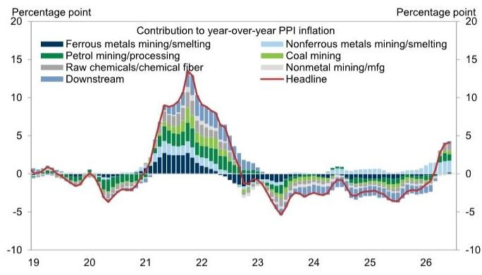
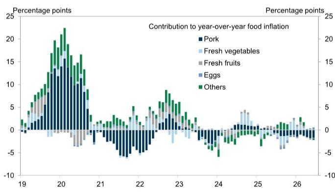
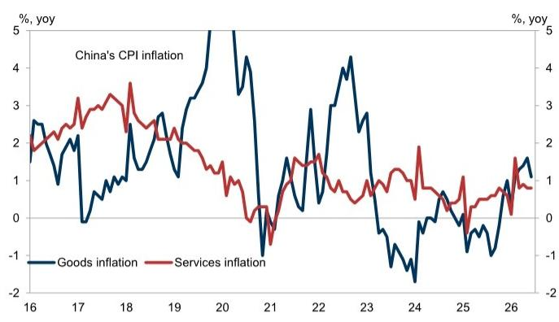

# GS：中国6月CPI回落背后，能源和黄金价格波动才是主因

中国6月通胀数据出炉，CPI同比从5月的+1.2%回落至+1.0%，PPI同比则从+3.9%微升至+4.1%。表面看，PPI仍在走高，但GS团队判断：这很可能是本轮PPI再通胀的阶段性峰值。更关键的是，二季度PPI的超预期表现，更多来自能源价格的前置冲击，而非需求端的持续性改善。随着原油价格预期下修，下半年PPI同比将逐步回落。

**这份报告真正值得关注的是它对2027年PPI预测的调整——从+0.6%直接下调至0%。** 这意味着，GS认为本轮由能源驱动的价格冲击，其尾部影响将比市场普遍预期的更快消退。对于依赖价格弹性做库存决策的企业，以及关注工业利润分配格局的读者，这个信号值得认真对待。

## 1. 能源和黄金是CPI节奏变化的主要影响，核心通胀保持稳定

6月CPI同比回落，并非需求走弱所致，而是结构性的价格因素在起作用。GS援引国家统计局的测算称，燃料成本和黄金价格下跌，合计解释了CPI同比从5月到6月0.23个百分点的降幅。其中，燃料价格同比从+21.1%大幅收窄至+15.3%；“其他商品与服务”价格同比从+9.9%降至+6.6%，主要反映金饰价格回调。

剔除食品和能源后的核心CPI同比仅从+1.1%微降至+1.0%，基本平稳。食品端，猪肉价格同比-15.9%，较5月的-16.1%略有收窄，但仍在深度负区间。整体而言，CPI读数反映的是能源和贵金属价格波动的传导，而非消费动能的实质性变化。

> **KC评论：** 核心通胀稳定意味着，当前政策层面无需因物价数据而调整节奏。真正需要关注的是PPI回落的速度，以及它对企业利润分配和库存周期的含义——这比单月CPI波动更有观察价值。

## 2. PPI的上行完全来自下游，上游贡献并未增加

6月PPI同比从+3.9%升至+4.1%，但拆开看，结构比总量更有意思。上游行业（油气、化工、黑色、煤炭）对PPI的贡献基本与5月持平，油气和化工价格下跌被黑色金属和煤炭价格上涨所抵消。全部0.2个百分点的同比增幅，完全来自下游行业，其中约一半来自电子设备制造（计算机、通信设备等）。

这揭示了一个关键变化：本轮PPI的边际推动力，已经从大宗商品转向了制造业下游。而下游价格能否持续走高，取决于终端需求能否承接。GS对此似乎并不乐观——它们在H2的PPI环比预测上做了下调。

## 3. 报告尚未完全回答：下游涨价能否持续

这是这份报告留下的最大悬念。GS明确指出，二季度PPI超预期意味着能源驱动的再通胀冲击比预期更“前置”，但基于商品团队对原油价格的下修，H2的PPI环比将走弱。2026年全年PPI预测维持2.0%不变，但2027年预测从+0.6%直接降至0%。

这里隐含的逻辑是：当前下游电子设备等行业的价格上涨，更多是成本传导和结构性补库，而非需求扩张驱动的持续性涨价。一旦能源价格走弱，上游成本不确定性减轻，下游涨价的基础也会松动。但报告没有展开的是，如果国内需求在政策推动下出现边际修复，下游价格是否可能获得新的支撑？这需要后续更多数据来验证。

对于关注工业品价格趋势的读者，GS这份报告提供了一个清晰的观察框架：把注意力从PPI同比读数，转移到上游与下游的价格结构变化，以及能源价格假设的调整节奏。PPI同比的高点可能已成过去，但结构性的价格博弈才刚刚开始。

For informational purposes only. Portions may be generated,translated,summarized,or edited with AI assistance based on source materials and may contain omissions or errors. Please verify independently. This is not investment,legal,tax,accounting,or other professional advice.

For informational purposes only. Portions may be generated,translated,summarized,or edited with AI assistance based on source materials and may contain omissions or errors. Please verify independently. This is not investment,legal,tax,accounting,or other professional advice.

