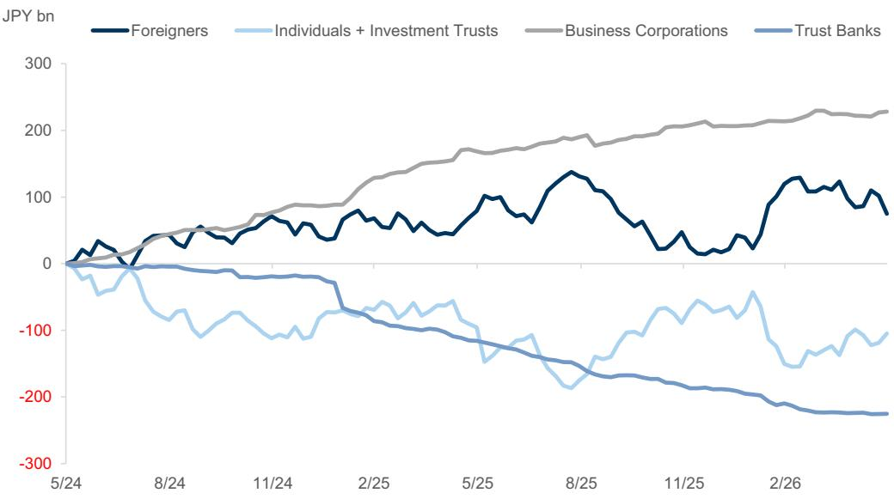
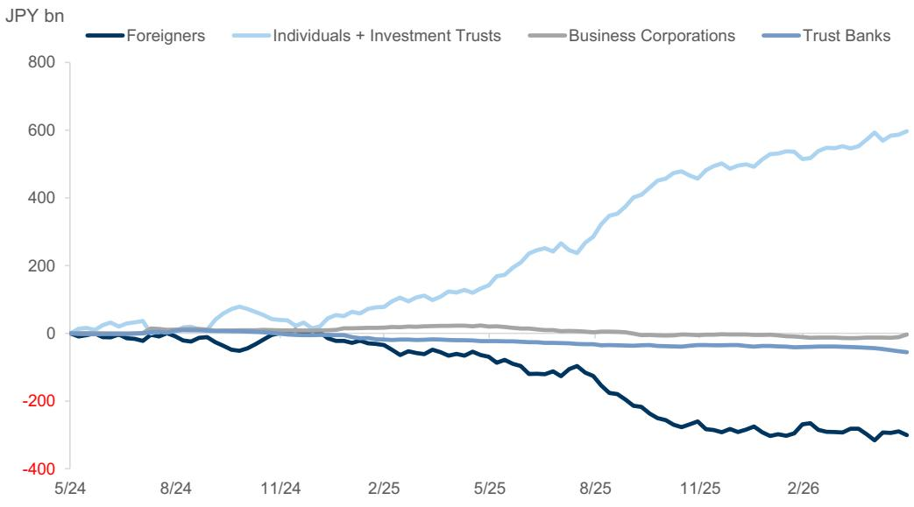
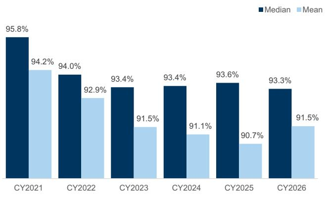
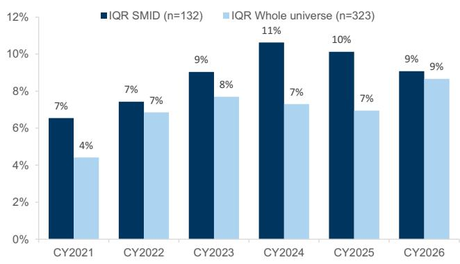
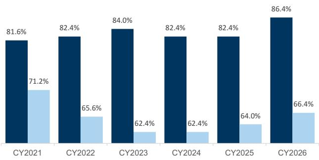
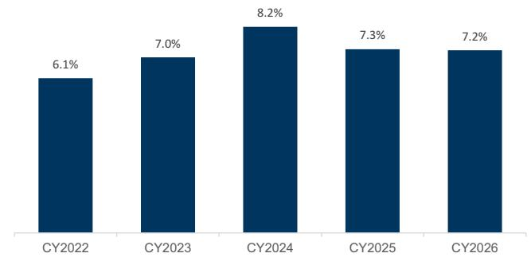

# Japan SMID Monitor: CY2026 AGM season takeaways

In this month's edition of the Japan SMID Monitor, we focus on the 2026 AGM season trends within Japan SMID universe versus the larger cap space. One observation is that Japan SMID companies currently appear to face slightly more shareholder attention versus their larger cap peers. Just over 15% of Japan SMIDs have CEO approval ratings below 80% (Exhibit 7), compared with less than 10% for companies with 6M ADTV over US$20mn. However, in terms of overall average approval rating changes over time (Exhibit 5) and inter-quartile ranges (Exhibit 6), there appears to be very little difference between the two data-sets. Historically, CEO approval IQRs were significantly higher with Japan SMID stocks (Exhibit 6), but this difference largely narrowed in CY2026. After peaking in CY2024 at over 11% (versus just 7% for the more liquid universe), the SMID CEO approval IQR decreased 2ppts to 9% by CY2026, while the more liquid universe's CEO Approval IQR has increased 2ppts to the same 9% level.

Tech Hardware, Industrials and Inbound Tourism showed stronger performance compared to IT Services in GS Japan coverage universe: The SMID names with notable June performance covered by GS Japan analysts included Taiyo Yuden (+37% mom), Japan Material (+25% mom), Kyoritsu Maintenance (+21% mom) and Kotobuki Spirits (+19% mom). The two names with relatively lower performance were ANYCOLOR (-22% mom), and Cover Corp (-14%).

Japan SMID thematic and sub-sector index data showed that Financials led in June while Software lagged: The indices with relatively stronger performance last month were Regional Banks (+17% mom) and Banks (+11% mom), while those with relatively lower performance included SAAS (-13% mom) and Software (-9% mom).

GS Japan SMID team shared observations on the Japan Shipbuilding sector: GS Japan SMID analyst Norihiro Miyazaki published a sector update on the Japan Shipbuilding sector (LINK). Japan's May 2026 order backlog was 29.3mn GT (vessel demand for the next 3-4 years), and media reports also suggest that the US Navy may start to procure ships from US and South Korean shipyards. If confirmed, this would be a notable development for this sector in Japan.

■ Individual investors showed net buying in TSE Growth and TSE Standard, while foreign investors showed net selling in both: As can be seen in Exhibit 1 and Exhibit 2 below, for the month of June, individual investors recorded net buying of ¥11.4bn and ¥84.3bn of Standard cash equities and Growth cash, while foreign investors recorded net selling of -¥13.9bn and -¥63.4bn, respectively.

Bruce Kirk, CFA
+81(3)4587-9950 | bruce.kirk@gs.com
GS Japan Co., Ltd.

Julius Chan
+81(3)4587-1789 | julius.chan@gs.com
GS Japan Co., Ltd.

Exhibit 1: TSE Standard net buying 2-year chart as of Jun 26 2026, JPY bn  
  
Source: Bloomberg, Tokyo Stock Exchange

Exhibit 2: TSE Growth net buying
2-year chart as of Jun 26 2026, JPY bn  
  
Source: Bloomberg, Tokyo Stock Exchange

## GS Covered Japan SMID Stocks

Exhibit 3: GS covered SMID stocks ranked by monthly performance
Data as of Jun 30 2026

<table><tr><td>Ticker</td><td>Name</td><td>Analyst</td><td>1W</td><td>2W</td><td>1M</td><td>3M</td><td>6M</td><td>YTD</td></tr><tr><td>6976</td><td>Taiyo Yuden</td><td>Daiki Takayama</td><td>19%</td><td>0%</td><td>36%</td><td>398%</td><td>469%</td><td>469%</td></tr><tr><td>6055</td><td>Japan Material</td><td>Takeru Adachi</td><td>1%</td><td>7%</td><td>25%</td><td>55%</td><td>66%</td><td>66%</td></tr><tr><td>9616</td><td>Kyoritsu Maintenance</td><td>Norihiro Miyazaki</td><td>5%</td><td>11%</td><td>21%</td><td>21%</td><td>8%</td><td>8%</td></tr><tr><td>2222</td><td>Kotobuki Spirits Co.</td><td>Norihiro Miyazaki</td><td>7%</td><td>9%</td><td>19%</td><td>32%</td><td>36%</td><td>36%</td></tr><tr><td>6622</td><td>Daihen</td><td>Ryo Harada</td><td>-3%</td><td>11%</td><td>14%</td><td>46%</td><td>81%</td><td>81%</td></tr><tr><td>6407</td><td>CKD</td><td>Yuichiro Isayama</td><td>-2%</td><td>0%</td><td>14%</td><td>58%</td><td>144%</td><td>144%</td></tr><tr><td>6103</td><td>Okuma</td><td>Yuichiro Isayama</td><td>4%</td><td>4%</td><td>13%</td><td>24%</td><td>27%</td><td>27%</td></tr><tr><td>6728</td><td>Ulvac</td><td>Shuhei Nakamura</td><td>4%</td><td>15%</td><td>9%</td><td>18%</td><td>46%</td><td>46%</td></tr><tr><td>4205</td><td>Zeon</td><td>Atsushi Ikeda</td><td>2%</td><td>1%</td><td>8%</td><td>31%</td><td>32%</td><td>32%</td></tr><tr><td>6254</td><td>NOM Micro Science</td><td>Takeru Adachi</td><td>-2%</td><td>7%</td><td>7%</td><td>49%</td><td>65%</td><td>65%</td></tr><tr><td>7988</td><td>Nifco Inc.</td><td>Kota Yuzawa</td><td>4%</td><td>8%</td><td>7%</td><td>7%</td><td>0%</td><td>0%</td></tr><tr><td>4912</td><td>Lion</td><td>Takashi Miyazaki</td><td>4%</td><td>2%</td><td>6%</td><td>0%</td><td>4%</td><td>4%</td></tr><tr><td>7721</td><td>Tokyo Keiki</td><td>Norihiro Miyazaki</td><td>0%</td><td>18%</td><td>5%</td><td>-5%</td><td>16%</td><td>16%</td></tr><tr><td>6951</td><td>JEOL</td><td>Shuhei Nakamura</td><td>7%</td><td>12%</td><td>5%</td><td>22%</td><td>48%</td><td>48%</td></tr><tr><td>9706</td><td>Japan Airport Terminal</td><td>Norihiro Miyazaki</td><td>7%</td><td>5%</td><td>4%</td><td>-7%</td><td>15%</td><td>15%</td></tr><tr><td>6432</td><td>Takeuchi MFG</td><td>Takeru Adachi</td><td>-4%</td><td>-4%</td><td>4%</td><td>9%</td><td>5%</td><td>5%</td></tr><tr><td>3774</td><td>Internet Initiative Japan</td><td>Chikai Tanaka, CFA</td><td>5%</td><td>8%</td><td>3%</td><td>28%</td><td>16%</td><td>16%</td></tr><tr><td>4202</td><td>Daicel</td><td>Atsushi Ikeda</td><td>6%</td><td>3%</td><td>3%</td><td>9%</td><td>-2%</td><td>-2%</td></tr><tr><td>2229</td><td>Calbee Inc</td><td>Takashi Miyazaki</td><td>5%</td><td>5%</td><td>2%</td><td>-5%</td><td>-1%</td><td>-1%</td></tr><tr><td>8304</td><td>Aozora Bank</td><td>Makoto Kuroda</td><td>-1%</td><td>-1%</td><td>2%</td><td>3%</td><td>8%</td><td>8%</td></tr><tr><td>7581</td><td>Saizeriya</td><td>Sho Kawano</td><td>4%</td><td>3%</td><td>1%</td><td>-18%</td><td>-1%</td><td>-1%</td></tr><tr><td>4483</td><td>JMDC</td><td>Akinori Ueda, Ph.D.</td><td>6%</td><td>4%</td><td>1%</td><td>-16%</td><td>-28%</td><td>-28%</td></tr><tr><td>6592</td><td>Mabuchi Motor</td><td>Daiki Takayama</td><td>-1%</td><td>-1%</td><td>1%</td><td>-3%</td><td>9%</td><td>9%</td></tr><tr><td>3994</td><td>Money Forward</td><td>Chikai Tanaka, CFA</td><td>8%</td><td>13%</td><td>1%</td><td>21%</td><td>-6%</td><td>-6%</td></tr><tr><td>6324</td><td>Harmonic Drive Systems</td><td>Yuichiro Isayama</td><td>1%</td><td>11%</td><td>0%</td><td>113%</td><td>106%</td><td>106%</td></tr><tr><td>4194</td><td>Visional</td><td>Norihiro Miyazaki</td><td>9%</td><td>8%</td><td>-1%</td><td>6%</td><td>-22%</td><td>-22%</td></tr><tr><td>6674</td><td>GS Yuasa Corp.</td><td>Kota Yuzawa</td><td>-9%</td><td>-2%</td><td>-1%</td><td>14%</td><td>72%</td><td>72%</td></tr><tr><td>8570</td><td>Aeon Financial Service Co.</td><td>Makoto Kuroda</td><td>2%</td><td>-2%</td><td>-3%</td><td>-8%</td><td>-16%</td><td>-16%</td></tr><tr><td>6508</td><td>Meidensha</td><td>Ryo Harada</td><td>-6%</td><td>4%</td><td>-3%</td><td>20%</td><td>75%</td><td>75%</td></tr><tr><td>4061</td><td>Denka</td><td>Atsushi Ikeda</td><td>-1%</td><td>3%</td><td>-3%</td><td>15%</td><td>58%</td><td>58%</td></tr><tr><td>6754</td><td>Anritsu</td><td>Ryo Harada</td><td>-2%</td><td>7%</td><td>-3%</td><td>47%</td><td>96%</td><td>96%</td></tr><tr><td>4587</td><td>PeptiDream</td><td>Akinori Ueda, Ph.D.</td><td>9%</td><td>13%</td><td>-4%</td><td>-15%</td><td>-36%</td><td>-36%</td></tr><tr><td>3697</td><td>SHIFT</td><td>Chikai Tanaka, CFA</td><td>10%</td><td>6%</td><td>-4%</td><td>-1%</td><td>-31%</td><td>-31%</td></tr><tr><td>7383</td><td>Net Protections Holdings</td><td>Makoto Kuroda</td><td>-1%</td><td>-1%</td><td>-4%</td><td>-12%</td><td>-35%</td><td>-35%</td></tr><tr><td>7014</td><td>Namura Shipbuilding Co.</td><td>Norihiro Miyazaki</td><td>-4%</td><td>-6%</td><td>-5%</td><td>-20%</td><td>0%</td><td>0%</td></tr><tr><td>4478</td><td>freee K.K.</td><td>Chikai Tanaka, CFA</td><td>7%</td><td>5%</td><td>-5%</td><td>-4%</td><td>-34%</td><td>-34%</td></tr><tr><td>6770</td><td>Alps Alpine</td><td>Daiki Takayama</td><td>-4%</td><td>-3%</td><td>-6%</td><td>-8%</td><td>3%</td><td>3%</td></tr><tr><td>3923</td><td>Rakus Co.</td><td>Norihiro Miyazaki</td><td>7%</td><td>6%</td><td>-6%</td><td>21%</td><td>-9%</td><td>-9%</td></tr><tr><td>6966</td><td>Mitsui High-tec Inc.</td><td>Kota Yuzawa</td><td>-12%</td><td>-14%</td><td>-7%</td><td>57%</td><td>25%</td><td>25%</td></tr><tr><td>3116</td><td>Toyota Boshoku</td><td>Kota Yuzawa</td><td>0%</td><td>-5%</td><td>-7%</td><td>-14%</td><td>-15%</td><td>-15%</td></tr><tr><td>4443</td><td>Sansan Inc.</td><td>Norihiro Miyazaki</td><td>8%</td><td>6%</td><td>-8%</td><td>30%</td><td>-10%</td><td>-10%</td></tr><tr><td>4369</td><td>Tri Chemical Laboratories Inc</td><td>Atsushi Ikeda</td><td>-5%</td><td>-7%</td><td>-8%</td><td>25%</td><td>29%</td><td>29%</td></tr><tr><td>5805</td><td>SWCC</td><td>Ryo Harada</td><td>-6%</td><td>-2%</td><td>-9%</td><td>5%</td><td>30%</td><td>30%</td></tr><tr><td>4922</td><td>Kose Holdings</td><td>Takashi Miyazaki</td><td>0%</td><td>-3%</td><td>-10%</td><td>-17%</td><td>-4%</td><td>-4%</td></tr><tr><td>5253</td><td>Cover Corp.</td><td>Norihiro Miyazaki</td><td>14%</td><td>-3%</td><td>-14%</td><td>-1%</td><td>-9%</td><td>-9%</td></tr><tr><td>5032</td><td>ANYCOLOR</td><td>Norihiro Miyazaki</td><td>10%</td><td>-3%</td><td>-22%</td><td>-25%</td><td>-54%</td><td>-54%</td></tr></table>

Exhibit 4: GS covered SMID stocks by analyst, 1M performance and consensus valuations
Data as of Jun 30 2026

<table><tr><td>Ticker</td><td>Name</td><td>Analyst</td><td>1M price return</td><td>P/B</td><td>P/E NTM</td><td>ROE FY26E</td><td>DY FY26E</td></tr><tr><td>4483</td><td>JMDC</td><td>Akinori Ueda, Ph.D.</td><td>1%</td><td>2.3</td><td>21.9</td><td>8.6</td><td>0.7</td></tr><tr><td>4587</td><td>PeptiDream</td><td>Akinori Ueda, Ph.D.</td><td>-4%</td><td>2.7</td><td>9.0</td><td>30.4</td><td>0.0</td></tr><tr><td>4205</td><td>Zeon</td><td>Atsushi Ikeda</td><td>8%</td><td>1.2</td><td>13.3</td><td>9.5</td><td>3.3</td></tr><tr><td>4202</td><td>Daicel</td><td>Atsushi Ikeda</td><td>3%</td><td>1.0</td><td>9.9</td><td>8.7</td><td>4.9</td></tr><tr><td>4061</td><td>Denka</td><td>Atsushi Ikeda</td><td>-3%</td><td>1.2</td><td>19.6</td><td>6.9</td><td>2.3</td></tr><tr><td>4369</td><td>Tri Chemical Laboratories Inc.</td><td>Atsushi Ikeda</td><td>-8%</td><td>3.1</td><td>20.0</td><td>14.4</td><td>1.1</td></tr><tr><td>3774</td><td>Internet Initiative Japan</td><td>Chikai Tanaka, CFA</td><td>3%</td><td>3.6</td><td>20.5</td><td>16.3</td><td>1.4</td></tr><tr><td>3994</td><td>Money Forward</td><td>Chikai Tanaka, CFA</td><td>1%</td><td>5.8</td><td>102.2</td><td>2.7</td><td>0.0</td></tr><tr><td>3697</td><td>SHIFT</td><td>Chikai Tanaka, CFA</td><td>-4%</td><td>4.5</td><td>12.6</td><td>21.7</td><td>0.0</td></tr><tr><td>4478</td><td>freee K.K.</td><td>Chikai Tanaka, CFA</td><td>-5%</td><td>5.8</td><td>34.9</td><td>4.0</td><td>0.0</td></tr><tr><td>6976</td><td>Taiyo Yuden</td><td>Daiki Takayama</td><td>36%</td><td>7.3</td><td>80.7</td><td>7.7</td><td>0.5</td></tr><tr><td>6592</td><td>Mabuchi Motor</td><td>Daiki Takayama</td><td>1%</td><td>1.1</td><td>17.9</td><td>6.2</td><td>3.2</td></tr><tr><td>6770</td><td>Alps Alpine</td><td>Daiki Takayama</td><td>-6%</td><td>0.9</td><td>13.5</td><td>6.3</td><td>3.2</td></tr><tr><td>7988</td><td>Nifco Inc.</td><td>Kota Yuzawa</td><td>7%</td><td>1.5</td><td>11.7</td><td>12.1</td><td>2.5</td></tr><tr><td>6674</td><td>GS Yuasa Corp.</td><td>Kota Yuzawa</td><td>-1%</td><td>1.6</td><td>15.6</td><td>10.0</td><td>1.6</td></tr><tr><td>6966</td><td>Mitsui High-tec Inc.</td><td>Kota Yuzawa</td><td>-7%</td><td>1.5</td><td>16.2</td><td>10.0</td><td>2.0</td></tr><tr><td>3116</td><td>Toyota Boshoku</td><td>Kota Yuzawa</td><td>-7%</td><td>0.8</td><td>7.8</td><td>9.6</td><td>4.1</td></tr><tr><td>8304</td><td>Aozora Bank</td><td>Makoto Kuroda</td><td>2%</td><td>0.8</td><td>13.1</td><td>5.7</td><td>3.7</td></tr><tr><td>8570</td><td>Aeon Financial Service Co.</td><td>Makoto Kuroda</td><td>-3%</td><td>0.7</td><td>14.1</td><td>4.3</td><td>3.6</td></tr><tr><td>7383</td><td>Net Protections Holdings</td><td>Makoto Kuroda</td><td>-4%</td><td>1.6</td><td>14.8</td><td>9.9</td><td>0.0</td></tr><tr><td>9616</td><td>Kyoritsu Maintenance</td><td>Norihiro Miyazaki</td><td>21%</td><td>1.9</td><td>14.5</td><td>13.2</td><td>1.5</td></tr><tr><td>2222</td><td>Kotobuki Spirits Co.</td><td>Norihiro Miyazaki</td><td>19%</td><td>8.0</td><td>25.8</td><td>27.1</td><td>1.5</td></tr><tr><td>7721</td><td>Tokyo Keiki</td><td>Norihiro Miyazaki</td><td>5%</td><td>2.2</td><td>20.0</td><td>10.7</td><td>0.8</td></tr><tr><td>9706</td><td>Japan Airport Terminal</td><td>Norihiro Miyazaki</td><td>4%</td><td>2.2</td><td>18.1</td><td>11.9</td><td>1.9</td></tr><tr><td>4194</td><td>Visional</td><td>Norihiro Miyazaki</td><td>-1%</td><td>3.8</td><td>16.0</td><td>22.9</td><td>0.0</td></tr><tr><td>7014</td><td>Namura Shipbuilding Co.</td><td>Norihiro Miyazaki</td><td>-5%</td><td>1.8</td><td>10.3</td><td>16.2</td><td>1.7</td></tr><tr><td>3923</td><td>Rakus Co.</td><td>Norihiro Miyazaki</td><td>-6%</td><td>12.9</td><td>16.7</td><td>72.4</td><td>0.7</td></tr><tr><td>4443</td><td>Sansan Inc.</td><td>Norihiro Miyazaki</td><td>-8%</td><td>10.9</td><td>21.2</td><td>37.1</td><td>0.1</td></tr><tr><td>5253</td><td>Cover Corp.</td><td>Norihiro Miyazaki</td><td>-14%</td><td>4.5</td><td>12.7</td><td>31.2</td><td>0.0</td></tr><tr><td>5032</td><td>ANYCOLOR</td><td>Norihiro Miyazaki</td><td>-22%</td><td>5.0</td><td>8.2</td><td>51.1</td><td>3.7</td></tr><tr><td>6622</td><td>Daihen</td><td>Ryo Harada</td><td>14%</td><td>2.8</td><td>23.3</td><td>10.9</td><td>1.3</td></tr><tr><td>6508</td><td>Meidensha</td><td>Ryo Harada</td><td>-3%</td><td>2.5</td><td>20.1</td><td>12.1</td><td>1.6</td></tr><tr><td>6754</td><td>Anritsu</td><td>Ryo Harada</td><td>-3%</td><td>4.2</td><td>36.0</td><td>10.9</td><td>1.2</td></tr><tr><td>5805</td><td>SWCC</td><td>Ryo Harada</td><td>-9%</td><td>4.1</td><td>18.8</td><td>19.4</td><td>2.0</td></tr><tr><td>7581</td><td>Saizeriya</td><td>Sho Kawano</td><td>1%</td><td>2.1</td><td>18.8</td><td>10.3</td><td>0.6</td></tr><tr><td>6728</td><td>Ulvac</td><td>Shuhei Nakamura</td><td>9%</td><td>2.2</td><td>21.1</td><td>8.7</td><td>1.6</td></tr><tr><td>6951</td><td>JEOL</td><td>Shuhei Nakamura</td><td>5%</td><td>2.5</td><td>16.4</td><td>14.6</td><td>1.7</td></tr><tr><td>4912</td><td>Lion</td><td>Takashi Miyazaki</td><td>6%</td><td>1.5</td><td>18.3</td><td>7.8</td><td>2.0</td></tr><tr><td>2229</td><td>Calbee Inc</td><td>Takashi Miyazaki</td><td>2%</td><td>1.7</td><td>19.6</td><td>8.9</td><td>2.3</td></tr><tr><td>4922</td><td>Kose Holdings</td><td>Takashi Miyazaki</td><td>-10%</td><td>1.0</td><td>22.8</td><td>4.0</td><td>3.0</td></tr><tr><td>6055</td><td>Japan Material</td><td>Takeru Adachi</td><td>25%</td><td>4.2</td><td>22.8</td><td>17.3</td><td>1.2</td></tr><tr><td>6254</td><td>NOM Micro Science</td><td>Takeru Adachi</td><td>7%</td><td>4.8</td><td>19.7</td><td>25.2</td><td>1.6</td></tr><tr><td>6432</td><td>Takeuchi MFG</td><td>Takeru Adachi</td><td>4%</td><td>1.7</td><td>12.2</td><td>12.9</td><td>3.1</td></tr><tr><td>6407</td><td>CKD</td><td>Yuichiro Isayama</td><td>14%</td><td>3.3</td><td>26.0</td><td>11.5</td><td>1.4</td></tr><tr><td>6103</td><td>Okuma</td><td>Yuichiro Isayama</td><td>13%</td><td>1.1</td><td>17.2</td><td>6.3</td><td>2.2</td></tr><tr><td>6324</td><td>Harmonic Drive Systems</td><td>Yuichiro Isayama</td><td>0%</td><td>9.2</td><td>114.3</td><td>6.6</td><td>0.3</td></tr></table>

## CY2026 AGM CEO approval ratings in SMID space

Exhibit 5: Median / mean CEO approval ratings
Stocks with 6M ADTV > \$10mn, Mktcap JPY 50bn - 500bn

  
Source: Company Data, Data compiled by GS Global Investment Research  
Exhibit 7: Over 85% of SMID companies now have approval ratings over 80%
ADTV > \$10mn  
Exhibit 6: Disparity historically higher amongst SMIDs
SMID: ADTV > \$10mn, Mktcap JPY50-500bn. Whole universe: ADTV > \$20mn

  
Source: Company Data, Data compiled by GS Global Investment Research  
Exhibit 8: Volatility of yoy changes in SMID CEO approval ratings  
■ % of cos with CEO approval ratings > 80%    ■ > 90%

  
Source: Company Data, Data compiled by GS Global Investment Research  
■ Volatility of YoY changes in AGM CEO approval rating

  
Source: Company data, Data compiled by GS Global Investment Research

## Exhibit 9: Top 15 SMID companies by CEO approval rating yoy change

6M ADTV > \$10mn, Mktcap JPY 50bn - 500bn

<table><tr><td>Ticker</td><td>Name</td><td>CY2025</td><td>CY2026</td><td>YoY Change</td></tr><tr><td>2432</td><td>DENA CO LTD</td><td>72%</td><td>95%</td><td>23.1pp</td></tr><tr><td>5985</td><td>SUNCALL CORP</td><td>80%</td><td>99%</td><td>19.2pp</td></tr><tr><td>4902</td><td>KONICA MINOLTA INC</td><td>63%</td><td>81%</td><td>17.8pp</td></tr><tr><td>6055</td><td>JAPAN MATERIAL CO</td><td>77%</td><td>94%</td><td>16.6pp</td></tr><tr><td>3994</td><td>MONEY FORWARD INC</td><td>77%</td><td>89%</td><td>12.3pp</td></tr><tr><td>3350</td><td>METAPLANET INC</td><td>77%</td><td>89%</td><td>12.1pp</td></tr><tr><td>1662</td><td>JAPAN PETROLEUM EX</td><td>82%</td><td>93%</
