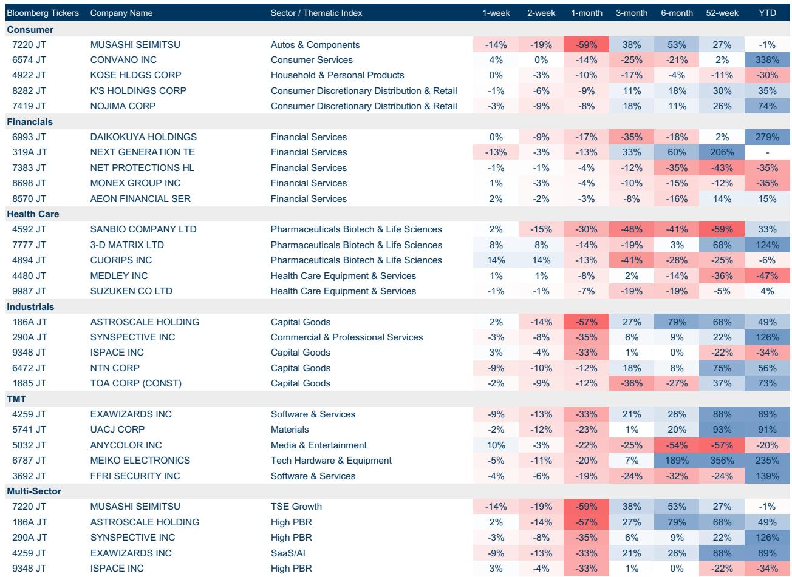
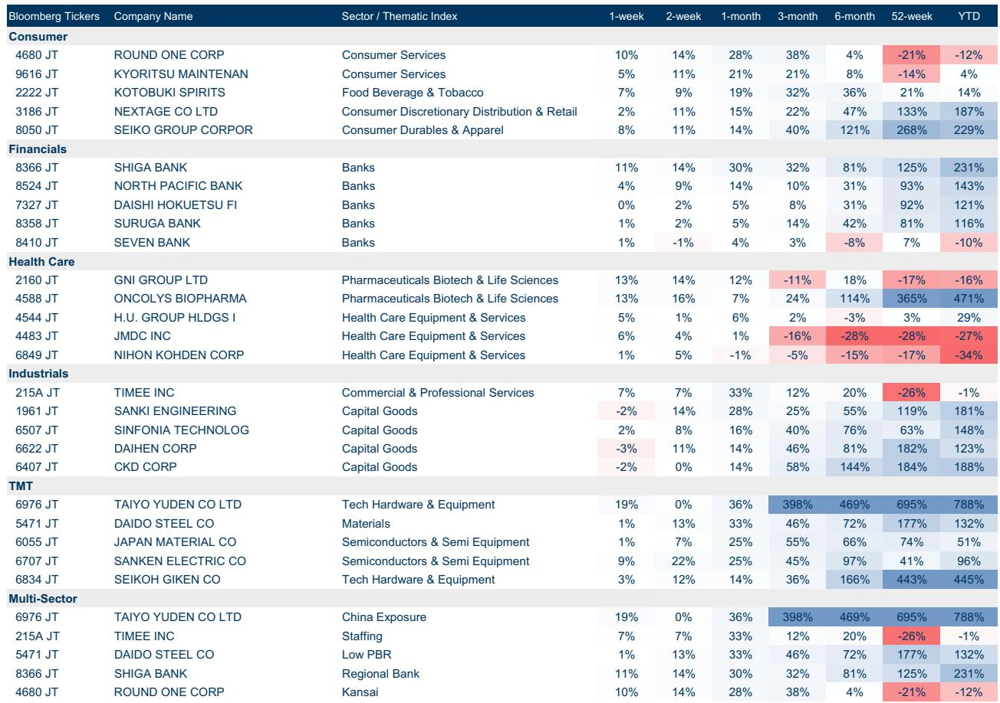
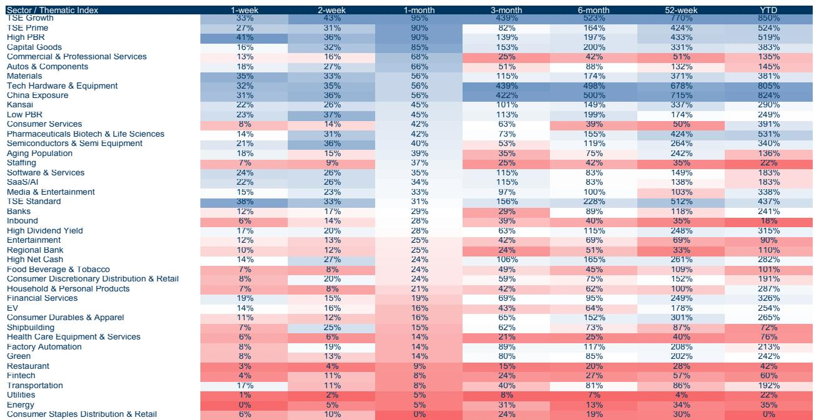

# GS：硬件与入境旅游跑赢软件，GS日本中小盘分化明显

日本中小盘公司（SMID）的股东会投票季传递出一个微妙信号：过去几年该群体承受的CEO批准率波动正在向大盘股靠拢。GS最新发布的日本SMID监测报告显示，2026年股东会季，中小盘与大盘股CEO批准率的四分位差已从2024年的明显分化收敛至同一水平——9%。这意味着，日本中小盘公司曾经“更容易因个别事件被股东惩罚”的特征正在消退，市场对管理层的评价标准正趋于统一。

这一变化的背后，是日本公司治理改革的持续渗透。2024年，中小盘CEO批准率的四分位差一度超过11%，而流动性更强的大盘股仅为7%。到2026年，两者已完全趋同。GS分析师Bruce Kirk和Julius Chan在报告中指出，目前仅有约15%的中小盘公司CEO批准率低于80%，而大盘股中这一比例不到10%。但整体均值和中位数的差异几乎可以忽略。

> **KC评论：** 股东不确定性收敛不等于不确定性消失。它意味着市场不再用“大小盘”来区分治理不确定性，而是用行业和具体公司行为来定价。对读者而言，过去那种“买大盘股更安全”的标签式判断需要重新校准。

## 1. 行业分化比市值分化更值得关注：硬件、工业和入境旅游跑赢IT服务

GS覆盖的日本SMID公司在6月表现出了鲜明的行业分化。Taiyo Yuden（+36%）、Japan Material（+25%）、Kyoritsu Maintenance（+21%）和Kotobuki Spirits（+19%）领涨，而ANYCOLOR（-22%）和Cover Corp（-14%）垫底。主题指数层面，区域银行（+17%）和银行（+11%）领跑，SAAS（-13%）和软件（-9%）垫底。

报告没有完全解释这种分化的原因，但结合其他信息可以推测：硬件和工业受益于全球半导体设备周期和日本国内研究需求，入境旅游则受益于日元贬值和游客回流。而软件和SAAS的疲软，可能与市场对日本IT服务公司盈利增长可持续性的质疑有关。

## 2. 造船板块的“美国催化剂”尚未完全定价

GS日本SMID分析师Norihiro Miyazaki在同期发布的造船行业更新中指出，截至2026年5月，日本造船订单积压量高达2930万总吨，相当于未来3-4年的工作量。更重要的是，媒体报道美国海军可能开始从美国和韩国船厂采购舰船。如果这一趋势确认，日本造船业将获得一个被市场低估的正面催化剂。

报告没有给出具体公司受益程度的量化分析，但逻辑链条清晰：美国海军采购转向日韩船厂，意味着原本由美国本土船厂承接的订单可能外溢，日本造船公司有望获得增量订单。当前市场对此的定价可能远低于实际潜力。

> **KC评论：** 造船板块的催化剂是地缘政治和产业政策叠加的结果，而非单纯的需求周期。读者需要跟踪美国国防采购政策的实际落地节奏，而不是提前押注。

## 3. 个人读者与外资的“对手盘”格局正在固化

6月资金流向数据揭示了一个值得关注的格局：个人读者净买入东证标准板114亿日元、东证成长板843亿日元，而外资则净卖出139亿日元和634亿日元。这并非短期现象——从两年期图表看，个人读者持续净买入中小盘，外资持续净卖出，两者形成了稳定的对手盘。

报告没有讨论这一格局的含义，但可以推断：个人读者主导的观点偏积极为中小盘提供了流动性底仓，但也意味着这些公司的定价更容易受到情绪和资金流的影响，而非基本面驱动。外资的持续流出则可能反映了对日本中小盘流动性和治理不确定性的担忧，但这种担忧正在被上述CEO批准率收敛的数据所消解。

## 报告尚未完全回答的关键问题：收敛是趋势还是短期现象？

CEO批准率的四分位差从2024年的11%降至2026年的9%，与大盘股持平。但报告没有给出这一收敛的驱动因素分析——是中小盘公司主动提升了治理水平，还是大盘股出现了治理退化？GS的数据显示，中小盘CEO批准率的年度波动性仍然高于大盘股，这意味着收敛的可持续性存疑。

另一个未解问题是：股东不确定性收敛后，中小盘公司的“治理溢价”是否会消失？如果市场不再因公司规模而给予不同的治理预期，那么中小盘公司可能需要通过更高的分红、更积极的回购或更清晰的战略沟通来吸引资金，而非仅仅依赖“小市值弹性”的叙事。

对关注日本市场的读者而言，这份报告的真正价值不在于给出交易建议，而在于提供了一个观察框架：当中小盘和大盘股的股东不确定性趋于一致时，选股逻辑应从“市值大小”转向“行业景气度+公司治理执行力”。造船、硬件、入境旅游等领域的公司，如果能同时满足治理达标和行业上行，可能获得双重溢价。而那些治理改善明显但行业承压的公司，则需要等待催化剂的出现。

For informational purposes only. Portions may be generated,translated,summarized,or edited with AI assistance based on source materials and may contain omissions or errors. Please verify independently. This is not investment,legal,tax,accounting,or other professional advice.

For informational purposes only. Portions may be generated,translated,summarized,or edited with AI assistance based on source materials and may contain omissions or errors. Please verify independently. This is not investment,legal,tax,accounting,or other professional advice.

