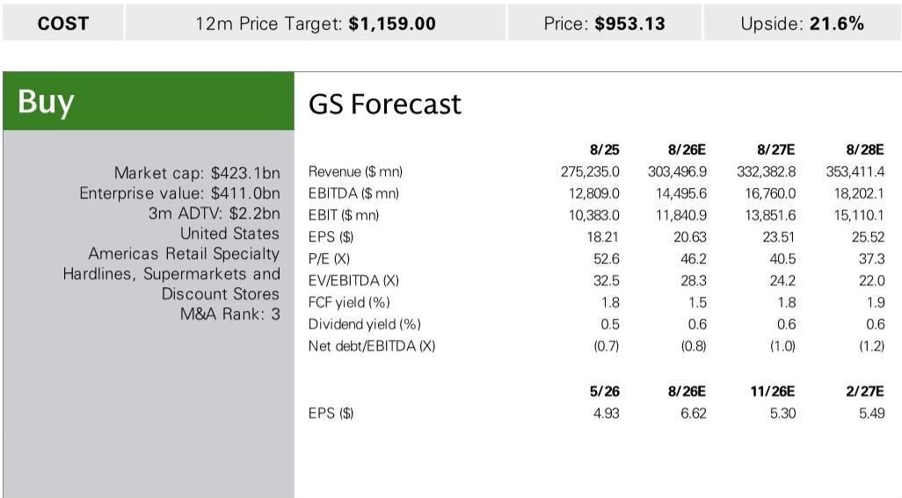
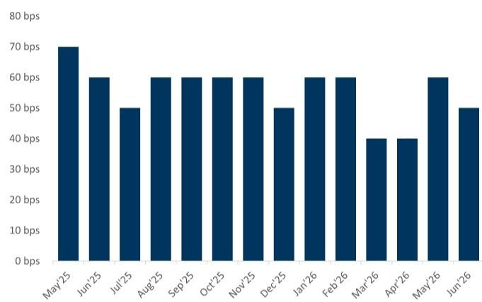
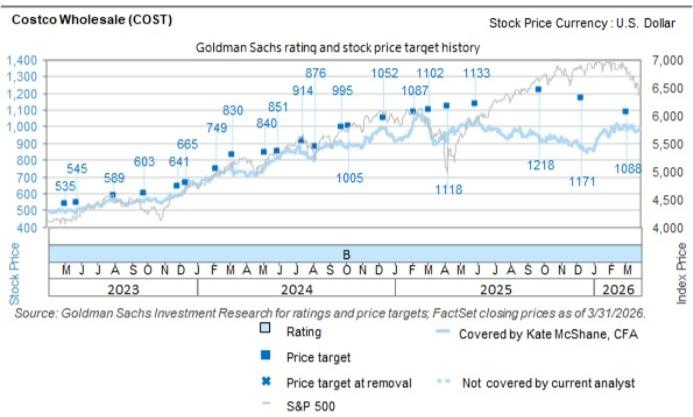

# Costco 6月销售数据观察：市场结构变化中的信号

从表面数据来看，Costco 6月全球同店销售增长7.0%，低于市场预期的7.3%，也较5月的8.0%有所回落。美国市场同样呈现类似趋势，从8.7%降至7.6%。管理层将约50个基点的缺口归因于新店开张带来的分流效应，并表示消费者行为和竞争格局未见明显变化。但在这些表层解释之下，一个更值得关注的故事正在展开：这家以增长著称的企业，正进入一个需要与自身成功共处的新阶段。

## 客流变化是最值得关注的数据点

全球客流增速从5月的3.9%降至6月的3.2%，美国市场也呈现相同趋势。这并非单月异常。自4月以来，全球客流增速从4.2%持续走弱。客单价增长虽然仍保持在3.7%的健康水平，但也从5月的4.0%有所回落。两者同时放缓的组合，暗示公司面临的并非简单的品类结构或定价问题，而是会员参与度的真实变化。

对于关注这家公司的朋友来说，关键问题是：这是周期性调整，还是结构性变化？答案将决定其当前约46倍远期报价的合理性。

## 分流效应真实存在，但背后是更深层的容量问题

管理层将6月销售缺口中的约50个基点归因于新店开张的分流。这是任何扩张期零售商都会遇到的情况。新店不可避免地会从现有门店吸引部分客流，尤其是在服务区域重叠时。公司每年新增约25至30家门店，鉴于新店的良好回报，这一节奏短期内不会放缓。

但分流解释虽然事实正确，却掩盖了一个更值得关注的现象：在最成熟的市场，优质选址资源正在减少。公司在加州Mission Viejo开设首家独立加油站就是一个信号。这不是为了获取新客群的战略创新，而是受限于一个简单事实：附近门店已无可用空间。管理层明确表示，未来独立加油站将仅根据选址限制按需开设，且旨在服务现有会员，而非吸引新会员。

这不是增长举措，而是权宜之计。当一家运营如此严谨的公司因空间限制被迫将加油站与门店分离时，说明其核心选址模式在关键市场正接近上限。这意味着新增门店将越来越多地出现在密度较低、客流较少的区域，虽然分流影响可能较小，但单店相对销售贡献也会降低。

值得关注的问题不是分流是否会持续，而是随着门店组合向低潜力区域倾斜，公司能否维持历史同店销售增长轨迹。6月的数据暗示答案可能是否定的。

## 客流放缓是会员增长的先行指标

Costco的商业模式建立在良性循环之上：会员费产生高利润收入，使公司能够提供有竞争力的价格，从而驱动客流，进而强化续费的价值主张。因此，客流增长不仅是销售指标，更是会员粘性的先行指标。

过去三个月全球和美国客流连续放缓，值得关注的是，这发生在消费支出相对稳健的时期。如果客流在稳定的宏观环境中走弱，当环境变化时会怎样？管理层表示6月未观察到消费者趋势的实质性变化，这表明放缓并非需求驱动。这留下两种可能：要么竞争环境正在以尚未在整体数据中显现的方式加剧，要么公司自身行为——如价格调整或产品组合变化——正在微妙地影响访问频率。

品类数据提供了一些线索。作为关键客流驱动力的生鲜食品，6月增长处于中个位数区间，较5月和4月的高个位数增长有所回落。食品和日用品也出现放缓。同时，包括药房和加油站在内的辅助业务，6月增长处于20%以上区间，较5月的30%以上增长明显回落。药房的增长得益于GLP-1药物和公司专业药房业务的推进，但这是一个驱动高交易额而非高访问频率的细分品类。

这一模式表明，作为会员访问门店主要原因的核心食品和家居品类，正在失去一些动力。如果这一趋势持续，历史上一直保持在90%以上的会员续费率可能面临压力。而由于会员收入是Costco盈利能力的主要驱动力，任何持续的客流疲软对利润的影响都不可忽视。

## 品类结构变化正在改变每笔交易的经济性

除了整体客流数据，门店内销售构成的变化也值得关注。非食品类——包括珠宝、家居用品和大家电——6月增长处于中高个位数区间，较5月的高个位数增长有所回落。珠宝，尤其是黄金，是表现突出的品类。值得注意的是，珠宝是高利润、可选的消费类别，往往波动较大，并非可靠的重复客流驱动因素。

家居用品和大家电的增长更令人鼓舞，因为这些品类通常意味着会员在进行更大规模的购物。然而，从5月的放缓表明，后疫情时代的家居改善周期可能正在消退。辅助业务增长处于20%以上区间，主要由药房、加油站和助听器驱动。药房受益于人口老龄化和GLP-1趋势的结构性利好，但加油站是低利润品类，增加收入的同时并不带来相应的利润增长。

总结来看，Costco在偶发性或低利润品类上表现强劲，而驱动重复访问的核心食品品类却在走弱。这不是危机，但这是收入质量的变化。如果这一趋势持续，公司可能需要更积极地投入定价或营销以维持客流，这将压缩利润空间。

## 报告未完全回答的问题：竞争回应与会员定价杠杆

报告提供了Costco 6月表现的详细快照，但留下了几个关键问题。首先，它没有涉及竞争对手如何应对Costco的选址限制。沃尔玛、塔吉特和BJ's批发俱乐部都在投资自身的全渠道能力和定价策略。如果Costco在高客流区域开设新店的能力减弱，竞争对手可能能够捕捉Costco无法服务的增量需求。

其次，报告没有提供关于会员费定价杠杆的清晰视角。Costco历史上每五到六年提高一次会员费，上一次调整在2024年。下一次调整可能还需数年，这意味着公司短期内无法使用这一杠杆来提升利润。没有费用上调，利润增长将需要来自同店销售增长和利润率扩张，而这两者都显示出压力迹象。

第三，报告没有量化独立加油站策略对整体盈利能力的影响。加油站能带来客流，但利润率微薄。如果公司因选址限制被迫开设更多独立加油站，增量资本支出可能产生低于传统门店-加油站组合的回报。

这些问题并非对报告的批评，而是凸显了任何单一数据点的局限性。想要全面了解Costco业务轨迹的朋友，需要超越月度数据，考虑正在重塑公司增长轮廓的结构性因素。

## 评估Costco未来表现的思考框架

对于试图判断Costco当前估值是否合理的朋友，6月销售数据提供了一个有用的框架。需要关注的关键变量不仅是月度数据，而是客流增长、客单价增长和新店效率之间的关系。

第一个变量是客流增长相对于历史平均水平。如果全球客流持续低于3.5%，表明会员价值主张正在减弱。第二个变量是美国与国际市场数据之间的差距。如果国际增长开始比美国增长更快放缓，表明公司在新市场的扩张面临阻力。第三个变量是分流率。如果连续多个季度保持在50个基点以上，表明公司在重叠服务区域开设了过多门店，这将压缩新店回报。

第四个变量是品类结构。值得关注的是，生鲜食品和食品日用品在总销售中的占比是否相对于非食品和辅助品类在下降。从高频品类持续转向低频品类，将是客流可持续性的负面信号。

第五个变量是会员续费率。这是对商业模式的最终验证。如果续费率在客流放缓的情况下仍保持在90%以上，表明会员即使访问频率降低，忠诚度依然存在。如果续费率开始下滑，整个研究逻辑将面临质疑。

运用这一框架，6月数据是一个黄色警示，而非红色警报。客流在放缓但仍为正值。分流影响可控。续费率尚未受到威胁。但趋势方向值得关注，在假设历史增长轨迹将恢复之前，需要看到企稳的证据。

## 社区讨论：Costco增长故事的下一步

Costco仍然是全球管理最出色的零售商之一，其商业模式能够产生稳定的现金流和高资本回报。6月销售数据并未改变这一点。但它确实提出了一个合理的问题：公司是否已到达增长速率结构性放缓的阶段？如果是，那么为这种放缓增长支付多少倍报价是合理的？

答案取决于客流放缓是暂时性的还是永久性的。如果是暂时性的，由新店开张的阶段性影响和正常的季度波动驱动，那么当前估值是合理的。如果是永久性的，由选址限制和市场成熟度驱动，那么报价可能已反映了不会实现的完美预期。

完整报告包含月度数据趋势、分流影响和品类表现的详细图表，提供了做出这一判断所需的数据。

*仅供参考。部分内容可能基于原始材料通过AI辅助生成、翻译、总结或编辑，可能存在遗漏或错误。请独立核实。这不构成任何专业建议。*
