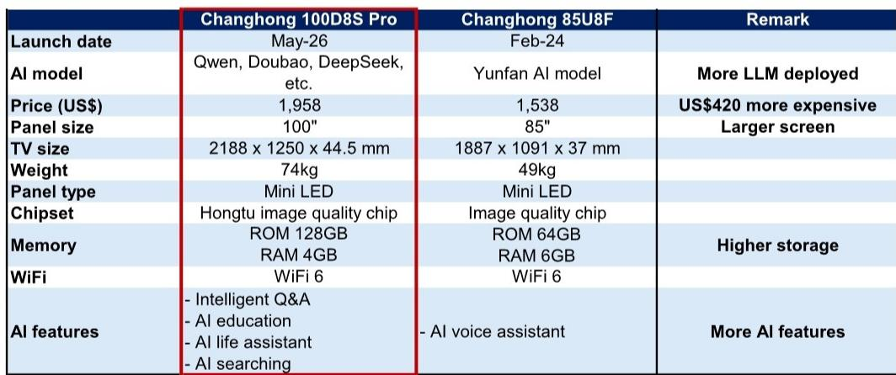
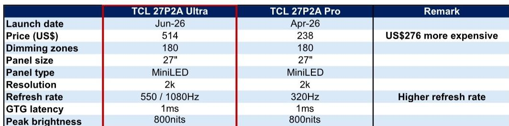
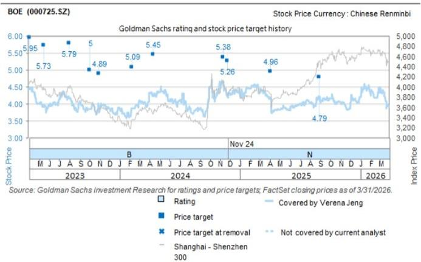

# LCD Panel Prices Are No Longer Just Cyclical:The Structural Shift That Changes How Investors Should Think About Display Stocks

The LCD TV panel market has long been dismissed as a hopelessly cyclical commodity business,where price swings are driven by capacity additions and demand shocks,and where no supplier can escape the gravity of oversupply. That narrative is becoming outdated. Through the first half of 2026,LCD TV panel prices have risen year-to-date across all major sizes,with 32-inch panels up 9 percent,43-inch up 5 percent,55-inch up 4 percent,and 65-inch up 5 percent from December 2025 levels. These are not dramatic moves,but they are significant precisely because they are happening at all. The industry has been operating in an environment of tepid global TV demand,ongoing geopolitical uncertainty,and lingering inventory concerns. That prices have risen nonetheless signals something deeper:the competitive dynamics of the panel industry are structurally improving.

The conventional explanation for this price recovery would point to temporary production cuts by Chinese panel makers. That explanation is incomplete. What the data suggests instead is a more fundamental shift in how leading suppliers are managing capacity. They are no longer chasing market share at any cost. They are adjusting utilization rates in response to demand signals with a discipline that was absent in prior cycles. This is not a cyclical upturn. It is the early evidence of an industry learning to behave like an oligopoly rather than a free-for-all. Investors who continue to treat display stocks as simple commodity plays risk missing the most important transformation in the sector in a decade.

The implications extend beyond LCD pricing. The same underlying forces that are stabilizing the panel business are also enabling innovation in adjacent product categories. New product launches in AI-integrated televisions,high-refresh-rate gaming monitors,and e-paper displays are not isolated product announcements. They are evidence that panel suppliers and device manufacturers are investing in differentiation,not just volume. This is the second-order effect of a healthier pricing environment:it creates room for value creation rather than value destruction.

## The Price Recovery Is Not a Reflex of Demand Strength,but a Signal of Supply Discipline

The most important analytical error an investor can make right now is to attribute the year-to-date price increases to a surge in end-market demand. Global TV shipments have not meaningfully accelerated. Consumer electronics spending remains constrained by macroeconomic uncertainty in key markets. What has changed is the supply side. Leading LCD panel manufacturers have demonstrated a willingness to reduce utilization rates when demand softens,rather than continuing to produce at full capacity and flooding the market with inventory.

This behavior represents a structural departure from the 2017-2021 period,when capacity expansion was relentless and price discipline was virtually nonexistent. During that era,Chinese panel makers in particular prioritized market share capture over profitability. The result was a prolonged downcycle that compressed margins across the entire value chain. The current price trajectory suggests that the industry has internalized the lessons of that period. Production cuts are being executed preemptively,not reactively. The consequence is that prices are holding up even when demand is merely stable rather than strong.

For investors,the "so what" is straightforward:if supply discipline persists,the earnings volatility that has historically made display stocks uninvestable for long-only portfolios may be moderating. Panel makers that can maintain pricing power through utilization management will generate more predictable cash flows. That changes the valuation framework. A stock that was previously valued on peak-cycle earnings is now more appropriately valued on normalized earnings. The multiple expansion potential is significant if the market re-rates the sector accordingly.

## AI Televisions and High-End Gaming Monitors Reveal a Shift from Volume Competition to Value Capture

The launch of Changhong's D8S Pro AI TV in May 2026 is a case study in how panel suppliers and OEMs are attempting to escape the commodity trap. The D8S Pro integrates multiple large language models,including Qwen,Doubao,and DeepSeek,into a 100-inch Mini LED display. It is priced at nearly $1,958,a $420 premium over the previous-generation 85U8F model,which offered a smaller screen and fewer AI features. The price premium is not trivial,and it is not driven solely by the larger panel size. It reflects the willingness of consumers to pay for integrated intelligence,not just display real estate.

Similarly,TCL's P2A Ultra gaming monitor,launched in June 2026,offers a flexible refresh rate that can switch between 550Hz and 1080Hz,combined with Mini LED backlighting and 1ms GTG latency. At $514,it is more than double the price of the standard P2A Pro model. The premium is justified by performance specifications that cater to a specific,high-value user segment:competitive gamers and content creators who demand the lowest latency and highest refresh rates available.

What these product launches have in common is that they are not about selling more panels. They are about selling better panels with higher average selling prices. The AI TV market,in particular,represents a potential inflection point. If consumers begin to associate display quality with AI capability,then panel differentiation becomes possible in a way that it has not been since the transition from LCD to OLED. Panel makers that can supply the high-end Mini LED panels required for these products will capture a disproportionate share of the value.

The strategic implication for investors is that the display supply chain is bifurcating. The low-end commodity segment will continue to face margin pressure. But the high-end segment,driven by AI integration,gaming performance,and professional applications,is becoming a growth market with attractive margins. Investors need to distinguish between panel suppliers that are stuck in the commodity trap and those that are positioned to participate in the premium migration.

## The E-Paper Display Opportunity Is Broader Than E-Readers,and It Is Being Underestimated

The launch of Insta360's Mic Pro,a wireless microphone featuring a 1.22-inch Spectra 6 six-color e-paper display,is a small product announcement with large implications. This is the first time a clip-on microphone has incorporated an e-paper screen. It allows users to customize logos,channel identifiers,and camera position numbers with a single click. The application is niche,but the pattern is not. E-paper displays are migrating from dedicated e-readers into a widening array of consumer and industrial devices.

The key advantage of e-paper is its ultra-low power consumption and sunlight readability. These properties make it ideal for devices where battery life and outdoor visibility are critical. The Insta360 microphone is one example. Smart labels,digital signage,electronic shelf labels,and wearable devices represent much larger addressable markets. As the technology improves,particularly with the introduction of color e-paper displays like Spectra 6,the range of viable applications expands.

For investors,the e-paper opportunity is often overlooked because the market is still small relative to LCD and OLED. But the growth trajectory is compelling. The supply chain is concentrated,with E Ink being the dominant supplier of e-paper display technology. If the adoption of e-paper in non-reader devices accelerates,the revenue and earnings impact for the key supplier could be substantial. The Insta360 launch is a data point,not a trend,but it is a data point that deserves attention. The open question is whether the addressable market for e-paper in new device categories is 10 million units or 100 million units. The difference in valuation terms is enormous.

## What the Report Does Not Fully Answer:The Sustainability of Supply Discipline Under Demand Stress

The most important unresolved question in the current analysis is whether the supply discipline that has supported LCD panel prices in the first half of 2026 will 报告观点if global demand deteriorates. The year-to-date price increases have occurred in an environment that is neither boom nor bust. If a significant demand shock materializes,whether from a recession,trade disruption,or inventory correction,panel makers will face a difficult choice. They can cut production further to defend prices,sacrificing volume and market share. Or they can revert to the old behavior of running factories at high utilization to spread fixed costs,accepting lower prices.

The historical evidence favors the latter outcome. Panel makers have repeatedly promised discipline and repeatedly broken that promise when the pressure became intense. The current cycle may be different because the industry is more concentrated than it was five years ago. Fewer players means coordination is easier. But coordination is not the same as cooperation,and the temptation to cheat on production cuts is always present.

Investors should watch utilization rate announcements closely in the second half of 2026. If leading suppliers maintain disciplined production even as order books thin,that will be the strongest evidence yet that the industry has genuinely changed. If utilization rates rise in response to weak demand,the price recovery will prove temporary,and the structural improvement thesis will be invalidated. This is the key risk that the current report does not resolve,and it is the reason why investors should remain measured in their conviction.

## A Decision Framework for Display Supply Chain Investors

For investors looking to act on the insights in this analysis,a structured framework is more useful than a directional view. The display supply chain is not monolithic,and different segments offer different risk-return profiles. The following framework can help investors allocate attention and capital.

First,assess the degree of supply discipline. Track quarterly utilization rates for the top three LCD panel manufacturers by capacity. If utilization rates remain below 85 percent in a stable demand environment,that is consistent with discipline. If they rise above 90 percent without corresponding demand growth,that signals a return to volume-maximizing behavior.

Second,identify which suppliers are investing in premium panel technologies. Mini LED backlighting,high refresh rate capability,and AI integration features are not equally distributed. Suppliers that are investing in these capabilities are positioning for higher ASPs and better margins. Suppliers that are not investing are likely to remain in the commodity segment.

Third,evaluate the e-paper opportunity separately from the LCD and OLED markets. The growth drivers are different,the competitive dynamics are different,and the valuation frameworks are different. E Ink,as the dominant supplier,is a concentrated bet on e-paper adoption. Investors should monitor the number of new device launches incorporating e-paper displays as a leading indicator.

Fourth,consider the macro hedge. Display stocks have historically been highly cyclical. If the supply discipline thesis is correct,their cyclicality should moderate. But that moderation is not guaranteed. Investors should size their positions accordingly,with an understanding that a demand shock could still produce significant downside.

## Why This Analysis Matters Now,and What You Are Missing Without the Full Report

The display industry is at a rare inflection point. After years of value destruction driven by overcapacity and price competition,the conditions for a structural improvement in profitability are emerging. The price data from the first half of 2026 provides the first hard evidence that something has changed. But the data alone is not enough. The full report contains the detailed pricing charts,product specifications,and competitive analysis that allow investors to distinguish between signal and noise. It includes the historical context that shows just how unusual the current pricing behavior is relative to prior cycles. And it identifies the specific companies and product categories that are most likely to benefit from the shift.

The charts that accompany the full report are not decorative. They show the exact trajectory of panel prices since the 2021 peak,the specification differences between successive product generations,and the pricing premiums that consumers are paying for AI and gaming features. Without this visual data,the argument remains abstract. With it,the argument becomes actionable.

Join the community to read the full report and review the original charts. The questions that remain unanswered about the sustainability of supply discipline,the pace of e-paper adoption,and the competitive positioning of individual suppliers are best addressed with the complete analysis in hand. The display industry is changing. The question is whether you are positioned for that change or caught off guard by it.

*For informational purposes only. Portions may be generated,translated,summarized,or edited with AI assistance based on source materials and may contain omissions or errors. Please verify independently. This is not investment,legal,tax,accounting,or other professional advice.*

For informational purposes only. Portions may be generated,translated,summarized,or edited with AI assistance based on source materials and may contain omissions or errors. Please verify independently. This is not investment,legal,tax,accounting,or other professional advice.
