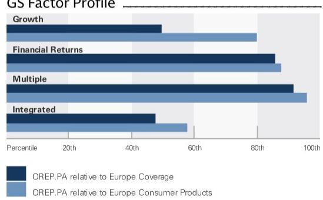
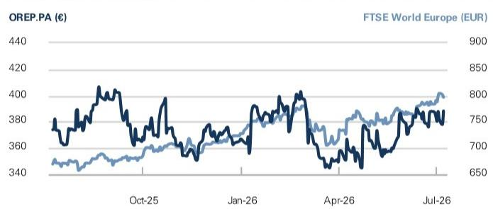
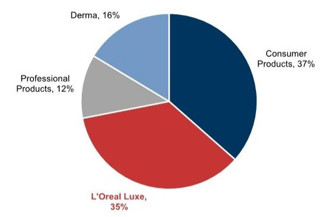
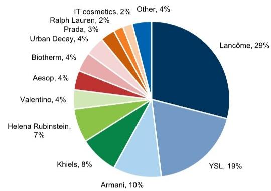
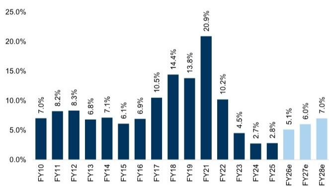
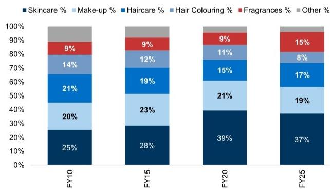
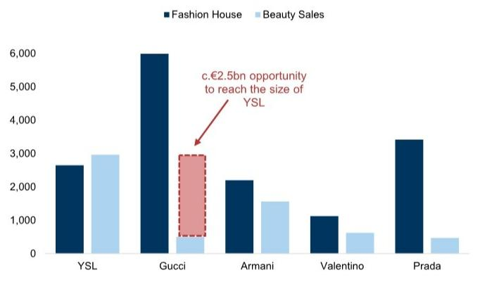
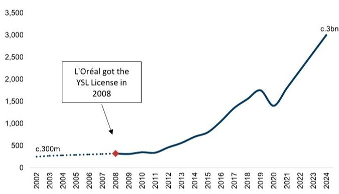
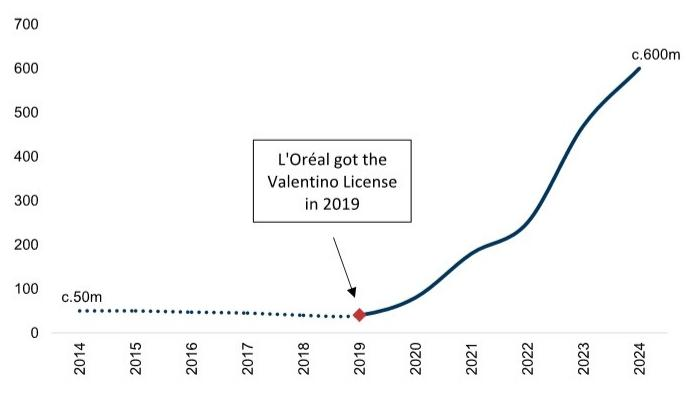
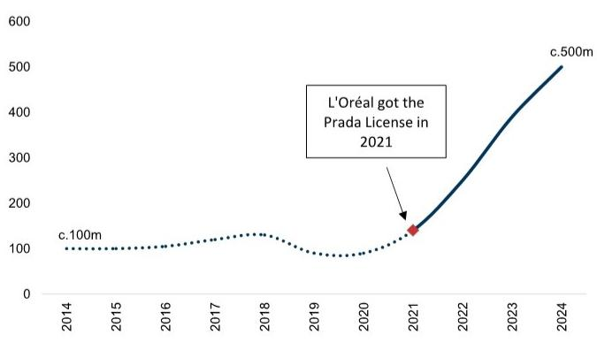

# L'Oreal (OREP.PA)

Gucci Beauty, L'Oréal's next billionaire brand?

What's New? Gucci and Coty have agreed to bring forward the redemption date of their licence agreement to July 1st 2027 from July 1st 2028 previously. Coty (covered by Bonnie Herzog) will receive a c\$400m early redemption consideration, with \$250m paid in 2026, and up to \$150m in 2027. L'Oréal will bear c.70% of the early redemption cost alongside an additional undisclosed amount for selected inventories. Under the L'Oréal and Kering Beauté deal which closed on March 31st 2026, L'Oréal acquired House of Creed, alongside 50-year licences for Bottega Veneta and Balenciaga with Gucci from 2028. The new agreement is subject to customary regulatory approvals.

What potential does Gucci have? We look to L'Oréal's strong track record of growing Couture brands including Yves Saint Laurent, Prada and Valentino. YSL is the most notable example, with L'Oréal growing sales from €300m to >€3bn since 2008, and the brand reaching c€1bn after 9 years. YSL beauty is now larger than the fashion house, and other brands including Armani have also achieved significant scale relative to their fashion businesses. We estimate that Gucci generates c€500m in sales, with L'Oréal Luxe's president highlighting that they are set to build a multi-billion-euro house with Gucci based on the group's strong track record.

What impact could this have on our estimates? On a pro-forma basis, the early redemption would drive a c0.5% uplift to our FY27 estimates, excluding any impact from inventory purchases. Given L'Oréal's strong balance sheet (0.7x Net Debt/EBITDA FY26 GSe), we do not view the additional c\$280m (€245m) payment, or the inventory purchases, as a concern. In our view, the Gucci licence was the main rationale for the Kering deal, and it could add c.50bps to L'Oréal organic sales growth in the coming years, helping the group reach 6% organic sales growth in the mid-term, all else equal. L'Oreal will report Q2 results on 29 July (here) where we expect 5.8% underlying organic sales growth, slightly ahead of consensus.

Olivier Nicolaï  
+44(20)7774-2895 | olivier.nicolai@gs.com  
GS International

Aron Adamski  
+44(20)7774-6224 | aron.adamski@gs.com  
GS International

Rebecca Ayo-Adebanjo  
+44(20)7552-2213 | rebecca.ayo-adebanjo@gs.com  
GS International

<table><tr><td colspan="5">GS Forecast</td></tr><tr><td></td><td>12/25</td><td>12/26E</td><td>12/27E</td><td>12/28E</td></tr><tr><td>Revenue (€ mn)</td><td>44,051.9</td><td>47,197.1</td><td>49,698.3</td><td>52,902.2</td></tr><tr><td>EBIT (€ mn)</td><td>8,892.0</td><td>9,626.0</td><td>10,282.1</td><td>11,090.0</td></tr><tr><td>EPS (€)</td><td>12.71</td><td>13.97</td><td>15.14</td><td>16.58</td></tr><tr><td>P/E (X)</td><td>28.9</td><td>27.8</td><td>25.7</td><td>23.4</td></tr><tr><td>EV/EBITDA (ex lease,X)</td><td>18.3</td><td>18.4</td><td>17.0</td><td>15.5</td></tr><tr><td>Dividend yield (%)</td><td>2.0</td><td>1.9</td><td>2.0</td><td>2.0</td></tr><tr><td>FCF yield (%)</td><td>3.4</td><td>3.1</td><td>3.6</td><td>4.0</td></tr><tr><td>CROCI (%)</td><td>34.8</td><td>35.0</td><td>36.9</td><td>39.6</td></tr><tr><td>N debt/EBITDA (ex lease,X)</td><td>0.0</td><td>0.5</td><td>0.3</td><td>(0.0)</td></tr><tr><td></td><td>6/25</td><td>12/25</td><td>6/26E</td><td>12/26E</td></tr><tr><td>EPS (€)</td><td>7.07</td><td>5.65</td><td>7.63</td><td>6.34</td></tr></table>

GS Factor Profile

  
Source: Company data, GS estimates. See disclosures for details.

## L'Oreal (OREP.PA)

BUY

Rating since Sep 29, 2020

Ratios & Valuation

<table><tr><td></td><td>12/25</td><td>12/26E</td><td>12/27E</td><td>12/28E</td></tr><tr><td>EV/sales (X)</td><td>4.5</td><td>4.6</td><td>4.3</td><td>3.9</td></tr><tr><td>EV/EBITDAR (X)</td><td>18.5</td><td>18.6</td><td>17.2</td><td>15.6</td></tr><tr><td>EV/EBITDA (excl. leases) (X)</td><td>18.3</td><td>18.4</td><td>17.0</td><td>15.5</td></tr><tr><td>EV/EBIT (X)</td><td>22.3</td><td>22.3</td><td>20.6</td><td>18.7</td></tr><tr><td>P/E (X)</td><td>28.9</td><td>27.8</td><td>25.7</td><td>23.4</td></tr><tr><td>Dividend yield (%)</td><td>2.0</td><td>1.9</td><td>2.0</td><td>2.0</td></tr><tr><td>EV/GCI (X)</td><td>7.8</td><td>8.3</td><td>8.2</td><td>8.0</td></tr><tr><td>CROCI (%)</td><td>34.8</td><td>35.0</td><td>36.9</td><td>39.6</td></tr><tr><td>ROIC (%)</td><td>27.8</td><td>28.8</td><td>30.7</td><td>33.3</td></tr><tr><td>ROA (%)</td><td>11.8</td><td>11.7</td><td>11.7</td><td>11.9</td></tr><tr><td>Days inventory outst, sales</td><td>38.0</td><td>36.5</td><td>36.8</td><td>36.3</td></tr><tr><td>Asset turnover (X)</td><td>7.4</td><td>8.1</td><td>8.7</td><td>9.5</td></tr><tr><td>Capex/D&amp;A (%)</td><td>82.3</td><td>94.5</td><td>94.5</td><td>94.5</td></tr><tr><td>Net debt/equity (excl. leases) (%)</td><td>0.7</td><td>16.7</td><td>8.1</td><td>(0.5)</td></tr><tr><td>EBIT interest cover (X)</td><td>234.0</td><td>22.8</td><td>23.0</td><td>24.8</td></tr><tr><td>FCF cover of dividends (X)</td><td>1.7</td><td>1.6</td><td>1.8</td><td>1.9</td></tr></table>

Growth & Margins (%)

<table><tr><td></td><td>12/25</td><td>12/26E</td><td>12/27E</td><td>12/28E</td></tr><tr><td>Total revenue growth</td><td>1.3</td><td>7.1</td><td>5.3</td><td>6.4</td></tr><tr><td>EBITDA growth</td><td>1.6</td><td>8.1</td><td>6.6</td><td>7.6</td></tr><tr><td>EBIT growth</td><td>2.4</td><td>8.3</td><td>6.8</td><td>7.9</td></tr><tr><td>Net inc. growth</td><td>(4.4)</td><td>13.8</td><td>8.7</td><td>10.1</td></tr><tr><td>EPS growth</td><td>0.4</td><td>9.9</td><td>8.3</td><td>9.6</td></tr><tr><td>DPS growth</td><td>2.9</td><td>2.8</td><td>2.7</td><td>3.5</td></tr></table>

Price Performance  

<table><tr><td></td><td>3m</td><td>6m</td><td>12m</td></tr><tr><td>Absolute</td><td>10.7%</td><td>9.1%</td><td>4.2%</td></tr><tr><td>Rel. to the FTSE World Europe (EUR)</td><td>0.9%</td><td>1.8%</td><td>(12.8)%</td></tr></table>

Source: FactSet. Price as of 7 Jul 2026 close.

<table><tr><td colspan="5">Balance Sheet (€ mn)</td></tr><tr><td></td><td>12/25</td><td>12/26E</td><td>12/27E</td><td>12/28E</td></tr><tr><td>Cash &amp; cash equivalents</td><td>9,865.1</td><td>5,612.6</td><td>8,575.0</td><td>12,083.0</td></tr><tr><td>Accounts receivable</td><td>5,500.3</td><td>6,041.2</td><td>6,262.0</td><td>6,559.9</td></tr><tr><td>Inventory</td><td>4,543.3</td><td>4,908.5</td><td>5,118.9</td><td>5,396.0</td></tr><tr><td>Other current assets</td><td>2,289.8</td><td>2,289.8</td><td>2,289.8</td><td>2,289.8</td></tr><tr><td>Total current assets</td><td>22,198.5</td><td>18,852.1</td><td>22,245.7</td><td>26,328.7</td></tr><tr><td>Net PP&amp;E</td><td>5,875.1</td><td>5,768.6</td><td>5,656.5</td><td>5,537.2</td></tr><tr><td>Net intangibles</td><td>19,541.7</td><td>19,541.7</td><td>19,541.7</td><td>19,541.7</td></tr><tr><td>Total investments</td><td>376.0</td><td>562.8</td><td>810.8</td><td>1,127.2</td></tr><tr><td>Other long-term assets</td><td>13,830.0</td><td>21,830.0</td><td>21,830.0</td><td>21,830.0</td></tr><tr><td>Total assets</td><td>61,821.3</td><td>66,555.3</td><td>70,084.7</td><td>74,364.7</td></tr><tr><td>Accounts payable</td><td>6,727.7</td><td>7,174.0</td><td>7,653.5</td><td>8,252.7</td></tr><tr><td>Short-term debt</td><td>2,048.9</td><td>2,048.9</td><td>2,048.9</td><td>2,048.9</td></tr><tr><td>Short-term lease liabilities</td><td>434.5</td><td>434.5</td><td>434.5</td><td>434.5</td></tr><tr><td>Other current liabilities</td><td>6,155.4</td><td>6,155.4</td><td>6,155.4</td><td>6,155.4</td></tr><tr><td>Total current liabilities</td><td>15,366.5</td><td>15,812.8</td><td>16,292.3</td><td>16,891.5</td></tr><tr><td>Long-term debt</td><td>8,069.7</td><td>9,819.7</td><td>9,819.7</td><td>9,819.7</td></tr><tr><td>Long-term lease liabilities</td><td>1,362.9</td><td>1,362.9</td><td>1,362.9</td><td>1,362.9</td></tr><tr><td>Other long-term liabilities</td><td>2,018.3</td><td>2,018.3</td><td>2,018.3</td><td>2,018.3</td></tr><tr><td>Total long-term liabilities</td><td>11,450.9</td><td>13,200.9</td><td>13,200.9</td><td>13,200.9</td></tr><tr><td>Total liabilities</td><td>26,817.4</td><td>29,013.7</td><td>29,493.2</td><td>30,092.4</td></tr><tr><td>Preferred shares</td><td>--</td><td>--</td><td>--</td><td>--</td></tr><tr><td>Total common equity</td><td>34,953.3</td><td>37,491.0</td><td>40,540.9</td><td>44,221.7</td></tr><tr><td>Minority interest</td><td>50.6</td><td>50.6</td><td>50.6</td><td>50.6</td></tr><tr><td>Total liabilities &amp; equity</td><td>61,821.3</td><td>66,555.3</td><td>70,084.7</td><td>74,364.7</td></tr><tr><td>Capital employed</td><td>45,122.5</td><td>49,410.2</td><td>52,460.1</td><td>56,140.9</td></tr><tr><td>Adj for unfunded pensions &amp; GW</td><td>-</td><td>-</td><td>-</td><td>-</td></tr></table>

<table><tr><td colspan="5">Cash Flow (€ mn)</td></tr><tr><td></td><td>12/25</td><td>12/26E</td><td>12/27E</td><td>12/28E</td></tr><tr><td>Net income</td><td>6,126.9</td><td>6,973.9</td><td>7,582.8</td><td>8,345.0</td></tr><tr><td>D&amp;A add-back</td><td>1,817.4</td><td>1,947.2</td><td>2,050.3</td><td>2,182.5</td></tr><tr><td>Minority interest add-back</td><td>6.5</td><td>8.3</td><td>8.3</td><td>8.3</td></tr><tr><td>Net (inc)/dec working capital</td><td>327.4</td><td>(459.9)</td><td>48.4</td><td>24.2</td></tr><tr><td>Other operating cash flow</td><td>378.4</td><td>(186.8)</td><td>(248.0)</td><td>(316.4)</td></tr><tr><td>Cash flow from operations</td><td>8,656.6</td><td>8,282.7</td><td>9,441.8</td><td>10,243.7</td></tr><tr><td>Capital expenditures</td><td>(1,495.3)</td><td>(1,840.7)</td><td>(1,938.2)</td><td>(2,063.2)</td></tr><tr><td>Acquisitions</td><td>-</td><td>-</td><td>-</td><td>-</td></tr><tr><td>Divestitures</td><td>5.7</td><td>-</td><td>-</td><td>-</td></tr><tr><td>Others</td><td>82.4</td><td>(8,000.0)</td><td>-</td><td>-</td></tr><tr><td>Cash flow from investing</td><td>(1,407.2)</td><td>(9,840.7)</td><td>(1,938.2)</td><td>(2,063.2)</td></tr><tr><td>Repayment of lease liabilities</td><td>(453.6)</td><td>-</td><td>-</td><td>-</td></tr><tr><td>Dividends paid (common &amp; pref)</td><td>(3,917.0)</td><td>(3,944.5)</td><td>(4,041.2)</td><td>(4,172.5)</td></tr><tr><td>Inc/(dec) in debt</td><td>3,425.0</td><td>1,750.0</td><td>-</td><td>-</td></tr><tr><td>Other financing cash flows</td><td>(452.2)</td><td>(500.0)</td><td>(500.0)</td><td>(500.0)</td></tr><tr><td>Cash flow from financing</td><td>(1,397.8)</td><td>(2,694.5)</td><td>(4,541.2)</td><td>(4,672.5)</td></tr><tr><td>Total cash flow</td><td>5,812.4</td><td>(4,252.5)</td><td>2,962.4</td><td>3,508.0</td></tr><tr><td>Reinvestment rate (%)</td><td>18.0</td><td>21.1</td><td>20.6</td><td>20.2</td></tr></table>

Source: Company data, GS estimates.

Income Statement (€ mn)

<table><tr><td colspan="5">Income Statement (€MM)</td></tr><tr><td></td><td>12/25</td><td>12/26E</td><td>12/27E</td><td>12/28E</td></tr><tr><td>Total revenue</td><td>44,051.9</td><td>47,197.1</td><td>49,698.3</td><td>52,902.2</td></tr><tr><td>Total operating expenses</td><td>(34,654.5)</td><td>(37,065.8)</td><td>(38,910.8)</td><td>(41,306.8)</td></tr><tr><td>R&amp;D</td><td>-</td><td>-</td><td>-</td><td>-</td></tr><tr><td>Other operating inc./(exp.)</td><td>(505.4)</td><td>(505.4)</td><td>(505.4)</td><td>(505.4)</td></tr><tr><td>EBITDA</td><td>10,709.4</td><td>11,573.1</td><td>12,332.4</td><td>13,272.5</td></tr><tr><td>Depreciation &amp; amortisation</td><td>(1,817.4)</td><td>(1,947.2)</td><td>(2,050.3)</td><td>(2,182.5)</td></tr><tr><td>EBIT</td><td>8,892.0</td><td>9,626.0</td><td>10,282.1</td><td>11,090.0</td></tr><tr><td>Net interest inc./(exp.)</td><td>(236.1)</td><td>(253.4)</td><td>(190.7)</td><td>(85.5)</td></tr><tr><td>Income/(loss) from associates</td><td>351.9</td><td>361.7</td><td>373.3</td><td>385.3</td></tr><tr><td>Profit/(loss) on disposals</td><td>-</td><td>-</td><td>-</td><td>-</td></tr><tr><td>Total other net</td><td>-</td><td>-</td><td>-</td><td>-</td></tr><tr><td>Pre-tax profit</td><td>9,007.8</td><td>9,734.3</td><td>10,464.7</td><td>11,389.8</td></tr><tr><td>Provision for taxes</td><td>(2,187.9)</td><td>(2,433.6)</td><td>(2,616.2)</td><td>(2,847.4)</td></tr><tr><td>Minority interest</td><td>(13.8)</td><td>178.5</td><td>239.7</td><td>308.1</td></tr><tr><td>Preferred dividends</td><td>-</td><td>-</td><td>-</td><td>-</td></tr><tr><td>Net inc. (pre-exceptionals)</td><td>6,806.1</td><td>7,479.3</td><td>8,088.2</td><td>8,850.4</td></tr><tr><td>Post-tax exceptionals</td><td>(679.2)</td><td>(505.4)</td><td>(505.4)</td><td>(505.4)</td></tr><tr><td>Net inc. (post-exceptionals)</td><td>6,126.9</td><td>6,973.9</td><td>7,582.8</td><td>8,345.0</td></tr><tr><td>EPS (basic, pre-except) (€)</td><td>12.75</td><td>14.03</td><td>15.21</td><td>16.68</td></tr><tr><td>EPS (basic, post-except) (€)</td><td>11.48</td><td>13.08</td><td>14.26</td><td>15.73</td></tr><tr><td>Wtd avg shares out. (basic) (mn)</td><td>533.7</td><td>533.0</td><td>531.7</td><td>530.5</td></tr><tr><td>Tax rate (%)</td><td>24.3</td><td>25.0</td><td>25.0</td><td>25.0</td></tr><tr><td>Common dividends declared</td><td>3,854.6</td><td>3,960.4</td><td>4,061.3</td><td>4,197.3</td></tr><tr><td>DPS (€)</td><td>7.20</td><td>7.40</td><td>7.60</td><td>7.87</td></tr></table>

## L'Oréal Luxe in 6 Key Charts

Exhibit 1: L'Oréal Luxe accounts for $35\%$ of group sales L'Oréal sales by division, 2025

Exhibit 4: L'Oréal Luxe margin has been under pressure since FY23  
L'Oréal Luxe Adjusted EBIT margin  
  
Source: Company data  
Exhibit 2: Lancome is the largest L'Oréal Luxe brand, followed by YSL and Armani
L'Oréal Luxe sales by brand, 2025

  
Source: Company data, Euromonitor, GS Global Investment Research  
Exhibit 3: We expect L'Oréal Luxe to return to its high-single-digit growth algorithm  
L'Oréal Luxe Organic Sales Growth

  
Source: Company data, GS Global Investment Research

  
Source: Company data, GS Global Investment Research  
Exhibit 5: The fragrance business was 3.5x larger in FY25 vs FY10  
L'Oréal fragrance sales (EURm) and organic sales growth

  
Source: Company data  
Exhibit 6: Fragrance now accounts for $15\%$ of annual sales vs $9\%$ in FY10  
L'Oréal group sales by category

  
Source: Company data

## L'Oréal has a strong track record with couture brands

L'Oréal has successfully grown the beauty business of a number of Couture brands, including YSL, Valentino and Prada. L'Oréal entered into an agreement with PPR (now Kering) in 2008 for a very long-term exclusive worldwide licence for Yves Saint Laurent. At the time, the YSL Beauté business generated c€300m in sales, and L'Oréal has since scaled the brand to c€3bn, reaching c€1bn after 9 years, with the beauty business including fragrances now larger than the fashion house. Similarly, Armani beauty is c70% the size of the fashion house, and Valentino and Prada sales are 15x/3.5x larger respectively, than at the start of the licence. L'Oréal Luxe's president has highlighted that with the combination of Gucci's brand position and L'Oréal operational excellence, they are set to build a multi-billion-euro house. Between 2015 and 2026, the division grew at a 9.3% CAGR vs the market at 6.3%; however the market is now growing c2-3%, and the division typically outperforms the market. They are particularly confident in the ability of the division's fragrance business to grow two to three times the market even if the market slows.

Exhibit 7: There is significant headroom for Gucci beauty to grow at least to the size of YSL Fashion House vs Beauty sales for key L'Oréal Luxe brands and Gucci  
  
Source: Company data, GS Global Investment Research

Exhibit 8: YSL beauty is c10x the size than it was at the beginning of the license  
YSL sales 2002-2024 (€mn)  
  
Source: Company data

Exhibit 9: Valentino now generates €600m in sales vs <€50m in 2019
Valentino sales 2014-2024 (€mn)  
  
Source: Company data

Exhibit 10: Prada grew 3.5x over 2021-24  
Prada sales 2014-2024 (€ mn)  
  
Source: Company data

## What to expect at Q2 results?

We expect +5.8% adjusted organic sales growth in Q2, ahead of company-compiled consensus estimates at +5.6%, with a minimal impact from FX. By division, we expect underlying growth to be driven by Professional Products (+12%) and Dermatological Beauty (+8.2%), while remaining slightly more cautious on Consumer Products (+3.1%). By region, we anticipate SAPMENA-SSA and North America will drive growth, while Latin America and North Asia are softer. We expect group EBIT margin to be flat yoy in H1.

Exhibit 11: Q2/H1 26 GSe vs Company-compiled and Visible Alpha Consensus Data

<table><tr><td rowspan="2" colspan="2"></td><td rowspan="2">Q2 25</td><td rowspan="2">1H 25</td><td colspan="2">Q2 26e</td><td rowspan="2">GSe vs Cons</td><td colspan="2">1H 26e</td><td rowspan="2">GSe vs Cons</td></tr><tr><td>GSe</td><td>Cons.</td><td>GSe</td><td>Cons.</td></tr><tr><td colspan="10">Net sales</td></tr><tr><td>Professional Products</td><td>EURm</td><td>1,269</td><td>2,547</td><td>1,547</td><td>1,431</td><td>8.1%</td><td>3,009</td><td>2,893</td><td>4.0%</td></tr><tr><td>Consumer Products</td><td>EURm</td><td>4,134</td><td>8,413</td><td>4,227</td><td>4,219</td><td>0.2%</td><td>8,595</td><td>8,587</td><td>0.1%</td></tr><tr><td>L&#x27;Oréal Luxe</td><td>EURm</td><td>3,565</td><td>7,658</td><td>4,051</td><td>3,896</td><td>4.0%</td><td>8,158</td><td>8,002</td><td>1.9%</td></tr><tr><td>Dermatological Beauty</td><td>EURm</td><td>1,770</td><td>3,856</td><td>1,952</td><td>1,898</td><td>2.8%</td><td>4,167</td><td>4,113</td><td>1.3%</td></tr><tr><td>Group</td><td>EURm</td><td>10,739</td><td>22,473</td><td>11,778</td><td>11,467</td><td>2.7%</td><td>23,930</td><td>23,619</td><td>1.3%</td></tr><tr><td colspan="10">Adjusted organic sales growth</td></tr><tr><td>Professional Products*</td><td>%</td><td>8.4%</td><td>7.2%</td><td>12.0%</td><td>9.6%</td><td>239bps</td><td>12.5%</td><td>11.3%</td><td>119bps</td></tr><tr><td>Consumer Products*</td><td>%</td><td>3.6%</td><td>2.3%</td><td>3.1%</td><td>3.6%</td><td>(51bps)</td><td>3.6%</td><td>3.8%</td><td>(25bps)</td></tr><tr><td>L&#x27;Oréal Luxe*</td><td>%</td><td>2
