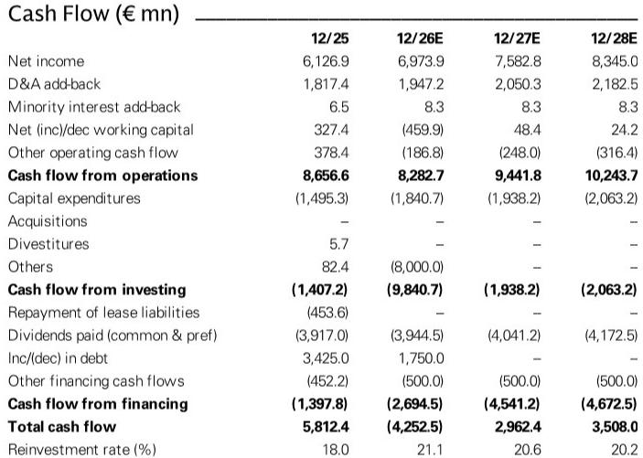
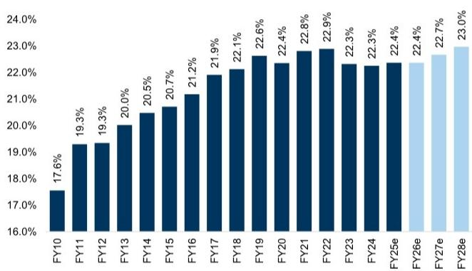
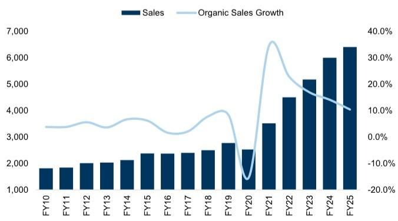

# GS：欧莱雅接手Gucci彩妆，YSL模式能否再现

欧莱雅与科蒂提前终止Gucci授权协议，将古驰彩妆的掌控权收入囊中。这笔交易的核心逻辑不在于财务数字本身，而在于欧莱雅能否复制YSL Beauty的路径——将Gucci彩妆从目前约5亿欧元的规模推向十亿级。GS这份报告最值得关注的判断是：Gucci Beauty的潜力空间，可能远超市场预期。

欧莱雅已与科蒂达成协议，将Gucci授权协议的赎回日期从2028年提前至2027年7月1日。科蒂将获得约4亿美元的提前赎回补偿，其中2.5亿美元于2026年支付，最高1.5亿美元于2027年支付。欧莱雅承担约70%的提前赎回成本，外加一笔未披露的库存采购金额。这笔交易是2026年3月31日欧莱雅与开云美妆交易的延伸——当时欧莱雅收购了Creed品牌，并获得了葆蝶家、巴黎世家和Gucci的50年授权。

## 1. 欧莱雅有把时装品牌做成十亿美妆的完整方法

YSL是欧莱雅最成功的案例。2008年欧莱雅与PPR（现开云集团）签订YSL长期整理版授权时，YSL美妆业务年销售额仅约3亿欧元。经过17年运营，YSL美妆已增长至超过30亿欧元，其中在授权第9年就突破了10亿欧元。如今YSL美妆的规模已超过其时装业务本身。

阿玛尼美妆的规模约为时装业务的70%。华伦天奴和普拉达美妆的规模分别达到授权初期的15倍和3.5倍。欧莱雅奢侈品部门总裁已明确表示，结合Gucci的品牌地位与欧莱雅的运营能力，他们计划将Gucci打造成一个数十亿欧元的品牌。

> **KC评论：** 欧莱雅这套方法的核心不是“做化妆品”，而是“把时装品牌的势能转化为美妆的规模”。YSL从3亿到30亿的路径，本质上是用香水、口红、粉底等高频消费品类，把一个奢侈品牌的认知资产变现。Gucci的品牌势能比YSL只强不弱，关键在于欧莱雅能否在品牌调性把控上做到位。

## 2. Gucci对欧莱雅财务的影响被低估了

GS估算，Gucci授权提前赎回对2027年财年预测的提振约为0.5%，不包括库存采购影响。以欧莱雅当前0.7倍的净债务/EBITDA水平，约2.8亿欧元的额外支出不会构成财务不确定性。

但真正的影响在于增长贡献。GS认为，Gucci授权是欧莱雅与开云交易的主要逻辑，未来几年可能为欧莱雅有机销售增长贡献约50个基点。如果其他条件不变，这将帮助欧莱雅在中期达到6%的有机销售增长目标。欧莱雅将于7月29日发布第二季度业绩，GS预计其有机销售增长为5.8%，略高于市场共识。

报告还提供了欧莱雅奢侈品部门增长轨迹的重要参考：2015年至2026年间，该部门以9.3%的年复合增长率增长，而市场增速仅为6.3%。即便当前市场增速节奏变化至2-3%，欧莱雅奢侈品部门仍能持续跑赢市场。管理层对香水业务尤其有信心，认为即使市场节奏变化，该业务也能以市场2-3倍的速度增长。

## 3. 报告没有完全回答的三个关键问题

Gucci彩妆的规模空间究竟在哪里？GS以YSL为参照，认为Gucci彩妆有潜力达到YSL当前水平。但YSL美妆的成长经历了17年，且期间奢侈品美妆市场经历了结构性增长。Gucci能否在更短的时间内实现同样的跨越，报告没有给出明确时间表。

欧莱雅能否保持Gucci的品牌独特性？欧莱雅运营YSL、阿玛尼、华伦天奴等品牌时，每个品牌都保持了差异化定位。但Gucci的品牌调性更为复杂——它既是奢侈品牌，又是街头文化的符号。欧莱雅能否在规模化运营的同时不稀释品牌价值，这是一个需要持续观察的问题。

提前赎回对科蒂的竞争格局意味着什么？科蒂失去了Gucci这个核心授权，但其获得的4亿美元补偿能否用于培育新的增长引擎？报告没有展开科蒂的后续策略。对于关注全球美妆竞争格局的读者，这可能是比欧莱雅自身更值得追踪的变量。

> **KC评论：** 欧莱雅这笔交易的真正看点不在短期财务，而在“品牌授权运营”这个商业模式的边界在哪里。当一个集团能同时运营YSL、阿玛尼、华伦天奴、普拉达和Gucci时，它本质上已经掌握了“奢侈品美妆的工业化生产”能力。问题是，当所有品牌都用同一套方法时，消费者的新鲜感还能维持多久？

对于关注全球美妆行业的读者，这份报告提供了一个清晰的分析框架：品牌授权价值 = 品牌势能 × 运营能力 × 品类渗透率。Gucci在品牌势能上不输YSL，品类渗透率上香水仍是最大增长点，相对少见的不确定性是欧莱雅能否在运营中保持每个品牌的独特性。7月29日的Q2业绩将是检验欧莱雅整体增长质量的第一站。

For informational purposes only. Portions may be generated,translated,summarized,or edited with AI assistance based on source materials and may contain omissions or errors. Please verify independently. This is not investment,legal,tax,accounting,or other professional advice.

For informational purposes only. Portions may be generated,translated,summarized,or edited with AI assistance based on source materials and may contain omissions or errors. Please verify independently. This is not investment,legal,tax,accounting,or other professional advice.

