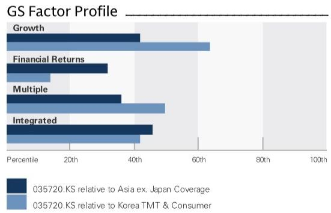
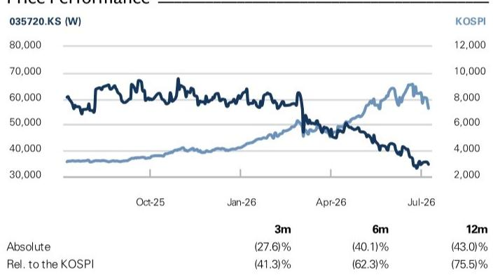
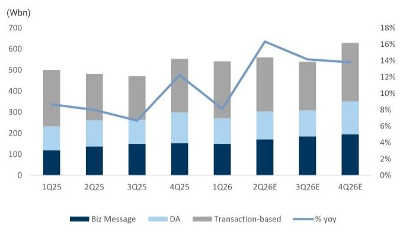
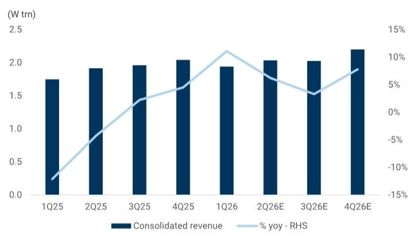
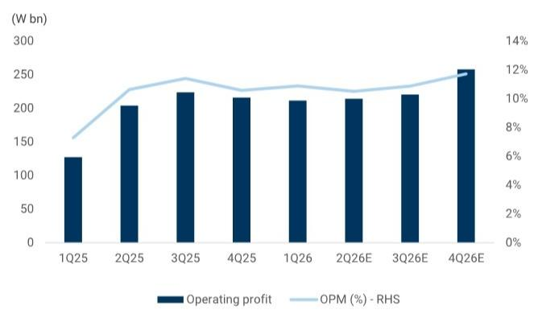

# Kakao Corp. (035720.KS)

# 2Q26E preview; Core Platform resilient; AI launch catalyst remains intact

035720.KS 12m Price Target: W49,000 Price: W34,650

We preview Kakao's 2Q26 results and expect a broadly solid quarter, supported by Platform revenue momentum. Talk Biz ads appear to have sustained YoY growth into 2Q, and Commerce should benefit from deferred revenue from the March Shopping Festa and Family Month promotions in May. That said, we would avoid being overly aggressive on margin despite positive Platform seasonality, given higher Piccoma marketing spend and the mechanical Portal Biz impact from AXZ deconsolidation.

The key near-term debate remains AI. Kakao's agentic AI service connection with vertical partners is still expected to launch before 2Q earnings, consistent with the official timeline. The important question is not whether Kakao has an AI roadmap, but whether the launch can demonstrate a tangible value proposition: connecting KakaoTalk conversation intent to high-frequency actions, partner services, and eventually transactions.

We maintain our view with an unchanged 12m TP of W49k. The core earnings base is supported by Talk Biz, Commerce, Pay, Mobility, and restructuring, while AI expectations have already been reset. We think the upcoming agentic AI launch could be an important sentiment catalyst if it shows that Kakao can move beyond AI discovery and begin proving the connection-to-action thesis inside KakaoTalk.

Action: We revise our earnings estimates, reflecting: 1) the deconsolidation of Kakao's portal business with the completion of AXZ transaction in May, 2) solid growth momentum of core Talk Biz revenue, and 3) recent trends of Platform/Contents segment. As a result, our 2026E/27E/28E top line is revised down by -1%/-2%/-1% and our OP -5%/-6%/-3%. Our NP is revised down by -6%/-6%/-3%.

Catalyst: We expect Kakao's agentic AI service connection with vertical partners to launch before 2Q earnings (as guided by the management during 1Q earnings call) to be a key near-term catalyst.

Eric Cha  
+82(2)3788-1799 | eric.cha@gs.com  
GS (Asia) L.L.C., Seoul Branch

Vona Lee  
+82(2)3788-1201 | vona.lee@gs.com  
GS (Asia) L.L.C., Seoul Branch

Market cap: W15.2tr / $10.0bn  
Enterprise value: W10.3tr / $6.8bn  
3m ADTV: W87.6bn / $58.2mn  
South Korea  
Korea TMT & Consumer  
M&A Rank: 3  
Leases incl. in net debt & EV?: Yes

GS Forecast

<table><tr><td colspan="5">GS Forecast</td></tr><tr><td></td><td>12/25</td><td>12/26E</td><td>12/27E</td><td>12/28E</td></tr><tr><td>Revenue (W bn) New</td><td>7,669.5</td><td>8,208.5</td><td>8,825.2</td><td>9,347.8</td></tr><tr><td>Revenue (W bn) Old</td><td>7,669.5</td><td>8,308.4</td><td>8,963.9</td><td>9,453.6</td></tr><tr><td>EBITDA (W bn)</td><td>1,560.9</td><td>1,721.0</td><td>1,944.4</td><td>2,162.8</td></tr><tr><td>EPS (W) New</td><td>1,655</td><td>1,582</td><td>1,730</td><td>2,024</td></tr><tr><td>EPS (W) Old</td><td>1,655</td><td>1,681</td><td>1,848</td><td>2,084</td></tr><tr><td>P/E (X)</td><td>31.3</td><td>21.9</td><td>20.0</td><td>17.1</td></tr><tr><td>P/B (X)</td><td>1.5</td><td>1.3</td><td>1.2</td><td>1.1</td></tr><tr><td>Dividend yield (%)</td><td>0.2</td><td>0.5</td><td>0.5</td><td>0.6</td></tr><tr><td>CROCI (%)</td><td>12.3</td><td>13.2</td><td>14.0</td><td>14.4</td></tr><tr><td></td><td>3/26</td><td>6/26E</td><td>9/26E</td><td>12/26E</td></tr><tr><td>EPS (W)</td><td>374</td><td>415</td><td>441</td><td>353</td></tr></table>

GS Factor Profile

  
Source: Company data, GS estimates. See disclosures for details.

## Kakao Corp. (035720.KS)

Rating since Jul 16, 2025

Ratios & Valuation

<table><tr><td></td><td>12/25</td><td>12/26E</td><td>12/27E</td><td>12/28E</td></tr><tr><td>P/E (X)</td><td>31.3</td><td>21.9</td><td>20.0</td><td>17.1</td></tr><tr><td>P/B (X)</td><td>1.5</td><td>1.3</td><td>1.2</td><td>1.1</td></tr><tr><td>FCF yield (%)</td><td>3.5</td><td>6.1</td><td>5.7</td><td>5.5</td></tr><tr><td>EV/EBITDAR (X)</td><td>14.4</td><td>6.0</td><td>5.0</td><td>4.2</td></tr><tr><td>EV/EBITDA (excl. leases) (X)</td><td>14.4</td><td>6.0</td><td>5.0</td><td>4.2</td></tr><tr><td>CROCI (%)</td><td>12.3</td><td>13.2</td><td>14.0</td><td>14.4</td></tr><tr><td>ROE (%)</td><td>6.8</td><td>6.0</td><td>6.2</td><td>6.9</td></tr><tr><td>Net debt/equity (%)</td><td>(27.8)</td><td>(41.4)</td><td>(44.5)</td><td>(46.6)</td></tr><tr><td>Net debt/equity (excl. leases) (%)</td><td>(27.8)</td><td>(41.4)</td><td>(44.5)</td><td>(46.6)</td></tr><tr><td>Interest cover (X)</td><td>2.2</td><td>4.1</td><td>5.2</td><td>5.8</td></tr><tr><td>Days inventory outst, sales</td><td>3.8</td><td>3.6</td><td>3.6</td><td>3.6</td></tr><tr><td>Receivable days</td><td>26.6</td><td>26.0</td><td>25.7</td><td>25.9</td></tr><tr><td>Days payable outstanding</td><td>164.1</td><td>166.2</td><td>164.8</td><td>168.1</td></tr><tr><td>DuPont ROE (%)</td><td>4.8</td><td>5.8</td><td>6.0</td><td>6.7</td></tr><tr><td>Turnover (X)</td><td>0.3</td><td>0.4</td><td>0.4</td><td>0.4</td></tr><tr><td>Leverage (X)</td><td>1.8</td><td>1.9</td><td>1.8</td><td>1.8</td></tr><tr><td>Gross cash invested (ex cash) (W)</td><td>11,769.6</td><td>11,230.6</td><td>12,069.7</td><td>13,153.2</td></tr><tr><td>Average capital employed (W)</td><td>10,487.1</td><td>8,995.7</td><td>7,001.2</td><td>7,060.2</td></tr><tr><td>BVPS (W)</td><td>34,639</td><td>27,180</td><td>28,657</td><td>30,336</td></tr></table>

Growth & Margins (%)

Income Statement (W bn)

<table><tr><td></td><td>12/25</td><td>12/26E</td><td>12/27E</td><td>12/28E</td></tr><tr><td>Total revenue</td><td>7,669.5</td><td>8,208.5</td><td>8,825.2</td><td>9,347.8</td></tr><tr><td>Cost of goods sold</td><td>(4,523.1)</td><td>(4,767.5)</td><td>(5,003.3)</td><td>(5,232.7)</td></tr><tr><td>SG&amp;A</td><td>(1,245.5)</td><td>(1,332.9)</td><td>(1,477.5)</td><td>(1,552.3)</td></tr><tr><td>R&amp;D</td><td>-</td><td>-</td><td>-</td><td>-</td></tr><tr><td>Other operating inc./(exp.)</td><td>(1,129.8)</td><td>(1,204.1)</td><td>(1,308.4)</td><td>(1,397.2)</td></tr><tr><td>EBITDA</td><td>1,560.9</td><td>1,721.0</td><td>1,944.4</td><td>2,162.8</td></tr><tr><td>Depreciation &amp; amortization</td><td>(789.8)</td><td>(817.0)</td><td>(908.4)</td><td>(997.2)</td></tr><tr><td>EBIT</td><td>771.1</td><td>904.0</td><td>1,036.0</td><td>1,165.6</td></tr><tr><td>Net interest inc./(exp.)</td><td>85.3</td><td>40.3</td><td>50.0</td><td>50.0</td></tr><tr><td>Income/(loss) from associates</td><td>92.7</td><td>102.0</td><td>80.0</td><td>80.0</td></tr><tr><td>Pre-tax profit</td><td>892.7</td><td>916.3</td><td>996.0</td><td>1,125.6</td></tr><tr><td>Provision for taxes</td><td>(139.0)</td><td>(193.1)</td><td>(239.0)</td><td>(270.1)</td></tr><tr><td>Minority interest</td><td>(26.5)</td><td>(27.0)</td><td>4.3</td><td>35.3</td></tr><tr><td>Preferred dividends</td><td>-</td><td>-</td><td>-</td><td>-</td></tr><tr><td>Net inc. (pre-exceptionals)</td><td>727.3</td><td>696.3</td><td>761.3</td><td>890.8</td></tr><tr><td>Post-tax exceptionals</td><td>(90.0)</td><td>7.0</td><td>-</td><td>-</td></tr><tr><td>Net inc. (post-exceptionals)</td><td>637.3</td><td>703.3</td><td>761.3</td><td>890.8</td></tr><tr><td>EPS (basic, pre-except) (W)</td><td>1,655</td><td>1,582</td><td>1,730</td><td>2,024</td></tr><tr><td>EPS (diluted, pre-except) (W)</td><td>1,655</td><td>1,582</td><td>1,730</td><td>2,024</td></tr><tr><td>EPS (basic, post-except) (W)</td><td>1,450</td><td>1,598</td><td>1,730</td><td>2,024</td></tr><tr><td>EPS (diluted, post-except) (W)</td><td>1,450</td><td>1,598</td><td>1,730</td><td>2,024</td></tr><tr><td>DPS (W)</td><td>89</td><td>166</td><td>172</td><td>194</td></tr><tr><td>Div. payout ratio (%)</td><td>5.3</td><td>10.5</td><td>9.9</td><td>9.6</td></tr></table>

<table><tr><td colspan="5">Growth &amp; Margins (%)</td></tr><tr><td></td><td>12/25</td><td>12/26E</td><td>12/27E</td><td>12/28E</td></tr><tr><td>Total revenue growth</td><td>(2.5)</td><td>7.0</td><td>7.5</td><td>5.9</td></tr><tr><td>EBITDA growth</td><td>15.2</td><td>10.3</td><td>13.0</td><td>11.2</td></tr><tr><td>EPS growth</td><td>578.6</td><td>(4.4)</td><td>9.3</td><td>17.0</td></tr><tr><td>DPS growth</td><td>(10.6)</td><td>87.5</td><td>3.7</td><td>13.0</td></tr><tr><td>EBIT margin</td><td>10.1</td><td>11.0</td><td>11.7</td><td>12.5</td></tr><tr><td>EBITDA margin</td><td>20.4</td><td>21.0</td><td>22.0</td><td>23.1</td></tr><tr><td>Net income margin</td><td>9.5</td><td>8.5</td><td>8.6</td><td>9.5</td></tr></table>

Price Performance  
  
Source: FactSet. Price as of 8 Jul 2026 close.

Balance Sheet (W bn)

<table><tr><td></td><td>12/25</td><td>12/26E</td><td>12/27E</td><td>12/28E</td></tr><tr><td>Cash &amp; cash equivalents</td><td>6,373.8</td><td>6,893.7</td><td>7,393.7</td><td>7,877.2</td></tr><tr><td>Accounts receivable</td><td>569.5</td><td>598.4</td><td>643.3</td><td>681.4</td></tr><tr><td>Inventory</td><td>76.5</td><td>84.3</td><td>90.7</td><td>96.0</td></tr><tr><td>Other current assets</td><td>5,354.4</td><td>5,397.0</td><td>5,493.6</td><td>5,566.2</td></tr><tr><td>Total current assets</td><td>12,374.2</td><td>12,973.4</td><td>13,621.3</td><td>14,220.8</td></tr><tr><td>Net PP&amp;E</td><td>1,556.7</td><td>1,572.3</td><td>1,588.0</td><td>1,603.9</td></tr><tr><td>Net intangibles</td><td>5,227.8</td><td>4,182.2</td><td>3,345.8</td><td>2,676.6</td></tr><tr><td>Total investments</td><td>2,516.9</td><td>2,218.4</td><td>3,082.7</td><td>3,944.6</td></tr><tr><td>Other long-term assets</td><td>6,108.0</td><td>1,270.0</td><td>1,373.5</td><td>1,450.8</td></tr><tr><td>Total assets</td><td>27,783.5</td><td>22,216.3</td><td>23,011.2</td><td>23,896.7</td></tr><tr><td>Accounts payable</td><td>2,164.7</td><td>2,177.0</td><td>2,340.5</td><td>2,479.1</td></tr><tr><td>Short-term debt</td><td>1,144.2</td><td>938.3</td><td>769.4</td><td>630.9</td></tr><tr><td>Short-term lease liabilities</td><td>-</td><td>-</td><td>-</td><td>-</td></tr><tr><td>Other current liabilities</td><td>5,470.8</td><td>5,565.4</td><td>5,662.5</td><td>5,762.4</td></tr><tr><td>Total current liabilities</td><td>8,779.7</td><td>8,680.6</td><td>8,772.5</td><td>8,872.4</td></tr><tr><td>Long-term debt</td><td>990.5</td><td>1,000.5</td><td>1,010.5</td><td>1,020.5</td></tr><tr><td>Long-term lease liabilities</td><td>-</td><td>-</td><td>-</td><td>-</td></tr><tr><td>Other long-term liabilities</td><td>2,788.3</td><td>574.6</td><td>617.8</td><td>654.3</td></tr><tr><td>Total long-term liabilities</td><td>3,778.9</td><td>1,575.1</td><td>1,628.3</td><td>1,674.9</td></tr><tr><td>Total liabilities</td><td>12,558.6</td><td>10,255.8</td><td>10,400.8</td><td>10,547.3</td></tr><tr><td>Preferred shares</td><td>-</td><td>-</td><td>-</td><td>-</td></tr><tr><td>Total common equity</td><td>11,276.2</td><td>11,933.5</td><td>12,614.8</td><td>13,384.7</td></tr><tr><td>Minority interest</td><td>3,948.7</td><td>27.0</td><td>(4.3)</td><td>(35.3)</td></tr><tr><td>Total liabilities &amp; equity</td><td>27,783.5</td><td>22,216.3</td><td>23,011.2</td><td>23,896.7</td></tr><tr><td>Net debt, adjusted</td><td>(4,239.0)</td><td>(4,954.9)</td><td>(5,613.7)</td><td>(6,225.8)</td></tr></table>

<table><tr><td></td><td>12/25</td><td>12/26E</td><td>12/27E</td><td>12/28E</td></tr><tr><td>Net income</td><td>663.8</td><td>730.3</td><td>757.0</td><td>855.5</td></tr><tr><td>D&amp;A add-back</td><td>789.8</td><td>817.0</td><td>908.4</td><td>997.2</td></tr><tr><td>Minority interest add-back</td><td>-</td><td>-</td><td>-</td><td>-</td></tr><tr><td>Net (inc)/dec working capital</td><td>(48.1)</td><td>(48.1)</td><td>(48.1)</td><td>(48.1)</td></tr><tr><td>Other operating cash flow</td><td>(0.6)</td><td>-</td><td>-</td><td>-</td></tr><tr><td>Cash flow from operations</td><td>1,404.8</td><td>1,499.2</td><td>1,617.2</td><td>1,804.5</td></tr><tr><td>Capital expenditures</td><td>(479.2)</td><td>(575.0)</td><td>(747.5)</td><td>(971.8)</td></tr><tr><td>Acquisitions</td><td>-</td><td>-</td><td>-</td><td>-</td></tr><tr><td>Divestitures</td><td>-</td><td>-</td><td>-</td><td>-</td></tr><tr><td>Others</td><td>1.0</td><td>(135.2)</td><td>(135.2)</td><td>(135.2)</td></tr><tr><td>Cash flow from investing</td><td>(478.2)</td><td>(710.2)</td><td>(882.7)</td><td>(1,107.0)</td></tr><tr><td>Repayment of lease liabilities</td><td>-</td><td>-</td><td>-</td><td>-</td></tr><tr><td>Dividends paid (common &amp; pref)</td><td>(38.9)</td><td>(73.0)</td><td>(75.7)</td><td>(85.5)</td></tr><tr><td>Inc/(dec) in debt</td><td>(80.3)</td><td>(196.0)</td><td>(158.9)</td><td>(128.5)</td></tr><tr><td>Other financing cash flows</td><td>(603.3)</td><td>0.0</td><td>0.0</td><td>0.0</td></tr><tr><td>Cash flow from financing</td><td>(722.5)</td><td>(269.0)</td><td>(234.6)</td><td>(214.0)</td></tr><tr><td>Total cash flow</td><td>204.0</td><td>520.0</td><td>499.9</td><td>483.5</td></tr><tr><td>Free cash flow</td><td>925.6</td><td>924.2</td><td>869.7</td><td>832.8</td></tr></table>

Source: Company data, GS estimates.

That said, we believe investor focus should be less on the launch itself, and more on evidence of repeat usage, partner expansion, transaction completion and user engagement that could gradually validate Kakao's AI monetization framework.

## Key numbers

We expect 2Q consolidated top line to come in at W2trn (+6% YoY and +5% QoQ) and OP W214bn (+5% YoY and +1% QoQ), broadly in-line with BBG consensus: While top line growth momentum should be supported by Talk Biz ads (+20% YoY), Commerce (+16%), Mobility (+10%), and Pay (+26% YoY), we expect Portal Biz impact from AXZ deconsolidation from May to slightly offset revenue growth (expect Portal Biz revenue to decline -40% YoY). Meanwhile, on OP, we expect relatively high marketing spend on Piccoma to slightly pressure margins.

## ■ Key numbers to track (thesis pillars):

Core Platform recovery: We continue to monitor Talk Biz growth, Biz Message expansion, advertising inventory improvement following the KakaoTalk revamp, and operating leverage. We believe these remain the primary near-term earnings drivers and now carry greater weight within our investment thesis.

☐ Portfolio restructuring and earnings quality improvement: We will look for continued reduction in non-core subsidiary losses and improvements in consolidated earnings visibility. Successful execution should help to improve earnings quality and allow management to focus more clearly on core operations.

☐ AI ecosystem development: Rather than headline product launches, we focus on measurable ecosystem progress including external partner onboarding, breadth of vertical integrations, and management commentary regarding commercial deployment. Broader ecosystem participation would increase our confidence in Kakao's LT AI monetization framework.

☐ User engagement and transaction conversion: We believe the key proof point is whether users increasingly complete tasks directly within KakaoTalk, including search, reservations, commerce and payment-linked actions. Repeat user behavior is likely to matter more than initial download metrics.

□ Early monetization evidence: We will monitor disclosure around AI-assisted search advertising, CPS economics and transaction-linked revenue contribution. We believe meaningful valuation expansion requires evidence that AI usage can translate into sustainable economic value.

## 2Q26E earnings preview

We expect 2Q consolidated top line to come in at W2trn (+6% YoY and +5% QoQ) and OP W214bn (+5% YoY and +1% QoQ), broadly in-line with BBG consensus. While top line growth momentum should be supported by Talk Biz ads, Commerce, Mobility, and Pay, we expect Portal Biz impact from AXZ deconsolidation from May to slightly offset revenue growth. Meanwhile, on OP, we expect relatively high marketing spend on Piccoma to slightly pressure margins.

Exhibit 1: Kakao 2Q26E earnings preview summary

<table><tr><td rowspan="2"></td><td colspan="5">GS est</td><td colspan="2">BBG</td></tr><tr><td>2Q25</td><td>1Q26</td><td>2Q26E</td><td>% yoy</td><td>% qoq</td><td>2Q26E</td><td>% Diff</td></tr><tr><td>(W bn)</td><td></td><td></td><td></td><td></td><td></td><td></td><td></td></tr><tr><td>Revenue</td><td>1,917</td><td>1,942</td><td>2,037</td><td>6%</td><td>5%</td><td>2,029</td><td>0%</td></tr><tr><td>OPEX</td><td>1,714</td><td>1,731</td><td>1,823</td><td>6%</td><td>5%</td><td>1,814</td><td>1%</td></tr><tr><td>Operating profit</td><td>204</td><td>211</td><td>214</td><td>5%</td><td>1%</td><td>215</td><td>0%</td></tr><tr><td>OP margin (%)</td><td>10.6%</td><td>10.9%</td><td>10.5%</td><td>-0.1%p</td><td>-0.4%p</td><td>10.6%</td><td>-0.1%p</td></tr><tr><td>Net profit</td><td>217</td><td>287</td><td>163</td><td>-25%</td><td>-43%</td><td>170</td><td>-4%</td></tr><tr><td>NP margin (%)</td><td>11.3%</td><td>14.8%</td><td>8.0%</td><td>-3.3%p</td><td>-6.8%p</td><td>8.4%</td><td>-0.4%p</td></tr></table>

Source: Company data, GS Global Investment Research, Bloomberg

## GS view

We view 2Q as a solid core Platform quarter, but the more important catalyst is the upcoming agentic AI launch before the earnings results, which should begin to test whether Kakao can convert its connection moat into high-frequency actions inside KakaoTalk.

## Solid core platform performance

■ Talk Biz: Biz Message ads and DA both appear to have continued YoY growth in 2Q (GSe +25% YoY/+16% YoY for Biz Message/DA). In our view, core ad demand remains healthy and Talk Biz remains the key driver of Platform resilience.

\- Commerce: 2Q should see improving YoY growth trend vs. 1Q due to revenue deferred from the March Shopping Festa and Family Month promotions in May. Additionally, self-purchase continues to expand into categories such as cosmetics and food, supporting GMV growth.

\- Portal Biz (AXZ): The sale of AXZ to Upstage was completed in May (link), deconsolidating Daum portal from Kakao. This should impact two months of subsidiary ad revenue in 2Q, and we expect Portal Biz revenue to fall -40% YoY due to the impact.

## Content segment remains stable but still not a major upside driver

Piccoma: Piccoma held its 10th-year anniversary in Apr., driving some peak-season marketing spend. That said, user KPI response appears more measured, which suggests that Content is unlikely to drive meaningful upside in 2Q.

■ Music: In 2Q, Music segment should remain stable (+4% YoY), helped by IP activity and SM-related contribution.

## AI service launch catalyst remains intact

Kanana in KakaoTalk: We expect Kakao's agentic AI service connection with vertical partners to launch before 2Q earnings, as guided by the management during 1Q earnings call. In our view, the upcoming launch before 2Q earnings is important as it can be the first proof point to show whether KakaoTalk's connection moat can translate into high-frequency actions or transactions.

Exhibit 2: Biz Message and DA both appear to have continued YoY growth in 2Q  
  
Source: Company data, GS Global Investment Research

Exhibit 3: Core ad demand remains healthy and Talk Biz remains the key driver of Platform resilience  
  
Source: Company data, GS Global Investment Research

Exhibit 4: Top line growth momentum should be supported by Platform Biz, but we expect Portal Biz impact from AXZ deconsolidation from May to slightly offset revenue growth  
  
Source: Company data, GS Global Investment Research

Exhibit 5: We expect Kakao to sustain solid OP margin above $10\%$ level in 2Q  
  
Source: Company data, GS Global Investment Research

## Earnings revision

We revise our earnings estimates, reflecting: 1) the deconsolidation of Kakao's portal business with the completion of AXZ transaction in May, 2) solid growth momentum of core Talk Biz revenue, and 3) recent trends of Platform/Contents segment. As a result, our 2026E/27E/28E top line is revised down by -1%/-2%/-1% and our OP -5%/-6%/-3%. Our NP is revised down by -6%/-6%/-3%.

Exhibit 6: Kakao earnings revision summary

<table><tr><td></td><td colspan="4">2026E</td><td colspan="4">2027E</td><td colspan="4">2028E</td></tr><tr><td>(W bn)</td><td>Old</td><td>New</td><td>Chg</td><td>% Chg</td><td>Old</td><td>New</td><td>Chg</td><td>% Chg</td><td>Old</td><td>New</td><td>Chg</td><td>% Chg</td></tr><tr><td>Revenue</td><td>8,308</td><td>8,209</td><td>-100</td><td>-1%</td><td>8,964</td><td>8,825</td><td>-139</td><td>-2%</td><td>9,454</td><td>9,348</td><td>-106</td><td>-1%</td></tr><tr><td>% yoy</td><td>8%</td><td>7%</td><td></td><td>-1%p</td><td>8%</td><td>8%</td><td></td><td>0%p</td><td>5%</td><td>6%</td><td></td><td>0%p</td></tr><tr><td>Platform</td><td>5,004
