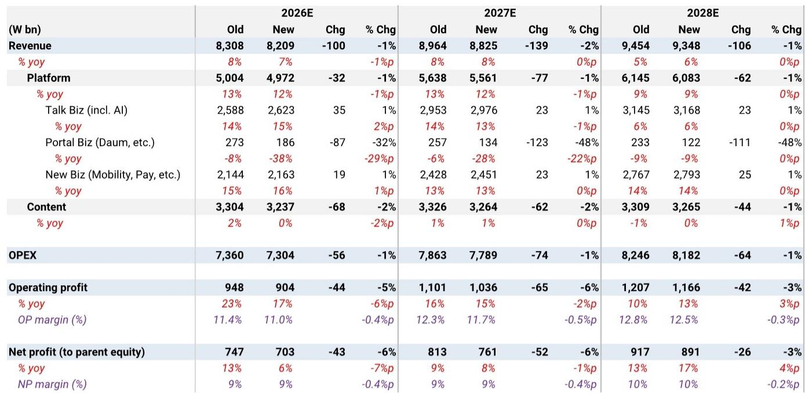
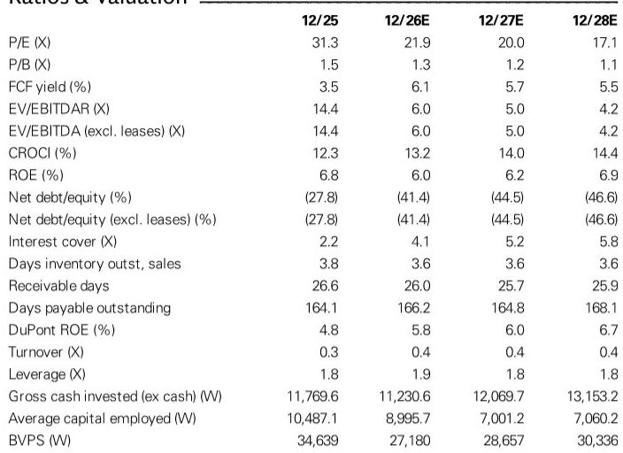
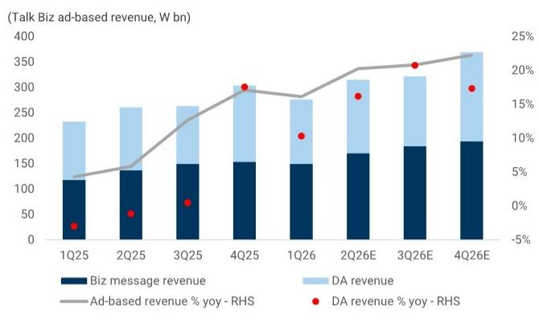

# Kakao的AI发布并非你想象的关键：真正的考验在于KakaoTalk能否成为交易引擎

Kakao近期最受瞩目的产品发布即将到来。其集成在KakaoTalk内的垂直合作伙伴AI服务，预计将在第二季度财报前亮相。然而，市场对发布活动本身的关注可能偏离了重点。真正的问题不在于Kakao是否有AI路线图，而在于这家公司能否最终将其无与伦比的连接优势——5000万韩国人每天打开KakaoTalk的习惯——转化为一个高频交易引擎。

一份全球研究机构的报告维持其观点或34,650韩元。该论点基于两大支柱：一是持续产生稳定收益增长的核心平台业务；二是AI叙事已被充分消化，任何可信的价值展示都可能成为强大的情绪催化剂。但报告的分析揭示了表面之下更微妙的故事。

第二季度业绩预览显示，公司在核心运营上执行得相当稳健。预计营收为2万亿韩元，同比增长6%，营业利润为2140亿韩元，同比增长5%。Talk Biz广告业务继续以20%的年增长率增长。电商业务受益于促销活动的递延收入。出行和支付业务均呈现两位数增长。这些数字并不惊人，但足够扎实——尤其对于一家过去两年一直在重组、剥离非核心资产并重建信任的公司而言。

挑战在于，市场已经消化了这种运营稳定性。Kakao的远期估值约为21.9倍，对于一家营收增长7%、盈利增长个位数的公司来说，这个估值并不算便宜。因此，上行空间几乎完全取决于AI能否创造市场尚未充分定价的新收入来源。

这正是报告分析框架的关键所在。它识别出追踪Kakao AI论点的五个不同支柱，核心洞察在于其中大部分与技术本身无关，而是关乎用户行为、合作伙伴采纳和交易经济性。发布活动只是起跑线。真正的竞赛在于用户是否真的在KakaoTalk内完成任务——搜索、预订、购物、支付——而不是把AI当作新鲜事物体验后便离开应用。

报告的核心论点是，Kakao的AI机遇与全球大型科技公司有本质不同。OpenAI和Google正在构建旨在取代搜索引擎的通用AI助手。而Kakao正在构建一个垂直AI，它嵌入在现有的消息生态系统中，拥有已知的用户意图。当KakaoTalk用户询问晚餐计划时，AI无需猜测他们的需求。它知道用户的聊天记录、位置、支付方式和偏好的餐厅。连接已经存在。任务是从对话到交易完成闭环。

这一框架对读者如何评估即将到来的发布具有重要启示。首先需要关注的不是演示或新闻稿，而是外部合作伙伴的数量、垂直集成的广度以及管理层对商业部署时间表的评论。如果AI仅连接Kakao自身的服务——KakaoPay、KakaoMap、KakaoTaxi——那么价值主张是增量式的。如果它连接到第三方商家、旅行平台和本地企业，那么可触达的市场将大幅扩展。

其次需要关注的是用户参与数据。报告强调，重复使用比初始下载指标更重要。这是一个微妙但关键的区分。许多AI产品会引发好奇心驱动的下载高峰，但很快消退。对Kakao的考验在于，AI能否成为日常习惯——用户在日常任务中依赖它，而不仅仅是出于实验目的。这种行为变化需要时间来衡量，变现则需要更长时间。

第三需要关注的是交易转化。Kakao AI论点的最终证明点不在于用户是否提问，而在于他们是否完成行动。如果AI能通过KakaoPay推动增量交易、从合作伙伴预订中产生佣金收入、或提高AI辅助搜索广告的点击率，那么经济模型就变得清晰。如果它仍然只是一个复杂的聊天机器人，那么估值逻辑就会减弱。

报告识别出一个尚未完全解决的紧张关系。Kakao的AI战略需要在合作伙伴集成、用户获取和基础设施方面进行大量投入。然而，公司同时处于投资组合重组过程中，旨在减少子公司亏损并提高盈利质量。这两个目标可能相互冲突。AI投入可能在构建长期价值的同时压低近期利润率。报告的盈利预测已经反映了这种紧张关系，在整个预测期内营业利润预测下调了5-6%。

这给读者带来了分析上的挑战。如何评估一家同时执行成本削减重组和AI投入扩张的公司？报告没有提供简单答案，但它提供了一个决策框架，可以帮助读者应对不确定性。

该框架包含三个层次。第一层是基础情景：核心平台业务在Talk Biz广告、电商和出行的推动下，以7-10%的年增长率持续增长。随着重组效益显现，利润率逐步扩大。在这一层面，Kakao是一个市值15万亿韩元的公司，回报稳定但不令人兴奋。当前估值已经反映了这一情景。

第二层是重组上行空间：如果Kakao成功剥离或扭亏其亏损子公司，盈利质量将得到改善，市场将为更干净的盈利流赋予更高倍数。报告指出，通过AXZ交易剥离门户业务已在推进中，即使没有AI，这方面的持续进展也可能推动倍数扩张。

第三层是AI期权价值：如果代理型AI发布能展示可衡量的用户参与和交易转化，市场将开始为一个可能多年复合增长的新收入来源定价。这是使当前风险回报具有吸引力的非对称上行空间。但这也是最难建模的部分，因为关键变量——用户留存率、合作伙伴经济性和变现时间表——都是未知的。

报告留下了一些值得深入探讨的重要开放性问题。Kakao能多快引入外部合作伙伴，这些合作的经济性如何？AI将是免费、免费增值还是基于交易？Kakao计划如何与同样试图嵌入日常任务的全球AI助手竞争？当AI可以访问个人聊天记录和支付信息时，用户隐私和数据安全将如何保障？这些都不是小问题，报告的分析表明，答案将决定Kakao的AI论点是成功还是失败。

报告也没有完全解决韩国国内的竞争动态。Naver正在大力投入自己的AI助手。Google和OpenAI等全球参与者正在进入韩国市场。KakaoTalk在消息领域的优势提供了分发优势，但仅靠分发并不能保证AI成功。AI的质量、集成的广度和用户体验都将至关重要。报告的分析框架侧重于生态系统发展而非技术差异化，这是一种可辩护的方法，但也留下了讨论空间。

对于希望自行评估的读者，报告提供了一套具体的追踪指标。Talk Biz增长率将表明核心广告业务是否健康。子公司盈利趋势将显示重组是否按计划进行。合作伙伴引入公告将表明AI生态系统是否获得动力。KakaoTalk的用户参与数据将揭示AI是否成为习惯。而与交易相关的收入披露最终将确认经济模型是否成立。

报告最重要的洞察是，Kakao的AI故事与技术无关，而是关于行为改变。公司已经拥有连接。问题在于能否完成闭环。这是一个更难解决的问题，但如果Kakao成功，回报可能相当可观。

加入社区阅读完整报告并查看原始图表。

*仅供参考。部分内容可能基于源材料通过AI辅助生成、翻译、总结或编辑，可能存在遗漏或错误。请独立核实。这不构成专业建议。*

仅供参考。部分内容可能基于源材料通过AI辅助生成、翻译、总结或编辑，可能存在遗漏或错误。请独立核实。这不构成专业建议。

