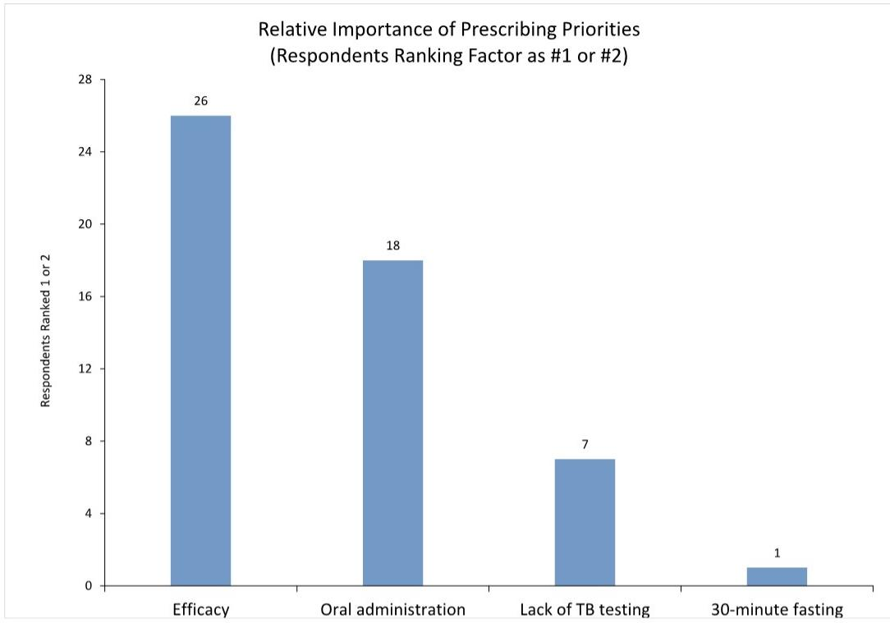
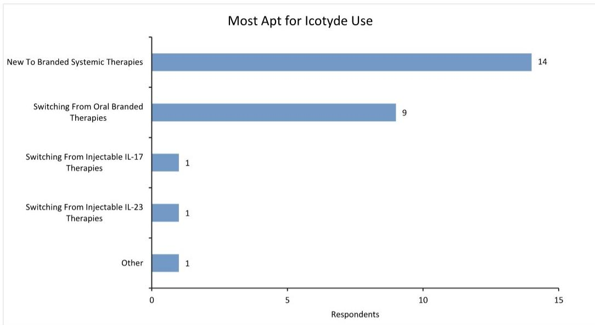
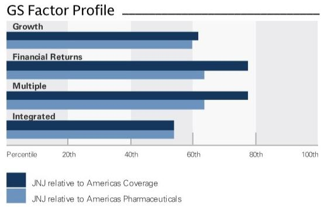

# GS：GS调研，强生口服新药Icotyde峰值收入或超100亿美元

强生新上市的口服银屑病药物Icotyde，正在成为市场重新评估这家医疗健康巨头增长潜力的关键变量。GS最新发布的KOL（关键意见领袖）调研报告给出了一个值得关注的信号：如果这款口服IL-23药物达到医生预期的市场份额，其峰值收入可能超过100亿美元，远高于目前市场共识的71亿美元。

这一判断来自GS对26名皮肤科医生的专项调查。这些医生每人至少治疗100名中重度银屑病患者，并在过去一年中开具过多种品牌全身性治疗药物。调研的核心发现是：医生们预计Icotyde在中重度银屑病患者中的处方比例将从目前的2-3%，在一年内升至8-10%，五年后达到15-20%。

## 1. 口服药正在改写银屑病治疗格局

IL-23抑制剂一直是银屑病治疗的重磅武器，但此前均为注射剂型。强生的Tremfya和艾伯维的Skyrizi在这一领域占据主导地位。Icotyde作为首个口服IL-23药物，其最大优势在于给药便利性——患者无需注射，也无需频繁就医。

GS调研显示，医生对Icotyde的定位非常清晰：它主要服务于两类人群——从未使用过品牌全身性治疗的新患者，以及从其他口服品牌（如安进的Otezla和百时美施贵宝的Sotyktu）转换而来的患者。对于已经在使用注射类IL-23或IL-17药物的患者，医生并不倾向于让他们转换。这意味着Icotyde正在扩大整个银屑病治疗市场，而非蚕食现有注射药物的份额。

> **KC评论：** 这个判断对行业竞争格局有重要含义。如果Icotyde确实是在做大市场蛋糕而非抢份额，那么Tremfya和Skyrizi面临的直接冲击可能小于市场此前担忧。但值得关注的是，强生同时拥有Tremfya和Icotyde，这种“左右互搏”策略能否持续，要看公司如何平衡两个产品的推广资源。

## 2. 处方爬坡速度超出早期预期

Icotyde于今年3月获得FDA批准用于中重度斑块状银屑病。强生在4月的一季度交流会上披露，已有1500名患者获得处方，涉及超过1000名独立处方医生。到6月的医疗保健大会上，这一数字已跃升至约4500名处方医生。

GS调研进一步印证了这一趋势。75分位数的医生预计五年后Icotyde在其患者中的使用比例将达到29%，远高于中位数的15%。这表明一部分医生对这款药物抱有更高期待，可能成为推动处方量超预期的关键力量。

值得注意的是，IQVIA的处方数据目前尚未完全覆盖所有渠道，公开数据可能低估了实际需求。这意味着市场对Icotyde早期表现的判断可能偏保守。

## 3. 报告尚未完全回答的问题：适应症扩展与支付方态度

Icotyde的长期价值取决于两个尚未充分验证的变量。第一是适应症扩展。除了银屑病，Icotyde还在开发银屑病关节炎、溃疡性结肠炎和克罗恩病。这些适应症的获批将显著扩大其可及市场。强生管理层此前表示，到2027年Icotyde有望成为公司层面有意义的收入驱动因素。

第二是医保覆盖。GS调研显示，目前约一半的处方成功获得了保险覆盖，成功率约2:1，但仍有大量处方处于审批流程中。随着医生和支付方对这款新药的熟悉程度提高，覆盖成功率有望继续改善。但这仍是早期数据，后续季度需要持续追踪。

> **KC评论：** 强生2季度财报将在下周发布，这将是Icotyde上市后首个完整季度的销售数据窗口。管理层虽然可能不会单独拆分该产品的收入，但更新的处方量和处方医生数量将是判断早期势头是否持续的关键指标。完整报告中对各适应症的时间线假设和峰值收入模型值得细读。

## 4. 对产业观察者的框架：关注三个维度

对于关注强生和免疫学赛道的读者，GS这份调研提供了一个可操作的观察框架。第一个维度是处方爬坡速度是否与KOL预期一致，尤其是75分位数的激进预期能否兑现。第二个维度是适应症扩展的临床数据，特别是溃疡性结肠炎和克罗恩病的2期/3期结果。第三个维度是竞争格局演变，包括艾伯维、诺华等对手的口服管线进展，以及注射类IL-23药物是否会通过剂型改进来应对口服药的挑战。

Icotyde的故事还处于早期章节。但GS调研揭示了一个核心判断：口服IL-23药物正在打开一个此前未被充分定价的市场空间，而强生恰好站在这一趋势的起点。

For informational purposes only. Portions may be generated,translated,summarized,or edited with AI assistance based on source materials and may contain omissions or errors. Please verify independently. This is not investment,legal,tax,accounting,or other professional advice.

For informational purposes only. Portions may be generated,translated,summarized,or edited with AI assistance based on source materials and may contain omissions or errors. Please verify independently. This is not investment,legal,tax,accounting,or other professional advice.

