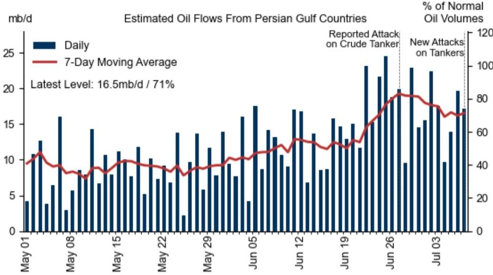
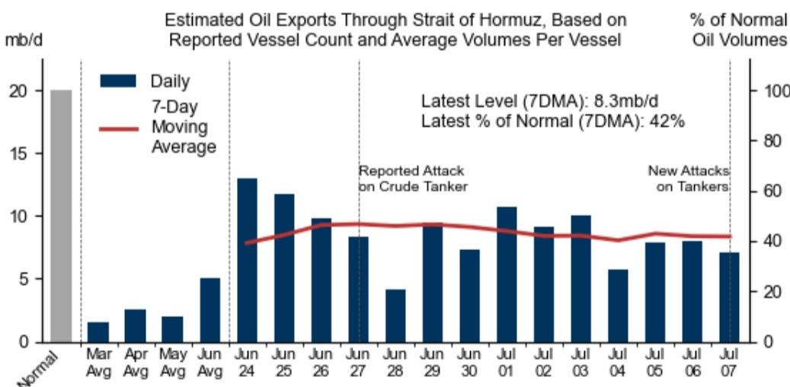
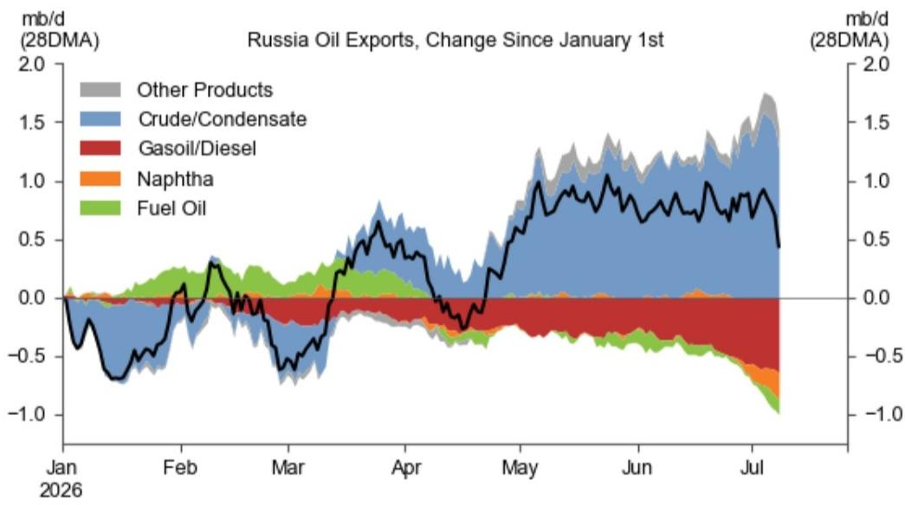

# GS：特朗普撕毁停火协议后，原油供应恢复的真正瓶颈

布伦特原油期货价格本周三回升至每桶80美元附近。触发因素是特朗普总统宣布与伊朗的停火协议破裂，此前霍尔木兹海峡发生了新的袭击事件。两艘油轮和一艘LNG船在阿曼海岸附近遭无人机击中，美国随即撤销对伊朗石油的制裁豁免，并对伊朗发动空袭。伊朗的报复打击了巴林和科威特，美方则在周三晚进行了新一轮打击。

这份GS最新发布的石油追踪报告，核心判断并非短期价格波动，而是指向一个更关键的变量：**霍尔木兹海峡石油流量的恢复，瓶颈不在于有多少空油轮可以装货，而在于伊朗是否愿意放行。**

报告显示，波斯湾的石油出口流量在停火协议签署后的头10天内，一度恢复到战前水平的80%以上，积压的油轮蜂拥而出。但好景不长。随着近期油轮遇袭，7日移动平均流量已回落至正常水平的71%左右，大约每天1600-1700万桶。通过海峡本身的流量更是从协议后的每天1000万桶，降到了最近的830万桶。

GS的分析师指出，一个关键证据是：**目前海峡附近空油轮的运载能力高达9.26亿桶，波斯湾内部的空油轮容量比已装载的油轮容量高出50%以上。** 换句话说，运力不是问题。船只不敢走、或者走了也未必安全，才是核心。

> **KC观察：** 这组数据点出了市场定价的一个微妙之处。很多人认为只要停火，供应就能迅速恢复。但报告明确指出，伊朗的配合意愿才是真正的开关。只要海峡的“安全感”没有建立，即使油轮排成长队，流量也无法恢复到正常水平。这意味着需要密切关注的不只是停火协议的新闻，更是实际通过海峡的油轮数。

## 1. 伊朗制裁豁免的取消，将重新压制刚刚抬头的进口

报告中的另一条线索值得留意。美国撤销对伊朗石油的制裁豁免，意味着此前刚刚开始回升的伊朗石油进口将再次承压。数据显示，全球伊朗石油进口量虽然有所回升，但仍比去年同期低每天80万桶。这个缺口短期内很难通过其他渠道完全弥补。

同时，虽然中东产油国在过去一个月已经开始重启此前关闭的油井，但霍尔木兹海峡的持续干扰，会影响整个生产恢复的节奏。GS估计，波斯湾地区6月份的原油产量仍比战前水平低每天1050万桶。这个巨大的供应缺口，是当前市场定价的底层逻辑。

## 2. 全球库存虽在重建，但信号并不稳固

好消息是，GS的全球可见库存指标在6月中旬触底，避免了创下历史新低。在霍尔木兹海峡重新开放后的头三周，库存以每天390万桶的速度增加。这主要得益于波斯湾流量的快速回升，以及亚洲需求（尤其是中国推迟进口）依然偏软。

但高频库存数据噪音很大，且近期出现逆转。过去一周，全球可见库存指标下降了每天650万桶，主要驱动因素是“运输途中的成品油”数量下降。报告推测，这很可能与近期俄罗斯炼油厂遭到的无人机袭击有关。

> **KC观察：** 库存数据的短期反弹，容易被解读为供应不确定性缓解。但GS提醒，这个数据非常不稳定，且最近的下滑可能与俄罗斯的供应中断有关。在观察库存数据时，需要区分“因为供应恢复而补库”和“因为需求疲软而被动累库”，两者的市场含义完全不同。

## 3. 俄罗斯炼厂遭袭，才是成品油市场的真正风暴

如果说霍尔木兹海峡的局势决定了原油的短期方向，那么俄罗斯的炼油能力受损，则正在重塑成品油市场的格局，且影响可能更为持久。

报告披露的数据相当惊人：俄罗斯炼油厂的停工产能已飙升至每天380万桶，这意味着超过一半的俄罗斯炼油能力处于离线状态。俄罗斯炼厂开工率同比下降了每天200万桶。这直接导致俄罗斯国内汽油和柴油零售价格在过去两个月上涨超过10%，多地出现燃料短缺。

更关键的是，俄罗斯正在被迫调整出口结构。由于加工能力下降，俄罗斯将更多原油直接用于出口，而非加工成成品油。数据显示，俄罗斯原油出口同比增加了每天110万桶，而成品油出口则减少了每天90万桶，其中柴油降幅最大，达每天60万桶。

这解释了为什么欧洲柴油裂解价差今天飙升至每桶60美元（一年前仅为25美元），美国柴油裂解价差也达到了75美元。俄罗斯的柴油出口禁令，以及持续的炼厂袭击，正在加剧全球成品油市场的紧张。

## 报告尚未完全回答的关键问题：谈判失败的情景有多大概率？

GS在报告中给出了一个“两阶段”的展望框架。其基准情景是：如果60天谈判继续，制裁豁免恢复，且航运安全得到保障，波斯湾流量有望在7月底前恢复，届时需要霍尔木兹海峡流量从当前水平每天增加660万桶。

但报告也明确指出了节奏变化不确定性：如果谈判失败，油轮袭击升级，叠加美国对伊朗石油实施封锁，波斯湾流量可能进一步下降。**GS没有对这个“非基准情景”赋予具体概率。** 这恰恰是需要自行判断的关键变量。地缘政治的不可预测性，使得这个不确定性不能被简单忽视。对于关注原油和成品油市场的决策者而言，当前最需要建立的，是一个“即便停火，供应恢复也非一蹴而就”的观察框架，而非押注于某个单一情景。

For informational purposes only. Portions may be generated,translated,summarized,or edited with AI assistance based on source materials and may contain omissions or errors. Please verify independently. This is not investment,legal,tax,accounting,or other professional advice.

For informational purposes only. Portions may be generated,translated,summarized,or edited with AI assistance based on source materials and may contain omissions or errors. Please verify independently. This is not investment,legal,tax,accounting,or other professional advice.

