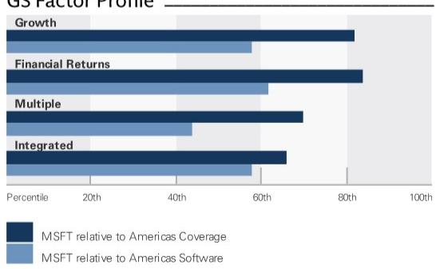
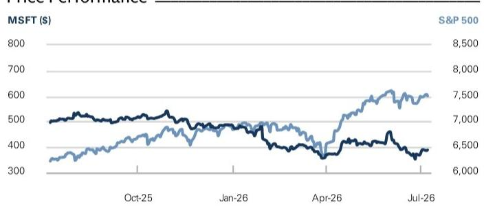
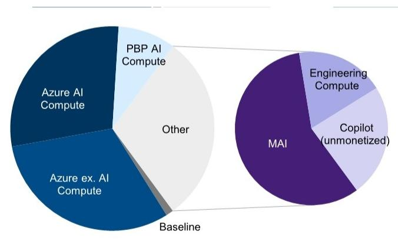
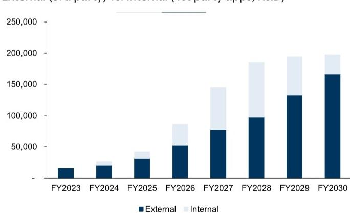
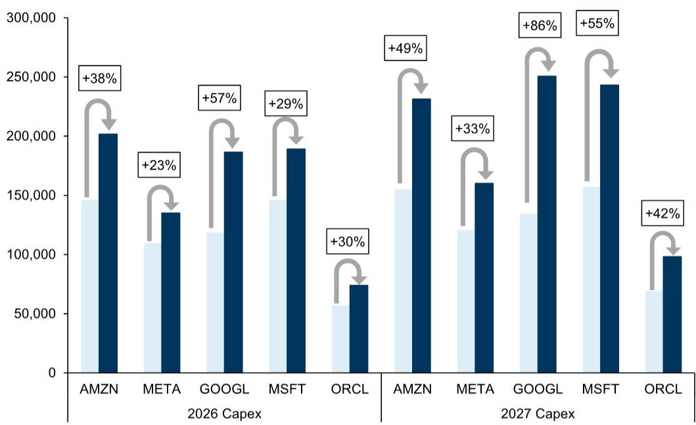
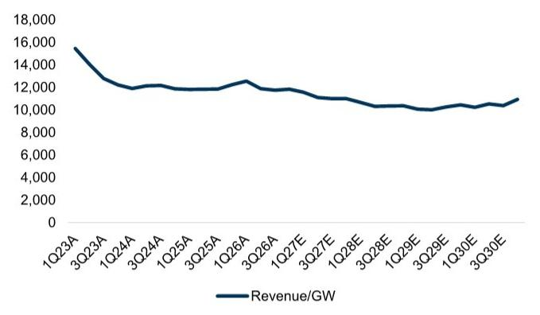
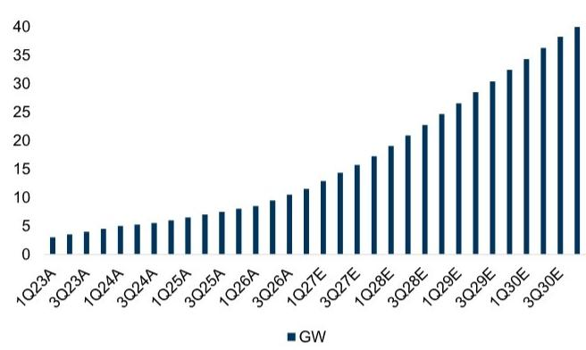

# Microsoft Corp. (MSFT)

# Four Key Themes into 4QFY EPS

MSFT

12m Price Target: \$610.00

Price: \$388.84

Upside: $56.9\%$

Microsoft will report 4QFY (June) results on 7/29. Since 3Q EPS on 4/29, the stock is down $5\%$ (vs. the Nasdaq up $5\%$), we believe primarily because of three overhangs: 1) upward revisions to capex with only small upward revisions to Azure, particularly given new signs that capex may be elevated for longer (e.g. Google's \$80bn equity raise); 2) concerns around Microsoft's exposure to increased memory pricing via Nvidia, relative to competitors with more mature internal silicon offerings; and 3) the potential for Microsoft's knowledge worker applications business (Office 365) to be disintermediated with new AI competition, such as Claude Cowork, fueled by mixed reviews on Copilot.

We think risk/reward is positive into the print: the near-term fundamental outlook has improved and believe investor expectations are low:

For 4QFY, Azure growth remains supply constrained but should accelerate for the second consecutive quarter. We see 40-41% cc growth as likely (vs. guidance of 39-40% cc).

For 1QFY, we expect Azure guidance of 40-41% vs. the Street at 41% cc (with the potential for Microsoft to ultimately report slightly above this). Recall that Microsoft guided Azure to accelerate modestly in 1HFY27 vs. 2HFY26.

We are raising our capex estimates for FY28-30 by \~10% based on ongoing supply/demand commentary and updated AI investment expectations from chip vendors. We are now at \$319bn for FY28 (+30% yoy) including financial leases (\$278bn excluding), vs. \$287bn prior and the Street at \$252bn including financial leases.

\- On Copilot, we think a sustainable M365 acceleration will likely take time, but we expect positive datapoints in the meanwhile e.g. with Microsoft's seat count disclosure (>20mn in 3Q and

Gabriela Borges, CFA
+1(212)902-7839 | gabriela.borges@gs.com
GS & Co. LLC

Callie Valenti  
+1(212)357-2790 | callie.valenti@gs.com  
GS & Co. LLC

Selina Zhang  
+1(212)357-9979 | selina.zhang@gs.com  
GS & Co. LLC

<table><tr><td>Key Data</td></tr>
<tr><td>Market cap: $2.9tr</td></tr>
<tr><td>Enterprise value: $2.9tr</td></tr>
<tr><td>3m ADTV: $16.2bn</td></tr>
<tr><td>United States</td></tr>
<tr><td>Americas Software</td></tr>
<tr><td>M&amp;A Rank: 3</td></tr>
</table>

GS Forecast

<table><tr><td></td><td>6/25</td><td>6/26E</td><td>6/27E</td><td>6/28E</td></tr>
<tr><td>Revenue ($ mn) New</td><td>281,724.0</td><td>329,440.2</td><td>387,103.7</td><td>466,617.4</td></tr>
<tr><td>Revenue ($ mn) Old</td><td>281,724.0</td><td>329,440.2</td><td>387,103.7</td><td>463,474.2</td></tr>
<tr><td>EBITDA ($ mn)</td><td>156,528.0</td><td>193,093.1</td><td>240,672.0</td><td>309,384.6</td></tr>
<tr><td>EBIT ($ mn)</td><td>128,528.0</td><td>153,454.1</td><td>178,230.1</td><td>212,522.7</td></tr>
<tr><td>EPS ($) New</td><td>13.91</td><td>16.75</td><td>19.32</td><td>22.93</td></tr>
<tr><td>EPS ($) Old</td><td>13.91</td><td>16.75</td><td>19.47</td><td>23.61</td></tr>
<tr><td>P/E (X)</td><td>30.5</td><td>23.2</td><td>20.1</td><td>17.0</td></tr>
<tr><td>Dividend yield (%)</td><td>0.8</td><td>0.9</td><td>0.9</td><td>0.9</td></tr>
<tr><td>Net debt/EBITDA (X)</td><td>(0.3)</td><td>(0.2)</td><td>(0.2)</td><td>(0.1)</td></tr>
<tr><td></td><td>3/26</td><td>6/26E</td><td>9/26E</td><td>12/26E</td></tr>
<tr><td>EPS ($)</td><td>4.27</td><td>4.22</td><td>4.66</td><td>4.77</td></tr>
</table>

GS Factor Profile

  
Source: Company data, GS estimates. See disclosures for details.

Microsoft Corp. (MSFT) Rating since Jan 21, 2021

Ratios & Valuation

<table><tr><td></td><td>6/25</td><td>6/26E</td><td>6/27E</td><td>6/28E</td></tr>
<tr><td>P/E (X)</td><td>30.5</td><td>23.2</td><td>20.1</td><td>17.0</td></tr>
<tr><td>EV/EBITDA (X)</td><td>19.8</td><td>14.7</td><td>11.9</td><td>9.3</td></tr>
<tr><td>EV/sales (X)</td><td>11.0</td><td>8.6</td><td>7.4</td><td>6.2</td></tr>
<tr><td>FCF yield (%)</td><td>2.3</td><td>2.1</td><td>1.0</td><td>0.6</td></tr>
<tr><td>EV/DACF (X)</td><td>22.1</td><td>15.7</td><td>13.2</td><td>10.3</td></tr>
<tr><td>CROCI (%)</td><td>29.6</td><td>30.9</td><td>28.5</td><td>27.9</td></tr>
<tr><td>ROE (%)</td><td>33.9</td><td>32.0</td><td>28.9</td><td>27.0</td></tr>
<tr><td>Net debt/EBITDA (X)</td><td>(0.3)</td><td>(0.2)</td><td>(0.2)</td><td>(0.1)</td></tr>
<tr><td>Net debt/equity (%)</td><td>(15.0)</td><td>(9.4)</td><td>(6.9)</td><td>(3.3)</td></tr>
<tr><td>Interest cover (X)</td><td>53.9</td><td>52.6</td><td>72.5</td><td>113.3</td></tr>
<tr><td>Inventory days</td><td>4.5</td><td>3.6</td><td>3.6</td><td>3.5</td></tr>
<tr><td>Receivable days</td><td>82.2</td><td>82.9</td><td>81.0</td><td>77.4</td></tr>
<tr><td>Days payable outstanding</td><td>103.3</td><td>114.2</td><td>126.2</td><td>129.2</td></tr>
</table>

Growth & Margins (%)

<table><tr><td></td><td>6/25</td><td>6/26E</td><td>6/27E</td><td>6/28E</td></tr>
<tr><td>Total revenue growth</td><td>14.9</td><td>16.9</td><td>17.5</td><td>20.5</td></tr>
<tr><td>EBITDA growth</td><td>20.9</td><td>23.4</td><td>24.6</td><td>28.6</td></tr>
<tr><td>EPS growth</td><td>17.9</td><td>20.5</td><td>15.3</td><td>18.7</td></tr>
<tr><td>DPS growth</td><td>10.6</td><td>9.9</td><td>2.2</td><td>0.0</td></tr>
<tr><td>Gross margin</td><td>68.8</td><td>67.7</td><td>65.1</td><td>62.2</td></tr>
<tr><td>EBIT margin</td><td>45.6</td><td>46.6</td><td>46.0</td><td>45.5</td></tr>
</table>

<table><tr><td colspan="5">Balance Sheet ($ mn)</td></tr>
<tr><td></td><td>6/25</td><td>6/26E</td><td>6/27E</td><td>6/28E</td></tr>
<tr><td>Cash &amp; cash equivalents</td><td>30,242.0</td><td>30,736.0</td><td>43,715.0</td><td>41,557.3</td></tr>
<tr><td>Accounts receivable</td><td>69,905.0</td><td>79,687.5</td><td>92,138.8</td><td>105,723.6</td></tr>
<tr><td>Inventory</td><td>938.0</td><td>1,149.4</td><td>1,492.1</td><td>1,923.5</td></tr>
<tr><td>Other current assets</td><td>90,046.0</td><td>83,838.5</td><td>62,103.4</td><td>44,428.3</td></tr>
<tr><td>Total current assets</td><td>191,131.0</td><td>195,411.4</td><td>199,449.4</td><td>193,632.8</td></tr>
<tr><td>Net PP&amp;E</td><td>229,789.0</td><td>338,629.0</td><td>524,350.5</td><td>748,223.0</td></tr>
<tr><td>Net intangibles</td><td>142,113.0</td><td>137,986.0</td><td>135,086.0</td><td>133,086.0</td></tr>
<tr><td>Total investments</td><td>15,405.0</td><td>33,683.0</td><td>33,683.0</td><td>33,683.0</td></tr>
<tr><td>Other long-term assets</td><td>40,565.0</td><td>42,052.0</td><td>42,038.3</td><td>45,697.7</td></tr>
<tr><td>Total assets</td><td>619,003.0</td><td>747,761.4</td><td>934,607.2</td><td>1,154,322.5</td></tr>
<tr><td>Accounts payable</td><td>27,724.0</td><td>38,803.2</td><td>54,572.7</td><td>70,349.7</td></tr>
<tr><td>Short-term debt</td><td>0.0</td><td>0.0</td><td>0.0</td><td>0.0</td></tr>
<tr><td>Current lease liabilities</td><td>-</td><td>-</td><td>-</td><td>-</td></tr>
<tr><td>Other current liabilities</td><td>113,494.0</td><td>123,623.5</td><td>138,063.4</td><td>159,122.3</td></tr>
<tr><td>Total current liabilities</td><td>141,218.0</td><td>162,426.7</td><td>192,636.1</td><td>229,472.0</td></tr>
<tr><td>Long-term debt</td><td>40,152.0</td><td>27,003.5</td><td>18,164.5</td><td>9,325.5</td></tr>
<tr><td>Non-current lease liabilities</td><td>17,437.0</td><td>16,703.0</td><td>16,703.0</td><td>16,703.0</td></tr>
<tr><td>Other long-term liabilities</td><td>74,007.0</td><td>101,442.2</td><td>143,527.2</td><td>183,884.6</td></tr>
<tr><td>Total long-term liabilities</td><td>134,306.0</td><td>148,235.4</td><td>181,933.3</td><td>213,976.0</td></tr>
<tr><td>Total liabilities</td><td>275,524.0</td><td>310,662.1</td><td>374,569.4</td><td>443,448.0</td></tr>
<tr><td>Preferred shares</td><td>-</td><td>-</td><td>-</td><td>-</td></tr>
<tr><td>Total common equity</td><td>343,479.0</td><td>437,099.3</td><td>560,037.8</td><td>710,874.5</td></tr>
<tr><td>Minority interest</td><td>-</td><td>-</td><td>-</td><td>-</td></tr>
<tr><td>Total liabilities &amp; equity</td><td>619,003.0</td><td>747,761.4</td><td>934,607.2</td><td>1,154,322.5</td></tr>
<tr><td>BVPS ($)</td><td>46.21</td><td>58.84</td><td>75.27</td><td>95.24</td></tr>
</table>

Price Performance  

Cash Flow (\$ mn)

<table><tr><td></td><td>6/25</td><td>6/26E</td><td>6/27E</td><td>6/28E</td></tr>
<tr><td>Net income</td><td>101,832.0</td><td>129,372.9</td><td>144,251.5</td><td>171,710.4</td></tr>
<tr><td>D&amp;A add-back</td><td>34,153.0</td><td>43,999.3</td><td>62,442.0</td><td>96,861.9</td></tr>
<tr><td>Minority interest add-back</td><td>-</td><td>-</td><td>-</td><td>-</td></tr>
<tr><td>Net (inc)/dec working capital</td><td>(5,350.0)</td><td>(8,324.0)</td><td>15,616.0</td><td>15,192.7</td></tr>
<tr><td>Others</td><td>5,527.0</td><td>9,510.0</td><td>10,478.4</td><td>11,434.2</td></tr>
<tr><td>Cash flow from operations</td><td>136,162.0</td><td>174,558.2</td><td>232,787.9</td><td>295,199.3</td></tr>
<tr><td>Capital expenditures</td><td>(64,551.0)</td><td>(112,596.1)</td><td>(203,178.5)</td><td>(278,376.9)</td></tr>
<tr><td>Acquisitions</td><td>(5,978.0)</td><td>(1,291.0)</td><td>-</td><td>-</td></tr>
<tr><td>Divestitures</td><td>-</td><td>-</td><td>-</td><td>-</td></tr>
<tr><td>Others</td><td>(2,070.0)</td><td>(3,232.0)</td><td>24,000.0</td><td>22,167.0</td></tr>
<tr><td>Cash flow from investing</td><td>(72,599.0)</td><td>(117,119.1)</td><td>(179,178.5)</td><td>(256,209.9)</td></tr>
<tr><td>Dividends paid</td><td>(24,082.0)</td><td>(26,442.9)</td><td>(27,076.2)</td><td>(27,162.6)</td></tr>
<tr><td>Share issuance/(repurchase)</td><td>(16,364.0)</td><td>(21,010.7)</td><td>(4,715.3)</td><td>(5,145.4)</td></tr>
<tr><td>Inc/(dec) in debt</td><td>(8,962.0)</td><td>(7,419.5)</td><td>(8,839.0)</td><td>(8,839.0)</td></tr>
<tr><td>Others</td><td>(2,228.0)</td><td>(2,072.0)</td><td>-</td><td>-</td></tr>
<tr><td>Cash flow from financing</td><td>(51,636.0)</td><td>(56,945.1)</td><td>(40,630.4)</td><td>(41,147.0)</td></tr>
<tr><td>Total cash flow</td><td>11,927.0</td><td>494.0</td><td>12,979.0</td><td>(2,157.6)</td></tr>
<tr><td>Free cash flow</td><td>71,611.0</td><td>61,962.1</td><td>29,609.4</td><td>16,822.3</td></tr>
<tr><td>Free cash flow per share (basic) ($)</td><td>9.63</td><td>8.34</td><td>3.98</td><td>2.25</td></tr>
</table>

Source: FactSet. Price as of 7 Jul 2026 close.

Income Statement (\$ mn)

<table><tr><td colspan="5">Income Statement ($ mn)</td></tr>
<tr><td></td><td>6/25</td><td>6/26E</td><td>6/27E</td><td>6/28E</td></tr>
<tr><td>Total revenue</td><td>281,724.0</td><td>329,440.2</td><td>387,103.7</td><td>466,617.4</td></tr>
<tr><td>Cost of goods sold</td><td>(87,831.0)</td><td>(106,274.8)</td><td>(135,052.6)</td><td>(176,457.0)</td></tr>
<tr><td>SG&amp;A</td><td>(32,877.0)</td><td>(34,522.8)</td><td>(35,817.3)</td><td>(36,593.7)</td></tr>
<tr><td>R&amp;D</td><td>(32,488.0)</td><td>(35,188.6)</td><td>(38,003.7)</td><td>(41,044.0)</td></tr>
<tr><td>Other operating inc./(exp.)</td><td>-</td><td>-</td><td>-</td><td>-</td></tr>
<tr><td>EBITDA</td><td>156,528.0</td><td>193,093.1</td><td>240,672.0</td><td>309,384.6</td></tr>
<tr><td>Depreciation &amp; amortization</td><td>(28,000.0)</td><td>(39,639.0)</td><td>(62,442.0)</td><td>(96,861.9)</td></tr>
<tr><td>EBIT</td><td>128,528.0</td><td>153,454.1</td><td>178,230.1</td><td>212,522.7</td></tr>
<tr><td>Net interest inc./(exp.)</td><td>262.0</td><td>266.8</td><td>(141.7)</td><td>(534.5)</td></tr>
<tr><td>Income/(loss) from associates</td><td>-</td><td>-</td><td>-</td><td>-</td></tr>
<tr><td>Pre-tax profit</td><td>126,319.0</td><td>154,741.9</td><td>178,088.3</td><td>211,988.2</td></tr>
<tr><td>Provision for taxes</td><td>(22,442.0)</td><td>(29,852.1)</td><td>(33,836.8)</td><td>(40,277.8)</td></tr>
<tr><td>Minority interest</td><td>-</td><td>-</td><td>-</td><td>-</td></tr>
<tr><td>Preferred dividends</td><td>-</td><td>-</td><td>-</td><td>-</td></tr>
<tr><td>Net inc. (pre-exceptionals)</td><td>103,877.0</td><td>124,889.9</td><td>144,251.5</td><td>171,710.4</td></tr>
<tr><td>Net inc. (post-exceptionals)</td><td>101,832.0</td><td>129,372.9</td><td>144,251.5</td><td>171,710.4</td></tr>
<tr><td>EPS (basic, pre-except) ($)</td><td>13.97</td><td>16.81</td><td>19.39</td><td>23.00</td></tr>
<tr><td>EPS (diluted, pre-except) ($)</td><td>13.91</td><td>16.75</td><td>19.32</td><td>22.93</td></tr>
<tr><td>EPS (ex-ESO exp., dil.) ($)</td><td>--</td><td>--</td><td>--</td><td>--</td></tr>
<tr><td>DPS ($)</td><td>3.24</td><td>3.56</td><td>3.64</td><td>3.64</td></tr>
<tr><td>Div. payout ratio (%)</td><td>23.2</td><td>21.2</td><td>18.8</td><td>15.8</td></tr>
<tr><td>Wtd avg shares out. (basic) (mn)</td><td>7,433.8</td><td>7,429.0</td><td>7,440.3</td><td>7,464.1</td></tr>
<tr><td>Wtd avg shares out. (diluted) (mn)</td><td>7,467.8</td><td>7,454.0</td><td>7,465.3</td><td>7,489.1</td></tr>
</table>

Source: Company data, GS estimates.

15mn in 2QFY), in its AI disclosure (\$37mn in ARR/+123\% yoy in 3Q, likely 42-43mn /+115\%-120\% yoy in 4Q), and in more commentary around a frontier ecosystem being built alongside frontier models.

For the stock to begin outperforming, we believe addressing overhangs will be key: a) new supply coming online, such that Azure can beat and raise even while Microsoft makes internal investments; b) more datapoints on production progress with Maia, AMD as a second source, and memory procurement strategy; c) more Copilot seat monetization alongside better user feedback and engagement. We see 12-month risk/reward as favorable at current levels and continue to view Microsoft as well positioned in our coverage to compound AI driven product cycles, from AI compute leadership to Copilot and agent orchestration at the platform and application layers.

## 1) 4Q Azure Expectations

We see a reasonable case where Microsoft reports Azure growth of 40-41% cc (a similar beat to last quarter at 1%) and guides to 40-41% cc for 4Q26 vs. the Street at 41% cc. Recall that Azure growth in any given quarter is a function of new capacity coming online, and Microsoft's strategic allocation to internal use cases vs. external customers.

Supply remains constrained but capacity has been increasing. While guidance continues to be supply driven, we are encouraged by Microsoft's ability to drive more revenue out of its existing infrastructure and by capacity continuing to come online, such that Azure growth accelerated in 3QFY and is on track to accelerate in 4Q and 1H. In particular, the Fairwater datacenter in Wisconsin is expected to scale to 2GW of capacity in 2026, although capacity will come online unevenly, which makes it challenging to track from the outside.

■ Strategic allocation of capacity towards internal use cases trades off Azure growth. Microsoft is prioritizing compute for first party applications (Copilot) and internal R&D (e.g., MAI) over short-term Azure revenue to ultimately drive greater strategic AI positioning across multiple layers of the technology stack and better returns over the medium term. Recall that in 2Q, Microsoft stated that Azure would have grown >40% (44% GSe) if it had allocated all incremental GPU capacity to Azure. We expect the company to continue making such strategic allocation decisions between internal initiatives and external customers; post a step up in LTM investment, we believe this internal mix as a % of total allocations is closer to a steady-state trajectory. Please see our February deep dive into capacity allocation here.

Exhibit 1: We estimate FY26 compute capex by use case to inform our Azure estimates  
  
Source: Company data, GS Global Investment Research

Exhibit 2: Our estimate of external vs. internal compute allocation  
  
Source: Company data, GS Global Investment Research

## 2) Capex and Internal Silicon

There is still upward bias to capex; we raise our FY28/29/30 estimates by \~10%. This follows the Street raising FY27 capex by 37% after 3Q earnings when Microsoft guided to \$190bn of capex in CY26. While we believe Microsoft has front loaded more of its non-GPU capex over the last 2-3 years, AI spending expectations from NVDA, AVGO, and AMD support upward capex revisions, as do new signals from competitors such as Google's \$80bn equity raise and Meta's new entry into selling compute. Additionally, Microsoft procures a greater percentage of its silicon from NVIDIA vs. other hyperscalers given 1) their exposure to OpenAI (which has historically been more optimized for NVIDIA hardware) and 2) Maia being less mature than other custom silicon. In April, Microsoft disclosed that \~\$25bn of CY26 capex (\~13%) is associated with higher component pricing, and we expect that >50% of this is tied to memory increases. We are now 7%/26%/14%/10% above the Street (FactSet) for FY27/28/29/30 capex. As a result of higher capex expectations and our prior work on capex conversion to revenue, we raise Azure revenue by 2%/3%/7% in FY28/29/30.

On internal silicon: The near-term bear case is well understood: Maia is behind peers, NVIDIA dependence remains high, and the company lacks the multi-generation custom silicon track record of competitors. Our focus shifts to the steps Microsoft can take to improve its silicon strategy, including: ramping volume with AMD as a second source (our November Ignite meeting with Scott Guthrie indicated an ongoing ramp), and a step function improvement in Maia 300 next year that reflects learnings to date from Maia 100 and Maia 200 limitations. Microsoft can strengthen its position by building a broader silicon ecosystem, securing deeper design and manufacturing partnerships, and placing measured bets on alternative inference-oriented architectures that could prove more efficient for agentic AI workloads over time. At the same time, closing the gap in memory (Maia 200 has HBM3 vs. NVIDIA Vera Rubin has HBM4) will be increasingly important, as memory bandwidth is a key determinant of AI system performance and economics. Ultimately, the opportunity for Microsoft is not necessarily to build the industry's best chip, but to optimize hardware, software, and infrastructure around its own unique workloads.

Exhibit 3: Hyperscalers' 2026/2027 capex estimates have increased by $36\% / 55\%$ since January

  
AMZN, GOOGL, and META capex refers to additions to PP&E; MSFT capex includes fin leases  
Source: Visible Alpha Consensus Data

## What our forecasts imply for revenue/GW

Our forecasts imply revenue/GW declines from \~12bn in FY26 to \~10bn in FY29. The primary drivers of this decline are mix shift toward internal allocations (not monetized directly in Azure) and input cost increases—with upside to Azure numbers driven by either new GW coming online, improving revenue/GW, or supply chain efficiencies driving lower compute spend per GW added.

A case for improving revenue/GW: Improving revenue/GW could be possible as a result of better GW monetization through Copilot (i.e. customers moving past free trials), revenue mix toward inference vs. training, and improvements in the amount of compute delivered per GW via improving silicon (either from advancements in Microsoft's internal Maia chips or through new generations of NVIDIA chips).

In this analysis, we assume that compute capex per GW added is going up due to higher component pricing. We also attempt to adjust out any revenue within Azure that is not tied to compute spend and factor in hypothetical cloud hosting costs of Microsoft's PBP business in order to normalize vs. pure play cloud computing businesses.

This analysis suggests that Microsoft's revenue/GW is \~\$12bn, lower vs. our previous estimates driven by updated company commentary and further adjustments.

We also note Microsoft's per GW economics are benefiting from more meaningful PaaS bundling and cross sell, such as via CPU pull through as AI applications drive incremental consumption of Azure's broader stack, including CPU compute, storage, databases, and networking. These are higher margin services today vs.

GPU-heavy inference workloads. Additionally, continued improvements in model efficiency and hardware performance should result in lower cost delivery of AI over time. We include a more detailed analysis of gross margin dynamics in our Agentic Economy May Report.

Exhibit 4: We see a scenario where Microsoft pulls levers to realize steady or improving revenue/GW, which would drive upside to our estimates  
  
Source: Company data, GS Global Investment Research

Exhibit 5: We estimate Microsoft will scale to \~40 GW of capacity by mid 2030  
  
Source: Company data, GS Global Investment Research

## 3) Copilot and the Frontier Ecosystem

Shifting Center of Gravity: As discussed in Revisiting Moats IV, there has been increased focus on value increasingly accruing to the ecosystem that helps enterprises safely operationalize AI. Microsoft's view is that the opportunity for enterprises is to differentiate by running a model that continuously learns from their proprietary data, workflows, and institutional knowledge (Frontier ecosystem post). Doing this in a way that does not expose IP to foundation model companies (private reinforcement learning) is key. The emerging debate is less about which model wins and more about who owns the enterprise intelligence layer sitting above those models. Microsoft appears increasingly well positioned as the orchestration, security, and governance layer that allows customers to benefit from frontier AI innovation without fully outsourcing control to a single model vendor. Microsoft's recent \$2.5 bn investment in its new Frontier Company organization, which expands on the FDE model, is a tangible example of this strategy and underscores the belief that long-term AI value creation will come from connecting models, proprietary enterprise data, workflows, and business outcomes rather than simply providing access to the most capable frontier model.

The impact of increased Copilot usage on margins: Given Copilot pricing is seat based, we note investor concerns that increased usage will pressure margins for this business medium term. In our view, Microsoft should be able to charge commensurate with value provided and has been thoughtful about including fair usage clauses in contracts as well as charging for higher compute features. We have already seen Microsoft be reactive to higher usage in GitHub Copilot where they pivoted to more usage based pricing. Given capacity constraints, Microsoft has the ability to monetize AI compute through either Azure or Copilot — with Copilot as the higher margin option which supports increased usage benefiting margins longer term.

## 4) The value of Microsoft's gaming business

Based on a mark-to-market version of our SOTP analysis published on 4/6/26 (link), we estimate the value of Microsoft's gaming business at \~\$30bn. On 7/6, Microsoft announced a significant restructuring of its Xbox business and is spinning out four of its studios (Compulsion Games, Double Fine Productions, Ninja Theory, and Undead Labs). Microsoft has invested in its gaming business in recent years, including by acquiring Activision Blizzard in 2023 for \~\$70bn, but growth has been disappointing in recent quarters (we expect revenue down 5% in FY26) and investment in AI data centers is causing costs to increase
