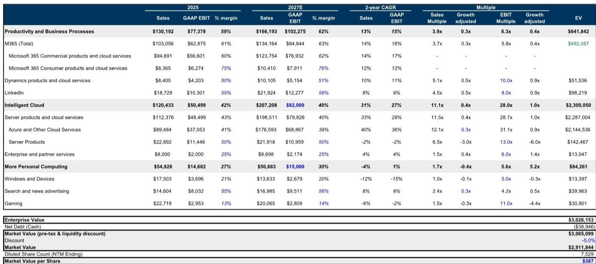

# Microsoft’s Upcoming Earnings Will Test Whether the Market Has Priced in Enough Bad News on AI Spending

Microsoft reports its fiscal fourth-quarter results on July 29, and the stock has already declined 5 percent since its last earnings call, underperforming a Nasdaq that rose 5 percent over the same period. This divergence is not random. It reflects three specific overhangs that have accumulated in the minds of observers: rising capital expenditure commitments that outpace revenue acceleration, concerns about Microsoft’s dependence on NVIDIA for silicon at a time when memory pricing is escalating, and growing anxiety that AI-powered alternatives could disrupt the company’s entrenched Office 365 franchise. Each of these concerns is real. But together, they may have created a setup where the bar for disappointment is now unusually low. The central argument of this analysis is that Microsoft’s risk-reward profile is favorable into this print because the near-term fundamental outlook has improved, observer expectations have been compressed, and the company’s strategic position across multiple layers of the AI stack remains difficult to replicate. The question is not whether Microsoft faces headwinds. It is whether the market has already discounted them.

The pattern that matters most is the relationship between capital spending and revenue conversion. Microsoft is in the middle of a multiyear infrastructure buildout that will push capital expenditures to levels that would have seemed implausible just two years ago. Estimates now point to roughly $319 billion in total capex including financial leases for fiscal year 2028, representing 30 percent year-over-year growth. The Street is at $252 billion for the same period. The gap between what Microsoft is spending and what consensus expects is wide and growing. But the nature of this spending is not purely speculative. Microsoft is allocating capacity between external Azure customers and internal use cases such as Copilot and its own AI research. The strategic choice to prioritize internal workloads over short-term Azure revenue is a deliberate trade-off that depresses reported growth in the near term while building a more defensible position across the entire technology stack. Observers who focus only on the capex number without understanding the allocation logic are missing the forest for the trees.

The earnings print on July 29 will provide the first hard data point on whether this strategy is gaining traction. Azure growth is expected to accelerate for the second consecutive quarter, with constant-currency growth likely landing between 40 and 41 percent, above the guidance range of 39 to 40 percent. For the following quarter, guidance is expected to come in at 40 to 41 percent constant-currency growth, roughly in line with Street expectations of 41 percent. These numbers do not scream acceleration. But they represent a meaningful improvement from the supply-constrained environment that has capped Azure’s growth for several quarters. More importantly, they reflect a company that is beginning to convert its enormous infrastructure investments into measurable revenue momentum. The risk is that the market has become so focused on the capex line that it will overlook the revenue line. The opportunity is that Azure growth may surprise to the upside as new capacity comes online, particularly from facilities like the Fairwater datacenter in Wisconsin, which is expected to scale to two gigawatts of capacity during 2026.

## The Market Has Underappreciated That Azure Growth Is About to Accelerate Despite Internal Capacity Allocation Trade-Offs

The most common objection to the constructive view on Microsoft is that its capital spending is growing faster than its cloud revenue. This is true. But it is also incomplete. Microsoft is not simply building data centers and selling the capacity to external customers. It is allocating a significant portion of its compute capacity to internal use cases, including Copilot, first-party AI applications, and research and development on its own silicon. In the second quarter, Microsoft disclosed that Azure would have grown above 40 percent if it had allocated all incremental GPU capacity to external customers. That is a striking admission. It means that the reported Azure growth number is deliberately depressed by strategic choices that management believes will generate higher returns over the medium term.

The implication for observers is straightforward. If Microsoft were to shift even a modest portion of its internal compute allocation back to external customers, Azure growth would inflect sharply. The company is unlikely to do that in the near term because it views internal AI development as a strategic priority. But the optionality is real. As the internal mix of compute allocation approaches a steady state, the drag on Azure growth should diminish. The earnings report will provide the first evidence of whether that inflection is beginning. The key metric to watch is not just the headline Azure growth rate but the commentary around capacity allocation and whether the company signals any change in its internal-versus-external mix. A stable or declining internal allocation would be a powerful signal that Azure growth has further room to accelerate.

## Rising Capital Expenditure Estimates Are Justified by Demand Signals, but the Market Has Not Fully Priced the Revenue They Will Generate

Capital expenditure estimates for Microsoft have been revised upward repeatedly over the past year. The Street raised fiscal year 2027 capex by 37 percent after the third-quarter earnings call, when Microsoft guided to $190 billion in capex for calendar year 2026. The current analysis raises capex estimates for fiscal years 2028 through 2030 by approximately 10 percent, driven by updated expectations from chip vendors and new signals from competitors. Google’s $80 billion equity raise and Meta’s entry into selling compute are independent data points that reinforce the view that AI infrastructure spending will remain elevated for longer than initially anticipated.

But the critical question is whether this spending translates into revenue. The analysis increases Azure revenue estimates by 2 percent, 3 percent, and 7 percent for fiscal years 2028, 2029, and 2030 respectively, based on the updated capex trajectory. These are not dramatic revisions. They reflect a conservative assumption that the conversion of capital into revenue takes time and that Microsoft’s internal allocation decisions will continue to dampen reported growth. Yet even these modest revisions imply that the company’s revenue trajectory is accelerating, not decelerating. Total revenue growth is expected to reach 20.5 percent in fiscal year 2028, up from 14.9 percent in fiscal year 2025. EBITDA growth is expected to reach 28.6 percent in the same period. These are not the numbers of a company that is spending recklessly. They are the numbers of a company that is investing aggressively in a demand environment that supports it.

The risk is that the market has become conditioned to treat every upward capex revision as a negative signal. This is a framing error. Capital spending is not inherently value-destructive. It is value-destructive only if it does not generate an adequate return. Microsoft’s historical return on equity has consistently exceeded 30 percent, and its return on capital employed has remained above 27 percent even as the capital base has expanded. The company has a long track record of converting investment into profitable growth. The current capex cycle is larger in absolute terms than anything the company has undertaken before, but the underlying economics are consistent with past behavior. Observers who dismiss the capex story without examining the revenue conversion are making a categorical mistake.

## The Silicon Dependency on NVIDIA Is a Real Vulnerability, but Microsoft Has More Levers Than the Market Acknowledges

The less constructive view on Microsoft’s silicon strategy is well articulated and partially valid. Microsoft procures a greater percentage of its silicon from NVIDIA than other hyperscalers, largely because of its exposure to OpenAI, which has historically been optimized for NVIDIA hardware. The company’s internal Maia chip is less mature than custom silicon from competitors. Maia 200 uses HBM3 memory while NVIDIA’s Vera Rubin uses HBM4, creating a bandwidth disadvantage that directly affects AI system performance and economics. These are genuine competitive gaps.

But the market may be overestimating their significance. Microsoft does not need to build the industry’s best chip to succeed. It needs to optimize hardware, software, and infrastructure around its own unique workloads. The company has multiple levers to improve its silicon position. It is ramping volume with AMD as a second source, a process that was confirmed in meetings with senior leadership. The next generation Maia 300 is expected to reflect learnings from the limitations of Maia 100 and Maia 200, potentially closing part of the performance gap. Microsoft can also build a broader silicon ecosystem through deeper design and manufacturing partnerships, and it can place measured bets on alternative inference-oriented architectures that may prove more efficient for agentic AI workloads over time.

The more important point is that NVIDIA dependence is a near-term constraint, not a permanent structural weakness. Memory pricing has been a significant driver of Microsoft’s capex inflation, with approximately $25 billion of calendar year 2026 capex associated with higher component pricing, more than half of which is tied to memory increases. But memory costs are cyclical. As HBM supply expands and competition increases, pricing pressure should moderate. The market is extrapolating current cost dynamics into perpetuity, which is almost certainly wrong. The earnings call may provide updated commentary on memory procurement strategy and the ramp of alternative silicon sources. Any positive signal on either front would be a meaningful catalyst for the company.

## Copilot Monetization Will Take Time, but the Leading Indicators Are Moving in the Right Direction

The most difficult overhang to assess is the threat to Microsoft’s knowledge worker applications business. Office 365 is one of the most profitable franchises in the history of enterprise software. The emergence of AI-powered alternatives that could disintermediate the office productivity suite is a legitimate strategic concern. Mixed reviews on Copilot have not helped. The market is asking a reasonable question: if users are not fully embracing Copilot, what protects Microsoft from a new entrant that offers a better AI-native experience?

The answer is that Copilot monetization is a multiyear journey, not a single-quarter event. The leading indicators are positive. Microsoft disclosed that Copilot seat count exceeded 20 million in the third quarter, up from 15 million in the second quarter. AI-related annual recurring revenue reached $37 million in the third quarter, representing 123 percent year-over-year growth, and is expected to reach $42 million to $43 million in the fourth quarter with growth of 115 to 120 percent. These are early-stage numbers, but they show adoption accelerating, not decelerating. The company is also building a frontier ecosystem alongside frontier models, which should create network effects that are difficult for competitors to replicate.

The sustainable acceleration in M365 growth will likely require better user feedback and engagement metrics, which take time to develop. But the market is underestimating the structural advantages that Microsoft has in this market. The company owns the platform layer through Windows and the application layer through Office. It controls the distribution channel for enterprise productivity software. A new entrant would need to displace not just a product but an entire ecosystem of integrations, workflows, and user habits. That is possible in theory but extraordinarily difficult in practice. The earnings call will provide updated data points on seat count, ARR, and user engagement. Any improvement in these metrics would reduce the perceived risk of disruption and support a revaluation of the company.

## What the Report Does Not Fully Answer: The Sustainability of the Internal Allocation Trade-Off and the Timing of Silicon Improvements

This analysis makes a coherent case that Microsoft’s risk-reward is favorable. But it leaves several important questions unresolved. The most critical is whether the internal allocation of compute capacity is approaching a steady state or whether it will continue to depress Azure growth for several more quarters. The analysis suggests that the internal mix is closer to a steady-state trajectory after a step-up in investment, but this is an inference, not a data point. Observers will need to hear directly from management on whether the allocation ratio is stabilizing and what that means for Azure growth in the second half of the fiscal year.

The second unresolved question is the timing of improvements in Microsoft’s silicon strategy. The analysis identifies multiple levers that Microsoft can pull, but it does not provide a timeline for when those levers will produce measurable results. The Maia 300 is expected to reflect learnings from earlier generations, but the market has no visibility into whether the next-generation chip will close the performance gap with NVIDIA or whether AMD will become a meaningful second source in the near term. These are binary uncertainties that will be resolved only through product announcements and customer adoption data.

The third question is the competitive dynamics in the knowledge worker market. The analysis argues that Microsoft’s ecosystem advantages are structural, but it does not quantify the risk from new entrants that may achieve product-market fit faster than expected. The market is pricing in a non-trivial probability of disruption. Whether that probability is too high or too low depends on assumptions about user behavior, switching costs, and the pace of AI innovation that are inherently uncertain.

## A Decision Framework for Observers: Focus on Three Leading Indicators, Not the Headline Numbers

For observers trying to position ahead of the earnings print, the challenge is to separate signal from noise. The following framework focuses on the three leading indicators that will determine whether the company outperforms or underperforms in the next twelve months.

First, track the relationship between capex and Azure revenue growth. If Azure growth accelerates while capex continues to rise, the market will begin to price in the revenue conversion thesis. If Azure growth disappoints despite higher capex, the less constructive view will strengthen. The key metric is not the absolute level of capex but the incremental revenue generated per dollar of incremental capex. A stable or improving conversion ratio is a positive signal.

Second, monitor the data points on silicon diversification. Any announcement of increased volume commitments to AMD, progress on Maia 300, or improvements in memory procurement would reduce the perceived risk of NVIDIA dependence. The absence of such data points is not necessarily negative, because these developments take time. But a concrete signal would be a powerful catalyst.

Third, watch the Copilot adoption metrics. Seat count growth, ARR growth, and user engagement data are the best available proxies for whether the knowledge worker franchise is under threat or gaining strength. Acceleration in any of these metrics would reduce the disruption discount that the market is applying to the company.

These three indicators are not independent. They are connected by the underlying logic of Microsoft’s strategy: invest aggressively in infrastructure, diversify the silicon supply chain, and embed AI into the platform and application layers. The earnings print on July 29 will provide data points on all three. The market has already priced in a pessimistic view. If the data points are even modestly positive, the company has significant upside.

## Join the Community to Read the Full Report and Review the Original Charts

The analysis above draws on detailed financial models, capacity allocation estimates, and competitive benchmarking that cannot be fully captured in a single article. The full report includes the complete income statement projections, cash flow analysis, valuation framework, and the original charts that illustrate the relationship between capex, Azure growth, and internal capacity allocation. For those who want to understand the nuances of Microsoft’s AI strategy and build their own conviction around the earnings setup, the full report provides the data and analytical framework to do so. Join the community to read the full report and review the original charts.

*For informational purposes only. Portions may be generated, translated, summarized, or edited with AI assistance based on source materials and may contain omissions or errors. Please verify independently. This is not professional advice.*

For informational purposes only. Portions may be generated, translated, summarized, or edited with AI assistance based on source materials and may contain omissions or errors. Please verify independently. This is not professional advice.

