# 户外广告行业研究

## 2026年增长展望及近期并购动态；JCDecaux/Stroeer上半年/二季度业绩预览

展望2026年，我们预计JCDecaux和Stroeer的户外广告有机收入增长将加速至+4.6%/+5.6%，与行业同行基本一致（对比2025年的+1.8%/+1.8%），主要得益于较低的基数效应和重大体育赛事。从中期来看，我们仍对户外广告的结构性前景持建设性看法，鉴于其较高的回报率及为广告主提供的灵活性，户外广告仍是面对数字媒体份额转移时最具韧性的"传统"媒介。

我们还认为，整体竞争环境已有所改善，过去几年变得更加理性，随着估值倍数压缩，行业对盈利能力的关注度有所提升。我们注意到近期户外广告资产的并购活动/消息，包括oOh!media、Stroeer和Clear Channel。总体而言，我们认为JCDecaux凭借其在分散市场中的全球领先地位（2025年约8%市场份额，无其他参与者份额超过5%），最有能力把握改善后的环境，并预计未来合同可能获得更有利的收入分成。

我们预览JCDecaux/Stroeer的上半年/二季度业绩：（1）对于JCDecaux：我们对二季度有机增长的预测略高于Visible Alpha共识数据，上半年EBITDA利润率与共识一致；（2）对于Stroeer：我们对二季度集团EBITDA的预测比共识低3%，收入基本一致。

James Tate
+44(20)7774-3705 | james.tate@gs.com
GS International

Adam Berlin
+44(20)7051-1586 |
adam.berlin@gs.com
GS International

Pulkit Gubgotra +1(332)245-7520 | pulkit.gubgotra@gs.com GS India SPL

## 户外广告的结构性驱动因素依然稳固，近期并购活动/消息不断

## 我们仍对户外广告市场持建设性看法

展望2026年，我们预计JCDecaux和Stroeer的户外广告有机收入增长将加速至+4.6%/+5.6%，与行业同行基本一致（对比2025年的+1.8%/+1.8%），主要得益于较低的基数效应和重大体育赛事。

从中期来看，我们仍对户外广告的结构性前景持建设性看法，鉴于其较高的回报率及为广告主提供的灵活性，户外广告仍是面对数字媒体份额转移时最具韧性的"传统"媒介。我们对户外广告的积极立场反映了优质位置户外广告库存的持续数字化、程序化购买解决方案的发展、利用数据进行受众测量的改进（推动更高的CPM），以及未来在较高运营杠杆下库存利用率的提升，尤其是在街道设施领域。尽管仍存在一些地缘政治不确定性（尤其是中东地区，约占JCDecaux集团收入的5%），且某些地区的宏观环境仍待观察（例如德国商业景气调查仍具挑战性），但我们认为户外广告的结构性驱动因素依然稳固，将推动JCDecaux和Stroeer户外广告板块在中期内实现可持续的中个位数增长复合年增长率。

图表1：我们预计JCDecaux和Stroeer的户外广告收入增长将在2026年重新加速至与市场基本一致的水平...
户外广告，有机收入增长

| 公司 | FY23 | FY24 | FY25 | FY26E | FY27E |
|------|------|------|------|-------|-------|
| JCDecaux | 8.7% | 9.7% | 1.8% | 4.6% | 4.2% |
| Stroeer | 8.3% | 11.5% | 1.8% | 5.5% | 4.5% |
| Clear Channel* | -20.6% | -1.2% | -1.9% | 6.3% | 3.8% |
| Outfront** | 2.7% | 3.9% | 0.4% | 7.7% | 2.1% |
| Lamar*** | 2.1% | 4.2% | 2.1% | 4.3% | 3.4% |
| 平均 | 0.7% | 4.9% | 0.8% | 5.7% | 3.6% |

图表2：...在2025年因上年夏季体育赛事（欧洲杯和奥运会）基数效应而表现较弱之后
JCDecaux和Stroeer的户外广告收入增长（%，同比）
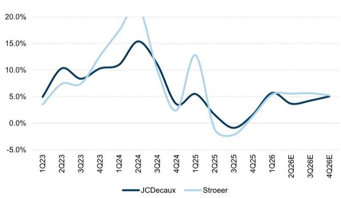
来源：公司数据，GS全球投资研究

图表3：在媒体份额变化中，户外广告一直是韧性较强的"传统"媒介...
广告市场份额变化，2013-18 / 2018-23 / 2023-25
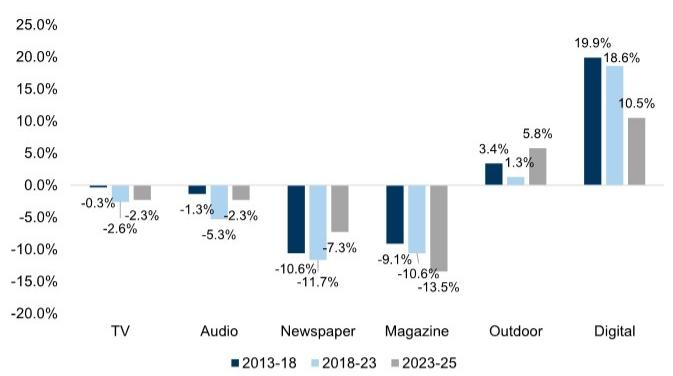
来源：WPP Media

图表4：...预计2026-31年户外广告将增长约5%，由数字户外广告驱动
全球户外广告收入增长，2026-31年复合年增长率
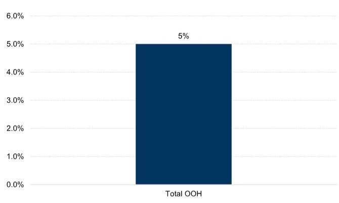
基于WPP Media的2026年半年预测

图表5：全球实际GDP增长与全球户外广告增长之间存在强相关性，R平方为0.78...
全球户外广告增长与全球实际GDP增长相关性，2005-25E
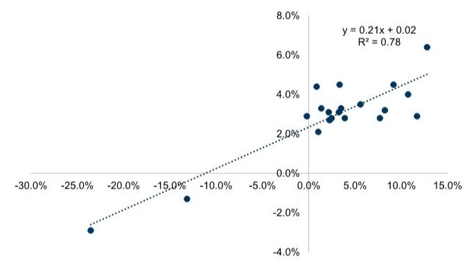
来源：GS全球投资研究，WPP Media

图表6：...意味着未来全球户外广告增长大致为中个位数
全球户外广告增长与全球实际GDP增长（%，同比）
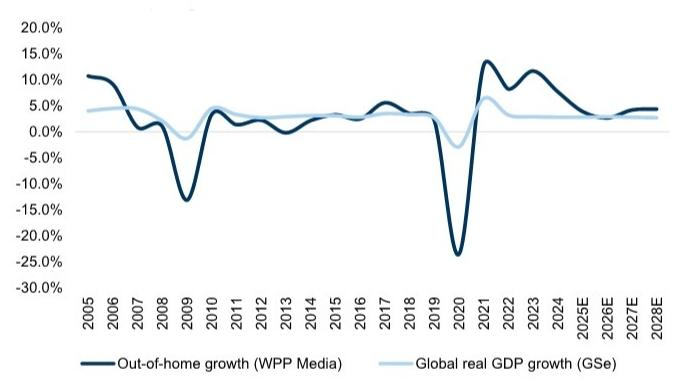
来源：GS全球投资研究，WPP Media

## 竞争环境依然有利，近期并购活动活跃

我们认为整体竞争环境已有所改善，过去几年变得更加理性，随着估值倍数压缩，行业对盈利能力的关注度有所提升。近期户外广告资产的并购活动/消息包括：

- oOh!media：2026年6月，oOh!media收到Pacific Equity Partners (PEP)、I Squared Capital和Oaktree Capital Management修订后的非约束性指示性收购提议，报价趋近于每股1.60澳元（公司估值约8.5亿澳元；详见此处）。此前已有一系列早期提议，包括PEP于2026年4月提出的每股1.40澳元初始主动报价（此处）、I Squared Capital于2026年5月提出的每股1.45澳元报价（此处），以及Bain Capital于2026年6月初提出的后续非约束性提议（此处），但最新报道显示Bain Capital已退出。

Stroeer：2026年4月，彭博报道私募股权读者（由I Squared Capital和Blackstone牵头）有意以35亿欧元或更高估值收购Stroeer的核心户外广告业务和数字内容业务。然而，当月晚些时候有报道称Blackstone已退出竞标财团。此前，2025年10月有报道称，由I Squared Capital牵头的财团正在寻求收购Stroeer的核心户外广告和数字内容业务。我们还注意到，2025年1月，Stroeer发布临时公告，确认收到私募股权读者的指示性报价，此前彭博文章报道Stroeer正在考虑以40亿欧元出售，并已收到包括Hellman & Friedman和KKR在内的私募股权公司的兴趣，估值约30亿欧元。不过，2025年2月有报道称，这两方因价格分歧已退出谈判。

Clear Channel：2026年2月，Mubadala同意与TWG Global合作，以62亿美元收购Clear Channel（详见我们的初步分析此处）。我们注意到，这相当于2026年预期EV/EBITDA约11.7倍的收购倍数（基于LSEG对EBITDA的共识）。2023年10月，Clear Channel表示其打算专注于美国市场，并启动出售其欧洲-北部业务的流程（于2025年4月完成向Bauer Media的出售），同时对其拉丁美洲业务启动战略评估（2025年完成两笔交易）。

从中期来看，我们认为JCDecaux凭借其在分散市场中的全球领先地位（2025年约8%市场份额，无其他参与者份额超过5%），最有能力把握改善后的环境，并预计未来合同可能获得更有利的收入分成。然而，我们仍关注来自全球大型数字平台（如Google、Meta和Amazon）的竞争压力，这些平台正寻求扩大其广告产品，并试图获取更大份额的广告主预算。我们认为户外广告运营商将继续投资于广告技术、程序化能力和测量基础设施以保持竞争力，这可能会影响近期利润率。

## 上半年业绩预览：JCDecaux：我们对二季度有机增长的预测略高，上半年EBITDA利润率与共识一致

我们预测二季度集团有机增长为+3.7%，高于Visible Alpha共识数据（+3.2%）和公司指引（约+3%），主要得益于中东地区交易势头好于预期（约-30%，此前预期约-40%），这得到了我们的航班流量数据支撑（图表9）。我们预计其他地区势头稳健，尤其是美国、英国和拉丁美洲，中国趋势也在本季度有所改善。同时，我们预计世界杯将带来约3000万欧元的增量收入，在二季度和三季度之间平均分配（意味着每季度约120个基点的提振），而新合同在二季度影响大致中性，在三/四季度将带来约150个基点的收益（来自斯德哥尔摩、巴塞罗那和家乐福零售媒体）。总体而言，我们预测上半年集团EBITDA为3.18亿欧元，与共识的3.2亿欧元基本一致，意味着利润率为16.6%（+10个基点；与共识一致）。我们预测调整后净利润为1.1亿欧元（共识：8200万欧元），得益于2026年4月额外出售APG带来的约3500万欧元收益指引（继2024年5月首次出售之后）。

## 细分来看：

对于街道家具，我们预测二季度有机增长为+4.8%（一季度为6.8%），与共识一致。我们预测上半年EBITDA为2.26亿欧元（共识：2.25亿欧元），意味着利润率为22.8%（同比+10个基点；共识：22.7%）。

对于广告牌，我们预测有机增长为+1%（一季度为-2.9%），低于共识的+1.9%。我们预测上半年EBITDA为2800万欧元（与共识一致），意味着利润率为11.0%（同比扩张+10个基点；共识：11.1%）。

对于交通媒体，我们预测有机增长为+3.0%（一季度强劲增长+7.5%），高于共识的+1.4%，主要受中东收入预期改善推动。我们预测上半年EBITDA为6400万欧元（共识：6300万欧元），意味着利润率为9.6%（同比持平；共识：9.3%）。

图表7：JCDecaux：二季度/上半年GSe vs. 共识

| 百万欧元 | 二季度26 |
|---------|---------|
| | GS | VA共识 | GS vs VA共识 |
| 收入 | | | |
| 街道家具 | 549 | 553 | -1% |
| 广告牌 | 141 | 141 | 0% |
| 交通媒体 | 344 | 348 | -1% |
| 总计 | 1,034 | 1,042 | -1% |
| 有机收入增长 | | | |
| 街道家具 | 4.8% | 4.8% | -3bps |
| 广告牌 | 1.0% | 1.9% | -88bps |
| 交通媒体 | 3.0% | 1.4% | 163bps |
| 总计 | 3.7% | 3.2% | 45bps |

| 百万欧元 | 上半年26 |
|---------|---------|
| | GS | VA共识 | GS vs VA共识 |
| 收入 | | | |
| 街道家具 | 988 | 992 | 0% |
| 广告牌 | 256 | 256 | 0% |
| 交通媒体 | 671 | 675 | -1% |
| 总计 | 1,915 | 1,923 | 0% |
| 有机收入增长 | | | |
| 街道家具 | 5.7% | 5.7% | -1bps |
| 广告牌 | -0.8% | -0.4% | -47bps |
| 交通媒体 | 5.2% | 4.3% | 85bps |
| 总计 | 4.6% | 4.4% | 23bps |
| 营业利润 | | | |
| 街道家具 | 226 | 225 | 0% |
| 广告牌 | 28 | 28 | -1% |
| 交通媒体 | 64 | 63 | 2% |
| 总计 | 318 | 320 | -1% |
| %利润率 | | | |
| 街道家具 | 22.8% | 22.7% | 14bps |
| 广告牌 | 11.0% | 11.1% | -12bps |
| 交通媒体 | 9.6% | 9.3% | 26bps |
| 总计 | 16.6% | 16.6% | -3bps |
| 每股收益 | 0.51 | 0.38 | 34% |

来源：Visible Alpha共识数据，GS全球投资研究

图表8：JCDecaux：FY26/27/28 GS vs. 共识

| 百万欧元 | FY26 | | | FY25 |
|---------|------|-------|-------|------|
| | GS | VA共识 | GS vs VA共识 | |
| 收入 | | | | |
| 街道家具 | 2,129 | 2,112 | 1% | 2,013 |
| 广告牌 | 544 | 539 | 1% | 533 |
| 交通媒体 | 1,456 | 1,466 | -1% | 1,421 |
| 总计 | 4,128 | 4,114 | 0% | 3,967 |
| 有机收入增长 | | | | |
| 街道家具 | 5.8% | 5.2% | 61bps | 1.9% |
| 广告牌 | 1.5% | 1.1% | 42bps | -2.3% |
| 交通媒体 | 4.2% | 4.1% | 7bps | 3.3% |
| 总计 | 4.6% | 4.4% | 29bps | 1.8% |
| 营业利润 | | | | |
| 街道家具 | 577 | 576 | 0% | 545 |
| 广告牌 | 96 | 95 | 2% | 94 |
| 交通媒体 | 197 | 200 | -2% | 192 |
| 总计 | 869 | 870 | 0% | 831 |
| %利润率 | | | | |
| 街道家具 | 27.1% | 27.3% | -17bps | 27.1% |
| 广告牌 | 17.7% | 17.6% | 11bps | 17.6% |
| 交通媒体 | 13.5% | 13.6% | -15bps | 13.5% |
| 总计 | 21.1% | 21.1% | -7bps | 20.9% |
| 每股收益 | 1.38 | 1.26 | 9% | 1.23 |
| 调整后净利润 | 295 | 269 | 10% | 263 |
| 自由现金流 | 316 | 310 | 2% | 343 |

| FY27 | | | FY28 | | |
|------|-------|-------|------|-------|-------|
| GS | VA共识 | GS vs VA共识 | GS | VA共识 | GS vs VA共识 |
| 2,224 | 2,210 | 1% | 2,336 | 2,316 | 1% |
| 554 | 550 | 1% | 565 | 558 | 1% |
| 1,521 | 1,541 | -1% | 1,605 | 1,621 | -1% |
| 4,300 | 4,296 | 0% | 4,506 | 4,483 | 1% |
| 4.5% | 4.6% | -10bps | 5.0% | 4.5% | 50bps |
| 2.0% | 2.0% | 0bps | 2.0% | 1.6% | 38bps |
| 4.5% | 5.2% | -67bps | 5.5% | 5.1% | 45bps |
| 4.2% | 4.4% | -20bps | 4.8% | 4.3% | 48bps |
| 607 | 610 | 0% | 642 | 642 | 0% |
| 99 | 98 | 1% | 102 | 103 | -1% |
| 208 | 216 | -4% | 223 | 233 | -4% |
| 915 | 922 | -1% | 968 | 975 | -1% |
| 27.3% | 27.6% | -30bps | 27.5% | 27.7% | -23bps |
| 17.9% | 17.9% | -3bps | 18.1% | 18.5% | -45bps |
| 13.7% | 14.0% | -32bps | 13.9% | 14.4% | -49bps |
| 21.3% | 21.5% | -19bps | 21.5% | 21.7% | -27bps |
| 1.36 | 1.37 | 0% | 1.48 | 1.46 | 1% |
| 292 | 292 | 0% | 318 | 314 | 1% |
| 317 | 323 | -2% | 332 | 344 | -4% |

来源：Visible Alpha共识数据，GS全球投资研究

## 追踪最新中东活动数据点

中东地区约占集团收入的5%，公司此前指引二季度收入下降约-40%。不过，我们的数据追踪显示，二季度航班活动约为-30%，季度末约为冲突前水平的-25%。我们总结关键趋势如下：

海湾航空公司目前的运力约为冲突前水平的-25%，较4月底的约-50%有所改善。

■ 中东航空公司的航班时刻表已开始恢复，但全面恢复的时间点仍在推迟。

迪拜国际机场的旅客量已开始稳定并从5月约-66%的历史低点恢复。

图表9：海湾航空公司目前的运力约为冲突前水平的-25%，较3月底的约-50%有所改善
主要海湾枢纽航班（7日移动平均和日度数据，%同比）
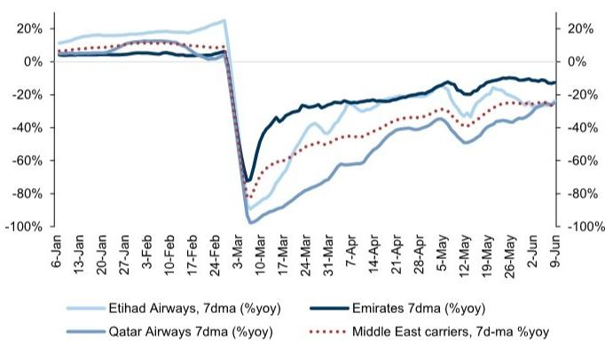
数据截至2026年6月9日
图表10：中东航空公司的航班时刻表已开始恢复，但全面恢复的时间点仍在推迟
最新及前几周欧盟-中东运力时刻表（7日移动平均，%同比）
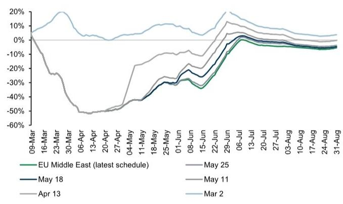
来源：OAG
来源：OAG，Flight Aware，GS全球投资研究

图表11：迪拜国际机场旅客量在2026年3月和4月大幅下降后正在恢复
迪拜国际机场旅客量，%同比
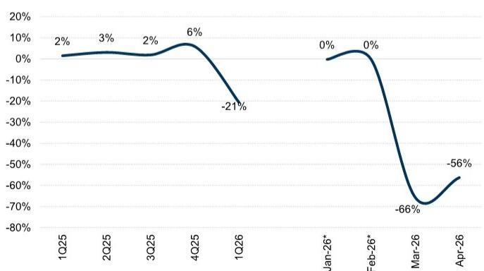
*表示基于已披露的一季度/三月数据假设1月/2月同比增速相等
来源：迪拜机场，GS全球投资研究

## 预测调整

总体而言，我们预测2026年集团有机收入增长为+4.6%（此前为4.3%；共识：+4.4%），集团收入为41.28亿欧元（共识：41.14亿欧元）。我们预测2026年集团营业EBITDA为8.69亿欧元（此前为8.66亿欧元；共识：8.70亿欧元），利润率为21.1%（与共识一致）。总体而言，我们对FY26-30的收入/营业EBITDA/调整后每股收益的预测平均上调<1%，以反映近期趋势和更新的汇率影响。

图表12：JCDecaux：预测调整

| JCDecaux (百万欧元) | 新预测 | | | | | 旧预测 | | | | | 差异 | | | | |
|-------------------|--------|-------|-------|-------|-------|--------|-------|-------|-------|-------|--------|-------|-------|-------|-------|
| | 2026E | 2027E | 2028E | 2029E | 2030E | 2026E | 2027E | 2028E | 2029E | 2030E | 2026E | 2027E | 2028E | 2029E | 2030E |
| 收入 | 4128 | 4300 | 4506 | 4726 | 4957 | 4104 | 4275 | 4480 | 4698 | 4927 | 0.6% | 0.6% | 0.6% | 0.6% | 0.6% |
| 集团有机增长 | 4.6% | 4.2% | 4.8% | 4.9% | 4.9% | 4.3% | 4.2% | 4.8% | 4.9% | 4.9% | | | | | |
| 街道家具 | 2129 | 2224 | 2336 | 2452 | 2575 | 2124 | 2219 | 2330 | 2447 | 2569 | 0.2% | 0.2% | 0.2% | 0.2% | 0.2% |
| 有机增长 | 5.8% | 4.5% | 5.0% | 5.0% | 5.0% | 5.6% | 4.5% | 5.0% | 5.0% | 5.0% | | | | | |
| 广告牌 | 544 | 554 | 565 | 577 | 588 | 544 | 555 | 566 | 578 | 589 | -0.1% | -0.1% | -0.1% | -0.1% | -0.1% |
| 有机增长 | 1.5% | 2.0% | 2.0% | 2.0% | 2.0% | 1.5% | 2.0% | 2.0% | 2.0% | 2.0% | | | | | |
| 交通媒体 | 1456 | 1521 | 1605 | 1697 | 1793 | 1436 | 1501 | 1584 | 1674 | 1769 | 1.4% | 1.4% | 1.4% | 1.4% | 1.4% |
| 有机增长 | 4.2% | 4.5% | 5.5% | 5.7% | 5.7% | 3.5% | 4.5% | 5.5% | 5.7% | 5.7% | | | | | |
| EBITDA (公司定义) | 869 | 915 | 968 | 1024 | 1084 | 866 | 911 | 963 | 1019 | 1079 | 0.4% | 0.4% | 0.4% | 0.5% | 0.5% |
| 增长 | 4.6% | 5.2% | 5.8% | 5.8% | 5.8% | 4.2% | 5.2% | 5.8% | 5.8% | 5.8% | | | | | |
| 集团营业利润率 | 21.1% | 21.3% | 21.5% | 21.7% | 21.9% | 21.1% | 21.3% | 21.5% | 21.7% | 21.9% | | | | | |
| 街道家具 | 577 | 607 | 642 | 679 | 718 | 575 | 606 | 641 | 678 | 717 | 0.2% | 0.2% | 0.2% | 0.2% | 0.2% |
| 街道家具营业利润率 | 27.1% | 27.3% | 27.5% | 27.7% | 27.9% | 27.1% | 27.3% | 27.5% | 27.7% | 27.9% | | | | | |
| 广告牌 | 96 | 99 | 102 | 105 | 109 | 96 | 99 | 102 | 106 | 109 | -0.1% | -0.1% | -0.1% | -0.1% | -0.1% |
| 广告牌营业利润率 | 17.7% | 17.9% | 18.1% | 18.3% | 18.5% | 17.7% | 17.9% | 18.1% | 18.3% | 18.5% | | | | | |
| 交通媒体 | 197 | 208 | 223 | 239 | 256 | 194 | 206 | 220 | 236 | 253 | 1.4% | 1.4% | 1.4% | 1.4% | 1.4% |
| 交通媒体营业利润率 | 13.5% | 13.7% | 13.9% | 14.1% | 14.3% | 13.5% | 13.7% | 13.9% | 14.1% | 14.3% | | | | | |
| 调整后摊薄每股收益 | 1.38 | 1.36 | 1.48 | 1.61 | 1.75 | 1.37 | 1.35 | 1.47 | 1.61 | 1.74 | 0.4% | 0.4% | 0.4% | 0.4% | 0.4% |
| 自由现金流 | 316 | 317 | 332 | 346 | 361 | 315 | 317 | 332 | 346 | 361 | 0.5% | -0.1% | -0.1% | -0.1% | -0.1% |

来源：GS全球投资研究

图表13：我们预测JCDecaux中期集团有机收入增长约5%...
JCDecaux各板块有机收入增长，2016-30E
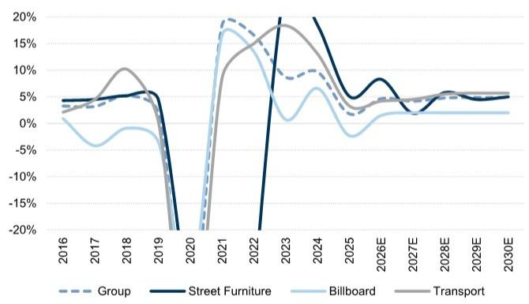
来源：公司数据，GS全球投资研究

图表14：...EBITDA利润率预计在2026年超过疫情前2019年水平...
JCDecaux营业EBITDA（百万欧元）及利润率，2016-30E
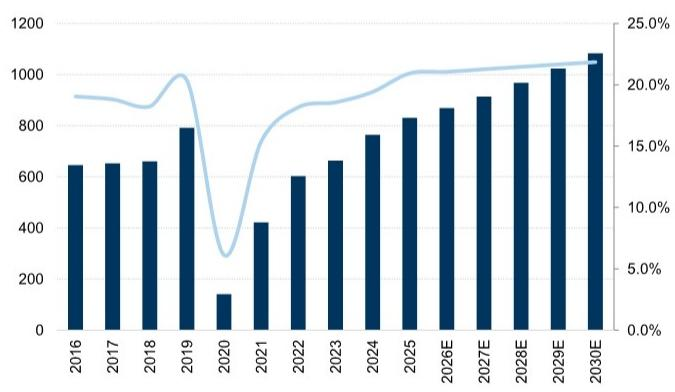
来源：公司数据，GS全球投资研究

图表15：...随着资本支出正常化，我们预测JCDecaux的自由现金流生成将回归历史水平
JCDecaux自由现金流（百万欧元），2014-30E
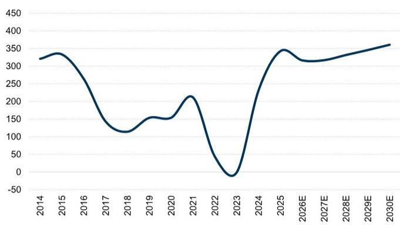
来源：公司数据，GS全球投资研究

## 估值与主要风险

我们维持中性评级，12个月目标价为21.5欧元（此前为20.7欧元），基于15.8倍的目标市盈率（此前为15.3倍，反映全球同行的市值调整），应用于我们的FY27预测。

图表16：JCDecaux股价表现，过去12个月指数化
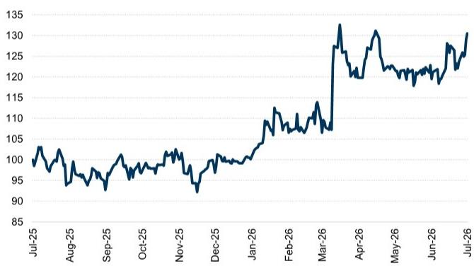
来源：LSEG数据与分析

图表17：JCDecaux的12个月远期市盈率，2016-26
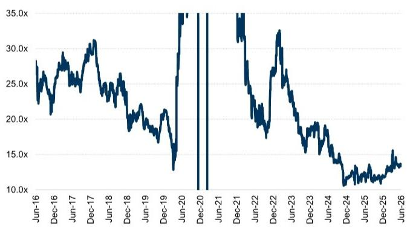
来源：LSEG数据与分析

图表18：JCDecaux的12个月远期EV/EBITDA，2016-26
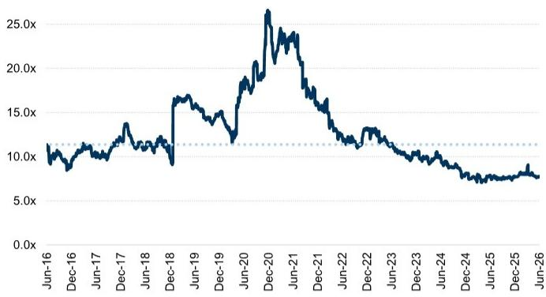
来源：LSEG数据与分析

主要风险包括：（i）复苏速度快于或慢于预期——受GDP增长或受众恢复情况影响，尤其是中国；（ii）成本控制强于或弱于预期；（iii）资本支出增速慢于或快于预期；（iv）竞争环境改善或恶化，尤其是在更加关注盈利能力的背景下；（v）行业整合带来的协同效应；（vi）程序化数字户外广告的采用速度快于或慢于预期。

## 二季度业绩预览：Stroeer：我们对集团EBITDA的预测比共识低3%

对于二季度，我们预测总收入为5.31亿欧元，Visible Alpha共识数据为5.29亿欧元，我们的集团有机收入增长预测为+2.3%，共识为+2.7%，较一季度的1.0%有所改善。我们的二季度集团营业EBITDA预测约为1.49亿欧元，比共识约1.54亿欧元低约3%，意味着利润率为28.0%（同比-150个基点；共识：29.0%），我们预测二季度集团调整后净利润为3400万欧元。

## 细分来看：

对于户外媒体，我们预计市场保持积极，预测二季度有机收入增长为+5.6%（公司指引为与一季度一致，即5.4%有机增长），收入约2.59亿欧元（共识：约2.55亿欧元）。在户外媒体内部，我们预测传统户外和户外服务收入均增长约1%，而数字户外增长+13%。我们预测二季度调整后EBITDA约为1.21亿欧元（共识：约1.19亿欧元），意味着利润率为46.8%（同比-100个基点；共识：46.4%）。

对于数字与对话媒体，我们预测二季度有机收入增长为+2.8%，收入约2.35亿欧元（共识：约2.31亿欧元）。细分来看，我们预计数字收入下降-2.0%（一季度为-3.4%），而对话收入增长+7.5%（一季度为+8.5%）。我们预测调整后EBITDA为3100万欧元（共识：3600万欧元），意味着利润率为13.2%（同比-150个基点；共识：15.6%）。

对于DaaS与电子商务，我们预测二季度有机收入下降-4.1%，收入约7700万欧元（共识：约8200万欧元），公司指引为二季度收入个位数百分比下降（二季度25收入：约8500万欧元）。细分来看，Statista处于转型阶段，我们预测其有机下降-1.0%（一季度为-3.7%），同时预计ASAMBeauty收入下降-7.0%（一季度为-14.4%），受德国私人消费市场影响。我们预测调整后EBITDA为620万欧元（共识：870万欧元），意味着利润率为8.0%（同比-250个基点；共识：10.6%）。

| 百万欧元 Stroeer | FY26 | | | FY25 |
|-----------------|------|-------|-------|------|
| | GSe | VA共识 | 公司指引 | GS vs VA共识 |
| 收入 | | | | |
| 户外媒体 | 1,042.9 | 1,032.8 | | 1.0% | 988.9 |
| 数字与对话媒体 | 970.4 | 953.1 | | 1.8% | 891.7 |
| DaaS与电子商务 | 329.2 | 333.8 | | -1.4% | 352.0 |
| 调整项 | (182.7) | (181.2) | | 0.8% | (157.5) |
| 总收入 | 2,159.8 | 2,146.0 | | 0.6% | 2,075 |
| 有机增长 | | | | |
| 户外媒体 | 5.5% | | | | 1.8% |
| 数字与对话媒体 | 2.8% | | | | -1.1% |
| DaaS与电子商务 | -3.9% | | | | -0.6% |
| 集团有机增长 | 2.3% | 1.5% | 低至中个位数增长 | 85bps | -0.4% |
| 营业EBITDA | | | | |
| 户外媒体 | 489.1 | 481.0 | | 1.7% | 469.7 |
| 数字与对话媒体 | 154.9 | 156.1 | | -0.7% | 149.8 |
| DaaS与电子商务 | 30.4 | 33.5 | | -9.2% | 41.6 |
| 调整项 | (41.3) | (38.6) | | 6.9% | (35.2) |
| 集团营业EBITDA | 633.1 | 632.0 | ~626 | 0.2% | 625.9 |
| EBITDA利润率 | | | | |
| 户外媒体 | 46.9% | 46.6% | | 32 bp | 47.5% |
| 数字与对话媒体 | 16.0% | 16.4% | | -41 bp | 16.8% |
| DaaS与电子商务 | 9.2% | 10.0% | | -80 bp | 11.8% |
| 集团EBITDA利润率 | 29.3% | 29.5% | | -14 bp | 30.2% |
| 调整后净利润 | 176.5 | | | | 165.2 |

图表19：我们预测有机增长2.3%，共识为2.7%，营业EBITDA比共识低约3%

| 百万欧元 Stroeer | 二季度26 | | | 二季度25 |
|-----------------|---------|-------|-------|---------|
| | GSe | VA共识 | GS vs VA共识 | |
| 收入 | | | | |
| 户外媒体 | 258.7 | 255.4 | 1.3% | 245.1 |
| 数字与对话媒体 | 234.5 | 230.5 | 1.7% | 209.7 |
| DaaS与电子商务 | 77.2 | 81.8 | -5.7% | 84.7 |
| 调整项 | (39.3)
