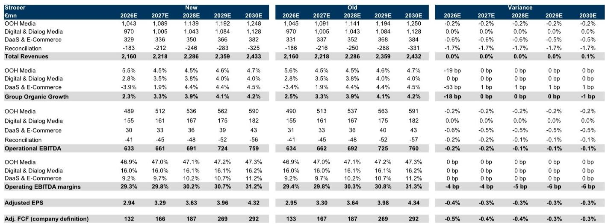
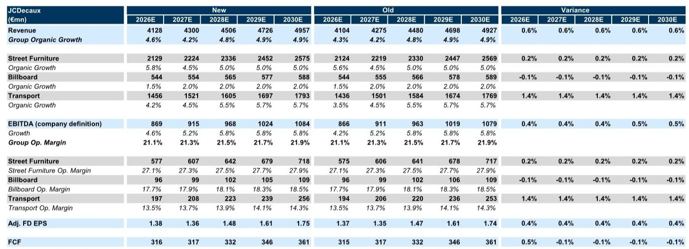
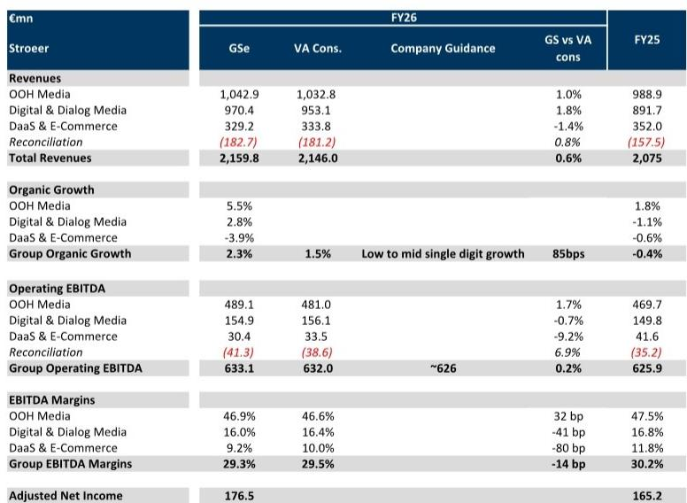

# Out-of-Home Advertising Is Not a Legacy Medium:It Is the Structural Winner in an Era of Digital Saturation

The conventional narrative that traditional advertising media are in terminal decline is incomplete. One category has not only resisted the digital onslaught but has strengthened its position:out-of-home (OOH) advertising. Over the past decade,OOH has been the most resilient traditional medium,gaining market share even as print,radio,and linear television have ceded ground to digital platforms. This is not a cyclical anomaly. It reflects a structural shift in how advertisers allocate budgets toward formats that combine high return on investment,physical presence,and programmatic flexibility.

For 2026,the outlook for the two leading European OOH operators,JCDecaux and Stroeer,points to a clear acceleration. Organic revenue growth is expected to rebound to 4.6 percent and 5.6 percent respectively,after a subdued 2025 when both companies posted only 1.8 percent growth. The catalyst is straightforward:easier year-on-year comparisons and the tailwind from major sporting events,most notably the FIFA World Cup. But beneath the annual numbers lies a more important story about the medium's long-term trajectory.

The thesis is not that OOH will grow faster than digital advertising. It will not. The thesis is that OOH has become a structurally protected category within the advertising ecosystem,one that benefits from the very forces that have disrupted other traditional media. Digital out-of-home (DOOH) inventory,programmatic buying,and improved audience measurement are transforming the medium from a static billboard business into a data-driven,high-frequency channel. The companies that own premium locations and long-term concession contracts are sitting on assets that are becoming more valuable,not less.

This article makes a single argument:the OOH advertising market has entered a period of rational competition,accelerating growth,and strategic consolidation,and observers who treat it as a legacy holdover are mispricing its future. The evidence comes from revenue forecasts,M&A activity,and the improving competitive dynamics among the major players.

## The 2026 Growth Rebound Is Real,but the Structural Case Extends Far Beyond the Calendar

The headline numbers for 2026 are compelling. JCDecaux is expected to deliver OOH organic revenue growth of 4.6 percent,and Stroeer is expected to reach 5.5 percent. Both return to levels broadly in line with the broader OOH market average of 5.7 percent. By contrast,2025 was a year of deceleration,with both companies growing at only 1.8 percent. The explanation for the swing is partly mechanical:2024 benefited from the Euros and the Olympics,creating a tough comparison that depressed 2025 figures. But 2026 brings the FIFA World Cup,which alone is expected to contribute roughly 120 basis points of incremental revenue per quarter for JCDecaux,split evenly between the second and third quarters.

Yet the cyclical story,while real,is not the main event. The more important observation is that OOH has maintained a mid-single-digit growth trajectory over multiple years,even as other traditional media have contracted. The data show that OOH's share of total advertising expenditure has risen across the 2013-2018,2018-2023,and 2023-2025 periods,a feat no other traditional medium can claim. This is not a blip. It is the result of three structural drivers that are still in their early innings.

First,the digitalization of OOH inventory is accelerating. Programmatic buying,once the domain of online display,is now penetrating street furniture and transport advertising. This allows advertisers to evaluate OOH inventory with the same targeting precision they expect from digital channels,using data on foot traffic,demographics,and time of day. The result is higher cost-per-thousand impressions and better inventory utilization. Second,audience measurement has improved dramatically. Advertisers no longer have to guess how many people see a billboard. They can now measure exposure with the same rigor applied to digital campaigns,which makes OOH a more credible line item in the media plan. Third,the operating leverage in the business is substantial. Once a digital screen is installed,the marginal cost of displaying additional ads is near zero. As utilization rates rise,margins expand.

The implication is clear:the 2026 rebound is not a one-off event. It is the latest data point in a medium-term growth story that should sustain mid-single-digit compound annual growth rates for the foreseeable future. The correlation between global real GDP growth and OOH advertising growth,with an R-squared of 0.78,provides a robust anchor for these forecasts. As long as the global economy expands,OOH will expand with it,and likely at a premium.

## The Competitive Environment Has Become More Rational,and M&A Activity Confirms the Sector's Strategic Value

One of the most underappreciated developments in the OOH market is the improvement in competitive behavior. For years,the industry was plagued by aggressive pricing and capacity expansion that compressed margins. That era appears to be over. As valuation multiples have compressed across the media sector,management teams have shifted their focus from revenue growth at any cost to profitability and return on capital. This is not a temporary shift. It reflects a structural change in how the industry views itself.

The evidence is visible in the recent wave of M&A activity. In June 2026,oOh!media,the Australian OOH operator,received revised takeover proposals from multiple private equity firms,with offers converging at A$1.60 per share. In April 2026,reports emerged that private equity investors were exploring a purchase of Stroeer's core OOH and digital content businesses at a valuation of 3.5 billion euros or more. And in February 2026,Mubadala agreed to acquire Clear Channel for $6.2 billion,representing an acquisition multiple of approximately 11.7 times 2026 estimated EBITDA.

These transactions share a common theme. Private equity is betting that OOH assets are undervalued relative to their cash flow generation and growth potential. The Clear Channel deal is particularly instructive. The company had spent recent years restructuring,selling its European business to Bauer Media and reviewing its Latin American operations. The fact that a sovereign wealth fund and a global investment firm were willing to pay a double-digit EBITDA multiple for the remaining U.S. business suggests that they see a stable,cash-generative asset with room for margin improvement.

In this environment,JCDecaux occupies a unique position. It holds roughly 8 percent of the global OOH market,more than double the share of any other player. The market remains fragmented,with no other operator exceeding 5 percent. This gives JCDecaux pricing power in contract negotiations and the scale to invest in ad-tech and measurement infrastructure that smaller competitors cannot match. The potential for future contracts to be signed at more attractive revenue shares is a real upside that is not fully reflected in current estimates.

## JCDecaux's 1H26 Preview Reveals a Business That Is Beating Expectations in the Most Important Segments

The detailed preview of JCDecaux's first-half 2026 results provides a window into how the structural story is playing out at the operational level. The consensus estimates are a useful benchmark,but the deviations from consensus tell the more interesting story.

For the second quarter,the report forecasts group organic growth of 3.7 percent,above the Visible Alpha consensus of 3.2 percent and ahead of company guidance of approximately 3 percent. The primary driver is better-than-expected trading momentum in the Middle East,a region that accounts for roughly 5 percent of group revenue. The company had previously guided to a 40 percent decline in Middle East revenues for the second quarter,but flight traffic data suggests the decline is closer to 30 percent,with the exit rate improving to minus 25 percent. This is not a full recovery,but it is a meaningful improvement,and it is happening faster than management anticipated.

The Transport segment is the standout. The report forecasts second-quarter organic growth of 3.0 percent,well above the consensus estimate of 1.4 percent. This is driven entirely by the Middle East improvement,as the other geographies are performing broadly in line with expectations. For the full first half,Transport organic growth is expected at 5.2 percent,again above consensus. The Street Furniture segment is more stable,with first-half EBITDA margins of 22.8 percent,in line with consensus and up 10 basis points year on year. Billboard remains the laggard,with organic growth of only 1.0 percent in the second quarter,below consensus,and negative growth for the first half.

The overall picture is one of a business that is executing well in its core segments while benefiting from a gradual normalization in a previously distressed region. The FIFA World Cup will provide an additional boost in the second half,and new contracts in Stockholm,Barcelona,and Carrefour retail media are expected to contribute roughly 150 basis points of benefit in the third and fourth quarters.

## What the Report Does Not Fully Answer:The Margin Implications of Digital Investment and Platform Competition

For all the positive signals in the data,the report leaves several important questions unresolved. The most pressing is the margin trajectory. The report notes that OOH advertisers will need to continue investing in ad-tech,programmatic capabilities,and measurement infrastructure to remain competitive. These investments are necessary,but they also carry a cost. The near-term impact on margins is uncertain,and the report does not provide a clear framework for how quickly these investments will pay off.

The second unresolved question is the competitive threat from scaled global digital platforms. Google,Meta,and Amazon are all expanding their advertising offerings and seeking to capture a greater share of advertiser budgets. These platforms have vast data advantages,sophisticated targeting capabilities,and the ability to offer integrated cross-channel campaigns. OOH operators argue that their physical presence and high recall rates provide a differentiated value proposition,but the digital platforms are not standing still. They are investing in out-of-home capabilities themselves,and the line between digital and physical advertising is blurring.

The third question is about the sustainability of the M&A premium. Private equity interest in OOH assets is strong today,but that interest is partly a function of the current interest rate environment and the search for yield. If rates rise or if the economic cycle turns,the appetite for leveraged buyouts in the media sector could diminish. The report does not address how the valuation of OOH assets would hold up under a less favorable macro scenario.

These are not reasons to dismiss the thesis. They are reasons to monitor the data closely and to recognize that the OOH story,while compelling,is not without risk.

## A Decision Framework for Evaluating OOH Exposure

For those considering whether to increase exposure to OOH advertising,the following framework may help structure the analysis. The framework has three dimensions:cyclical positioning,structural advantage,and valuation discipline.

On cyclical positioning,the case is straightforward. The 2026 calendar is favorable,with the FIFA World Cup and easier comparisons providing a clear tailwind. The Middle East recovery,while gradual,is moving in the right direction. Those who are comfortable with the near-term macro outlook should find the revenue trajectory reassuring.

On structural advantage,the question is whether OOH can continue to gain share of advertising expenditure. The evidence suggests yes,but the pace of share gains will depend on the speed of digital adoption within the OOH industry. Companies that invest early in programmatic capabilities and data-driven measurement will be the winners. JCDecaux,with its scale and global footprint,is best positioned to make these investments. Smaller players may struggle to keep up.

On valuation discipline,the key is to distinguish between the asset quality and the price paid. The Clear Channel transaction at 11.7 times EBITDA provides a useful benchmark. If publicly traded OOH companies trade at a discount to that multiple,there may be a re-rating opportunity. If they trade at a premium,the margin of safety is thinner. Observers should compare current multiples to historical ranges and to the multiples implied by recent M&A.

The report provides the data to make these assessments,but the final judgment rests on one's own conviction about the durability of the OOH business model.

## Join the Community to Read the Full Report and Review the Original Charts

The analysis above is based on a detailed research report that includes revenue forecasts,segment-level breakdowns,M&A timelines,and proprietary data on flight traffic and audience trends. The full report contains charts and exhibits that are essential for understanding the magnitude of the growth acceleration,the competitive dynamics among the major players,and the specific drivers of the Middle East recovery.

Join the community to read the full report and review the original charts.

*For informational purposes only. Portions may be generated,translated,summarized,or edited with AI assistance based on source materials and may contain omissions or errors. Please verify independently. This is not professional advice.*

For informational purposes only. Portions may be generated,translated,summarized,or edited with AI assistance based on source materials and may contain omissions or errors. Please verify independently. This is not professional advice.

