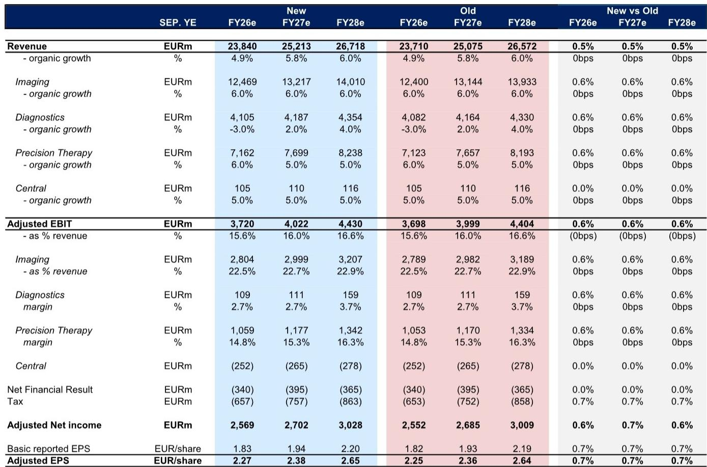
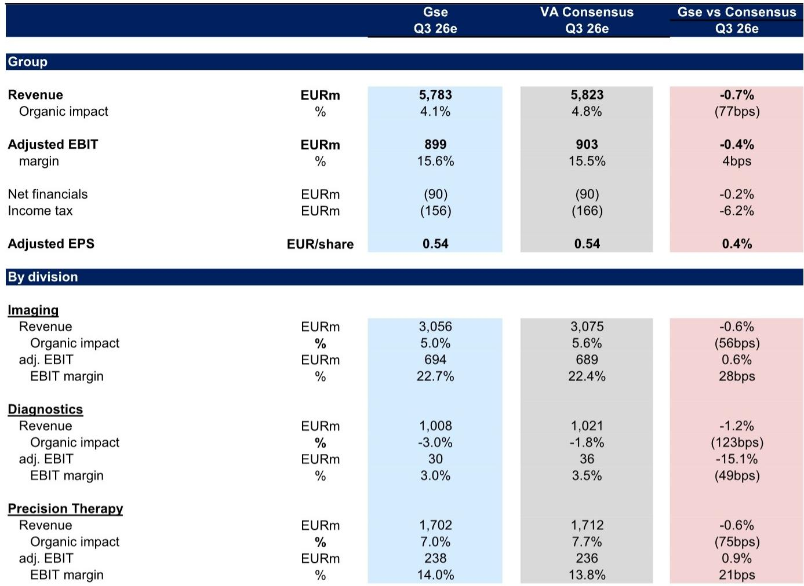
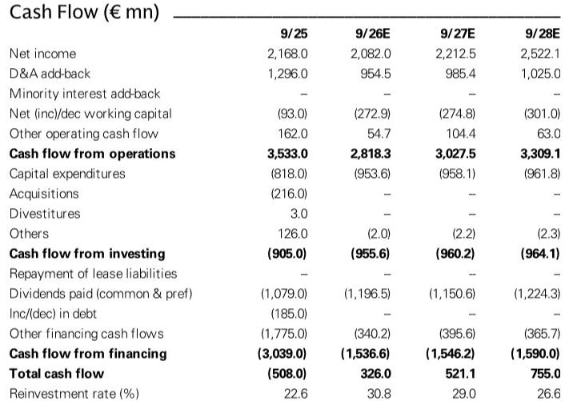

# The Diagnostics Albatross: Why Siemens Healthineers’ Core Strength Is Being Overshadowed by a Single Underperforming Division

Siemens Healthineers presents a strategic paradox. Its Imaging and Precision Therapy businesses are performing well, with sustainable competitive advantages and solid growth trajectories. Yet the company’s share price has declined nearly 24% over the past twelve months, trading at 14.5x forward P/E with no material positive earnings revisions since December 2021. The disconnect between business quality and market performance is not a valuation anomaly. It is a structural tension that observers must resolve.

The root cause is Diagnostics. This division, representing roughly 17% of group revenue, is expected to generate only 3% EBIT margins in Q3 2026—down over 600 basis points year-over-year. More critically, consensus expectations for FY27 assume a 73% year-over-year EBIT recovery in Diagnostics, which would account for approximately 20% of total group EBIT growth. That assumption is vulnerable. The gap between what the market expects and what is achievable under current policy conditions in China creates a significant risk to the entire Healthineers equity story.

This is not a company-level execution problem. It is a portfolio architecture problem. Healthineers’ core imaging and therapy franchises are structurally sound, but they are being held hostage by a diagnostics business facing a changing regulatory environment in its most important growth market. The strategic question is not whether Diagnostics can recover. It is whether Healthineers can afford to wait.

## The Q3 26 Results Are a Distraction From the Real Issue

For the current quarter, the numbers appear manageable. Our estimates place Q3 26 adjusted EBIT at €899 million, broadly in line with consensus at €903 million. Adjusted EPS of €0.54 matches the street. On the surface, this is a steady-as-she-goes print. But surface-level alignment masks a deeper divergence beneath.

Our top-line estimates are below consensus across every division. We forecast only 4.1% organic revenue growth versus 4.8% consensus, with the largest gap in Diagnostics, where we project a 3% sales decline versus the consensus expectation of a 1.8% decline. This is not a one-quarter phenomenon. Diagnostics sales have been declining sequentially, and while the rate of decline may moderate in Q3 compared to the 5% drop in H1, the underlying headwinds are not abating. They are simply stabilizing at a lower level.

The margin story is equally noteworthy. We expect Q3 group adjusted EBIT margins of 15.6%, down 130 basis points year-over-year. Diagnostics margins are the primary factor, contracting more than 600 basis points to 3%. Even Imaging, the company’s crown jewel, is seeing margin compression of 100 basis points to 22.7% due to FX and supply chain inflation. The pattern is clear: every division is under pressure, but Diagnostics is in a category of its own.

The critical insight here is that consensus is not wrong about Q3. It is wrong about the trajectory. The risk is not in the current print. It is in the FY27 recovery narrative that consensus has baked into its numbers.

## China Diagnostics Policy Creates a Structural Overhang That Consensus Underestimates

The FY27 consensus for Healthineers assumes Diagnostics EBIT grows 73% year-over-year, contributing roughly one-fifth of total group EBIT growth. This assumption rests on a recovery in China Diagnostics profitability that faces two specific and underappreciated policy risks.

First, potential Hemostasis Volume-Based Procurement (VBP) could compress pricing in a key product category. China’s VBP program has already reshaped the medical device landscape, and its extension into hemostasis testing would directly pressure Diagnostics revenue and margins in the country. Second, the implementation of IVD pricing unification and service pricing guidelines creates a structural headwind to profitability that is not cyclical but regulatory in nature. These are not temporary shocks. They represent a permanent shift in the pricing environment.

The implications are straightforward. If Diagnostics EBIT recovery is shallower than consensus expects—and our analysis suggests it will be—then the FY27 group earnings trajectory is at risk. Our FY27 adjusted EPS estimate sits 4% below consensus, driven entirely by Diagnostics underperformance and upward pressure on finance costs from refinancing. That 4% gap may sound small, but it is material in a stock that has already de-rated significantly and has not seen positive EPS revisions in over four years.

The market is pricing Healthineers as if the Diagnostics headwind is cyclical and self-correcting. It is not. It is structural and policy-driven. Until that distinction is reflected in earnings estimates, the stock will remain range-bound regardless of how well Imaging and Precision Therapy perform.

## The Diagnostics Spin-Off Could Reshape the Investment Case

Recent press coverage has highlighted the possibility of a Diagnostics separation within the next 24 months, with reports indicating a valuation of approximately €6 billion. This is not a routine portfolio optimization. It is a strategic recognition that Diagnostics is destroying value by association.

The arithmetic is compelling. Diagnostics is a lower-growth, lower-margin business compared to Imaging and Precision Therapy. On our estimates, a separation would be accretive to group organic growth and margins immediately. The remaining entity would consist of the “synergistic core”—Imaging and Precision Therapy—which together command higher multiples, stronger competitive positions, and more predictable earnings trajectories.

Beyond the operational benefits, the cash proceeds from a sale or spin-off could accelerate deleveraging. Healthineers carries net debt to EBITDA of approximately 2.9x (excluding leases), and the balance sheet has limited flexibility for strategic moves or shareholder returns. An injection of €6 billion would transform the capital structure, potentially enabling share buybacks, bolt-on acquisitions in higher-growth areas, or a combination of both.

However, the 24-month timeline is critical. The market is being asked to wait two years for a catalyst that may or may not materialize. In the interim, the stock will continue to be weighed down by Diagnostics earnings drag, the overhang from Siemens AG’s stake reduction, and the absence of positive EPS revisions. The spin-off is a long-dated positive catalyst, but it does nothing to address the FY27 earnings risk that is immediately in front of observers.

## What the Report Does Not Fully Answer: The Path Dependency of the Recovery

The analysis correctly identifies the risks in China Diagnostics and the potential upside from a separation. But it leaves several important questions unresolved.

First, what is the precise sensitivity of Diagnostics EBIT to China policy changes? The report flags Hemostasis VBP and pricing unification as risks, but does not quantify the revenue or margin impact under different policy scenarios. Observers need to understand whether a 10% pricing cut versus a 20% cut changes the FY27 outlook by 2% or 10% of group EPS.

Second, what is the probability weight that should be assigned to a Diagnostics separation? The press reports are encouraging, but there is a wide gap between speculation and execution. A spin-off requires board approval, regulatory clearance, and market conditions that support a clean separation. Any of these factors could delay or derail the process.

Third, can Imaging and Precision Therapy sustain their growth trajectories without Diagnostics? The “synergistic core” narrative assumes these businesses are independently strong. But Diagnostics provides some cross-selling and service synergies that would be lost upon separation. The net benefit calculation is not as clean as a simple margin comparison suggests.

These are not flaws in the analysis. They are open questions that require deeper due diligence. Observers who rely solely on the consensus view or the spin-off narrative are making implicit assumptions about these unknowns that may not be accurate.

## A Decision Framework for Healthineers Observers

For those evaluating Healthineers today, the situation demands a structured approach rather than a binary view. The following framework organizes the key variables into a decision matrix.

First, assess the Diagnostics recovery trajectory. If you believe China policy headwinds are temporary and that Diagnostics can deliver the 73% EBIT growth consensus expects in FY27, then the stock at 14.5x forward P/E may be fairly valued at best, with downside risk to estimates.

Second, evaluate the separation probability and timeline. If a Diagnostics spin-off is announced within the next 12 months, the stock likely re-rates immediately as the market prices in the higher-multiple core business. If the separation takes longer than 24 months or fails to materialize, the overhang persists and the stock remains range-bound.

Third, monitor the balance sheet trajectory. Healthineers is generating free cash flow, but the reinvestment rate is rising and leverage remains elevated. If the company can delever without a spin-off through organic cash generation, the equity story improves. If leverage stays high and interest costs rise, the earnings headwind compounds.

Fourth, watch the parent stake dynamics. Siemens AG’s gradual stake reduction has been an overhang on the stock. Any signal that the selling is complete or accelerating would remove a technical drag that has nothing to do with fundamentals.

These four factors interact. A clean Diagnostics recovery reduces the urgency of a spin-off. A rapid spin-off reduces the importance of near-term Diagnostics earnings. The observer who understands these dependencies can position accordingly, rather than simply betting on or against the stock.

## The Unresolved Analytical Tension That Demands Deeper Work

The most interesting question this analysis raises is whether Healthineers is a sum-of-the-parts story or a turnaround story. The market is currently pricing it as neither—it is pricing it as a steady-state medtech company with a valuation discount. But the underlying dynamics suggest one of two outcomes must prevail.

If Diagnostics recovers, Healthineers becomes a high-quality growth story with improving margins and a clean balance sheet. The stock should re-rate toward its historical multiples. If Diagnostics does not recover, the company must either separate the division or accept permanently lower group margins and growth. In that scenario, the current valuation may prove generous.

The critical unknown is whether management has the conviction to force the separation, or whether it will attempt to fix Diagnostics organically. The two paths have very different implications for timing, risk, and return. The report provides the data to frame this choice but does not resolve it.

*For informational purposes only. Portions may be generated, translated, summarized, or edited with AI assistance based on source materials and may contain omissions or errors. Please verify independently. This is not professional advice.*

For informational purposes only. Portions may be generated, translated, summarized, or edited with AI assistance based on source materials and may contain omissions or errors. Please verify independently. This is not professional advice.

