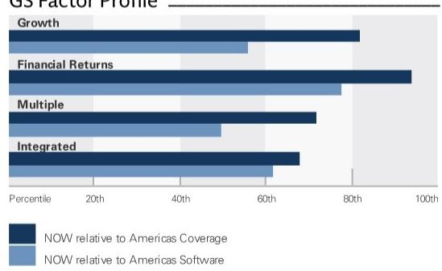
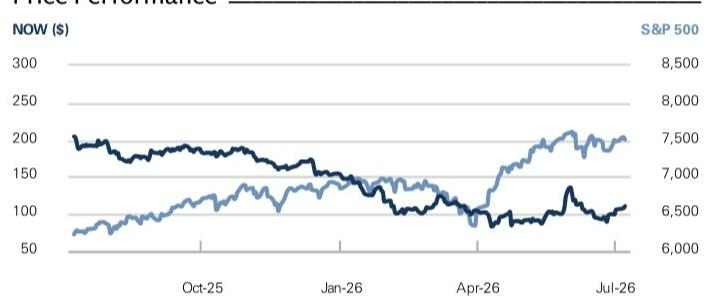
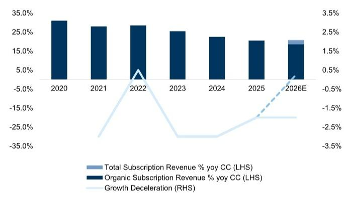

# ServiceNow Inc. (NOW)

2Q26 Preview: Company valuation linked to growth trajectory with AI contribution

NOW

12m Price Target: \$145.00

Price: \$110.73

Upside: $30.9\%$

ServiceNow is due to report 2Q26 results on 7/22. We think the set up is more attractive than last quarter into the print: a) ServiceNow guided 2Q organic cRPO to \~17.25%, compared to 1Q actuals at \~20.0%, and including an additional degree of conservatism after last quarter's Middle East volatility; b) ServiceNow introduced a key use case at Knowledge for ITSM Level 1 automation and a 100-day ROI guarantee, addressing feedback we had heard from system integrators around being uncertain of which use cases to lead with and establishing customer use cases with NVIDIA, FedEx, and CVS Health; c) ServiceNow is in the early stages of executing on cross sell and training and enablement for its newly acquired assets: Moveworks, Veza and Armis. We are positive on the stock. We continue to believe the single biggest driver of a stock rerating will be whether ServiceNow can prove its relevance in the enterprise AI stack, and we believe a stabilization in organic revenue and upward revisions to WholeCo revenue will help demonstrate this relevance.

## 2Q EPS Preview

We see a reasonable upside scenario where 2Q cRPO growth is $20.5 - 21.5\%$ (vs. guidance/the Street at $19.5\%$ cc) and subscription revenue growth is $22 - 22.5\%$ (vs. guidance for $21 - 21.5\%$ cc and the Street at $21.4\%$ ).

At 20.5-21.5% cc cRPO, growth would beat guidance by \~150bps, in line with the 3yr average cRPO beats.

At 22-22.5%, subscription revenue would beat by \~100bps, in line with the average beat over the prior 8 quarters.

BUY

Investor focus will be on 2Q cRPO and 3Q cRPO guidance, and what it means for the pace of growth deceleration. Recall both subscription revenue and cRPO include 100bps of growth contribution from Moveworks; and 125bps from Armis. As of last

Gabriela Borges, CFA
+1(212)902-7839 | gabriela.borges@gs.com
GS & Co. LLC

Maura Hager  
+1(212)9028724 | maura.hager@gs.com  
GS & Co. LLC

<table><tr><td>Key Data</td></tr><tr><td>Market cap: $119.0bn</td></tr><tr><td>Enterprise value: $115.2bn</td></tr><tr><td>3m ADTV: $3.0bn</td></tr><tr><td>United States</td></tr><tr><td>Americas Software</td></tr><tr><td>M&amp;A Rank: 3</td></tr></table>

GS Forecast

<table><tr><td></td><td>12/25</td><td>12/26E</td><td>12/27E</td><td>12/28E</td></tr><tr><td>Revenue ($ mn) New</td><td>13,278.0</td><td>16,213.6</td><td>19,376.1</td><td>23,022.1</td></tr><tr><td>Revenue ($ mn) Old</td><td>13,278.0</td><td>16,213.6</td><td>19,376.1</td><td>23,022.1</td></tr><tr><td>EBITDA ($ mn)</td><td>4,887.0</td><td>6,445.1</td><td>7,603.7</td><td>9,039.3</td></tr><tr><td>EBIT ($ mn)</td><td>4,149.0</td><td>5,091.9</td><td>6,285.9</td><td>7,703.8</td></tr><tr><td>EPS ($) New</td><td>3.52</td><td>4.14</td><td>5.17</td><td>6.44</td></tr><tr><td>EPS ($) Old</td><td>3.52</td><td>4.16</td><td>5.20</td><td>6.47</td></tr><tr><td>P/E (X)</td><td>52.5</td><td>26.7</td><td>21.4</td><td>17.2</td></tr><tr><td>Dividend yield (%)</td><td>-</td><td>-</td><td>-</td><td>-</td></tr><tr><td>Net debt/EBITDA (X)</td><td>(0.5)</td><td>(0.6)</td><td>(1.3)</td><td>(1.9)</td></tr><tr><td></td><td>3/26</td><td>6/26E</td><td>9/26E</td><td>12/26E</td></tr><tr><td>EPS ($)</td><td>0.97</td><td>0.86</td><td>1.05</td><td>1.26</td></tr></table>

GS Factor Profile

  
Source: Company data, GS estimates. See disclosures for details.

ServiceNow Inc. (NOW) Rating since Feb 1, 2019

Ratios & Valuation

<table><tr><td></td><td>12/25</td><td>12/26E</td><td>12/27E</td><td>12/28E</td></tr><tr><td>P/E (X)</td><td>52.5</td><td>26.7</td><td>21.4</td><td>17.2</td></tr><tr><td>EV/EBITDA (X)</td><td>38.8</td><td>17.2</td><td>14.0</td><td>11.1</td></tr><tr><td>EV/sales (X)</td><td>14.3</td><td>6.8</td><td>5.5</td><td>4.3</td></tr><tr><td>FCF yield (%)</td><td>2.4</td><td>4.8</td><td>6.0</td><td>7.2</td></tr><tr><td>EV/DACF (X)</td><td>37.6</td><td>18.9</td><td>14.7</td><td>11.6</td></tr><tr><td>CROCI (%)</td><td>48.5</td><td>48.1</td><td>59.4</td><td>72.7</td></tr><tr><td>ROE (%)</td><td>32.5</td><td>32.8</td><td>34.6</td><td>32.4</td></tr><tr><td>Net debt/EBITDA (X)</td><td>(0.5)</td><td>(0.6)</td><td>(1.3)</td><td>(1.9)</td></tr><tr><td>Net debt/equity (%)</td><td>(17.2)</td><td>(27.8)</td><td>(53.6)</td><td>(70.7)</td></tr><tr><td>Interest cover (X)</td><td>230.5</td><td>-</td><td>-</td><td>-</td></tr><tr><td>Inventory days</td><td>NM</td><td>NM</td><td>NM</td><td>NM</td></tr><tr><td>Receivable days</td><td>66.9</td><td>61.7</td><td>55.3</td><td>48.6</td></tr><tr><td>Days payable outstanding</td><td>19.7</td><td>25.3</td><td>25.8</td><td>25.8</td></tr></table>

Growth & Margins (%)

<table><tr><td></td><td>12/25</td><td>12/26E</td><td>12/27E</td><td>12/28E</td></tr><tr><td>Total revenue growth</td><td>20.9</td><td>22.1</td><td>19.5</td><td>18.8</td></tr><tr><td>EBITDA growth</td><td>28.0</td><td>31.9</td><td>18.0</td><td>18.9</td></tr><tr><td>EPS growth</td><td>26.4</td><td>17.7</td><td>24.9</td><td>24.5</td></tr><tr><td>DPS growth</td><td>NM</td><td>NM</td><td>NM</td><td>NM</td></tr><tr><td>Gross margin</td><td>81.0</td><td>79.4</td><td>79.1</td><td>78.7</td></tr><tr><td>EBIT margin</td><td>31.2</td><td>31.4</td><td>32.4</td><td>33.5</td></tr></table>

<table><tr><td colspan="5">Balance Sheet ($ mn)</td></tr><tr><td></td><td>12/25</td><td>12/26E</td><td>12/27E</td><td>12/28E</td></tr><tr><td>Cash &amp; cash equivalents</td><td>3,726.0</td><td>5,212.6</td><td>11,151.9</td><td>18,586.2</td></tr><tr><td>Accounts receivable</td><td>2,627.0</td><td>2,856.4</td><td>3,019.5</td><td>3,116.8</td></tr><tr><td>Inventory</td><td>-</td><td>-</td><td>-</td><td>-</td></tr><tr><td>Other current assets</td><td>4,118.0</td><td>4,369.6</td><td>4,724.3</td><td>5,139.2</td></tr><tr><td>Total current assets</td><td>10,471.0</td><td>12,438.5</td><td>18,895.8</td><td>26,842.2</td></tr><tr><td>Net PP&amp;E</td><td>3,095.0</td><td>3,230.2</td><td>3,462.5</td><td>3,738.5</td></tr><tr><td>Net intangibles</td><td>4,699.0</td><td>5,522.3</td><td>5,134.7</td><td>4,904.5</td></tr><tr><td>Total investments</td><td>5,313.0</td><td>4,467.0</td><td>4,467.0</td><td>4,467.0</td></tr><tr><td>Other long-term assets</td><td>2,460.0</td><td>2,601.1</td><td>2,916.1</td><td>3,282.7</td></tr><tr><td>Total assets</td><td>26,038.0</td><td>28,259.0</td><td>34,876.2</td><td>43,234.9</td></tr><tr><td>Accounts payable</td><td>204.0</td><td>259.5</td><td>314.7</td><td>380.8</td></tr><tr><td>Short-term debt</td><td>0.0</td><td>-</td><td>-</td><td>-</td></tr><tr><td>Current lease liabilities</td><td>112.0</td><td>118.0</td><td>118.0</td><td>118.0</td></tr><tr><td>Other current liabilities</td><td>10,127.0</td><td>11,834.5</td><td>13,751.1</td><td>15,862.8</td></tr><tr><td>Total current liabilities</td><td>10,443.0</td><td>12,212.0</td><td>14,183.8</td><td>16,361.7</td></tr><tr><td>Long-term debt</td><td>1,491.0</td><td>1,491.0</td><td>1,491.0</td><td>1,491.0</td></tr><tr><td>Non-current lease liabilities</td><td>800.0</td><td>822.0</td><td>822.0</td><td>822.0</td></tr><tr><td>Other long-term liabilities</td><td>220.0</td><td>258.0</td><td>258.0</td><td>258.0</td></tr><tr><td>Total long-term liabilities</td><td>2,631.0</td><td>2,668.1</td><td>2,683.2</td><td>2,699.5</td></tr><tr><td>Total liabilities</td><td>13,074.0</td><td>14,880.0</td><td>16,867.0</td><td>19,061.2</td></tr><tr><td>Preferred shares</td><td>-</td><td>-</td><td>-</td><td>-</td></tr><tr><td>Total common equity</td><td>12,964.0</td><td>13,379.0</td><td>18,009.2</td><td>24,173.7</td></tr><tr><td>Minority interest</td><td>-</td><td>-</td><td>-</td><td>-</td></tr><tr><td>Total liabilities &amp; equity</td><td>26,038.0</td><td>28,259.0</td><td>34,876.2</td><td>43,234.9</td></tr><tr><td>BVPS ($)</td><td>12.50</td><td>12.91</td><td>17.22</td><td>22.86</td></tr></table>

Price Performance  

Cash Flow (\$ mn)

<table><tr><td></td><td>12/25</td><td>12/26E</td><td>12/27E</td><td>12/28E</td></tr><tr><td>Net income</td><td>1,748.0</td><td>1,756.7</td><td>3,111.3</td><td>4,632.1</td></tr><tr><td>D&amp;A add-back</td><td>738.0</td><td>1,353.2</td><td>1,317.8</td><td>1,335.5</td></tr><tr><td>Minority interest add-back</td><td>-</td><td>-</td><td>-</td><td>-</td></tr><tr><td>Net (inc)/dec working capital</td><td>29.0</td><td>239.6</td><td>402.7</td><td>421.2</td></tr><tr><td>Others</td><td>2,929.0</td><td>3,077.8</td><td>3,270.2</td><td>3,426.8</td></tr><tr><td>Cash flow from operations</td><td>5,444.0</td><td>6,427.2</td><td>8,101.9</td><td>9,815.6</td></tr><tr><td>Capital expenditures</td><td>(911.0)</td><td>(887.6)</td><td>(1,162.6)</td><td>(1,381.3)</td></tr><tr><td>Acquisitions</td><td>(1,084.0)</td><td>(1,325.0)</td><td>-</td><td>-</td></tr><tr><td>Divestitures</td><td>-</td><td>-</td><td>-</td><td>-</td></tr><tr><td>Others</td><td>306.0</td><td>1,015.0</td><td>-</td><td>-</td></tr><tr><td>Cash flow from investing</td><td>(1,689.0)</td><td>(1,197.6)</td><td>(1,162.6)</td><td>(1,381.3)</td></tr><tr><td>Dividends paid</td><td>-</td><td>-</td><td>-</td><td>-</td></tr><tr><td>Share issuance/(repurchase)</td><td>(1,840.0)</td><td>(3,725.0)</td><td>(1,000.0)</td><td>(1,000.0)</td></tr><tr><td>Inc/(dec) in debt</td><td>-</td><td>-</td><td>-</td><td>-</td></tr><tr><td>Others</td><td>(493.0)</td><td>(18.0)</td><td>0.0</td><td>0.0</td></tr><tr><td>Cash flow from financing</td><td>(2,333.0)</td><td>(3,743.0)</td><td>(1,000.0)</td><td>(1,000.0)</td></tr><tr><td>Total cash flow</td><td>1,422.0</td><td>1,486.6</td><td>5,939.4</td><td>7,434.3</td></tr><tr><td>Free cash flow</td><td>4,533.0</td><td>5,539.6</td><td>6,939.4</td><td>8,434.3</td></tr><tr><td>Free cash flow per share (basic) ($)</td><td>4.37</td><td>5.34</td><td>6.64</td><td>7.98</td></tr></table>

Source: FactSet. Price as of 7 Jul 2026 close.

Income Statement (\$ mn)

<table><tr><td colspan="5">Income Statement ($ mn)</td></tr><tr><td></td><td>12/25</td><td>12/26E</td><td>12/27E</td><td>12/28E</td></tr><tr><td>Total revenue</td><td>13,278.0</td><td>16,213.6</td><td>19,376.1</td><td>23,022.1</td></tr><tr><td>Cost of goods sold</td><td>(2,517.0)</td><td>(3,340.6)</td><td>(4,053.6)</td><td>(4,910.6)</td></tr><tr><td>SG&amp;A</td><td>(4,464.0)</td><td>(5,269.9)</td><td>(6,111.1)</td><td>(7,028.8)</td></tr><tr><td>R&amp;D</td><td>(2,148.0)</td><td>(2,511.2)</td><td>(2,925.5)</td><td>(3,378.9)</td></tr><tr><td>Other operating inc./(exp.)</td><td>-</td><td>-</td><td>-</td><td>-</td></tr><tr><td>EBITDA</td><td>4,887.0</td><td>6,445.1</td><td>7,603.7</td><td>9,039.3</td></tr><tr><td>Depreciation &amp; amortization</td><td>(738.0)</td><td>(1,353.2)</td><td>(1,317.8)</td><td>(1,335.5)</td></tr><tr><td>EBIT</td><td>4,149.0</td><td>5,091.9</td><td>6,285.9</td><td>7,703.8</td></tr><tr><td>Net interest inc./(exp.)</td><td>433.0</td><td>324.1</td><td>509.6</td><td>849.0</td></tr><tr><td>Income/(loss) from associates</td><td>-</td><td>-</td><td>-</td><td>-</td></tr><tr><td>Pre-tax profit</td><td>4,586.0</td><td>5,411.0</td><td>6,795.5</td><td>8,552.8</td></tr><tr><td>Provision for taxes</td><td>(917.0)</td><td>(1,095.8)</td><td>(1,359.1)</td><td>(1,710.6)</td></tr><tr><td>Minority interest</td><td>-</td><td>-</td><td>-</td><td>-</td></tr><tr><td>Preferred dividends</td><td>-</td><td>-</td><td>-</td><td>-</td></tr><tr><td>Net inc. (pre-exceptionals)</td><td>3,669.0</td><td>4,315.2</td><td>5,436.4</td><td>6,842.2</td></tr><tr><td>Net inc. (post-exceptionals)</td><td>1,748.0</td><td>1,756.7</td><td>3,111.3</td><td>4,632.1</td></tr><tr><td>EPS (basic, pre-except) ($)</td><td>3.54</td><td>4.16</td><td>5.20</td><td>6.47</td></tr><tr><td>EPS (diluted, pre-except) ($)</td><td>3.52</td><td>4.14</td><td>5.17</td><td>6.44</td></tr><tr><td>EPS (ex-ESO exp., dil.) ($)</td><td>--</td><td>--</td><td>--</td><td>--</td></tr><tr><td>DPS ($)</td><td>-</td><td>-</td><td>-</td><td>-</td></tr><tr><td>Div. payout ratio (%)</td><td>0.0</td><td>0.0</td><td>0.0</td><td>0.0</td></tr><tr><td>Wtd avg shares out. (basic) (mn)</td><td>1,037.3</td><td>1,036.6</td><td>1,045.6</td><td>1,057.4</td></tr><tr><td>Wtd avg shares out. (diluted) (mn)</td><td>1,042.1</td><td>1,041.6</td><td>1,050.6</td><td>1,062.4</td></tr></table>

Source: Company data, GS estimates.

quarter, contribution from other acquisitions (Veza, Pyramid) was <50bps. 2Q cRPO was guided to 19.5% yoy cc, which implies \~17.25% organic and reflects a slowdown from \~20.0% organic in 1Q. ServiceNow noted some level of prudence given geopolitical considerations, including a few slipped on-premise deals in the Middle East in 1Q, which resulted in a 75bp headwind to subscription revenue in 1Q. This guidance has refocused investors on the quality of organic growth; recall these concerns first arose following the larger-scale Moveworks and Armis acquisitions. We maintain our view that recent M&A has not come from a position of weakness: when there is a shift in the technology landscape, companies typically need to allocate both organic and inorganic resources to address the change. We believe the AI technology landscape is dynamic and companies are better served by balancing in-house innovation with acquisitions to close functionality gaps, rather than broadening the scope of organic R&D to place in house call options on future technology – for example, ServiceNow recently acquired ai.work, which builds AI agents that autonomously complete business workflows across enterprise applications, turning a user request into actions (we view this as a deminimus tuck in, with estimated purchase price in the tens of millions). Nonetheless, the question of core business stabilization remains paramount. ServiceNow’s updated 2026 guide contemplates stabilization in the core business at 200bps yoy deceleration vs. 300/300/200 bps in 2023/2024/2025.

Exhibit 1: cRPO coverage ratio remains at historical levels  
  
Source: Company data, GS Global Investment Research

Exhibit 2: Subscription revenue growth guidance reflects a moderated pace of organic deceleration  
  
Source: Company data, GS Global Investment Research

## 1. Core Workflows

We are constructive on ServiceNow's ability to lean into opportunities outside core ITSM, particularly CRM and Security.

The CRM and Industry workflow reached \$1.8bn ACV in 2025, growing 30% (with an estimated market share gain of 3% in FY25, up from 2% in FY24). We expect continued momentum into 2026 on the back of several investments, particularly the acquisition for Logik.ai's CPQ solution in 2025. Management expects to further expand into omni channel, intake sales, order management and CPQ - in 1Q, sales CRM NNACV grew 5x+ yoy, with deal count growing 80%+. At its investor day, management discussed achieving \$2bn+ in ACV in CRM.

■ ServiceNow has \$1bn+ in ACV tied to risk and security workflows; NNACV grew 40%+ yoy at <20% penetration across the base; and we view AI functionality as increasingly complementary to security. Consider the move to cloud, where a

portion of the cloud security opportunity was captured by IaaS vendors – similarly, we believe a portion of the identity governance opportunity may be captured by AI platform vendors like ServiceNow in tools such as the AI control tower; and supported by recent acquisitions (Armis for asset visibility, Veza for identity governance). We continue to see substantial cross sell opportunity given ServiceNow's go to market strengths.

Exhibit 3: ServiceNow market gain by workflow, we estimate revenue growth $>18\%$ through 2028

<table><tr><td>ACV by Workflow: Base</td><td>FY22</td><td>FY23</td><td>FY24</td><td>FY25</td><td>FY26</td><td>FY27</td><td>FY28</td></tr><tr><td>Implied Tech Workflows (Gse)</td><td>3,979</td><td>4,903</td><td>5,798</td><td>6,683</td><td>7,723</td><td>8,870</td><td>10,112</td></tr><tr><td>Customer and Industry Workflows</td><td>800</td><td>1,050</td><td>1,400</td><td>1,800</td><td>2,310</td><td>2,923</td><td>3,657</td></tr><tr><td>Employee Workflows</td><td>650</td><td>850</td><td>1,100</td><td>1,450</td><td>1,863</td><td>2,341</td><td>2,891</td></tr><tr><td>Creator Workflows</td><td>850</td><td>1,100</td><td>1,400</td><td>1,850</td><td>2,373</td><td>2,920</td><td>3,484</td></tr><tr><td>Security Workflows</td><td>612</td><td>777</td><td>948</td><td>1,100</td><td>1,403</td><td>1,766</td><td>2,200</td></tr><tr><td>Total</td><td>6,891</td><td>8,680</td><td>10,646</td><td>12,883</td><td>15,672</td><td>18,820</td><td>22,344</td></tr><tr><td>vs. yoy</td><td></td><td>26%</td><td>23%</td><td>21%</td><td>22%</td><td>20%</td><td>19%</td></tr></table>

<table><tr><td>Estimated Market Share by Workflow: Base</td><td>FY22</td><td>FY23</td><td>FY24</td><td>FY25</td><td>FY26</td><td>FY27</td><td>FY28</td></tr><tr><td>Implied Tech Workflows (Gse)</td><td>47.4%</td><td>50.6%</td><td>52.4%</td><td>52.9%</td><td>53.4%</td><td>53.9%</td><td>54.4%</td></tr><tr><td>Customer and Industry Workflows</td><td>2.5%</td><td>3.0%</td><td>3.5%</td><td>3.9%</td><td>4.4%</td><td>4.9%</td><td>5.4%</td></tr><tr><td>Employee Workflows</td><td>13.9%</td><td>15.8%</td><td>18.2%</td><td>21.3%</td><td>24.3%</td><td>27.0%</td><td>29.5%</td></tr><tr><td>Creator Workflows</td><td>4.9%</td><td>5.1%</td><td>5.4%</td><td>6.0%</td><td>6.7%</td><td>7.3%</td><td>7.8%</td></tr><tr><td>Security Workflows</td><td>18.5%</td><td>20.6%</td><td>22.5%</td><td>23.2%</td><td>26.2%</td><td>29.2%</td><td>32.2%</td></tr><tr><td>Total</td><td>10.1%</td><td>10.9%</td><td>11.6%</td><td>12.3%</td><td>13.0%</td><td>13.7%</td><td>14.4%</td></tr></table>

<table><tr><td>Estimated Market Share Gain by Workflow</td><td>FY22</td><td>FY23</td><td>FY24</td><td>FY25</td><td>FY26</td><td>FY27</td><td>FY28</td></tr><tr><td>Implied Tech Workflows (Gse)</td><td></td><td>3.23%</td><td>1.76%</td><td>0.49%</td><td>0.50%</td><td>0.50%</td><td>0.50%</td></tr><tr><td>Customer and Industry Workflows</td><td></td><td>0.42%</td><td>0.53%</td><td>0.43%</td><td>0.50%</td><td>0.50%</td><td>0.50%</td></tr><tr><td>Employee Workflows</td><td></td><td>1.97%</td><td>2.35%</td><td>3.11%</td><td>3.00%</td><td>2.75%</td><td>2.50%</td></tr><tr><td>Creator Workflows</td><td></td><td>0.20%</td><td>0.30%</td><td>0.67%</td><td>0.70%</td><td>0.60%</td><td>0.50%</td></tr><tr><td>Security Workflows</td><td></td><td>2.09%</td><td>1.96%</td><td>0.63%</td><td>3.00%</td><td>3.00%</td><td>3.00%</td></tr><tr><td>Total</td><td></td><td>0.82%</td><td>0.70%</td><td>0.63%</td><td>0.74%</td><td>0.70%</td><td>0.64%</td></tr></table>

We adjust our methodology for Security Workflow estimates due to company disclosure; we estimate \$1.1bn of revenue for FY25 (based on 3Q25 disclosure of surpassing \$1b of ACV). For FY22-FY24, we utilize Gartner estimates on security revenue growth.  
Source: Company data, Gartner, GS Global Investment Research  
Exhibit 4: ServiceNow subscription revenue by workflow based on market share gain

![](images/06ea155687a26cf437d3d8afc65b8d222f380dfe50fb72dcbabcf1372f059
