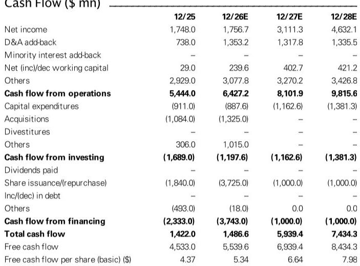
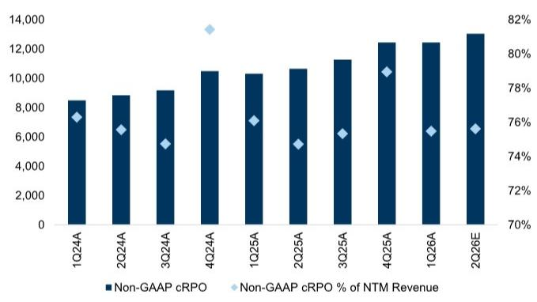
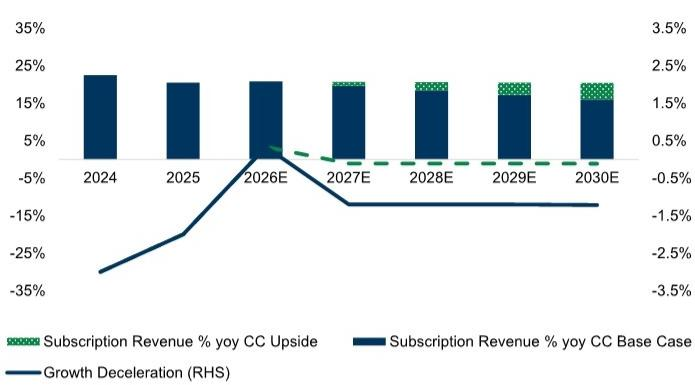

# GS：ServiceNow推100天ROI保证，AI用例从概念走向量化

企业软件市场正在经历一个微妙的信任重建期。当一家公司连续完成多笔数十亿美元的并购，市场最关心的不是整合进度，而是它的核心业务到底稳不稳。

GS在ServiceNow 7月22日二季报发布前更新了判断。报告的核心逻辑很清晰：ServiceNow的重新定价，取决于它能否向市场证明自己在企业AI堆栈中的不可或缺性。这不是一个关于短期业绩的问题，而是关于增长算法的可信度。

## 1. 二季报的预期差，藏在指引的保守里

ServiceNow对二季度的指引本身已经包含了足够的审慎。有机cRPO增速指引约为17.25%，相比一季度的约20%明显节奏变化。中东地缘政治因素导致的上季度部分本地部署交易推迟，让管理层在指引中额外留出了缓冲空间。

但GS认为，这个低基数恰恰创造了超预期的空间。报告预计二季度cRPO增速有望达到20.5%至21.5%，订阅收入增速为22%至22.5%。如果兑现，这将分别超出指引约150个基点和100个基点，与公司过去三年的平均超预期幅度基本吻合。

真正需要关注的不只是二季度数据本身，而是三季度cRPO指引会如何揭示增长减速的节奏。在并购贡献已被充分预期的情况下，有机增长的稳定性才是市场定价的锚点。

> **KC评论：** GS对二季报超预期的判断，建立在管理层主动压低指引的基础上。但真正值得跟踪的是三季度指引——它才是判断有机增长是否触底的关键信号。完整报告中对cRPO覆盖率的图表值得细看。

## 2. 并购不是从弱势出发，但市场需要看到核心业务企稳

市场对ServiceNow连续收购Moveworks、Armis、Veza存在一个普遍疑虑：这是否意味着内生增长动力不足？

GS的观点值得认真对待。报告指出，在技术范式转换期，企业需要同时配置有机和无机资源来应对变化。AI技术生态的动态性决定了，完全依赖内部研发来赌未来技术路径，不如通过收购快速补齐功能缺口。近期收购ai.work（一个构建企业级AI代理的小型交易）就是这一策略的延续。

但问题在于，市场对并购逻辑的接受度，最终取决于核心业务的增长轨迹。ServiceNow在2026年指引中已经假设核心业务增速节奏变化200个基点，相比2023至2025年每年300/300/200个基点的减速幅度，这是一个明确的信号：管理层认为最陡峭的减速期已经过去。

这个判断是否正确，需要二季报和三季报的数据来验证。

## 3. AI用例正在从概念走向可量化承诺

报告提到一个容易被忽视的细节：ServiceNow在Knowledge大会上推出了ITSM一级自动化这一关键用例，并附带了100天ROI保证。这直接回应了系统集成商此前的一个核心顾虑——不知道应该用哪个用例去跟客户谈。

有了明确的用例锚点，再加上NVIDIA、FedEx、CVS Health等标杆客户的落地案例，ServiceNow在AI变现路径上的叙事正在从“我们能做到”转向“我们已经做到了”。

但这并不意味着市场会立刻买单。GS在报告中反复强调一个观察：ServiceNow的重新定价，需要看到有机收入的稳定以及全公司收入预期的向上修正。换句话说，AI的故事需要体现在财务数字里，而不仅仅是产品发布会上。

> **KC评论：** 100天ROI保证是一个被低估的信号。它意味着ServiceNow对自己的AI产品有足够信心，也意味着它愿意承担客户验证失败的不确定性。完整报告中对CRM工作流和Security工作流的市场占有率拆分，提供了更具体的增长来源分析。

## 4. 报告尚未完全回答的关键问题

GS这份报告的核心判断是清晰的，但它也留下了几个有待验证的问题。

第一，并购整合的实际节奏。Moveworks和Armis的贡献已经被纳入指引，但交叉销售的落地速度、客户对新增产品的接受程度，在短期内仍然难以精确量化。

第二，有机增长企稳的时间点。2026年指引假设的200个基点减速是否足够保守？如果宏观环境或竞争格局出现变化，这个假设可能需要修正。

第三，AI功能对安全工作流的真正价值。报告认为ServiceNow在身份治理领域可能通过AI控制塔等工具获得份额，但这一判断还需要更多客户案例来支撑。

对于关注企业软件赛道的读者而言，ServiceNow二季报的意义不只是数字本身，更是一个观察AI平台型企业能否兑现增长承诺的窗口。GS给出的框架——关注有机cRPO的稳定性和全公司收入预期的方向——值得在后续几个季度持续跟踪。

For informational purposes only. Portions may be generated,translated,summarized,or edited with AI assistance based on source materials and may contain omissions or errors. Please verify independently. This is not investment,legal,tax,accounting,or other professional advice.

For informational purposes only. Portions may be generated,translated,summarized,or edited with AI assistance based on source materials and may contain omissions or errors. Please verify independently. This is not investment,legal,tax,accounting,or other professional advice.

