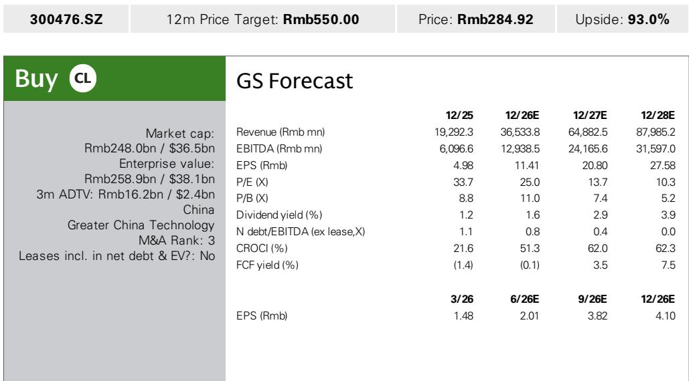
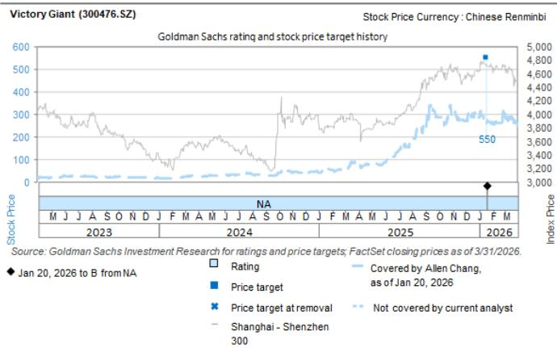

# GS：中国PCB外迁的真相，不是成本战，而是溢价能力

当市场还在争论中国PCB产业外迁是否会侵蚀利润时，GS在7月实地调研后给出了一个反直觉的判断：成本不是决定项，客户支付意愿才是。这份针对沪电股份泰国工厂的调研报告，核心信号只有一个——产能分散化正在从防御性策略转向溢价能力证明。

为什么这个判断值得关注？因为过去两年，几乎所有中国电子制造企业的海外扩产都被市场解读为“被动应对关税”。GS的调研结论却表明，头部PCB厂商的泰国产能正在获得客户主动溢价。如果这个逻辑成立，那么市场对相关公司海外业务的估值方式可能需要修正。

## 1. 泰国生产成本比国内高10-20%，但客户愿意承担

GS团队实地走访了沪电股份位于大城府的三个厂区。目前A1厂已量产，A2厂在建，预计2026年三季度投产。公司给出的信息很直接：泰国生产成本比国内高出10-20%，主要原因是覆铜板等原材料从国内进口需缴纳超过10%的关税。尽管泰国当地劳动力成本更低，但生产效率仍低于国内工人。

关键转折在于客户反应。管理层明确表示，即使成本高出20%，客户也愿意支付。这背后有两个支撑：一是全球科技巨头对供应链多元化的刚性需求，二是沪电股份在AI PCB领域的技术卡位——A1厂约20%产值来自汽车PCB，其余大部分产能正用于AI PCB的客户认证。

> **KC评论：** 成本溢价能否转嫁给客户，是海外扩产估值逻辑的分水岭。如果客户不买单，海外产能就是利润影响；如果客户愿意溢价，海外产能就是竞争壁垒。GS调研给出了后者的初步证据，但完整报告里关于客户认证进度和具体溢价幅度的细节，才是判断这一逻辑可持续性的关键。

## 2. 中期毛利率目标与国内持平，靠的是自动化而非压价

GS报告没有停留在“成本更高但客户接受”的层面，而是进一步追问了中期盈利路径。公司给出的目标是：同一产品在泰国的毛利率中期达到国内水平。实现路径有三条：提升自动化生产水平、推动国内CCL供应商在泰国就近设厂、以及泰国本地劳工效率的爬坡。

这三条路径的排序很有意味。自动化排在首位，说明公司不打算通过压低泰国工人工资来缩小成本差距，而是通过资本投入和供应链本地化来解决。目前沪电在泰国有超过1400名员工，其中50%是泰国本地劳工，25%来自缅甸，25%来自国内。这个人员结构也暗示，效率提升的核心变量在于管理输出和自动化替代，而非劳动力套利。

## 3. 报告没有完全回答的问题：AI PCB的认证节奏和客户集中度

GS调研的亮点在于实地验证了产能进度和成本结构，但有两个关键问题报告没有充分展开。

第一，AI PCB的客户认证进度。A1厂目前处于客户认证阶段，报告没有披露具体通过时间表和预期订单量。考虑到AI服务器PCB的规格升级正在加速——从传统多层板向高多层、高密度、低损耗方向演进——认证周期的长短将直接影响产能利用率和盈利爬坡速度。

第二，客户集中度与议价权的关系。报告提到公司扩产“紧密跟随客户需求”，且部分客户对产地分散没有严格要求。这意味着并非所有客户都愿意为泰国产能支付溢价。如果溢价仅来自少数核心客户，那么产能扩张的规模效应可能受限。

> **KC评论：** 对于关注电子制造产业链的读者，GS这份报告提供了一个观察框架：把“海外产能”从成本项重新定义为“溢价能力项”。真正需要跟踪的指标不是产能面积或研究额，而是：客户认证通过后，泰国工厂的毛利率能否如期向国内水平收敛。这需要后续季度的数据验证。

---

For informational purposes only. Portions may be generated,translated,summarized,or edited with AI assistance based on source materials and may contain omissions or errors. Please verify independently. This is not investment,legal,tax,accounting,or other professional advice.

For informational purposes only. Portions may be generated,translated,summarized,or edited with AI assistance based on source materials and may contain omissions or errors. Please verify independently. This is not investment,legal,tax,accounting,or other professional advice.

