## 宏观环境观察：近期经济指标更新

以下是我们近期对部分经济指标的观察更新。相关数据可在此处下载。交互式图表可在此处查看。

过去一周，名义宏观环境指数收紧2.3个基点至98.45，主要受长期利率上升影响。实际宏观环境指数收紧1.2个基点至98.17：

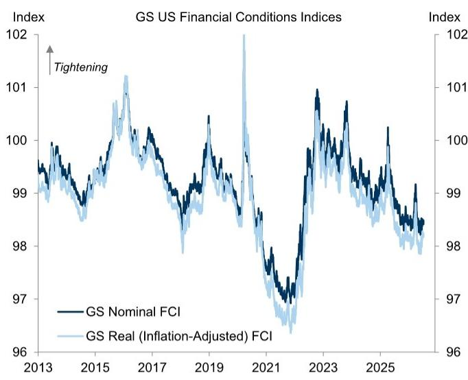  
来源：研究机构

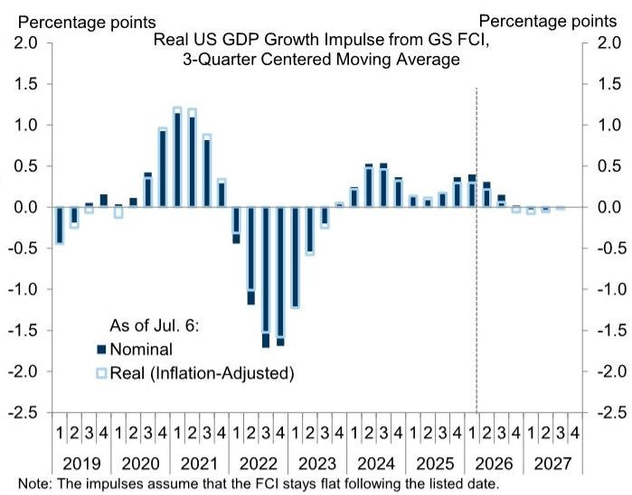

  
来源：研究机构

我们对第二季度经济活动的预估为+2.2%（环比年化）：

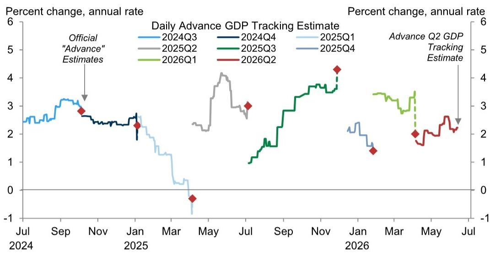  
来源：研究机构

我们的经济意外指数净值为+0.1：
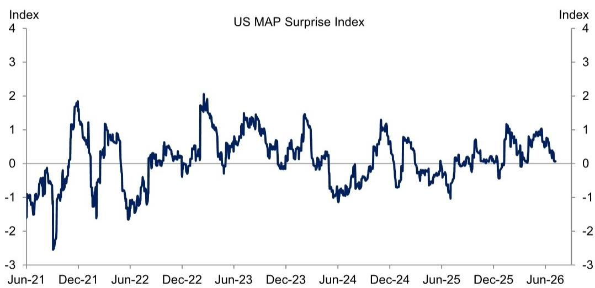  
来源：研究机构

我们的6月当前活动指标为+2.6%（5月为+2.6%）：

  
\*基于37个关键周度和月度经济指标的第一主成分。  
来源：研究机构

资本支出追踪：
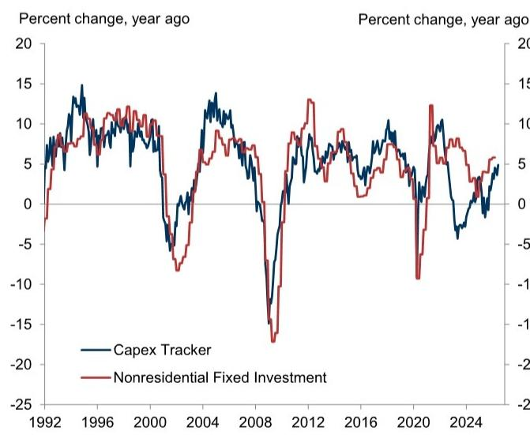  
来源：研究机构

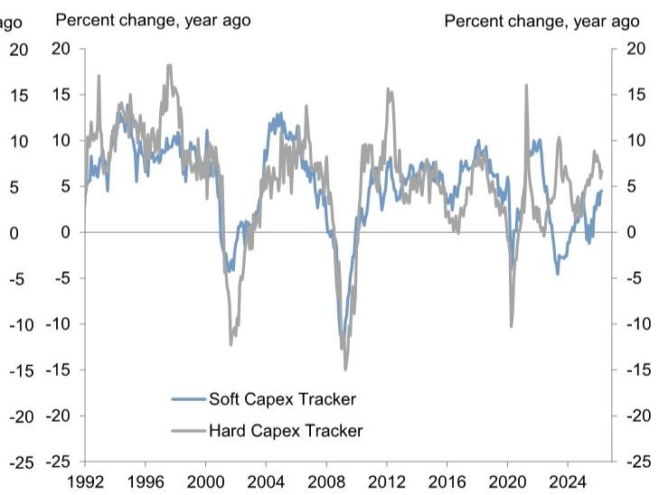

就业缺口追踪与就业增长追踪：
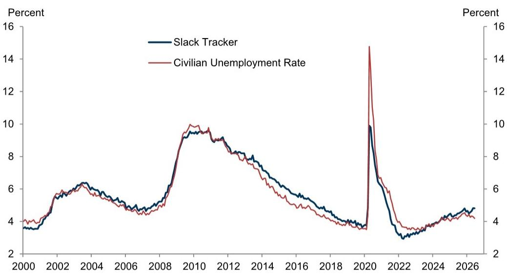

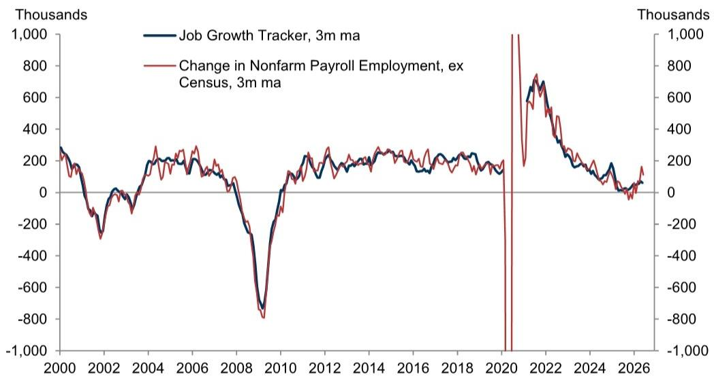  
来源：研究机构

制造业调查追踪：
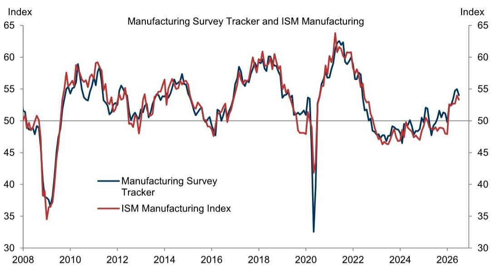  
来源：供应管理协会，研究机构

非制造业调查追踪：
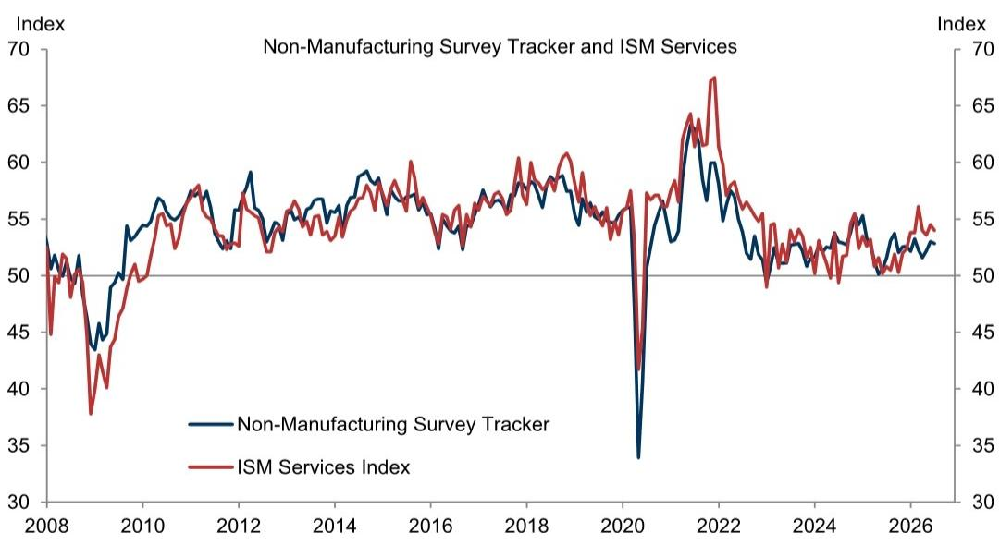  
来源：供应管理协会，研究机构

薪资追踪：
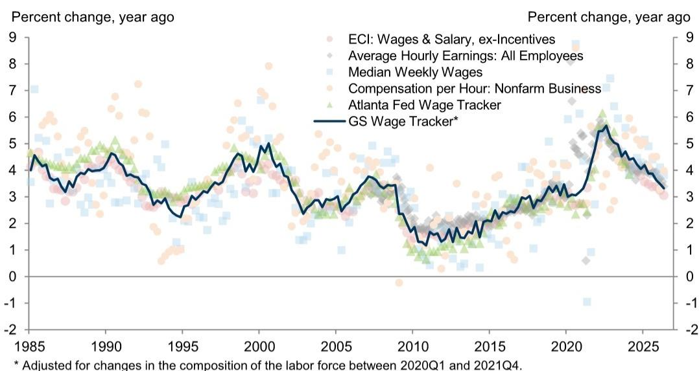  
来源：劳工部，亚特兰大联邦储备银行，研究机构

月度薪资调查：
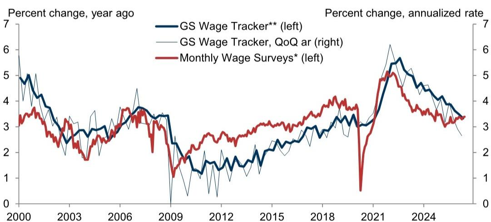  
\* 基于NFIB、达拉斯联储制造业、达拉斯联储服务业、里士满联储制造业、里士满联储服务业、纽约联储服务业和堪萨斯城联储服务业的平均值，按6个月年化平均时薪调整。 \*\*已根据2020年第一季度至2021年第四季度劳动力构成变化进行调整。

核心价格追踪：
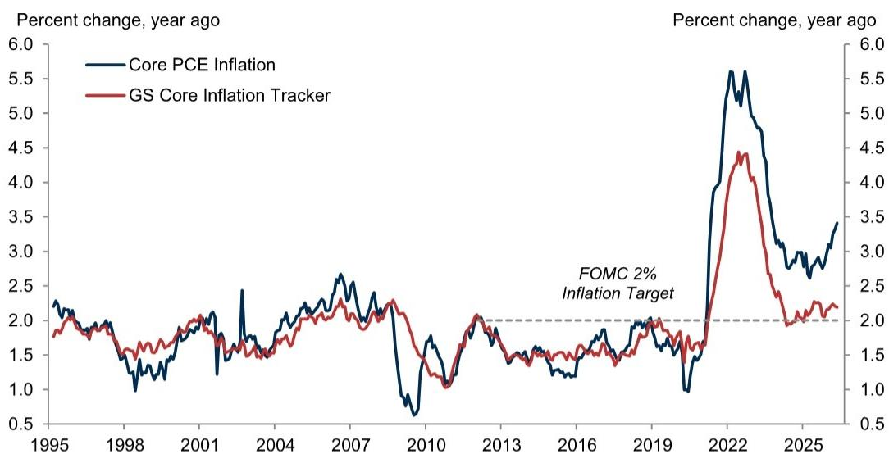  
来源：商务部，研究机构

社交媒体经济情绪指数：
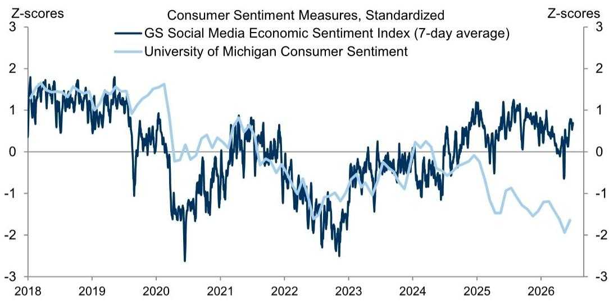  
来源：密歇根大学，研究机构

## 研究团队

Jan Hatzius  
Ronnie Walker  
Pierfrancesco Mei  
Alec Phillips  
Manuel Abecasis  
Jessica Rindels  
David Mericle  
Elsie Peng

## 附录

## 声明

我，Jessica Rindels，特此证明本报告中表达的所有观点均准确反映了我个人的观点，并未受到公司业务或客户关系的影响。

除非另有说明，本报告封面所列人员均为研究机构分析师。

撰稿人：Jessica Rindels

除非另有说明，本报告撰稿人披露中列出的个人均为研究机构分析师。

## 披露信息

## 监管披露

## 美国法律法规要求的披露

请参见上述针对本报告提及公司的具体监管披露，以了解以下任何要求的披露：待定交易中的经理或联合经理；1%或以上所有权；特定服务的报酬；客户关系类型；前期管理/联合管理的公开发行；董事职位；对于权益证券，做市和/或专业角色。本机构可能作为本金交易本报告中讨论的发行人的债务证券（或相关衍生品）。

以下为额外要求的披露：所有权和重大利益冲突：本机构政策禁止其分析师、向分析师汇报的专业人员及其家庭成员持有分析师覆盖范围内的任何公司的证券。分析师薪酬：分析师的薪酬部分基于本机构的盈利能力，其中包括投行业务收入。分析师作为高管或董事：本机构政策通常禁止其分析师、向分析师汇报的人员或其家庭成员在分析师覆盖范围内的任何公司担任高管、董事或顾问。非美国分析师：非美国分析师可能不是本机构的关联人员，因此可能不受FINRA规则2241或FINRA规则2242关于与目标公司沟通、公开露面以及交易分析师所覆盖证券的限制。

## 美国以外司法管辖区法律和法规要求的额外披露

以下为特定司法管辖区要求的披露，除非已根据美国法律法规在上文作出。澳大利亚：本机构澳大利亚有限公司及其关联公司并非澳大利亚的授权存款机构（该术语定义见1959年银行法（联邦）），不提供银行服务，也不在澳大利亚开展银行业务。除非本机构另有约定，本研究及其访问权限仅面向澳大利亚公司法定义的“批发客户”。在撰写研究报告时，本机构澳大利亚全球投资研究成员可能会参加由其研究报告所涉及的公司和其他实体主办或组织的实地考察和其他会议。在某些情况下，如果本机构澳大利亚认为在实地考察或会议的具体情况下适当且合理，相关发行人可能会部分或全部承担此类实地考察或会议的费用。如果本文件内容包含任何金融产品建议，则仅为一般性建议，由本机构在未考虑客户目标、财务状况或需求的情况下编制。客户在根据任何此类建议采取行动前，应考虑该建议是否适合其自身目标、财务状况和需求。本机构澳大利亚和新西兰利益披露声明以及本机构澳大利亚卖方研究独立性政策声明的副本可在以下网址获取：https://www.goldmansachs.com/disclosures/australia-new-zealand/index.html。巴西：有关CVM第20号决议的披露信息可在https://www.gs.com/worldwide/brazil/area/gir/index.html获取。在适用的情况下，根据CVM第20号决议第20条定义，对本研究报告内容负主要责任的巴西注册分析师为本报告开头列出的第一作者，除非文末另有说明。加拿大：此信息仅供您参考，在任何情况下均不应被解释为本机构为在加拿大购买证券以交易任何加拿大证券而发布的广告、要约或招揽。本机构未根据适用的加拿大证券法在加拿大任何司法管辖区注册为交易商，通常不被允许交易加拿大证券，并可能被禁止在加拿大某些司法管辖区出售某些证券和产品。如果您希望在加拿大交易任何加拿大证券或其他产品，请联系本机构加拿大公司（本集团公司的关联公司）或其他注册的加拿大交易商。香港：可向本机构（亚洲）有限责任公司索取本研究报告所涉覆盖公司证券的进一步信息。印度：可向本机构（印度）证券私人有限公司索取本研究报告所涉目标公司或公司的进一步信息，SEBI注册号INH000001493，地址：10th Floor, Ascent-Worli, Sudam Kalu Ahire Marg, Worli, Mumbai-400,025, India，企业识别号U74140MH2006FTC160634，电话+91 22 6616 9000，传真+91 22 6616 9001。本机构可能实益拥有本研究报告所涉目标公司或公司1%或以上的证券（该术语定义见1956年印度证券合约（监管）法第2(h)条）。SEBI的注册和NISM的认证绝不保证中介机构的业绩或向读者提供任何回报保证。本机构（印度）证券私人有限公司合规官和读者投诉联系详情、年度合规审计报告副本以及其他相关信息和披露可在此链接找到：https://www.goldmansachs.com/worldwide/india/research-analyst。日本：见下文。韩国：除非本机构另有约定，本研究及其访问权限仅面向《金融服务和资本市场法》定义的“专业读者”。可向本机构（亚洲）有限责任公司首尔分行索取本研究报告所涉目标公司或公司的进一步信息。新西兰：本机构新西兰有限公司及其关联公司在新西兰既非“注册银行”也非“存款接受者”（定义见1989年新西兰储备银行法）。除非本机构另有约定，本研究及其访问权限面向“批发客户”（定义见2008年金融顾问法）。本机构澳大利亚和新西兰利益披露声明副本可在以下网址获取：https://www.goldmansachs.com/disclosures/australia-new-zealand/index.html。俄罗斯：在俄罗斯联邦分发的研究报告不属于俄罗斯立法定义的广告，而是不以推广产品为主要目的的信息和分析，并且不提供俄罗斯评估活动立法意义上的评估。研究报告不构成俄罗斯法律法规定义的个人化研究交流，不针对特定客户，且未分析客户的财务状况、投资概况或风险概况。本机构不对客户或任何其他人基于本研究报告可能做出的任何投资决策承担任何责任。新加坡：本机构（新加坡）私人有限公司（公司编号：198602165W）受新加坡金融管理局监管，对本研究承担法律责任，如有任何与本研究报告相关的事宜，请联系该公司。台湾：此材料仅供参考，未经许可不得转载。读者应仔细考虑自身的投资风险。投资结果由个人读者自行负责。英国：在英国被归类为零售客户（定义见金融行为监管局规则）的人士，应结合本机构先前关于本报告所涉覆盖公司的研究报告阅读本研究，并应参考本机构国际公司已发送给他们的风险警告。这些风险警告的副本以及本报告中使用的某些金融术语的词汇表，可应要求向本机构国际公司索取。

欧盟和英国：有关欧盟委员会授权条例(EU) (2016/958)第6(2)条（该条例补充欧洲议会和理事会条例(EU) No 596/2014，包括该授权条例在英国脱离欧盟和欧洲经济区后转化为英国国内法律和法规的情况）关于研究交流或其他建议或暗示投资策略的信息客观呈现的技术安排以及特定利益或利益冲突迹象披露的监管技术标准的信息，可在https://www.gs.com/disclosures/europeanpolicy.html获取，其中说明了与投资研究相关的利益冲突管理欧洲政策。日本：本机构日本有限公司是在关东财务局注册的金融工具交易商，注册号金商第69号，是日本证券业协会、日本金融期货协会、第二类金融工具业协会和日本投资管理协会的会员。股票买卖需收取与客户预先确定的佣金加上消费税。有关日本交易所、日本证券业协会或日本证券金融公司要求的任何适用披露，请参见公司特定披露。

## 全球产品；分发实体

本机构全球投资研究为全球客户制作和分发研究产品。分布在全球各地本机构办事处的分析师对行业和公司以及宏观经济、货币、大宗商品和投资组合策略进行研究。本研究由以下实体分发：在澳大利亚由本机构澳大利亚有限公司（ABN 21 006 797 897）分发；在巴西由本机构巴西公司分发；公共沟通渠道：0800 727 5764 和/或 contatogoldmanbrasil@gs.com。工作日（节假日除外）上午9点至下午6点开放；在加拿大由本机构分发；在香港由本机构（亚洲）有限责任公司分发；在印度由本机构（印度）证券私人有限公司分发；在日本由本机构日本有限公司分发；在韩国由本机构（亚洲）有限责任公司首尔分行分发；在新西兰由本机构新西兰有限公司分发；在俄罗斯由本机构俄罗斯有限责任公司分发；在新加坡由本机构（新加坡）私人有限公司（公司编号：198602165W）分发；在美国由本机构分发。本机构国际公司已批准本研究以便在英国分发。

本机构国际公司，由审慎监管局授权并由金融行为监管局和审慎监管局监管，已批准本研究以便在英国分发。

欧洲经济区：本机构欧洲银行是一家在德国注册的信贷机构，在单一监管机制下，接受欧洲央行的直接审慎监管，并在其他方面受德国联邦金融监管局和德国联邦银行的监管，并在欧洲经济区内分发研究。

## 一般披露

本研究仅供我们的客户使用。除与本机构相关的披露外，本研究基于我们认为可靠的当前公开信息，但我们不保证其准确或完整，也不应依赖于此。本文所含信息、意见、估计和预测均为截至本文日期，如有更改，恕不另行通知。我们力求在适当的时候更新我们的研究，但各种法规可能阻止我们这样做。除某些定期发布的行业报告外，大多数报告根据分析师的判断不定期发布。

本机构开展全球全方位、综合性的投资银行、投资管理和经纪业务。我们与全球投资研究所覆盖的相当大比例的公司存在投资银行和其他业务关系。本机构，美国经纪交易商，是SIPC的成员。

我们的销售人员、交易员和其他专业人士可能会向我们的客户和自营交易部门提供口头或书面的市场评论或交易策略，这些评论或策略反映的观点可能与本研究表达的观点相反。我们的资产管理部、自营交易部门和投资业务可能做出与本研究报告中的建议或观点不一致的投资决策。

除非法规或本机构政策另有禁止，我们及我们的关联公司、高级职员、董事和员工将不时持有本研究报告所述证券或衍生品（如有）的多头或空头头寸、担任其自营商以及买卖该等证券或衍生品。

在本机构组织的会议上归因于第三方演讲者（包括来自本机构其他部门的个人）的观点，不一定反映全球投资研究的观点，也不是本机构的官方观点。

本文引用的任何第三方，包括任何销售人员、交易员和其他专业人士或其家庭成员，可能持有本报告所述产品的头寸，且这些头寸与本报告所述分析师表达的观点不一致。

本研究侧重于跨市场、行业和板块的投资主题。它不试图区分我们描述的任何行业或板块内单个公司的前景或表现，也不提供对它们的分析。

本研究中与某个行业或板块内的权益或信用证券相关的任何交易建议，均反映了所讨论的投资主题，并非对任何此类证券的孤立建议。

本研究不构成在任何司法管辖区出售或招揽购买任何证券的要约，如果此类要约或招揽在该司法管辖区属非法行为。本研究不构成个人推荐，也未考虑个别客户的具体投资目标、财务状况或需求。客户应考虑本研究中的任何建议或推荐是否适合其特定情况，并在适当情况下寻求专业建议，包括税务建议。本研究中提及的投资的价格和价值以及从中获得的收入可能会波动。过往表现并非未来表现的指引，未来回报不保证，且可能发生原始资本损失。汇率波动可能对某些投资的价值或价格或从中获得的收入产生不利影响。

某些交易，包括涉及期货、期权和其他衍生品的交易，会带来重大风险，并不适合所有读者。读者应查阅当前的期权和期货披露文件，这些文件可从本机构销售代表处或以下网址获取：https://www.theocc.com/about/publications/character-risks.jsp 和 https://www.goldmansachs.com/disclosures/cftc_fcm_disclosures。在期权策略中，交易成本可能很高，例如涉及多次买卖期权的价差策略。将应要求提供支持性文件。

全球投资研究提供的不同服务水平：本机构全球投资研究向您提供的服务水平和类型，可能与向本机构内部及其他外部客户提供的服务有所不同，具体取决于多种因素，包括您个人对沟通频率和方式的偏好、您的风险状况和投资重点及视角（例如，市场范围、特定板块、长期、短期）、您与本机构整体客户关系的规模和范围，以及法律和监管限制。

例如，某些客户可能要求在发布特定证券的研究时收到通知，某些客户可能要求将分析师基本面分析所依据的特定数据（这些数据可在我们的内部客户网站上获取）通过数据馈送或其他方式以电子形式交付给他们。分析师基本面研究观点的任何变化（例如，评级、目标价或对权益证券盈利预测的重大变化），在通过电子方式在我们的内部客户网站上广泛发布研究报告或以其他必要方式向所有有权接收此类报告的客户传达之前，不会传达给任何客户。

所有研究报告均通过电子方式在我们的内部客户网站上同时向所有客户发布和提供。并非所有研究内容都会重新分发给我们的客户或提供给第三方聚合商，本机构也不对第三方聚合商重新分发我们的研究负责。对于与一个或多个证券、市场或资产类别相关的研究、模型或其他数据（包括相关服务），请联系您的本机构代表或访问 https://research.gs.com。

披露信息也可在 https://www.gs.com/research/hedge.html 获取，或联系研究合规部，地址：200 West Street, New York, NY 10282。

## © 2026 本机构。

您仅可为自己使用而存储、展示、分析、修改、重新格式化及打印通过本服务提供给您的信息。未经本机构明确书面同意，您不得转售或逆向工程此信息以计算或开发任何用于披露和/或营销的指数，或创建任何其他衍生作品或商业产品、数据或产品。未经本机构明确书面同意，您不得以任何形式向任何第三方发布、传输或以其他方式复制此信息的全部或部分。前述限制包括但不限于使用、提取、下载或检索此信息的全部或部分，以训练或微调机器学习或人工智能系统，或向任何此类系统提供或复制此信息的全部或部分作为提示或输入。
