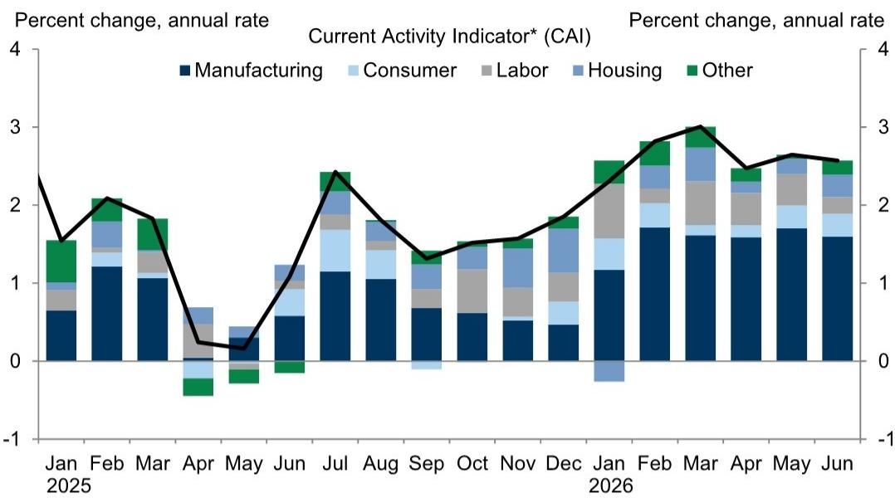
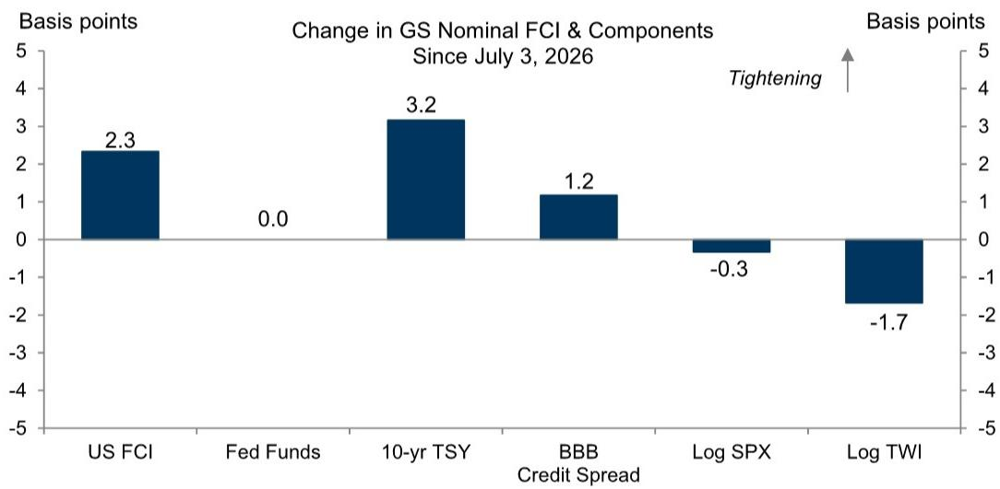

# GS：美国宏观韧性超预期，GS，资金条件收紧有限

当市场还在为美联储降息节奏反复争论时，GS最新发布的宏观环境指标更新给出了一个更稳定的画面。这份由Jan Hatzius团队更新的高频数据包显示，美国宏观环境当前处于一种“温和但未过热”的状态，核心指标既没有指向调整，也没有暗示重新加速。

报告最值得关注的不是单一数据，而是这些指标组合在一起传达的信号：美国宏观环境的韧性比市场定价所反映的更强，但通胀不确定性也在有序回落。这种组合意味着，美联储不需要急于行动，也不需要被迫暂停。

## 1. 资金条件收紧的幅度有限，市场定价与基本面之间仍有距离

GS的资金条件指数在过去一周名义上收紧了2.3个基点，主要来自10年期国债回报表现的上升。但值得注意的是，实际资金条件指数仅收紧1.2个基点，到98.17。这个差值本身就是一个信号：市场对利率的敏感度正在下降，或者说，宏观环境对利率的承受力在增强。

从历史经验看，当资金条件收紧到一定程度时，宏观环境动能会明显受损。但当前的水平距离那个临界点还有距离。GS对二季度GDP的预测维持在2.2%（季环比年化），这个数字既不惊艳，也不令人担忧，恰好落在“软着陆”的叙事框架内。

> **KC评论：** 资金条件指数是观察政策传导效率的关键工具。GS的这个数据告诉我们，即使长端利率上行，对实体宏观环境的抑制效果可能被企业盈利韧性部分抵消。读者如果关注利率敏感型资产，可以重点看报告里的实际FCI走势图，它比名义值更能反映真实约束。

## 2. 宏观环境活动指标稳定，但惊喜指数暗示边际动能正在减弱

GS6月的当前活动指标为+2.6%，与5月持平。这个数字本身并不意外，但结合美国MAP宏观环境惊喜指数从高位回落至+0.1，就值得多看一眼。

惊喜指数接近零，意味着实际发布的数据与市场预期基本吻合，没有持续超预期或低于预期的情况。这恰恰是“稳态”的特征。对于决策者来说，这比剧烈波动更难以操作——因为没有足够的数据驱动政策转向，也没有足够的事件驱动市场重新定价。

报告中的就业增长追踪器和劳动力市场闲置追踪器也指向类似方向：就业增长在减速，但减速是渐进的，不是断崖式的。工资追踪器则显示，薪资增速仍在节奏变化轨道上，尚未出现二次加速的不确定性。

## 3. 通胀追踪器是关键变量，但报告没有完全回答“尾部不确定性”

GS的核心通胀追踪器是这份报告中最值得细看的图表之一。从数据走势看，核心通胀仍在缓慢节奏变化，但节奏变化速度已经明显慢于2023年下半年。这符合市场共识，但报告的局限也在这里：它没有深入讨论如果关税进一步升级或者能源价格意外上涨，通胀会如何重新定价。

对于关注宏观环境的读者来说，这份报告提供了一个基准情景，但未充分展开的恰恰是最重要的“如果”。GS自己的制造业和非制造业调查追踪器显示，服务业景气度仍然高于制造业，而制造业的疲软是否会在下半年向服务业传导，报告中只有数据，没有判断。

> **KC评论：** GS的核心通胀追踪器是当前宏观研究中最透明的高频工具之一。但报告没有讨论的是，如果劳动力市场闲置进一步减少、工资增长重新加速，通胀节奏变化的路径会如何修正。这需要读者自己去追问：通胀的“最后一公里”到底需要多长时间走完？

## 4. 报告未完全回答的关键问题：数据稳态能维持多久

这份报告的最大价值在于确认了“没有意外”。但“没有意外”本身就是一个需要被追问的状态：它能持续多久？

当前的数据组合——GDP增速2.2%、就业温和节奏变化、通胀缓慢节奏变化、资金条件略有收紧——是典型的“软着陆”配置。但软着陆的脆弱性在于，任何一边的变化都可能打破平衡。如果消费意外走弱，GDP增速可能跌破2%；如果工资不确定性重新抬头，通胀节奏变化可能暂停。

GS的报告没有给出这些尾部情景的概率，这也正是报告的诚实之处：它只呈现数据，不替决策者做判断。对于读者来说，真正需要关注的不是2.2%这个数字本身，而是支撑这个数字的底层结构——消费是否还有后劲，企业研究是否在调整，政府支出是否在下半年减弱。

这些问题的答案，不在GS这份周度更新里，但这份更新提供了追问这些问题的起点。

---

For informational purposes only. Portions may be generated,translated,summarized,or edited with AI assistance based on source materials and may contain omissions or errors. Please verify independently. This is not investment,legal,tax,accounting,or other professional advice.

For informational purposes only. Portions may be generated,translated,summarized,or edited with AI assistance based on source materials and may contain omissions or errors. Please verify independently. This is not investment,legal,tax,accounting,or other professional advice.

