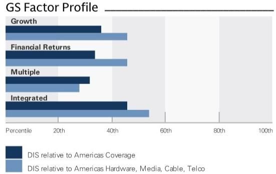
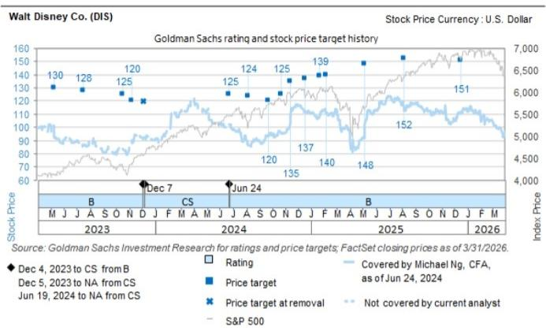
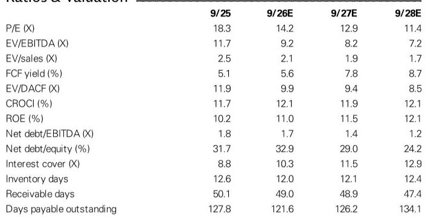

# GS：GS拆解迪士尼奥兰多，客流下降2%，消费却创历史新高

奥兰多机场5月客流同比下降2%，但当地酒店税收入却创下同期新高。这两个看似矛盾的数据，恰好勾勒出迪士尼主题公园业务当前的真实处境——国内客流在正常化，但国际游客正在补位，且游客的消费意愿并未减弱。

GS最新一期奥兰多旅游市场追踪报告，通过两个高频指标拆解了迪士尼（DIS）的季度内需求变化。数据来自奥兰多国际机场（MCO）的乘客量和奥兰治县的旅游发展税（TDT）收入。前者反映客流规模，后者反映实际消费金额。

5月MCO总客流同比下降2%，较4月的+3%明显节奏变化。影响主要来自国内旅客，同比下滑3%。但国际旅客增长了2%，且已连续两个月实现正增长。GS指出，这符合迪士尼管理层此前的判断——国际客流已度过疫后恢复的重叠期，不再呈现进一步出现变化的迹象。

与此同时，奥兰治县5月TDT收入同比增长9%至3280万美元，尽管增速较4月的+14%有所节奏变化，但仍是历史同期最高水平，且已连续14个月保持增长。

> **KC评论：** 客流下降但消费额创新高，说明游客结构或消费行为正在发生变化。完整报告中对国内与国际客流的分拆数据，以及TDT收入的月度趋势图，值得仔细对比。

## 1. 国内客流仍在调整不等于需求转弱，结构变化才是关键

5月国内到达旅客同比下降3%，与4月+4%的增速形成明显反差。但这一变化需要放在更长的时间轴上看。2025年同期基数较高（国内客流在2025年4-5月已开始回升），同时5月本身是季节性过渡月份，波动本身并不罕见。

真正值得关注的是国际客流的恢复节奏。在经历了连续三个月的相对疲软后，国际客流在4月和5月连续录得同比增长。GS认为，这意味着迪士尼国际游客的疫后恢复期已基本完成，不再构成进一步的节奏变化不确定性。

对于迪士尼的公园业务而言，国际游客的价值远高于国内游客——他们在园内停留时间更长，人均消费更高，对酒店、餐饮和衍生品的贡献也更显著。如果国际客流能持续改善，将直接支撑公园业务的收入质量。

## 2. 消费额创纪录说明定价能力仍在，但增速节奏变化需要关注

TDT收入同比增长9%创下5月新高，且连续14个月增长，这是报告中最积极的信号。它表明，尽管国内客流出现月度波动，但游客在奥兰多的总体消费支出仍在扩大。

不过，增速从4月的+14%降至5月的+9%，这一节奏变化幅度值得跟踪。GS在报告中并未给出具体的解释，但可能的因素包括：5月并非美国学校假期高峰，家庭出游密度下降；或是消费者在高通胀环境下对非必需支出的边际敏感度上升。

> **KC评论：** TDT收入是消费额而非客流量的代理变量。它包含了酒店住宿、餐饮、门票等多项支出。如果后续几个月增速继续收窄，可能需要重新评估游客的消费意愿是否在边际走弱。报告中的月度TDT收入图表，是观察这一趋势的最佳工具。

## 3. 报告尚未完全回答的关键问题：客流结构与定价之间的平衡能持续多久

GS用MCO客流数据作为迪士尼国内公园客流的领先指标，并估算C2Q26（4-6月）整体客流同比增速约为+1%，与其此前预期一致。但这份高频追踪报告有两个未完全展开的问题。

第一，国内客流下降是否源于迪士尼自身定价策略的主动调整（如提高票价以筛选高价值游客），还是外部需求走弱的被动结果？如果是前者，TDT收入的创新高可以解释为结构优化；如果是后者，则需要警惕后续消费额的节奏变化不确定性。

第二，国际客流的增长能否持续，尤其是来自欧洲和亚洲的长途游客。报告显示国际客流在连续三个月疲软后恢复增长，但5月的+2%增速仍远低于2024年同期的+9%。恢复的斜率还需要更多月份的数据来确认。

对于跟踪迪士尼公园业务的读者来说，这份报告提供了一个有用的实时观察框架：客流与消费额不再同步变化，意味着单纯盯着入园人数已不足以判断业务健康度。更关键的是游客结构（国内vs国际）和消费强度（人均支出）的组合变化。后续6-8月的暑期旺季数据，将是验证这一框架是否成立的关键窗口。

For informational purposes only. Portions may be generated,translated,summarized,or edited with AI assistance based on source materials and may contain omissions or errors. Please verify independently. This is not investment,legal,tax,accounting,or other professional advice.

For informational purposes only. Portions may be generated,translated,summarized,or edited with AI assistance based on source materials and may contain omissions or errors. Please verify independently. This is not investment,legal,tax,accounting,or other professional advice.

