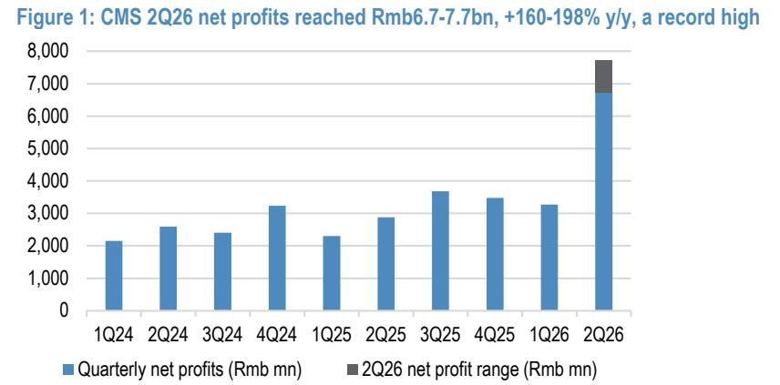
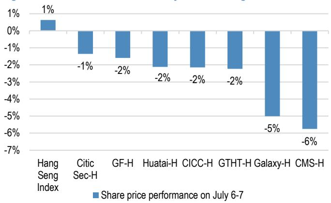
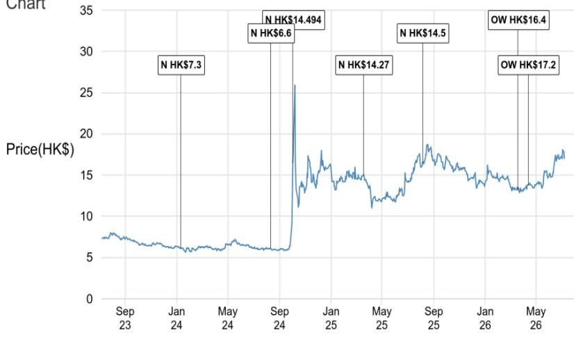

本材料无意向中国大陆读者分发，也不在中国大陆境内提供证券投资咨询服务。未经JPM书面同意，不得转载、出售或重新分发本材料或其任何部分。

# CMS Company Ltd - H

2Q26利润同比增长160-198%，超出预期；但这重要吗？

2Q26业绩大幅超出预期。7月7日收盘后，CMS发布了1H26初步业绩公告（链接）。2Q26净利润同比增长160-198%至67-77亿元人民币，创历史新高，可能高于市场预期。尽管如此，读者可能会质疑，在GTHT发布强劲的业绩预告后（链接），A/H股券商股价本周平均下跌3%/3%的情况下，超出预期是否仍然重要。我们认为，CMS的业绩进一步验证了我们对行业的建设性看法，而近期股价的走弱，考虑到该行业估值不高以及业绩预告后市场共识可能上调，反而提供了关注的机会。我们预计CICC、Citic Sec和广发证券可能在未来几周发布业绩预告。

- 2Q26业绩大幅超出预期：7月7日收盘后，CMS发布了1H26初步业绩的交易所公告（链接）。根据公告，其1H26净利润将达到100-110亿元人民币，同比增长93-112%。这意味着2Q26净利润为67-77亿元人民币，同比增长160-198%。该业绩可能高于市场预期，因为1H26净利润分别占JPMe和彭博一致预期的FY26净利润的69-76%/67-74%。CMS在公告中未提供更多细节。我们预计强劲的业绩主要得益于2Q26投资收入和经纪业务收入的增长。

- 但市场为何对GTHT的业绩预告反应不积极？尽管GTHT上周五发布了强劲的预告（链接），但A/H股券商股价本周平均下跌3%/3%。我们将此归因于读者的获利了结以及对如此强劲表现可持续性的担忧。值得注意的是，沪深300指数和科创50指数7月至今分别下跌4%和9%。一些读者可能担心，强劲的2Q业绩主要由投资收入驱动，而市场指数的下跌可能导致3Q经营表现走弱。

- 我们认为近期股价走弱是关注的时机：我们认为这些担忧有些过度。首先，我们预计券商强劲的2Q业绩将反映经纪、投行、资本中介和投资收入的全面复苏。其次，GTHT和CMS的1H26利润均约为彭博一致预期FY26利润的70%，这表明市场低估了中国券商盈利动能的强度。我们认为共识上调有望推动行业重新定价。第三，估值仍然不高：A股和H股券商的前瞻市净率分别约为1.15倍和0.74倍。因此，我们认为回调是关注的时机，尤其是在优质券商中。

## 关注

6099.HK, 6099 HK
价格：17.03港元
2026年7月7日
目标价：17.20港元
目标价有效期：2026年12月31日

## 银行与金融服务

Peter Zhang AC
(852) 2800-8557
peter.zhang@JPM.com
JPM Securities (Asia Pacific) Limited/
JPM Broking (Hong Kong) Limited

Katherine Lei
(852) 2800-8552
katherine.lei@JPM.com
JPM Securities (Asia Pacific) Limited/
JPM Broking (Hong Kong) Limited

Lincoln Yu
(852) 2800 8523
lincoln.yu@JPM.com
JPM Securities (Asia Pacific) Limited/
JPM Broking (Hong Kong) Limited

Haomin Chen
(86-21) 6106 6347
haomin.chen@JPM.com
SAC Registration Number: S1730524080002
JPM Securities (China) Company Limited

- CXMT的上市仍是值得关注的关键催化剂：自5月18日以来，CMS的A/H股股价分别上涨了28%/23%，表现优于A/H股券商16个百分点/17个百分点。这主要得益于市场对CMS投资于CXMT（一家领先的DRAM企业）的重新评估（链接）。CXMT已获得监管批准在科创板上市。CMS近期股价的优异表现表明，市场已计入CXMT带来的积极投资收益。因此，CXMT即将进行的上市及其后续股价表现，可能成为CMS未来股价的关键驱动因素。

图1：CMS的季度净利润趋势
  
来源：公司，1Q24-2Q26财务业绩。

图2：自7月3日国泰海通业绩预告以来，H股券商平均下跌3%
  
来源：彭博金融数据。数据截至2026年7月7日。

图3：自7月3日国泰海通业绩预告以来，A股券商平均下跌3%
  
来源：彭博金融数据。数据截至2026年7月7日。

图4：A股券商近期交易于1.15倍市净率
  
来源：彭博金融数据。数据截至2026年7月7日。

图5：H股券商近期交易于0.74倍市净率
  
来源：彭博金融数据。数据截至2026年7月7日。

## 研究观点

我们对CMS-H给予关注评级。我们的分析表明，CMS正在经纪业务中获取市场份额，并将受益于共同基金业务的增长。CXMT在科创板上市可能为CMS在3Q26的投资收入带来正面影响。

## 估值

我们基于DDM模型得出的2026年12月目标价为17.20港元，该模型考虑了FY26-28E的股息以及基于ROE-g/COE-g方法的终值。我们通过时间价值折算，从当前公允价值13.9元得出2026年12月的公允价值15.0元，并使用即期人民币/港元汇率转换为H股目标价。关键假设包括：无风险利率1.80%，股权风险溢价8.0%，贝塔系数1.2倍，长期增长率4.5%。

## 估值摘要

<table><tr><td colspan="2">DDM估值</td></tr><tr><td>无风险利率</td><td>1.8%</td></tr><tr><td>股权溢价</td><td>8.0%</td></tr><tr><td>贝塔系数</td><td>1.2倍</td></tr><tr><td>资本成本</td><td>11.4%</td></tr><tr><td>长期增长率</td><td>4.5%</td></tr><tr><td>公允终值市净率倍数</td><td>0.94倍</td></tr><tr><td>每股账面价值 - 2026E (人民币)</td><td>14.9</td></tr><tr><td>每股股息 - 2026E (人民币)</td><td>0.6</td></tr><tr><td>估值日期</td><td>2026年4月13日</td></tr><tr><td>终值日期</td><td>2028年12月31日</td></tr><tr><td>终值现值 (每股人民币)</td><td>12.0</td></tr><tr><td>股息现值 (每股人民币)</td><td>1.9</td></tr><tr><td>当前公允价值 (人民币)</td><td>13.9</td></tr><tr><td>2026年12月公允价值 (人民币)</td><td>15.0</td></tr><tr><td>2026年12月目标价 (港元)</td><td>17.2</td></tr><tr><td>*人民币/港元汇率</td><td>1.15</td></tr></table>

来源：JPM估计。

## 评级与目标价风险

下行风险包括：(1) 与政府稳定基金（CSFC）缴款和对冲禁令相关的风险；(2) 对快速发展的国内资产管理业务更严格的监管监督；(3) 由于在线/移动行业平台的发展和分散的市场状况，加上经纪费用结构可能放松管制带来的不确定性，经纪佣金率面临长期压力。

上行风险包括：(1) 高于预期的经纪佣金；(2) 高于预期的新业务收入；(3) 日均交易额改善。

本报告中讨论的其他公司（除非另有说明，本报告中的所有价格均为2026年7月7日收盘价）

CITIC - A(600030.SS/28.45元人民币/关注), CITIC - H(6030.HK/27.68港元/中性), 中国国际金融股份有限公司 (3908)(3908.HK/21.88港元/关注), 广发证券股份有限公司 - A(000776.SZ/22.79元人民币/关注), 广发证券股份有限公司 - H(1776.HK/17.32港元/关注)

分析师认证：本报告封面上标有“AC”的研究分析师（或，当多位研究分析师主要负责本报告时，封面上或文件内标有“AC”的研究分析师分别就本研究中涵盖的每个证券或发行人认证）：(1) 本报告中表达的所有观点准确反映了研究分析师对任何及所有标的证券或发行人的个人观点；(2) 研究分析师的薪酬中没有任何部分直接或间接地与本研究分析师在本报告中表达的具体建议或观点相关。对于封面列出的所有韩国研究分析师（如适用），他们还根据KOFIA要求认证，研究分析师的分析是善意进行的，观点反映了研究分析师自己的意见，没有受到不当影响或干预。

除非另有说明，本报告中列出的所有作者均为独立进行研究的研究分析师。在欧洲，本报告中可能将行业专家（销售和交易）列为联系人，但他们并非本报告的作者，也不属于研究部门。

## 重要披露

- 做市商/流动性提供者：JPM是CMS Company Ltd - H或相关实体金融工具的做市商和/或流动性提供者。

- 做市商/流动性提供者（香港）：JPM Securities (Asia Pacific) Limited 和/或 JPM Broking (Hong Kong) Limited 和/或关联公司是CMS Company Ltd - H或相关实体及/或其权证或期权的做市商和/或流动性提供者，这些证券在香港联合交易所有限公司上市或交易。

- 客户：JPM目前拥有，或在过去12个月内曾拥有以下实体作为客户：CMS Company Ltd - H或相关实体。

- 客户/非投资银行、证券相关：JPM目前拥有，或在过去12个月内曾拥有以下实体作为客户，且提供的服务为非投资银行、证券相关：CMS Company Ltd - H或相关实体。

- 非投资银行补偿已收到：JPM在过去12个月内已从CMS Company Ltd - H或相关实体获得除投资银行以外的产品或服务的补偿。

- 债务头寸：JPM可能持有CMS Company Ltd - H或相关实体的债务证券头寸（如有）。

公司特定披露：JPM确实并寻求与其研究报告涵盖的公司开展业务。因此，读者应注意，该公司可能存在利益冲突，可能影响本报告的客观性。读者应将本报告视为做出投资决策的单一因素。重要披露，包括价格图表和信用意见历史表（如适用），可通过访问https://www.jpmm.com/research/disclosures、致电1-800-477-0406或发送电子邮件至research.disclosure.inquiries@JPM.com获取，适用于汇编报告和所有JPM涵盖的公司，以及某些未涵盖的公司。

CMS Company Ltd - H (6099.HK, 6099 HK) 价格图表 35

<table><tr><td>日期</td><td>评级</td><td>价格 (港元)</td><td>目标价 (港元)</td></tr><tr><td>2024年1月11日</td><td>中性</td><td>6.10</td><td>7.3</td></tr><tr><td>2024年8月11日</td><td>中性</td><td>6.09</td><td>6.6</td></tr><tr><td>2024年10月3日</td><td>中性</td><td>16.50</td><td>14.494</td></tr><tr><td>2025年3月19日</td><td>中性</td><td>14.96</td><td>14.27</td></tr><tr><td>2025年8月6日</td><td>中性</td><td>16.49</td><td>14.5</td></tr><tr><td>2026年3月20日</td><td>关注</td><td>13.22</td><td>16.4</td></tr><tr><td>2026年4月13日</td><td>关注</td><td>13.80</td><td>17.2</td></tr></table>

来源：彭博金融数据和JPM；价格数据已根据股票分割和股息进行调整。首次覆盖日期：2016年11月16日。所有股价均为前一个交易日收盘价。

图表显示了JPM对这些股票的持续覆盖；当前分析师可能并未在整个期间内覆盖这些股票。

JPM评级或名称：OW = 关注，N = 中性，UW = 低配，NR = 未评级

## 股票研究评级、名称和分析师覆盖范围说明：

JPM使用以下评级系统：关注（在本报告指示的目标价期间内，我们预计该股票的表现将优于研究分析师或其团队覆盖范围内的股票的平均总回报）；中性（在本报告指示的目标价期间内，我们预计该股票的表现将与研究分析师或其团队覆盖范围内的股票的平均总回报一致）；低配（在本报告指示的目标价期间内，我们预计该股票的表现将逊于研究分析师或其团队覆盖范围内的股票的平均总回报）。NR为未评级。在这种情况下，JPM已移除该股票的评级，以及（如适用）目标价，原因是缺乏足够的基本面基础，或出于法律、监管或政策原因。之前的评级和（如适用）目标价不应再被依赖。NR名称并非推荐或评级。一些被覆盖的股票有评级但没有目标价；在这些情况下，我们预计该股票的表现将优于/一致/逊于研究分析师或其团队覆盖范围内的股票在相关区域内的平均总回报。在我们的亚洲（除澳大利亚和印度）和英国中小盘股票研究中，每只股票的预期总回报与基准国家市场指数的预期总回报进行比较，而非与研究分析师的覆盖范围进行比较。如果本报告的重要披露部分未显示，认证研究分析师的覆盖范围可在JPM研究网站https://www.JPMmarkets.com上找到。

覆盖范围：Zhang, Peter：CITIC - A (600030.SS)，CITIC - H (6030.HK)，中国信达资产管理股份有限公司 (1359) (1359.HK)，中国银河证券股份有限公司 (6881) (6881.HK)，中国国际金融股份有限公司 (3908) (3908.HK)，CMS Company Ltd - A (600999.SS)，CMS Company Ltd - H (6099.HK)，东方财富 - A (300059.SZ)，广发证券股份有限公司 - A (000776.SZ)，广发证券股份有限公司 - H (1776.HK)，国泰海通 - A (601211.SS)，国泰海通 - H (2611.HK)，HTSC - A (601688.SS)，HTSC - H (6886.HK)，诺亚控股有限公司 (NOAH)

JPM股票研究评级分布，截至2026年7月4日

<table><tr><td></td><td>关注 (买入)</td><td>中性 (持有)</td><td>低配 (卖出)</td></tr><tr><td>JPM全球股票研究覆盖*</td><td>53%</td><td>36%</td><td>12%</td></tr><tr><td>投行客户**</td><td>83%</td><td>80%</td><td>73%</td></tr><tr><td>JPMS股票研究覆盖*</td><td>51%</td><td>37%</td><td>12%</td></tr><tr><td>投行客户**</td><td>95%</td><td>92%</td><td>87%</td></tr></table>

\*请注意，由于四舍五入，百分比可能不总和为100%。
\*\*在过去12个月内，JPM为其提供投资银行服务的“买入”、“持有”和“卖出”类别中各标的公司的百分比。
仅出于FINRA评级分布规则的目的，我们的关注评级属于报告评级类别；我们的中性评级属于持有评级类别；我们的低配评级属于报告评级类别。请注意，带有NR名称的股票不包含在上表中。此信息截至最近一个日历季度末。

股票估值与风险：有关被覆盖公司或目标价的估值方法和风险，请参阅最新的公司特定研究报告，网址为http://www.JPMmarkets.com，联系主要分析师或您的JPM代表，或发送电子邮件至research.disclosure.inquiries@JPM.com。有关所用专有模型的实质性信息，请参阅公司特定研究报告中的财务摘要和公司概览，这些内容可在我们客户网站http://www.JPMmarkets.com的公司页面上下载。本报告还阐述了其中使用的重要基础假设。

## 研究交流历史：

过去12个月内发布的JPM研究交流历史可在http://www.JPMmarkets.com的研究与评论页面上访问，您也可以按分析师姓名、行业或金融工具进行搜索。

分析师薪酬：负责编写本报告的研究分析师的薪酬基于多种因素，包括研究的质量和准确性、客户反馈、竞争因素以及公司整体收入。

非美国分析师注册：除非另有说明，本报告封面列出的非美国分析师是非美国关联公司的员工，可能未根据FINRA规则注册为研究分析师，可能不是JPM Securities LLC的关联人士，并且可能不受FINRA规则2241或2242关于与被覆盖公司沟通、公开露面以及持有研究分析师账户中证券交易限制的约束。

## 其他披露

JPM是JPM Chase & Co.及其全球子公司和关联公司投资银行业务的营销名称。

英国MiFID FICC研究豁免：英国客户应参阅英国MiFID研究豁免，了解JPM实施FICC研究豁免的详细信息以及相关FICC研究分类的指导。

除非相关法律特别允许，所有向客户提供的研究材料均同时在我们的客户网站JPM Markets上提供。并非所有研究内容都会重新分发、通过电子邮件发送或提供给第三方聚合商。有关特定股票的所有可用研究材料，请联系您的销售代表。

本研究材料中对中国的任何长格式名称引用为：中国大陆；香港特别行政区（中国）；台湾（中国）；澳门特别行政区（中国）。

JPM可能不时撰写关于受美国、欧盟、英国或其他相关司法管辖区政府当局实施或管理的经济或金融制裁所针对的发行人或证券（受制裁证券）的文章。本报告中的任何内容均无意被解读为鼓励、促进、推动或以其他方式批准对受制裁证券的投资或交易。客户在做出投资决定时应了解自己的法律和合规义务。

本研究报告中讨论的任何数字或加密资产均受快速变化的监管环境影响。有关加密资产（包括比特币和以太坊）的相关监管建议，请参阅https://www.JPM.com/disclosures/cryptoasset-disclosure。

本研究报告的作者可能未获许可在您的司法管辖区开展受监管活动，如果未获许可，则不会声称自己能够这样做。

交易所交易基金（ETF）：JPM Securities LLC（“JPMS”）作为几乎所有美国上市ETF的授权参与者。如果本报告中提及任何ETF，JPMS可能因分销这些ETF股份而赚取佣金和基于交易的补偿，并可能因执行其他交易相关服务（例如向ETF股份的空头卖家提供证券借贷）而赚取费用。JPMS也可能为ETF本身提供服务，包括担任ETF的经纪商或交易商。此外，JPMS的关联公司可能为ETF提供服务，包括信托、托管、管理、借贷、指数计算和/或维护及其他服务。

期权和期货相关研究：如果此处包含的信息涉及期权或期货相关研究，则此类信息仅提供给已收到适当期权或期货风险披露文件的人士。请联系您的JPM代表或访问https://www.theocc.com/components/docs/riskstoc.pdf获取期权清算公司的标准化期权的特征和风险副本，或访问https://www.finra.org/sites/default/files/2020-08/Security\_Futures\_Risk\_Disclosure\_Statement\_2020.pdf获取证券期货风险披露声明副本。

银行间同业拆借利率（IBOR）和其他基准利率的变更：某些利率基准目前或将来可能受到持续的国际、国家和其他监管指导、改革和改革建议的影响。有关更多信息，请参阅：https://www.JPM.com/global/disclosures/interbank\_offered\_rates

私人银行客户：如果您作为JPM Chase & Co.及其子公司（“JPM私人银行”）提供的私人银行业务的客户接收研究，则研究由JPM私人银行提供给您，而非JPM的任何其他部门，包括但不限于JPM企业与投资银行及其全球研究部门。

负责制作和分发研究的法律实体：编写本材料的Reg AC研究分析师姓名下方标识的法律实体是负责制作本研究的法律实体。如果多位Reg AC研究分析师编写了本材料，且其姓名下方标识了不同的法律实体，则这些法律实体共同负责制作本研究。如果分析师姓名下列出了多个法律实体，则除非另有说明，第一个法律实体负责制作。来自不同JPM关联公司的研究分析师可能为本材料的制作做出了贡献，但可能未获许可在您的司法管辖区开展受监管活动（并且不会声称自己能够这样做）。除非下文法律实体披露中另有说明，本材料已由负责制作的法律实体分发，或者如果分析师姓名下列出了多个法律实体，则第一个法律实体负责分发。如果您有任何疑问，请联系您所在司法管辖区的相关研究分析师或分发本研究材料的实体。

## 法律实体披露和国家/地区特定披露：

阿根廷：JPM Chase Bank N.A Sucursal Buenos Aires受阿根廷中央银行（BCRA）和阿根廷国家证券委员会（CNV - ALYC y AN Integral N°51）监管。

澳大利亚：JPM Securities Australia Limited（“JPMSAL”）（ABN 61 003 245 234 / AFS牌照号：238066）受澳大利亚证券和投资委员会监管，是ASX Limited的市场参与者、ASX Clear Pty Limited的清算和结算参与者以及ASX Clear (Futures) Pty Limited的清算参与者。本材料由JPMSAL或其代表在澳大利亚仅向“批发客户”（定义见《2001年公司法》第761G条）发行和分发。所有涵盖金融产品的列表可通过访问https://www.jpmm.com/research/disclosures找到。JPM力求覆盖对国内外读者基础具有相关性的公司，涵盖所有全球行业分类标准（GICS）行业以及各种市值规模。如适用，在对标的公司进行公开尽职调查过程中，研究分析师团队有时可能通过公司访问、与公司代表讨论、管理层演示等方式进行此类尽职调查。JPMSAL发布的研究已根据JPM澳大利亚的研究独立性政策编制，该政策可在以下链接找到：JPM Australia - Research Independence Policy。

巴西：Banco JPM S.A.受巴西证券委员会（CVM）和巴西中央银行监管。JPM监察员：0800-7700847 / 0800-7700810（听障人士）/ ouvidoria.jp.morgan@jpmchase.com。

加拿大：JPM Securities Canada Inc.是一家注册投资交易商，受加拿大投资监管组织和安大略省证券委员会监管，是加拿大交易所的参与会员。本材料由JPM Securities Canada Inc.或其代表在加拿大分发。

智利：Inversiones JPM Limitada是一家在智利注册的未受监管实体。

中国：JPM Securities (China) Company Limited已获中国证监会批准开展证券投资咨询业务。

哥伦比亚：Banco JPM Colombia S.A.受哥伦比亚金融监管局（SFC）监管。本材料中对境外实体提供的产品或服务的任何引用仅用于描述目的。此类引用不构成也不应被解释为在哥伦比亚境内进行的促销活动或提供金融产品或服务，如适用哥伦比亚法规所定义。

迪拜国际金融中心（DIFC）：JPM Chase Bank, N.A., Dubai Branch受迪拜金融服务管理局（DFSA）监管，其注册地址为迪拜国际金融中心 - The Gate, West Wing, Level 3 and 9 PO Box 506551, Dubai, UAE。本材料由JPM Chase Bank, N.A., Dubai Branch向根据DFSA规则被视为专业客户或市场对手方的人士分发。

欧洲经济区（EEA）：除非另有说明，研究由JPM SE（“JPM SE”）在EEA分发，JPM SE是一家由联邦金融监管局（BaFin）授权作为信贷机构的公司，并受BaFin、德国中央银行（Deutsche Bundesbank）和欧洲中央银行（ECB）共同监管。JPM SE是一家总部位于法兰克福的公司，注册地址为TaunusTurm, Taunustor 1, Frankfurt am Main, 60310, Germany。本材料已在EEA向根据MiFID II第4条第1款第10项和附件二及其在各自母国的实施被视为专业读者（或同等）的人士（“EEA专业读者”）分发。非EEA专业读者不得依据或依赖本材料。本材料所涉及的任何投资或投资活动仅面向EEA相关人士，并将仅与EEA相关人士进行。

香港：JPM Securities (Asia Pacific) Limited（CE编号AAJ321）受香港金融管理局和香港证券及期货事务监察委员会监管，JPM Broking (Hong Kong) Limited（CE编号AAB027）受香港证券及期货事务监察委员会监管。JPM Chase Bank, N.A., Hong Kong Branch（CE编号AAL996）受香港金融管理局和证券及期货事务监察委员会监管，根据美国法律组织，承担有限责任。如果本材料的分发在香港是受监管活动，则本材料由JPM Securities (Asia Pacific) Limited和/或JPM Broking (Hong Kong) Limited在香港分发。

印度：JPM India Private Limited（公司识别号 - U67120MH1992FTC068724），注册办公室位于J.P. Tower, Ground Floor, Plot No. C-20, G Block, Bandra Kurla Complex, Bandra (East), Mumbai - 400051。JPM India Private Limited受印度证券交易委员会（SEBI）监管，作为研究实体（SEBI注册号：INH000001210）和股票经纪商（SEBI注册号：INZ000240732 / BSE会员代码：4009 / NSE会员代码：F-12-00383 / MCX会员代码：56815），以及作为存款参与者（CDSL-30-2007 / NSDL-285-2008 / INE231311239）受监管。JPM Chase Bank, N.A., Mumbai Branch受印度储备银行（RBI）监管，作为在印度的外国银行分行（IBU / FSS / 许可证号：RBI/IFSC/IBU/2022-23/1），并作为在印度的商业银行（CIN号：F18125MH1995FTC092764 / RBI许可证号：ICC/BM/23/92 / SWIFT代码：CHASUS33 / UID代码：MUM0000CHAS），其主要许可证允许其在印度开展银行业务以及其他印度银行分行被允许从事的活动。对于非本地研究材料，本材料不由JPM India Private Limited在印度分发。合规官：Ashutosh Sharma；ashutosh.j.sharma@jpmchase.com；+912261575002。申诉官：Ramprasadh K，jpmipl.research.feedback@JPM.com；+912261573000。SEBI授予的注册和NISM的认证绝不保证中介机构的业绩或向读者提供任何回报保证。请访问条款和条件以及最重要条款和条件（MITC）。年度合规审计报告可在http://www.jpmipl.com/#research获取。

印度尼西亚：PT JPM Sekuritas Indonesia是印度尼西亚证券交易所的会员，并受金融服务管理局（OJK）注册和监管。

韩国：JPM Securities (Far East) Limited, Seoul Branch是韩国交易所（KRX）的会员。JPM Chase Bank, N.A., Seoul Branch在韩国注册为外国银行分行（JPM Chase Bank, N.A.）。两个实体均受金融服务委员会（FSC）和金融监督院（FSS）监管。对于非宏观研究材料，本材料由JPM Securities (Far East) Limited, Seoul Branch在韩国分发。

日本：JPM Securities Japan Co., Ltd.和JPM Chase Bank, N.A., Tokyo Branch受日本金融厅监管。

马来西亚：本材料由JPM Securities (Malaysia) Sdn Bhd（18146-X）在马来西亚发行和分发，该公司是马来西亚证券交易所的参与组织，并持有马来西亚证券委员会颁发的资本市场服务牌照。

墨西哥：JPM Casa de Bolsa, S.A. de C.V., JPM Grupo Financiero是墨西哥证券交易所（Bolsa Mexicana de Valores）和机构证券交易所（Bolsa Institucional de Valores）的会员，并获授权由国家银行和证券委员会（Comisión Nacional Bancaria y de Valores）作为经纪交易商运营。

新西兰：本材料由JPMSAL在新西兰仅向“批发客户”（定义见《2013年金融市场行为法》）发行和分发。JPMSAL根据《2008年金融服务提供商（注册和争议解决）法》注册为金融服务提供商。

菲律宾：JPM Securities Philippines Inc.是菲律宾证券交易所的交易参与者，也是菲律宾证券清算公司和证券读者保护基金的会员。它受证券交易委员会监管。

新加坡：本材料由JPM Securities Singapore Private Limited（JPMSS）[MDDI (P) 057/08/2025 and Co. Reg. No.: 199405335R]和/或JPM Chase Bank, N.A., Singapore branch（JPMCB Singapore）在新加坡发行和分发，两者均受新加坡金融管理局监管。JPMSS是新加坡交易所证券交易有限公司的会员。本材料仅向符合《证券及期货法》（第289章）第4A条定义的认可读者、专家读者和机构读者在新加坡发行和分发。本材料无意向任何零售读者或任何其他不符合《证券及期货法》第4A条定义的“认可读者”、“专家读者”或“机构读者”类别的读者发行或分发。新加坡的本材料接收者应就材料引起的或与之相关的任何事宜联系JPMSS或JPMCB Singapore。

南非：JPM Equities South Africa Proprietary Limited和JPM Chase Bank, N.A., Johannesburg Branch是约翰内斯堡证券交易所的会员，并受金融服务行为监管局（FSCA）监管。

台湾：JPM Securities (Taiwan) Limited是台湾证券交易所的参与者（公司型），并受台湾证券期货局监管。与股权证券相关的材料由JPM Securities (Taiwan) Limited在台湾发行和分发，受限于许可证范围以及台湾适用的法律法规。如果JPM Securities (Taiwan) Limited制作关于未在台湾证券交易所或台北交易所上市的证券（“非台湾上市证券”）的研究材料，这些材料不应构成适用台湾法规下的证券推荐，并且为免生疑问，JPM Securities (Taiwan) Limited不担任非台湾上市证券的经纪商。根据《证券商受托买卖有价证券管理规则》第7-1条第2项（及其修订或补充）和/或其他适用法律法规，请注意，本材料的接收者不得从事与本材料相关的任何可能产生利益冲突的活动，除非本材料的“重要披露”中另有说明。

泰国：本材料由JPM Securities (Thailand) Ltd.在泰国发行和分发，该公司是泰国证券交易所的会员，并受财政部和证券交易委员会监管。注册地址为548 One City Center Building, 50th Floor, Ploenchit Road, Lymphini, Pathum Wan, Bangkok 10330。

英国：研究由JPM Securities plc（“JPMS plc”）在英国制作，JPMS plc是伦敦证券交易所的会员，并受审慎监管局授权和受金融行为监管局及审慎监管局监管；或由JPM Markets Limited（“JPMML Ltd”）制作，JPMML Ltd受金融行为监管局授权和监管。除非另有说明，本材料由JPMS plc在英国分发，并且仅针对英国境内的：(a) 具有投资相关事务专业经验的人士，属于《2000年金融服务和市场法（金融促销）令2005》（“FPO”）第19(5)条的范围；(b) FPO第49条所述的人士（高净值公司、非法人协会或合伙企业、高价值信托的受托人等）；或(c) 可以合法接收此通讯的任何其他人士；所有此类人士均称为“英国相关人士”。非英国相关人士不得依据或依赖本材料。本材料所涉及的任何投资或投资活动仅面向英国相关人士，并将仅与英国相关人士进行。JPM EMEA关于预防和避免研究制作中利益冲突的政策说明可在以下链接找到：JPM EMEA - Research Independence Policy。

美国：JPM Securities LLC（“JPMS”）是纽约证券交易所、FINRA、SIPC和NFA的会员。JPM Chase Bank, N.A.是FDIC的会员。非美国关联公司发布的材料由JPMS在美国分发，JPMS对其内容承担责任。

一般信息：可根据要求提供更多信息。本材料中的信息来自被认为可靠的来源。尽管已采取一切合理措施确风险自担材料中陈述的事实准确，且其中包含的预测、意见和预期公平合理，但JPM Chase & Co.或其关联公司和/或子公司（统称“JPM”）不对所提供材料的完整性或准确性作出任何陈述或保证，但有关JPM和研究分析师与作为材料主题的发行人相关的披露除外。因此，不应依赖本材料中包含信息的准确性、公平性或完整性。由于计算、调整、翻译成不同语言和/或当地监管限制（如适用），本材料中可能存在某些数据差异和/或内容限制。这些差异不应影响对材料中可能讨论的标的公司的整体研究分析、观点和/或建议。人工智能工具可能已用于准备本材料，包括协助数据分析、模式识别和研究材料的内容起草。JPM对因使用本材料或其内容而产生的任何损失不承担任何责任，并且JPM或其各自的董事、高级职员或员工均不对本内容负责，但相关司法管辖区的监管机构或该监管制度可能施加的责任和义务除外。本材料中包含的观点、预测或预测仅代表JPM截至材料日期的当前观点或判断，因此如有更改，恕不另行通知。可能会根据公司特定发展或公告、市场状况或任何其他公开信息对公司/行业进行定期更新。无法保证未来结果或事件与任何此类观点、预测或预测一致，这些仅代表一种可能的结果。此外，此类观点、预测或预测受某些未经验证的风险、不确定性和假设的影响，未来的实际结果或事件可能存在重大差异。本材料中提及的任何投资的价值或收入可能会波动和/或受汇率变化的影响。除非另有说明，所有定价均为所讨论证券的市场收盘价指示性价格。过往表现并不预示未来结果。因此，读者可能收回少于最初投资的金额。本材料不构成购买或出售任何金融工具的要约或招揽。此处的观点和建议未考虑个别客户的情况、目标或需求，也不构成对特定客户推荐特定证券、金融工具或策略。本材料可能包含关于结构性证券、期权、期货和其他衍生品的观点。这些是复杂工具，可能涉及高风险，仅适合能够理解并承担相关风险的成熟读者。本材料的接收者必须就此处提及的任何证券或金融工具做出自己的独立决定，并应寻求其认为必要的独立财务、法律、税务或其他顾问的建议。JPM可能基于研究分析师的观点和研究进行自营交易，也可能以与本材料中观点不一致的方式为其自身账户或客户账户进行交易，并且JPM没有义务确保此类其他通讯被本材料的任何接收者知晓。JPM内部的其他人员，包括策略师、销售人员和其他研究分析师，可能持有与本材料中观点不一致的观点。未参与本材料准备的JPM员工可能持有本材料中提及的证券（或此类证券的衍生品）并进行交易，其交易方式可能与本材料中讨论的方式不同。本材料在任何司法管辖区均不是任何发行人、其产品或服务或其证券的广告或营销。

保密与安全通知：此传输可能包含根据适用法律享有特权、保密、法律特权和/或免于披露的信息。如果您不是预期的接收者，特此通知您，披露、复制、分发或使用此处包含的信息（包括任何依赖）是严格禁止的。尽管此传输及其任何附件被认为不含任何可能影响接收和打开它的任何计算机系统的病毒或其他缺陷，但接收者有责任确保其无病毒，JPM Chase & Co.及其子公司和关联公司（如适用）对因使用而产生的任何损失或损害不承担任何责任。如果您错误地收到此传输，请立即联系发件人并完全销毁该材料，无论是电子版还是硬拷贝格式。此消息受电子监控：https://www.JPM.com/disclosures/email

MSCI：此处的某些信息（“信息”）经MSCI Inc.、其关联公司和信息提供商（“MSCI”）许可复制 ©2026。未经适当许可，不得复制或传播信息
