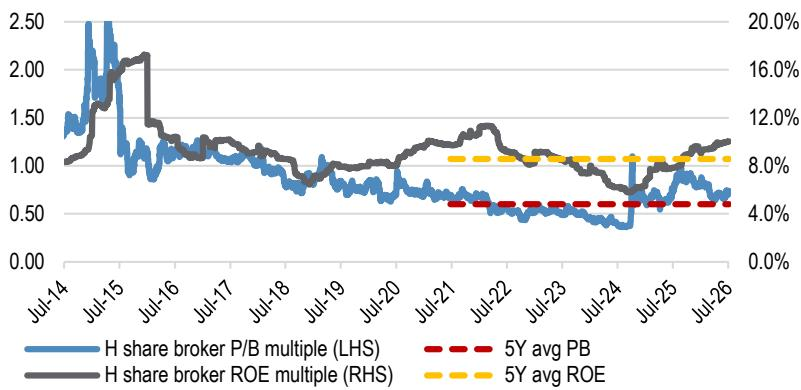
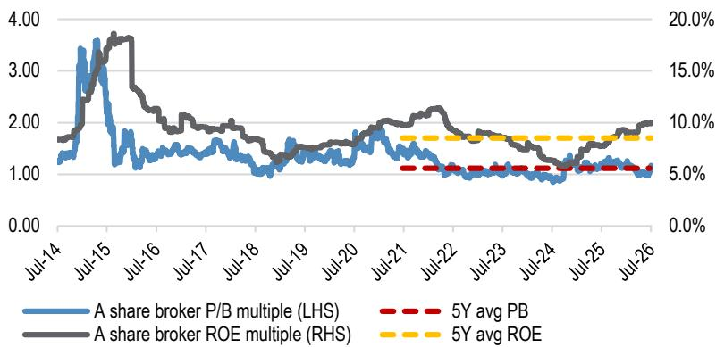

# JPM：机构盈利超预期，但市场为何不买账？

这份JPM研报的核心判断，既不是单纯看多招商标的，也不是对二季度业绩的超预期感到意外。它真正想回答的问题是：当业绩预告连续超预期，板块报价却在下跌，市场到底在担心什么？以及，这种担心是否过度了？

报告以招商标的H股为引子，但讨论的其实是整个中国机构板块的定价逻辑。二季度净利润同比大增160%-198%，创历史新高，但市场反应冷淡——A/H机构股在国泰海通业绩预告后反而平均下跌3%。这组反差，比业绩本身更值得琢磨。

## 1. 业绩超预期不是新闻，市场对“质量”的质疑才是

报告指出，招商标的上半年净利润已达全年市场一致预期的67%-74%。仅从数字看，这是明确的超预期信号。但市场没有庆祝，原因有两个。

第一，读者在获利了结。机构股自5月中旬以来已有明显涨幅，招商标的A/H股分别上涨28%和23%，显著跑赢板块。利好兑现后，部分资金选择离场。

第二，也是更关键的，市场对盈利质量存疑。有人担心二季度业绩过度依赖回报表现，而7月以来沪深300和科创50指数分别下跌4%和9%，如果市场热度消退，三季度的经营表现可能软化。换句话说，市场在问：这轮高增长，到底有多少来自可持续的经纪、国际机构、资本中介业务，多少来自不可重复的回报表现？

> **KC评论：** 这个问题其实适用于所有强周期板块——当业绩创历史新高时，市场反而开始问“然后呢”。这份报告的价值不在于确认业绩好，而在于它提供了一个框架：如何判断超预期业绩是拐点还是顶点。报告里对招商标的回报表现的拆分，以及CXMT上市带来的潜在重估，是值得仔细看的细节。

## 2. 报告认为回调是机会，但理由并非“业绩好”

JPM的观点很明确：近期报价疲软是加仓机会。但它的逻辑链条，不是简单的“业绩好所以买”。

第一，报告判断二季度业绩的强劲是“广泛复苏”——经纪、国际机构、资本中介、回报表现全面改善，并非单一依赖研究收入。如果这一判断成立，那么市场对盈利质量的担忧就部分过度了。

第二，招商标的和国泰海通的半年报利润都已达到全年一致预期的约70%，这意味着市场对全年盈利的预测很可能偏低。如果后续出现一致预期上调，板块可能迎来重新定价。

第三，估值并不贵。相关市场机构交易在1.15倍前瞻市净率，H股仅0.74倍。在盈利上修周期中，这样的估值水平提供了安全垫。

> **KC评论：** 这里需要注意，报告的逻辑建立在“业绩可持续”和“预期会上修”两个假设上。如果三季度市场表现持续疲软，这两个假设都会受到挑战。完整报告里对招商标的各业务线的盈利拆分，以及历史市净率区间的回溯，是验证这些假设的关键数据。

## 3. 报告尚未完全回答的关键问题：CXMT上市后，估值锚在哪里？

招商标的近期跑赢板块，核心催化剂并非业绩本身，而是市场重新评估其研究的长鑫存储（CXMT）的价值。CXMT已获准在科创板上市，市场已开始将这部分回报表现计入招商标的的估值。

但报告也坦率指出：CXMT上市后的报价表现，才是未来招商标的报价的关键驱动因素。换句话说，这部分重估已经部分price in，剩下的空间取决于CXMT上市后的实际表现。

这里有一个报告没有完全展开的问题：如果CXMT上市后报价低于预期，或者解禁后出现大规模观点偏谨慎，招商标的的回报表现将如何变化？这部分收益是一次性的，还是可能通过持续观点偏谨慎分批实现？报告提到了不确定性，但没有给出具体的敏感性分析。

## 4. 对读者的观察框架：关注三个信号

这份报告至少提供了三个值得持续跟踪的信号。

第一，一致预期是否上修。如果未来几周CICC、中信、广发等机构也发布业绩预告，且同样超预期，市场对板块盈利可持续性的质疑可能逐步消散。报告明确提示这些公司可能在数周内发布业绩预告。

第二，CXMT上市后的定价。这不仅是招商标的的公司事件，也是科创板对半导体公司估值体系的一次检验。如果CXMT上市后表现强劲，可能带动市场对整个机构板块的回报表现预期重新定价。

第三，市场成交量能否维持。报告没有重点讨论，但这是判断机构经纪业务能否持续的关键变量。如果日均成交额在二季度的高基数上回落，市场对三季度的担忧将被证实。

这份研报的价值，不在于给出一个观点偏积极或观点偏谨慎的结论，而在于它把“业绩超预期但报价下跌”这个看似矛盾的现象，拆解成了几个可验证的问题。对产业和研究决策者来说，真正的判断不是看多或看空，而是知道该盯着什么。

---

For informational purposes only. Portions may be generated,translated,summarized,or edited with AI assistance based on source materials and may contain omissions or errors. Please verify independently. This is not investment,legal,tax,accounting,or other professional advice.

For informational purposes only. Portions may be generated,translated,summarized,or edited with AI assistance based on source materials and may contain omissions or errors. Please verify independently. This is not investment,legal,tax,accounting,or other professional advice.

