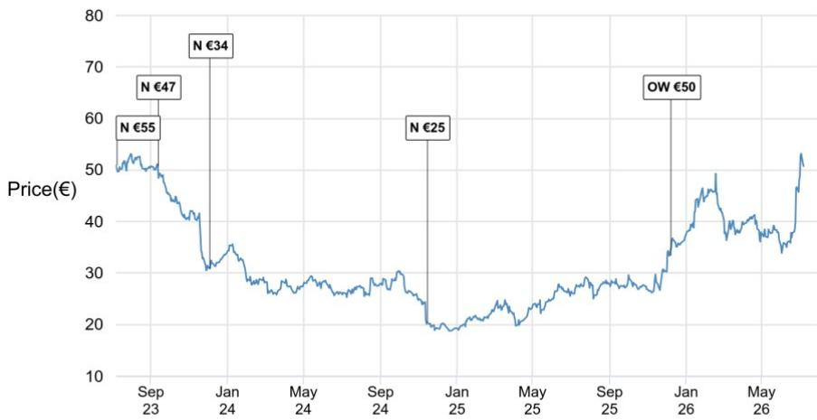

# 拜耳公司研究笔记

## 第二季度2026年业绩前瞻：预期业绩稳健，重申指引将支撑最新市场共识

拜耳将于2026年8月4日（星期二）英国夏令时6:30（欧洲中部夏令时7:30/美国东部时间1:30）公布第二季度2026年业绩，随后于英国夏令时13:00（欧洲中部夏令时14:00/美国东部时间8:00）举行读者电话会议；拨入详情待定。关于第二季度2026年销售额：我们预测集团销售额为106.87亿欧元，与彭博共识107.21亿欧元基本一致，我们对消费者业务销售额约1%的更高预期被我们对制药业务约1%的更低预期以及作物科学业务略低的预测所抵消。关于第二季度2026年EBITDA（调整后）：我们预测EBITDA（调整后）为19.39亿欧元，比彭博共识19.56亿欧元约低1%，我们对制药业务盈利能力改善的预期（EBITDA（调整后）为10.38亿欧元，对比10.23亿欧元）被调节项中更高的成本（EBITDA（调整后）为1.49亿欧元，对比1.10亿欧元）所抵消。关于核心每股收益：我们预测核心每股收益为0.73欧元，比彭博共识0.76欧元约低4%（尽管我们认为共识尚未完全反映新的核心每股收益报告方法，因此我们等待市场共识以更准确地反映对核心每股收益的共识预期）。关于2026财年指引，我们预计拜耳将以固定汇率重申集团销售额增长“0%至+3%”（450亿至470亿欧元）的指引，汇率影响为-1%（或-5亿欧元），导致报告销售额范围为445亿至465亿欧元。关于EBITDA（调整后），我们预计拜耳也将重申以固定汇率计算“-1%至+4%”的增长指引（96亿至101亿欧元），汇率影响为-2%（或-2亿欧元），导致报告范围为94亿至99亿欧元。这使我们预期以固定汇率计算的核心每股收益指引也将保持在约4.30至4.80欧元，汇率影响为0.20欧元，导致报告核心每股收益范围不变，为4.10至4.60欧元。鉴于最新的市场共识大致处于这些范围的中间位置，包括核心每股收益为4.32欧元，我们预计业绩公布后不会发生变化。总体而言，我们预计第二季度2026年业绩将大致符合彭博共识预期，但预计指引的重申将支撑2026财年市场共识预测，因此预计业绩对报价影响有限。

## 第二季度2026年指引预期：

我们预计集团2026财年销售额、EBITDA（调整后）和核心每股收益指引将得到重申，这应使业绩公布后的最新市场共识保持不变：我们预计拜耳将以固定汇率重申集团销售额增长“0%至+3%”（450亿至470亿欧元）的指引，汇率影响为-1%（或-5亿欧元），导致报告销售额范围为445亿至465亿欧元。关于EBITDA（调整后），我们预计拜耳也将重申以固定汇率计算“-1%至+4%”的增长指引（96亿至101亿欧元），汇率影响为-2%（或-2亿欧元），导致报告范围为94亿至99亿欧元。这使我们预期以固定汇率计算的核心每股收益指引也将保持在约4.30至4.80欧元，汇率影响为0.20欧元，导致报告核心每股收益范围不变，为4.10至4.60欧元。鉴于最新的市场共识大致处于这些范围的中间位置，包括核心每股收益为4.32欧元，我们预计业绩公布后不会发生变化。在部门层面，我们也预计指引将保持不变（见表1）。

## 研究观点

BAYGn.DE, BAYN GR
价格（2026年7月7日）：50.78欧元

欧洲制药与生物技术

Richard Vosser AC
(44-20) 7742-6652
richard.vosser@JPM.com
JPM Securities plc

Sophia Graeff Buhl Nielsen
(44-20) 7742-3918
sophia.graeffbuhlnielsen@JPM.com
JPM Securities plc

Zain Ebrahim
(44-20) 3493-1163
zain.ebrahim@JPM.com
JPM Securities plc

James D Wantling
(44-20) 3493-0019
james.wantling@JPM.com
JPM Securities plc

Khushi Bihani
(91-22) 6157-4103
khushi.bihani@JPM.com
JPM India Private Limited

Dhitee Goel
(44-20) 7742-2591
dhitee.goel@JPM.com
JPM Securities plc

专业销售联系方式：

Marjan Daeipour - 专业销售 - 欧洲医疗保健
(44 20) 7134-1329
marjan.daeipour@JPM.com

表1：2026财年拜耳集团及部门当前指引与市场共识

<table><tr><td></td><td>2025财年实际</td><td>2026年指引</td><td>隐含指引</td><td>隐含汇率影响</td><td>隐含2026年预期</td><td>市场共识2026年预期</td><td>差异百分比</td></tr><tr><td colspan="8">销售额</td></tr><tr><td>集团</td><td>45,575</td><td>0%至3%至450-470亿欧元（固定汇率）（汇率-1%[5亿欧元]）（含汇率约445-465亿欧元）</td><td>1.6%</td><td>-1.0%</td><td>45,823</td><td>45,513</td><td>0.7%</td></tr><tr><td>作物科学</td><td>21,622</td><td>约0%至3%（固定汇率）（汇率-1%）</td><td>1.5%</td><td>-1.0%</td><td>21,727</td><td>21,616</td><td>0.5%</td></tr><tr><td>制药</td><td>17,829</td><td>约0%至3%（固定汇率）（汇率-1%）</td><td>1.5%</td><td>-1.0%</td><td>17,915</td><td>17,724</td><td>1.1%</td></tr><tr><td>消费者</td><td>5,802</td><td>约0%至4%（固定汇率）（汇率-1%）</td><td>2.0%</td><td>-1.0%</td><td>5,859</td><td>5,853</td><td>0.1%</td></tr><tr><td>调节项</td><td>322</td><td></td><td></td><td></td><td>322</td><td>321</td><td>0.3%</td></tr><tr><td colspan="8">EBITDA（调整后）</td></tr><tr><td>集团</td><td>9,669</td><td>-1%至+4%至96-101亿欧元（固定汇率）；（汇率-2%[2亿欧元]）（含汇率94-99亿欧元）</td><td>1.5%</td><td>-2.0%</td><td>9,620</td><td>9,543</td><td>0.8%</td></tr><tr><td>作物科学</td><td>4,188</td><td>约20%至22%（固定汇率）（汇率-1个百分点）</td><td>20.5%</td><td></td><td>4,454</td><td>4,475</td><td>-0.5%</td></tr><tr><td>制药</td><td>4,525</td><td>约23%至25%（固定汇率）（汇率：不重大）</td><td>24.5%</td><td></td><td>4,389</td><td>4,286</td><td>2.4%</td></tr><tr><td>消费者</td><td>1,341</td><td>约22%至24%（固定汇率）（汇率：不重大）</td><td>23.5%</td><td></td><td>1,377</td><td>1,348</td><td>2.1%</td></tr><tr><td>调节项</td><td>-385</td><td>-6亿欧元</td><td></td><td></td><td>-600</td><td>-563</td><td>6.6%</td></tr><tr><td>核心每股收益（新）</td><td>4.57</td><td>约4.30-4.80欧元（含汇率约4.10-4.60欧元）</td><td></td><td></td><td>4.35</td><td>4.32</td><td>0.7%</td></tr></table>

来源：公司数据，JPM估计，市场共识（2026年5月27日）

## 第二季度2026年部门详情

- **制药**：我们预测制药销售额为43.81亿欧元（按固定汇率计算下降1%），比彭博共识44.10亿欧元约低1%。我们预测制药部门销售额按固定汇率计算下降1%，加上汇率影响-1%，在第二季度2026年达到43.81亿欧元，我们的预测比彭博共识44.10亿欧元约低1%。关于关键增长驱动因素，我们预测Nubeqa销售额为8.38亿欧元（按固定汇率计算增长54%），Kerendia销售额为2.97亿欧元（按固定汇率计算增长63%），我们预测Xarelto和Eylea持续下降，分别为3.56亿欧元（按固定汇率计算下降45%）和6.48亿欧元（按固定汇率计算下降24%）。对于制药EBITDA（调整后），我们预测为10.38亿欧元，比彭博共识10.23亿欧元约高2%，这得益于我们约50个基点的更高利润率假设。

表2：拜耳第二季度2026年制药产品销售额JPM预期（百万欧元）

<table><tr><td></td><td>JPM预期第二季度2026年</td><td>第二季度2025年实际</td><td>同比增长百分比</td><td>固定汇率百分比</td></tr><tr><td colspan="5">关键制药销售额</td></tr><tr><td>Xarelto</td><td>356</td><td>650</td><td>-45.2%</td><td>-44.5%</td></tr><tr><td>Eylea</td><td>648</td><td>862</td><td>-24.8%</td><td>-24.1%</td></tr><tr><td>Nubeqa</td><td>838</td><td>546</td><td>53.5%</td><td>54.2%</td></tr><tr><td>Kerendia</td><td>297</td><td>183</td><td>62.5%</td><td>63.2%</td></tr><tr><td>Mirena</td><td>327</td><td>318</td><td>2.8%</td><td>3.5%</td></tr><tr><td>Adempas</td><td>192</td><td>185</td><td>3.8%</td><td>4.6%</td></tr><tr><td>Stivarga</td><td>76</td><td>83</td><td>-8.5%</td><td>-7.8%</td></tr><tr><td>Yasmin/Yaz</td><td>164</td><td>173</td><td>-5.1%</td><td>-4.4%</td></tr><tr><td>Kogenate/Jivi</td><td>134</td><td>150</td><td>-10.7%</td><td>-10.0%</td></tr><tr><td>Adalat</td><td>127</td><td>122</td><td>4.3%</td><td>5.0%</td></tr><tr><td>Betaferon/Betaseron</td><td>39</td><td>44</td><td>-11.0%</td><td>-10.3%</td></tr></table>

来源：公司数据，JPM估计。

- **作物科学**：我们预测作物科学销售额为47.77亿欧元（按固定汇率计算增长1%），与彭博共识47.94亿欧元一致：我们预测作物科学销售额按固定汇率计算增长1%，加上汇率影响-1%，在第二季度2026年达到47.77亿欧元，与共识47.94亿欧元一致。我们预测玉米（按固定汇率计算下降6%）和大豆（按固定汇率计算下降1%）同比下降，原因是销售时间安排被除草剂（按固定汇率计算增长9%）和棉花（按固定汇率计算增长67%）的强劲增长所抵消，后者得益于销量恢复和延迟采购落入第二季度。我们预测草甘膦按固定汇率计算增长20%，得益于销量恢复和定价收益（10%价格；10%销量）。对于作物科学EBITDA（调整后），我们预测为7.14亿欧元（15.0% EBITDA利润率），我们的预测与彭博共识7.15亿欧元一致。

表3：拜耳第二季度2026年作物科学产品销售额JPM预期（百万欧元）

<table><tr><td></td><td>JPM预期第二季度2026年</td><td>第二季度2025年实际</td><td>同比增长百分比</td><td>固定汇率百分比</td></tr><tr><td colspan="5">关键作物科学销售额</td></tr><tr><td>杀虫剂总计</td><td>271</td><td>298</td><td>-9.2%</td><td>-7.9%</td></tr><tr><td>杀菌剂总计</td><td>607</td><td>634</td><td>-4.2%</td><td>-3.0%</td></tr><tr><td>除草剂总计</td><td>1,466</td><td>1,326</td><td>10.6%</td><td>11.9%</td></tr><tr><td>作物保护总计</td><td>2,344</td><td>2,258</td><td>3.8%</td><td>5.1%</td></tr><tr><td>玉米</td><td>1,328</td><td>1,461</td><td>-9.1%</td><td>-5.8%</td></tr><tr><td>大豆</td><td>377</td><td>393</td><td>-4.0%</td><td>-1.3%</td></tr><tr><td>蔬菜种子</td><td>191</td><td>199</td><td>-4.2%</td><td>-3.0%</td></tr><tr><td>棉花</td><td>151</td><td>91</td><td>66.1%</td><td>67.4%</td></tr><tr><td>其他</td><td>386</td><td>386</td><td>0.0%</td><td>1.3%</td></tr><tr><td>作物科学总计</td><td>4,777</td><td>4,788</td><td>-0.2%</td><td>1.1%</td></tr></table>

来源：公司数据，JPM估计。

- **消费者**：我们预测消费者销售额为14.55亿欧元，按固定汇率计算约增长2%，比彭博共识14.36亿欧元约高1%：我们预测消费者销售额在第二季度2026年按固定汇率计算约增长2%，加上中性汇率影响，达到14.55亿欧元，比共识14.36亿欧元约高1%。对于消费者EBITDA（调整后），我们预测为3.35亿欧元，隐含23.0%的EBITDA利润率。我们的预测比共识3.28亿欧元约高2%，这得益于我们预期利润率比共识高约20个基点。

表4：拜耳第二季度2026年部门JPM预期与市场共识对比（百万欧元）

<table><tr><td></td><td>JPM预期第二季度2026年</td><td>共识第二季度2026年</td><td>差异百分比</td><td>相对差异（百万欧元）</td><td>第二季度2025年实际</td><td>同比增长百分比</td><td>固定汇率百分比</td></tr><tr><td colspan="8">集团</td></tr><tr><td>销售额</td><td>10,687</td><td>10,721</td><td>-0.3%</td><td>(33)</td><td>10,739</td><td>-0.5%</td><td>0.4%</td></tr><tr><td>EBIT（调整后）</td><td>848</td><td>-</td><td>-</td><td>-</td><td>994</td><td>-14.7%</td><td></td></tr><tr><td>EBIT利润率%</td><td>7.9%</td><td>-</td><td>-</td><td></td><td>9.3%</td><td>-132个基点</td><td></td></tr><tr><td>EBITDA（调整后）</td><td>1,939</td><td>1,956</td><td>-0.9%</td><td>(18)</td><td>2,105</td><td>-7.9%</td><td></td></tr><tr><td>EBITDA利润率%</td><td>18.1%</td><td>18.2%</td><td>-11个基点</td><td></td><td>19.6%</td><td>-146个基点</td><td></td></tr><tr><td>核心每股收益（持续经营）</td><td>0.73</td><td>0.76</td><td>-4.4%</td><td>(0.03)</td><td>1.23</td><td>-40.5%</td><td></td></tr><tr><td colspan="8">制药</td></tr><tr><td>销售额</td><td>4,381</td><td>4,410</td><td>-0.6%</td><td>(28)</td><td>4,470</td><td>-2.0%</td><td>-1.3%</td></tr><tr><td>EBIT（调整后）</td><td>755</td><td>-</td><td>-</td><td>-</td><td>830</td><td>-9.1%</td><td></td></tr><tr><td>EBIT利润率%</td><td>17.2%</td><td>-</td><td>-</td><td></td><td>18.6%</td><td>-134个基点</td><td></td></tr><tr><td>EBITDA（调整后）</td><td>1,038</td><td>1,023</td><td>1.5%</td><td>15</td><td>1,094</td><td>-5.1%</td><td></td></tr><tr><td>EBITDA利润率%</td><td>23.7%</td><td>23.2%</td><td>49个基点</td><td></td><td>24.5%</td><td>-78个基点</td><td></td></tr><tr><td colspan="8">消费者健康</td></tr><tr><td>销售额</td><td>1,455</td><td>1,436</td><td>1.4%</td><td>19</td><td>1,427</td><td>2.0%</td><td>1.7%</td></tr><tr><td>EBIT（调整后）</td><td>240</td><td>-</td><td>-</td><td>-</td><td>237</td><td>1.4%</td><td></td></tr><tr><td>EBIT利润率%</td><td>16.5%</td><td>-</td><td>-</td><td></td><td>16.6%</td><td>-10个基点</td><td></td></tr><tr><td>EBITDA（调整后）</td><td>335</td><td>328</td><td>2.2%</td><td>7</td><td>331</td><td>1.3%</td><td></td></tr><tr><td>EBITDA利润率%</td><td>23.0%</td><td>22.9%</td><td>19个基点</td><td></td><td>23.2%</td><td>-16个基点</td><td></td></tr><tr><td colspan="8">作物科学</td></tr><tr><td>销售额</td><td>4,777</td><td>4,794</td><td>-0.4%</td><td>(17)</td><td>4,788</td><td>-0.2%</td><td>1.1%</td></tr><tr><td>EBIT（调整后）</td><td>73</td><td>-</td><td>-</td><td>-</td><td>4</td><td>1732.8%</td><td></td></tr><tr><td>EBIT利润率%</td><td>1.5%</td><td>-</td><td>-</td><td></td><td>0.1%</td><td>145个基点</td><td></td></tr><tr><td>EBITDA（调整后）</td><td>714</td><td>715</td><td>0.0%</td><td>(0)</td><td>693</td><td>3.1%</td><td></td></tr><tr><td>EBITDA利润率%</td><td>15.0%</td><td>14.9%</td><td>5个基点</td><td></td><td>14.5%</td><td>48个基点</td><td></td></tr><tr><td colspan="8">调节项</td></tr><tr><td>销售额</td><td>74</td><td>81</td><td>-8.8%</td><td>(7)</td><td>54</td><td>37.0%</td><td></td></tr><tr><td>EBIT（调整后）</td><td>(220)</td><td>-</td><td>-</td><td>-</td><td>(77)</td><td>185.5%</td><td></td></tr><tr><td>EBIT利润率%</td><td>-297.0%</td><td>-</td><td>-</td><td></td><td>-142.6%</td><td>不适用</td><td></td></tr><tr><td>EBITDA（调整后）</td><td>(149)</td><td>(110)</td><td>36.0%</td><td>(39)</td><td>(12)</td><td>-</td><td></td></tr><tr><td>EBITDA利润率%</td><td>-201.4%</td><td>-135.1%</td><td></td><td></td><td>-22.2%</td><td>不适用</td><td></td></tr></table>

来源：公司数据，JPM估计，彭博共识（2026年7月7日）

分析师认证：本报告封面标注“AC”的研究分析师（或，若多位研究分析师主要负责本报告，则封面或文档内标注“AC”的研究分析师分别就其在本研究中涵盖的每个证券或发行人认证）：(1) 本报告中表达的所有观点准确反映了研究分析师对任何及所有相关证券或发行人的个人观点；(2) 研究分析师的薪酬中没有任何部分直接或间接与本报告中研究分析师表达的具体建议或观点相关。对于封面列出的所有韩国研究分析师（如适用），他们还根据KOFIA要求认证，研究分析师的分析是善意进行的，且观点反映了研究分析师自身的意见，没有受到不当影响或干预。

除非另有说明，本报告中列出的所有作者均为独立撰写研究报告的研究分析师。在欧洲，本报告中可能显示行业专家（销售和交易）作为联系人，但他们并非报告的作者，也不属于研究部门。

## 重要披露

• 做市商/流动性提供者：JPM是拜耳或相关实体金融工具的做市商和/或流动性提供者。

- 经理或联合经理：JPM在过去12个月内担任过拜耳或相关实体证券或金融工具（定义见指令2014/65/EU）公开发行的经理或联合经理。

- 实益所有权（1%或以上）：JPM实益拥有拜耳或相关实体一类普通股证券的1%或以上。

- 客户：JPM目前拥有，或过去12个月内曾拥有以下实体作为客户：拜耳或相关实体。

- 客户/投资银行：JPM目前拥有，或过去12个月内曾拥有以下实体作为投资银行客户：拜耳或相关实体。

- 客户/非投资银行、证券相关：JPM目前拥有，或过去12个月内曾拥有以下实体作为客户，且提供的服务为非投资银行、证券相关：拜耳或相关实体。

- 客户/非证券相关：JPM目前拥有，或过去12个月内曾拥有以下实体作为客户，且提供的服务为非证券相关：拜耳或相关实体。

- 已收投资银行报酬：JPM在过去12个月内已从拜耳或相关实体收到投资银行服务报酬。

- 潜在投资银行报酬：JPM预计在未来三个月内将从拜耳或相关实体收到或寻求投资银行服务报酬。

• 已收非投资银行报酬：JPM在过去12个月内已从拜耳或相关实体收到投资银行以外的产品或服务报酬。

- 债务头寸：JPM可能持有拜耳或相关实体的债务证券头寸（如有）。

公司特定披露：JPM寻求与其研究报告所涵盖的公司开展业务。因此，读者应注意，公司可能存在可能影响本报告客观性的利益冲突。读者应将本报告视为做出研究决策的单一因素。重要披露，包括价格图表和信用意见历史表（如适用），可通过访问https://www.jpmm.com/research/disclosures、致电1-800-477-0406或发送电子邮件至research.disclosure.inquiries@JPM.com获取，适用于汇编报告及所有JPM覆盖的公司和某些未覆盖的公司。

拜耳（BAYGn.DE, BAYN GR）价格图表

<table><tr><td>日期</td><td>评级</td><td>价格（欧元）</td><td>目标价格（欧元）</td></tr><tr><td>2023年7月10日</td><td>中性</td><td>50.90</td><td>55</td></tr><tr><td>2023年9月13日</td><td>中性</td><td>50.73</td><td>47</td></tr><tr><td>2023年12月5日</td><td>中性</td><td>30.88</td><td>34</td></tr><tr><td>2024年11月15日</td><td>中性</td><td>20.47</td><td>25</td></tr><tr><td>2025年12月8日</td><td>增持</td><td>33.36</td><td>50</td></tr></table>

来源：彭博金融有限责任公司和JPM；价格数据已根据股票分割和股息进行调整。首次覆盖日期为2007年6月6日。所有股价均为前一个交易日收盘价。
图表显示了JPM对该股票的持续覆盖；当前分析师可能并非在整个期间内都覆盖该股票。JPM评级或名称：OW = 增持，N = 中性，UW = 减持，NR = 未评级

## 股票研究评级、名称及分析师覆盖范围说明：

JPM使用以下评级系统：增持（在本报告所示目标价格期间内，我们预期该股票将跑赢研究分析师或研究分析师团队覆盖范围内股票的平均总回报）；中性（在本报告所示目标价格期间内，我们预期该股票将与研究分析师或研究分析师团队覆盖范围内股票的平均总回报表现一致）；减持（在本报告所示目标价格期间内，我们预期该股票将跑输研究分析师或研究分析师团队覆盖范围内股票的平均总回报）。NR为未评级。在这种情况下，JPM已移除该股票的评级和（如适用）目标价格，原因是缺乏充分的基本面依据，或出于法律、监管或政策原因。先前的评级和（如适用）目标价格不应再被依赖。NR名称并非建议或评级。部分覆盖的股票有评级但无目标价格；在这些情况下，我们预期该股票将跑赢/表现一致/跑输研究分析师或研究分析师团队覆盖范围内股票在相关区域内的平均总回报。在我们的亚洲（除澳大利亚和印度外）和英国中小盘股票研究中，每只股票的预期总回报与基准国家市场指数的预期总回报进行比较，而非与研究分析师的覆盖范围进行比较。如果本报告的重要披露部分未显示，认证研究分析师的覆盖范围可在JPM研究网站https://www.JPMmarkets.com上找到。

覆盖范围：Vosser, Richard：Argenx (ARGX.BR)、Argenx (ARGX US) (ARGX)、阿斯利康 (AZN.L)、拜耳 (BAYGn.DE)、Galderma (GALD.S)、Ipsen (IPN.PA)、默克集团 (MRCG.DE)、Molecular Partners (MOLN)、Molecular Partners AG (MOLN.S)、诺华 (NOVN.S)、诺和诺德 (NOVOb.CO)、罗氏 (ROP.S)、赛诺菲 (SASY.PA)、赛多利斯集团 (SATG.DE)、赛多利斯集团（优先股）(SATG_p.DE)、赛多利斯斯泰迪生物技术 (STDM.PA)、优时比 (UCB.BR)

JPM股票研究评级分布，截至2026年7月4日

<table><tr><td></td><td>增持（买入）</td><td>中性（持有）</td><td>减持（卖出）</td></tr><tr><td>JPM全球股票研究覆盖*</td><td>53%</td><td>36%</td><td>12%</td></tr><tr><td>投行客户**</td><td>83%</td><td>80%</td><td>73%</td></tr><tr><td>JPMS股票研究覆盖*</td><td>51%</td><td>37%</td><td>12%</td></tr><tr><td>投行客户**</td><td>95%</td><td>92%</td><td>87%</td></tr></table>

\*请注意，由于四舍五入，百分比可能未加总至100%。

\*\*在过去12个月内JPM提供投资银行服务的“买入”、“持有”和“卖出”类别中各主题公司的百分比。

仅就FINRA评级分布规则而言，我们的增持评级属于报告评级类别；我们的中性评级属于持有评级类别；我们的减持评级属于报告评级类别。请注意，标有NR的股票未包含在上述表格中。此信息截至最近一个日历季度末。

股票估值与风险：有关覆盖公司或目标价格的估值方法和风险，请参阅最新的公司特定研究报告，访问http://www.JPMmarkets.com，联系主要分析师或您的JPM代表，或发送电子邮件至research.disclosure.inquiries@JPM.com。有关专有模型的实质性信息，请参阅公司特定研究报告中的财务摘要和公司概况表，这些可在我们客户网站http://www.JPMmarkets.com的公司页面上下载。本报告还阐述了所使用的重要基础假设。

## 研究建议历史：

过去12个月内JPM研究建议的历史可通过http://www.JPMmarkets.com的研究与评论页面访问，您也可以按分析师姓名、行业或金融工具进行搜索。

分析师薪酬：负责编写本报告的研究分析师的薪酬基于多种因素，包括研究的质量和准确性、客户反馈、竞争因素以及公司整体收入。

非美国分析师注册：除非另有说明，本报告封面列出的非美国分析师是非JPM Securities LLC美国关联公司的员工，可能未根据FINRA规则注册为研究分析师，可能不是JPM Securities LLC的关联人士，并且可能不受FINRA规则2241或2242关于与覆盖公司沟通、公开露面以及研究分析师账户持有证券交易的限制。

## 其他披露

JPM是JPM Chase & Co.及其全球子公司和关联公司投资银行业务的营销名称。

英国MiFID FICC研究分拆豁免：英国客户应参考英国MiFID研究分拆豁免，了解JPM实施FICC研究豁免的详细信息以及相关FICC研究分类的指导。

除非相关法律特别允许，所有提供给客户的研究材料均同时在我们的客户网站JPM Markets上提供。并非所有研究内容都会重新分发、通过电子邮件发送或提供给第三方聚合商。如需获取特定股票的所有研究材料，请联系您的销售代表。

本研究材料中提及中国、香港、台湾和澳门的任何长格式名称分别为中国大陆、中国香港特别行政区、中国台湾和中国澳门特别行政区。

JPM可能不时撰写关于受美国、欧盟、英国或其他相关司法管辖区政府当局实施或管理的经济或金融制裁所针对的发行人或证券（受制裁证券）的文章。本报告中的任何内容均无意被解读为鼓励、促进、推动或以其他方式批准对受制裁证券的研究或交易。客户在做出研究决策时应了解自身的法律和合规义务。

本研究报告中讨论的任何数字或加密资产均受快速变化的监管环境影响。有关加密资产（包括比特币和以太坊）的相关监管建议，请参阅https://www.JPM.com/disclosures/cryptoasset-disclosure。

本研究报告的作者可能未获许可在您的司法管辖区开展受监管活动，如果未获许可，则不会声称能够这样做。

交易所交易基金（ETF）：JPM Securities LLC（“JPMS”）作为几乎所有美国上市ETF的授权参与者。如果本报告中提及任何ETF，JPMS可能因分销这些ETF份额而赚取佣金和基于交易的报酬，并可能因执行其他交易相关服务（例如向ETF份额卖空者提供证券借贷）而赚取费用。JPMS还可能为ETF本身提供服务，包括担任ETF的经纪商或交易商。此外，JPMS的关联公司可能为ETF提供服务，包括信托、托管、管理、借贷、指数计算和/或维护及其他服务。

期权和期货相关研究：如果本文所含信息涉及期权或期货相关研究，则该信息仅提供给已收到适当期权或期货风险披露文件的人士。请联系您的JPM代表或访问https://www.theocc.com/components/docs/riskstoc.pdf获取期权清算公司的标准化期权的特征和风险副本，或访问https://www.finra.org/sites/default/files/2020-08/Security_Futures_Risk_Disclosure_Statement_2020.pdf获取证券期货风险披露声明副本。

银行间报价利率（IBOR）及其他基准利率的变更：某些利率基准正在或可能在未来受到持续的国际、国家及其他监管指导、改革和改革建议的影响。更多信息，请查阅：https://www.JPM.com/global/disclosures/interbank_offered_rates

私人银行客户：如果您作为JPM Chase & Co.及其子公司（“JPM私人银行”）提供的私人银行业务的客户接收研究，则研究由JPM私人银行提供给您，而非JPM的任何其他部门，包括但不限于JPM企业与投资银行及其全球研究部门。

负责制作和分发研究的法律实体：编写本材料的Reg AC
