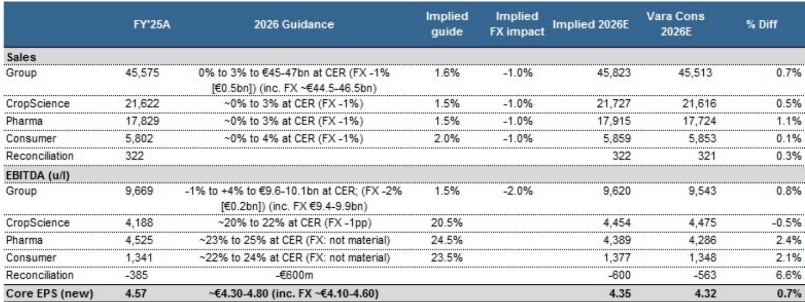
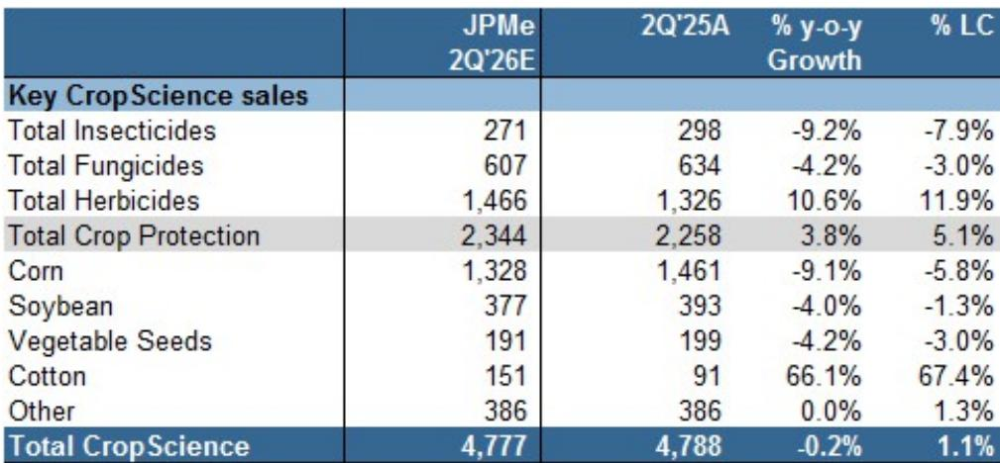
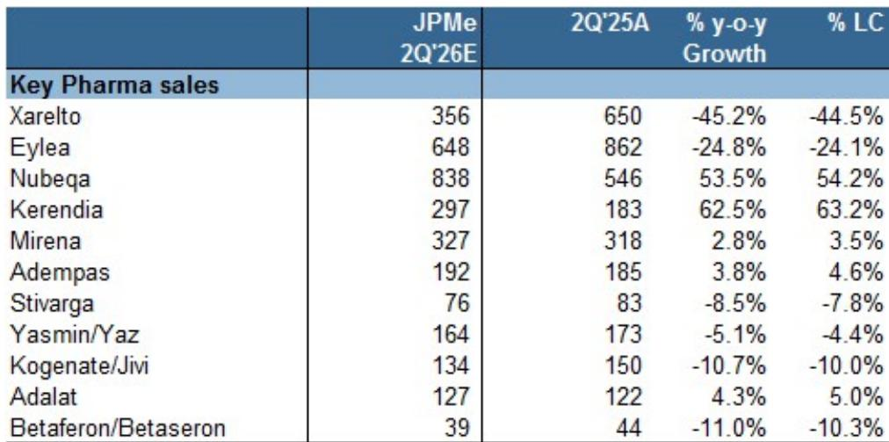

# 研究笔记：拜耳二季度业绩前瞻——全年指引仍是市场关注核心

市场对拜耳2026年二季度业绩的预期已经较为充分。研究机构在最新发布的业绩预览报告中指出，无论是集团营收、核心利润还是每股收益，二季度数据大概率与市场共识基本吻合。真正值得关注的不是单季波动，而是管理层是否会利用这次窗口，再次确认全年指引——而这恰恰是当前市场定价最需要的支撑。

这份报告的核心判断是：二季度本身缺乏催化力，但指引的稳定性能为市场提供确定性。当前一致预期已基本落在公司全年指引的中枢附近，这意味着只要拜耳不主动下调目标，市场就不会出现预期差带来的谨慎修正。

## 1. 二季度业绩不会偏离共识，但细节里藏着结构变化

研究机构预计拜耳二季度集团营收为106.87亿欧元，与彭博共识的107.21亿欧元几乎持平。核心EBITDA预计为19.39亿欧元，略低于共识的19.56亿欧元，偏差不到1%。

分业务看，制药板块营收预计为43.81亿欧元，略低于共识。但关键增长产品的势头依然强劲：Nubeqa预计同比增长54%，Kerendia预计增长63%。这两款产品正在接力Xarelto和Eylea的专利悬崖缺口——后者分别同比下滑45%和24%。作物科学板块营收预计为47.77亿欧元，与共识一致，草甘膦受益于量价齐升，同比增长20%。

> **观察评论：** 二季度的数字本身不会改变市场对拜耳的叙事。但透过产品结构的变化，可以更清晰地看到拜耳正在经历从“旧药现金牛”向“新药增长引擎”的切换。Nubeqa和Kerendia的增速是否可持续，比单季总量是否达标更重要。

## 2. 全年指引才是当前市场定价的“定海神针”

研究机构对全年指引的判断非常明确：预计拜耳将重申2026年集团营收增长0%至3%（按固定汇率计算），核心EBITDA增长-1%至4%，核心每股收益在4.30至4.80欧元之间。考虑汇率影响后，营收区间约为445亿至465亿欧元，核心EBITDA约为94亿至99亿欧元。

当前一致预期核心每股收益为4.32欧元，恰好落在指引区间的下沿附近。这意味着市场并未对管理层提出过高要求，只要公司不主动下调，就不会触发谨慎修正。

> **观察评论：** 对于拜耳这样的转型期公司，市场最怕的不是业绩低于预期，而是管理层失去对全年目标的掌控力。这份报告提示的核心逻辑是：二季度业绩本身不是变量，指引的稳定性才是。如果拜耳能像预期那样“重申”而不是“调整”，短期市场定价的节奏变化不确定性将被有效封住。

## 3. 报告尚未完全回答的关键问题：增长引擎能否持续加速

报告对短期业绩的预测相当清晰，但有一个问题没有充分展开：Nubeqa和Kerendia的增长势头能否在未来几个季度持续加速。这两款产品目前是拜耳制药板块最重要的增长来源，但它们都面临着各自的竞争格局和适应症拓展进度。

此外，作物科学板块的草甘膦量价齐升是否可持续，也取决于全球农产品价格和种植面积的变化。报告提到了草甘膦10%的定价上涨和10%的销量恢复，但并未讨论这种组合是否能在下半年延续。

## 4. 对于关注拜耳的读者，以下几个观察维度值得持续跟踪

首先，二季度业绩发布后的管理层评论，尤其是对下半年各业务条线的展望，将比数字本身更有信息量。其次，Nubeqa和Kerendia的销售轨迹是否能够维持当前增速，是判断拜耳转型进度的重要参考。第三，作物科学板块的毛利率走势，将直接影响集团整体盈利能力能否达到指引区间的上沿。

报告的结论很克制：二季度结果对市场定价影响有限，但指引的确认将支撑全年一致预期。在拜耳完成业务组合重塑之前，这种“业绩稳定、预期清晰”的状态，可能是市场愿意给予耐心的重要前提。

For informational purposes only. Portions may be generated,translated,summarized,or edited with AI assistance based on source materials and may contain omissions or errors. Please verify independently. This is not investment,legal,tax,accounting,or other professional advice.

For informational purposes only. Portions may be generated,translated,summarized,or edited with AI assistance based on source materials and may contain omissions or errors. Please verify independently. This is not investment,legal,tax,accounting,or other professional advice.

