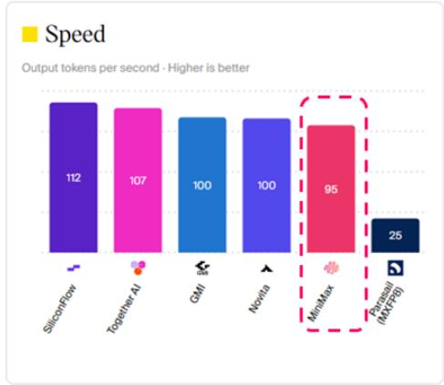
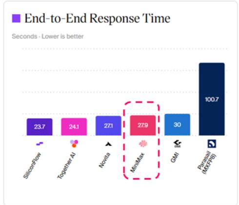
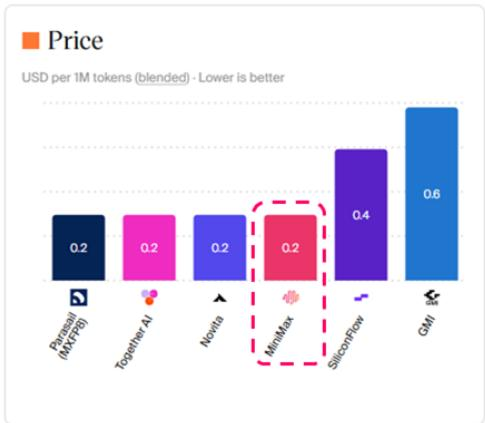

## China Artificial Intelligence

Open-weight commercialization playbook: winner takes more; Raise Zhipu to HK\$2,000 (OW), cut MiniMax to HK\$300 (Neutral)

Observers typically read open-weight releases as monetization leakage, since public weights allow third parties to deploy models outside the first-party API route. We agree, but we believe the more crucial question is whether LLM providers can turn reduced access control into wider distribution and paid conversion. In our view, the answer depends heavily on model capability – for competitive models, open weights can scale adoption on external GPU capacity across CSP, inference platforms and private deployments, rather than only on the provider's own compute stack. The LLM provider can still participate and monetize through official-backed routes, licensing, marketplace SaaS, revenue share, deployment support or enterprise co-selling, especially when customers care about model freshness, endpoint quality and reliability. For weaker models, reduced access control can lead to faster price comparison and traffic rerouting. This is positive for Zhipu, given GLM-5.2's globally competitive positioning, while more challenging for MiniMax, as M3 has not yet shown enough differentiation and pricing power. Open-weight commercialization is therefore becoming a 'winner-takes-more' framework.

\- Partner channels such as CSPs and inference platforms still have incentives to work with open-weight LLM providers because commercial customers are buying a production-grade model service, rather than just access to weights. A public release is closer to a starting checkpoint, while the official route can keep improving through post-launch model updates and serving optimization. If third-party deployments lag the official route, the same model name can deliver sizably different user experiences across endpoints. For stronger models, customer demand gives partner channels more reasons to support official-backed access, even when self-deployment offers better gross margins. This allows the model provider to keep a role in the economics of external compute capacity.

\- Recent launches fit this framework. Zhipu's GLM-5.2 release looks like a more confident open-weight strategy: widen adoption through permissive access, while keeping official route and higher-service variants (e.g. GLM-Turbo series) positioned for quality-sensitive demand. MiniMax adopts a similar strategy by keeping model open-sourced with additional commercialization restrictions, however, the key issue is model competitiveness, in our view. If users view the model as replaceable, open access makes it easier to compare, route and substitute; if the model is strong, open access expands reach and creates more routes back into paid usage. From enterprise users' perspective, open weights can also reduce adoption and accessibility risk, as users have a fallback route if hosted API pricing, access policy or availability changes.

\- We believe this framework provides sizeable optionality for Zhipu, while the revenue path still depends on sustained model leadership. At the current valuation, we think the market has largely moved beyond the company's US\$1bn year-end ARR guidance, while the broader open-weight monetization path remains less reflected. The key tests are whether GLM-5.2 represents a company-specific capability step-up, how Kimi K3 and DeepSeek V4.1 compare, and whether GLM-5.5/6 can extend the gap. We raise our Dec-26 PT for Zhipu AI to HK\$2,000 and reiterate OW. For MiniMax, the recent launch provides weaker evidence of model-led pricing power and paid conversion under this framework – we lower our Dec-26 PT to HK\$300 and maintain Neutral.

See page 21 for analyst certification and important disclosures, including non-US analyst disclosures.

Hong Kong

Olivia Xu AC
(86-21) 6106 6138
olivia.w.xu@JPM.com
SAC Registration Number: S1730525060001

Alex Yao
(86 21) 6106 6505
alex.yao@JPM.com
SAC Registration Number: S1730523020001

Daniel Chen
(86-21) 6106 6205
daniel.q.chen@JPM.com
SAC Registration Number: S1730521040001
JPM Securities (China) Company Limited

Equity Ratings and Price Targets

<table><tr><td rowspan="2">Company</td><td rowspan="2">Ticker</td><td rowspan="2">Mkt Cap ($ mn)</td><td rowspan="2">Price CCY</td><td rowspan="2">Price</td><td colspan="2">Rating</td><td colspan="4">Price Target</td></tr><tr><td>Cur</td><td>Prev</td><td>Cur</td><td>End Date</td><td>Prev</td><td>End Date</td></tr><tr><td>Zhipu AI</td><td>2513 HK</td><td>45,431</td><td>HKD</td><td>1,610.00</td><td>OW</td><td>n/c</td><td>2,000.00</td><td>Dec-26</td><td>1,800.00</td><td>n/c</td></tr><tr><td>MiniMax Group Inc - H</td><td>100 HK</td><td>9,419</td><td>HKD</td><td>323.80</td><td>N</td><td>n/c</td><td>300.00</td><td>Dec-26</td><td>400.00</td><td>n/c</td></tr></table>

Source: Company data, Bloomberg Finance L.P., JPM estimates. n/c = no change. All prices as of 07 Jul 26.

## Open-weight strategy: distribution upside, model-access pressure and a more flexible monetization playbook

Open-weight strategy has been an important part of the China large language model (LLM) market, and we believe the debate for observers is more focused on how these LLM providers use open distribution to build monetizable channels. We believe the commercial logic is to use open access to reach developers, cloud platforms, application programming interface (API) aggregators and overseas users faster, then monetize through official API, cloud partnerships, enterprise deployments and workflow products.

The cost of such open-source strategy is also visible: once a model is open-weight, cloud service providers (CSP), API aggregators and technically capable enterprises can deploy it on their own infrastructure. This creates competition for part of the traffic that may otherwise have gone to the LLM provider's first-party API. The pressure is most visible in simple workloads such as chat, summarization, translation, basic Q&A and other low service-level agreement (SLA) text tasks, where users mainly compare price and basic functionality. These tasks have lower requirements on model freshness, long-context stability, tool calling, prompt caching and enterprise support.

That said, open weights do not make all API endpoints equal. Running an open model is different from operating a high-quality production inference service. Third-party deployments can be cheaper or more widely available, while first-party APIs usually have better access to the latest model version, model-specific serving parameters, prompt caching, long-context execution, rate-limit management, toolchain support and enterprise SLA. For more demanding workloads, proprietary API pricing is tied to stable access to a higher-quality endpoint.

The quality gap can widen after the initial model launch. An open-weight release is usually a released checkpoint, while the official API remains a live product. After launch, the model provider continues to observe real-world traffic and optimize the model, the system layer and the serving stack. These follow-on improvements can include post-training updates, instruction-following refinements, coding and tool-use tuning, refusal-policy changes, routing logic, cache policy, context-window handling, decoding parameters and inference-kernel optimization. Most of these changes are not re-open-sourced in real time. As a result, third-party deployment of the same open-weight model may gradually fall behind the official API in both perceived intelligence and production reliability, even if the original base weights are identical.

This is especially relevant for coding, agentic and long-context workloads. In these tasks, users usually care about task completion, repo-level understanding, debugging quality, multi-step planning, tool reliability and latency consistency. Small differences in the serving stack can create visible differences in user experience. The same model name, therefore, does not guarantee the same product quality.

We therefore think open-weight strategy should be analyzed as a shift in revenue mix. LLM providers may lose part of the revenue tied to model access alone, while gaining a wider funnel for paid inference, cloud distribution and workflow monetization. The balance should vary by model quality: stronger models are more likely to attract developers, receive cloud platform priority and convert open-weight adoption into paid usage.

Table 1: Open-weight strategy reshapes the monetization mix

<table><tr><td>Area</td><td>Positive impact</td><td>Commercial pressure</td><td>What remains monetizable</td></tr><tr><td>Model access</td><td>Lower barrier for developers, CSPs, aggregators and overseas users</td><td>Third parties can deploy and resell the model</td><td>Latest versions, premium versions, commercial licenses</td></tr><tr><td>API usage</td><td>Wider user funnel and more trial demand</td><td>Simple workloads face more price comparison from non-proprietary APIs</td><td>API quality: latency, throughput, caching, uptime, SLA, model freshness</td></tr><tr><td>Cloud distribution</td><td>Faster global reach through existing cloud platforms</td><td>CSPs may self-deploy and earn 100% of API profit</td><td>Revenue share, official endpoints, enterprise co-selling</td></tr><tr><td>Workflows</td><td>Easier entry into coding, agent and enterprise ecosystems</td><td>Generic token pricing remains competitive</td><td>Task completion, reliability, integration, support</td></tr><tr><td>Enterprise deployment</td><td>More awareness and technical validation</td><td>Some enterprises can self-host</td><td>Private deployment, security, support, customization</td></tr></table>

Source: JPM estimates. (As of Jul 6, 2026)

## Open-weight is a dynamic commercial choice for LLM providers

Open-source should be analyzed by model version, license and channel. LLM providers can decide by model generation, capability tier, customer type and commercialization stage which models to open, how permissive the license should be, and which premium versions to keep in paid channels.

The 2025-26 release cycle shows three broad patterns among the major independent China LLM providers: DeepSeek sits closest to the permissive open-weight end of the spectrum; Zhipu uses permissive open-weight base flagships to drive adoption, while keeping selected Turbo / multimodal Turbo variants in managed API channels; Kimi and MiniMax show how modified or community licenses can preserve different degrees of commercial control.

For users, the open-weight route creates a fallback option. Once the weights are public, developers and enterprises can self-deploy, use a third-party inference provider or migrate across cloud routes if hosted access changes. This access certainty can support experimentation and ecosystem build-out. It also reduces fear that a model family could disappear from the user's stack after a policy change, access restriction or commercial dispute.

Table 2: China LLM providers are increasingly tiering open weights and monetization control

<table><tr><td></td><td>License</td><td>Conditional / restricted tier</td><td>API-led or managed tier</td></tr><tr><td>DeepSeek</td><td>MIT</td><td>Limited commercial restrictions in the MIT release</td><td>First-party API with aggressive pricing and cache-based economics</td></tr><tr><td>Zhipu / Z.AI</td><td>GLM-5 / GLM-5.1 / GLM-5.2 under MIT; GLM-5-Turbo / GLM-5V-Turbo are proprietary</td><td>No broad commercial restriction on GLM-5 / GLM-5.1 / GLM-5.2 weights</td><td>GLM-5-Turbo, GLM-5V-Turbo and other speed-optimized or multimodal-agent variants are primarily accessed through Z.ai API / managed channels</td></tr><tr><td>Moonshot / Kimi</td><td>Modified MIT</td><td>Modified MIT; attribution required above large-scale thresholds such as 100mn MAU or US\$20mn monthly revenue</td><td>Additional restrictions on third-party commercialization</td></tr><tr><td>MiniMax</td><td>MiniMax community license</td><td>M3 uses a community license with commercial-use conditions</td><td>Additional restrictions on third-party commercialization</td></tr></table>

Source: JPM estimates. (As of Jul 6, 2026); Note: an open weight Massachusetts Institute of Technology (MIT) license means anyone can download, modify, fine-tune, and commercially deploy the model's neural network weights without paying royalties or facing restrictive terms, provided they include the original copyright notice

## API quality: proprietary APIs sell stable access to fresher and higher-quality models

Open-weight release increases model availability, but it does not make API products interchangeable. In production, users are buying a serving route rather than model weights alone. That route includes model freshness, cache policy, throughput, latency, feature support, reliability and provider-level optimization. We think proprietary APIs remain the most optimal choice to most of users because they offer the most stable route to the newest and highest-quality model variants, while third-party deployment can widen access with more variable economics and service quality.

Model freshness is increasingly important. An open-weight model should be viewed as a released checkpoint, while the official API remains a continuously optimized product. After launch, the model provider can keep improving instruction following, coding behavior, long-context stability, tool calling, refusal policy, caching strategy and inference efficiency based on live traffic. These optimizations are often absorbed into the official endpoint without a full public re-release of the weights. For users, the official API may behave like a fresher and more capable version of the same model, while third-party endpoints may still run the earlier open-weight snapshot or a less optimized serving stack.

The data points to two forms of first-party API advantage. DeepSeek V4 Pro is the price-led case: the official route is roughly 6-12x cheaper than selected third-party routes in a repeated-context workload, helped by lower list pricing and stronger cache economics. MiniMax M3 demonstrates the quality-led case: headline output pricing is broadly similar across providers, while the official route has better cache hit rate, lower realized input cost, higher usage concentration and stronger speed. These cases suggest open-weight distribution can broaden reach without fully commoditizing first-party API revenue.

Case Study #1: DeepSeek V4 Pro – official route wins through list price and cache economics

DeepSeek V4 Pro is the cleanest example of a first-party API using price as a moat. OpenRouter's provider-level data shows the DeepSeek official route has much lower effective input pricing and higher cache hit rate than selected third-party routes, while the model-level price also compares favorably before caching. In a simplified monthly workload with 100M effective input tokens and 20M output tokens, the official route costs roughly US\$24-41, vs US\$85-196 across selected third-party routes. The gap is especially relevant for coding agents, retrieval-augmented generation (RAG) and long-context automation, where repeated system prompts, repo context, tool schemas and intermediate state make cache efficiency a major driver of realized cost. We believe such effective pricing is more meaningful than list price, as it reflects what customers actually pay after prompt caching, and repeated context can make actual cost meaningfully lower than headline list price.

The same logic applies beyond price. If DeepSeek keeps optimizing the official endpoint after the open-weight release, the official API can retain a quality advantage that is not fully visible from the model name alone. Third-party providers may advertise the same model family, but users may still see differences in answer quality, tool reliability, cache behavior, latency consistency and long-context completion as the official route incorporates more post-launch tuning.

Table 3: Different providers on the same model of DeepSeek V4 Pro offer different API economics

<table><tr><td>DeepSeek V4 Pro provider</td><td>Nominal input / M</td><td>Cache-read / M</td><td>Nominal output / M</td><td>Effective input / M</td><td>Cache hit rate</td><td>Estimated monthly cost*</td><td>Latency</td><td>Throughput</td></tr><tr><td>DeepSeek official route</td><td>US\$0.435/0.870</td><td>US\$0.004/0.008</td><td>US\$0.870/1.740</td><td>US\$0.061</td><td>93.5%</td><td>US\$23.5-40.9</td><td>1.42s</td><td>45tps</td></tr><tr><td>Bailian Qianfan</td><td>US\$0.761</td><td>US\$0.063</td><td>US\$1.521</td><td>US\$0.549</td><td>30.2%</td><td>US\$85.3</td><td>0.72s</td><td>24tps</td></tr><tr><td>Alibaba Cloud</td><td>US\$1.608</td><td>US\$0.134</td><td>US\$3.216</td><td>US\$0.830</td><td>53.8%</td><td>US\$147.3</td><td>1.19s</td><td>19tps</td></tr><tr><td>GMICloud</td><td>US\$1.131</td><td>US\$0.094</td><td>US\$2.262</td><td>US\$0.458</td><td>64.9%</td><td>US\$91.0</td><td>1.88s</td><td>40tps</td></tr><tr><td>SiliconFlow</td><td>US\$1.600</td><td>US\$0.135</td><td>US\$3.135</td><td>US\$1.330</td><td>18.2%</td><td>US\$195.7</td><td>2.02s</td><td>22tps</td></tr><tr><td>NovitaAI</td><td>US\$1.600</td><td>US\$0.135</td><td>US\$3.200</td><td>US\$0.277</td><td>90.1%</td><td>US\$91.7</td><td>1.77s</td><td>39tps</td></tr><tr><td>Together</td><td>US\$1.740</td><td>US\$0.200</td><td>US\$3.480</td><td>US\$1.150</td><td>38.3%</td><td>US\$184.6</td><td>0.66s</td><td>39tps</td></tr><tr><td>Fireworks</td><td>US\$1.740</td><td>US\$0.145</td><td>US\$3.480</td><td>US\$0.773</td><td>60.6%</td><td>US\$146.9</td><td>1.59s</td><td>32tps</td></tr></table>

Source: OpenRouter (data as of Jul 6, 2026); \* Estimated monthly cost is calculated under the assumption of 100M effective input tokens and 20M output tokens per month

Case Study #2: MiniMax M3 – similar headline price, better official-route quality
MiniMax M3 supports the same thesis from a different angle. The official route does not win mainly by charging a lower output price, as several providers show similar headline output pricing. The advantage comes from cache efficiency, realized input cost, usage concentration and speed. OpenRouter shows the MiniMax route with a higher cache hit rate and lower effective input price than selected third-party routes. Artificial Analysis adds the performance angle: MiniMax is among the fastest M3 providers, while lower-cost or quantized third-party routes can be materially slower. For agent and coding workloads, these factors matter because the user pays for task completion, not just raw tokens.

This is also where post-launch optimization matters. If MiniMax continues to tune M3 for coding, long-context and agentic workflows inside its official endpoint, the official route can gradually diverge from third-party deployments even when the underlying open-weight release is the same. The user experience gap may appear in repo retrieval, tool planning, code execution loops, error recovery, latency stability and cache reuse. These differences are difficult to capture through headline token pricing alone.

Figure 1: Different providers on the same model of MiniMax M3 offer different API quality  
  
Source: Artificial Analysis (data as of Jul 6, 2026)

## CSP & inference platform distribution: margin retention versus model quality

Open weights give overseas cloud and inference platforms more optionality, but the commercial choice remains the same: they can self-deploy a model and retain more API economics, or work more closely with the model provider and give up part of the economics for better version sync, technical support and endpoint quality. We think this margin-versus-quality trade-off is central to the next stage of LLM distribution, especially as Chinese open-weight models enter global platforms such as AWS, Azure/Foundry, Cloudflare and OpenRouter.

The self-deployment path is economically attractive for CSPs and inference providers. Once weights are open, a platform can deploy the model on its own infrastructure, set its own pricing, route traffic through its own stack and capture more gross margin. This model works best for stable models, generic text tasks and price-sensitive traffic. The cost is that serving quality becomes the platform's responsibility. The platform needs to manage model updates, quantization, batching, context handling, cache behavior, reliability and customer support. A weak deployment can make the same model feel slower, less stable or less capable than the official endpoint.

Self-deployment also carries model-maintenance risk. Once a model is open-weight, the platform can deploy it on its own infrastructure, but it also becomes responsible for quantization, batching, cache policy, kernel optimization, model updates, safety layers and customer-facing reliability. If the model provider keeps improving the official API without releasing every follow-on change to the public weights, the self-deployed endpoint may become stale. This is why the margin-retention decision is not only about graphics processing unit (GPU) cost. The platform is also choosing how much model freshness and quality-control burden it wants to take on.

The partnership path is more attractive for high-value workloads. A platform can work with the model provider through official provider status, licensing, revenue share, technical support, marketplace software as a service (SaaS) distribution or enterprise co-selling. This reduces the platform's take rate, while improving model freshness, serving guidance, enterprise trust and support. We expect this route to be more common for frontier or near-frontier models, coding and agentic workloads, long-context APIs and enterprise production deployments, where customers care more about task completion and reliability than headline token price.

Recent global distribution examples support this framework. On AWS, GLM 5 is available as a Bedrock managed model, while GLM-5.2 is available through AWS Marketplace as a Z.AI SaaS API product. Bedrock gives AWS more control over the managed-model experience, while Marketplace preserves more of Z.AI's first-party API relationship and version control. On Azure, Microsoft Foundry distributes selected Chinese open models (including GLM5.2) through Fireworks AI; the enterprise customer enters through Azure, but Fireworks acts as the inference provider. Fireworks still faces the same trade-off: it can retain more economics by optimizing and serving open models itself, but endpoint quality depends on how well it keeps up with model versions, serving recipes and workload-specific optimization.

The choice between these models should remain dynamic. A model with fast iteration, clear benchmark leadership and strong customer pull is more likely to retain first-party or official-backed monetization, as platforms need fresher versions, official support and better serving recipes to meet user expectations. A model that is older, more stable or less differentiated is more likely to be self-deployed by CSPs and inference providers, as customers may prioritize price and availability over marginal quality differences. Channel strategy can also change as customer feedback evolves. If users report quality gaps on third-party endpoints, traffic may move back towards official APIs or official-backed deployments; if third-party providers deliver comparable quality at lower cost, more volume may shift into CSP, inference platforms or aggregator channels.

Table 4: CSP / inference-platform margin-versus-quality choice

<table><tr><td>Platform choice</td><td>Economics</td><td>Advantages</td><td>Cost / risk</td><td>Best fit</td></tr><tr><td>Self-deploy open weights</td><td>Platform retains more API revenue</td><td>Higher take rate, pricing control, infra utilization</td><td>Quality risk, version-sync burden, support responsibility</td><td>Generic text tasks, stable older models, price-sensitive traffic</td></tr><tr><td>Official-backed deployment</td><td>Shared economics, license fee or technical support arrangement</td><td>Better version sync, serving guidance, enterprise trust</td><td>Lower platform take rate</td><td>SOTA or near-SOTA models, coding / agentic tasks, long-context workloads</td></tr><tr><td>Marketplace SaaS API</td><td>Model provider retains more first-party economics; CSP monetizes procurement channel</td><td>Lower purchasing friction, stronger provider control over model versions and pricing</td><td>Less CSP control over serving and API experience</td><td>Latest models, enterprise buyers needing cloud procurement</td></tr><tr><td>Partner-powered inference</td><td>Economics shared across CSP, inference provider and model owner</td><td>Faster model onboarding, optimized serving stack, enterprise platform access</td><td>More parties in the value chain; quality still depends on serving execution</td><td>Open models requiring low-latency, high-throughput inference</td></tr></table>

Source: JPM estimates (data as of Jul 6, 2026)

This framework leaves room for LLM-provider revenue even after weights are open. CSPs and inference providers can bypass the model company for some workloads, but quality and support responsibility rise when they do. In workloads where adoption depends on reliability, model freshness, cache economics and task completion, official APIs and official-backed endpoints should remain commercially relevant. Open weights expand distribution, while the best monetization path depends on model quality, iteration speed and customer usage patterns.

For Chinese LLM providers, overseas cloud distribution should still be positive. It reduces customer acquisition cost, expands global reach and allows usage to scale across third-party infrastructure. The trade-off is lower direct control and shared economics in some channels. For strong models, we see this as an acceptable funnel: users may start through a CSP catalogue, marketplace, Fireworks-style inference layer or aggregator, then migrate to first-party APIs, premium endpoints or workflow products when reliability and support become more important.

## Workflows: proprietary harnesses can turn open-weight adoption into stickier API usage

API access remains the main commercialization route for LLM providers today. It is the cleanest way to convert model capability into revenue, especially for developer workloads, enterprise integrations and third-party applications that do not require a full product layer from the model company. We expect API revenue to remain the core line for most LLM providers in the near term, but looking ahead, the more important question is where pricing power can be sustained as model capability diffuses and open-weight alternatives broaden.

We expect API pricing to become increasingly bifurcated. Mature intelligence should deflate over time, simple chat, summarization, translation and basic Q&A are easier to reproduce, easier to evaluate and easier for users to switch across providers – in these workloads, customers compare effective cost, latency and stability, and lower-cost providers can gain share quickly once output quality is good enough. Frontier intelligence follows a different pricing logic: when a model creates a visible gap in coding, agentic execution, long-context reasoning or high-reliability enterprise workflows, users can accept higher API prices because the model changes task completion, not just token cost. This is why frontier improvement can still support pricing power, even as mature capabilities become cheaper (see our previous note Zhipu AI: Mature intelligence deflates pricing, but GLM-5.2 shows frontier upgrades can do the opposite for a detailed discussion).

This bifurcation also explains why LLM providers are trying to move beyond raw API sales. A company that only sells tokens through third-party channels remains exposed to rerouting. A cloud endpoint, artificial intelligence integrated development environment (AI IDE) or agent platform can shift traffic quickly when another model becomes cheaper or reaches similar capability. LLM providers therefore have a strong incentive to build proprietary harnesses around their own models. These products turn the model from a replaceable backend into part of the user's daily workflow. Zhipu's Z Code, MiniMax's MiniMax Code, Kimi's Kimi Code experiments and DeepSeek's reported hiring around agent harness roles all point in the same direction: LLM providers are trying to own more of the usage layer, instead of leaving the customer relationship entirely to clouds, IDEs and application platforms.

This is particularly relevant for open-weight monetization. If users only access an open model through third-party clouds, API routers or external IDEs, the LLM provider may gain awareness without owning the customer relationship. Traffic can be redirected quickly when a peer model becomes cheaper or good enough. A successful first-party harness changes that equation: open weights can broaden adoption at the top of the funnel, while the provider's own coding agent, workflow product or enterprise tool converts part of that adoption into sticky first-party usage. In that scenario, open-source has less negative impact on customer stickiness and proprietary API sales because the user is no longer choosing among comparable endpoints. The user is working inside a product layer designed around the provider's own model.

The strategic value of a proprietary harness is larger than incremental subscription revenue. If users consume the model through the provider's own coding agent or workflow product, the model company gains a direct user relationship, faster feedback loops, more proprietary usage data and stronger retention. It can also make API usage more captive. Instead of competing on generic token pricing, the provider can package the model with repo indexing, context management, tool calling, memory, permissions, debugging loops, enterprise controls and workflow-specific optimization. The customer is then paying for task completion and reliability, with token consumption embedded inside a broader workflow product.

The US coding-agent market offers a useful reference. Cursor became a preferred workflow layer for many developers because it combined a strong coding interface with access to leading models. The emergence of Claude Code shows that an LLM provider can pull usage back into its own environment when the underlying model is sufficiently differentiated. For many developers, the original reason to use a third-party coding tool was access to the best coding model available at the time. Once Anthropic paired strong Claude models with a first-party coding harness optimized around those models, some advanced users had a reason to shift heavier agentic coding work into Claude Code. The broader lesson is that workflow ownership is contestable when the LLM provider can deliver both superior model capability and a better model-specific harness.

We think two conditions are required for this migration to happen. The first is sustained model leadership. Users need a clear reason to change their existing workflow, and that reason usually starts with model quality. In coding, the gap needs to show up in repo-level understanding, multi-step debugging, long-horizon planning, tool use and completion rate. A model that is only marginally better may win benchmark attention, although it may not change daily developer behavior. A model that is clearly better can become the reason users open a product in the first place. If developers use a third-party IDE mainly to access one model family, the LLM provider has a credible path to pull part of that usage into its own harness.

The second condition is harness-specific optimization. A first-party harness needs to make the provider's own model work better than the same model inside a third-party wrapper. This requires high-frequency iteration across context engineering, repo indexing, memory, tool execution, permissioning, test loops, error recovery and product user experience (UX). The advantage compounds when the model team and product team optimize together. The model can be tuned for the harness, and the harness can be redesigned around the model's strengths and failure modes. Over time, the first-party product can become more than a distribution channel. It becomes part of the model's effective capability.

China's migration path is likely to be more difficult than the US reference case. Tencent WorkBuddy, ByteDance Trae and Alibaba Qoder already care about owning the workflow entrance and have accumulated early users through existing traffic, ecosystem relationships and product distribution. Chinese LLM providers also face a more crowded model landscape, where the capability gap among leading players is often narrower than the gap between the strongest US frontier model and the rest of the market. This makes it harder for any single model company to persuade users to leave an existing workflow product on the basis of modest model improvement.

First-party harness adoption is still possible in China. The key variable is whether an LLM provider can create an absolute capability step-change. If a Chinese model becomes clearly stronger in coding or agentic workflows, and if the provider's own harness consistently converts that model advantage into better task completion than third-party platforms using the same API, user behavior can change. In that scenario, the LLM provider would have a path beyond generic API access. It could own a higher-value workflow layer, improve customer retention, make usage more proprietary, and reduce dependence on price competition in mature token markets.

## Company view: SOTA models should capture most of the open-weight monetization upside

Revenue opportunities from open-weight models should remain concentrated. Open weights expand distribution, but monetization still depends on model quality, iteration speed, endpoint reliability, workflow attachment and enterprise trust. Stronger state of the art (SOTA) or near-SOTA models are more likely to gain developer adoption, receive CSP and third-party inference-platform priority, retain official-backed API economics and convert usage into workflow products. Weaker models can still generate downloads and experimentation, while paid conversion is harder when the model does not create a visible difference in task completion.

Open weights also reduce user concern around access continuity. A public-weight model gives developers and enterprises a fallback route if a hosted endpoint changes policy, raises price or becomes unavailable. That access certainty can support adoption, experimentation and ecosystem build-out. However, the monetization upside still depends on whether the provider can make its official API, cloud partnership and workflow products meaningfully better than the fallback open-weight route.

This concentration matters more as the market becomes more open. Once weights are available, users and platforms can compare models faster. A model that is merely available or cheap may see usage in generic workloads, but it is more exposed to rerouting when another model becomes cheaper or good enough. A model that is clearly better in coding, agentic execution, long-context reasoning or enterprise reliability has more ways to monetize: first-party API, official-backed deployment, cloud marketplace, enterprise deployment and proprietary harness. This is why we expect the open-weight playbook to reward capability leadership more than participation.

While the Chinese model companies become incrementally competitive on a global basis, we highlight the risks of potential capital-raising and funding requirements. Despite near-term revenue/ARR visibility, both companies remain in a capital-intensive phase, with sustained investment required for model training, inference infrastructure and global go-to-market. We now expect Zhipu to spend Rmb5.7/9.6/14.5bn on R&D (mostly training expense) in 2026-28E, with MiniMax at US\$809mn/1.2bn/1.5bn. Based on disclosed financials, public news and our estimates (Bloomberg: Zhipu is considering a share sale to raise several billion US dollars in Hong Kong; Zhipu announcement: proposed issue of a shares and listing on the sci-tech board with Rmb15bn targeted proceeds; MiniMax announcement: preliminary proposal for the proposed issue of RMB shares), annual cash burn prior to breakeven remains material, with operating cash outflows likely to persist through 2027/28E for Zhipu/MiniMax – we model both companies to do two more rounds of capital-raising in 2026 and 2027. While current cash balances provide runway under base-case assumptions, accelerated model iteration, larger-scale overseas deployment or higher-than-expected inference costs could necessitate incremental external funding.

## Zhipu AI — Maintain OW, raise PT to HK\$2,000

We reiterate OW on Zhipu AI and raise our Dec-26 PT to HK\$2,000, as GLM-5.2 strengthens the case that open-weight commercialization can create sizeable optionality for leading model providers. Based on current valuation, we believe the market has largely moved beyond Zhipu's US\$1bn year-end ARR guidance; we think the remaining upside lies in whether a strong open-weight model can scale through external infrastructure and distribution, rather than only Zhipu's own GPU
