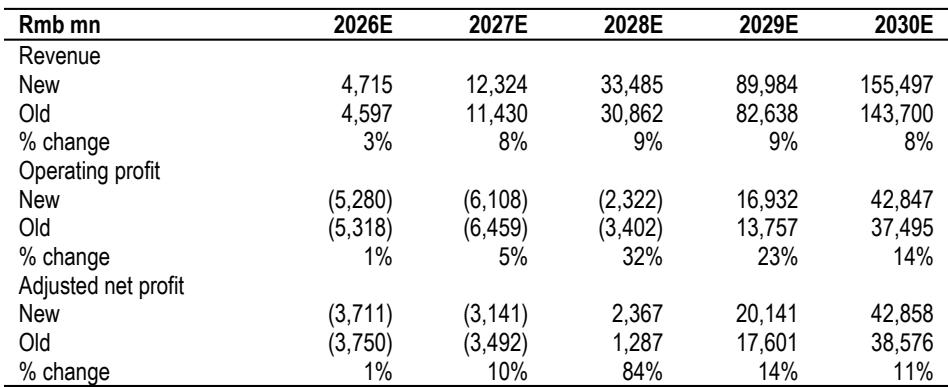
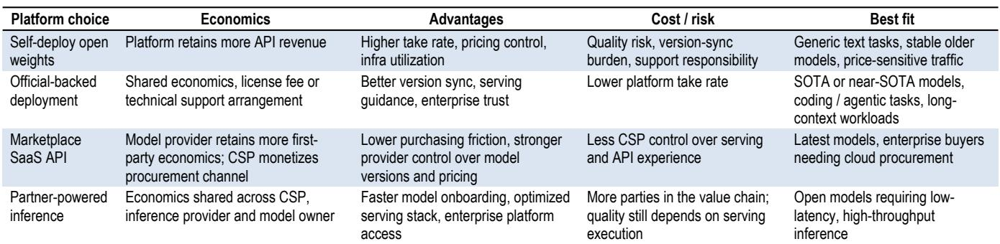
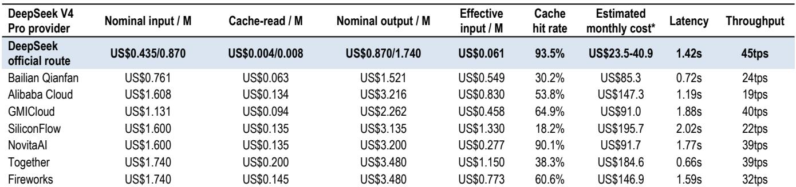

# Open-Weight AI Models Are Not a Monetization Leakage — They Are a Winner-Takes-More Distribution Strategy

Observers have long viewed open-weight releases as a threat to monetization. The logic is straightforward: when a company publishes the neural network weights of its large language model, third parties can deploy that model on their own infrastructure, bypassing the provider's first-party API. Revenue that would have flowed through the provider's own compute stack can instead be captured by cloud service providers, inference platforms, or the enterprises themselves. This framing, while not incorrect, misses the more important strategic question.

The real question is not whether open weights reduce access control. It is whether the model provider can turn that reduced control into wider distribution and higher paid conversion. The answer, as the latest data from China's LLM market demonstrates, depends almost entirely on model capability. For genuinely competitive models, open weights function as a distribution amplifier, not a revenue leak. For weaker models, they accelerate commoditization and price compression. This is not a winner-takes-all dynamic, but it is unmistakably a winner-takes-more one.

The implications for observers are significant. A global investment bank report published in July 2026 provides a detailed analytical framework for understanding this shift, using the contrasting cases of Zhipu AI and MiniMax to illustrate how model quality determines the commercial outcome of an open-weight strategy. The divergence in how the market should value these two companies. The underlying logic has implications far beyond these two names.

What follows is an analysis of the open-weight commercialization playbook, structured around the key strategic insights that observers need to internalize. The argument is that open-weight strategy is not a binary choice between openness and monetization, but a dynamic commercial decision that reshapes revenue mix, competitive positioning, and long-term value creation.

## Open-Weight Releases Reshape the Revenue Mix Rather Than Simply Reducing It

The conventional observer narrative treats open-weight releases as a leakage of monetizable traffic. The reasoning is intuitive: if a user can access the same model through a third-party endpoint at a lower price, why would they pay the first-party API provider? This framing, however, conflates model access with product quality. An open-weight release is not the same as a production-grade API service, and the gap between the two can be strategically widened by the model provider.

Consider what a third-party deployment actually delivers. A cloud service provider that downloads an open-weight model can offer inference at a competitive price, but it is running a static checkpoint. The model provider, by contrast, continues to optimize its official endpoint after launch. Post-training updates, instruction-following refinements, coding and tool-use tuning, refusal-policy changes, routing logic, cache policy, context-window handling, and inference-kernel optimization are all absorbed into the official API without a full public re-release of the weights. Over time, the same model name can deliver meaningfully different user experiences across endpoints.

This quality gap is most visible in demanding workloads. For simple chat, summarization, or translation tasks, users may not notice the difference. But for coding agents, retrieval-augmented generation pipelines, long-context analysis, or multi-step planning, small differences in the serving stack create visible differences in task completion. The model provider's official route becomes a differentiated product, not just another API endpoint.

The strategic implication is that open-weight strategy should be analyzed as a shift in revenue mix, not a simple loss of revenue. The provider may lose some revenue tied to model access alone, particularly for low-SLA text tasks where price comparison is straightforward. But it gains a wider funnel for paid inference, cloud distribution, and workflow monetization. The balance between these effects depends on model quality. Stronger models attract more developers, receive priority placement on cloud platforms, and convert open-weight adoption into paid usage at higher rates. Weaker models face faster price comparison and traffic rerouting.

The data from China's market supports this framework. DeepSeek's V4 Pro model, released under a permissive MIT license, shows the official route maintaining a significant cost advantage through cache economics. The official API is roughly 6 to 12 times cheaper than selected third-party routes in repeated-context workloads, driven by lower list pricing and higher cache hit rates. For coding agents and RAG workloads, where repeated system prompts and intermediate state make cache efficiency a major cost driver, this advantage is structural, not temporary.

## Model Capability Determines Whether Open Weights Create a Funnel or a Leak

The critical variable in the open-weight commercialization equation is model quality. This is not a subtle distinction. It is the central determinant of whether an open-weight strategy creates value or destroys it.

For a model that is genuinely competitive at the frontier, open weights function as a distribution mechanism. The model reaches developers, cloud platforms, API aggregators, and overseas users faster than any proprietary marketing campaign could achieve. These users experiment with the open-weight version, build applications on top of it, and eventually encounter use cases that require the higher quality, reliability, or feature set of the official API. The open-weight release becomes the top of a funnel that feeds into paid conversion.

For a model that is perceived as replaceable, the dynamic is reversed. Open access makes it easier for users to compare the model against alternatives, to route traffic to cheaper or better endpoints, and to substitute the model entirely. The provider loses the limited pricing power it had, and the open-weight release accelerates commoditization rather than driving adoption.

This framework explains the divergent outlook for Zhipu and MiniMax. Zhipu's GLM-5.2 release represents a company-specific capability step-up that positions the model as globally competitive. The permissive MIT license widens adoption, while the official route and higher-service variants such as GLM-Turbo remain positioned for quality-sensitive demand. The open-weight strategy creates distribution upside that the market has not fully priced.

MiniMax's M3 release, by contrast, provides weaker evidence of model-led pricing power. The model has not yet shown enough differentiation to command a premium in the open-weight ecosystem. Users view it as replaceable, and open access makes it easier to compare, route, and substitute. The commercial pressure from third-party deployment outweighs the distribution benefits.

The key question for observers is whether this divergence is temporary or structural. Can MiniMax close the capability gap with its next model generation? Or does the open-weight dynamic create a self-reinforcing cycle where stronger models attract more adoption, more feedback, and more optimization, while weaker models fall further behind? The evidence from the current cycle suggests the latter is more likely.

## Proprietary APIs Offer Quality and Freshness, Not Just Access to Weights

One of the most common misconceptions in the open-weight debate is that all endpoints running the same model are functionally equivalent. They are not. A model provider's official API is a continuously optimized product, while third-party deployments are static snapshots with variable serving quality.

The data from China's market makes this distinction concrete. For DeepSeek V4 Pro, the official route achieves a 93.5 percent cache hit rate, compared to 18 to 65 percent across selected third-party routes. This translates into dramatically lower effective input pricing. In a simplified monthly workload of 100 million effective input tokens and 20 million output tokens, the official route costs roughly 24 to 41 US dollars, while third-party routes range from 85 to 196 US dollars. The gap is not marginal. It is structural.

For MiniMax M3, the advantage is less about price and more about quality. Headline output pricing is broadly similar across providers, but the official route has higher cache hit rates, lower realized input cost, higher usage concentration, and faster inference speed. For agent and coding workloads, where users pay for task completion rather than raw tokens, these factors matter more than list price.

The broader point is that model freshness is increasingly important in production environments. An open-weight model is a released checkpoint. The official API is a live product that continues to improve. Post-launch optimizations in instruction following, coding behavior, long-context stability, tool calling, and inference efficiency are absorbed into the official endpoint without a full public re-release. For users who care about task completion quality, the official API is not just a distribution channel. It is a better product.

This creates a strategic opportunity for model providers. By maintaining a quality gap between the open-weight release and the official API, they can use open distribution to drive adoption while preserving pricing power for the premium endpoint. The key is that the quality gap must be real and sustained. If third-party deployments can match the official endpoint through their own optimization, the pricing power disappears.

## The Open-Weight Playbook Creates a Flexible Set of Commercial Levers

The open-weight strategy is not a single decision. It is a set of choices that model providers can calibrate by model version, capability tier, license type, and customer segment. The 2025-26 release cycle in China shows three broad patterns.

DeepSeek sits closest to the permissive open-weight end of the spectrum, using an MIT license that imposes minimal commercial restrictions. The strategy relies on aggressive first-party API pricing and cache-based economics to maintain a cost advantage over third-party deployments. The model is the distribution mechanism, and the monetization comes from volume and cache efficiency rather than high margins.

Zhipu uses a tiered approach. The base GLM-5.2 release is under an MIT license, maximizing distribution and adoption. But the Turbo and multimodal Turbo variants are proprietary, positioned for quality-sensitive demand that requires higher service levels. The open-weight release drives the funnel; the proprietary variants capture the value.

Kimi and MiniMax use modified or community licenses that preserve different degrees of commercial control. These licenses typically include conditions for large-scale commercial use, such as attribution requirements above certain revenue or user thresholds. The goal is to limit third-party commercialization while still benefiting from open-weight distribution.

For users, the open-weight route creates a fallback option that reduces adoption risk. Once the weights are public, developers and enterprises can self-deploy, use a third-party inference provider, or migrate across cloud routes if hosted access changes. This access certainty supports experimentation and ecosystem build-out. It also reduces the fear that a model family could disappear from the user's stack after a policy change or commercial dispute.

The strategic implication for observers is that open-weight strategy should be evaluated on a model-by-model basis, not as a blanket category. The same provider can use different strategies for different model generations, depending on competitive positioning and commercialization stage.

## What the Report Does Not Fully Answer: The Sustainability of the Quality Gap

The analytical framework presented in the report is compelling, but it leaves several important questions unresolved. The most critical is whether the quality gap between the official API and third-party deployments is sustainable over time.

The report argues that model providers can maintain this gap through continuous post-launch optimization. But third-party providers are not passive. They can fine-tune the open-weight model, optimize their serving stack, and develop their own caching and routing infrastructure. Over time, the gap may narrow, particularly for the largest cloud service providers that have the engineering resources to optimize at scale.

The question is whether the pace of improvement at the frontier is fast enough to keep third-party deployments perpetually behind. If model providers release new generations every six to twelve months, the static checkpoint advantage of the official API may be structural. But if model progress slows, or if third-party providers can match the official endpoint through their own optimization, the pricing power of the official API may erode.

A related question is whether the open-weight dynamic creates a self-reinforcing cycle for the strongest models. If the best models attract the most adoption, the most feedback, and the most optimization, they may pull further ahead over time. But if the distribution advantage of open weights is more important for initial adoption than for sustained monetization, the long-term economics may depend more on ecosystem lock-in than on model quality.

These questions are not answered by the current data. They represent the key analytical uncertainties that observers need to monitor as the open-weight ecosystem evolves.

## A Decision Framework for Evaluating Open-Weight LLM Providers

The report's analysis can be distilled into a decision framework for observers evaluating LLM providers that use open-weight strategies. The framework has four dimensions.

First, assess model capability relative to the frontier. This is the single most important variable. A model that is genuinely competitive can use open weights to drive distribution and paid conversion. A model that is replaceable will face faster commoditization. The relevant benchmark is not just absolute capability, but capability relative to the next best alternative.

Second, evaluate the quality gap between the open-weight release and the official API. Is the gap real and sustained, or can third-party providers match the official endpoint through their own optimization? The gap should be measured across multiple dimensions: model freshness, cache efficiency, latency, throughput, feature support, and enterprise SLA.

Third, analyze the license structure and monetization levers. Does the provider use a permissive license that maximizes distribution, or a modified license that preserves commercial control? Are there proprietary variants that capture value from quality-sensitive demand? The license structure should be aligned with the model's competitive positioning.

Fourth, monitor the competitive dynamics of the ecosystem. Are third-party providers investing in their own optimization, or are they relying on the official endpoint for quality? Are cloud service providers prioritizing the model in their marketplace, or are they treating it as a commodity? The ecosystem dynamics can amplify or offset the provider's strategic choices.

This framework is not a formula. It requires judgment on each dimension, and the weight of each factor will vary by provider and by model generation. But it provides a structured way to evaluate the commercial implications of open-weight strategy, rather than relying on the binary framing of leakage versus distribution.

## Join the Community to Read the Full Report and Review the Original Charts

The analysis above draws on a detailed research report from a global investment bank that provides extensive data on API pricing, cache economics, and competitive dynamics across China's LLM market. The full report includes case studies on DeepSeek V4 Pro and MiniMax M3, provider-level pricing tables, and a breakdown of license structures across the major independent model providers.

For those who want to go deeper into the data and the analytical framework, the full report is available through the research platform. The original charts and tables provide the granular evidence that supports the strategic conclusions summarized here.

Join the community to read the full report and review the original charts.

*For informational purposes only. Portions may be generated, translated, summarized, or edited with AI assistance based on source materials and may contain omissions or errors. Please verify independently. This is not professional advice.*

For informational purposes only. Portions may be generated, translated, summarized, or edited with AI assistance based on source materials and may contain omissions or errors. Please verify independently. This is not professional advice.

