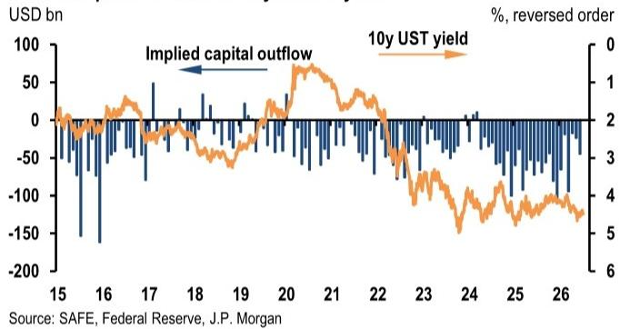
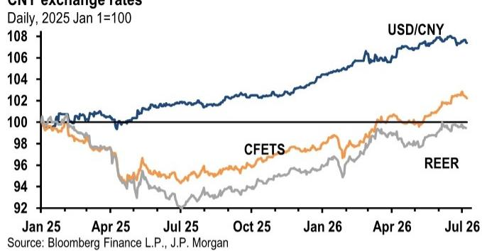
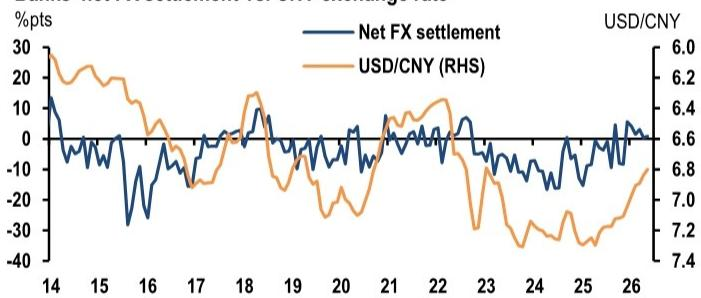

# 中国并非在收紧跨境资金流动——而是在为人民币国际化重建基础设施

当前亚洲市场最容易被误解的政策信号，是北京方面一系列跨境监管行动。一份2026年7月初发布的全球研究机构报告，以清晰的论点厘清了困惑：近期的措施并非对对外投资的限制，而是一场治理清理，同时伴随着离岸人民币基础设施的积极扩张。这对汇率市场、资产配置和企业财资策略的影响，比新闻标题所暗示的更为微妙。

中国外汇储备在6月减少了260亿美元，降至34,163亿美元，低于该机构的预估和市场共识。这一下降表明进口增强和贸易顺差收窄，经常账户顺差估计为524亿美元，隐含的资本外流为450亿美元。中国人民银行加快了黄金购买，同时减少了美国国债持有量。这些数据点很重要，但真正的战略故事在于围绕它们正在构建的政策架构。

论点很直接：北京并非在关闭大门。它正在安装新锁、拓宽一些走廊，并建造全新的通道。将近期监管举措解读为收紧对外资本管制的读者，将会错误定价人民币、离岸债券市场以及中国金融体系更广泛开放的轨迹。下半年人民币前景取决于理解哪些信号是噪音，哪些是结构性变化。

## 5-6月的监管行动是治理框架，而非资本管制体系

市场对一系列涉及跨境证券、期货、基金活动和对外投资的政策公告的反应，虽可预见但有所偏差。关于中国是否在实质性收紧对外资本流动的疑问，并未抓住要点。该报告将这些举措视为更广泛治理框架的一部分，该框架旨在管理资本、技术、数据和人才领域的跨境流动。这是一个关键的区别。

关键的观察点并非公告本身，而是后续将界定实际边界的实施细则。问题在于，北京是否会通过更多获批渠道、更高额度或两者兼有，来扩大合规渠道，以使该框架与人民币国际化目标保持一致。该报告对证据的解读表明答案是肯定的，而6月底和7月初的后续政策行动也证实了这一轨迹。

在陆家嘴金融论坛上，人民银行行长潘功胜宣布了一项专门的回购便利，为符合条件的离岸央行类机构（包括外国央行、货币当局、国际金融机构和主权财富基金）提供人民币流动性。该便利提供质押式回购和买断式回购两种结构，以优质人民币抵押品为基础。这不是限制，而是邀请。

国家外汇管理局局长朱鹤新副行长表示，将通过简化对外直接投资和对外债务的外汇管理、优化外汇贷款和跨境股权激励框架，以及发放新一批合格境内机构读者额度，进一步支持对外活动。方向很明确：渠道清理与渠道扩张并行。

## 新的离岸人民币基础设施是固定收益读者最应关注的发展

该报告详细阐述了一系列基础设施升级，这些升级共同代表了多年来离岸人民币基础设施最重大的扩张。潘功胜行长7月7日在香港金融与债券通峰会上的公告，包括四项值得密切关注的具体措施。

第一，南向债券通年度净投资额度从5000亿元人民币提高至8000亿元人民币，南向债券被纳入可作回购抵押品的范围。这是内地读者进入离岸债券市场渠道的直接扩张。第二，香港金管局人民币流动性便利从2000亿元人民币增加至5000亿元人民币，使用期限延长至三年。第三，离岸央行回购便利在香港推出，首份协议已签署，首批交易已完成。第四，该框架加强了人民币贸易结算和本币结算联系，包括实现直接离岸人民币-印尼盾交易。

其意义很直接：这些措施旨在深化离岸人民币市场、增加外国参与度，并支持离岸外汇和债券市场的运作。它们不会机械地映射到美元/人民币的具体即期水平，但它们改变了每个持有中国资产敞口的固定收益读者的结构性背景。向离岸官方机构提供流动性，降低了持有离岸人民币资产相关的风险溢价。香港金管局便利的扩张，为离岸融资压力提供了更大的缓冲。

## 下半年人民币前景取决于五个催化剂，它们更多关乎资金流而非基本面

该报告指出了将影响2026年下半年人民币走势的五个催化剂，其分析价值在于如何对它们进行相对权重评估。贸易顺差仍是国际收支的结构性锚点，但短期波动取决于出口表现、能源进口账单和贸易政策新闻之间的相互作用。风险包括美国301条款和232条款下关税不确定性的重现，以及欧盟相关摩擦可能加剧，包括关于货币协议的讨论。

第二个催化剂对交易者而言最具可操作性：出口商的结汇决策和季节性股息支付创造了离散的外汇兑换窗口。关键问题是，结汇是集中在增量贸易收入上，还是扩大到更直接地减少累积的美元持有量。这些行为取决于美元/人民币的交易水平，这意味着汇率本身成为资金流动态的反馈机制。

第三个催化剂是美元背景，它将限制人民币的强势。更坚挺的美元和更鹰派的美联储倾向可能会减缓人民币升值的步伐，特别是考虑到与人民银行的政策分化。该报告指出，美中利差现在对解释人民币走势的作用，不如对其他货币那么可靠，但美联储政策的方向仍然对调整速度有影响。

第四个催化剂是7月的政治局会议。更明确的宽松倾向可能通过改善信心和资金流入动态来支持风险资产和人民币。但该报告认为，增量刺激的门槛很高，近期重点更可能放在加快部署3月全国人大批准的财政资源上。这种设定是不对称的：失望情绪可能打压市场情绪，而上涨则需要一个能改变内需叙事的明显升级。

第五个催化剂是监管不确定性对人民币国际化支持动态。市场正在关注近期的执法行动是否预示着更严格的对外约束，这将通过渠道准入和情绪直接影响离岸人民币。该报告对近期信号的积极解读，强化了以下观点：这些行动是关于渠道清理，同时为人民币国际化扩大基础设施。

## 报告未完全解答的问题：黄金购买与储备构成策略之间的相互作用

该报告指出，人民银行在6月加快了黄金购买，增加了48万盎司，上半年购买量为129万盎司，而2025年下半年仅为25万盎司。中国持有的美国国债在4月小幅下降12亿美元，至6511亿美元。该报告并未完全回答，这是否代表了储备构成的战略性转变，还是对当前状况的战术性回应。

悬而未决的问题是，黄金购买是对地缘政治风险的对冲、关于美元储备多元化的信号，还是仅仅取决于相对价格动态。与2025年下半年相比，2026年上半年的加速引人注目，但该报告并未提供一个框架来预测这一速度是否会持续。对读者而言，答案很重要，因为它影响中国对美国国债需求的轨迹，以及储备管理决策对美元-人民币关系的信号效应。

第二个未解决的问题是，新的离岸基础设施将在多大程度上被实际使用。设施结构已经到位，但该报告并未量化外国央行和主权财富基金的潜在使用量。基础设施可用性与实际使用之间的差异，正是历史上许多人民币国际化举措未能达到预期的地方。

## 读者应对下半年的决策框架

该报告的分析结构有助于为读者提供一个实用的决策框架。第一个决策点涉及体制识别：我们正处于跨境资本流动的收紧阶段还是开放阶段？政策序列的证据指向开放，但带有治理监督，这增加了非标准渠道的合规成本。读者应评估其对中国资产的敞口是依赖于可能面临更严格执法的渠道，还是正在扩张的渠道。

第二个决策点涉及人民币升值的速度。该报告的分析表明，实际约束更多是人民银行对升值速度的容忍度，而非均衡水平。读者应关注中间价设定倾向和人民银行对每日波动的反应。持续加速升值可能会引发政策回应，但在人民银行舒适区内的渐进调整是基准情形。

第三个决策点涉及离岸与在岸头寸的配置。香港金管局流动性便利和离岸回购便利的扩张，使离岸人民币成为对官方机构更具吸引力的融资货币。南向债券通额度的提高，为内地读者创造了新的离岸债券需求来源。这种不对称性有利于做多离岸人民币流动性、做空在岸人民币久期，或者根据读者的基准货币和授权进行反向操作。

第四个决策点涉及贸易政策对冲。该报告指出了来自美国和欧盟的关税风险，包括可能达成货币协议。拥有大量中国敞口的读者应考虑，其投资组合是否已为贸易摩擦加剧、政策回应包括更激进的人民币贬值倾向的情景做好准备。基准情形是管理下的升值，但尾部风险是不对称的，该报告的框架有助于识别将改变体制的触发因素。

## 完整图景需要图表背后的数据

本报告中的分析，得到了对外汇储备、黄金购买、美国国债持有量和银行结售汇比率等专有追踪数据的支持。关于美元/人民币中间价倾向、黄金储备与美国国债持有量、以及银行结售汇净额与人民币汇率的图表，为上述论点提供了实证基础。资本外流与美国国债回报表现之间的关系，以及银行结售汇比率的时间序列数据，对于理解驱动即期市场的资金流动态至关重要。

该报告留下了几个有意义的问题。黄金购买加速有多少是周期性的，多少是结构性的？新的离岸设施能否实现有意义的利用率，还是会像之前的基础设施举措一样基本未被使用？关税新闻与出口商结汇行为之间的相互作用在下半年将如何演变？这些问题无法仅从该报告中得到答案，但该报告为读者在新数据到来时形成自己的观点提供了分析框架。

加入社区阅读完整报告并查看原始图表。

*仅供参考。部分内容可能基于源材料通过AI辅助生成、翻译、总结或编辑，可能存在遗漏或错误。请独立核实。这不构成投资、法律、税务、会计或其他专业建议。*

仅供参考。部分内容可能基于源材料通过AI辅助生成、翻译、总结或编辑，可能存在遗漏或错误。请独立核实。这不构成投资、法律、税务、会计或其他专业建议。

