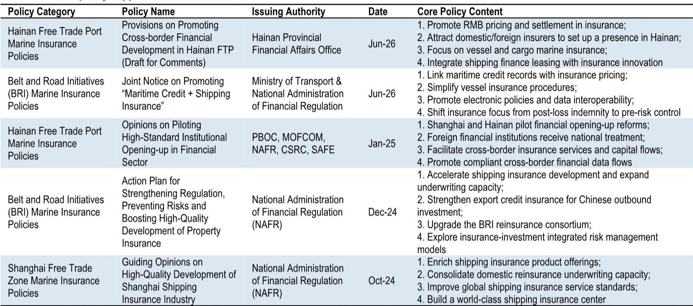

# 中国海上保险回迁：并非渐进趋势，而是结构性重组，利好具有国家背景的现有企业

中国海上贸易已发展为全球最大规模，其商船队位居世界前列，造船产量也引领行业。然而，几十年来，这些海上资产的保险和再保险业务却不成比例地由伦敦和其他发达市场中心控制。这种不对称正在被纠正——并非仅通过市场力量，而是通过一项深思熟虑的、由国家主导的政策推动，将海上保险承保能力、风险治理和理赔基础设施迁回境内。这不是一个边缘性的转变。这是中国管理其海上风险资产负债表方式的结构性重组。

对研究者的启示是具体且可操作的。主要受益者并非宽泛的保险指数，而是一系列处于政策架构核心的国内再保险公司和专业保险公司。中国再保险作为国内相对少见的综合性再保险集团，有望在这一趋势中占据最大份额。其作为国家船舶保险共同体和海上丝绸之路共同体的牵头管理方，使其能够优先接触到在新体制下将被保留在国内的复杂、高保费风险。中国太平凭借其非寿险和再保险的双重业务布局，提供了互补性的观察角度。但关键问题不在于回迁主题是否真实——而在于如何校准时机、估值和风险集中度。

一份全球研究机构的报告明确指出：中国海上保险市场正从数量驱动型增长转向高价值、专业化的风险服务。监管变化，包括2026年5月生效的修订版《海商法》和2024年10月发布的上海海上保险指导意见，正在为这一转型创造法律和制度框架。但该报告也留下了一些待分析的问题——这些问题对于任何试图围绕这一主题构建观察框架的人来说都很重要。本文梳理其逻辑，延伸其启示，并确定研究者所需的决策框架。

## 境内风险回迁论点并非关乎市场份额——而是关乎战略自主

最常见的解读中国海上保险发展的方式是增长故事：更多的船只、更多的贸易、更多的保费。这种解读没有错，但不完整。更深层的驱动力是战略自主。中国在海上保险产品、仲裁和理赔服务方面对海外再保险公司和保险公司的依赖，在其供应链安全中造成了结构性脆弱性。当一艘载有中国货物的中资船舶遇到纠纷时，结算流程、法律管辖地和承保能力历来由不受中国监管机构管辖的机构控制。

这不是一个理论上的担忧。报告指出，完整的海上保险价值链——承保能力、再保险支持、专业条款和跨境争端解决——长期以来一直由伦敦和其他发达市场主导。这种主导地位意味着中国海洋经济产生的大部分保费流向海外，并且中国独立定价和管理自身海洋风险的能力受到制约。因此，政策回应不仅仅是获取更大份额的蛋糕。它是作为国家经济安全事项，建设独立的国内承保能力。

2026年5月生效的修订版《海商法》和2024年10月发布的上海海上保险指导意见是这一转变的基础性文件。它们旨在逐步减少对海外风险转移的结构性依赖。报告的政策表格显示了一项协调的多机构努力：国家金融监督管理总局、中国人民银行、交通运输部和上海市政府均已参与。这不是单一部委的倡议——而是一项跨机构的战略优先事项。

对研究者的“所以呢”在于，这种回迁可能比典型的市场驱动增长周期更持久、更具力度。政策驱动的需求对航运费率或贸易量的周期性下行不那么敏感。建设国内能力的结构性要求意味着，即使全球海上保险保费收缩，境内留存份额也应继续扩大。

## 中国再保险占据难以复制的结构性位置

报告将中国再保险确定为中期关键受益者，其逻辑是直接的。海上保险中较高的技术承保壁垒维持了集中的市场结构。复杂的海上风险——大型船舶、特种货物、跨境责任——需要深厚的精算专业知识、长期的理赔历史以及与经纪人和船东建立的关系。从零开始建立这种能力需要数年时间。

中国再保险已经具备这些条件。作为国内相对少见的综合性再保险集团，它领导着国家船舶保险共同体和海上丝绸之路共同体。这些共同体并非营销标签——它们是国内承保能力得以聚合和部署的运营载体。当一家中国航运公司需要为大型液化天然气运输船或沿“一带一路”航线运营的船队投保时，共同体结构确保风险在分保至海外之前，首先提供给国内再保险公司。

报告的估值分析使风险回报情况具有说服力。中国再保险的远期市盈率约为4倍，股息回报表现为8%，而同业股息回报表现在3-6%区间。这一估值折价反映了市场对回迁主题速度和规模的怀疑。但如果政策轨迹如证据所示那样明确，随着盈利可见度的提高，折价可能会收窄。

研究者应问的问题不是中国再保险是否便宜。而是市场是否已充分定价了留存海上风险带来的盈利提升。报告指出，领先的国内财产保险公司将留存更多境内海上风险，同时将更复杂的风险分保给中国再保险。这一动态应支持“稳定且可见的中期盈利增长”。但报告并未量化可能转移至境内的潜在保费池。这是任何估值模型的关键变量。

## 中国太平提供更广泛但更间接的同一主题观察角度

中国太平的定位更为微妙。报告指出，该公司拥有相关的财产保险和再保险业务，可能受益于政策催化，同时预计2026年上半年寿险销售势头强劲。但太平并非像中国再保险那样是海上保险回迁的核心载体。

太平的吸引力在于其作为主要非寿险公司和再保险公司的长期运营历史。其标准普尔信用评级为A（稳定），与中国再保险持平，表明财务实力相当。但其对海上回迁主题的敞口在业务线上更为多元化，且不像中国再保险的角色那样集中在共同体结构中。

报告将太平定位为提供“保险公司和制造商中境内风险回迁主题的上行空间”，这表明了一个更广泛、更分散的机会集合。太平可能受益于国内承保活动的普遍增加、新海上保险产品的开发以及上海临港新片区再保险能力的扩展。但关联性不那么直接，盈利可见度也较低。

对于研究者而言，在中国再保险和中国太平之间的选择，是在集中度和多元化之间的选择。中国再保险提供了对回迁主题更纯粹的观察角度，具有更高的潜在上行空间和更强的政策可见度。中国太平提供了更广泛的保险业务，具有多个增长驱动因素，其中海上保险是组成部分之一。报告并未解决哪个是风险调整后更好的选择——这是每位研究者必须根据自身框架构建和风险承受能力来回答的问题。

## 报告未完全解答的问题：时机、规模和竞争动态

报告在方向上很强，但留下了一些有意义的分析问题。这些并非分析缺陷——它们是任何旨在严谨而非推测的研究报告的自然边界。

首先，盈利影响的时间尚不明确。修订版《海商法》将于2026年5月生效，上海指导意见于2024年10月发布。但从政策到保费流的转化并非瞬间完成。国内保险公司和再保险公司将多快建立承保能力来吸收目前分保至海外的风险？报告未提供保费回迁的逐年预测，任何依赖此主题的研究者都需要形成自己对采用曲线的看法。

其次，可触及保费池的规模未被量化。中国海上保险市场规模庞大，但报告未精确衡量目前置于海外的部分。没有这一基线，很难估计中国再保险或中国太平的收入提升。报告的估值案例依赖于对有利定位的定性评估，而非对留存保费的逐项预测。

第三，竞争动态未被充分探讨。报告指出，较高的技术承保壁垒维持了集中的市场结构，这对中国再保险有利。但随着政策推动加速，新进入者——包括在上海和海南设立业务的外资保险公司——是否会竞争同一业务？报告提到，在试点开放改革下，外资金融机构享受国民待遇。这表明回迁主题对国内现有企业而言可能并非零和游戏。拥有深厚海上保险专业知识的外资参与者可能占据部分境内增长。报告未模拟这一竞争压力。

这些开放性问题并非否定论点的理由。它们是深入研究完整报告并构建更精细分析框架的理由。

## 研究者评估海上保险回迁主题的决策框架

对于希望将报告分析转化为可操作决策的研究者，一个结构化框架是有用的。以下三部分方法涵盖了关键变量：

**首先，评估政策执行风险。** 回迁主题依赖于监管实施，而不仅仅是监管公告。研究者应跟踪具体里程碑：修订版《海商法》的运营启动、通过国家船舶保险共同体分保的风险量、以及上海临港新片区新海上保险产品的设立。如果这些里程碑按时达成，论点将加强。如果延迟，盈利影响的时间线将延长。

**其次，校准对纯主题与多元化选项的敞口。** 中国再保险提供更高的潜在上行空间，但集中度风险也更大。其估值已反映怀疑态度，这意味着盈利或政策执行方面的积极惊喜可能推动显著的倍数扩张。中国太平提供更广泛的基础，单一主题风险较低，但对回迁催化剂的直接杠杆作用也较小。选择取决于研究者是希望对一个主题进行高确信度押注，还是希望获得包含该主题作为组成部分的多元化保险敞口。

**第三，监测竞争格局。** 报告将中国再保险和中国太平确定为受益者，但并未排除其他国内保险公司或外资进入者可能占据可观市场份额的可能性。研究者应关注新海上保险合资企业的公告、其他国内再保险公司能力的扩张，以及外资机构在上海和海南建立境内承保业务的速度。

该框架不会产生单一答案。它产生了一组条件，在这些条件下，不同的研究结果变得或多或少可能。这就是在政策驱动的主题性转变中进行战略性研究的本质。

---

*仅供参考。部分内容可能基于源材料通过AI辅助生成、翻译、总结或编辑，可能存在遗漏或错误。请独立核实。本文不构成专业建议。*

仅供参考。部分内容可能基于源材料通过AI辅助生成、翻译、总结或编辑，可能存在遗漏或错误。请独立核实。本文不构成专业建议。

