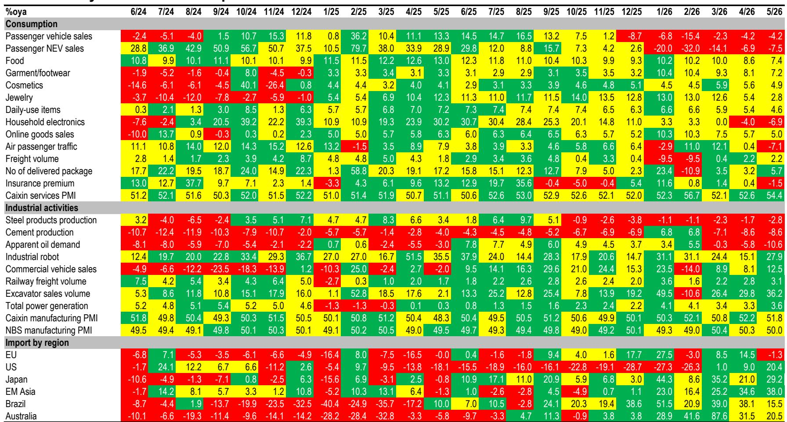
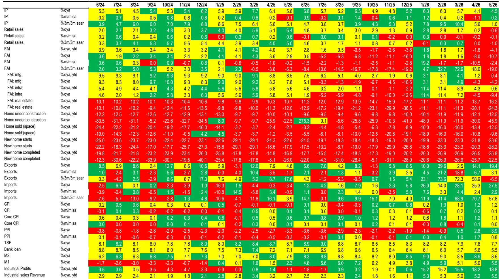
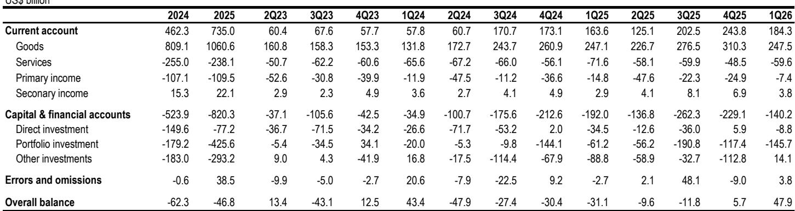

# JPM：生产端修复与需求端错位，JPM拆解中国库存周期

这份JPM最新月度数据展望提出了一个值得产业决策者反复咀嚼的判断：当前中国宏观环境呈现的“韧性”和“仍在调整”并非同一层面的矛盾，而是生产端修复与需求端吸收之间的错位。报告的核心信号是——工业产出有底，但内需依然构成硬约束。

5月数据显示，工业增加值同比增长5.8%，高技术制造业增速达到15.1%，对前五个月工业增长的贡献接近40%。出口在AI相关设备、存储芯片、新能源产品以及贸易转口的支撑下保持强劲。但与此同时，零售销售同比转负，固定资产研究调整10.7%，基础设施研究下降9.4%，房地产研究跌幅扩大至24.3%。

换个角度看：生产端并非没有活力，但活力集中在电子、高技术制造和部分上游行业，而与消费、住房和传统产业相关的领域仍然偏弱。

## 1. 财政存款创十年同期次高，说明钱还没花出去

报告中最值得关注的图表之一是5月财政存款数据。一般公共预算支出连续第二个月调整，基础设施支出同比下降12.0%，而财政存款攀升至过去十年5月第二高水平。

这意味着什么？专项债发行确实在提速，但资金从发行到形成实物工作量之间，仍然存在明显的传导阻滞。财政资金停留在账面上，而不是转化为项目开工和施工活动。这份JPM报告明确指出，如果6月活动和二季度GDP数据不及预期，7月政治局会议可能会释放更强的逆周期信号。但无论政策如何定调，核心瓶颈在于：能否把财政资源转化为真实需求。

> **KC评论：** 财政存款高企不是流动性问题，是执行力问题。报告提醒读者关注的是“资金到项目”的转化率，而不是政策本身的方向。完整报告中关于财政执行节奏的月度追踪图表值得细看。

## 2. 出口是缓冲垫，但外部环境正在收紧

6月出口预计仍将保持强劲，支撑来自AI设备、存储模块、新能源产品和贸易转口。但这张“外部缓冲垫”正在变薄。报告列举了多重不确定性：关税、反补贴调查、本地化含量要求、碳相关壁垒——这些因素正在逐步限制外部需求的吸收能力。

JPM分析师提出了一个关键情景推演：如果出口在內需回暖之前率先走弱，那么当前具有韧性的产出将转化为库存积累、利润率压缩，并重新引发生产者价格节奏变化。换句话说，当前生产端的“韧性”并非没有代价——它依赖于外部需求的持续消化能力。

## 3. 报告尚未完全回答的关键问题：库存周期的拐点在哪里

报告提供了清晰的供需错位框架，但有一个问题并未完全展开：当前工业产出与内需之间的缺口，究竟处于库存周期的哪个阶段？PMI数据显示，生产和新订单有所改善，但就业、库存和出口订单仍然分化，缺乏广泛的补库、招聘或资本开支信号。

这意味着，即使生产端保持韧性，如果下游需求持续仍在调整，企业可能被动进入“被迫补库”阶段，而非主动补库。两者的区别在于定价权：主动补库伴随价格上涨，被迫补库则往往以价格折扣和利润压缩收场。报告没有给出库存周期的明确判断，但这恰恰是观察未来几个月工业利润走向的关键变量。

> **KC评论：** 报告没有把话说完，但给了读者思考的工具。建议关注两个先行指标：一是工业产成品库存增速是否出现拐点，二是PPI环比是否在低油价之外出现内生改善。这两个指标能帮助判断当前到底是“生产韧性”还是“库存被动积累”。

## 4. 产业决策者应该关注的三个观察维度

第一，关注财政执行节奏而非政策表态。7月政治局会议前后，财政支出的月度环比变化比任何政策文件都更能说明问题。第二，区分出口的结构性支撑和周期性不确定性。AI和新能源相关的出口需求有其技术周期支撑，但贸易转口带来的短期拉动可能在关税调整后快速消退。第三，观察下游定价能力的边际变化。如果工业生产保持高位而终端价格持续走弱，说明需求吸收能力仍未改善，企业利润修复将滞后于产量修复。

这份JPM报告的核心价值不在于预测，而在于提供了一个清晰的“传导链”分析框架：从财政执行到项目开工，从生产韧性到需求吸收，从出口支撑到利润率变化。对于产业决策者而言，理解这个传导链中的薄弱环节，比猜测下一个政策工具更重要。

For informational purposes only. Portions may be generated,translated,summarized,or edited with AI assistance based on source materials and may contain omissions or errors. Please verify independently. This is not investment,legal,tax,accounting,or other professional advice.

For informational purposes only. Portions may be generated,translated,summarized,or edited with AI assistance based on source materials and may contain omissions or errors. Please verify independently. This is not investment,legal,tax,accounting,or other professional advice.

