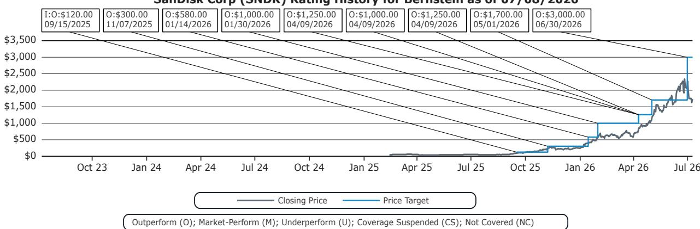

# 美国IT硬件行业观察

## 存储：新型长期协议分析（下篇）—— 基于微芯及其他半导体长期协议的案例研究——本次有何不同？

Mark C. Newman

+1 212 845 7822

mark.newman@bernsteinsg.com

April Li

+1 917 344 8339

april.li@bernsteinsg.com

Phoebe Sun

+1 917 344 8481

phoebe.sun@bernsteinsg.com

上周我们发布了对新型存储长期协议的分析，探讨了它们为何不同，以及这对收益可持续性的意义。今天的第二部分将深入探讨半导体行业的案例研究，以比较并回应来自市场参与者的疑问和反馈。

从历史来看，半导体和存储领域的长期协议主要作为买方的工具：客户利用长期协议来确保获得有保障的供应量，而卖方自身几乎没有结构性议价能力。即使供应商拥有一定的谈判筹码，合同也主要局限于两种结构：一种是"照付不议"协议，即买方承诺要么按预先约定的价格接受最低数量，要么为任何短缺支付罚金；另一种是所谓的"不可取消"订单，即买方承诺不取消交货，但后来的周期证明，买方在实际操作中能够且确实取消了订单。这两种结构都为卖方提供了很少的实际下行保护，因为如果买方退出，两者都不需要承担预先的财务承诺来补偿供应商；相对少见的补救措施是起诉要求赔偿，这一过程缓慢、昂贵，而且如果买方在判决时已资不抵债，往往也是徒劳的。

两个案例研究清楚地说明了以往的长期协议结构在实践中是如何失败的：1. 微芯/模拟半导体；2. 赫姆洛克/多晶硅。在这两个案例中，赫姆洛克的案例与我们看到的新型存储长期协议更为相似，因为该协议具有一定的法律约束力，但在很大程度上依赖于起诉客户来获得应得的款项。微芯的案例常被半导体行业观察者引用，它是一个约束力弱得多的协议，没有显著的法律约束力，客户几乎没有动力不退出。

我们识别出传统半导体长期协议与新型存储长期协议之间的三个结构性差异，每一个都针对削弱先前合同结构的特定弱点：1. 预先财务承诺：现金保证金、信用证或第三方担保，特别是后端加权（剩余财务承诺占剩余采购义务的比例随时间大幅增加，从而在更需要保护的合同后期提供更强的下行保护）；2. 更好的对手方质量：财务稳健、多元化的买方取代了资本薄弱或分散的客户基础，后者曾削弱了赫姆洛克和微芯；3. 结构性需求：持续的AI驱动建设取代了最终削弱微芯的临时性需求提前和重复下单。

新型存储长期协议提供了有意义但并非无限的下行保护。我们发现，这些新型存储长期协议的结构方式为客户退出提供了显著更高的抑制因素——尤其是在合同期的后半段。在我们之前的报告中（新型存储长期协议），我们展示了一系列未来价格变化的情景，以及这些情景在有和没有长期协议的情况下如何影响收益。总之，这些协议提供的下行保护比我们之前分析的案例要多得多，但并非无限的下行保护。

## Bernstein股票列表

<table><tr><td rowspan="2"></td><td rowspan="2"></td><td colspan="3">2026年7月8日</td><td colspan="2">过去12个月</td><td colspan="4">调整后每股收益</td><td colspan="3">调整后市盈率（倍）</td></tr><tr><td></td><td rowspan="2">收盘价</td><td rowspan="2">目标价</td><td rowspan="2">相对表现</td><td rowspan="2">货币</td><td rowspan="2">2025A</td><td rowspan="2">2026E</td><td rowspan="2">2027E</td><td rowspan="2">2025A</td><td rowspan="2">2026E</td><td rowspan="2">2027E</td><td></td></tr><tr><td>代码</td><td>评级</td><td>货币</td><td></td></tr><tr><td>SNDK (SanDisk)</td><td>O</td><td>美元</td><td>1,727.18</td><td>3,000.00</td><td>3618.3%</td><td>美元</td><td>2.99</td><td>65.43</td><td>243.73</td><td>577.7</td><td>26.4</td><td>7.1</td><td></td></tr><tr><td>SPX</td><td></td><td></td><td>7,482.71</td><td></td><td></td><td></td><td></td><td></td><td></td><td></td><td></td><td></td><td></td></tr></table>

O - 跑赢大盘，M - 与大盘持平，U - 跑输大盘，NR - 未评级，CS - 暂停覆盖
来源：彭博社，Bernstein估计和分析。

## 目录

第一部分：回顾过去——早期半导体长期协议案例研究....3
案例研究1：微芯/模拟——不可取消/不可重新安排的供应计划导致库存过剩....3
案例研究2：赫姆洛克/多晶硅——照付不议合同失败....4
第二部分：关键差异：传统半导体长期协议 vs. 新型存储长期协议....6
预先财务承诺：真正的约束，而不仅仅是承诺....6
根本上更好的对手方质量....8
有限需求 vs. 结构性扩张....8

## 详细内容

## 第一部分：回顾过去——早期半导体长期协议案例研究

从历史来看，半导体和存储领域的长期协议主要作为买方的工具：客户利用长期协议来确保获得有保障的供应量，而卖方几乎没有结构性议价能力。即使供应商拥有一定的谈判筹码，合同也主要局限于两种结构：一种是"照付不议"协议，即买方承诺要么按预先约定的价格接受最低数量，要么为任何短缺支付罚金；另一种是所谓的"不可取消"订单，即买方承诺不取消交货，但后来的周期证明，买方在实际操作中能够且确实取消了订单。这两种结构都为卖方提供了很少的实际下行保护，因为如果买方退出，两者都不需要承担重大的预先财务承诺来补偿供应商；相对少见的补救措施是起诉要求赔偿，这一过程缓慢、昂贵，而且如果买方在判决时已资不抵债，往往也是徒劳的。

两个案例研究清楚地说明了以往的长期协议结构在实践中是如何失败的：1. 微芯/模拟半导体；2. 赫姆洛克/多晶硅。在这两个案例中，赫姆洛克的案例与我们看到的新型存储长期协议更为相似，因为该协议具有一定的法律约束力，但在很大程度上依赖于起诉客户来获得应得的款项（剧透：赫姆洛克在多年诉讼后赢得了案件，但由于客户破产，未能收到所有应得款项）。微芯的案例常被半导体行业观察者引用，它是一个约束力弱得多的协议，没有显著的法律约束力，客户几乎没有动力退出。

## 案例研究1：微芯/模拟——不可取消/不可重新安排的供应计划导致库存过剩

在2020-2022年（新冠疫情时期）半导体短缺高峰期，汽车和工业制造商在普遍组件短缺的情况下争相确保模拟、混合信号和基础MCU的供应。因此，该行业经历了显著的需求提前和广泛的重复下单，造成了人为膨胀的积压订单。为了在严重组件短缺的情况下保障生产计划，许多客户购买的数量远超其即时需求，实际上将未来几年的预期需求提前，以锁定有限的制造产能。与此同时，重复甚至三次下单变得普遍，客户在多个半导体供应商和分销渠道之间下重叠订单，以提高获得产品的机会。这些行为共同扭曲了订单模式，膨胀了报告的积压水平，并显著高估了潜在的终端市场需求。

芯片制造商将订单激增解读为持续、长期增长的证据，扩大了产能计划，并越来越多地推动客户签署长期协议以锁定未来的生产承诺。微芯推出了其首选供应计划。该计划提供优先制造时段，以换取12个月的连续、完全不可取消且不可重新安排的订单积压。

然而，对模拟芯片和微控制器的需求从根本上与终端产品生产挂钩，不会呈指数级增长。客户需要足够的组件来制造车辆、工业设备、家电和消费电子产品，但一旦供应限制缓解，就没有太大必要积累大量额外库存。

与当今AI驱动的存储需求不同——这是一个巨大的增量增长驱动力——新冠疫情期间模拟和MCU需求的激增很大程度上是由供应不安全感驱动的。在许多情况下，客户是在囤积库存和下达重复订单以确保供应，而不是购买组件来满足相应的终端市场需求增长。

因此，当消费者需求回归常态时，长期协议在巨大的库存过剩中崩溃。客户迅速发现自己拥有大量膨胀的库存。他们没有物理空间或资产负债表能力来接收更多交货。客户被迫完全冻结新订单以消耗现有库存。像ADI公司和微芯科技这样的巨头没有强迫客户接收他们不需要的芯片，而是有意"少发货"。他们允许买家暂停或延迟其长期协议订单，以便分销商和工厂能够消耗他们大量囤积的库存。然而，这给芯片制造商带来了巨大的短期成本：

- 微芯科技在库存调整高峰期，净销售额下降了超过42%（2025财年第三季度对比2024财年第三季度）。
- ADI公司经历了多个季度的收入收缩，因为他们有意保持销售渠道精简，以防止市场崩溃。

经验教训：薄弱的合同条款，没有任何法律约束力来阻止客户退出，以及迅速消退的人为暂时性短缺。

## 案例研究2：赫姆洛克/多晶硅——照付不议合同失败

在2000年代中期，全球多晶硅严重短缺导致现货价格飙升至每公斤400美元以上。为了确保生产线，像SolarWorld、京瓷、晶澳太阳能和英利这样的主要太阳能公司与总部位于密歇根的赫姆洛克半导体公司（当时世界领先的高纯度多晶硅生产商）签署了10至14年的长期协议。这些合同锁定了"可预测"的固定价格（通常在每公斤40-60美元左右），并由严格的"照付不议"条款支持。

然而，不久之后，市场由于以下原因出现了根本性崩溃：

- 中国供应大幅扩张：中国政府大力补贴国内多晶硅生产。大型工厂涌入市场，导致全球现货价格从数百美元明显回落至每公斤15美元以下。
- 贸易争端：作为对美国太阳能关税的报复，中国对美国制造的多晶硅征收了高额反倾销税。这意味着赫姆洛克的一些买家甚至无法经济地将他们依法必须购买的材料进口到中国进行加工。

当全球多晶硅市场经历灾难性的价格明显回落时，长期供应协议完全崩溃。买家迅速选择违约而不是履行合同，这是由一连串运营和法律失败驱动的：

多晶硅最初占太阳能组件总物料清单的近75%。当市场价格从每公斤400美元明显回落至15美元以下时，买家仍被合同锁定，需向赫姆洛克支付大约每公斤40至60美元。以市场价格三倍的原材料成本制造面板意味着每件成品都以巨额亏损出售，使得故意违约成为这些组件制造商生存的相对少见途径。这些合同对这些客户的生存构成了威胁。

- 买家自身缺乏财务稳健性来缓冲价格明显回落。像英利太阳能和SolarWorld这样的主要买家使用大量短期银行贷款积极扩张以追逐市场份额。这些公司在高杠杆、微薄的利润率下运营，并连续多个季度遭受巨额亏损。
- 法律刚性迫使关系破裂。赫姆洛克的合同包含严格的预定损害赔偿条款，意味着一次未付款就会立即触发对剩余年份全部价值的索赔。通过将常规定价纠纷升级为大规模、关乎存亡的法律战，赫姆洛克消除了任何中间地带，使脆弱的买家别无选择，只能触发正式违约并进入破产法庭。

由于这些合同在法律上无懈可击但在商业上无法履行，它们在整个行业引发了大规模崩溃和结构性重组：

- SolarWorld (Sachsen)：尽管经过多年法律斗争，赫姆洛克赢得了对他们约8亿美元的巨额美国法院判决，但Sachsen已经宣布破产，因此这些资金很可能无法完全收回。
- 京瓷：在2018年选择了大规模庭外和解，向赫姆洛克支付了惊人的4.5亿美元（511亿日元），仅仅是为了解除剩余的长期协议承诺。
- 晶澳太阳能和英利：达成了重组和解或面临毁灭性的仲裁。晶澳太阳能通过签署新的供应协议达成和解。

然而，法律胜利在商业上是空洞的。虽然赫姆洛克在纸面上赢得了数十亿美元的法律和解，但实际现金回收高度分散且被稀释，因为许多目标公司根本没有钱支付。

经验教训：更显著的法律约束力，但需要供应商将客户告上法庭，这需要多年的诉讼，而到那时其中一个客户已经破产。

图表1：传统长期协议 vs. 新型存储长期协议：这次确实不同

<table><tr><td>维度</td><td>微芯PSP</td><td>赫姆洛克多晶硅</td><td>SNDK / MU 新型存储长期协议</td></tr><tr><td>行业结构</td><td>分散；数十个可替代的模拟/MCU供应商，没有个体定价权</td><td>适度集中，少数全球生产商</td><td>整合的寡头垄断（约3家DRAM生产商/6家NAND制造商）</td></tr><tr><td>需求增长特征</td><td>短缺驱动的峰值加上重复下单，一旦客户过度库存就逆转成过剩</td><td>政策/补贴驱动的太阳能繁荣-萧条；真正的短缺在2008年后转变为典型的商品供应过剩</td><td>结构性AI/数据中心建设；高端存储售罄至2026年进入2027年，双方都在规划2027-30年</td></tr><tr><td>客户集中度</td><td>极其分散；PSP积压订单分布在庞大的客户群中</td><td>小型太阳能组件制造商，其中几家后来失败或破产</td><td>集中在少数高质量的超大规模/AI买家</td></tr><tr><td>客户类型/资产负债表</td><td>混合的工业/汽车OEM和分销商；多样，通常是中等规模的信用质量</td><td>薄利、依赖补贴的太阳能开发商，资产负债表薄弱；SolarWorld AG申请破产</td><td>拥有堡垒般资产负债表的巨头，能够提供100-200亿美元以上的现金和信用证</td></tr><tr><td>客户单位经济/履约激励</td><td>终端需求减弱；持有过剩库存的成本高于退出，履约激励弱</td><td>履约意味着支付高于市场的原材料价格，而竞争对手购买更便宜的现货材料，违约和诉讼的激励强</td><td>AI基础设施是业务关键，存储是万亿美元机会的门槛；保证金与短缺成本相比微不足道，履约激励强</td></tr><tr><td>合同条款/可执行性</td><td>12个月滚动NCNR积压，无现金；2023年8月放宽至6个月，2024年2月对新订单停止，声誉性，未强制执行</td><td>固定价格照付不议；仅能通过多年诉讼执行，即使赢得约7.93亿美元判决，面对破产对手方也基本无法收回</td><td>多年数量和价格承诺，由预先支付的现金保证金、信用证或第三方担保支持，由供应商持有（或可获取），担保覆盖率在合同后期上升至剩余义务的75-100%，提供实际下行保护</td></tr></table>

PSP = 首选供应商计划；NCNR = 不可取消，不可重新安排
来源：公司报告，Bernstein分析

## 第二部分：关键差异：传统半导体长期协议 vs. 新型存储长期协议

我们识别出传统半导体长期协议与新型存储长期协议之间的三个结构性差异，每一个都针对削弱先前合同结构的特定弱点：

- 预先财务承诺：现金保证金、信用证或第三方担保，特别是后端加权（剩余财务承诺占剩余采购义务的比例随时间大幅增加，从而在合同后期提供更强的下行保护）。
- 更好的对手方质量：财务稳健、多元化的买方取代了资本薄弱或分散的客户基础，后者曾削弱了赫姆洛克和微芯。
- 结构性需求：持续的AI驱动建设取代了最终削弱微芯的临时性需求提前和重复下单。

## 预先财务承诺：真正的约束，而不仅仅是承诺

最根本的区别在于新型存储长期协议中存在的预先财务承诺。传统协议不需要后端加权的财务担保，因此对不履约的补救措施取决于在法庭上获胜，然后从对手方那里收取款项。然而，在新的结构下，现金保证金、信用证和第三方担保在合同开始时即被提供，将法律索赔转化为真实的、现成的抵押品。最重要的是，这些财务抵押品是后端加权的，这意味着它们提供实际的下行保护，尤其是在后期，这与典型的预付款不同。SanDisk以其超过110亿美元的担保支持估计690亿美元的剩余履约义务，其中大部分存放在（类似托管）第三方资产负债表上，而美光以其资产负债表上的180亿美元现金存款加上40亿美元信用证支持其义务。

由于这种抵押品是预先持有的，而不是在违约后完全追索，供应商永远不会在等待诉讼时两手空空：如果客户退出，供应商可以立即提取已经提供的现金或信用证。此外，它显著改变了买方的激励：如果现货价格下跌，想要退出的客户将丧失已经提供的实际资本，并且还会危及可靠的长期供应商关系。因此，在大多数情况下，继续履约成为更明智的选择。

该结构还将保护集中在最需要的地方。在这两种情况下，担保都向合同后端加权，因此随着剩余义务随时间减少，固定抵押品覆盖剩余义务的比例上升，使得保护在后期较强，而这正是下行风险最高的时候。

有关稳健下行保护的更多细节，请参阅我们近期的报告：存储：新型存储长期协议对收益和估值倍数的可持续性意味着什么？将SNDK目标价上调至3000美元。

图表2：纸面索赔 vs. 实际保护

<table><tr><td></td><td>赫姆洛克照付不议</td><td>新型存储长期协议 (SNDK/MU)</td></tr><tr><td>签署时的财务担保</td><td>没有像SNDK/MU那样显著的后端加权长期预先财务担保，只有分期支付的预付款，用于抵扣未来采购</td><td>预先提供的现金保证金/信用证/第三方担保，在合同后期返还</td></tr><tr><td>保护的性质</td><td>法律索赔；供应商必须起诉才能收取</td><td>供应商已持有（或可获取）的财务担保</td></tr><tr><td>买方退出时的补救措施</td><td>提起诉讼，多年诉讼，然后尝试收取</td><td>直接提取财务担保</td></tr><tr><td>保护的时机</td><td>静态；合同条款不会随时间增强</td><td>动态；随着收入确认，担保覆盖缩小的剩余义务，因此担保覆盖率随时间提高</td></tr><tr><td>后期的强度</td><td>弱 - 赫姆洛克只有一些预付款，没有向合同后端加权的财务担保</td><td>较强 - 后端加权的返还时间表意味着覆盖率在后期上升至剩余RPO的75-100%</td></tr><tr><td>买方陷入困境时的结果</td><td>判决通常无法收回（SolarWorld AG破产使赫姆洛克即使在胜诉后也面临风险）</td><td>财务担保已由供应商或可信的第三方持有，因此买方破产不会消除保护</td></tr><tr><td>结果</td><td>胜诉的诉讼，但几乎没有实际经济回收</td><td>结构性增强的缓冲，正是在下行周期冲击时保护利润和收益</td></tr></table>

来源：公司报告，Bernstein分析

## 根本上更好的对手方质量

这次对手方特征明显更强，原因有两个：多元化意味着超大规模企业的主营业务不会因履行更高的存储长期协议定价而被摧毁，而集中在少数有偿付能力的买方使得任何短缺实际上都是可收回的。

首先，存储长期协议的量很可能主要来自超大规模企业，这些企业拥有跨多个不相关收入流的多元化业务，而不是狭隘地依赖于单一商品投入。Sachsen的经济几乎完全依赖于太阳能价值链；一旦照付不议的多晶硅价格与崩溃的现货市场严重背离，这种单一风险敞口就大到足以摧毁利润和业务本身。超大规模企业面临的是不同的情况：他们的收入涵盖云基础设施、广告、软件和企业服务，因此存储是一个有意义的投入，但只是众多投入之一，其成本是整体收益的一小部分，而不是生存威胁。超大规模企业的规模和利润率基础使他们能够吸收成本，而不会威胁到核心业务的生存，这与Sachsen不同。

其次，超大规模企业数量少且财务稳健，这对可收回性很重要。赫姆洛克的买家是太阳能制造商——数量众多、分散，并且在多个案例中资本薄弱——这意味着即使在法庭上获胜，收款也取决于经常处于财务困境的客户群的偿付能力。与此同时，微芯的不可取消订单分布在数万家中小型工业和汽车客户中，当他们简单地停止下订单时，公司没有现实的追索权。然而，对于新型存储长期协议，对手方是少数拥有投资级资产负债表和透明资本计划的超大规模企业和其他大型OEM，这使他们更负责任和可靠，因此即使有任何超出已提供抵押品的短缺，也是实际可收回的，而不是空洞的。

图表3：新型存储长期协议：更好的对手方风险特征

<table><tr><td></td><td>赫姆洛克（例如Sachsen）</td><td>新型存储长期协议（例如超大规模企业）</td></tr><tr><td>客户类型</td><td>太阳能硅片和组件制造商</td><td>超大规模企业、大型OEM和AI基础设施提供商</td></tr><tr><td>客户收入结构</td><td>经济几乎完全依赖于太阳能价值链；多晶硅是单一、主导的风险敞口</td><td>跨云基础设施、广告、软件和企业服务多元化；存储是众多投入之一</td></tr><tr><td>履行合同对客户的影响</td><td>照付不议价格与崩溃的现货市场背离，大到足以摧毁利润和业务本身</td><td>存储成本是整体收益的一小部分，被吸收而不会威胁核心业务生存</td></tr><tr><td>客户数量</td><td>众多、分散的太阳能制造商</td><td>少数超大规模企业</td></tr><tr><td>客户财务实力</td><td>几家资本薄弱，经常处于财务困境</td><td>投资级资产负债表，透明的资本计划</td></tr><tr><td>发生短缺时的可收回性</td><td>收款取决于陷入困境的客户群的偿付能力，即使在法庭上获胜后</td><td>负责任且可靠；超出已提供抵押品的短缺是实际可收回的</td></tr></table>

来源：公司报告，Bernstein分析

## 有限需求 vs. 结构性扩张

需求环境是先前长期协议结构失败的关键因素。微芯的PSP建立在短缺驱动的峰值和重复下单之上，一旦客户意识到他们购买的模拟库存远超其消费量，就逆转成了过剩。根本需求本质上是均值回归的：一旦库存正常化，履行长期采购义务的经济理由就消失了。

今天的存储需求根本不同，因为它是由结构性的AI和数据中心建设推动的，而不是暂时的需求提前或重复下单。超大规模企业不是出于恐慌而囤积存储；他们购买它是因为AI本身运行在数据和上下文上，更多的存储直接转化为更智能、更强大的系统。这就是为什么供应商的高端存储实际上已售罄至2026年，而超大规模企业和AI平台正在锁定数量并规划未来多年的存储需求，将HBM/DRAM/NAND视为AI资本支出的关键投入。

存储需求也具有比模拟芯片更高的天花板。模拟和微控制器需求像氧气一样：一旦客户有足够的数量来制造一辆车或一个电器，再增加一个单位就没有价值了，所以需求很快达到天花板——这正是微芯的积压订单在市场重新平衡后崩溃的原因。然而，存储需求的扩展性比模拟芯片好得多。每增加一GB的存储，就扩展了模型可以容纳的上下文量，使其能够以更大的参数数量和更宽的上下文窗口进行训练和运行，而在推理中，更大的存储容量驱动更智能、更个性化和更准确的输出，存储带宽决定了系统可以服务的并发用户数量。因为更多的存储几乎总是使AI系统更强大，需求持续复合增长，而不是像模拟库存那样趋于平稳。

由于存储如此重要，其经济性不鼓励退出。被门槛限制的AI机会以未来收入和市值的万亿美元计，而履行长期协议的成本相比之下很小，因此超大规模企业有充分的激励接受他们能获得的供应，而不是冒险落后于拥有更优存储容量的竞争对手。对于超大规模企业来说，履行多年的存储承诺只是在更智能AI的竞赛中保持步伐的理性方式，而这种结构性、复合增长的需求正是新型存储长期协议可持续的原因，而"不可取消"的模拟订单最终则不然。

图表4：模拟 vs. 存储需求：物理限制 vs. 指数级AI扩展

<table><tr><td></td><td>模拟/微控制器芯片</td><td>存储芯片 (DRAM/NAND/HBM)</td></tr><tr><td>需求性质</td><td>必要但有限 - 像氧气一样，一旦你有了足够的量，就不需要再多一个分子</td><td>AI能力的基础 - 更多的存储直接使AI模型更智能、更强大</td></tr><tr><td>扩展行为</td><td>不会无限扩展；需求是与单位生产（汽车、家电、工业设备）挂钩的固定分配</td><td>随AI工作负载增长持续扩展 - 更大的模型、更多的推理、更多的数据中心都需要更多的存储</td></tr><tr><td>短缺期间的需求驱动因素</td><td>主要是需求提前：客户在新冠短缺期间过度订购以建立安全库存，而不是因为实际消费增加</td><td>结构性建设：由AI训练和推理工作负载的真实、复合增长驱动</td></tr><tr><td>潜在经济逻辑</td><td>一次性填充的固定配给，然后被遗忘</td><td>与AI能力增长挂钩的持续扩展的资源需求</td></tr><tr><td>对长期协议可信度的结果</td><td>"不可取消"订单在实践中证明无法执行，一旦需求提前逆转</td><td>由真实抵押品支持的长期承诺是可信的，因为基础消费是持久的且战略上不可替代</td></tr></table>

来源：公司报告，Bernstein分析

## I. 必要披露

本报告中提及"Bernstein"或"公司"的披露涉及以下实体：Bernstein Institutional Services LLC（2024年4月1日起）、Bernstein & Co., LLC（2024年4月1日前）、Bernstein Autonomous LLP、BSG France S.A.（2024年4月1日起）、Bernstein (Hong Kong) Limited 盛博香港有限公司、Bernstein (Canada) Limited、Bernstein (India) Private Limited（SEBI注册号INH000006378）、Bernstein (Singapore) Private Limited、Bernstein Japan KK（サンフォード・C・バーンスタイン株式会社）以及由SG Africa Technologies & Services雇用的分析师，根据Bernstein与SG之间的全球服务协议为Bernstein制作报告。

Bernstein是SG（SG）与AllianceBernstein, L.P.（AB）合资企业的一部分。除非特别说明，就这些披露而言，提及Bernstein的"关联方"涉及SG和AB及其各自的关联方。

## 估值方法

## SanDisk Corp

我们以28财年每股收益的11倍，或周期内每股收益（26-30财年平均每股收益）的14倍，对SNDK估值为3000美元。

## 风险

## SanDisk Corp

对SanDisk及我们目标价的最大下行风险在于：1）近期数字看起来较高，面临NAND周期性下行风险；2）SNDK的披露和更广泛的读者沟通一直令人困惑，可能阻止更多注重质量的读者；3）NAND疲软可能超出当前周期并更具结构性，在这种情况下，SanDisk的DCF价值可能结构性降低，其资产的减值价值可能远低于重置成本。

## 评级定义、基准和分布

## 股权评级定义

## Bernstein品牌

Bernstein品牌根据未来12个月相对于特定市场指数的相对表现预测对股票进行评级：对于在美国和加拿大交易所上市的股票，相对于标普500指数；对于在欧洲交易所和亚太地区以外新兴市场交易所上市的股票，相对于彭博欧洲发达市场大中盘价格回报指数欧元（EDME）；对于在日本交易所上市的股票，相对于彭博日本大中盘价格回报指数美元（JPL）；对于在亚洲（日本除外）交易所上市的股票，相对于彭博亚洲（日本除外）大中盘价格回报指数（ASIAX）——除非另有说明。

Bernstein品牌有三个评级类别：

- 跑赢大盘：股票将跑赢市场指数超过15个百分点
- 与大盘持平：股票表现将与市场指数持平，在+/-15个百分点范围内
- 跑输大盘：股票将落后于市场指数超过15个百分点

暂停覆盖：Bernstein品牌下对某公司的覆盖已暂停。评级和目标价暂时中止，不再有效，因此不应依赖。

未评级：当股票目前无法准确估值，或公司表现无法准确预测时分配的评级。覆盖分析师可能继续发布关于该公司的研究报告，以向读者更新事件和发展。

未覆盖（NC）表示未在覆盖范围内的公司。

Bernstein品牌股票评级基于12个月的时间范围。

## Autonomous品牌 – 普通股

Autonomous品牌按如下所示对普通股进行评级。我们使用彭博欧洲500银行和金融服务指数（BEBANKS）和彭博欧洲发达市场金融大中盘价格回报指数欧元（EDMFI）作为发达欧洲银行和支付公司的基准，彭博欧洲500保险指数（BEINSUR）作为欧洲保险公司的基准，标普500和标普金融指数作为美国银行和支付覆盖的基准，S5LIFE作为美国保险的基准，标普保险精选行业指数（SPSIINS）作为美国非寿险公司覆盖的基准，以及彭博新兴市场金融大中小盘价格回报指数（EMLSF）作为新兴市场银行、保险公司和支付公司的基准。评级是相对于行业（而非市场）给出的。

Autonomous品牌有三个普通股评级类别：

- 跑赢大盘（OP）：股票将跑赢相关指数超过10个百分点
- 中性（N）：股票表现将与市场指数持平，在+/-10个百分点范围内
- 跑输大盘（UP）：股票将落后于相关指数超过10个百分点

暂停覆盖：Autonomous研究品牌下对某公司的覆盖已暂停。评级和目标价暂时中止，不再有效，因此不应依赖。

未评级：当股票目前无法准确估值，或公司表现无法准确预测时分配的评级。覆盖分析师可能继续发布关于该公司的研究报告，以向读者更新事件和发展。

标记为"精选"（例如，精选跑赢大盘FOP，精选跑输大盘FUP）的是我们的核心观点。

未覆盖（NC）表示未在覆盖范围内的公司。

Autonomous品牌普通股评级基于12个月的时间范围。

## Autonomous品牌 – 优先股

Autonomous品牌有三个优先股评级类别：

- 跑赢大盘（OP）：优先工具的总回报预计将在未来六个月内优于在类似行业或评级类别中运营的其他发行人的优先证券。
- 中性（N）：优先工具的总回报预计将在未来六个月内与在类似行业或评级类别中运营的其他发行人的优先证券表现一致。
- 跑输大盘（UP）：优先工具的总回报预计将在未来六个月内逊于在类似行业或评级类别中运营的其他发行人的优先证券。

Autonomous优先股评级基于6个月的时间范围。

## AUTONOMOUS信用研究

如果本报告包含对信用工具的研究交流，如市场滥用法规第3(1)(35)条所定义，则提供以下信息以符合其披露要求。

本报告还可能包含对其他Autonomous或Bernstein分析师涵盖本报告所述发行人股权证券的已发表意见的引用。请注意，本报告作者发布的信用工具研究交流可能与本报告所含发行人股权证券分析师的已发表观点不同，反之亦然。

## 信用评级定义

Autonomous品牌有三个信用评级类别：

- 信用跑赢大盘（C-OP）：参考信用工具的总回报预计将在未来六个月内优于在类似行业或评级类别中运营的其他发行人的债券信用利差。
- 信用中性（C-N）：参考信用工具的总回报预计将在未来六个月内与在类似行业或评级类别中运营的其他发行人的债券信用利差表现一致。
- 信用跑输大盘（C-UP）：参考信用工具的总回报预计将在未来六个月内逊于在类似行业或评级类别中运营的其他发行人的债券信用利差。

Autonomous信用评级基于6个月的时间范围。

可根据要求提供本报告作者制作的所有研究交流清单以及信用评级历史。

公司自行决定何时启动、更新和停止研究覆盖。公司已建立、维护并依赖信息壁垒来控制一个或多个领域（即私人方面）内的信息流动，以及进入公司其他领域、单位、集团或关联方（即公共方面）的信息流动。

## 股权评级/投资银行服务分布

<table><tr><td>股权评级</td><td>市场滥用法规和FINRA评级类别</td><td>全球评级分布</td><td>投资银行关系*</td></tr><tr><td>跑赢大盘</td><td>买入</td><td>51.2%</td><td>15.3%</td></tr><tr><td>与大盘持平（Bernstein品牌）/ 中性（Autonomous品牌）</td><td>持有</td><td>35.8%</td><td>16.2%</td></tr><tr><td>跑输大盘</td><td>卖出</td><td>13.1%</td><td>13.6%</td></tr></table>

* 这些数字代表Bernstein关联方在过去12个月内提供投资银行服务的每个股权评级类别中的公司百分比。
截至2026年6月30日。所有数字每季度更新。

## 价格图表/评级和目标价历史

SanDisk Corp (SNDK) Bernstein评级历史，截至2026年7月8日

上述图表中的所有目标价和收盘价数据均以本报告股票列表中注明的货币计价。

## 其他事项

雇用本报告所列分析师的法人实体及其所在地可通过其电话号码的国家代码确定，如下所示：

+1 Bernstein Institutional Services LLC；美国纽约州纽约市
+44 Bernstein Autonomous LLP；英国伦敦
+212 SG Africa Technologies & Services；摩洛哥卡萨布兰卡
+33 BSG France S.A.；法国巴黎
+34 BSG France S.A.；西班牙马德里
+41 Bernstein Autonomous LLP；瑞士日内瓦
+49 BSG France S.A.；德国法兰克福
+91 Bernstein (India) Private Limited；印度孟买
+852 Bernstein (Hong Kong) Limited 盛博香港有限公司；中国香港
+65 Bernstein (Singapore) Private Limited；新加坡
+81 Bernstein Japan KK；日本东京

如果本报告是由非美国关联公司雇用的研究分析师准备的，则该分析师（除非另有明确说明）未注册为Bernstein Institutional Services LLC或任何其他SEC注册经纪交易商的关联人士，也未获得FINRA研究分析师的资格或许可。因此，该分析师可能不受FINRA关于（其中包括）研究分析师与主题公司的沟通、研究分析师与投资银行人员之间的互动、研究分析师参与与投资银行交易相关的招揽和营销活动、研究分析师的公开露面以及研究分析师账户中持有证券的交易等限制。

如果本报告是由SG Africa Technologies & Services（SG集团公司的一部分）雇用的研究分析师准备的，则它是根据Bernstein与SG之间的全球服务协议代表Bernstein公司准备的。

## 认证

本报告中列出的每位主要负责本报告内容准备的研究分析师证明，本出版物中表达的所有观点准确反映了该分析师对任何及所有主题证券或发行人的个人观点，并且该分析师的薪酬的任何部分过去、现在或将来都不直接或间接与本出版物中的具体建议或观点相关。

## II. 附加全球冲突披露

公司自行决定何时启动、更新和停止研究覆盖。公司已建立、维护并依赖信息壁垒来控制一个或多个领域（即私人方面）内的信息流动，以及进入公司其他领域、单位、集团或关联方（即公共方面）的信息流动。

## III. 其他重要信息和披露

"Bernstein"和"Autonomous"研究产品保持独立品牌。

- Bernstein制作多种不同类型的研究产品，包括但不限于"Autonomous"和"Bernstein"品牌下的基本面分析和定量分析。一种研究产品中包含的建议可能与另一种研究产品中的建议不同，无论是由于不同的时间范围、方法论还是其他原因。此外，一个品牌下发布的研究产品中的观点或建议可能与另一个品牌下发布的同一类型研究产品中的观点或建议不同。两个品牌的研究评级系统以及与这些评级系统相关的其他信息包含在前一节中。

- Autonomous作为以下实体内的独立业务部门运营：Bernstein Institutional Services LLC、Bernstein Autonomous LLP、Bernstein (Hong Kong) Limited 盛博香港有限公司和
