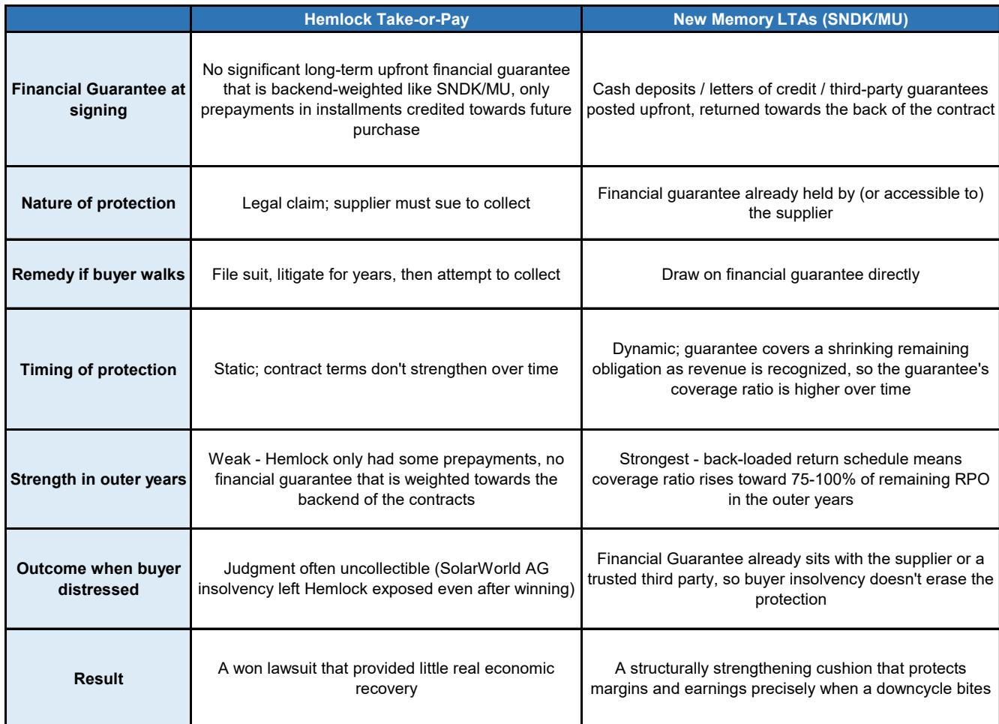
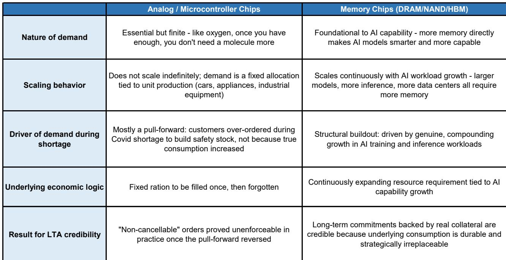
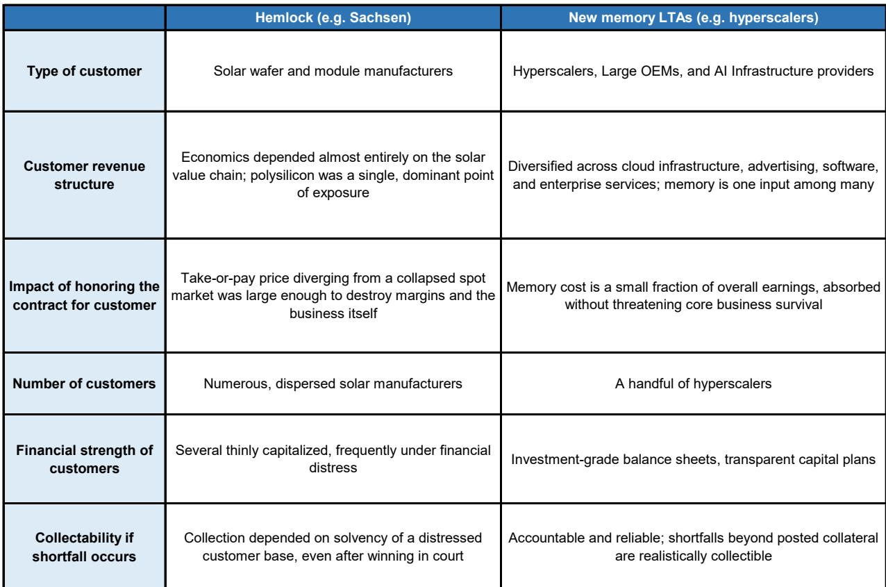

# 新型长期协议在结构上不同于以往的半导体合同——这改变了风险评估方式

半导体行业在长期协议方面有着漫长而痛苦的历史，这些协议在市场环境变化时往往难以维系。那些将当前这一波存储芯片长期协议仅仅视为又一次过度承诺周期的观察者，可能忽略了这次真正不同的地方。新协议不仅仅是法律语言包装下的数量保证。它们代表了存储芯片供应商与其客户之间风险分配方式的结构性转变。

这些合同与其前身相比有三个显著特征：后端加重的预付款财务承诺、拥有稳健资产负债表的交易对手，以及由结构性人工智能基础设施建设而非暂时性短缺驱动的需求。综合来看，这些变化意味着存储芯片供应商首次拥有了实质性的下行保护。但这种保护并非无限。了解其边界在哪里，与认识其起点同样重要。

其中的利害关系很大。存储芯片公司正基于这些长期协议将支撑其观点的假设，投入数百亿美元建设新的制造产能。如果这些合同被证明像Microchip优先供应计划或Hemlock多晶硅协议一样脆弱，由此导致的盈利下滑将十分严重。如果它们能支撑其观点，那么存储芯片公司盈利可持续性的论证将发生根本性改变。这两种结果之间的差异，取决于大多数观察者尚未仔细审视的合同结构。

## 那些失败的早期长期协议在结构上无法保护供应商

Microchip的案例是大多数半导体行业观察者都记得的。在疫情期间的短缺时期，Microchip推出了优先供应计划，要求客户维持12个月不可取消、不可重新安排的订单积压，以换取有保障的制造产能。当需求恢复正常后，该计划便崩溃了。客户通过重复下单和提前采购积累了大量库存。他们干脆停止提货。由于合同缺乏买方的任何预付款财务承诺，Microchip没有有效的追索手段。该公司净销售额下降了42%，因为它被迫故意减少出货量，让客户消化库存。

Hemlock的案例不那么广为人知，但对当前的存储芯片周期更具参考价值。Hemlock Semiconductor与太阳能组件制造商签订了10至14年的照付不议合同，固定价格为每公斤40至60美元。当中国多晶硅产量充斥市场、现货价格跌至15美元以下时，客户面临一个选择：履行合同并以巨额亏损生产组件，或者违约。许多人选择了违约。Hemlock赢得了总计数亿美元的法律判决，但这些现金大部分无法收回，因为交易对手已经资不抵债。这些合同有法律约束力，但这种约束力只能在法庭上发挥作用，而当它发挥作用时，对方已经无力支付。

这两个案例都有一个共同的缺陷。这些合同产生的义务只能通过诉讼来强制执行，而交易对手的资产负债表薄弱，无法在市场低迷中存活足够长的时间来支付。新的存储芯片长期协议直接解决了这两个问题。

## 后端加重的预付款财务承诺在最关键处提供了实质性下行保护

新的存储芯片长期协议中最重要的结构创新是要求客户在合同开始时存入现金、提供信用证或第三方担保。这些并非象征性的承诺。它们是真正的抵押品，如果买方违约，供应商可以动用。关键的设计特点是这些财务承诺是后端加重的。剩余财务承诺占剩余采购义务的比例会随着时间的推移而大幅增加。

这一点很重要，因为买方违约的风险在合同生命周期内并非均匀分布。在早期，买方仍在接收产品，市场仍然强劲。买方放弃合同的风险较低。在后期，市场可能已经转向，买方已经获得了大部分价值，此时违约的诱惑最大。后端加重的设计确保供应商在最需要保护的时候拥有最大的保护。

观察者应该就任何存储芯片公司的长期协议组合提出一个具体问题：在合同的最后两年，财务承诺与剩余采购义务的覆盖率是多少？如果该比率接近75%至100%，那么供应商就拥有针对摧毁Hemlock的那种情景的有效保护。如果比率较低，则该合同更接近Microchip模式。

## 交易对手质量改变了执行考量

第二个结构性差异是交易对手的质量。签署新存储芯片长期协议的买方是超大规模云运营商和大型人工智能基础设施建造商。这些公司拥有投资级的信用评级、多元化的收入来源以及能够承受多个季度不利条件的资产负债表。它们不是资本薄弱的太阳能组件制造商或中型工业分销商。

这从两个方面改变了执行考量。首先，这些交易对手即使在严重低迷时期也不太可能资不抵债。其次，它们拥有的声誉资本远远超过任何单一合同的价值。一个在存储芯片长期协议上违约的超大规模企业，将在未来数年损害其从任何半导体供应商处获得供应的能力。声誉成本作为一种额外的执行机制，是任何法律条款都无法复制的。

对观察者而言，这意味着合同质量不能仅通过阅读条款来评估。交易对手的身份与法律语言同样重要。一份与弱交易对手签订的、条款强硬的长期协议仍然脆弱。一份与强交易对手签订的、条款适中的长期协议可能更持久。

## 结构性人工智能需求创造了与周期性提前采购不同的激励结构

第三个区别是驱动这些合同的需求性质。Microchip的长期协议基于由重复下单和提前采购放大的暂时性短缺。当短缺结束时，需求消失了。Hemlock的合同基于政策驱动的太阳能繁荣，当中国补贴造成大规模产能过剩时，这种繁荣发生了逆转。

当前的存储芯片长期协议由人工智能基础设施建设支撑。这不是暂时的激增。主要的超大规模企业正在规划到2030年及以后的数据中心容量。高带宽内存和其他先进存储产品是人工智能训练和推理的关键制约因素。存储芯片短缺的代价不仅仅是收入损失；它是在决定未来十年技术领导地位的竞赛中失去竞争优势。

这为买方履行承诺创造了根本不同的激励。放弃长期协议以节省存储芯片成本，将冒着延迟人工智能基础设施部署的风险。对于一家超大规模企业而言，延迟的代价远远超过重新谈判存储芯片合同可能带来的任何节省。与短缺的成本相比，长期协议下存入的保证金微不足道。

## 报告尚未完全回答的问题

对新型存储芯片长期协议的分析留下了一些重要问题尚未解决。首先，这些合同尚未在严重低迷时期得到检验。当前环境的特点是需求强劲、供应紧张。真正的考验将出现在存储芯片价格大幅下跌时，无论是由于需求疲软还是供应增加。当买方自身面临来自其观察者的盈利压力时，后端加重的财务承诺将如何支撑其观点？

其次，报告没有涉及存储芯片供应商对少数交易对手的总体风险敞口。如果三家超大规模企业占一家存储芯片公司基于长期协议收入的60%，那么即使单个合同结构良好，一个交易对手的违约也可能是毁灭性的。集中度风险是一个组合问题，无法通过改进单个合同条款来解决。

第三，这些合同在不同司法管辖区的法律可执行性仍不确定。存储芯片供应商是在多个法律体系下运营的全球性公司。一份在特拉华州可执行的合同，在中国的破产程序中可能会面临不同的处理。报告承认，即使是Hemlock的法律胜利，由于管辖权问题，在商业上也是空洞的。

这些并非对分析的批评。它们是任何认真的观察者在基于长期协议论点做出决策之前，应该提出的自然后续问题。

## 评估存储芯片长期协议质量的决策框架

对于分析存储芯片公司的观察者，以下框架有助于区分那些提供真正下行保护的合同和那些仅仅是表面功夫的合同。

首先，检查财务承诺结构。合同是否要求预存现金、提供信用证或第三方担保？最后两年的覆盖率是多少？后期覆盖率低于50%的合同应被视为更接近Microchip模式。

其次，评估交易对手质量。买方的信用评级如何？其收入集中度如何？他们对长期协议所涵盖的特定存储产品的依赖程度如何？一个没有该存储芯片就无法运营的买方，比一个可以寻找替代品的买方更不可能违约。

第三，评估需求驱动因素。合同是由结构性人工智能建设支撑，还是由周期性需求驱动？与到2030年数据中心扩张相关的合同，比那些与暂时性短缺或政策驱动繁荣相关的合同更持久。

第四，考虑组合集中度。来自前三大交易对手的长期协议风险敞口占总敞口的百分比是多少？供应商是否在随时间分散其交易对手基础？

第五，测试下行情景。如果存储芯片价格下跌50%，需求下降30%，供应商实际能收回多少长期协议收入？答案取决于财务承诺结构、交易对手偿付能力以及买方在压力下履行合同的激励。

## 有待深入研究的分析性问题

新型存储芯片长期协议代表了相较于以往半导体合同的真正结构性改进。预付款财务承诺、高质量交易对手和结构性人工智能需求的结合，创造了该行业此前未曾有过的下行保护水平。那些将这些合同视为又一次过度承诺周期的观察者，可能低估了存储芯片公司盈利的可持续性。

但这些合同尚未在低迷时期得到检验。保护的真正持久性只有在市场转向时才会变得清晰。那些尚未回答的问题——关于集中度风险、司法可执行性和总体风险敞口——正是应该推动更深入分析的问题。

加入社区阅读完整报告并查看原始图表。

*仅供参考。部分内容可能基于源材料通过人工智能辅助生成、翻译、总结或编辑，可能存在遗漏或错误。请独立核实。这不构成专业建议。*

仅供参考。部分内容可能基于源材料通过人工智能辅助生成、翻译、总结或编辑，可能存在遗漏或错误。请独立核实。这不构成专业建议。

