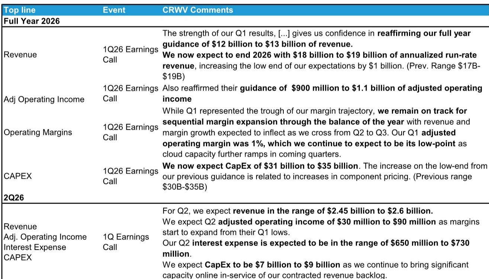
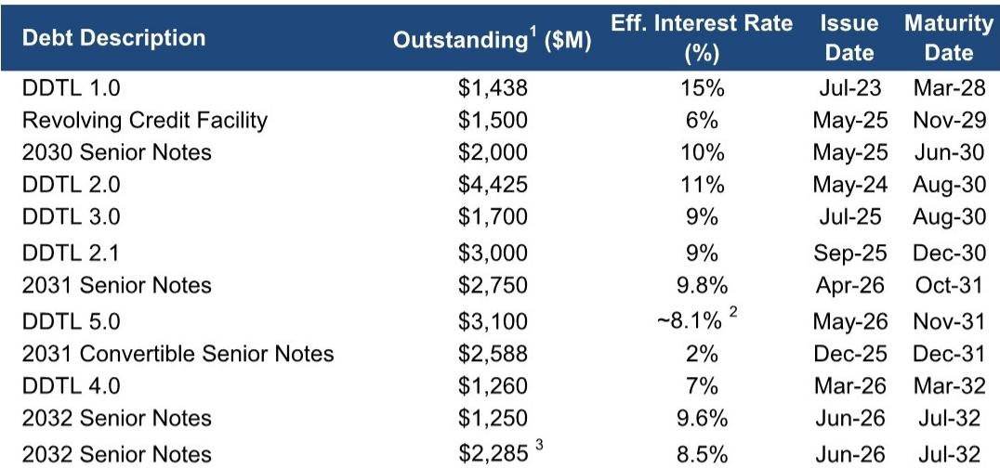
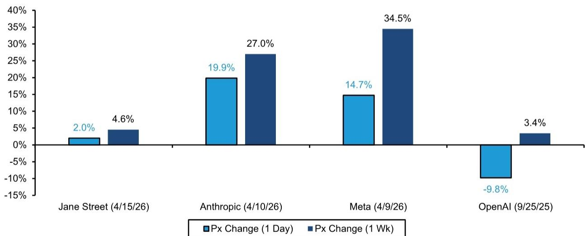

# CoreWeave’s Second Quarter Will Be a Bridge, Not a Catalyst: The Real Earnings Power Remains Hidden Until Late 2026

CoreWeave enters its second-quarter earnings season as a company that has already sold out its 2026 capacity and much of its 2027 pipeline. The demand side of the narrative is clear and largely priced in. The problem is that revenue recognition lags capacity deployment by months, and the company's massive capital structure means that every quarter of delay in power coming online compresses margins and magnifies interest costs. For observers, the second quarter is likely to be uneventful in terms of reported numbers, but it will be critical for one reason: it will set the baseline for whether the second-half ramp can deliver the step-change in profitability that the current valuation requires.

The market has already demonstrated a pattern of punishing CoreWeave after earnings releases, with the stock falling 11 to 38 percent in the week following each of the last three quarterly reports. This is not a reflection of weak demand or poor execution in an absolute sense. It reflects a structural mismatch between the forward-looking nature of the company's contract wins and the backward-looking nature of its financial statements. When CoreWeave announces a multi-billion-dollar deal with a hyperscaler, the stock rallies. When it reports earnings that show negative net income and thin adjusted operating income, the stock sells off. The second quarter is unlikely to break this pattern.

The research thesis for CoreWeave hinges on a narrow set of operational variables that will not be resolved in the August report. Observers should treat the second quarter as a data-gathering exercise, not a decision point. The real question is whether the company can execute on its power ramp to 1.7 gigawatts by year-end while maintaining project-level margins above 21 percent and keeping fitout periods under eight weeks. Until those variables are confirmed, the stock remains a show-me story with limited upside and significant downside if any of them slip.

## The Second Quarter Is a Holding Pattern Because Revenue Timing, Not Demand, Is the Constraint

CoreWeave has been explicit that power is expected to begin coming online in the back half of the second quarter, with the majority of the ramp weighted toward the second half of the year. This means that the second quarter's revenue will reflect only a partial contribution from newly energized capacity, and the company's guidance for adjusted operating income of 30 to 90 million dollars implies a second half that must generate 790 million to 1.05 billion dollars in AOI to hit the full-year target. That is a dramatic step-up, and it requires near-perfect execution on power delivery, customer acceptance, and margin normalization.

The company's backlog has grown to 99.9 billion dollars as of the first quarter of 2026, up from 66.8 billion at the end of fiscal 2025. This is not a demand-constrained business. The constraint is operational: every megawatt of power that comes online later than planned pushes revenue recognition into future quarters and adds lease, power, and depreciation costs to the current period without corresponding revenue. The company has described first-quarter margin pressure as timing-based rather than economic, noting that margins typically normalize by the third month after a powered shell becomes operational. If that timeline holds, the second quarter may show only modest margin improvement, with the real inflection point coming in the third and fourth quarters.

Observers should not expect a significant upward revision to guidance in the second-quarter report. The company has already reaffirmed its 2026 revenue range of 12 to 13 billion dollars and its AOI range of 900 million to 1.1 billion. With the second quarter expected to be the low point for margins, the guidance is already built around a back-half-weighted recovery. Any deviation from that path will be interpreted negatively, but a simple confirmation of existing guidance is unlikely to move the stock meaningfully.

## The Margin Profile Reveals a Business That Cannot Afford Operational Slippage

CoreWeave's adjusted operating margin has been volatile and, in recent quarters, disappointing. The first quarter of 2026 showed an AOI margin of 16 percent, which was a miss relative to expectations. More concerning is the trajectory: adjusted operating income fell from 217 million in the third quarter of 2025 to 88 million in the fourth quarter and then to 21 million in the first quarter of 2026. The company attributes this to the timing of capacity coming online, and the sequential step-up implied by the guidance is steep. But the margin compression is not purely a function of timing. It also reflects the cost structure of a business that is spending billions on capex every quarter while carrying over 20 billion dollars in debt.

The interest expense dynamic is particularly important. CoreWeave's quarterly interest expense has grown from 264 million in the first quarter of 2025 to 536 million in the first quarter of 2026. The company has made progress in reducing its effective interest rate, which has declined by 270 basis points year over year. But the absolute level of debt continues to rise as the company funds its capex program. Even with improving financing terms, the interest burden will remain a significant drag on net income for the foreseeable future. The company is not expected to report positive adjusted EPS in fiscal 2026 or 2027 according to current estimates.

The key margin metric to watch is project-level contribution margin, which the company has indicated needs to remain above 21 percent to hit its full-year AOI target. If margins fall below that threshold, or if the average fitout period extends beyond eight weeks, the full-year guidance will be at risk. The second-quarter report will provide some data points on these metrics, but the real test will come in the third quarter, when a larger portion of the new capacity should be fully operational and contributing at normalized margins.

## The Financing Constraint, Not Demand, Is the Binding Limit on Growth

CoreWeave's management has been candid that the biggest growth challenge is financing, not demand. The leasing environment remains hot, and the company is becoming increasingly strategic about how it allocates capacity among customers. But every new data center requires billions of dollars in upfront capex, and the company's balance sheet is already stretched. The debt structure includes multiple tranches of delayed draw term loans and senior notes with maturities ranging from 2028 to 2032, and the total debt outstanding exceeds 25 billion dollars.

The company's ability to continue financing its growth depends on its ability to demonstrate improving unit economics and a clear path to positive free cash flow. As long as the market believes that the current capex cycle will eventually generate high returns on invested capital, the financing will remain available. But any sign that margins are structurally lower than expected, or that power delivery timelines are slipping, could cause the cost of capital to rise or the availability of financing to tighten.

This is a business where the balance sheet and the income statement are tightly linked. Every quarter of delayed revenue recognition adds to the debt burden and pushes out the timeline to free cash flow breakeven. The company has made progress on reducing its cost of capital, but the absolute level of debt continues to grow. Observers should watch for any commentary in the second-quarter report about the company's financing plans for 2027 and beyond, as well as any changes in the terms of existing debt facilities.

## What the Report Does Not Fully Answer: The Sustainability of the Backlog Conversion Rate

CoreWeave's backlog has grown to 99.9 billion dollars, but the conversion of that backlog into revenue depends on the company's ability to deliver capacity on schedule. The backlog includes contracts that extend into 2028 and beyond, and the terms of those contracts are not fully disclosed. Key open questions include the extent to which customers have the ability to cancel or delay deployments, the pricing escalators built into long-term contracts, and the proportion of backlog that is attributable to customers with investment-grade credit ratings.

The company has disclosed that its largest customer represented approximately 45 percent of revenue in the first quarter of 2026, and that customer concentration remains a risk. While the company has made progress in diversifying its customer base, the hyperscaler customers that drive the majority of demand also have significant bargaining power. If market conditions shift and hyperscalers decide to slow their AI infrastructure buildout, CoreWeave could face pressure on pricing or contract terms.

Another unresolved question is the unit economics of the newer, larger contracts that the company is signing. The company has indicated that it expects larger, longer-dated contracts to be the foundation of the business going forward. But these contracts may have different margin profiles than the earlier, smaller deals. Without more granular disclosure on contract-level margins, observers are left to infer the economics from aggregate data, which introduces significant uncertainty.

## A Decision Framework for Observers: Three Variables That Determine the Outcome

Observers evaluating CoreWeave should focus on three variables that together determine whether the company will meet its 2026 targets and build a foundation for sustainable profitability.

The first variable is the power ramp. The company has guided to 1.7 gigawatts of operational power by year-end 2026. Every quarter, the incremental power added should be compared to that trajectory. If the company is on track to hit 1.7 gigawatts, the revenue and margin ramp in the second half becomes more credible. If the pace of power additions slows, the full-year guidance will be at risk regardless of demand.

The second variable is the margin trajectory. The company's guidance implies that adjusted operating income will increase from 21 million in the first quarter to a run rate that supports 900 million to 1.1 billion for the full year. That implies a dramatic improvement in margins in the second half. Observers should track the sequential change in AOI margin each quarter and compare it to the company's guidance for the year. If margins do not show clear improvement by the third quarter, the full-year target will be difficult to achieve.

The third variable is the cost of capital. CoreWeave's ability to finance its growth depends on maintaining access to debt markets at reasonable rates. Observers should monitor the company's effective interest rate and its ability to refinance existing debt as it matures. Any increase in the cost of capital would reduce the returns on the company's massive capex program and could force a slowdown in the growth trajectory.

These three variables are interconnected. A delay in the power ramp reduces revenue and compresses margins, which in turn increases the company's reliance on debt financing. A rise in the cost of capital makes the margin problem worse. The second-quarter report will provide data on all three variables, but the resolution of the research thesis will not come until the third and fourth quarters, when the back-half ramp either materializes or fails to materialize.

## The Second Quarter Is a Data Point, Not a Catalyst

For observers who are considering a position in CoreWeave, the second-quarter earnings report is unlikely to provide a decisive signal. The company is in a holding pattern, waiting for its capacity to come online and begin generating revenue at scale. The demand is there, the backlog is growing, and the long-term thesis remains intact. But the near-term financial results will continue to be weighed down by the lag between capex and revenue, and the stock will remain volatile until the market sees concrete evidence that the margin trajectory is improving.

The most important thing observers can do between now and the second-half ramp is to build a framework for evaluating the data points that will emerge. Track the power additions, watch the margin progression, and monitor the cost of capital. If all three variables move in the right direction, the second half of 2026 could be a turning point. If any of them slip, the downside risk is significant.

*For informational purposes only. Portions may be generated, translated, summarized, or edited with AI assistance based on source materials and may contain omissions or errors. Please verify independently. This is not professional advice.*

For informational purposes only. Portions may be generated, translated, summarized, or edited with AI assistance based on source materials and may contain omissions or errors. Please verify independently. This is not professional advice.

