## U.S. Equity Strategy

# The Midterm Elections Playbook

Midterm election headwind for equities tends to peak in late summer. Post-midterms, equity demand improves and Tech typically dominates; the sector likes lower policy uncertainty given its global footprint, especially re: trade and national security. Our base case election outcome is divided gov't.

## Key Points & Highlights

- Midterm election year underperformance tends to peak in late summer. Weaker S&P 500 returns in a midterm election year are a well-documented phenomenon, but the effect is not spread evenly across the run-up to election day. The lag vs. non-midterm years is most material in August & September, likely as election-related uncertainty and risk premiums reach their maximum. Our derivatives strategists offer several near-term hedging ideas post-2Q re-risking and amid selectively extended positioning.

- Following the election, risk-on sentiment tends to pick up materially, leading to better-than-average S&P 500 returns over the subsequent year. Tech, Growth and Quality are the most consistent leaders over this time frame, outperforming in all but one of the last nine midterm cycles. We remain Positive on Tech as valuations have come in YTD and expanding AI capex should create EPS headroom for component names. We prefer Growth to Value despite higher rate risk, favoring Growth's EPS upside as revisions breadth is still relatively narrow.

- A reduction in policy uncertainty is the key driver. Over the last few decades, the year after the midterms averages the lowest economic policy uncertainty (EPU) over the 4-year Presidential term, since midterm elections in the modern era tend to produce divided government and hence legislative gridlock and lower policy risk. Tech stocks are among the most reactive to a drop in policy uncertainty, particularly with regard to trade and national security given their global revenue footprint.

- Midterm election outlook is likely a divided government: This year's midterm election is likely to produce one of three outcomes: 1) Republicans retain unified government, 2) a Republican president with Democratic House and Republican Senate (highest probability, in our view), or 3) a Republican president with Democratic House and Senate. Our base case outcome is divided government: a Republican president, Democratic House, and Republican Senate.

- We remain constructive on U.S. equities. Earnings estimate revisions are outpacing index performance YTD, leaving the S&P 500 at ~20x NTM EPS, comfortably below 2/3/5Y average multiples despite meaningful improvement in the growth outlook. Given the typical pickup in 'Year 3' equity returns and the current risk premium implied by still-elevated EPU, we would view any near-term positioning unwind as a buying opportunity, with a bias toward Tech.

FIGURE 1. BARC 2026 & 2027 Year-End Estimates for S&P 500

<table><tr><td></td><td colspan="5">BARC S&P 500 FY 2026 Estimates</td><td colspan="4">BARC S&P 500 FY 2027 Estimates</td></tr><tr><td>Scenario</td><td>EPS</td><td>Growth (yoy)</td><td>PE Multiple</td><td>YE Value</td><td>Upside / Downside</td><td>EPS</td><td>Growth (yoy)</td><td>PE Multiple</td><td>YE Value</td></tr><tr><td>Bull Case</td><td>$343</td><td>22.9%</td><td>24.8x</td><td>8500</td><td>13.3%</td><td>$397</td><td>17.8%</td><td>24.2x</td><td>9600</td></tr><tr><td>Base Case</td><td>$337</td><td>20.8%</td><td>23.1x</td><td>7800</td><td>3.9%</td><td>$389</td><td>15.4%</td><td>22.6x</td><td>8800</td></tr><tr><td>Bear Case</td><td>$329</td><td>17.9%</td><td>19.1x</td><td>6300</td><td>-16.0%</td><td>$380</td><td>12.8%</td><td>18.7x</td><td>7100</td></tr><tr><td>Current S&P 500 Price</td><td></td><td></td><td></td><td></td><td>7,504</td><td></td><td></td><td></td><td></td></tr></table>

As of 6 July 2026.  
Source: Bloomberg, BARC

## Equity returns pre- and post-midterm elections

The "midterm effect" on U.S. equity returns is a well-documented phenomenon. Our prior research established that the S&P 500 tends to deliver materially lower returns in the first 3 quarters of a U.S. midterm election year when compared to other years, which also tends to translate into higher overall volatility and larger maximum drawdowns. In this report, we go into further detail regarding how the midterm elections reshape the trajectory of U.S. equity returns both leading into and following the event, patterns at the style and sector level, and transmission mechanisms through which the elections are likely influencing risk asset pricing.

As mentioned, S&P 500 returns in a midterm election year tend to be weaker than those of other years, but the effect is not spread evenly across the run-up to November. We find the YTD returns differential between midterm and non-midterm years to be most pronounced in the summer months, with the difference in means culminating in ~900 bps of underperformance in September, likely as election-related uncertainty and risk premiums reach their peak. Following the election, risk-on sentiment tends to pick up materially, leading to better-than-average S&P 500 returns over the subsequent year.

FIGURE 2. S&P 500 performance in U.S. midterm election years tends to lag those of other years...  
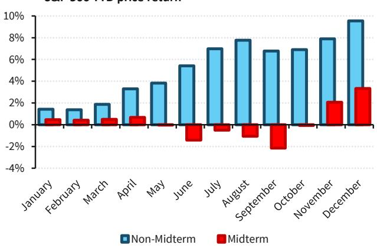  
Price returns, 1930-2025.
Source: Bloomberg, BARC  
FIGURE 3. ...with the YTD return trajectory reshaped most meaningfully in the summer months

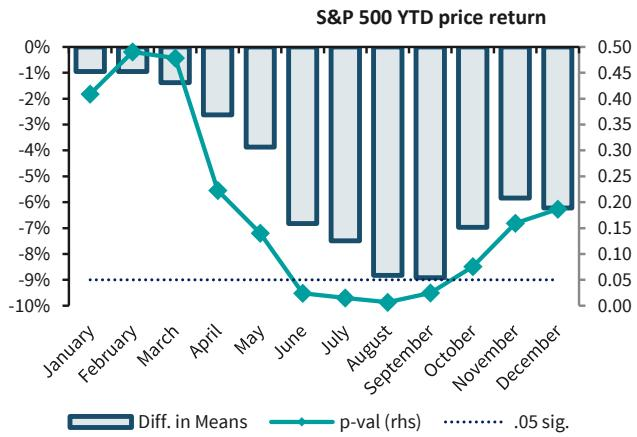  
Price returns, 1930-2025.
Source: Bloomberg, BARC

FIGURE 4. Post-midterms, the S&P 500 typically recovers the previous year's underperformance...  
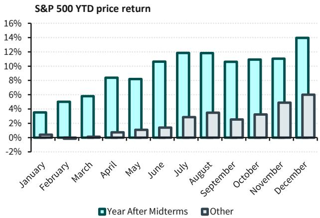  
Price returns, 1930-2025.
Source: Bloomberg, BARC

FIGURE 5. ...by closing the gap meaningfully over the first 3 quarters of 'Year 3'

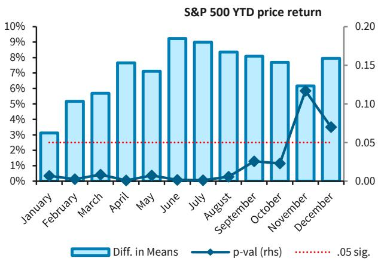  
Price returns, 1930-2025.
Source: Bloomberg, BARC

In terms of long-only style, region and sector index returns heading into the midterms:

- We find that Momentum and Quality outperform on average during midterm election years while Small-cap and Growth underperform, but low hit rates indicate that these excess returns are inconsistent. We believe this is related to the intra-year rotations that we observe in our long/short factor baskets, where factor preferences earlier in the midterm year tend to reverse after the elections.

- Regional equity performances across Europe, Asia and emerging markets are also inconsistent, which average out to underperformance against U.S. equities in midterm election years but with low hit rates.

- Sector returns vary; Healthcare outperformed the S&P 500 and Industrials underperformed during midterm election years more than 75% of the time, while hit rates for other sectors were lower.

Returns ex-post show more consistent patterns: Growth outperformed over the 12 months post-midterms in every election cycle since 1990, averaging +460 bp of excess total return. Quality outperformed in all but one, averaging excess total return of +410 bp. Tech tends to top the sector leader board 12m post-midterms, also outperforming the S&P 500 in all but one election cycle since 1990, with average excess total returns of +1450 bp.

FIGURE 6. Style and region returns are inconsistent pre-midterms; post-midterms favors Growth and Quality

Excess return vs. S&P 500

<table><tr><td></td><td colspan="2">Midterm Year</td><td colspan="2">12m post-Midterms</td></tr><tr><td></td><td>Average</td><td>Hit Rate</td><td>Average</td><td>Hit Rate</td></tr><tr><td colspan="5">Styles</td></tr><tr><td>Momentum</td><td>4.2%</td><td>5/9</td><td>0.7%</td><td>5/9</td></tr><tr><td>Small-cap</td><td>-5.8%</td><td>6/9</td><td>-1.2%</td><td>7/9</td></tr><tr><td>Growth</td><td>-0.6%</td><td>4/9</td><td>4.6%</td><td>9/9</td></tr><tr><td>Value</td><td>-0.1%</td><td>5/9</td><td>-3.7%</td><td>8/9</td></tr><tr><td>Quality</td><td>2.3%</td><td>5/9</td><td>4.1%</td><td>8/9</td></tr><tr><td>Low Vol</td><td>1.4%</td><td>5/9</td><td>-4.6%</td><td>6/9</td></tr><tr><td colspan="5">Regions</td></tr><tr><td>World</td><td>-2.2%</td><td>5/9</td><td>-3.6%</td><td>6/9</td></tr><tr><td>Europe</td><td>-1.4%</td><td>4/9</td><td>-5.3%</td><td>6/9</td></tr><tr><td>Asia ex-Japan</td><td>-4.1%</td><td>5/9</td><td>2.4%</td><td>4/9</td></tr><tr><td>EM</td><td>-6.7%</td><td>6/9</td><td>3.3%</td><td>5/9</td></tr></table>

Total returns, 1990-2025. "Hit rate" refers to sign consistency with the average, i.e., if the average return is positive, hit rate is the number of total observations that were positive.  
Source: Bloomberg, BARC

FIGURE 7. Healthcare tends to outperform, Industrials lag pre-midterms; Tech is a consistent leader post-midterms

<table><tr><td></td><td colspan="2">Midterm Year</td><td colspan="2">12m post-Midterms</td></tr><tr><td></td><td>Average</td><td>Hit Rate</td><td>Average</td><td>Hit Rate</td></tr><tr><td>Tech</td><td>5.2%</td><td>5/9</td><td>14.5%</td><td>8/9</td></tr><tr><td>Telco/Comms</td><td>-2.3%</td><td>6/9</td><td>-0.5%</td><td>5/9</td></tr><tr><td>Discretionary</td><td>-1.1%</td><td>5/9</td><td>1.3%</td><td>6/9</td></tr><tr><td>Staples</td><td>5.0%</td><td>5/9</td><td>-5.3%</td><td>5/9</td></tr><tr><td>Healthcare</td><td>7.7%</td><td>7/9</td><td>-1.7%</td><td>5/9</td></tr><tr><td>Financials</td><td>-3.5%</td><td>5/9</td><td>-0.2%</td><td>6/9</td></tr><tr><td>Industrials</td><td>-2.3%</td><td>7/9</td><td>-0.3%</td><td>5/9</td></tr><tr><td>Materials</td><td>-2.5%</td><td>4/9</td><td>-1.3%</td><td>6/9</td></tr><tr><td>Energy</td><td>6.0%</td><td>6/9</td><td>-8.9%</td><td>7/9</td></tr><tr><td>Utilities</td><td>0.8%</td><td>5/9</td><td>-3.9%</td><td>5/9</td></tr></table>

Total returns, 1990-2025. "Hit rate" refers to sign consistency with the average, i.e., if the average return is positive, hit rate is the number of total observations that were positive.  
Source: Bloomberg, BARC

9 election cycles over 35 years introduces a degree of small sample bias. However, the notable difference in style and sector hit rates between the pre- and post-midterm periods leads us to look further into underlying macro and policy effects that could be influencing equity returns throughout the U.S. Congressional/Presidential election cycle.

## Economic cycles vs. economic uncertainty

The immediate thesis is often that the midterms serve as a clearing event for political uncertainty, thereby removing a temporary overhang for investor risk appetite and paving the way for further equity upside. However, we first wanted to rule out any coincident relationship between the U.S. election cycle and the broader macroeconomic or business cycle. We tested difference of means for a host of macro factors similar to those we use in our earnings and fair value models (including growth, inflation, nominal Treasury yields, real consumption, and financial conditions) between the 4 years of a U.S. general election cycle: inauguration, midterms, 'Year 3' and the Presidential election year.

Although some variables show modest differences in average values across the 4 years of the cycle, analysis of variance suggests that these means do not differ systematically. Year-by-year patterns were generally small relative to ordinary macroeconomic volatility. To be fair, annual average values can miss intra-year timing effects and potentially delayed impacts of policy transmission, but we see little indication that election-cycle variation in these macro series could explain a meaningful proportion of the equity return patterns highlighted in the previous section. Intuitively, this is because macroeconomic cycles are not bound to a 4-year cadence, leading the U.S. midterm elections to land at varying points in the overall macro/business cycle over time.

FIGURE 8. U.S. midterm elections occur at varying points in the macro/business cycle  
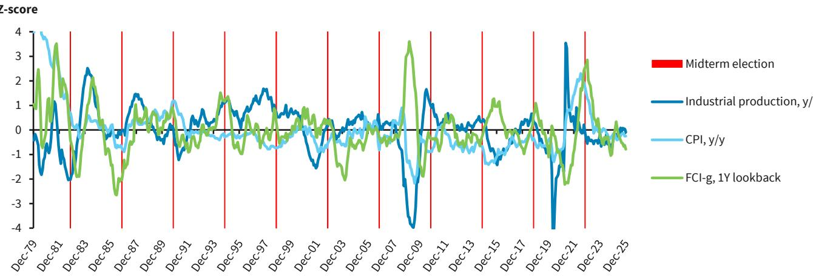  
Source: Bloomberg, BARC

We therefore turn back to policy uncertainty, where we can observe more meaningful election-cycle variation. Economic policy uncertainty (EPU) tends to be at its highest during the first year of a U.S. Presidential term, declining in the second year (the midterms) before bottoming in 'Year 3', then rising again ahead of the next Presidential election. Policy uncertainty during President Biden's term tread a similar path, as it has during President Trump's second term thus far. EPU may be highest in the first year of a presidency because unified government historically has been more common during the first half than the second half of a presidential term.

This matters because U.S. equities are inversely reactive to changes in EPU; declining policy uncertainty correlates with better equity returns and vice versa. Moreover, we find that the rate of change also has a notable effect on equity performance. EPU declining rapidly from elevated levels (essentially a "stress resolution" scenario) tends to coincide with the best S&P 500 returns over a rolling 12m period. We think this contributes to the improvement in U.S. equity returns over the 12 months post-midterms, as 'Year 3' of the election cycle typically sees the biggest Y/Y decline in EPU in any given month.

FIGURE 9. Economic policy uncertainty tends to bottom in the third year of the U.S. election cycle  
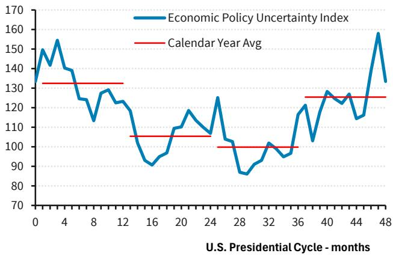  
Rolling 1m level averaged across each month of the U.S. election cycle, 1985-2025. Source: Baker Bloom & Davis, Bloomberg, BARC

FIGURE 10. Policy uncertainty trajectory over Trump and Biden terms  
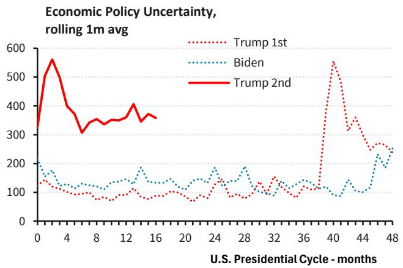  
Source: Baker Bloom & Davis, Bloomberg, BARC

FIGURE 11. Declining policy uncertainty correlates with better U.S. equity returns  
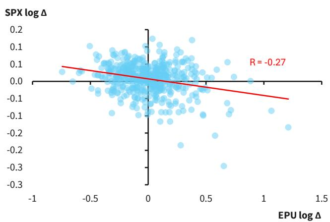  
M/M log change in S&P 500 price & EPU index level, 1986-2025. Source: Baker Bloom & Davis, Bloomberg, BARC

FIGURE 12. Equity returns tend to be best when uncertainty declines rapidly, which typically occurs in 'Year 3'

<table><tr><td colspan="5">Rolling 12m S&P 500 price returns</td></tr><tr><td rowspan="2">Starting EPU Quartile</td><td colspan="4">Econ Policy Uncertainty (EPU) log Δ</td></tr><tr><td>0.20</td><td>-0.20</td><td>-0.40</td><td>-0.60</td></tr><tr><td>Highest</td><td>7.2%</td><td>14.2%</td><td>16.3%</td><td>18.2%</td></tr><tr><td>2nd</td><td>4.0%</td><td>9.6%</td><td>13.3%</td><td>15.5%</td></tr><tr><td>3rd</td><td>10.1%</td><td>13.0%</td><td>15.1%</td><td>16.8%</td></tr><tr><td>Lowest</td><td>10.7%</td><td>12.9%</td><td>14.7%</td><td>13.4%</td></tr><tr><td colspan="5">Avg EPU log Δ by U.S. Presidential cycle year</td></tr><tr><td></td><td>Year 1</td><td>Year 2</td><td>Year 3</td><td>Year 4</td></tr><tr><td></td><td>0.04</td><td>-0.02</td><td>-0.07</td><td>0.16</td></tr></table>

1986-2025.  
Source: Baker Bloom & Davis, Bloomberg, BARC

## Lower uncertainty favors long-duration growth

We return to Tech, Growth and Quality, which outperformed the S&P 500 over nearly all of the 12m post-midterm periods since 1990. For Tech, we find that the sector is less reactive to the starting level of EPU compared to the S&P 500 overall. Instead, what matters more for Tech is simply that EPU is declining; whether uncertainty is high, low, or moderate to begin with, Tech excess returns meaningfully improve over the next 12 months if EPU declines. This likely already contributes to the consistency of Tech excess returns in 'Year 3', but we go one step further and disaggregate headline EPU into its underlying components to see if any relationships can be observed there.

Among the major EPU categories, we find that uncertainties around tax, trade and national security policies tend to decline the most in the third year of the election cycle. At the same time, single-variable regressions indicate that a reduction in national security uncertainty tends to have the largest positive effect on Tech excess returns over any given 12m period, pointing to this category as a likely transmission mechanism for better Tech performance in 'Year 3'. While trade policy at first appears immaterial, we find that the relationship becomes clearer when borrowing the "stress resolution" framework from the previous section: when uncertainty starts high before normalizing, it is trade policy that tends to have the largest positive effect on Tech excess returns.

FIGURE 13. Tech excess returns improve meaningfully when economic policy uncertainty is declining

<table><tr><td rowspan="2">Starting EPU Quartile</td><td colspan="2">Econ Policy Uncertainty (EPU) log Δ</td></tr><tr><td>Up</td><td>Down</td></tr><tr><td>Highest</td><td>1.6%</td><td>6.0%</td></tr><tr><td>2nd</td><td>2.7%</td><td>11.9%</td></tr><tr><td>3rd</td><td>4.4%</td><td>8.6%</td></tr><tr><td>Lowest</td><td>1.0%</td><td>11.4%</td></tr></table>

Source: Baker Bloom & Davis, Bloomberg, BARC

FIGURE 14. Post-midterms, uncertainties around tax, trade and national security policies tend to decline most  
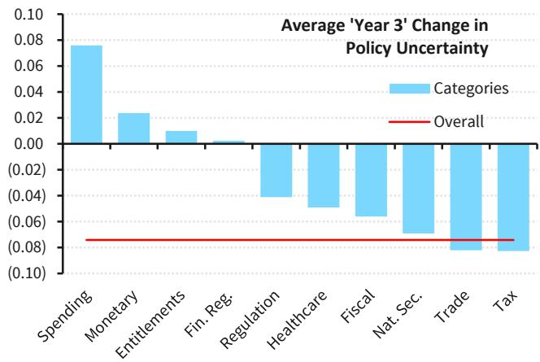  
Source: Baker Bloom & Davis, Bloomberg, BARC

FIGURE 15. Lower uncertainty around national security and monetary policy have the largest positive effect on Tech excess returns  
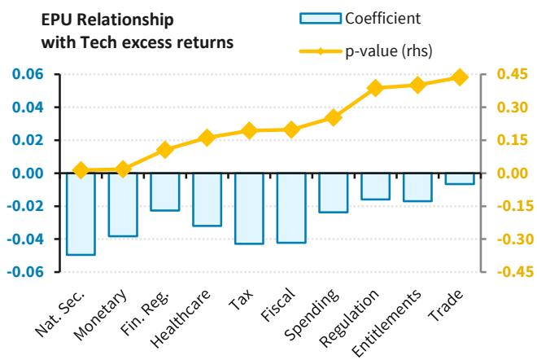

FIGURE 16. When normalizing from "stress" levels, trade policy tends to coincide with greater excess returns for Tech  
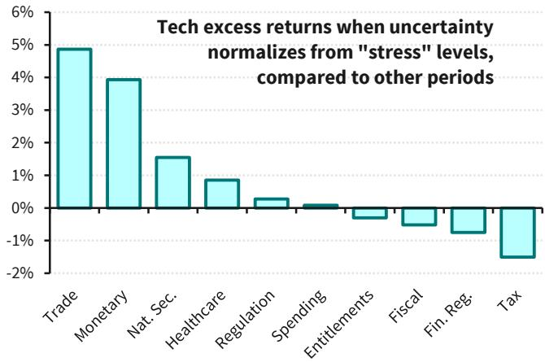  
Single-variable regressions of rolling 12m Tech sector excess returns on Y/Y log change in EPU categories. P-values derived from HAC SEs with 11 lags, to control for serial correlation.  
"Stress" levels defined as top quartile of observations, 1990-2025.  
Source: Baker Bloom & Davis, Bloomberg, BARC  
Source: Baker Bloom & Davis, Bloomberg, BARC

All in, we believe consistent Tech outperformance over the 12m post-midterms is underpinned by the sector's reactivity to declining headline EPU, which itself tends to bottom in the third year of the election cycle. Within EPU categories, lower uncertainty around national security and trade policy (the latter when declining from a high level) emerge as the most likely drivers of Tech excess returns; both typically resolve meaningfully in 'Year 3'. Categorical results may come as a surprise when regulatory or tax policy are popular heuristics in terms of what matters for U.S. Tech. However, we think it makes sense when considering the Tech sector's foreign revenue exposure, which is the highest within the S&P 500. An environment in which both national security and trade policy uncertainties are declining unlocks valuation upside for long-duration multi-national growth equities by improving revenue visibility across their global footprints.

FIGURE 17. Within the S&P 500, Tech has the highest foreign revenue exposure among GICS L1 sectors  
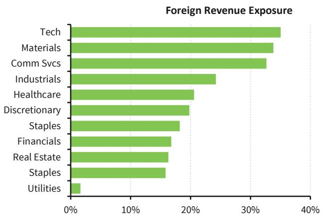

FIGURE 18. Uncertainties around both national security and trade policy are declining, but remain above LT average levels  
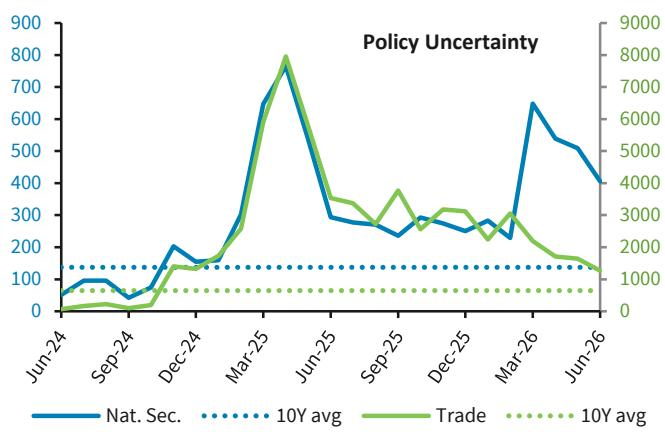  
Based on most recent fiscal year. Exposure weighted by each constituent's contribution to total sector revenue.
Source: Bloomberg, BARC

Interestingly, when it comes to long-only style indices, we find that 'Year 3' Growth outperformance appears to be largely a Tech effect. Growth excess returns are not only highly correlated with Tech excess returns, but controlling for Tech returns shrinks the 'Year 3' Growth outperformance materially. This suggests that the more economically meaningful pattern is not broad Growth outperformance per se, but Tech leadership as EPU normalizes in accordance with typical election-cycle seasonality.

The same cannot be said for Quality outperformance, however. Tech explains only a small share of Quality excess return variation throughout the cycle and the 'Year 3' effect on Quality performance remains observable. This suggests that the bid for Quality over the post-midterm window is both distinct from and concurrent with the rotation into Growth/Tech.

## Election results and effects of party control

The question of whether return patterns vary based on the midterm election outcome and potential combinations of White House and Congressional party control introduces even more small sample bias. However, it's worth considering that what matters from a policy perspective is simply whether the President's party controls Congress or not, as this is the dividing line between "unified" or "divided" government.

Through this lens, S&P 500 returns over the 12 months ending October 31st of any given year (roughly aligned with election timing) tend to be stronger under divided government. Moreover, Tech excess returns (and by association Growth, given our prior analysis) also improve under divided government, when compared to unified. We believe the linkage to policy uncertainty remains material; over the last several decades, divided government has generally overseen lower levels of economic policy uncertainty compared to unified government, suggesting that legislative gridlock reduces policy risk and supports additional equity upside, all else equal. Notably, every midterm election since 1990 except for one (2002) has produced divided government.

FIGURE 19. Oct-Oct S&P 500 returns and sector excess returns under unified vs. divided gov't in any given year  
Avg S&P 500 return & sector excess return, Oct-Oct

<table><tr><td></td><td>Unified</td><td>Divided</td></tr><tr><td>S&P 500</td><td>9.41%</td><td>15.40%</td></tr><tr><td>Tech</td><td>2.85%</td><td>8.26%</td></tr><tr><td>Telco/Comm Svcs</td><td>-3.60%</td><td>-0.14%</td></tr><tr><td>Discretionary</td><td>1.91%</td><td>0.63%</td></tr><tr><td>Staples</td><td>-2.83%</td><td>-1.26%</td></tr><tr><td>Healthcare</td><td>-2.84%</td><td>1.81%</td></tr><tr><td>Financials</td><td>2.10%</td><td>0.27%</td></tr><tr><td>Industrials</td><td>0.96%</td><td>-0.74%</td></tr><tr><td>Materials</td><td>3.00%</td><td>-6.66%</td></tr><tr><td>Energy</td><td>11.39%</td><td>-9.87%</td></tr><tr><td>Utilities</td><td>-2.61%</td><td>-2.28%</td></tr></table>

Total return, 1990-2025. "Unified" is defined as one party controlling the White House and both chambers of Congress at the end of the trailing 12m Oct-Oct window.  
Source: House.gov, Bloomberg, BARC

FIGURE 20. Over the last 4 decades, divided government tended to coincide with lower economic policy uncertainty  
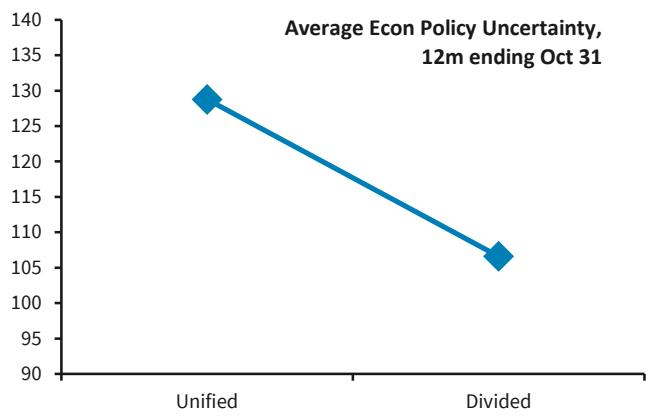  
1986-2025.

FIGURE 21. Nearly all EPU categories average lower levels under divided government  
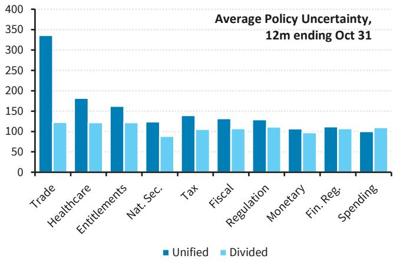  
Source: House.gov, Bloomberg, BARC  
1986-2025.

FIGURE 22. Odds for Republicans to retain control of the House are viewed as low (16%)  
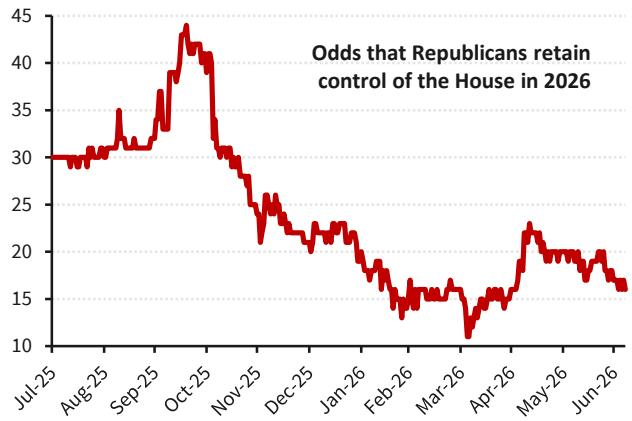  
Source: House.gov, Baker Bloom & Davis, Bloomberg, BARC  
1m average daily volume as of 7/7/2026 = 18,969 contracts. Source: Polymarket, Bloomberg, BARC

## US Public Policy: midterm election outlook

Michael McLean $^{(v)}$ BCI, US

This year's midterm election is likely to produce one of three outcomes: 1) Republicans retain unified government, 2) a Republican president with Democratic House and Republican Senate (highest probability, in our view), or 3) a Republican president with Democratic House and Senate. Our base case outcome is divided government: a Republican president, Democratic House, and Republican Senate.

History suggests that this year's midterm election is well positioned to be another "change" election. In 11 of the 13 elections since 2000, there has been change in party control of the House, Senate, or White House.

Midterms historically have been difficult for the president's party in the House. Since World War II, the president party has lost House seats in 18 of 20 midterm elections, with 1998 and 2002 the only exceptions. House midterms are typically a referendum on the president, and presidential job approval tends to be a strong predictor of midterm election results. In 1998 and 2002, the incumbent president's job approval was in the mid 60s. By contrast, according to polling data, President Trump's job approval has been net negative since March 2025 and currently stands around 40%, below where it was at the same point in his first term. Democrats would need to net 3 seats to win the House majority. Based on current race ratings, Democrats would need to win 72% of competitive seats to take the majority. That threshold may fluctuate as election day approaches and races currently rated as competitive are reclassified as safe Democratic or Republican seats. $^{1}$

The Senate is a more difficult path for Democrats. The President's party also typically loses Senate seats, the last two midterms have been exceptions. Senate outcomes tend to be more idiosyncratic than House results because they depend on the specific seats being contested. Democrats would need to net 4 seats to win control of the Senate, which likely would entail them flipping at least two seats in states President Trump won by double digits in the last election.

In divided government, we expect little legislative activity beyond must-pass items, which may also be a struggle, and heightened oversight.

## Conclusion and recommendations

With AI as the dominant narrative for U.S. equities in 2026, the midterm elections could ultimately take a backseat to 3Q26 earnings season (with which it shares calendar space) and its inevitably heavily-scrutinized updates for capex and memory pricing, among other KPIs. Still, we believe that the historical patterns we observe in this report create potentially actionable opportunities over both the short- and medium-term.

Tactically, the next few months tend to see the widest S&P 500 underperformance compared to non-midterm election years. With U.S. equity fund inflows hitting an all-time record YTD, systematic positioning that could go either way, stock euphoria well above long-term averages, and a growing levered ETP AUM pool that is poised to amplify volatility moves, we could see a scenario in which rising uncertainty into the election triggers a positioning washout. Our derivatives strategists offer several hedging ideas over the near term.

At the same time, we would view any such washout as a buying opportunity. Earnings estimate revisions are outpacing index performance YTD, leaving the S&P 500 at ~20x NTM EPS, comfortably below 2/3/5Y average multiples despite meaningful improvement in the growth outlook. Given the typical pickup in 'Year 3' equity returns and the current risk premium implied by still-elevated EPU, we would look for opportunities to add to positions in 2H26, with a bias toward Tech as both the secular growth engine of U.S. equities and as a likely beneficiary of improved policy visibility.

## Analyst(s) Certification(s):

We, Rex Feng, Venu Krishna, CFA, Riddhiman Dass and Michael McLean, hereby certify (1) that the views expressed in this research report accurately reflect our personal views about any or all of the subject securities or issuers referred to in this research report and (2) no part of our compensation was, is or will be directly or indirectly related to the specific recommendations or views expressed in this research report.

## Important Disclosures:

BARC is produced by the Investment Bank of BARC Bank PLC and its affiliates (collectively and each individually, "BARC"). All authors contributing to this research report are Research Analysts unless otherwise indicated. The publication date at the top of the report reflects the local time where the report was produced and may differ from the release date provided in GMT.

## Availability of Disclosures:

Where any companies are the subject of this research report, for current important disclosures regarding those companies please refer to https://publicresearch.BARC.com or alternatively send a written request to: BARC Compliance, 745 Seventh Avenue, 13th Floor, New York, NY 10019 or call +1-212-526-1072.

The analysts responsible for preparing this research report have received compensation based upon various factors including the firm's total revenues, a portion of which is generated by investment banking activities, the profitability and revenues of the Markets business and the potential interest of the firm's investing clients in research with respect to the asset class covered by the analyst.

Research analysts employed outside the US by affiliates of BARC Capital Inc. are not registered/qualified as research analysts with FINRA. Such non-US research analysts may not be associated persons of BARC Capital Inc., which is a FINRA member, and therefore may not be subject to FINRA Rule 2241 restrictions on communications with a subject company, public appearances and trading securities held by a research analyst's account.

Analysts regularly conduct site visits to view the material operations of covered companies, but BARC policy prohibits them from accepting payment or reimbursement by any covered company of their travel expenses for such visits.

BARC Department produces various types of research including, but not limited to, fundamental analysis, equity-linked analysis,

quantitative analysis, and trade ideas. Recommendations contained in one type of BARC may differ from those contained in other types of BARC, whether as a result of differing time horizons, methodologies, or otherwise.

In order to access BARC Statement regarding Research Dissemination Policies and Procedures, please refer to https:// publicresearch.BARC.com/S/RD.htm. In order to access BARC Conflict Management Policy Statement, please refer to: https://publicresearch.BARC.com/S/CM.htm.

## Other Material Conflicts

One or more of the authoring research analysts (and/or a member of the analyst's household) has long positions in index funds and/or ETFs that are designed to passively track the performance of the S&P 500, Euro Stoxx, FTSE 100, and/or Stoxx 600 Indices.

Unless otherwise indicated, prices are sourced from Bloomberg and reflect the closing price in the relevant trading market, which may not be the last available closing price at the time of publication.

## Risk Disclosure(s)

Master limited partnerships (MLPs) are pass-through entities structured as publicly listed partnerships. For tax purposes, distributions to ML
