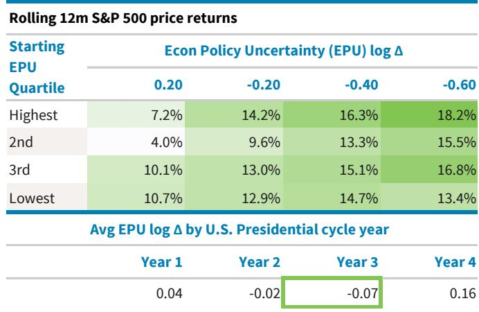

# BARC：BARC拆解选举周期，市场回报高点在政策不确定性触底回升时

中期选举年对市场的不确定性在夏末见顶，但真正的观察窗口在投票之后。BARC这份题为“The Midterm Elections Playbook”的报告，核心判断不是宏观环境周期驱动选举年行情，而是政策不确定性的节奏变化在重塑市场定价。报告指出，中期选举后的一年，标普500往往跑出超额回报，而科技、成长和高质量风格几乎从不缺席领跑者位置。这背后，不是宏观基本面突然转好，而是政策不确定性从高位快速回落的“不确定性解除”效应。

报告基于过去九个选举周期的数据，有一个发现值得决策者留意：中期选举前，标普500的弱势集中在8月和9月，最大回撤和波动率都在这两个月攀升。但选举一过，不确定性偏好迅速修复，此后12个月的回报显著好于非选举年份的平均水平。BARC的基准情景是分裂政府——共和党总统、民主党众议院、共和党参议院，这种格局恰恰是历史上政策不确定性最低的阶段。

> **KC评论：** 报告的核心贡献不是告诉你选举后市场会涨，而是拆解了“为什么涨”——不是宏观环境周期，不是流动性，而是政策不确定性下降。这个框架对资产配置的意义在于，如果后续不确定性没有如期回落，市场逻辑就会动摇。完整报告里对EPU（宏观环境政策不确定性）指数的拆解图值得细看。

## 1. 科技股在选举后领跑，靠的是“不确定性下降”而非估值便宜

很多人会把科技股在选举后的强势归因于AI叙事或盈利增长，但BARC的论证路径不同。报告发现，科技股对政策不确定性的相对水平并不敏感——无论EPU处于高位还是低位，只要它在节奏变化，科技股未来12个月就能跑出超额回报。更关键的是，报告进一步拆解了EPU的子项：国家安全政策不确定性下降，对科技股超额收益的正面影响最大；而在“不确定性解除”场景下，贸易政策不确定性的快速正常化同样效果显著。

这解释了为什么科技股在中期选举后的一致性如此之高——过去九次选举周期中，科技股在随后12个月里有八次跑赢标普500，平均超额回报高达1450个基点。成长风格更是九次全胜。

## 2. 宏观周期不是答案，政策节奏才是

一个容易犯的错误是把选举年的市场节奏归因于宏观环境周期。BARC特意做了验证：他们测试了增长、通胀、名义利率、消费、资金条件等宏观变量在选举周期四年的差异，发现均值差异很小，统计上不显著。换句话说，宏观周期没有绑定四年一次的选举节奏。

真正有规律变化的是政策不确定性。EPU在总统任期第一年最高，第二年（中期选举年）下降，第三年触底，第四年再回升。而标普500回报最好的时段，恰恰是EPU从高位快速下降的“不确定性解除”阶段，这正是选举后第一年（即任期第三年）的典型特征。

> **KC评论：** 这个“不确定性解除”框架比单纯说“选举后市场涨”更有实操价值。报告里有一张热力图显示，当EPU从最高四分位快速下降时，滚动12个月回报接近18%。但报告没有展开的是，如果选举结果出现意外——比如统一政府而非分裂政府——EPU下降路径可能被打破。这部分值得读者去原文看EPU的分解图。

## 3. 报告没有完全回答的问题：这次周期有什么不同？

BARC的分析基于1930年以来的价格数据和1990年以来的风格/行业数据，样本量有限——只有九个选举周期。报告自己也承认存在小样本偏差。更关键的问题是，当前的环境有两个变量是历史数据无法充分覆盖的：一是AI研究周期对科技股盈利的拉动是否已经部分前置；二是地缘政治不确定性（尤其是国家安全政策不确定性）的波动幅度可能远大于历史均值。

报告对2026年和2027年标普500给出了三种情景，基准情形下2026年底目标7800点，2027年底8800点。但这份报告的真正价值不在于点位预测，而在于它提供了一个观察框架：把中期选举视为政策不确定性的“重置开关”，而不是一个孤立的政治事件。对产业决策者而言，更值得追问的是——如果分裂政府格局被打破，或者贸易政策不确定性没有如期下降，科技股的超额收益逻辑还能成立吗？报告没有给出答案，但留下了追问的路径。

For informational purposes only. Portions may be generated,translated,summarized,or edited with AI assistance based on source materials and may contain omissions or errors. Please verify independently. This is not investment,legal,tax,accounting,or other professional advice.

