# US Business Services

## US Waste: A primer on the Renewable Energy segment

Connor Cerniglia, CFA

+1 917 344 8472

connor.cerniglia@bernsteinsg.com

Bridget Alkin

+1 917 344 8359

bridget.alkin@bernsteinsg.com

This note is part of a series expanding on the economics of the Waste Industry, following previous primers covering the Solid Waste Collection, Landfill, and Recycling segments.

At less than 3% of Waste Industry revenue and EBITDA, the Renewable Natural Gas (RNG) is the smallest segment within the waste value chain. Capital requirements are real, but with attractive payoffs, with approximately 90% of profitability stemming from D3 RINs that drive 1.5-3 year payback periods for investments, and EBITDA margins of 40-50% for the RNG segment. RNG facilities capture methane that landfills naturally emit (14% of total US methane emissions), which is then sold to a nearby gas pipeline or used by CNG trucks, generating a D3 RIN. These renewable fuel credits are then sold primarily to oil refiners and importers, who must purchase them to comply with federal Renewable Fuel Standard (RFS) volume mandates.

RNG is high margin and incremental to growth, but introduces materially higher earnings variability. For WM, the Renewables segment should grow from 0.4% of sales in FY23 to 3.7% in FY28E, adding 70bps of growth from FY26-FY28E and approximately 1ppt to EBITDA growth. This is a more recent phenomenon. Historically, methane was flared and generated electricity that was sold back to the grid—an afterthought rarely discussed by investors. The commercial transformation came in 2014, when the US Environmental Protection Agency (EPA) qualified landfill biogas as a D3 cellulosic biofuel, and investments followed in 2018.

With 90% of segment revenue from renewable fuel credits, profitability is ultimately a function of government regulation. The Clean Air Act directs the EPA to set D3 RIN volume targets through a process that grants significant discretion: volumes themselves, small refinery exemptions, and retroactive waivers if production falls short of the mandate—all levers that can suppress or increase RIN prices. In April 2026, the EPA finalized volume through 2027, meaning the next rulemaking cycle will address 2028 volumes. D3 RIN prices reflect policy sensitivity, trading as low as approximately $0.50 in 2019 to approximately $3.75 in 2022, and are currently $2.70.

That said, the D3 RIN program has support from a broad group of stakeholders—infrastructure operators, municipal governments, union labor, CNG fleet producers and operators—that make it politically inexpensive to maintain. Since 2014, the program has survived both Republican and Democratic administrations.

Waste Management, Republic Services, and Waste Connections all invest in RNG facilities, but through a variation of wholly-owned projects (WM), joint ventures (RSG), or a combination of both (WCN). Waste Management was an early strategic leader in RNG, building facilities directly by spending $1.2bn in capex, with consensus calling for $1.1bn in Renewables revenue by FY28E. RSG is pursuing projects through partnerships with BP-owned Archaea Energy and Ameresco with $100m in revenue by the end of the decade, paid out through royalties making the projects highly margin accretive. WCN's hybrid structure means two-thirds of RNG investments are paid as royalties while one-third is recognized in Other Revenue, together adding $150m-$200m in EBITDA by the end of FY2027.

## BERNSTEIN TICKER TABLE

<table><tr><td rowspan="2" colspan="2"></td><td colspan="3">7 Jul 2026</td><td colspan="2">TTM</td><td colspan="4">Adjusted EPS</td><td colspan="3">EV/Adj EBITDA (x)</td></tr><tr><td></td><td rowspan="2">Closing Price</td><td rowspan="2">Price Target</td><td rowspan="2">Rel. Perf.</td><td rowspan="2">Cur</td><td rowspan="2">2025A</td><td rowspan="2">2026E</td><td rowspan="2">2027E</td><td rowspan="2">2025A</td><td rowspan="2">2026E</td><td rowspan="2">2027E</td><td></td></tr><tr><td>Ticker</td><td>Rating</td><td>Cur</td><td></td></tr><tr><td>WM (Waste Management)</td><td>O</td><td>USD</td><td>237.21</td><td>260.00</td><td>(15.9)%</td><td>USD</td><td>7.56</td><td>8.26</td><td>9.23</td><td>15.5</td><td>14.4</td><td>13.3</td><td></td></tr><tr><td>RSG (Republic Services)</td><td>M</td><td>USD</td><td>222.46</td><td>220.00</td><td>(28.7)%</td><td>USD</td><td>7.02</td><td>7.19</td><td>8.07</td><td>15.5</td><td>14.9</td><td>13.9</td><td></td></tr><tr><td>WCN (Waste Connections)</td><td>O</td><td>USD</td><td>172.93</td><td>205.00</td><td>(25.5)%</td><td>USD</td><td>5.15</td><td>5.53</td><td>6.23</td><td>17.1</td><td>16.0</td><td>14.9</td><td></td></tr><tr><td>SPX</td><td></td><td></td><td>7,503.85</td><td></td><td></td><td></td><td></td><td></td><td></td><td></td><td></td><td></td><td></td></tr></table>

O - Outperform, M - Market-Perform, U - Underperform, NR - Not Rated, CS - Coverage Suspended

Source: Bloomberg, Bernstein estimates and analysis.

## INVESTMENT IMPLICATIONS

The purpose of this report is to educate investors on the economics of the Renewables segment. Renewable Energy represents 2-3% of industry sales and EBITDA for waste companies. Despite lower contribution at the total company level relative to other segments, profitability is superior with 40-50% EBITDA margins, tied with the Landfill segment. Roughly half of a landfill's methane is generated within 30 years of closure, although only about half of total emissions are ultimately viable for capture. With landfill closures expected to accelerate over the next decade according to EPA estimates, we expect an acceleration in methane production levels and capture rates, driving an improved outlook for the RNG segment.

We rate Waste Connections Outperform with a $205 PT, Waste Management Outperform with a $260 PT, and Republic Services Market-Perform with a $220 PT.

## AN OVERVIEW OF THE TRADITIONAL SOLID WASTE INDUSTRY

At its most basic level the Municipal Solid Waste Industry collects waste from homes, businesses, and construction sites and disposes of it through a recycling facility or landfill, with the latter often monetizing the methane gas it naturally emits. The industry is typically divided into 5 segments: 1) Collection (Residential, Commercial, and Industrial), 2) Transfer Stations, 3) Recycling, 4) Landfills, and 5) Renewables (Exhibit 1).

EXHIBIT 1: The Waste Industry Lifecycle  
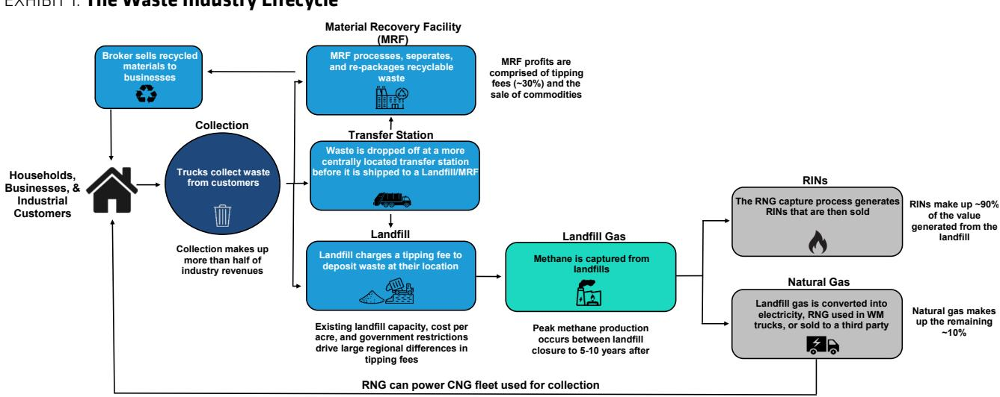  
Source: Company filings, Bernstein analysis

Within Traditional Solid Waste the Collection segment is the largest (55-65% of sales), followed by Landfills (20%), Transfer Stations (10%), Recycling (5-10%), and Renewable Energy (<3%) (Exhibit 2). Renewable Energy is a small but fast-growing segment, that should drive top line growth and margin expansion as facilities continue to come online over the coming years.

Waste Management, Republic Services, and Waste Connections all invest in RNG facilities, but through a variation of company owned investments (WM), joint-ventures (RSG), or a combination of both (WCN). The result, Waste Management is the only company that discloses financials for the segment, whose EBITDA margins are 40-50% at today's current D3 RIN price of $2.25-$2.75, tied as the most profitable segment with the Landfill segment (Exhibit 3). However, earnings variability is dramatically higher—landfill pricing and volumes are very stable, whereas RNG investments are price takers in the RIN market—and more vulnerable to federal legislation. For Republic Services, RNG investments are paid through royalties, not equity method income/loss, making them highly accretive to margins. Waste Connections's hybrid structure means two-thirds of RNG investments are paid as royalties while one-third recognized in Other Revenue.

EXHIBIT 2: The Renewable Energy segment is a small but growing part of the industry, driving 2-3% of industry sales and EBITDA

Traditional Solid Waste Revenue & EBITDA Mix Est by Segment

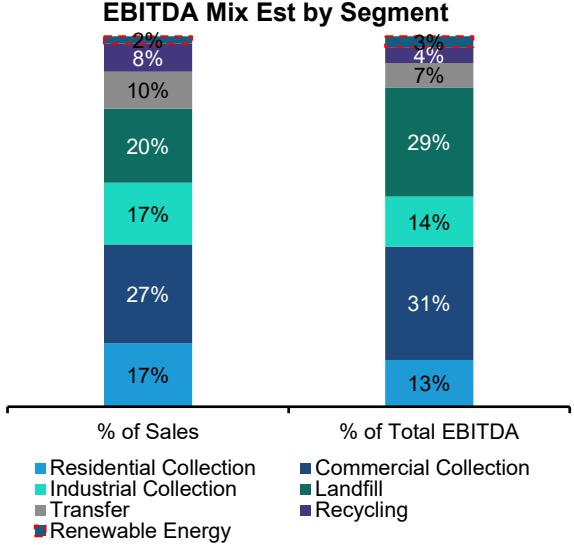  
Source: Company filings, Bernstein analysis and estimates  
EXHIBIT 3: We estimate Renewable Energy margins are attractive at 40-50%, but subject to changes in pricing of RINs or renewable fuel credits  
Traditional Solid Waste EBITDA Margin Estimate by Segment

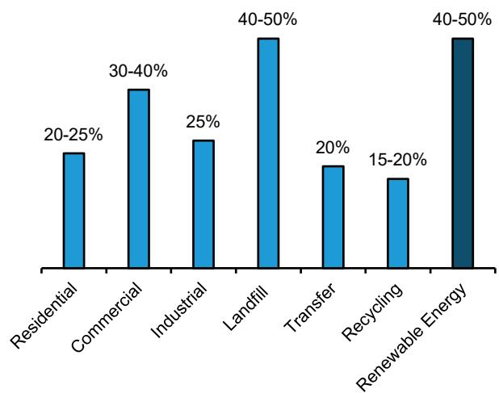  
Source: Company filings, Bernstein analysis and estimates

## RENEWABLES (<3% OF SALES, EBITDA MARGINS OF 40-50%)

The Renewables segment has been through a bit of a transformation over the past several years. Historically methane gas emitted from a landfill was federally required to be treated, which was flared and generated electricity that was sold back to the grid (landfill gas-to-electricity or LFGTE)—an afterthought rarely discussed by investors. Today, catalyzed by federal legislation that created a new environmental compliance credit market for landfill gas (D3 RINs), waste operators are transitioning away from LFGTE to more profitable RNG investments. These projects capture the methane, sell it to a nearby gas pipeline or is used by CNG trucks the companies own. In turn a D3 RIN credit is generated that can be sold into the open market, which generates 90% of sales for RNG investments, while LNG the remaining 10% (Exhibit 4).

For Waste Management, sales for the Renewables segment was $75m in FY2023 (0.4% of sales), driven primarily by LFGTE. This is expected to grow at a 70% CAGR to $1,102m by FY2028E (3.7% of sales and approximately 5% EBITDA) according to consensus, with the increase attributable to RNG investments. We estimate RNG investments will contribute 70bps of growth to the 5.8% CAGR from FY26-FY28E, and will be margin accretive, contributing 1% to EBITDA growth per year to the 7.6% CAGR (Exhibit 5 - Exhibit 6).

EXHIBIT 4: RNG Sensitivity analysis: An estimated 90% of renewable natural gas sales stem from D3 RIN credits, with the remaining 10% actual natural gas sales. Payback periods for these investments are attractive, often 2-3 years excluding one-time tax benefits. However, profitability is highly dependent on D3 RIN pricing, which exhibits high variance. Waste Management attempts to reduce portfolio variance through pre-selling D3 RINs - 50-60% of expected RNG sales are hedged entering the year.  
Bernstein 2026 Renewable Natural Gas Plant Sensitivity Analysis

<table><tr><td colspan="4">Revenue = 11.727 RINs per MMBtu + Natural Gas Price per MMBtu</td><td>▼ Current</td><td colspan="5"></td></tr><tr><td>D3 RIN Price</td><td>$ 2.00</td><td>$ 2.25</td><td>$ 2.50</td><td>$ 2.75</td><td>$ 3.00</td><td>$ 3.25</td><td>$ 3.50</td><td>$ 3.75</td><td>Notes</td></tr><tr><td>RIN per MMBtu</td><td>11.727</td><td>11.727</td><td>11.727</td><td>11.727</td><td>11.727</td><td>11.727</td><td>11.727</td><td>11.727</td><td>Fixed EPA equivalence: each MMBtu of RNG produces 11.727 D3 RINs</td></tr><tr><td>RIN Revenue per MMBtu</td><td>$ 23.45</td><td>$ 26.39</td><td>$ 29.32</td><td>$ 32.25</td><td>$ 35.18</td><td>$ 38.11</td><td>$ 41.04</td><td>$ 43.98</td><td>Primary revenue driver. Product of D3 RIN price × 11.727 EV.</td></tr><tr><td>Natural Gas Revenue per MMBtu</td><td>$ 3.00</td><td>$ 3.00</td><td>$ 3.00</td><td>$ 3.00</td><td>$ 3.00</td><td>$ 3.00</td><td>$ 3.00</td><td>$ 3.00</td><td>Commodity gas revenue indexed to Henry Hub</td></tr><tr><td>Estimated Total Revenue per MMBtu</td><td>$ 26.45</td><td>$ 29.39</td><td>$ 32.32</td><td>$ 35.25</td><td>$ 38.18</td><td>$ 41.11</td><td>$ 44.04</td><td>$ 46.98</td><td>Sum of RIN credit value and commodity gas price per unit</td></tr><tr><td>Est Operating Expense per MMBtu</td><td>$ 5.50</td><td>$ 5.50</td><td>$ 5.50</td><td>$ 5.50</td><td>$ 5.50</td><td>$ 5.50</td><td>$ 5.50</td><td>$ 5.50</td><td>Estimated plant O&M</td></tr><tr><td>SG&A</td><td>$ 0.45</td><td>$ 0.45</td><td>$ 0.45</td><td>$ 0.45</td><td>$ 0.45</td><td>$ 0.45</td><td>$ 0.45</td><td>$ 0.45</td><td>Allocated corporate overhead</td></tr><tr><td>Estimated EBITDA per MMBtu</td><td>$ 20.50</td><td>$ 23.44</td><td>$ 26.37</td><td>$ 29.30</td><td>$ 32.23</td><td>$ 35.16</td><td>$ 38.09</td><td>$ 41.03</td><td>Operating profit per unit</td></tr><tr><td>Estimated Volume (MM MMBtu)</td><td>25.0</td><td>25.0</td><td>25.0</td><td>25.0</td><td>25.0</td><td>25.0</td><td>25.0</td><td>25.0</td><td>Est annual production in millions of MMBtu.</td></tr><tr><td>Estimated Total Revenue ($M)</td><td>$ 661</td><td>$ 735</td><td>$ 808</td><td>$ 881</td><td>$ 955</td><td>$ 1,028</td><td>$ 1,101</td><td>$ 1,174</td><td>Portfolio revenue = per-unit revenue × volume</td></tr><tr><td>Estimated Total EBITDA ($M)</td><td>$ 513</td><td>$ 586</td><td>$ 659</td><td>$ 732</td><td>$ 806</td><td>$ 879</td><td>$ 952</td><td>$ 1,026</td><td>Portfolio EBITDA = per-unit EBITDA × volume.</td></tr><tr><td colspan="10">Capital Investment & Returns</td></tr><tr><td>Total RNG Capex, Gross ($M)</td><td>$ 1,400</td><td>$ 1,400</td><td>$ 1,400</td><td>$ 1,400</td><td>$ 1,400</td><td>$ 1,400</td><td>$ 1,400</td><td>$ 1,400</td><td>Estimated Capex spend</td></tr><tr><td>IRA ITC Benefit ($M) (ended in 2024)</td><td>$ 350</td><td>$ 350</td><td>$ 350</td><td>$ 350</td><td>$ 350</td><td>$ 350</td><td>$ 350</td><td>$ 350</td><td>One-time tax credit of 25-30% of qualified construction costs</td></tr><tr><td>Net Capex After IRA ($M)</td><td>$ 1,050</td><td>$ 1,050</td><td>$ 1,050</td><td>$ 1,050</td><td>$ 1,050</td><td>$ 1,050</td><td>$ 1,050</td><td>$ 1,050</td><td>Capex - reduction in taxes paid due to IRS legislation (expires 2024)</td></tr><tr><td>Payback Period - Gross (Yrs)</td><td>2.7 yrs</td><td>2.4 yrs</td><td>2.1 yrs</td><td>1.9 yrs</td><td>1.7 yrs</td><td>1.6 yrs</td><td>1.5 yrs</td><td>1.4 yrs</td><td>Gross capex ($1.4B) / annual EBITDA at each D3 RIN price scenario</td></tr><tr><td>Payback Period - Net of IRA (Yrs)</td><td>2.0 yrs</td><td>1.8 yrs</td><td>1.6 yrs</td><td>1.4 yrs</td><td>1.3 yrs</td><td>1.2 yrs</td><td>1.1 yrs</td><td>1.0 yrs</td><td>Net capex / annual EBITDA</td></tr></table>

Source: Bernstein analysis, company filings

EXHIBIT 5: Renewable Energy segment margins at approximately 45% are higher than Collection and Disposal margins for WM

WM Segment Adj. EBITDA Margins (FY2025)

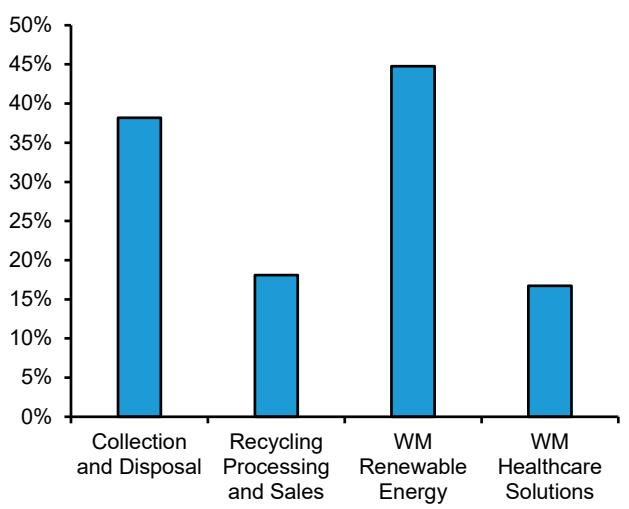  
Source: Company filings, Bernstein analysis  
EXHIBIT 6: Renewable Energy is expected to contribute 15% of WM's FY2026-FY2028E Adj. EBITDA growth  
Bernstein WM FY26-FY28 Adj EBITDA Growth Attribution

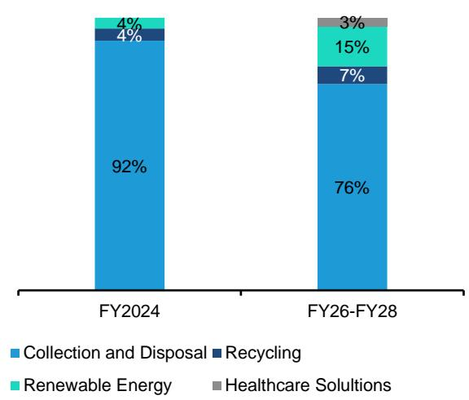  
Source: Company filings, Bernstein analysis

EXHIBIT 7: Methane is captured from landfills and generates a RIN that is sold or it is converted into electricity  
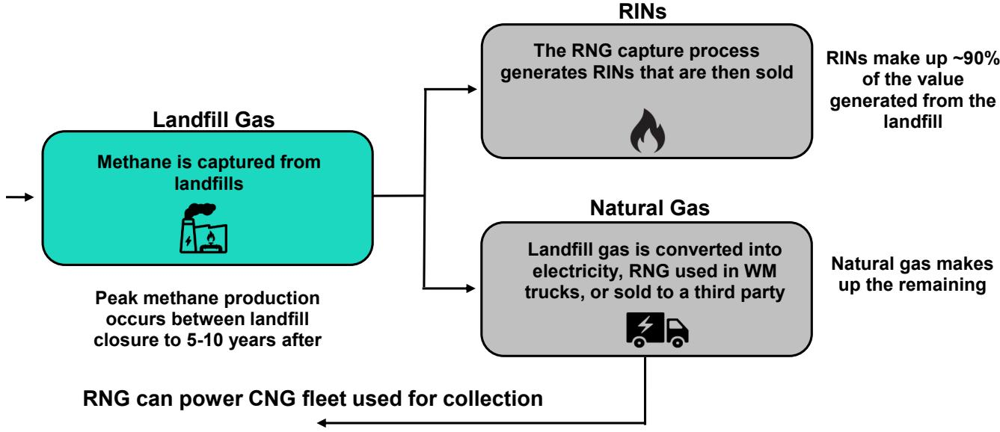  
Source: Company filings, Bernstein analysis

## D3 RIN Political Risks - Volume Obligations, and thus Pricing, are Prone to Politics

Considering approximately 90% of profits stem from government-enabled renewable fuel credits, past changes in legislation were the impetus for investments in methane capture systems. Specifically in 2014 the EPA allowed for landfill biogas to qualify for D3 cellulosic biofuel RINs, in part due to successful lobbying by the Waste Industry, rather than just D5 RINs. This was commercially transformative, as D3 credits traded at a material premium (Exhibit 8). To generate the RIN credit landfill operators must convert biogas to RNG, inject it into a natural gas grid, and demonstrate it displaces a transportation fuel. Further policy changes such as Investment Tax Credits on RNG facilities through the Inflation Reduction Act and the Small Refinery Exemption (SRE) improved project economics.

The Energy Policy Act of 2005 program's stated rationale combined energy security with environmental goals. Landfill gas capture satisfies this, diverting methane from atmospheric release and substituting it for fossil CNG in transportation. Today the US RFS program requires transportation fuels to contain a minimum volume of designated renewable fuels, which is met by refiners or importers of gasoline. These obligated parties can comply with the renewable volume obligation by either producing renewable fuels, or purchasing sufficient RINs. Proponents of landfill gas D3 RIN credits are waste operators, RNG distributors and CNG fleet operators, and the American Biogas Council while opponents include petroleum refiners and sometimes corn ethanol producers who compete for other environmental compliance credits.

The politics behind the environmental compliance credits which benefit the Waste Industry are not as strong as those that benefit the corn ethanol industry. States who grow corn have an important farming constituent base that support ethanol which drives significant corn demand, often placed in swing states, giving it strong political backing. Nonetheless, landfill gas D3 RIN credits have credible support—infrastructure operators, municipal governments, union labor, CNG fleet producers and operators—that make it politically inexpensive to maintain. To date, the legislation has remained despite both republican and democratic presidential administrations.

While recategorization or getting rid of D3 credits are unlikely, political risks still exist, mainly around how renewable volume obligations are set. Since 2022 the Clean Air Act directs the EPA, while working with the Secretary of Energy and Agriculture, to determine volume targets for D3 RIN credits using a process that gives the administration significant discretion. Volume levels themselves are set, small refinery exemptions (a negative for demand), and retroactive waivers issued if production falls short of the mandate, all of which are levers that could work to suppress or increase RIN prices. The debate around D3 credits is less around whether the program survives and more how the EPA calibrates demand year over year, making the annual volume setting process a very important variable in determine RNG project returns. In April 2026 the EPA finalized volume through 2027, meaning the next rule making cycle will address 2028 volumes.

EXHIBIT 8: The 2014 modification to EPA's Renewable Fuel Standard that added landfill gas as a cellulosic biofuel and created the D3 RIN opportunity was the primary catalyst for WM's strategic shift from landfill gas-to-electricity to RNG development, a pivot the company formally accelerated in 2017.  
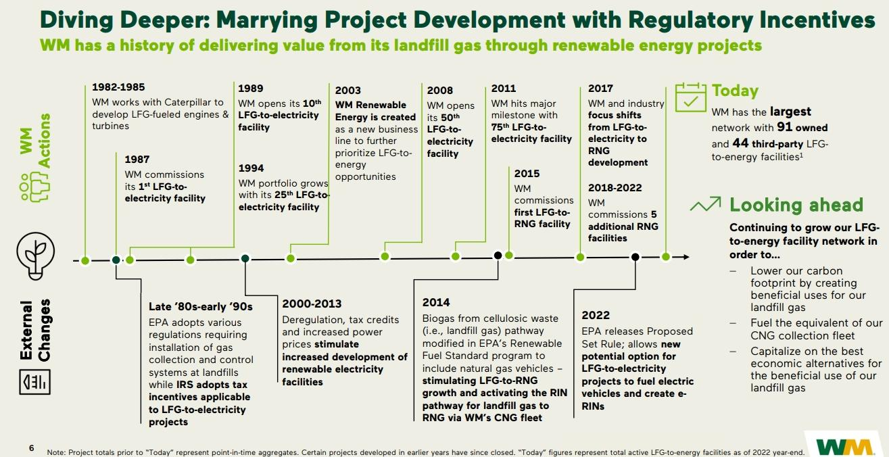  
Source: Company filings (WM Sustainability Growth Investment Program 2023)

## Different RNG Strategies - Wholly owned (WM), JV-owned (RSG), and a Hybrid strategy (WCN)

Waste Management was an early strategic leader in RNG. The company initially announced plans to invest $825m in RNG infrastructure between 2022 and 2025, targeting the development of 17 plants expected to generate $400m in run-rate operating EBITDA in 2026. At its Sustainability Investor Day in early 2023, management increased its targets, raising planned RNG-related capex to $1.215bn over the same period. This update expanded the target to 20 facilities and increased the expected incremental EBITDA contribution to $500m from RNG. By June 2025, Waste Management reaffirmed its $500m incremental EBITDA target but pushed the timeline for achieving this run rate to 2027. Waste Management initially guided to $760-$800m in incremental EBITDA from Sustainability projects including recycling automation and growth initiatives. However, this outlook is now closer to $700m, reflecting headwinds from higher electricity costs and weaker commodity prices, with 23 facilities.

Republic Services set RNG targets in 2022 shortly after Waste Management, announcing a joint venture with Archaea to build 17 landfill gas projects and generate $100m in revenue by the end of the decade. The company is pursuing its RNG projects through partnerships with British Petroleum-owned Archaea Energy and Ameresco, leveraging their Renewables expertise. At the end of last year, Republic Services reported 45 landfill gas-to-RNG projects under development expected to come online in the coming years. Republic Services also has a long-standing 20+ year partnership with Ameresco that provided the foundation for a JV to accelerate RNG development. So far the two have completed 16 RNG facilities across the US. Landfill gas to energy projects are expected to scale through 2029 from an estimated $20m incremental EBITDA in 2025 to $120m incremental EBITDA annually in 2029.

Waste Connections has a more conservative hybrid equity structure, owning and operating one-third of the projects, while outsourcing and collecting royalties on the remaining two-thirds—lowering execution risk but also decreasing potential upside. Waste Connections signed its first facility agreement with Vision RNG in late 2022 signaling its intention to build out RNG infrastructure. FY2022 capex included $75m for Sustainability initiatives, and in 2023 the company announced a $200m investment in 12 RNG facilities expected to generate $200m in incremental annual EBITDA by FY2026, later pushed to FY2027. At the current RIN price, the target is implied to be $150m-$200m run-rate EBITDA by FY2027. Long term, management sees opportunity for a total of 15-20 RNG facilities.

Waste Management's early efforts gave them a first-mover advantage and a several-year head start compared to peers, which in part explains why peers took the JV route, which expedited their RNG investment process. Note this strategy is also risk-reducing—construction is faster and going forward operated by an energy company—but also splits the economics with another party. To minimize D3 RIN pricing risk, Waste Management pre-sells 50-60% of its expected volumes before entering the year, and has 80-90% locked in by the middle of the year, leaving a modest open exposure to the spot market.

## THE LANDFILL GAS PRODUCTION AND CONVERSION PROCESS

Organic waste within landfills decomposes, producing a gas that is approximately 50% methane and 50% carbon dioxide—in total landfills contribute almost 15% of US methane emissions (Exhibit 9). The gas is extracted using wells that have been retrofitted into the landfill and transported to a collection header, where it is processed and purified. Any LFG that is unviable for use is flared to satisfy regulatory and safety requirements.

On average, about 30% of total methane emissions occur while the landfill is in operation, which can last 20+ years. Typically, 50% of total gas production occurs in the first 30 years after the landfill closure, with the remaining 20% produced gradually over the following century. Often, this means that only half of the gas emitted from a landfill is available for collection, and collections systems are built later into a landfill's life (Exhibit 10). According to EPA estimates, landfill closures are expected to accelerate over the coming decade, suggesting methane production levels should also accelerate (Exhibit 11).

Landfill size, access to pipeline infrastructure, and age are key factors determining the economic viability of RNG investments. For Waste Management, planned RNG investments are at landfills that are 2.0-2.5x larger than its median landfill, as initial fixed investments (pipeline infrastructure, separation systems, etc.) are large costs that need to be justified. Location matters as well—roughly 50-80% of RNG facilities are located in the Southern US where existing pipeline infrastructure is well-developed, as close vicinity to long-haul gas transmission pipelines is essential. Waste in place, related to age, is also an important factor—the more trash decomposing the better, ideally between 5-15 years of age. Taken together, these criteria, along with other data, provide a framework for identifying future RNG opportunities.

We see additional EBITDA upside from RNG investments of $500m-$800m for Waste Management, $200m-$400m for Waste Connections, and $75m-$100m for Republic Services beyond what the companies have already announced. Waste Management and Waste Connections have similar upside, an additional 8-10% of incremental EBITDA versus FY2025E, with Republic Services closer to 5-6%. These RNG investments are in addition to the $470m-$500m FY2027 EBITDA announced by Waste Management, $200m FY2027 for Waste Connections, and $120m by FY2029 for Republic Services. Waste Management has the greatest RNG whitespace, with planned RNG investments on approximately 10% of its landfill footprint, below approximately 20% for Waste Connections and Republic Services. However, Waste Connections prioritized smaller landfills first, unlike peers, with a strong pipeline of larger landfills ahead.

We would caution using this analysis as hard estimates. Although the science and economics of methane production are well understood, RNG investments lack consistent standards across projects. Instead, many metrics matter in assessing attractive investments, leaving some level of subjectivity in estimating future projects and revenues associated with them.

EXHIBIT 9: Landfills generate 14% of US landfill emissions

US Methane Emissions by Source (2022)

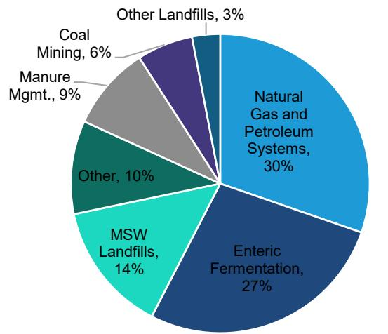  
Source: US EPA, Bernstein analysis  
EXHIBIT 10: 50% of total gas production occurs in the first 30 years after the landfill closure, with the remaining 20% produced gradually over the following century.

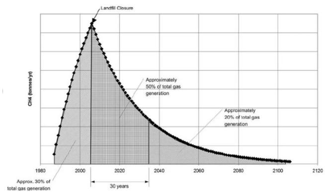  
Source: Department of Environment, Climate Change and Water NSW, Bernstein analysis

EXHIBIT 11: For WM the number of closed landfills increased steadily over the last 5 years

WM Closed Landfills Owned or Controlled

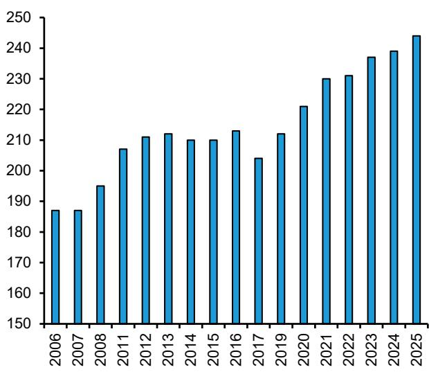  
Source: Company filings, Bernstein analysis

EXHIBIT 12: D3 RIN pricing is exceptionally volatile, ranging from as low as approximately $0.50 in 2019 to approximately $3.75 in 2022  
D3 RIN Prices (2021-2026)  
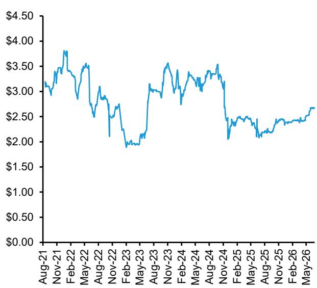  
Source: Bloomberg, Bernstein analysis

## SIZING THE RNG OPPORTUNITY FROM HERE

We believe Waste Management, Waste Connections, and Republic Services have a healthy runway to expand RNG production beyond current targets. While our Waste companies do not lay out explicit facility criteria, our analysis appropriately looks at landfill size, age, expected landfill closure year, geographic location, capacity used and remaining, and LFG percent methane as relevant considerations for new RNG plants.

We initially expected each company to have consistent criteria for RNG plants at its landfills. While we find a number of similarities among each as we laid out earlier in today's note, the criteria vary widely and there is no "one-size-fits-all" landfill for an RNG plant. We view this as a positive as it gives our Waste companies a long runway to pursue strategic opportunities across their assets.

Using criteria for each company, we identify the following landfills as potential RNG investments. Note we use minimum size and number of years left as the main factors based on existing plants, making our assessment of future projects more broad.

Waste Management: Our initial analysis identified 13 landfills with similar characteristics—based on size, age, and gas distribution—to Waste Management's Fairless plant, which management describes as, "the crown jewel of (their) network." Assuming similar economics to Waste Management's 2027 targets—$470-$500m EBITDA from 25m MMBtu—we estimate these 13 landfills could collectively generate 40-50m MMBtu, translating to more than $800m of incremental EBITDA. Expanding this analysis to landfills with similar criteria to other existing plants including landfill size and remaining life, we identify 12 landfill candidates that we estimate could drive 30m-40m MMBtu of RNG or $600m-$800m incremental EBITDA.

Waste Connections: Based on our analysis we identify 13 potential RNG plant candidates that could contribute $200m-$400m in incremental EBITDA beyond 2027. Management has not discussed potential RNG investments beyond the FY2027 guidance but similar to Waste Management we see potential for further growth. EBITDA contribution from the company's 10 existing plants is likely de minimis through 2026 suggesting Waste Connections's 12 new plants in development will drive the bulk of the growth which we expect to impact financial starting in 2027. We estimate incremental plants will add $150-200m in EBITDA in 2027 using a $1.90-$2.50 RIN price and 80 MMBtu of RNG annual (6-7 MMBtu per plant annually). Applying these assumptions to unannounced RNG plants beyond 2027, we see potential for 13 additional RNG facilities to add 15m-20m MMBtu of RNG annually or $250m-$300m incremental EBITDA.

Republic Services: We identify 12 potential RNG facilities that we believe could add $75m-$100m in incremental EBITDA beyond 2029. Republic Services is targeting 45 RNG projects and $120m in annual incremental EBITDA by 2029. Republic Services's RNG plants at the Lee County, Roxana, and Charlotte Motor Speedway landfills are expected to generate between 1.2m and 1.4m MMBtu of RNG annually each, or an estimated 28,000 MMBtu per ton of waste per year based on their size. Looking beyond management's current guidance through 2029 we believe potential RNG plants could drive 30m-40m MMBtu of RNG or $100m incremental EBITDA annually.

## APPENDIX - FINANCIAL FORECASTS

## EXHIBIT 13: Waste Management (WM) Financials

## BERNSTEIN

<table><tr><td></td><td>FY 2019</td><td>FY 2020</td><td>FY 2021</td><td>FY 2022</td><td>FY 2023</td><td>FY 2024</td><td>Q1'25</td><td>Q2'25</td><td>Q3'25</td><td>Q4'25</td><td>FY 2025</td><td>Q1'26</td><td>Q2'26E</td><td>Q3'26E</td><td>Q4'26E</td><td>FY 2026E</td><td>FY 2027E</td><td>FY 2028E</td><td>FY 2029E</td></tr><tr><td colspan="20">Income Statement</td></tr><tr><td>Net Sales
