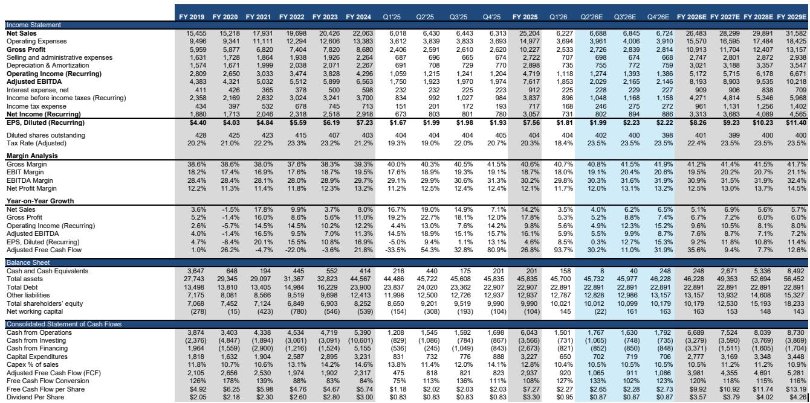
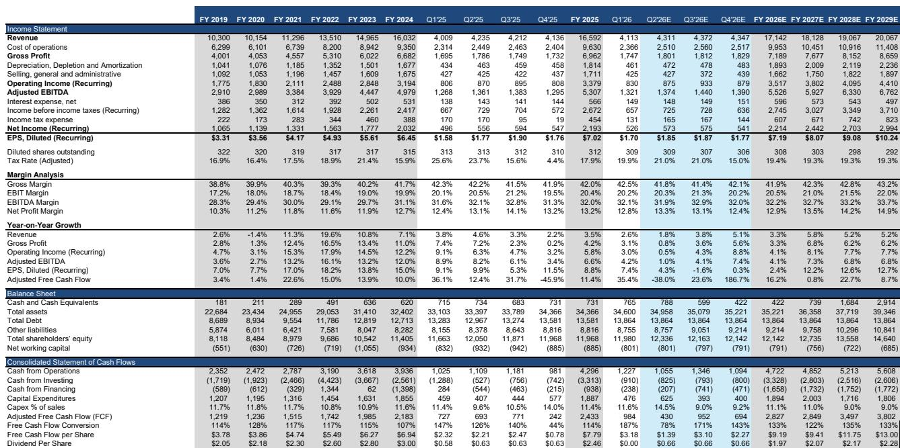
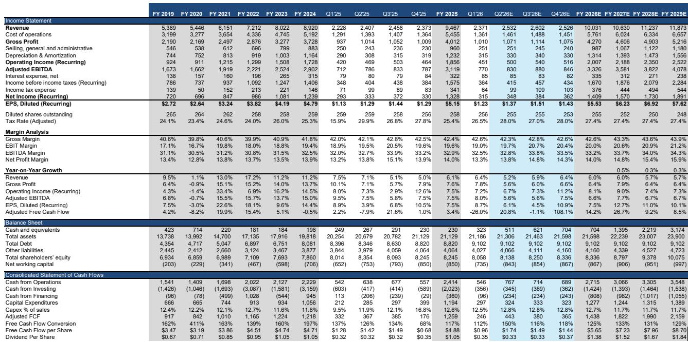

# Renewable Natural Gas Is the Most Profitable Segment in Waste, But Its Returns Depend Entirely on a Political Process Investors Barely Understand

The smallest segment in the waste industry generates the highest margins. Renewable Natural Gas, which accounts for less than 3 percent of industry revenue and EBITDA, delivers EBITDA margins of 40 to 50 percent—tying with landfills as the most profitable part of the waste value chain. For Waste Management, the largest operator, consensus estimates project Renewables revenue growing from $75 million in fiscal 2023 to over $1.1 billion by fiscal 2028, a compound annual growth rate of roughly 70 percent. That growth will add approximately 70 basis points to top-line expansion and contribute about one percentage point to EBITDA growth annually from fiscal 2026 through fiscal 2028.

Yet this high-margin growth story rests on an unusual foundation. Approximately 90 percent of RNG segment revenue comes not from selling gas, but from selling renewable fuel credits known as D3 RINs. These credits are created by federal regulation under the Renewable Fuel Standard and are purchased by oil refiners and importers to meet government-mandated volume obligations. The profitability of every RNG facility is therefore a function of regulatory design, not market demand for the underlying fuel.

This creates a strategic paradox for investors. The waste industry offers stable, inflation-protected cash flows from collection and landfill operations. RNG investments introduce a fundamentally different risk profile: high margin, fast-growing, but tethered to a political process that can shift RIN prices by orders of magnitude. D3 RINs have traded as low as roughly $0.50 and as high as approximately $3.75 over the past decade. At current prices near $2.70, payback periods for RNG facilities run 1.5 to 3 years. A regulatory change that halves RIN prices would push those paybacks beyond the investment horizon most infrastructure assets require.

The question for investors is not whether RNG will grow. It will. The question is whether the market is properly pricing the policy risk embedded in every dollar of RNG EBITDA.

## The 2014 Regulatory Change That Transformed Landfill Gas from an Afterthought into a Strategic Asset

Before 2014, landfill gas was a compliance cost, not a profit center. Federal regulations required landfill operators to capture methane emissions, but the standard practice was to flare the gas or use it to generate electricity for sale back to the grid. Landfill gas-to-electricity was a modest revenue stream, rarely discussed by investors and never treated as a strategic priority.

The turning point came when the Environmental Protection Agency qualified landfill biogas as a D3 cellulosic biofuel under the Renewable Fuel Standard. This reclassification was commercially transformative because D3 credits trade at a material premium to other renewable fuel credits. The logic is straightforward: cellulosic biofuels are harder to produce than corn-based ethanol, so the regulatory system rewards them with higher credit values. Landfill gas, which was already being captured for environmental compliance, suddenly qualified for this premium pricing.

Waste Management recognized the opportunity early. The company began building RNG facilities directly, spending approximately $1.2 billion in capital expenditures on wholly-owned projects. Republic Services pursued a different strategy, forming joint ventures with partners including BP-owned Archaea Energy and Ameresco, paying out royalties that make the projects highly margin accretive. Waste Connections adopted a hybrid structure, with roughly two-thirds of RNG investments paid as royalties and one-third recognized in Other Revenue, together expected to add $150 million to $200 million in EBITDA by the end of fiscal 2027.

The strategic divergence among the three major operators reveals something important about how each company views the risk-reward tradeoff. Waste Management's fully-owned approach captures the full upside of RNG margins but also absorbs the full downside if RIN prices decline. Republic Services's royalty model sacrifices some upside but insulates the company from policy volatility. Waste Connections sits in the middle, hedging its exposure through a mixed structure.

## Why RNG Margins Are So Attractive and So Volatile

The economics of an RNG facility are simple to model and dramatically sensitive to a single variable. Each million British thermal units of RNG produces 11.727 D3 RINs under EPA's fixed equivalence formula. At a D3 RIN price of $2.75, that generates approximately $32.25 in RIN revenue per MMBtu. The natural gas itself adds roughly $3.00 per MMBtu at current Henry Hub prices. Operating expenses run about $5.50 per MMBtu with allocated overhead of $0.45, yielding EBITDA of approximately $29.30 per MMBtu.

At that price point, a facility with 25 million MMBtu of annual production generates roughly $732 million in EBITDA on $1.4 billion of gross capital expenditure, producing a payback period of under two years. Even at a D3 RIN price of $2.00, the payback extends to only 2.7 years. These are exceptional returns for infrastructure assets, and they explain why every major waste operator is investing aggressively in RNG capacity.

But the sensitivity analysis tells a more nuanced story. The entire economic case for RNG shifts if D3 RIN prices fall below roughly $1.00 per credit. At that level, the EBITDA per MMBtu drops to approximately $11.50, pushing the gross payback period beyond seven years. Such a decline is not hypothetical. D3 RINs traded at approximately $0.50 in 2019, a price that would make new RNG investments uneconomic.

Waste Management attempts to manage this risk by pre-selling 50 to 60 percent of expected RNG production entering each year. This hedging program reduces portfolio variance but cannot eliminate it. The remaining unhedged exposure leaves significant earnings at risk if regulatory changes compress RIN prices during the hedging period. For Republic Services and the royalty-dependent portion of Waste Connections's portfolio, the risk is different: lower RIN prices reduce royalty income but do not impair balance sheet assets.

## The Political Economy of D3 RINs Is More Stable Than It Appears, But the Annual Volume Setting Process Creates Real Uncertainty

The conventional wisdom among waste industry investors is that D3 RINs face existential political risk. A change in administration, it is argued, could eliminate the program or reclassify landfill gas to a lower-value credit category. This view underestimates the breadth of the coalition supporting the program.

Landfill gas D3 RIN credits have credible support from infrastructure operators, municipal governments, union labor, and compressed natural gas fleet producers and operators. These stakeholders make it politically inexpensive to maintain the program. Since its creation in 2014, the D3 RIN structure has survived both Republican and Democratic administrations. The program's stated rationale—combining energy security with environmental goals—has broad appeal.

The more nuanced risk lies not in program elimination but in how the EPA calibrates renewable volume obligations each year. The Clean Air Act directs the EPA, working with the Secretary of Energy and Agriculture, to set D3 RIN volume targets through a process that grants significant administrative discretion. The agency can adjust volume levels, grant small refinery exemptions that reduce demand for credits, and issue retroactive waivers if production falls short of the mandate. All of these levers can suppress or increase RIN prices.

In April 2026, the EPA finalized volume obligations through 2027. The next rulemaking cycle will address 2028 volumes. That means the most consequential regulatory decision for RNG profitability is now roughly two years away. The debate is less about whether the program survives and more about how the EPA calibrates demand year over year. But for investors trying to value multi-year RNG investment programs, that distinction offers little comfort.

## What the Report Does Not Fully Answer: How to Value RNG Earnings Within a Waste Company's Portfolio

The report provides a detailed sensitivity analysis of RNG project economics and a clear explanation of the regulatory framework. What it does not fully resolve is the valuation question that matters most to investors: how should RNG earnings be valued relative to traditional waste operations?

Collection and landfill businesses generate stable, predictable cash flows with pricing power linked to inflation and limited competition from new entrants. These businesses trade at premium multiples because their earnings are durable and low-risk. RNG earnings, by contrast, are high-margin but policy-dependent. A dollar of EBITDA from a landfill is not the same as a dollar of EBITDA from an RNG facility, yet the market appears to value them similarly.

The report notes that RNG represents less than 3 percent of industry revenue and EBITDA today, but that share is growing rapidly. For Waste Management, the Renewables segment is expected to reach approximately 5 percent of EBITDA by fiscal 2028. As the share increases, the portfolio's overall earnings quality changes. Investors who focus only on the margin accretion story may miss the volatility that comes with it.

A second unanswered question concerns the terminal value of RNG assets. Landfills have finite lives and require closure and post-closure care. RNG facilities attached to those landfills have similar limitations. Roughly half of a landfill's methane is generated within 30 years of closure, and only about half of total emissions are ultimately viable for capture. The report notes that landfill closures are expected to accelerate over the next decade, which should improve the outlook for methane capture in the near term. But it does not address what happens to RNG asset values as the best capture sites are exhausted and operators must pursue lower-quality or more distant projects.

## A Decision Framework for Investors Evaluating RNG Exposure

For investors trying to assess the RNG opportunity within waste industry stocks, three questions provide a useful framework.

First, what is the structure of the company's RNG exposure? Fully-owned projects capture full upside but carry full policy risk. Royalty-based structures sacrifice some upside but provide downside protection. Joint ventures fall somewhere in between. The optimal structure depends on an investor's view of regulatory stability. Those who believe D3 RIN pricing will remain supportive should favor Waste Management's approach. Those who see policy risk as underpriced should prefer Republic Services's royalty model.

Second, what is the company's hedging strategy? Waste Management pre-sells 50 to 60 percent of expected RNG production. This reduces near-term earnings volatility but does not eliminate it. Investors should examine the duration of hedging contracts, the counterparties involved, and whether the hedging program covers the full cost structure or only the RIN revenue component.

Third, how does the company's RNG investment pipeline align with the EPA's rulemaking calendar? The next volume-setting cycle will address 2028 obligations. Facilities that come online in 2027 and 2028 will be valued based on the regulatory framework established in that cycle. Investors should assess whether a company's capital commitments are concentrated in periods of regulatory certainty or whether they extend into periods where the rules could change.

These questions do not yield simple answers. But they force investors to move beyond the margin accretion narrative and confront the structural risk that makes RNG different from every other segment in the waste industry.

## Join the Community to Read the Full Report and Review the Original Charts

The analysis in this article draws on a detailed research report that includes comprehensive sensitivity tables, segment margin breakdowns, and a comparison of each major operator's strategic approach to RNG investment. The full report contains the original charts showing revenue and EBITDA mix estimates, margin comparisons across segments, and the detailed RNG plant sensitivity analysis that forms the basis for the payback period calculations discussed here.

Join the community to read the full report and review the original charts. The report also includes the analytical framework supporting those views.

*For informational purposes only. Portions may be generated, translated, summarized, or edited with AI assistance based on source materials and may contain omissions or errors. Please verify independently. This is not professional advice.*

For informational purposes only. Portions may be generated, translated, summarized, or edited with AI assistance based on source materials and may contain omissions or errors. Please verify independently. This is not professional advice.

